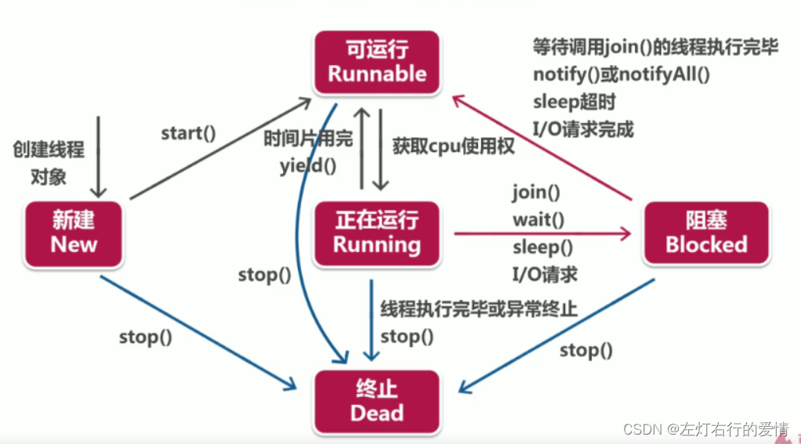

> 原文：[CSDN](https://blog.csdn.net/qq_45852626/article/details/126028316)（历史文章导入，当前状态为草稿）

#### 线程的生命周期
### 前言

在java领域，实现并发程序的主要手段就是多线程，那么知道线程的生命周期是很有必要的。  
 Java语言里的线程本质上就是操作系统的线程，它们是一 一对应的。  
 我们要学好生命周期思路非常简单：只需要搞懂生命周期中各个节点的状态转换机制就可以。  
 虽然不同的开发语言对于操作系统线程进行了不同的封装，但是对于线程的生命周期这部分，基本上是雷同。  
 我们先了解通用的线程生命周期，再去针对学习Java线程的生命周期

### 通用的线程生命周期

通用线程生命周期是一个五个状态的模型：  
   
 我们分别解释一下这五个状态：  
 1：新建（初始状态）：这里指的是线程已经被创建，但是**还不允许分配CPU执行**，这个状态属于编程语言特有的，**仅仅在编程语言层面被创建*，而在操作系统层面，真正的线程还没有被创建*。  
 2：可运行状态：线程可以分配CPU执行。这这种状态下，真正的操作系统线程已经被成功创建了，所以可以分配CPU执行。  
 3：当有空闲的CPU时，操作系统**会将其分配一个处于可运行状态的线程**，被分配到CPU的线程的状态就转换成了运行状态。  
 4：运行状态的线程如果调用了一个阻塞的API（例如以阻塞方式读文件）或者等待某个时间（例如条件变量），那么线程的状态就会转换到休眠状态，同时释放CPU使用权，**休眠状态的线程永远没有机会获得CPU使用权**。当等待事件出现了，线程就会从休眠状态转换到可运行状态。  
 5：线程执行完或者出现异常就会进入终止状态，终止状态不会切换到其他任何状态，进入终止状态也就意味着线程的声明周期结束了。

这五种状态会在不同编程语言简化合并。

### Java线程的生命周期

Java语言中线程有六种状态，分别是：  
 1：NEW（初始化状态）  
 2：RUNNABLE（可运行/运行状态）  
 3：BLOCKED（阻塞状态）  
 4：WAITING（无时限等待）  
 5：TIMED\_WAITING（有时限等待）  
 6：TERMINATED（终止状态）

看上去很复杂，状态类型比较多。但其实在操作系统层面，Java线程中BLOCKED，WAITING，TIMED\_WAITING是一种状态，即前面我们提到的休眠状态。  
 **只要Java线程处于这三种状态之一，那么这个线程就永远没有CPU使用权**。

### Java线程状态转化

#### RUNNABLE与BLOCKED的状态转换

只有线程等待synchronized的隐式锁才会从RUNNABLE转到BLOCKED。  
 而等待的线程获得synchronized隐式锁时，又会从BLOCKED转到RUNNABLE。

那么有个问题：线程调用阻塞式API，是否会转到BLOCKED状态呢？  
 答：  
 在操作系统层面，线程会转换到休眠状态。  
 但是在JVM层面上，Java线程的状态不会发生变化，依旧保持RUNNABLE状态。  
 原因在于：**JVM层面并不关心操作系统调度相关的状态**，等待CPU使用权（操作系统层面处于可执行状态）与等待I/O（操作系统层面处于休眠状态）没有区别，都是在等待某个资源，所以都归入了RUNNABLE状态。

#### RUNNABLE与WAITING的状态转换

有三种情况会发生转换：

1. 获得synchronized隐式锁的线程，调用五参数的Object.wait()方法。
2. 调用无参数的Thread.join()方法。等待中的线程会从RUNNABLE转换到WAITING；  
    而当调用join的线程执行完，等待中的线程从WAITING转到RUNNABLE。
3. 调用LockSupport.park()方法。  
    调用LockSupport.park()方法，当前线程会阻塞，线程状态从RUNNABLE转换到WAITING。  
    调用LockSupport.unpark(Thread thread)可唤醒目标线程，目标线程的状态又会从WAITING状态转换到RUNNABLE。

#### RUNNABLE到TIMED\_WAITING的状态转换

五种场景：

1. 调用待超时参数的Thread.sleep(long millis)方法；
2. 获得synchronized隐式锁的线程，调用带超时参数的Object.wait(long timeout)方法；
3. 调用带超时参数的Thread.join(long millis)方法；
4. 调用带超时参数的LockSupport.parkNanos(Object blocker,long deadline)方法；
5. 调用带超时参数的LockSupport.parkUntil(long deadline)方法。

我们发现，TIMED\_WAITING和WAITING状态的区别，仅仅是触发条件多了超时参数。

#### 从NEW到RUNNABLE的状态转换

1. Java刚创建出来的Thread对象就是NEW状态，而创建Thread对象主要有两种方法(继承Thread或实现Runnable接口)。
2. NEW状态的线程，不会被操作系统调度，因此不会执行。  
    从NEW状态转换到RUNNABLE状态很简单，只要调用线程对象的start()方法就行。

#### 从RUNNABLE到TERMINATED状态

线程执行完run方法后，会自动转换到TERMINATED状态，如果执行run方法时抛出异常，也会导致线程终止。  
 有时候我么需要强制中断run方法执行，因为stop已经被标记@Deprecated不建议使用了，所以调用interrupt是一个很好的选择。

### 总结

理解Java线程各种状态对于诊断多线程Bug非常有帮助，同时对于学习其他语言的多线程编程也很有帮助。
