> 原文：[CSDN](https://blog.csdn.net/qq_45852626/article/details/126045364)（历史文章导入，当前状态为草稿）

### 前言

**乐观锁总是假设最好的情况，每次去拿数据的时候都认为数据不会被修改**，所以不会上锁，只是在更新的时候会判断一下在这期间别人有没有去更新这个数据，主要是由**版本号机制和CAS算法**实现，这里我们主要介绍CAS算法实现。

### 版本号机制

在数据表中加上一个数据版本version字段，它代表数据被修改的次数，当数据被修改时，version值会+1.  
 比如当线程A更新数据值时，在读取数据的同时也会读取version值，在提交更新时，若读到的version值与当前数据库中的version值相等锤更新，否则重试更新操作，直到更新成功。

### CAS算法

#### 概念

1. CAS是CompareAndSwap的缩写，意思是比较并替换。当要进行CAS操作则先要比较**内存地址**和原来预期的内存地址做比较，若相同，则代表这块内存地址没有被修改，可以用新地址替换，否则就说明地址被修改了，取消替换操作。
2. 整个过程是原子操作，注意在没有锁的情况下，要借助volatile原语，保证线程间的数据是可见性的。
3. CAS操作包含三个操作数——**内存位置(V)，预期原值(A)和新值(B)**。如果内存位置的值与预期原值相匹配，那么处理器会自动将该位置值更新为新值。否认不做任何操作。

我们举个例子来引出CAS算法，：

1. 不加任何操作，直接去运行

```
public class CASdemo {
    public static void main(String[] args) {
        Account account =new AccountUnsafe(10000);
        Account.demo(account);
    }
}

interface Account{
    //获取余额
    Integer getBalance();
    //取款
    void withdraw(Integer amount);
//方法会启动1000个线程，每个线程做+10的操作，如果初始余额为10000，正确结果为0
    static void demo(Account account){
        List<Thread> ts =new ArrayList<>();
        long start =System.nanoTime();
        for(int i=0;i<1000;i++){
            ts.add(new Thread(()->{
                account.withdraw(10);
            }));
        }
        ts.forEach(Thread::start);//启动所有线程
        ts.forEach(t->{
            try{
                t.join();
            }catch (InterruptedException e){
                e.printStackTrace();
            }
       });
        long end=System.nanoTime();
        System.out.println(account.getBalance()+"cost"+(end-start)/1000_000+"ms");
    }
}
class AccountUnsafe implements Account{
    private Integer balance;
    public AccountUnsafe(Integer balance) {
        this.balance = balance;
    }
    public  Integer getBalance() {
        return balance;
    }
    public void withdraw(Integer amount){
      this.balance-=amount;
    }}


```

运行结果：  
 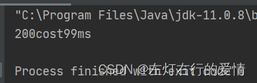  
 结果不为0，答案错误。  
 2：加锁

```
public class CASdemo {

    public static void main(String[] args) {
        Account account =new AccountUnsafe(10000);
        Account.demo(account);

    }

}
interface Account{
    //获取余额
    Integer getBalance();
    //取款
    void withdraw(Integer amount);
//方法会启动1000个线程，每个线程做+10的操作，如果初始余额为10000，正确结果为0
    static void demo(Account account){
        List<Thread> ts =new ArrayList<>();
        long start =System.nanoTime();
        for(int i=0;i<1000;i++){
            ts.add(new Thread(()->{
                account.withdraw(10);
            }));
        }


        ts.forEach(Thread::start);
        ts.forEach(t->{
            try{
                t.join();
            }catch (InterruptedException e){
                e.printStackTrace();
            }
        });
        long end=System.nanoTime();
        System.out.println(account.getBalance()+"cost"+(end-start)/1000_000+"ms");
    }
}
class AccountUnsafe implements Account{
    private Integer balance;

    public AccountUnsafe(Integer balance) {
        this.balance = balance;
    }

    public  Integer getBalance() {
        synchronized (this){   //加锁
            return this.balance;
        }

    }

    public void withdraw(Integer amount){
    synchronized (this){   //加锁
        this.balance-=amount;
    }
    }
}


```

结果：  
 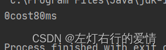  
 我们可以看到结果正确。

3：无锁实现

```
public class CASdemo {
    public static void main(String[] args) {
        Account account =new AccountCas(10000);
        Account.demo(account);
    }
}
interface Account{
    //获取余额
    Integer getBalance();
    //取款
    void withdraw(Integer amount);
//方法会启动1000个线程，每个线程做+10的操作，如果初始余额为10000，正确结果为0
    static void demo(Account account){
        List<Thread> ts =new ArrayList<>();
        long start =System.nanoTime();
        for(int i=0;i<1000;i++){
            ts.add(new Thread(()->{
                account.withdraw(10);
            }));
        }
        ts.forEach(Thread::start);
        ts.forEach(t->{
            try{
                t.join();
            }catch (InterruptedException e){
                e.printStackTrace();
            }
        });
        long end=System.nanoTime();
        System.out.println(account.getBalance()+"cost"+(end-start)/1000_000+"ms");
    }
}
class AccountCas implements Account{
    private AtomicInteger balance;
    public AccountCas(int balance) {
        this.balance = new AtomicInteger(balance);           //注意这个构造方法的用法
    }
    public  Integer getBalance() {
        return balance.get();
    }
    public void withdraw(Integer amount){
        while(true){
        //获取余额的最新值
            int prev =balance.get();
            //要修改的余额
            int next =prev-amount;
            //真正修改
            if(balance.compareAndSet(prev,next)){
                break;
            }
        }
    }
}


```

运行结果：  
 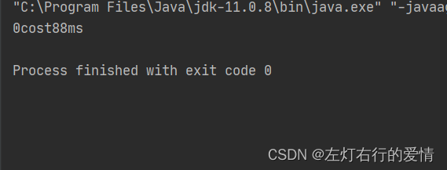  
 可以看到结果正确。  
 那么让我们debug进去看看cas到底是什么，进入compareAndSet方法：  
 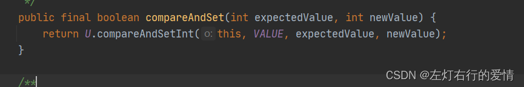  
 再进入compareAndSetInt方法：  
 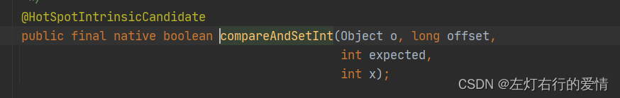  
 这个方法是哪个类里面的呢？我们来看看：  
 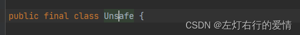

1. 由此我们可以看到，**CAS是一种系统原语，由若干条指令组成，在执行过程中不允许被中断，是一条CPU的原子指令，不会造成所谓数据不一致问题。**
2. 由于Java方法无法直接访问底层系统，需要通过本地(native)方法来访问，Unsafe相当于一个后门，基于该类可以直接操作特定内存数据。
3. Unsafe类其内部方法操作可以像c语言中指针一样，直接操作内存，因此Java中CAS操作的执行依赖于Unsafe类的方法。
4. Unsafe（不是指线程不安全，是指过于底层，不建议编程人员直接使用）  
    Unsafe对象提供了非常底层，操作内存，线程的方法，Unsafe对象不能直接调用  
    只能通过反射获得。  
    LockSupport的park方法，cas相关的方法底层都是通过Unsafe类实现的。

### 实现了CAS机制的JUC工具类

#### 原子整数，通过原子方式更新Java基础类型变量的值

1. AtomicInteger
2. AtomicBoolean
3. AtomicLong

#### 数组原子，通过原子方式更改数组里的某个元素的值

1. AtomicIntegerArray：整形数组原子类
2. AtomicLongArray：长整型数组原子类
3. AtomicReferenceArray：引用类型数组原子类

#### 原子更新器，帮助我们改变某个对象中某个属性，只能配合volatile修饰字段使用，否则出现异常

1. AtomicReferenceFieldUpdate 更新整形字段的更新器
2. AtomicIntegerFieldUpdate 更新长整型字段的更新器
3. AtomicLongFieldUpdate 原子更新引用类型的字段

#### 原子引用，要保护的数据并一定是基本类型，比如小数类型

1. AtomicReference 引用类型原子类
2. AtomicStampReference 带有更新标志位的原子引用类型
3. AtomicMarkableReference 带有更新版本号的原子引用类型

### CAS缺点

#### 循环时间长，CPU开销太大

举个上面的例子：

```
 public void withdraw(Integer amount){
        while(true){
        //获取余额的最新值
            int prev =balance.get();
            //要修改的余额
            int next =prev-amount;
            //真正修改
            if(balance.compareAndSet(prev,next)){         
                break;
            }
        }


```

如果while里的if一直不满足，就会一直循环，给CPU带来非常大的开销。

#### 只能保证一个共享变量的原子操作

我们可以采取一个简单的方法：  
 把多个共享变量合并成一个共享变量来操作，  
 JDK提供了AtomicReference类来保证引用对象之间的原子性，可以把多个变量放在一个AtomicReference实例后进行CAS操作。  
 举个栗子：有4个共享变量，可以把这四个合并成一个对象，然后用CAS来操作该合并对象的AtomicReference引用。

#### ABA问题

CAS需要在操作值的时候检查值有没有发生变化，如果没有发生就更新。  
 如果一个值原来是A，变成了B，后面又变成了A，那么CAS进行检查时会发现它的值没有发生变化，但是实际上却发生变化了。

JDK提供了两个类AtomicStampedReference，AtomicMarkableReference来解决ABA问题。  
 这两个类的区别在于，AtomicStampedReference是通过int类型的版本号，而AtomicMarkableReference是通过boolean类型的标识来判断数据是否更改过。  
 既然有了 AtomicStampedReference 为啥还需要再提供 AtomicMarkableReference 呢，在现实业务场景中，不关心引用变量被修改了几次，只是关心是否被更改过。  
 下面我们来分析一下AtomicStampedReference重点源码。至于AtomicMarkableReference和它相似度一致：

##### AtomicStampReference源码

Doc解析：

```
/**
 * An {@code AtomicStampedReference} maintains an object reference
 * along with an integer "stamp", that can be updated atomically.
 *维护一个对象引用以及一个整数标记，可以被原子方式更新。
 * <p>Implementation note: This implementation maintains stamped
 * references by creating internal objects representing "boxed"
 * [reference, integer] pairs.
 * 实现说明：此实现通过创建表示"装箱"的内部对象来引用【引用，整数】pairs
 *
 * @since 1.5
 * @author Doug Lea
 * @param <V> The type of object referred to by this reference
 */


```

内部类：

```
 private static class Pair<T> {
        final T reference;  变量引用
        final int stamp;    修改戳记
        // 初始化，构造一个Pair对象
        private Pair(T reference, int stamp) {
            this.reference = reference;
            this.stamp = stamp;
        }
        static <T> Pair<T> of(T reference, int stamp) {
            return new Pair<T>(reference, stamp);
        }
    }


```

重要成员变量：

```
  private volatile Pair<V> pair;  


```

构造方法：

```
  /**
     * Creates a new {@code AtomicStampedReference} with the given
     * initial values.
     *
     * @param initialRef the initial reference   初始化变量引用
     * @param initialStamp the initial stamp    修改戳记
     */
     //初始化，构造成一个 Pair 对象，由于 pair 是用 volatile 修饰的所以构造是线程安全的
    public AtomicStampedReference(V initialRef, int initialStamp) {
        pair = Pair.of(initialRef, initialStamp);
    }


```

重点方法：

```
//原子方式获取当前引用值
  1：public V getReference() {
        return pair.reference;
    }

//以原子方式获取戳记
    2：public int getStamp() {
        return pair.stamp;
    }
3：
  public boolean compareAndSet(V   expectedReference,     //参考引用值
                                 V   newReference,     //更新后引用值
                                 int expectedStamp,    //预期戳值
                                 int newStamp      //更新后的戳值
                                 )  {
        Pair<V> current = pair;
        return
            expectedReference == current.reference //预期的引用 == 当前引用
            //预期的戳值== 当前戳值
           &&expectedStamp == current.stamp  &&
            ((newReference == current.reference &&
            //更新后的**引用**和**戳值**和当前的**引用**和**戳值**相等则直接返回
              newStamp == current.stamp) true||
             casPair(current, Pair.of(newReference, newStamp)));
    }


```

举个例子看一看：

```
public class aotimcCASdemo {

    static User one = new User("王力宏");

    static AtomicReference<User> atomicReference = new AtomicReference<>(one);
    //初始化版本号为1，变量为王力宏
    static AtomicStampedReference atomicStampedReference = new AtomicStampedReference(one, 1);

    public static void main(String[] args) {
        new Thread(() -> {
            User two = new User("陶喆");
            //获取版本号
            int num = atomicStampedReference.getStamp();
            System.out.println("线程一第一次获取到的版本号为："+num);

            //执行ABA操作
            atomicStampedReference.compareAndSet(one,two,1,2);
            atomicStampedReference.compareAndSet(two,one,2,3);
        },"线程一").start();

        new Thread(()->{
            //获取版本号
            int num = atomicStampedReference.getStamp();
            System.out.println("线程二第一次获取到的版本号为："+num);
            //暂停1秒，保证线程一万次了一次ABA操作
            try{
                Thread.sleep(3000);
            }catch (InterruptedException e){
                e.printStackTrace();
            }
            User two =new User("陶喆");
            atomicStampedReference.compareAndSet(one,two,1,2);  //由于版本化期望值对比已经改变，修改无效，解决了ABA问题
            System.out.println(atomicReference.get().getName());
            int n = atomicStampedReference.getStamp();
            System.out.println("线程二第二次获取到的版本号为："+n);
        },"线程二").start();

    }


```

这里结果为：  
 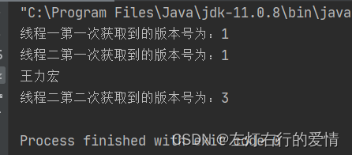

### LongAdder原理

#### 简单了解AtomicLong

JDK1.8之后，新增了LongAdder原子类：long类型的数值累加器，从0开始累加，累加规则为加法运算。  
 自从原子类之后，多线程环境下如果用于统计计数操作，一般可以使用AtomicLong来代替锁作为计数器，AtomicLong通过CAS提供了非阻塞的原子性操作，相比于使用阻塞算法的同步器来说性能已经很好了，那为什么我们要用LongAdder不用它，它有什么缺点呢？

#### AtomicLong的缺点

AtomicLong等其他传统atomic原子类对于数值的更改，通常是**在一个无限循环(自旋)中不断尝试CAS的修改操作，一旦CAS失败则循环重试，这样来保证最终CAS操作成功过。**  
 如果竞争不激烈修改成功的概率很高，但是如果在超高并发下会导致大量线程频繁竞争修改计数器，  
 ，一直处于自旋状态，占用CPU性能，浪费资源，降低并发性。  
 简单展示一个源码底层实现感受一下：

```
    @HotSpotIntrinsicCandidate
    public final long getAndAddLong(Object o, long offset, long delta) {
        long v;
        do {
            v = getLongVolatile(o, offset);
        } while (!weakCompareAndSetLong(o, offset, v, v + delta));    while   //循环 CAS失败一直不断尝试更新变量
        return v;
    }


```

#### LongAdder简单介绍

1. JDK1.8下的LongAdder，是一个long类型的数值累加器，用来**克服在高并发下使用AtomicLong可能由于线程频繁自旋而浪费CPU的缺点。**
2. 解决方式  
    采用了“**热点数据分离**”思想：  
    传统原子类内部维护了一个对象类型的value属性值，多个线程之间的cas竞争实际上是争夺这个value属性的更新权，但是CAS操作只会保证同时只有一个线程能够更新成功，**如果把一个变量分解为多个变量，让同样多的线程去竞争多个资源，最后统计总和**，这样能缓解线程竞争导致的性能问题。  
    这种思想在高并发环境下非常有用。  
    无并发：  
    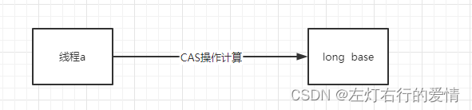  
    多并发AtomicLong：  
    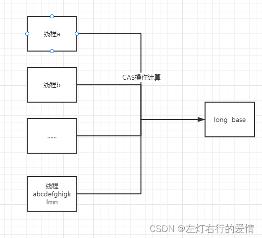  
    高并发LongAdder：  
    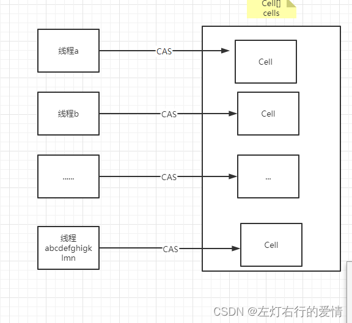

#### LongAdder源码解读

##### 继承关系结构图

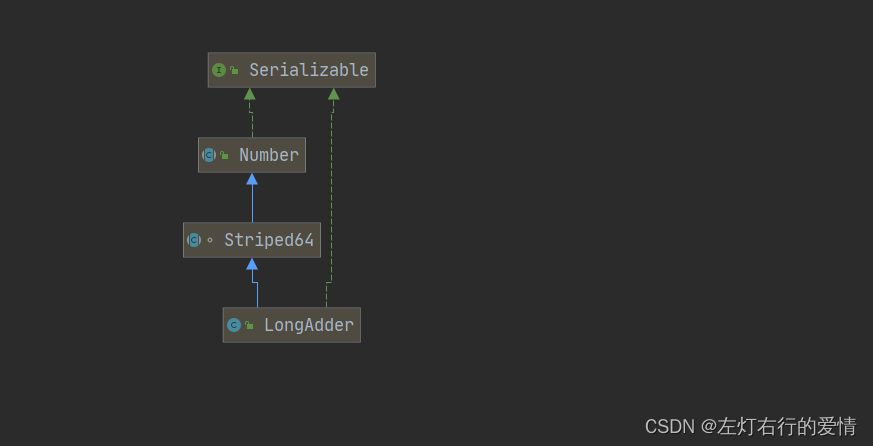  
 代码实现：

```
public class LongAdder extends Striped64 
implements Serializable 


```

1. Striped64:这个类是个抽象类，里面主要实现了两个方法longAccumulate，doubleAccumulate 分别long 和double的数据进行一个累计。主要提供给LongAdder ，LongAccumulator,DoubleAdder,DoubleAccumulator 进行一个调用。可以理解为用cells的方式来减少并发时产生的冲突。
2. Serialzable:启用序列化功能

##### Striped64

1. 成员变量

```
   /**
     * Table of cells. When non-null, size is a power of 2.
     */
 //volatile Cell类型的数组，为null时，如果发生CAS更新base出现竞争的时候初始化
 //不为null时该数组来统计计数，初始容量为2，数组可扩容，大小为2的幂次方
    transient volatile Cell[] cells;

    /**
     * Base value, used mainly when there is no contention, but also as
     * a fallback during table initialization races. Updated via CAS.
     */
     //long 类型的基本属性，在没有CAS竞争时用来统计计数
    transient volatile long base;

    /**
     * Spinlock (locked via CAS) used when resizing and/or creating Cells.
     */
/** 用来实现CAS锁的资源，值为0时表示没有锁，值为1时表示已上锁，扩容Cell 数组或者初始化Cell 数组时会使用到该值   
 使用CAS的同时唯一成功性来保证同一时刻只有一条线程可以进入扩容Cell 数组或者初始化Cell 数组的代码
 **/
    transient volatile int cellsBusy;


```

我们可以看出，LongAdder的热点分离思想具体实现是将value分散为一个base变量和一个cell数组。  
 数组的用途为：并发下的线程随机分配到数组的不同索引位置，并对该位置进行更新。  
 理论上采用一个数组就行，那么为什么还要加一个变量呢？  
 原因在于：  
 在没有竞争的情况下，如果初始化一个数组，更新数组某个索引有点大材小用了，而且空间被占的更多，更新效率也没有单独更新一个变量那么快。  
 所以综合考虑下,在更新计数的时候如果没有CAS竞争，即并发度较低时就一直使用base变量来统计计数，此时cells数组是null，即没有初始化或者锁延迟初始化。  
 一旦出现对base变量的CAS竞争，即高并发环境下某些线程CAS更新base失败，那么就初始化cells数组，并且以后都使用cells数组来进行统计计数（如果数组某一个索引位置的Cell更新时仍然出现了竞争。那么cells数组可能会扩容或者寻找新的Cell），在统计总和对base和cells数组中的值进行求和即可。  
 2. 内部类Cell

```
  @jdk.internal.vm.annotation.Contended static final class Cell {
        volatile long value;
        Cell(long x) { value = x; }
        final boolean cas(long cmp, long val) {
            return VALUE.compareAndSet(this, cmp, val);
        }
        final void reset() {
            VALUE.setVolatile(this, 0L);
        }
        final void reset(long identity) {
            VALUE.setVolatile(this, identity);
        }
        final long getAndSet(long val) {
            return (long)VALUE.getAndSet(this, val);
        }
            // VarHandle mechanics
        private static final VarHandle VALUE;
        static {
            try {
                MethodHandles.Lookup l = MethodHandles.lookup();
                VALUE = l.findVarHandle(Cell.class, "value", long.class);
            } catch (ReflectiveOperationException e) {
                throw new ExceptionInInitializerError(e);
            }
        }
    }


```

Cell类中仅仅有一个value属性，实际上就是对value值的封装，封装成类的原因主要是方便调用方法对某个位置的value进行CAS更新，以及做缓存填充操作。

**注意伪共享问题**：  
 因为数组的内存空间必需是连续的，一个cell内部只有一个value属性，非常有可能多个cell对象存放在同一个缓存行中，当CAS更新某一个Cell值时会将该Cell所属的缓存行失效，因此会同时造成其他位于同一个缓存行的相邻Cell缓存也同时失效，这样后续线程必需从主存获取相邻的Cell，这就会导致“伪共享”问题，但是两个Cell的访问应该是互不影响的，但是由于在同一个缓存行，造成了“共享”的现象，所以成为“伪共享”。  
 我们可以看到Cell类使用了`@jdk.internal.vm.annotation.Contended`注解修饰，这是JDK1.8缓存填充的新方式，这样一个Cell对象就占据一个缓存行的大小，解决了伪共享的问题，近一步提升了性能。  
 3.常用方法

```
   //通过CAS的方式更新cell中的数据
    final boolean casBase(long cmp, long val) {
        return UNSAFE.compareAndSwapLong(this, BASE, cmp, val);
    }

    //通过CAS的方式获取锁(同步状态)
    final boolean casCellsBusy() {
        return UNSAFE.compareAndSwapInt(this, CELLSBUSY, 0, 1);
    }


```

三：静态变量

```
 private static final long serialVersionUID = 7249069246863182397L;  //版本号


```

四：构造方法

```
   /**
     * Creates a new adder with initial sum of zero.
     */
    public LongAdder() {
    }


```

五：常用方法

```
    public void add(long x) {
        Cell[] cs; cell数组的引用
        long b, v;  b：获取的base值，v：期望值
         int m;   cells数组的长度
         Cell c; 线程中的cell
/**
if条件：
条件一(cs = cells) != null  
true：当前cells数组已经创建 当前线程应该将数据写入到对应的cell中，进入if语句操作
false：表示cells未初始化，当前线程应该将数据写到base中，执行条件二，写数据到base中
条件二casBase(b = base, b + x)取反
true：表示当前线程CAS写数据到base失败
false：当前数据CAS写数据成功，无需进入if
**/
        if ((cs = cells) != null || !casBase(b = base, b + x)) {
            boolean uncontended = true;  //是否有竞争
            /**
条件一：cs == null || (m = cs.length - 1) < 0，cells数组是否初始化
条件二：c = cs[getProbe() & m]) == null ，getProobe()方法，底层调用Unsafe本地方法getInt()，表示获取一个整形值，和m(cells数组的长度-1)的结果就是【0，length-1】刚好就是下标，注意cells的长度一定是2的整数倍（和hashmap寻址方式类似）
条件三：uncontended = c.cas(v = c.value, v + x))
当前线程对应的cells数组总的位置不为null，但是对当前cell进行CAS设置值的时候失败，
表名对这一个cell写数据时出现了竞争
**/
            if (cs == null || (m = cs.length - 1) < 0 ||
                (c = cs[getProbe() & m]) == null ||
                !(uncontended = c.cas(v = c.value, v + x)))
 /**               
                综上：会调用longAccumulate方法的情况
                1.cell数组未初始化，也就是多线程写base发生了竞争
                2.cell数组已经初始化，但是当前线程对应的cell为空
                3.cells数组已经初始化，并且当前线程对应的cell不为null，但是对这个cell进行CAS写时失败了
                **/
                longAccumulate(x, null, uncontended);        //longAccumulate太复杂，大概了解到这够用了，有兴趣去搜索吧
        }
    }

    /**
     * Equivalent to {@code add(1)}.
     */
    public void increment() {
        add(1L);
    }

    /**
     * Equivalent to {@code add(-1)}.
     */
    public void decrement() {
        add(-1L);
    }


    public long sum() {
        Cell[] cs = cells;
     //   将base的值拿出来
        long sum = base;
     //   遍历Cells中每一个Cell，如果槽不为null，就累加Cell中的value值
        if (cs != null) {
            for (Cell c : cs)
                if (c != null)
                    sum += c.value;
        }
     //   返回总和
        return sum;
    }


```

### 结尾

看到这我们对乐观锁有了一个初步的了解，后面我们会去再度深挖锁的各种实现并做对比。
