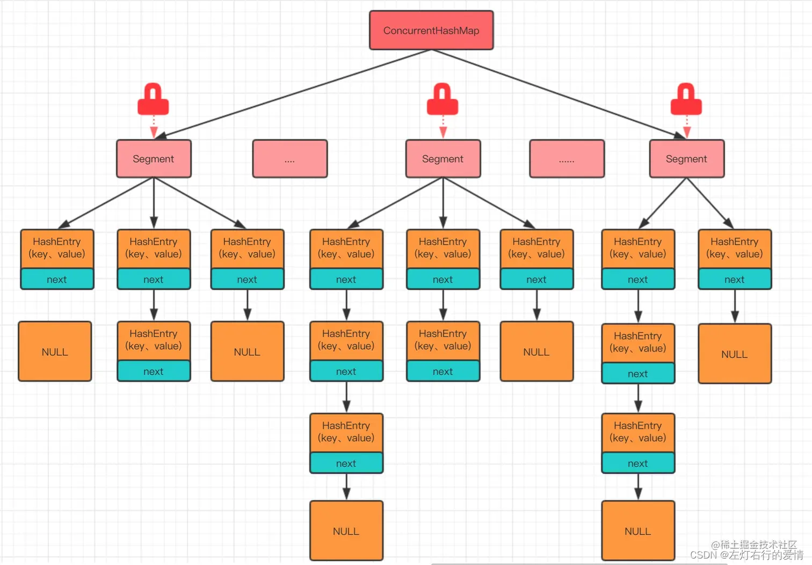
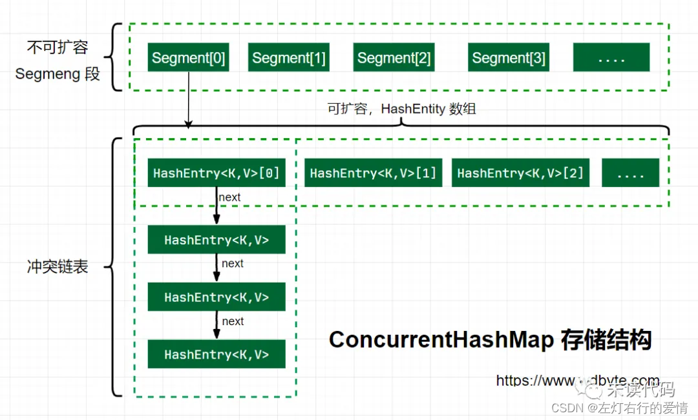

> 原文：[CSDN](https://blog.csdn.net/qq_45852626/article/details/126124080)（历史文章导入，当前状态为草稿）

#### 并发容器-ConcurrentHashMap
### 前言

之前我们在集合篇里聊完了HashMap和HashTable，我们又学习了并发编程的基本内容，现在我们来聊一聊Concurrent类下的重要容器，ConcurrentHashMap。  
 HashTable被逐渐废弃，离不开ConcurrentHashMap的出现，可以想象HashMap做为一个高频使用的集合框架，如果每次使用过程中都将整个方法synchronized，这样意味着全局加锁，肯定会导致并发的低效，所以ConcurrentHashMap的出现，改变了这种情况，接下来我们来看一看ConcurrentHashMap的神奇之处。

### 什么是ConcurrentHashMap

ConcurrentHashMap是Java并发包(java.util.concurrent)中提供的线程安全哈希表实现，它专门为并发环境优化设计。  
 与其他类似数据结构的对比：

| 特性 | HashMap | Hashtable | ConcurrentHashMap |
| --- | --- | --- | --- |
| 线程安全 | ❌ | ✅ | ✅ |
| 锁粒度 | 无锁 | 全表锁 | 分段锁/细粒度锁 |
| 允许null键 | ✅ | ❌ | ❌ |
| 允许null值 | ✅ | ❌ | 1.8后❌ |
| 并发性能 | 高(单线程) | 低 | 高 |

为什么需要ConcurrentHashMap？你可以想象一下：

* HashMap在并发环境下可能导致死循环或数据不一致
* Hashtable虽然线程安全，但锁住整个哈希表导致并发效率低下
* ConcurrentHashMap就像是一辆设计精良的多人自行车，每个人可以相对独立地踩自己的踏板，既保证了安全又保持了效率。

### 数据结构

#### JDK1.7版本

ConcurrentHashMap在JDK1.7中,提供了一种颗粒度更细的加锁机制.  
 这种机制叫分段锁(Lock Sriping).  
 整个哈希表被分为了多个段,每个段都能独立锁定.

机制的优点:读取操作不需要锁,写入操作仅锁定相关的段.这减小了锁冲突的概率,从而提高了并发性能.  
 在并发环境下实现更高的吞吐量,在单线程环境下只损失非常小的性能.

* 默认分为16个Segment，每个Segment相当于一个小的Hashtable
* 每个Segment继承自ReentrantLock，可以独立上锁
* 结构为Segment数组 + HashEntry数组 + 链表

这种设计可以理解为"化整为零"的思想，就像一个小区有16个门，每个门都有独立的保安，居民只需要跟自己门的保安打交道，大大减少了排队等待的时间。  
   
 (图片转载自网络)

##### HashEntry

```
static final class HashEntry<K,V> {
        final int hash;
        final K key;
        volatile V value;
        volatile HashEntry<K,V> next;

        HashEntry(int hash, K key, V value, HashEntry<K,V> next) {
            this.hash = hash;
            this.key = key;
            this.value = value;
            this.next = next;
        }


```

这个老朋友我们在介绍HashMap的时候应该非常熟悉它了.不太明白的朋友可以翻看一下HashMap那一章.

##### Segment

```
static final class Segment<K,V> extends ReentrantLock implements Serializable {

        private static final long serialVersionUID = 2249069246763182397L;

        static final int MAX_SCAN_RETRIES =
            Runtime.getRuntime().availableProcessors() > 1 ? 64 : 1;
        transient volatile HashEntry<K,V>[] table;
        transient int count;
        transient int modCount;
        transient int threshold;
        final float loadFactor;
        Segment(float lf, int threshold, HashEntry<K,V>[] tab) {
            this.loadFactor = lf;
            this.threshold = threshold;
            this.table = tab;
        }
}


```

从上面代码可以看到,有一个volatile修饰的HashEntry数组  
 所以可以看出,Segment的结构和HashEntry是非常类似的,都是一种数据和链表相结合的结构.  
 即每个Segment守护着n个HashEntry,而每一个HashEntry本身可以当作一条链表连接n个HashEntry.

那么可以用图来表示一下segment和hashEntry的关系  
 

#### JDK1.8版本

JDK 1.8的ConcurrentHashMap主要由以下部分组成：

```
+-------+    +------+    +------+
| table | -> | Node | -> | Node | -> ...
+-------+    +------+    +------+
   |
   v
+-------+    +------+    +------+
| Node  | -> | Node | -> | Node | -> ...
+-------+    +------+    +------+
   |
   v
+----------+
| TreeNode | -> ... (红黑树结构)
+----------+


```

* table：Node类型的数组，类似于HashMap的数组
* Node：存储键值对，包含key、value、hash和next指针
* TreeNode：红黑树节点，当链表过长时转换为红黑树
* ForwardingNode：特殊节点类型，在扩容时使用，指向新的table

##### 并发控制机制

JDK 1.8中的线程安全机制：

* CAS操作：无锁并发控制，用于首次添加节点、更新值等
* synchronized：只锁定必要的节点，粒度极细
* volatile：Node的val和next使用volatile修饰，保证可见性
* 分散热点：使用随机数减少不同线程之间的竞争

这种设计遵循了"能不加锁就不加锁，必须加锁时也要尽可能小范围加锁"的并发编程黄金法则。

#### 初始化

```
public ConcurrentHashMap() {
        this(DEFAULT_INITIAL_CAPACITY, DEFAULT_LOAD_FACTOR, DEFAULT_CONCURRENCY_LEVEL);
    }


```

无参构造里面调用了有参构造,传入了三个参数的默认值,它们的值是:

```
// 默认初始化容量
static final int DEFAULT_INITIAL_CAPACITY = 16;

// 默认负载因子
static final float DEFAULT_LOAD_FACTOR = 0.75f;

// 默认并发级别
static final int DEFAULT_CONCURRENCY_LEVEL = 16;
我们可以看到,这个也是指segment数,默认是16.


```

```
    @SuppressWarnings("unchecked")
    public ConcurrentHashMap(int initialCapacity,
                             float loadFactor, int concurrencyLevel) {
        //上来先做参数校验
        if (!(loadFactor > 0) || initialCapacity < 0 || concurrencyLevel <= 0)
            throw new IllegalArgumentException();
            //校验并发级别的大小,如果大于1<<16,重置为65536
        if (concurrencyLevel > MAX_SEGMENTS)
            concurrencyLevel = MAX_SEGMENTS;
        //2的多少次方
        int sshift = 0;
        int ssize = 1;
        //这个循环目的是可以找到concurrencyLevel之上最近的2的次方值
        while (ssize < concurrencyLevel) {
            ++sshift;
            ssize <<= 1;
        }
        //记录偏移量
        this.segmentShift = 32 - sshift;
        //记录段掩码
        this.segmentMask = ssize - 1;
        //设置容量,如果大于最大值,则设置为最大值
        if (initialCapacity > MAXIMUM_CAPACITY)
            initialCapacity = MAXIMUM_CAPACITY;
            //平摊到每个segment中可以分到的大小,如果initialCapacity为64,那么每个segment可以分到4个
            //计算每个segment中类似HashMap的容量
        int c = initialCapacity / ssize;
        //如果c*ssize<initialCapacity,说明上面除的时候有余数,下面给c++就好啦
        if (c * ssize < initialCapacity)
            ++c;
            //设置segment中最小的容量值,这里默认为2,确保插入一个不会扩容
        int cap = MIN_SEGMENT_TABLE_CAPACITY;
        //segment中类似于HashMap,容量至少为2或者2的倍数
        while (cap < c)
            cap <<= 1;
        // 创建 segments and segments[0]
        Segment<K,V> s0 =
            new Segment<K,V>(loadFactor, (int)(cap * loadFactor),
                             (HashEntry<K,V>[])new HashEntry[cap]);
        Segment<K,V>[] ss = (Segment<K,V>[])new Segment[ssize];
        /往数组中写入segment[0]
        UNSAFE.putOrderedObject(ss, SBASE, s0); // ordered write of segments[0]
        this.segments = ss;
    }


```

### 重要方法

#### Put方法

```
 public V put(K key, V value) {
        Segment<K,V> s;
        //校验传入的value是否为空
        if (value == null)
            throw new NullPointerException();
            //根据传入的key计算出hash值
        int hash = hash(key);
        //根据hash值找到segment数组中位置j
        //hash值是32位,无符号右移segmentShift位,剩下高四位.
        //然后和segmentMask(15)做一次与操作,也就说说j是hash值的高四位,也就说槽点数组下标
        int j = (hash >>> segmentShift) & segmentMask;
        //这里使用unsave类的getObject方法从segment数组中检索段.
        //(j是要检索的段段索引
        //SSHIFT用于计算偏移量的位移量
        //SBASE用于计算基本偏移的基本偏移量
        //这里判断是否位null.如果是null则调用ensureSegment对segment[j]进行初始化
        if (
        (s = (Segment<K,V>)UNSAFE.getObject(segments, (j << SSHIFT) + SBASE)) == null
        ) 
            s = ensureSegment(j);
            //插入新值到槽s中
        return s.put(key, hash, value, false);
    }


```

然后继续看下一层的put代码

```
 final V put(K key, int hash, V value, boolean onlyIfAbsent) {
 //在往segment写入前,需要先获取该segment的独占锁
            HashEntry<K,V> node = tryLock() ? null : scanAndLockForPut(key, hash, value);
            V oldValue;
            try {
            //segment内部的数组
                HashEntry<K,V>[] tab = table;
                //利用hash值算出防止数组下标
                int index = (tab.length - 1) & hash;
                //first是数组该位置处链表的表头
                HashEntry<K,V> first = entryAt(tab, index);
                //这个for循环主要是考虑一些情况: 已经存在链表和没有任何元素这两种情况.
                for (HashEntry<K,V> e = first;;) {
                //此时e不为null
                    if (e != null) {
                        K k;
                        //复合赋值比较,用于检查当前节点的键是否与待插入键相同，并在比较的同时完成了一次赋值操作。
                        //前面成立（即引用相等）时，确实后面不需要再判断，逻辑上已经确定了键相等。但如果设计中考虑到可能有内容相等但引用不同的情况，后面的判断仍然是必要的逻辑完整性的一部分，确保所有相等的情况都被正确处理。
                        //扩展
/**引用相等：(k = e.key) == key 判断的是传入的键 key 和链表中节点的键 e.key 是否是同一个对象实例。如果它们是同一个对象（引用相同），那么直接就可以确认键相等，无需进一步比较。

内容相等：但是，如果键是根据内容定义相等而不是引用（比如自定义的键类重写了 .equals() 方法），那么即使 == 返回 false，键的内容仍然可能相等（通过 .equals() 判断）。因此，(e.hash == hash && key.equals(k)) 部分是用来处理这种情况的，它确保即使两个键不是同一个实例，如果它们的内容相等（通过 .equals() 方法判断），也被视为相同的键。**/
                        if ((k = e.key) == key || (e.hash == hash && key.equals(k))) 
                            oldValue = e.value;
                            if (!onlyIfAbsent) {
                            //覆盖
                                e.value = value;
                                ++modCount;
                            }
                            break;
                        }
                        e = e.next;
                    }
                    else {
                    //如果不为null,那么就把插入的值设置为链表表头(头插法)
                        if (node != null)
                        //这里设置一下引用节点
                            node.setNext(first);
                            //如果为null,初始化并设置为链表表头
                        else
                            node = new HashEntry<K,V>(hash, key, value, first);
                        int c = count + 1;
                        //如果超过segment的阈值,这个segment需要扩容
                        if (c > threshold && tab.length < MAXIMUM_CAPACITY)
                            rehash(node);
                        else
                        //如果没有达到阈值,将node放到数组tab的index位置
                        //换句话说将新的节点设置为原链表的表头
                            setEntryAt(tab, index, node);
                        ++modCount;
                        count = c;
                        oldValue = null;
                        break;
                    }
                }
            } finally {
                unlock();
            }
            return oldValue;
        }


```

##### 扩容rehash方法

```
  private void rehash(HashEntry<K,V> node) {
            HashEntry<K,V>[] oldTable = table;
             //旧容量
            int oldCapacity = oldTable.length;
            //新容量,扩大2倍
            int newCapacity = oldCapacity << 1;
            //计算新的扩容阈值
            threshold = (int)(newCapacity * loadFactor);
            //创建新的数组
            HashEntry<K,V>[] newTable =
                (HashEntry<K,V>[]) new HashEntry[newCapacity];
                //计算新掩码 容量-1
            int sizeMask = newCapacity - 1;
           //遍历老数据
            for (int i = 0; i < oldCapacity ; i++) {
                HashEntry<K,V> e = oldTable[i];
                //如何能拿到值
                if (e != null) {
                    HashEntry<K,V> next = e.next;
                    //计算新位置,新位置只有两种情况:不变或者老位置+老容量
                    int idx = e.hash & sizeMask;
                    if (next == null)   //  Single node on list
                    //当前位置不是链表只是元素,直接赋值
                        newTable[idx] = e;
                    else { // Reuse consecutive sequence at same slot
                    //如果是链表
                        HashEntry<K,V> lastRun = e;
                        int lastIdx = idx;
                        //这里的for循环目的是:找到一个特殊节点,这个节点后所有next节点的新位置都是相同的
                        /**
                        这块我再解释一下,容器扩容前后是只会有两个位置,一个新位置,一个旧位置,这里的计算是把放在新位置的索引的链表找出来啦,然后新位置的链表都是要放一起的.
                        **/
                        for (HashEntry<K,V> last = next;
                             last != null;
                             last = last.next) {
                            int k = last.hash & sizeMask;
                            if (k != lastIdx) {
                                lastIdx = k;
                                lastRun = last;
                            }
                        }
                        //将lastRun及其之后的所有节点组成的链表放在lastIdx这个位置
                        newTable[lastIdx] = lastRun;
                        // 下面操作处理lastRun之前的节点
                        //这些节点可能分配在另外一个链表上,也有可能分配到上面那个链表中
                        for (HashEntry<K,V> p = e; p != lastRun; p = p.next) {
                            V v = p.value;
                            int h = p.hash;
                            int k = h & sizeMask;
                            HashEntry<K,V> n = newTable[k];
                            newTable[k] = new HashEntry<K,V>(h, p.key, v, n);
                        }
                    }
                }
            }
            //新来的node放在新数组中刚刚两根链表之一的头部
            int nodeIndex = node.hash & sizeMask; // add the new node
            node.setNext(newTable[nodeIndex]);
            newTable[nodeIndex] = node;
            table = newTable;
        }


```

### 问题

#### 为什么放弃分段锁？

JDK 1.8放弃分段锁的原因：

1. 锁粒度优化：从段级别细化到节点级别
2. synchronized性能提升：JDK 1.6后引入偏向锁、轻量级锁等优化
3. 架构简化：减少内存占用，代码更简洁
4. 红黑树结构：需要配合新的数据结构提供更好性能
