> 原文：[CSDN](https://blog.csdn.net/qq_45852626/article/details/126321073)（历史文章导入，当前状态为草稿）

### 前言

如果看完这篇aqs看不明白的话，可以关注一下我后面要出的`ReentrantLock，Semaphore，countdownlatch`这些文章，因为aqs直接去理解的话有一点难度，我刚开始学习的时候也挺蒙，后面结合着看一看，触类旁通就简单很多了。

24年再来看之前写的文章发现还是有点太粗糙了,很多内容写的不明白,再整改一下.  
 之前的缺点我总结了一下有下面几点:

1. AQS的基本结构我没介绍清楚,`ConditionObject`,`CLH`队列的变体,`state`到底是怎么组成AQS的
2. 3个基础构成部分写的不详细,
3. 代码给的太长太乱,第一次读的朋友大概率会晕
4. 图太粗糙了,我自己也看不下去了

这几天动手改一改这些问题.

### AQS简介

1. AQS（`java.util.concurrent.locks.AbstractQueuedSynchronizer`）是用来构建锁或者其他同步组件（信号量，事件等）的基础框架类。
2. AQS的设计是基于**模板方法模式**，开发者需要继承同步器并且重写指定的方法，将其组合在并发组件实现中，调用同步器模板方法，模板方法会调用使用者重写的方法。  
    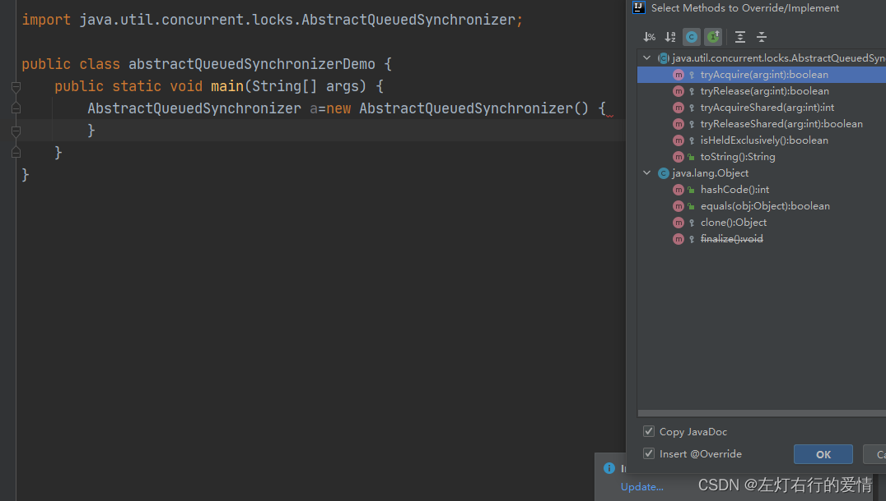
3. AQS主要使用方式是继承一个内部辅助类实现**同步原语**，简化我们并发工具中的内部实现，屏蔽同步状态管理，线程的排队，等待与唤醒等底层操作。

JDK中许多并发工具类的内部实现都依赖于AQS，比如`ReentrantLock，Semaphore，CountDownLatch`等，学习AQS的使用与源码实现对深入理解`concurrent`包下的类有很大帮助。

#### AQS如何保证可见性，有序性，原子性

* 原子性  
   通过`volatile state`的值来控制获取锁，保证一次只有一个线程修改变量
* 有序性  
   AQS获取或者解锁都是修改`state`值，而`state`是被`volatile`修饰的，`volatile`可以保证有序性。
* 可见性  
   和有序性一样，由于`state`是被`volatile`修饰，在内存屏障的帮助下，可以保证`lock`和`unlock`之间代码修改的变量都可以同步到主内存中，并且使得的线程中的变量失效（缓存行，有兴趣了解一下）。

#### 继承结构

结构图：  
 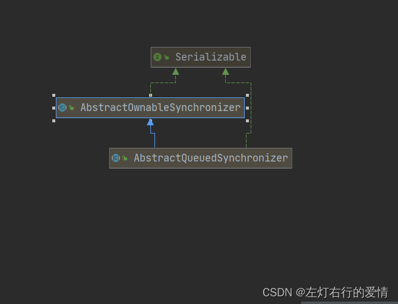  
 代码实现：

```
public abstract class AbstractQueuedSynchronizer
    extends AbstractOwnableSynchronizer
    implements java.io.Serializable 


```

1. `AbstractOwnableSynchronizer`：一种同步器，可以由一个线程独占。  
    该类提供了**创建锁和相关同步器的基础**，本身并不管理或使用这些信息，但是子类和工具可以使用适当维护的值来帮助控制和监视访问并提供诊断。
2. 提供序列化功能  
    `AbstractOwnableSynchronizer`源码一览：

```
public abstract class AbstractOwnableSynchronizer
    implements java.io.Serializable {

    private static final long serialVersionUID = 3737899427754241961L;
    
    private transient Thread exclusiveOwnerThread;
    //由子类使用的空构造函数。
    protected AbstractOwnableSynchronizer() { }

//设置当前拥有独占访问权的线程，null参数表示没有线程拥有访问权。
//此方法不会强制执行任何同步或volatile字段访问
    protected final void setExclusiveOwnerThread(Thread thread) {
        exclusiveOwnerThread = thread;
    }

//返回最后由setExclusiveOwnerThread设置的线程，如果从未设置，则返回null 。
//此方法不会强制执行任何同步或volatile字段访问。
    protected final Thread getExclusiveOwnerThread() {
        return exclusiveOwnerThread;
    }
}


```

#### 组成结构

AQS由三部分组成：`state`同步状态，`CLH`队列变体（`Node`节点构成），`ConditionObject`条件变量（里面包含了`Node`节点构成的条件单向队列）  
 简图介绍：  
 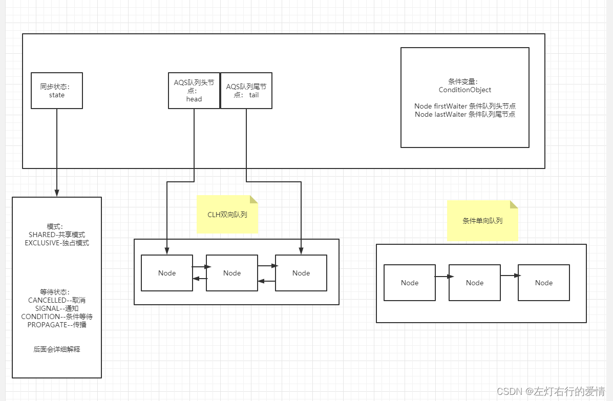  
 代码如下：

```
 private transient volatile Node head;
 private transient volatile Node tail;
//ConditionObject条件变量：
    public class ConditionObject implements Condition, java.io.Serializable {
        private static final long serialVersionUID = 1173984872572414699L;
        /** First node of condition queue. */
        private transient Node firstWaiter;    //头节点
        /** Last node of condition queue. */
        private transient Node lastWaiter;     //尾结点
        // .....后面不是结构重点，不列举了，后面细说
    }

//state 同步状态：在Node内部类里描述如下
 //表示当前节点取消调度
        static final int CANCELLED =  1;
         //表示后驱节点在等待当前节点唤醒（通常由后驱节点入队后，将前驱节点状态设置为SIGNAL）
        static final int SIGNAL    = -1;
        //表示节点在等待队列上
        static final int CONDITION = -2;

        //共享模式下的节点状态，前驱节点不仅会唤醒后驱节点，也可能会继续唤醒后驱的后驱节点，直到后面有节点不符合共享状态为止。
        static final int PROPAGATE = -3;


```

#### 构造方法

```
  /**
     * Creates a new {@code AbstractQueuedSynchronizer} instance
     * with initial synchronization state of zero.
     */
     //默认是一个空的构造方法，此时的state的状态为0
    protected AbstractQueuedSynchronizer() { }


```

#### 重要内部类

##### Node内部类

作用：标识等待队列的节点类  
 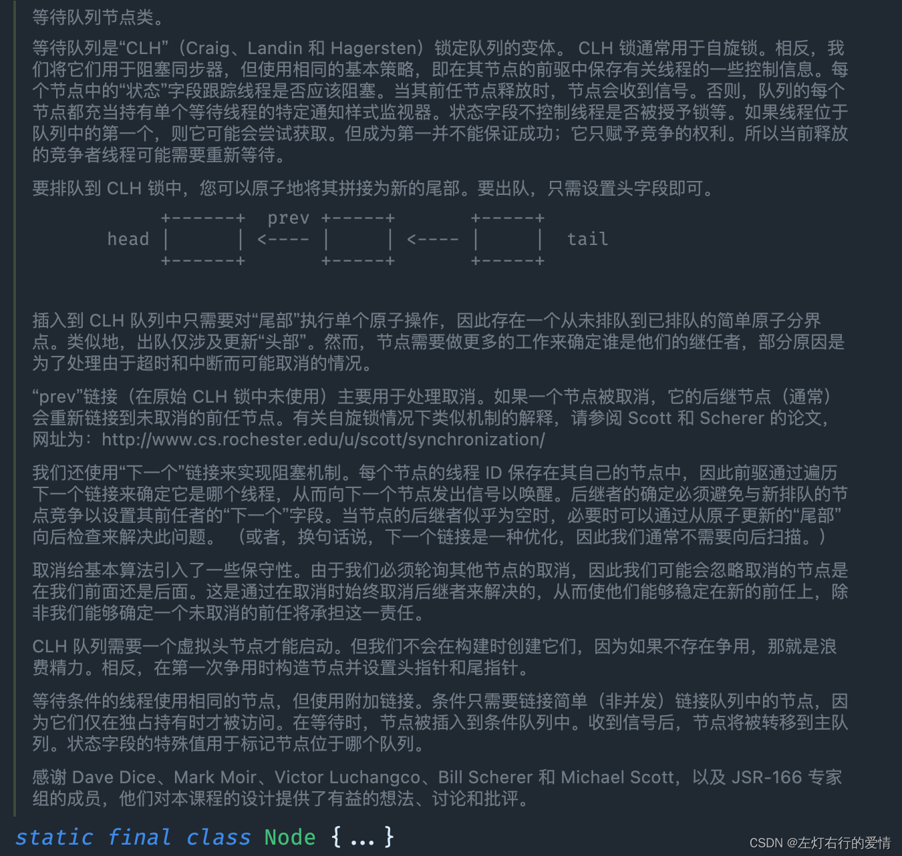  
 Node，队列节点，每一个Node都持有了一个线程，对线程进行包装，方便操作。  
 当线程中的对象调用AQS子类的方法尝试更改AQS维护的状态失败时，就会将Thread对象抽象成这样的Node对象，这样更加利于管理。

源码解析：

```
 static final class Node {
        ///共享式标记
        static final Node SHARED = new Node();
        //独占式标记
        static final Node EXCLUSIVE = null;
        
        //表示当前节点已取消调度（当timeout或被中断（响应中断的情况下），会触发变更为此咋宏泰）
        static final int CANCELLED =  1;
        //表示后驱节点在等待当前节点唤醒（后驱节点入队时，会将前驱节点状态更新为SIGNAL状态）
        static final int SIGNAL    = -1;
        //表示节点在等待队列上，当其他线程调用了Condition的signal()方法后，
        //CONDITION状态的节点将从其等待队列转移到同步队列中，等待获取资源。
        static final int CONDITION = -2;
         //共享模式下的节点状态，前驱节点不仅会唤醒其后驱节点，
        //同时也可能会唤醒后驱的后驱节点
        static final int PROPAGATE = -3;

       //节点等待状态
        volatile int waitStatus;
         //前驱节点
        volatile Node prev;
        //后驱节点
        volatile Node next;

        //等待资源线程
        volatile Thread thread;
        //特殊标记
        Node nextWaiter;

         //是否共享式
        final boolean isShared() {
            return nextWaiter == SHARED;
        }

         //获取前驱节点
        final Node predecessor() {
            Node p = prev;
            if (p == null)
                throw new NullPointerException();
            else
                return p;
        }

        /** Establishes initial head or SHARED marker. */
        Node() {}

        /** Constructor used by addWaiter. */
        //此方法用于添加waiter，只需要初始化thread和node
        Node(Node nextWaiter) {
            this.nextWaiter = nextWaiter;
            THREAD.set(this, Thread.currentThread());
        }

        /** Constructor used by addConditionWaiter. */
        //此方法用于condition，初始化thread，waitStatus
        Node(int waitStatus) {
            WAITSTATUS.set(this, waitStatus);
            THREAD.set(this, Thread.currentThread());
        }

        /** CASes waitStatus field. */
        final boolean compareAndSetWaitStatus(int expect, int update) {
            return WAITSTATUS.compareAndSet(this, expect, update);
        }

        /** CASes next field. */
        final boolean compareAndSetNext(Node expect, Node update) {
            return NEXT.compareAndSet(this, expect, update);
        }

        final void setPrevRelaxed(Node p) {
            PREV.set(this, p);
        }
}


```

通过Node我们可以实现两种队列:

* 通过prev和next实现CLH队列变体(线程同步队列,双向队列)
* 通过nextWaiter实现Condition上的等待线程队列(单向队列)

###### 对于waitStatus进一步解释：

| 状态 | 说明 |
| --- | --- |
| SIGNAL | 表示该节点的后续节点被阻塞（或者很快将要，通过`park`方法），因此当前节点释放或者取消的时候，必需对其后续节点`unpark`，为了避免冲突，acquire方法必需首先指示他们需要的信号，然后重新进行原子型的获取，然后在失败的时候阻塞 |
| CANCELLED | 由于超时或者中断导致该节点被取消，节点永远不会离开这个状态，具有取消的节点，永远不会再被阻塞 |
| CONDITION | 该节点当前在条件队列中，在传输之前，它不会用作同步队列节点，此状态将设置为0，此值的使用在与该字段的其他状态无关，对该机制进行了简化 |
| PROPAGATE | `releaseShared`应该传播到其他节点，在`doReleaseShared`对此进行了设置，仅适用于头节点，以确保传播继续进行，即使以后进行了其他操作也是如此 |
| 0 | 初始创建的节点状态默认为0 |

这些值以数字的形式排列简化使用，非负值表示节点不需要发信号，因此大多数代码不需要检查特定值，仅需检查符号即可。

##### ConditionObject内部类

`ConditionObject`是同步器AQS的内部类,因为`Condition`的操作需要获取相关联的锁,所以作为同步器的内部类也合理.  
 每个`Condition`对象都包含着一个队列(等待队列),该队列是`Condition`对象**实现等待/通知功能的关键**.

###### 数据结构

`ConditionObject`的实现也是一个FIFO队列(等待队列/条件队列)，内部是由`Node`构成的链表，这个类中定义了首尾两个指针（`firstWaiter，lastWaiter`）在队列每个节点都包含了一个线程引用,该线程就是`Condition`对象上等待的线程。

```
       /** First node of condition queue. */
        private transient Node firstWaiter;
        /** Last node of condition queue. */
        private transient Node lastWaiter;


```

主要是用于`ReentrantLock`等锁对象的时候，作为派生的条件变量`Condition`。

一个Lock类可以通过`newCondition`方法，创建多个`Condition`对象。  
 而`Condition`对象就是一个队列，此使复用了AQS类中的Node节点，这个`Condition`实际上只是用到了`nextWaiter`指针，是一个单向链表结构。  
 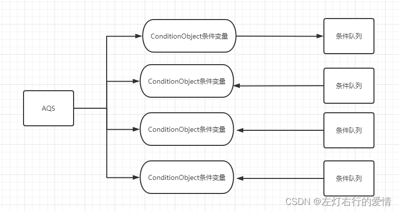  
 当前线程调用`Condition`的`awaitxxx`()方法,会将当前线程构造成一个新结点添加到条件队列的尾部.  
 之类不再使用Node的next属性(他对于AQS的实例变量head,tail很有用),而只是使用`nextWaiter`属性,而且现在的Node的prev属性也不重要了,  
 我们关注的是下一个等待条件唤醒的节点(线程).  
 Node的设计就是如此巧妙,可以在AQS的两个地方扮演着不同的角色.  
 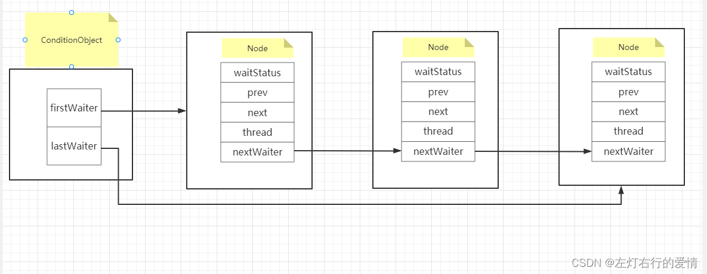  
 上图可看出新增节点只需要将原有的尾节点nextWaiter指向它，并且更新尾节点即可。  
 这里没有使用CAS的方式添加尾节点,因为在调用awaitxxx()方法时,已经获取到锁了.锁可以保证此更新过程是线程安全的.

因为`ConditionObject`是AQS成员内部类,因为成员内部类的实例对象必须依赖于外部实例而存在,所以每个`ConditionObject`都与一个AQS对象(准确的说是AQS子类的对象,因为抽象类不可实例化)相绑定,`ConditionObject`对象可以访问AQS同步器的所有成员变量和方法.  
 因为`Condition.newCondition()`方法可以调用多次,每次都产生一个与AQS对象绑定的Condition条件对象.  
 因为ReentrantLock等锁都将AQS的子类类型的变量作为自身的实力变量,那么很明显在监视器模型上一个(锁)对象拥有一个同步队列和多个条件队列.  
 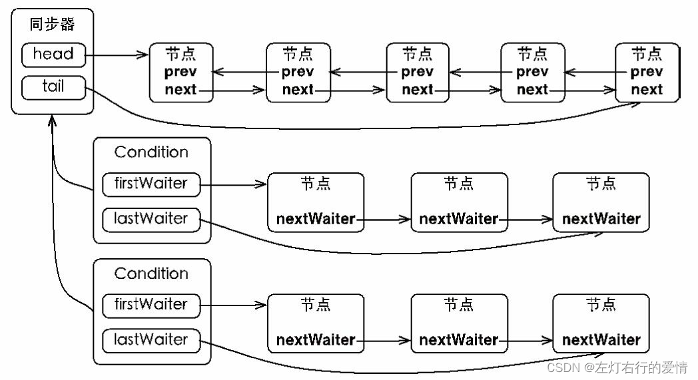

###### 为什么AQS里面要有ConditionObject

* 线程间通信
* 条件等待与通知
* 灵活性
* 与Lock配合使用  
   下一章我们会好好去研究这个，这里先简单了解一下。

#### 等待条件ConditionObject详解

##### 类比Monitor

任意一个Java对象,都拥有一组监视器方法(定义在java.lang.Object上),主要包括:`wait(),wait(long timeout),notify(),notifyAll()`,这些方法与`synchronized`同步关键字配合,可以实现等待/通知模式.  
 这种实现主要体现在JVM层面(对象头)和字节码(`monitoreter,monitorexit和synchronized方法修饰符`)层面的支持.

Condition接口也提供了类似Object监视器方法,与Lock配合可以实现等待/通知模式,这种实现主要是通过数据库结构和算法使用java代码实现.  
 这二者主要差别如下:

| 对比项 | Object Monitor | Condition |
| --- | --- | --- |
| 前置条件 | 获取对象的锁 | 先获取到显示锁，再根据显式锁获取条件Condition对象。Lock.lock()；Lock.newCondition() |
| 调用方式 | 调用对象的wait方法，obj.wait() | 调用Condition对象的awaitXX（）方法 |
| 等待条件个数 | 一个 | 多个 |
| 当线程释放锁并进入等待条件 | 支持 | 支持 |
| 当前线程释放锁并进入等待状态，在等待状态中不响应中断 | 不支持 |  |
| 当前线程释放锁并进入超时等待状态 | 支持 | 支持 |
| 当前线程释放锁并进入等待状态到将来的某个时间 | 不支持 | 支持 |
| 唤醒等待队列中的一个线程 | 支持 | 支持 |
| 唤醒等待队列中的所在线程 | 支持 | 支持 |

由此可看出,二者之间最大不同就是一个支持多个等待队列,一个不支持.  
 在复杂的并发编程中Condition明显有更大优势与便利.

##### 接口抽象方法用法说明

```
public interface Condition {
    //当前线程直到被通知或中断
    void await() throws InterruptedException;
    //当前线程进入等待状态直到被通知（不响应中断）
    void awaitUninterruptibly();
    //当前线程进入等待状态直到被通知或中断或超时。参数表示限定的纳秒数，返回值表示剩余时间，若返回值小于等于零，表明已超时。
    long awaitNanos(long nanosTimeout) throws InterruptedException;
    //当前线程进入等待状态直到被通知或中断或超时。如果超时仍未被通知就返回false，否则返回true.
    boolean await(long time, TimeUnit unit) throws InterruptedException;
    //当前线程进入等待状态直到通知或中断或到了指定的某个时间点。如果到了某个时间点仍未获被通知就返回false，否则返回true。
    boolean awaitUntil(Date deadline) throws InterruptedException;
    //唤醒一个等待在Condition上的线程。
    void signal();
    //唤醒所有等待在些Condtion上的线程。
    void signalAll();
}


```

##### 例子一: 只有当charList中元素个数大于22,out方法才输出并返回,否则一直等待.

```
class Printer {
    private final Lock lock = new ReentrantLock();
    private final Condition lessItem = lock.newCondition();
    private ArrayList<Character> charList = new ArrayList<>(Arrays.asList('1', '3', '4'));

    public void out() {
        lock.lock();
        try {
            if (charList.size() < 22) {
                lessItem.await();
            }
            System.out.println(charList.toString());
            charList.clear();
        } catch (InterruptedException e) {
            e.printStackTrace();
        } finally {
            lock.unlock();
        }
    }

    public void addChar() {
        lock.lock();
        try {
            int i = 0;
            while (i < new Random().nextInt(3) + 3) {
                charList.add(String.valueOf(System.currentTimeMillis()).charAt(i));
                i++;
            }
            if (charList.size() >= 22) {
                lessItem.signal();
            }
        } finally {
            lock.unlock();
        }
    }

    public static void main(String[] args) throws InterruptedException {
        final Printer p = new Printer();
        new Thread(p::out).start();
        new Thread(() -> {
            for (int i = 0; i < 7; i++) {
                System.out.println("第" + (i + 1) + "次addChar()");
                p.addChar();
                try {
                    Thread.sleep(1000);
                } catch (InterruptedException e) {
                    e.printStackTrace();
                }
            }
        }).start();
    }
}


```

#### CLH队列变体

一个**双向链表**组成的队列，Node是AQS的基本构成节点，内部维护的\*\*`FIFO`**（先进先出）双端双向队列，AQS通过CLH队列变体**管理竞争资源\*\*的线程。  
 我们来聊聊CLH队列变体的入队与出队;

##### 入队

背景：获取资源失败的线程需要封装成Node节点，接着尾部入队，在AQS提供`addWaiter`函数完成Node节点的创建与入队。  
 源码：

```
 private Node addWaiter(Node mode) {
       //根据当前线程创建节点，等待状态为0
        Node node = new Node(Thread.currentThread(), mode);
       //获取尾节点
        Node pred = tail;
        if (pred != null) {
        //如果尾结点不为null，把当前节点的前驱节点指向尾节点
            node.prev = pred;
            if (compareAndSetTail(pred, node)) {
            //之前尾节点的后驱节点指向当前节点
                pred.next = node;
                return node;
            }
        }
        //如果添加失败或者队列不存在，执行enq函数
        enq(node);
        return node;
    }


```

```
//自旋cas入队
  private Node enq(final Node node) {
        for (;;) { //死循环
        //获取尾结点
            Node t = tail;
            if (t == null) { // Must initialize
            //如果尾节点为null，创建哨兵节点，通过cas把头节点指向哨兵节点
                if (compareAndSetHead(new Node()))
                //cas成功，尾结点指向哨兵节点
                    tail = head;
            } else {
            //当前节点的前驱节点指向之前的尾结点
                node.prev = t;
                if (compareAndSetTail(t, node)) {
                //cas成功，之前尾结点的下个节点指向当前节点
                    t.next = node;
                    return t;
                }
            }
        }
    }


```

整体流程大概为：通过自旋cas尝试像队列尾部插入节点，直到成功如果发现CLH队列变体不存在会初始化CLH队列变体（这点在doc的翻译里提到过，这里我拷贝过来再看看：

```
     * CLH queues need a dummy header node to get started. But
     * we don't create them on construction, because it would be wasted
     * effort if there is never contention. Instead, the node
     * is constructed and head and tail pointers are set upon first
     * contention.
     CLH队列变体需要一个哨兵节点才能开始。
     但是我们不会在构建过程中创建它们，因为如果没有争用，这将是浪费时间。
     而是创造节点，并在第一次争用时设置头和尾指针。。


```

入队过程如下图：  
 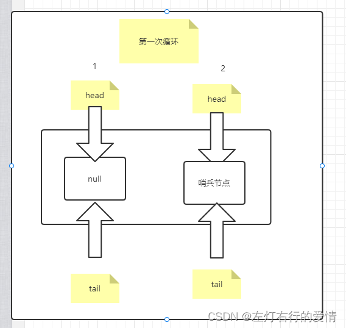  
 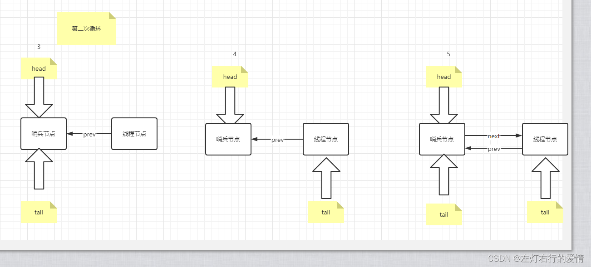

##### 出队

**CLH队列变体中的节点都是获取资源失败的线程节点**，当持有资源的线程释放资源时，会将head.next指向的线程节点唤醒（CLH队列变体的第二个节点），如果唤醒的线程节点获取资源成功，**线程节点清空信息设置为头部节点**（新哨兵节点），原头部节点出队（原哨兵节点）。

```
//展示部分和出队有关的代码，没展示的后面都会解析。
            for (;;) {
                //获取当前节点的前驱节点
                final Node p = node.predecessor();
                //如果p是头节点则会进入tryAcquire再尝试获取锁资源（state从0-1,锁重入
        操作），成功返回true，失败返回false
                if (p == head && tryAcquire(arg)) {
                //如果拿到了锁资源，设置当前节点为头节点，清空当前节点的信息，使之变为哨兵节点
                    setHead(node);
                    //原来首节点的后驱节点置为null
                    p.next = null; // help GC
                    //非异常状态，防止进入finally逻辑，这个后面会提到
                    failed = false;
                    //返回线程中断状态
                    return interrupted;
                }  


```

setHead方法：

```
   private void setHead(Node node) {
   节点设置为头部
        head = node;
        清空线程
        node.thread = null;
        清空前驱节点
        node.prev = null;
    }


```

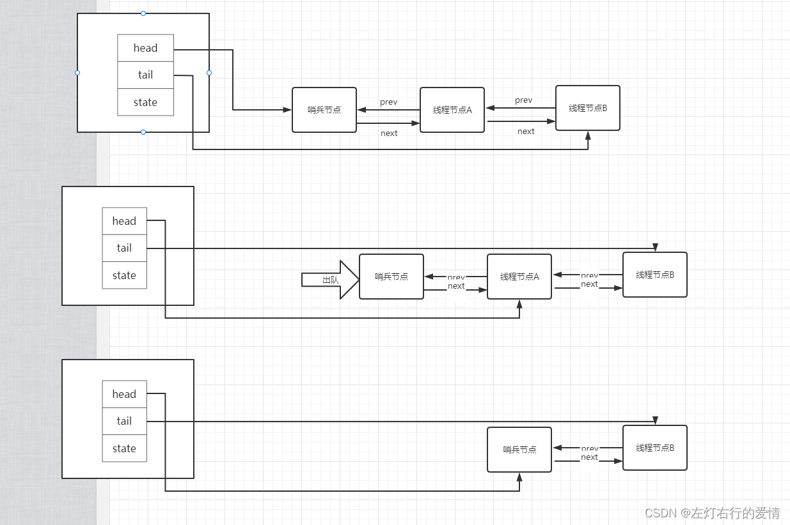

#### AQS基本原理

1. AQS采用**标记状态+队列**来实现，记录获取锁，竞争锁，释放锁等一系列操作，并不关心什么是锁，而是采用了一系列判断资源是否可以访问的API，并且对访问资源受限的时候，对请求线程的操作进行封装：加入队列，挂起，唤醒等操作。
2. 对于线程的操作采用`LockSupport`的`park`和`unpark`方法，我们之前了解过，`LockSupport`底层是使用`Unsafe`类提供的方法，AQS本身也大量采用了`UnSafe`提供的底层API实现，这体现在`CAS`操作之上。  
    3：所以，我们不能简单认为`synchronized`与`reentrantlock`等价，`reentrantlock`依赖于aqs，aqs本身并不是什么锁。  
    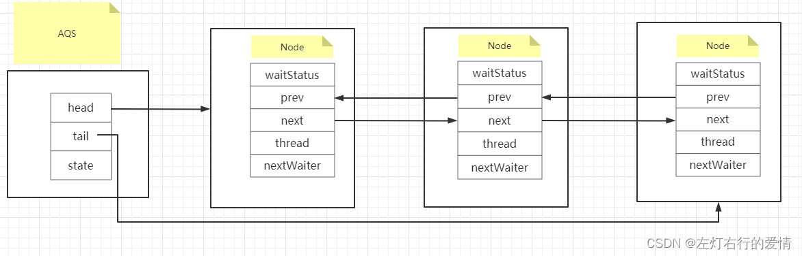

##### 三个问题

1. 资源的访问方式，是只允许一个线程访问，还是同时支持多个线程访问？
2. 资源如果访问的时候无法获得，我们该如何处理？
3. 有的线程等待的时间过长，不想继续等待了，该如何处理？

---

回答:

1. 独占和共享两种模式，AQS分别对于独占和共享提供了相关的API方法，而其子类，要么实现了独占（ReentrantLock），要么实现了共享（ReentrantReadWriteLock），任何一个子类都不会同时实现两套API。
2. 排队，在队列中等待。
3. AQS中定义了关于取消的API，后面我们聊到再说。

##### AQS方法API

AQS目的为了实现了一个`Lock`，那么我们类比实现`Lock`接口，然后再实现一个所谓的锁。注意：AQS还分为共享和独占两种实现，我们和`Lock`对照如下：  
 我们先来浅看Lock的源码实现：

```
public interface Lock {

   //获取锁资源
    void lock();

  //尝试获取锁，如果当前线程被调用了interrupted则中断，并抛出异常，否则就获得锁
    void lockInterruptibly() throws InterruptedException;

  //判断是否获得锁，如果能获得，则获得锁，并返回true
    boolean tryLock();
    
  //保持给定的等待时间，如果期间能拿到锁，则获得锁，同样如果期间被中断，则抛异常
    boolean tryLock(long time, TimeUnit unit) throws InterruptedException;

     //释放锁
    void unlock();

   //返回与此Lock对象绑定Condition实例
    Condition newCondition();
}


```

| 锁方法 | AQS实现 | 说明 |
| --- | --- | --- |
| lock() | acquire(1)/acquireShared(1) | 获得锁，通过独占或者共享方法都能实现，传入的参数是1,这个锁不允许中断，如果调用中断方法将会无响应。 |
| lockInterruptibly() | accquireInterruptibly(1)/acquireSharedInterruptibly(1) | 获得可以中断的锁，支持独占和共享两种方式。 |
| tryLock() | tryAcquire(1)/tryAcquireShared(1) | 尝试获得锁，独占和共享都可以实现，但是不支持超时，会无限等待。 |
| tryLock(timeout) | tryAcquireNanos(1,nanos)/tryAcquireSharedNanos(1,nanos) | 支持超时时间的tryLock方法，当超时时间达到之后，不再等待 |
| unlock() | release(1)/releaseShared(1) | 释放锁，可以通过共享或者独占的方式调用 |
| unlock() | tryRelease(1)/tryReleaseShared(1) | unlock的时候，需要调用tryRelease尝试释放锁。 |
| newCondition() | newCondition() | 这个方法将new一个条件变量ConditionObject，之后通过Condition产生的等待线程都将进入这个等待队列 |

#### 独占式获取资源

`acquire`作为一个模板函数，模板流程是线程获取共享资源：  
 如果获取成功-----线程直接返回  
 获取失败------进入CLH队列变体，直到获取资源成功为止（整个过程忽略中断影响，只有拿到锁之后才响应中断）

acquire源码：

```
    public final void acquire(int arg) {
        if (!tryAcquire(arg) &&
            acquireQueued(addWaiter(Node.EXCLUSIVE), arg))
            selfInterrupt();
    }


```

1. 如果没有获取到锁资源，`tryAcquire`会返回false，取反则为ture，也就是说当没有获取到锁资源时，会进入到`acquireQueued`方法，如果获取锁不成功，并且acquireQueued入队不成功，则调用自我中断selfInterrupt
2. 注意`acquireQueue`方法里的参数`addWaiter`方法（方法参数里的`EXCLUSIVE`代表是独占式节点），这个方法我们前面已经说过了是CLH变体的入队操作。

acquireQueued源码：

```
   final boolean acquireQueued(final Node node, int arg) {
   //异常状态，默认是
        boolean failed = true;
        try {
        //该线程是否中断过，默认否
            boolean interrupted = false;
            for (;;) {  自旋
            //获得前驱节点
                final Node p = node.predecessor();
                //如果前驱节点为首节点，那么尝试获取锁资源
                if (p == head && tryAcquire(arg)) {
                //如果获取到了锁资源，把当前节点设置为头节点，清空当前节点的信息，把当前节点转换为哨兵节点
                    setHead(node);
                    //原来首节点的后驱指针指为null
                    p.next = null; // help GC
                    //非异常状态，防止指向finally逻辑
                    failed = false;
                    //返回线程中断状态
                    return interrupted;
                }
                //如果我们没有获取到锁资源，shouldParkAfterFailedAcquire方法保证了上一个节点是-1，并将线程阻塞，才会返回ture，等待唤醒获取锁资源。
                if (shouldParkAfterFailedAcquire(p, node) &&
                    parkAndCheckInterrupt()    //基于Unsafe类的park方法，挂起线程    
                    )   
                    
                    interrupted = true;
            }
        } finally {
       /**
        我们发现，上面是没有报错抛出的异常的， node.predecessor()可能会抛出异常，但是概率基本为0。
        所以如果我们不进入到for循环里，interred就会一直为false，进不去finally里面的if语句块。
        如果我们执行了for循环，我们最后直接return了，finally也不会执行。
        那么什么时候这个finally会执行呢？
        答案在于，我们执行的方法是不会抛异常的，感兴趣可以去看一看
        **/
        doAcquireInterruptibly（
            if (shouldParkAfterFailedAcquire(p, node) &&
                    parkAndCheckInterrupt())
                    throw new InterruptedException();
                    ）//，那个里面会抛出异常，然后执行finally里面的方法，所以这里我们不去过多关注finally里面的代码，意义不大。
            if (failed)
                cancelAcquire(node);
        }
    }


```

shouldParkAfterFailedAcquire源码：

```
//node是当前节点，pred是上一个节点
  private static boolean shouldParkAfterFailedAcquire(Node pred, Node node) {
    //获取上一个节点的状态
        int ws = pred.waitStatus;
        //如果上一个节点状态为SIGNAL，一切正常。
        if (ws == Node.SIGNAL)
            return true;
            //如果上一个节点已经失效
        if (ws > 0) {
            do {
            //将当前节点的prev指针指向了上一个的上一个节点
                node.prev = pred = pred.prev;
            } while (pred.waitStatus > 0);  //一直找到<=0的
            //将重新标识好的最近的有效节点的next
            pred.next = node;
            //这块逻辑不清楚的画个图就很明白了。
        }else {如果状态<=0,且不等于-1，将上一个有效节点状态修改为-1
            compareAndSetWaitStatus(pred, ws, Node.SIGNAL);
        }
        return false;
    }


```

`shouldParkAfterFailedAcquire`方法非常重要，这个方法保证了在我们线程调用了`acquire`进入 `acquireQueued`方法后没有争夺到锁资源后，确保前驱节点为-1，这样当我们挂起后，确保前一个节点是有效并且可以把我们唤醒的。

#### 独占式释放资源

AQS提供了`release`模板函数来释放资源，流程为释放资源成功，唤醒CLH队列变体的第二个线程节点。  
 `release`源码：

```
  public final boolean release(int arg) {
        if (tryRelease(arg)) { //释放资源成功，tryRelease子类实现
        //获取头部线程节点
            Node h = head;
            if (h != null && h.waitStatus != 0) //头部线程节点不为null，并且等待状态不为0
            //唤醒CLH队列变体第二个线程节点
                unparkSuccessor(h);
            return true;
        }
        return false;
    }


```

`unparkSuccessor`源码：

```
    private void unparkSuccessor(Node node) {
       //获取节点等待状态
        int ws = node.waitStatus;
        //节点有效
        if (ws < 0)
        //cas更新节点为0
            compareAndSetWaitStatus(node, ws, 0);    
         //获取下一个节点   
        Node s = node.next;
        if (s == null || s.waitStatus > 0) {  //如果下一个节点信息异常，从尾节点向前获取到正常的节点为止
            s = null;
            for (Node t = tail; t != null && t != node; t = t.prev)
                if (t.waitStatus <= 0)
                    s = t;
        }
        if (s != null)
        //唤醒线程节点
            LockSupport.unpark(s.thread);
    }


```

#### 共享式获取资源

`acquireShared`是模板函数，流程为线程获取共享资源，如果获取到资源，线程直接返回。  
 否则进入CLH队列变体，直到获取到资源为止（过程忽略中断影响）。

`acquireShared`源码：

```
 public final void acquireShared(int arg) {
 //如果tryAcquireShared返回负数代表失败，0代表成功，但是没有剩余资源
 //如果是正数代表成功且有剩余资源
        if (tryAcquireShared(arg) < 0)
            doAcquireShared(arg);
    }


```

doAcquireShared源码：

```
  private void doAcquireShared(int arg) {
        final Node node = addWaiter(Node.SHARED);//队列里加入共享节点
        boolean failed = true;
        try {
            boolean interrupted = false;
            for (;;) {
                final Node p = node.predecessor();
                if (p == head) {    
                获取锁资源
                    int r = tryAcquireShared(arg);
                    if (r >= 0) {
                        setHeadAndPropagate(node, r); 设置自己为头节点，并唤醒后驱节点
                        p.next = null; // help GC
                        if (interrupted)
                            selfInterrupt();
                        failed = false;
                        return;
                    }
                }
                if (shouldParkAfterFailedAcquire(p, node) &&
                    parkAndCheckInterrupt())
                    interrupted = true;
            }
        } finally {
            if (failed)
                cancelAcquire(node);
        }
    }


```

我们来看一看`setHeadAndPropagate`

```
 private void setHeadAndPropagate(Node node, int propagate) {
        Node h = head;   //获取头节点
        setHead(node);         //节点设置为头部,清空线程,清空前驱节点
   
        if (propagate > 0 || h == null || h.waitStatus < 0 ||
            (h = head) == null || h.waitStatus < 0) {
            Node s = node.next;
            if (s == null || s.isShared())
                doReleaseShared();
        }
    }


```

这个判断有点头大，我们一个一个去分析：

1. propagate>0：说明获取锁成功，且有剩余资源可以获取，所以就继续唤醒队列中的线程把剩余的资源给占用了。
2. h==null，(h=head)==null，这两个判断是防止空指针异常，因为我们向队列中加入了元素，至少会有一个节点。
3. h.waitStatus<0 检测首节点后面还有没有节点，在shouldParkAfterFailedAcquire方法中，每个入队的节点都会把他前面一个节点的状态改成signal=-1的状态，目的是为了让前面一个节点把自己唤醒，这里就体现出来了，这个条件成立，则说明首节点后面还有未被唤醒的节点。
4. 后面又有一个h.waitStatus<0,我们为什么还要再判断一次，难道前面判断不成立，后面我们再判断一次就成立了？我们先分析一下doReleaseShared方法，看能不能从里面找到答案。  
    doReleaseShared源码：

```
 private void doReleaseShared() {
        for (;;) { //自旋
            Node h = head;//获取头节点
            if (h != null && h != tail) {    
            //获取头节点状态
                int ws = h.waitStatus;
                //如果头节点状态为signal，说明头节点后面还有节点，唤醒
                if (ws == Node.SIGNAL) {
                //这里先把头节点状态改为0，0可以看为头节点的中间状态，当我们唤醒第二个节点后才会把头节点干掉
                    if (!compareAndSetWaitStatus(h, Node.SIGNAL, 0)) 
                        continue;           //如果修改不成功则进行下一次自旋不执行后面unparkSuccessor
                    unparkSuccessor(h);//这个方法是唤醒头节点之后第一个处于非取消状态的节点
                }
             /**
                这里是重点：
                ws==0这个是中间状态，说明有一个线程A正在唤醒第二个节点，恰巧此时又有一个线程B释放了资源，也要来唤醒第二个节点，但是B发现A在处理，所以B就把状态改为PROPAGATE=3，而这个状态整数上一个方法需要判断的，上一个方法后面再次判断的h.waitStatus<0，会成立就是在这里设置的。
                **/
                else if (ws == 0 &&
                         !compareAndSetWaitStatus(h, 0, Node.PROPAGATE))
                    continue;                // loop on failed CAS
            }
            if (h == head)                   // loop if head changed
                break;
        }
    }


```

那么第二次判断h.waitStatus<0还有一种情况就是：  
 当h.waitStatus=0时，说明有一个线程释放了资源，而且正在唤醒第二个节点，所以判断第一个h.waitStatus<0条件不成立。  
 当第二个节点获取到锁之后，把第一个节点干掉，那新的首节点状态为signal=-1，所以第二个判断h.waitStatus<0成立。

分析完了，我们来聊聊为什么这么写？  
 作者在setHeadAndPropagate中有段doc注释里面有聊过：

```
  * The conservatism in both of these checks may cause
         * unnecessary wake-ups, but only when there are multiple
         * racing acquires/releases, so most need signals now or soon
         * anyway.
       // 这两种检查的保守性可能会导致不必要的唤醒，但只有当有大量锁获取/释放时才会发生，唤醒之后获取不到锁依旧会继续阻塞。


```

为什么会出现这个没有必要的唤醒。。。。我也不知道。静等懂的大牛赐教= =。

刚开始看都会有点蒙，没关系，我们在这里用图例和代码举一个例子。

#### 共享式获取资源

##### 情况一：队列里没有任何节点，我们要新加一个节点

初始状态：  
 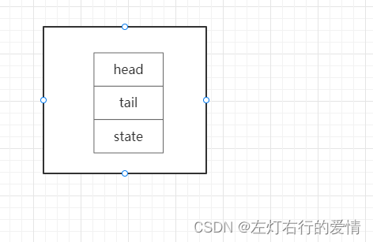  
 我们一个线程节点A要来获取锁资源，调用了`acquireShared`方法：  
 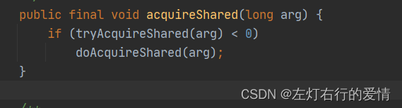  
 很不幸，第一次没有获取到资源，`tryAcquireShared`返回值为负数（失败），进入到了`doAcquireShared`方法里（我们这里截取起要执行的范围，一步步来）：  
 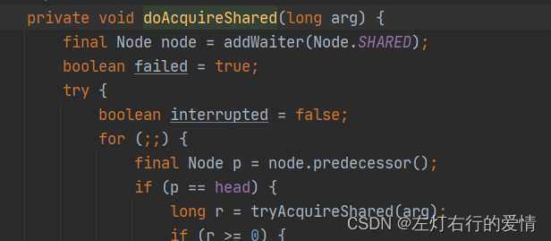  
 执行`addWaiter`，将线程封装为Node节点A放到CLH队列变体中，结果如下（前面我们已经解析过addWaiter了，不太熟悉了再看看）：  
 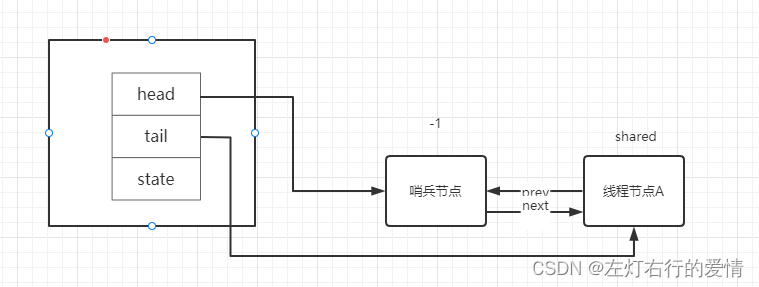  
 然后执行代码流程如下：  
 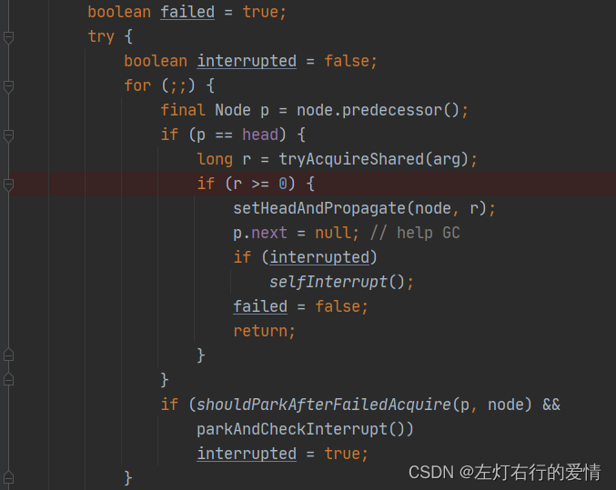  
 我们进入到for循环里：

1. 先得到A节点的前驱节点（在这里为哨兵节点）
2. 进入到if判断中：前驱节点=头节点（哨兵节点）
3. 再次调用`tryAcquireShared`尝试获取锁资源，并把返回值赋给r  
    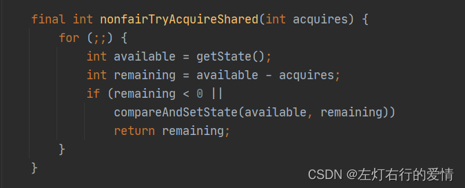

这里我必须要说一下，卡了我真的好久！！！  
 我们这里学习的是AQS，它是一个抽象类，它里面的state在子类中扮演不同的角色，我举个例子：  
 在独立式资源中，`ReentrantLock`子类中state=0代表了线程有资源，可以加竞争锁，线程上锁后要把0改为1，如果是可重入锁，每重入一次+1。  
 而在共享式资源中，`Semaphore`子类中state=0代表了没有资源，state=n，代表有n个资源。  
 所以，我们重新看上图中的代码，这里我们假设是有三个资源，所以`available=3`，这里我们需要一个资源，`acquires=1`，所以3-1=2，代表还有两个资源，最后cas更新state的值。

4. 这里假设我们获取到了锁资源，r=2，代表还有两个资源。
5. 因为r>0,所以我们进入到了`setHeadAndPropagate`方法里（注意方法参数，node=节点A，r=2）  
    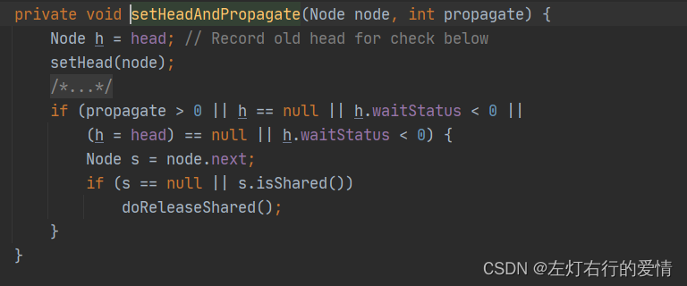
6. 我们进来先获取到头节点（哨兵节点）
7. 执行setHead，因为我们已经获取到线程A了，所以这里开始清楚线程A的内容，把线程A设置为哨兵节点，原先的哨兵节点不要了。  
    执行前：  
    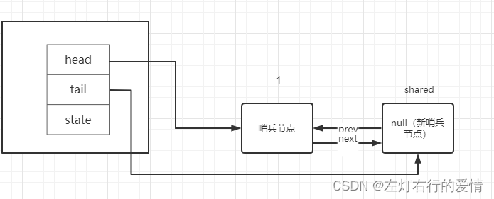  
    执行后：  
    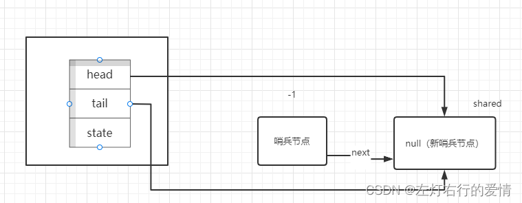
8. 然后执行if里面的方法判断：  
    注意这里我们CLH队列变体里的状态，我们满足的条件有`Propagate>0`(我们的`Progapate=2`）所以可以进入if方法块里  
    9：执行`Node s= node.next`，（这里的`node`为节点A，也就是哨兵节点）  
    10：第二个if语句中，我们满足了`s==null`，因为新哨兵节点后面没有节点了。  
    11：进入`doReleaseShared`方法  
    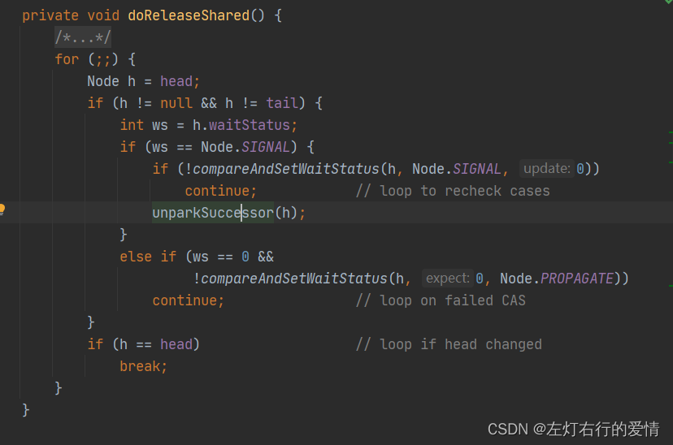
9. 进入for循环，首先我们拿到新哨兵节点
10. if语句判断，我们不符合判断，进入到第二个`if（h==head）`，这个我们符合，直接退出，这里我们完成了共享式资源获取（情况一：队列里没有任何节点，我们要新加一个节点）

##### 情况二：队列里已经有节点了。

线程A，C同时争夺一个锁资源，C线程竞争成功，A进入CLH变体，过一段时间B和C争夺锁资源。  
 这里我们假设C争夺成功。  
 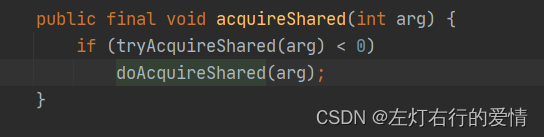  
 所以，`tryAcquireShared`返回负数，执行`doAcquireShared`方法：  
 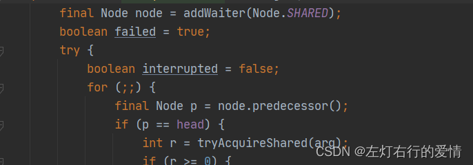

1. 添加节点到CLH队列变体中  
    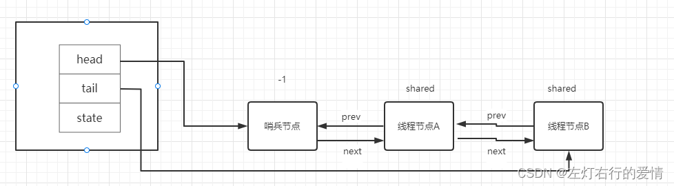
2. 进入for循环，首先获取前驱节点`Node p`，不同的是，这里我们获取到的前驱节点为节点A
3. 进入if判断，`p！=head`，所以进入第三个if语句中（画红线的）

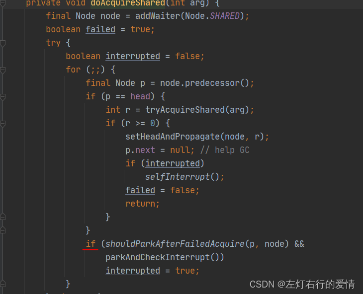  
 我们先进入到`shouldParkAfterFailedAcquire`方法中（注意参数，p为节点A，node为节点B）：  
 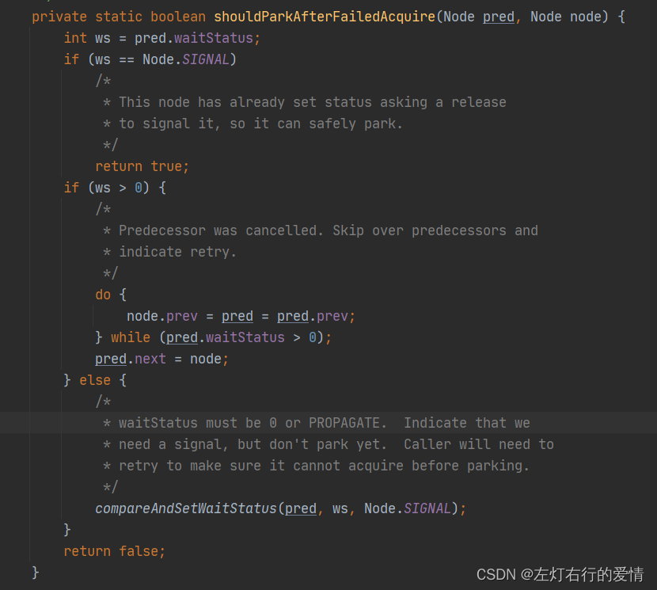

4. 我们先获得节点A的状态ws，注意我们在CLH队列变体中节点A的状态为SHARED
5. 第一个if判断，显然我们状态不为SIGNAL
6. 进入第二个if判断，显然不符合
7. 进入else语句块里，这里我们执行CAS操作，把SHARED转化为SIGNAL。  
    为什么要这么做呢？因为们需要在节点A被唤醒释放后，还能去来通知唤醒我们。  
    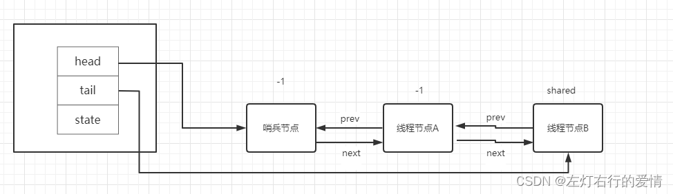
8. 返回false,回到`doAcquireShared`方法里  
    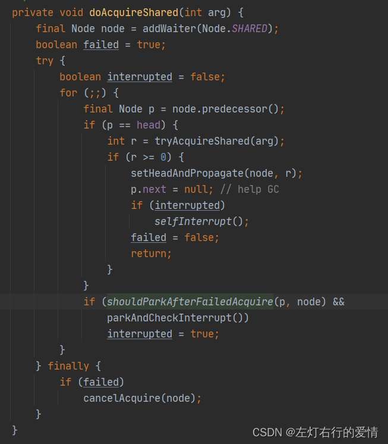
9. 因为我们返回false，所以 `if (shouldParkAfterFailedAcquire(p, node)&&`  
    `parkAndCheckInterrupt())`中，后面的`parkAndCheckInterrupt`这个方法不执行了。
10. 重新开始一轮for循环，前面都一样，就是重新进入到`shouldParkAfterFailedAcquire`方法里面有不同了，我们来看看  
     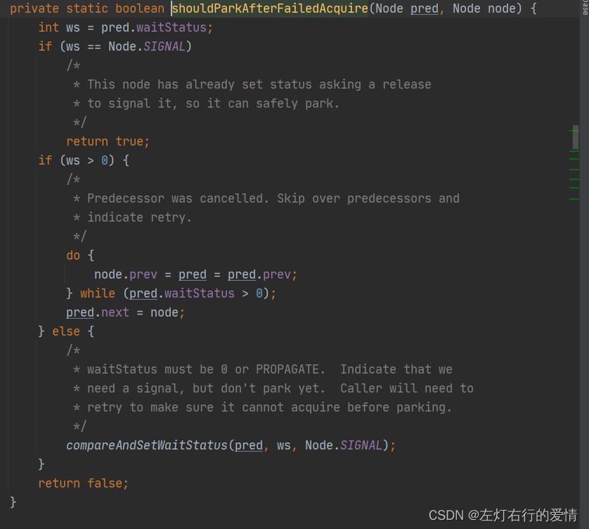
11. 我们先获得前驱节点（节点A），注意此时的节点A的状态已经改为了`SIGNAL`，所以这一次直接返回true。
12. 我们回到`doAcquireShared`方法里的if语句中  
     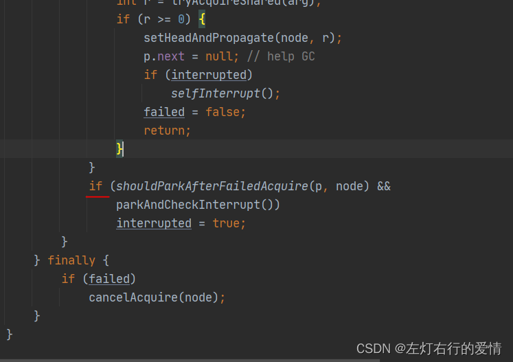
13. 因为`shouldParkAfterFailedAcquire`已经返回了true，所以我们可以执行`parkAndCheckInterrupt`方法  
     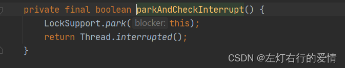
14. 这个方法非常简单，就是将我们当前节点B阻塞。

到这为止，节点B获取资源流程**暂时结束**，当线程A获取到资源并且释放后会来通知节点B来竞争资源，可以看到，`shouldParkAfterFailedAcquire`方法就是确保了当节点阻塞后，节点的前驱节点在释放后可以把我们唤醒去竞争资源，非常重要，如果你还体会不到，继续往下看吧，**我们在这个场景里插个眼记为wang**，后面我们`Fenix`完共享式释放资源，还要回来看。

##### 共享式释放资源

AQS提供了`releaseShared`模板函数来释放资源，流程是线程释放资源成功，唤醒CLH队列变体的第二个线程节点（头节点的下一个节点）。  
 我们先来看`releaseShared`源码

```
  public final boolean releaseShared(int arg) {
        if (tryReleaseShared(arg)) {  释放资源成功
             唤醒后继节点
            doReleaseShared();
            return true;
        }
        return false;
    }


```

tryReleaseShared源码：

```
     protected final boolean tryReleaseShared(int releases) {
            for (;;) {
            //获取到剩余资源
                int current = getState();
               //释放后，资源数+1
                int next = current + releases;
                //如果释放后的资源<初始资源，抛异常
                if (next < current) // overflow
                    throw new Error("Maximum permit count exceeded");
                    //更新成功，返回true，否则自旋
                if (compareAndSetState(current, next))
                    return true;
            }
        }


```

`doReleaseShared`源码：

```
  private void doReleaseShared() {
        for (;;) {
            //获取头节点
            Node h = head;
            if (h != null && h != tail) {
                int ws = h.waitStatus;
    
                if (ws == Node.SIGNAL) {//如果头节点等待状态为SIGNAL
                    if (!compareAndSetWaitStatus(h, Node.SIGNAL, 0))//更新头节点等待状态为0,如果失败，则继续下一次循环尝试
                        continue;        
                    //更新状态成功后，唤醒头节点下个线程节点
                    unparkSuccessor(h);
                }
                //如果后继节点暂时不需要被唤醒，更新头节点等待状态为PROPAGATE（这里能看出来，如果入列CLH变体的节点不把前驱节点的状态改为SINGAL，那么入列的节点前驱节点释放时不会通知它）
                else if (ws == 0 &&
                         !compareAndSetWaitStatus(h, 0, Node.PROPAGATE))
                    continue;               
            }
            if (h == head)              
                break;
        }


```

unparkSuccessor源码：

```
  private void unparkSuccessor(Node node) {
     //拿到头节点的状态
        int ws = node.waitStatus;
        if (ws < 0)
        //将头节点的signal改为0
        compareAndSetWaitStatus(node, ws, 0);
        
        Node s = node.next;  //获取头节点的后驱节点
        //如果后驱节点为null或者失效了
        if (s == null || s.waitStatus > 0) {
            s = null;  //失效节点或者空节点置为null
            //从尾开始遍历
            for (Node t = tail; t != null && t != node; t = t.prev)
                if (t.waitStatus <= 0)   //拿到一个有效的节点并且不是头节点
                    s = t;
        }
        if (s != null)
            LockSupport.unpark(s.thread);//唤醒节点
    }


```

#### 场景

还记得我们之前插的眼吗，这里我们回来继续看  
 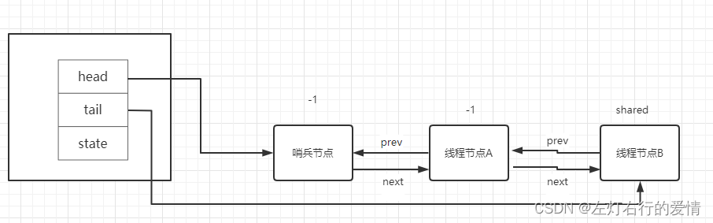  
 某一时间点，节点A被释放了，它唤醒了节点B，那么节点B该如何运行呢？  
 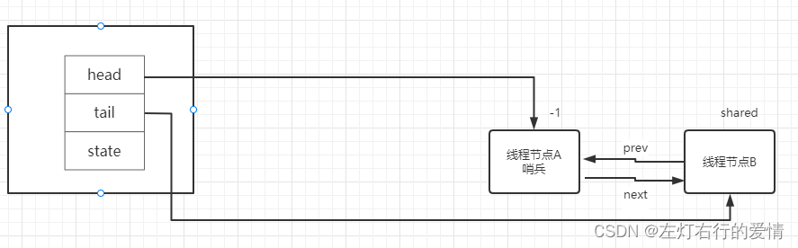  
 注意，此时已经没有节点A了，这里只是为了好区分。

首先我们来看节点B是在哪里阻塞的。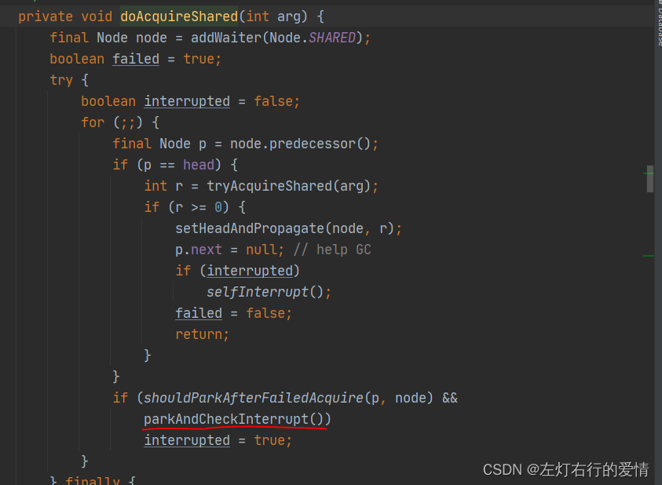

1. 节点B在画红线处阻塞，这时它收到了节点A对节点B的唤醒通知，接着运行if语句块，将`interrupted`置为了true
2. 又开始了一轮for循环  
    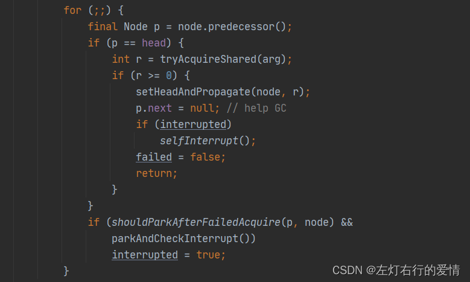  
    这时我们获取到前驱节点A（此时A已经为哨兵节点了），所以if语句能进入。
3. 这这里调用`tryAcquireShared`，这一次获取到了所资源，返回r<0。
4. 然后执行`setHeadPropagate`方法  
    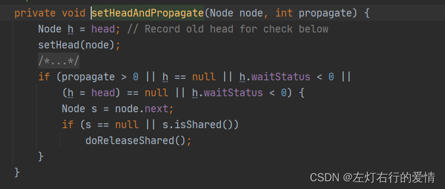  
    a. 简单来说就是节点A（哨兵节点）可以拜拜了，让我（节点B）来当新的哨兵节点==`setHead(node)`  
    b. 同时我还要看看有没有资源(`propagate`是否>0),后驱节点是否为null（这里为null）  
    c. 后驱节点为null，或者后驱节点状态是`shared`，进去`doReleaseShared`方法  
    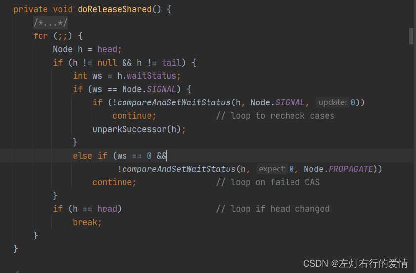
5. 我们首先获取了h，注意此时的h就是线程B了，注意第一个判断是不成立的，因为此时我们只有一个哨兵了，队列为null，所以直接执最后的if语句（h==head），直接退出了。  
    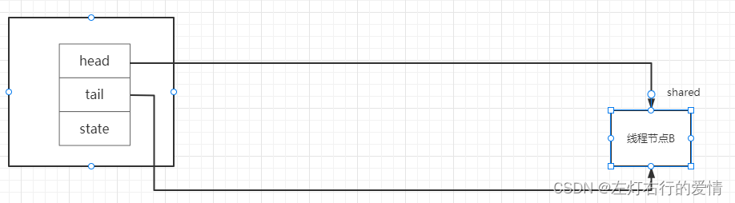

### 结尾

这个AQS真的把我人写裂开了，里面的源码真的很麻烦，绕来绕去，绕来绕去，再加上看明白和说明白又是两回事，所以如果你在看我的文章觉得AQS好难，那就换篇文章看吧，不过我写的应该挺全面的，参考的有老李头写的论文，还有大牛的一些文章，仔细品品应该收获不小的，加油。
