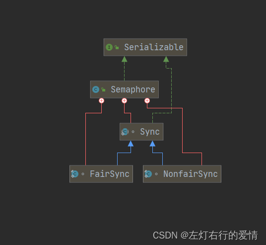

> 原文：[CSDN](https://blog.csdn.net/qq_45852626/article/details/126391026)（历史文章导入，当前状态为草稿）

##### 前言

一般我们使用锁的时候，在多线程下严格要求只能一个线程获取到锁，但是在某些场景下，我们需要有多个线程获取到锁，但是这个时候其实称之为资源最好。  
举个模型就是生产者和消费者模型（多个生产者和多个消费者），如果使用互斥锁，那么只能一次让一个线程去生产或者消费，效率太低，JDK提供了同步工具Semaphore可以帮我们解决这个难题，Semaphore也可以看做是AQS的共享模式实现。

插一句：我建议可以和ReentrantLock和AQS结合着去学。

##### 什么是Semaphore

1：Semaphore是JDK提供的一个同步工具，也是计数信号量，它通过维护若干个许可证来控制线程对共享资源的访问。  
2：如果许可证剩余数量大于零时，线程则允许访问该共享资源；  
如果许可证剩余数量为零时，则拒绝线程访问该共享资源。  
3：Semaphore所维护的许可证数量就是允许访问共享资源的最大线程数量。  
所以，线程想要访问共享资源必须从Semaphore中获取到许可证。

##### 继承结构

  
代码实现：

```
public class Semaphore implements java.io.Serializable


```

1：Serializable-实现可序列化

##### Doc解析

```
/**
 * A counting semaphore.  Conceptually, a semaphore maintains a set of
 * permits.  
 * Semaphore是一个可用于计数的信号量，概念上解释：信号量实际是一组许可证
 * Each {@link #acquire} blocks if necessary until a permit is available, and then takes it.  
 * 每一个acquire操作都需要获得许可证才可以进行
 * Each {@link #release} adds a permit,potentially releasing a blocking acquirer.
  每个release方法则会将之前获取的许可证释放
 * However, no actual permit objects are used; 
但是，Semaphore并没有实际许可证对象存在
 * the {@code Semaphore} just keeps a count of the number available and acts accordingly.
 * 它只是采取一个用于计数的数量值并进行加减操作
 *
 * <p>Semaphores are often used to restrict the number of threads than can
 * access some (physical or logical) resource. 
 * 信号量通常用于限制线程数量，但是不能访问某些资源
 * For example, here is a class that uses a semaphore to control access to a pool of items:
 * 例如，下面是一个使用信号量控制项目pool访问的类
 *  <pre> {@code
 * class Pool {
 *   private static final int MAX_AVAILABLE = 100;
 *   private final Semaphore available = new Semaphore(MAX_AVAILABLE, true);
 *
 *   public Object getItem() throws InterruptedException {
 *     available.acquire();
 *     return getNextAvailableItem();
 *   }
 *
 *   public void putItem(Object x) {
 *     if (markAsUnused(x))
 *       available.release();
 *   }
 *
 *   // Not a particularly efficient data structure; just for demo
 *
 *   protected Object[] items = ... whatever kinds of items being managed
 *   protected boolean[] used = new boolean[MAX_AVAILABLE];
 *
 *   protected synchronized Object getNextAvailableItem() {
 *     for (int i = 0; i < MAX_AVAILABLE; ++i) {
 *       if (!used[i]) {
 *          used[i] = true;
 *          return items[i];
 *       }
 *     }
 *     return null; // not reached
 *   }
 *
 *   protected synchronized boolean markAsUnused(Object item) {
 *     for (int i = 0; i < MAX_AVAILABLE; ++i) {
 *       if (item == items[i]) {
 *          if (used[i]) {
 *            used[i] = false;
 *            return true;
 *          } else
 *            return false;
 *       }
 *     }
 *     return false;
 *   }
 * }}</pre>
 *
 * <p>Before obtaining an item each thread must acquire a permit from
 * the semaphore, guaranteeing that an item is available for use. 
 * 在获取之前，每个线程必需从信号量获取许可，以确保是可以使用的。
 * Whenthe thread has finished with the item it is returned back to the
 * pool and a permit is returned to the semaphore, allowing another
 * thread to acquire that item.
当线程完成该获取项之后，会返回到pool中，并向信号量返回一个许可，从而使另一个线程可以获取它。
 Note that no synchronization lock is held when {@link #acquire} is called as that would prevent an item from being returned to the pool. 
 需要注意，调用acquire不会保持任何锁同步，因为这会阻止某一个项返回到pool中
  The semaphore encapsulates the synchronization needed to restrict access to the pool, separately from any synchronization needed to maintain the consistency of the pool itself.
  信号量封装了限制访问池所需的同步，与维护池本身一致性所需的任何同步分开。
 * <p>A semaphore initialized to one, and which is used such that it
 * only has at most one permit available, can serve as a mutual
 * exclusion lock. 
 * 初始化一个信号量可以用作互斥锁，因为这样只有一个许可
 *  This is more commonly known as a <em>binary
 * semaphore</em>, because it only has two states: one permit
 * available, or zero permits available.  
 * 也通常称之为二进制信号量，因为只有两种状态：一个许可可用，一个没有许可可用
 * When used in this way, the binary semaphore has the property (unlike many {@link java.util.concurrent.locks.Lock} implementations), that the &quot;lock&quot; can be released by a thread other than the owner (as semaphores have no notion of ownership).  
 * 当使用这种方式时，二进制信号量具有锁定属性，这与许多Lock的实现不同，这个可以由所有者之外的线程释放（因为信号量本身没有所有权概念）
 * This can be useful in some specialized contexts, such
 * as deadlock recovery.
 *这在某些特殊情况下（如死锁恢复）会很有用
 * <p> The constructor for this class optionally accepts a
 * <em>fairness</em> parameter.
 * 此类的构造函数可以选择公平参数fairmess。
 *  When set false, this class makes no guarantees about the order in which threads acquire permits. 
 * 设置为false时，此类不保证线程获得许可的顺序。
 * In particular, <em>barging</em> is permitted, that is, a thread
 * invoking {@link #acquire} can be allocated a permit ahead of a
 * thread that has been waiting - logically the new thread places itself at
 * the head of the queue of waiting threads. 
 * 特别是允许插队，也就是说，可以在正在等待的线程之前尾调用acquire的线程分配一个许可，从逻辑上来说，新线程将自己置于该线程的头部等待线程的队列。
 * When fairness is set true, the semaphore guarantees that threads invoking any of the {@link #acquire() acquire} methods are selected to obtain permits in the order in which their invocation of those methods was processed(first-in-first-out; FIFO). 
 * 当公平性设置为true时，信号量可确保选择调用任何acquire方法的线程以处理它们调用这些方法的顺序获得许可（先进先出FIFO）。
 * Note that FIFO ordering necessarily applies to specific internal points of execution within these methods.  
 * 注意，FIFO排序必需适用于这些方法的特定内部执行点
 * So, it is possible for one thread to invoke {@code acquire} before another, but reach the ordering point after the other, and similarly upon return from the method.
 * 所以，一个线程有可能在另一个线程之前掉acquire，但在另一个线程到达排序点，并且类似从该方法返回也是如此。
 * Also note that the untimed {@link #tryAcquire() tryAcquire} methods do not
 * honor the fairness setting, but will take any permits that are available.
 *另请注意，未定时的tryAcquire方法不遵循公平性设置，但会采用任何可用的许可。
 * <p>Generally, semaphores used to control resource access should be
 * initialized as fair, to ensure that no thread is starved out from
 * accessing a resource. 
 * 通常，用于控制资源访问的信号量应初始化为公平，以确保没有线程因访问资源而挨饿。
 * When using semaphores for other kinds of synchronization control, the throughput advantages of non-fair ordering often outweigh fairness considerations.
 *当使用信号量进行其他类型的同步控制时，非公平锁的吞吐量通常会超过公平
 * <p>This class also provides convenience methods to {@link
 * #acquire(int) acquire} and {@link #release(int) release} multiple
 * permits at a time.
 * 此类提供了acquire，release来控制许可
 */


```

##### 内部类

内部类有三个：抽象类Sync，NonfairSync，FairSync  
一：Sync  
Semaphore基于AQS实现。

```
    /**
     * Synchronization implementation for semaphore.  Uses AQS state
     * to represent permits. Subclassed into fair and nonfair
     * versions.
     */
    abstract static class Sync extends AbstractQueuedSynchronizer {
        private static final long serialVersionUID = 1192457210091910933L;

        Sync(int permits) {
            setState(permits);
        }

        final int getPermits() {
            return getState();
        }
   非公平锁模式下尝试获取共享锁
        final int nonfairTryAcquireShared(int acquires) {
            for (;;) {
            获得state状态
                int available = getState();
                int remaining = available - acquires;
                如果要修改的state值<0,或者cas的方式成功，则退出
                if (remaining < 0 ||
                    compareAndSetState(available, remaining))
                    
                    return remaining;
            }
        }
      释放共享锁
        protected final boolean tryReleaseShared(int releases) {
            for (;;) {
             获得state状态
                int current = getState();
                int next = current + releases;
                如果next比current小，越界
                if (next < current) // overflow
                    throw new Error("Maximum permit count exceeded");
                    如果没有异常，则cas设置next 成功则为true
                if (compareAndSetState(current, next))
                    return true;
            }
        }
   减少许可证
        final void reducePermits(int reductions) {
            for (;;) {
            //获得当前的state
                int current = getState();
                int next = current - reductions;
                如果next任然大于current则说明没有这么多许可证
                if (next > current) // underflow
                    throw new Error("Permit count underflow");
                if (compareAndSetState(current, next))
                    return;
            }
        }
    将许可证清空
        final int drainPermits() {
            for (;;) {
                int current = getState();
                if (current == 0 || compareAndSetState(current, 0))
                    return current;
            }
        }
    }


```

二：NonfairSync

```
  static final class NonfairSync extends Sync {
        private static final long serialVersionUID = -2694183684443567898L;

        NonfairSync(int permits) {
            super(permits);
        }

        protected int tryAcquireShared(int acquires) {
            return nonfairTryAcquireShared(acquires);
        }
    }


```

三：FairSync

```
 static final class FairSync extends Sync {
        private static final long serialVersionUID = 2014338818796000944L;

        FairSync(int permits) {
            super(permits);
        }

        protected int tryAcquireShared(int acquires) {
            for (;;) {
            //判断队列中是否存在前任节点，如果存在，返回-1，将当前线程阻塞
                if (hasQueuedPredecessors())
                    return -1;
                //available为当前state
                int available = getState();
                int remaining = available - acquires;
                   //如果remaining小于0 或者cas设置为0 则返回
                if (remaining < 0 ||
                    compareAndSetState(available, remaining))
                    return remaining;
            }
        }
    }


```

##### 构造方法

1:参数为信号量

```
public Semaphore(int permits) {
    sync = new NonfairSync(permits);
}


```

2:参数信号量和是否公平性

```
public Semaphore(int permits, boolean fair) {
    sync = fair ? new FairSync(permits) : new NonfairSync(permits);
}


```

##### 总结

其实还有一些方法，但是我们要知道，Semaphore本质上是基于AQS实现的，它里面很多方法都是来源于AQS，里面的所有方法在AQS里都有提到过，建议先去学AQS再来看本篇，不再赘述了。
