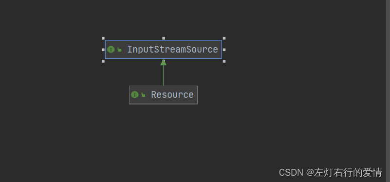
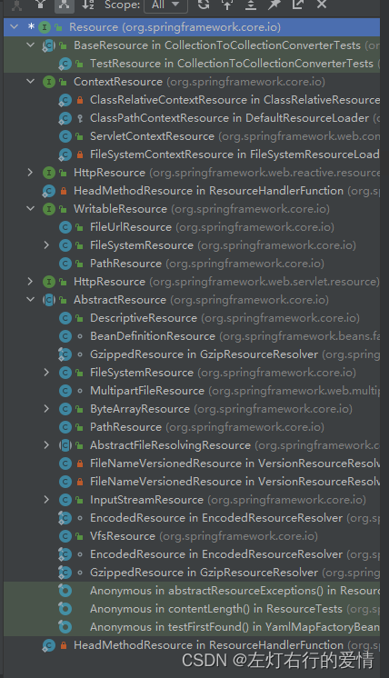
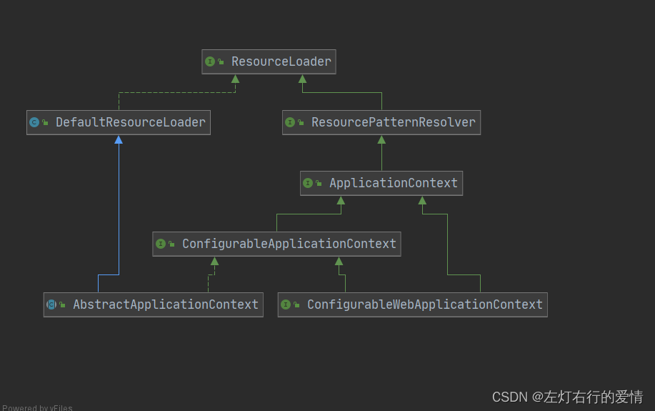
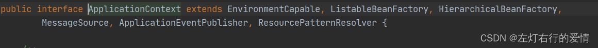
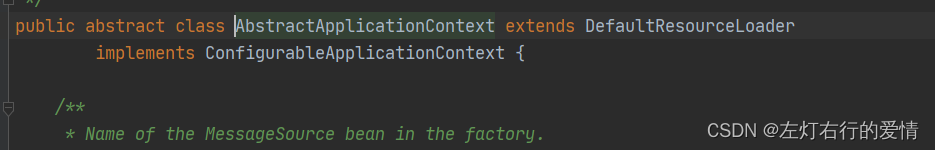
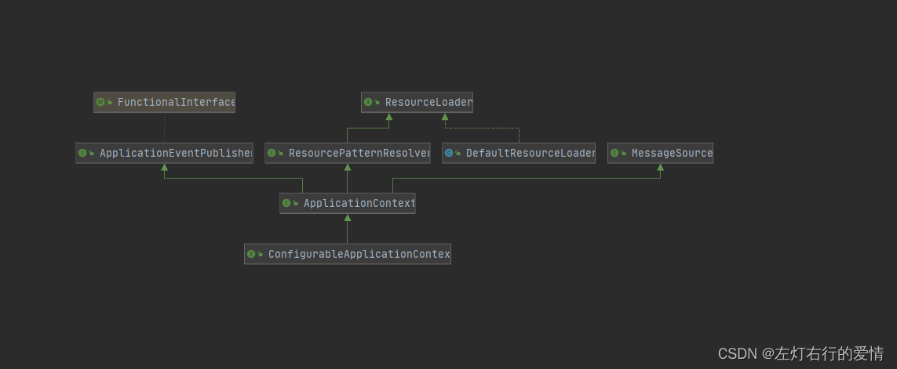
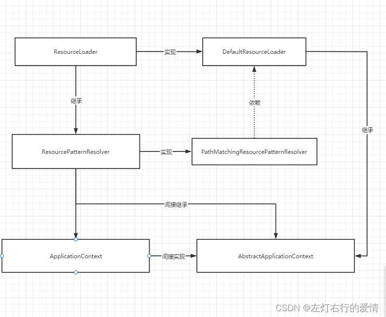

> 原文：[CSDN](https://blog.csdn.net/qq_45852626/article/details/127583745)（历史文章导入，当前状态为草稿）

#### Resource你不得不知的事情
#### 前言

我们为什么要学习Spring下面的Resource模块？  
 首先我们要了解什么是资源，我们把资源来自于几个方面：比如spring中xml配置文件，url网络上不同渠道的资源，自建的properties文件等，程序对于这些资源的访问，被称之为资源访问。  
 我们在学习spring之前，接触过一些资源访问API，比如InputStream等文件的IO，java.net.URL。  
 首先，它们都不是专门为Web服务设计的，对于Spring服务，这些工具比较底层，直接使用这些方法，首先要编写更多额外的代码，比如文件是否存在的判断，路径转换。  
 其次，他们对于访问底层资源的能力不够，没有一种URL的实现可以访问需要从类路径的资源或者相对于ServletContext获得的资源，虽然可以为专门的URL前缀注册新的处理程序（类似于现有的用于前缀的处理程序：如http：），但是比较复杂。而且URL缺少需要的一些功能，比如检查被指向的资源是否存在的方法（上面提到过，原理在于，URL表示一个统一的资源定位符，一个指向互联网上“资源”的指针，较于Resource更侧重于web资源，而Resource是实现资源的抽象，可以检查资源是否存在）。  
 Spring整合了获取资源的工具，统一读取例如本地文件，classpath项目路径下的文件，url互联网上的文件等不同渠道的资源，也封装了打开流，关闭流，报错处理等大量重复模板的代码，专程设计Resource接口类。

#### Resource内容

##### 继承结构

  
 代码如下：

```
public interface Resource extends InputStreamSource


```

InputStreamSource接口：spring核心工具包输入流接口，该接口只有一个抽象方法，每次调用这个方法都会得到一个新的流。

```
public interface InputStreamSource {
    InputStream getInputStream() throws IOException;
}


```

##### DOC解释

```
 * Interface for a resource descriptor that abstracts from the actual
 * type of underlying resource, such as a file or class path resource.
 *从实际类型的底层资源（例如文件或类路径资源）中抽象出来的资源描述符的接口


```

##### 提供的功能

```
boolean exists();//返回Resource所指向的底层资源是否存在

default boolean isReadable() {  //返回当前Resource代表的底层资源是否可读
		return exists();
	}
default boolean isOpen() {
		//返回Resource资源文件是否已经打开，如果是，则只能被读取一次然后关闭以避免内存泄漏
		//常见的Resource实现一般都返回false
		return false;
	}
//如果当前Resource代表的底层资源能由java.util.URL代表，则返回URL，否则抛出io异常
	URL getURL() throws IOException;
//如果当前Resource代表的底层资源能由java.util.URI代表，则返回该URI，否则抛出io异常
	URI getURI() throws IOException;
//	如果当前Resource代表的底层资源能由java.io.File代表，则返回FIle，否则抛出io异常
	File getFile() throws IOException;
	
//返回当前Resource代表的底层资源的长度，一般是值代表的文件资源的长度。
	long contentLength() throws IOException;
	
//返回当前Resource代表的底层资源的最后修改时间。
	long lastModified() throws IOException;
	@Nullable
	//返回当前Resource代表的底层文件资源的文件路径，比如File资源“file://E:/hao/wang.txt”将返回“E:/hao/wang.txt”
	//如果是URL资源，无论地址是多少，都返回"",因为只会返回文件路径。
	String getFilename();
//返回当前Resource代表的底层资源的描述符，通常是资源的全路径（实际的文件名或实际的URL地址）
	String getDescription();


```

##### 重要的内置Resource实现

先看一下Resource接口的子类都有什么：  
   
 我们简单看一看Spring内提供的比较重要常用的Resource实现：

* UrlResource
* ClassPathResource
* FileSystemResource
* ServletContextResource
* InputStreamResource
* ByteArrayResource
* 等等。。

###### UrlResource

代表URL资源，用于简化URL资源访问，对java.net.URL进行了包装。该方法接受一个表示路径的字符串参数，它把不同来源的资源抽象成URL，通过注册不同的handler来处理不同来源的资源的读取逻辑。一般不同类型使用不同的前缀。  
 isOpen 永远返回false，表示可多次读取资源。  
 UrlResource应该提供标准的协议前缀，一般支持如下资源访问：

* http：通过标准的http协议访问web资源
* ftp：通过ftp协议访问资源
* file：通过file协议访问本地文件系统资源  
   缺点：  
   UrlResource无法解决相对于classPath路径或servletContext的处理方法，因此需要其他的Resource实现类。

###### ClassPathResource

代表classPath路径的资源，使用ClassLoader加载资源。  
 其主要优势就是方便访问类加载路径下的资源，尤其是Web应用，因为它可以自动搜索位于WEB-INF/classes下的资源文件。  
 classPath资源位于类路径中的文件系统中或jar包里，且isOpen永远返回false，表示可多次读取资源。  
 ClassPathResource加载资源替代了Class类和ClassLoader类的getResource(String name）和getResourceAsStream（String name）两个加载类路径资源方法，提供一致的访问方式。  
 ClassPathResource提供了三个构造器：

* public ClassPathResource(String path)：使用默认的ClassLoader加载Path类路径资源；
* public ClassPathResource(String path,ClassLoader classLoader)：使用指定的ClassLoader加载“Path”类路径资源；
* public ClassPathResource(String path，Class<?> clazz)：使用指定的类加载"path"类路径资源，将加载相对于当前类的路径的资源。

###### FileSystemResource

代表了java.io.File资源，对于getInputStream操作将返回底层文件的字节流，isOpen将永远返回false，从而表示可以多次读取底层文件的字节流。

###### ServletContextResource

访问Web Context下相对路径下的资源，入参的资源位置是相对于Web应用根路径的位置(工程文件夹下，WEB-INF所在的那级文件夹)。用于简化servlet容器的ServletContext接口的getResource操作和getResourceAsStream操作。  
 使用ServletContextResource无需关心资源是否被解压缩出来，或者直接存放在JAR文件中，都可以通过Servlet容器访问。  
 接受的参数为ServletContext和字符串类型

###### InputStreamResource

代表java.io.InputStream字节流，对于getInputStream操作将直接返回该字节流，因此只能读取一次该字节流，即isOpen永远返回true（其他Resource大都为false可以多次读取）。  
 只有当没有合适Resource实现时，才考虑使用InputStreamResource。一般考虑使用ByteArrayResource。参数需要InputStream类型。  
 如果需要将资源描述符保存在某个地方或者需要多次读取流，不要使用。

###### ByteArrayResource

可以多次读取数组资源，即isOpen永远返回false  
 参数需要byte[]字节数组类型，用途比较广泛，可以把网络或者本地资源转换为byte[]类型，然后用ByteArrayResource转化为资源，而且不必依赖一次性使用的InputStreamResource。

#### ResourceLoader内容

前面我们了解到了，Spring整合获取资源的工具，就是使用Resource接口。此接口是Spring为了统一读取本地文件，类路径下面文件（ClassPath），网络等不同类型渠道的资源，封装隐藏如打开流，关闭流等大量重复模板代码，专程提供的接口类。  
 那么，Spring框架为了更方便的获取资源，全力弱化使用者对各个Resource接口实现类的学习与使用成本，设计目的为了快速返回（加载）Resource实例对象，定义了另一个接口，ResourceLoader接口。

##### 结构体系

  
 我们可以看见比较熟悉的内容：  
 1.ApplicationContext–上下文容器，这里说明高级容器（应用上下文容器）也是实现了ResourceLoader接口的，其本身就是一个ResourceLoader，所以说高级容器都可以根据资源地址类型快速获取对应的Resource实例。  
 2.资源获取策略的顶级接口–ResourceLoader接口  
 3.ResourcePatternResolver–扩展ResourceLoader，可以批量加载Resource对象。

##### 源码分析

```
public interface ResourceLoader {

    //支持ClassPath：类型的路径匹配
	String CLASSPATH_URL_PREFIX = ResourceUtils.CLASSPATH_URL_PREFIX;
	
    //根据路径信息返回一个对应的Resource资源实例
	Resource getResource(String location);
	
    //获取当前使用的ClassLoader，对外暴露，让ResourceLoader可以使用自定义的ClassLoader
	@Nullable
	ClassLoader getClassLoader();

}


```

我们可以看到，ResourceLoader接口有默认实现类——DefaultResourceLoader类  
 DefaultResourceLoader类实现了ResourceLoader接口加载资源的方法，同时也扩展了一些通用的基本操作方法，其中最重要的就是实现了getResource（String location）方法，我们看一下里面重要的实现方法的源码，其他不是重点，有兴趣额外了解吧：

```
@Override
	public Resource getResource(String location) {
		Assert.notNull(location, "Location must not be null");
          //ProtocolResolver:用户自定义协议资源解决策略，看看用户是否有提前自定义
		for (ProtocolResolver protocolResolver : getProtocolResolvers()) {
			Resource resource = protocolResolver.resolve(location, this);
			if (resource != null) {
				return resource;
			}
		}
        //如果用户没有自定义策略，就用以下自定义资源解析策略
        //如果是“/”打头，就构造并返回ClassPathResource
		if (location.startsWith("/")) {
			return getResourceByPath(location);
		}    
		//如果以“ClassPath：”打头也会构造构造并返回ClassPathResource在构造资源时还会获取类加载器
		else if (location.startsWith(CLASSPATH_URL_PREFIX)) {
			return new ClassPathResource(location.substring(CLASSPATH_URL_PREFIX.length()), getClassLoader());
		}
		//如果上述方式无法构造，则构造URL地址，并尝试通过URL进行资源定位，若没有就抛出异常
		//然后判断是否为FileURL，如果是就返回FileUrlResource，否则就构造UrlResource
		//若是加载的过程中抛错，委派getResourceByPath来实现资源定位和加载
		else {
			try {
				// Try to parse the location as a URL...
				URL url = new URL(location);
				return (ResourceUtils.isFileURL(url) ? new FileUrlResource(url) : new UrlResource(url));
			}
			catch (MalformedURLException ex) {
				// No URL -> resolve as resource path.
				return getResourceByPath(location);
			}
		}
	}

我们来看一下这个return的方法

	protected Resource getResourceByPath(String path) {
		return new ClassPathContextResource(path, getClassLoader());
	}

	protected static class ClassPathContextResource extends ClassPathResource implements ContextResource {
		public ClassPathContextResource(String path, @Nullable ClassLoader classLoader) {
			super(path, classLoader);
		}
		//其他代码省略
		}

	
我们上面已经了解过了ClassPathResource（path，classLoader）使用指定的ClassLoader加载“Path”类路径资源；相信看到这里你已经明白了。


```

#### ResourcePatternResolver内容

对于ResourcePatternResolver接口来说，除了继承自Resource方法外，ResourcePatternResolver额外扩充了一个方法，就来批量加载Resource资源对象，源码如下：

```
public interface ResourcePatternResolver extends ResourceLoader {

	//支持classpath*:形式路径匹配，即Ant风格
	String CLASSPATH_ALL_URL_PREFIX = "classpath*:";

   //批量加载Resource资源类型的实现
	Resource[] getResources(String locationPattern) throws IOException;

}


```

ResourcePatternResolver接口的默认实现类——PathMatchingResourcePatternResolver类  
 这里全部列出没什么必要，因为PathMatchingResourcePatternResolver实例化了一个ResourceLoader，继承的ResourceLoader中方法都委托给了内部的ResourceLoader对象去处理。  
 对于PathMatchingResourcePatternResolver只负责实现处理ResourcePatternResolver中的方法，这里主要是实现getResources(String locationPattern)方法。  
 源码如下：

```
public class PathMatchingResourcePatternResolver implements ResourcePatternResolver {

private final ResourceLoader resourceLoader;

private PathMatcher pathMatcher = new AntPathMatcher();

public Resource[] getResources(String locationPattern) throws IOException //有点复杂，知道有这个就行，感兴趣自己查一下。

}


```

我们在上面可以看到，PathMatchingResourcePatternResolver引入了一个新的组件PathMatcher，  
 这个PathMatcher负责对基于字符串的路径和指定的模式符号进行匹配。  
 对于这个接口PathMatcher而言，它被翻译为路径匹配模板解析器，**先用模板解析器对路径进行解析，分解成多个资源配置文件，将资源信息提供给资源加载器，后者根据不同策略将配置文件形成不同类型的资源**。

##### 容器与Resolver关系

我们从Application源码中可以看到，接口继承了ResourcePatternResolver接口，也就是说，ApplicationContext本身也是一个模板解释器和资源加载器，是模板解释器的具体实现，是支持Ant风格路径匹配和批量加载资源的一个资源加载器。  
   
 我们来好好分析一波里面的继承关系：  
 ApplicationContext的抽象实现类AbstractApplicationContext在实现了ConfigurableApplicationContext的基础上，同时继承了ResourceLoader的实现类DefaultResourceLoader，如下图：  
   
   
 我们看上图可以发现，实现ConfigurableApplicationContext也意味着实现了ResourcePatternResolver，但是为什么要继承一个DefaultResourceLoader？显然spring设计人员不想将资源解释的逻辑直接暴露在容器中，这里将解析逻辑与容器的实现进行了解耦。  
 **在AbstractApplicationContext的构造函数源码中可以看到，在这里将ResourcePatternResolver接口的实例——PathMatchingResourcePatternResolver实例进行了初始化，并且传入的resourceLoader实例，就是容器本身（容器继承了DefaultResourceLoader），也就是容器进行了献祭，来实现资源解释器**。  
 我们看一下源码里面内容：

```
public abstract class AbstractApplicationContext extends DefaultResourceLoader
		implements ConfigurableApplicationContext {
	/** ResourcePatternResolver used by this context. */
	private ResourcePatternResolver resourcePatternResolver;
	
	/**
	 * Create a new AbstractApplicationContext with no parent.
	 */
	public AbstractApplicationContext() {
		this.resourcePatternResolver = getResourcePatternResolver();
	}
	
	protected ResourcePatternResolver getResourcePatternResolver() {
		return new PathMatchingResourcePatternResolver(this);//这里传入了容器本身
	}
//省略其他代码
}


```

最后一张图总结一下：  
   
 对于AbstractApplicationContext我们需要注意几点：  
 1.AbstractApplicationContext因为继承了DefaultResourceLoader，所以AbstractApplicationContext本身就是resourceLoader。  
 2.AbstractApplicationContext实现了ResourcePatternResolver接口：实现逻辑使用PathMatchingResourcePatternResolver进行委派，PathMatchingResourcePatternResolver实例化时需要传入resourceLoader实例，就将容器本身传进去了  
 3.所以容器本身即是resourceLoader实例，也是resourcePatternResolver实例。

后面有精力联动一下Resource里面涉及到的装饰模式还有在项目中的用法。
