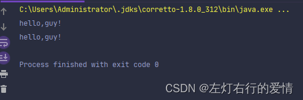
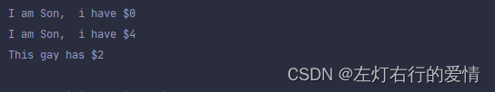
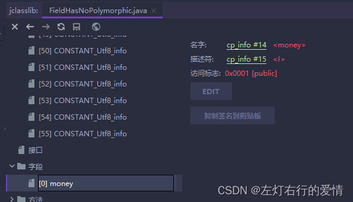
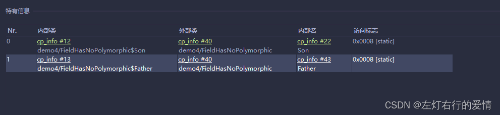
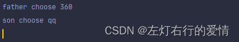
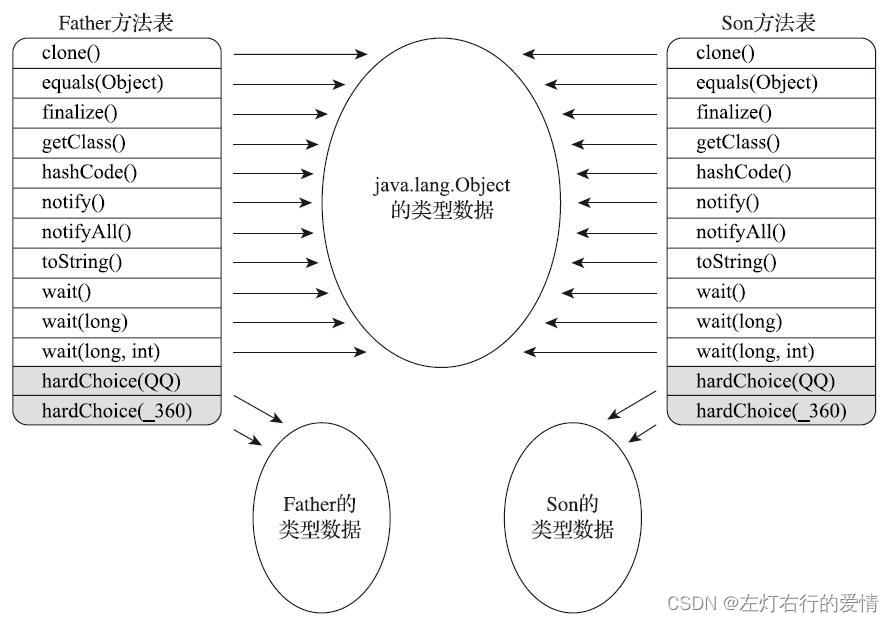

> 原文：[CSDN](https://blog.csdn.net/qq_45852626/article/details/128105268)（历史文章导入，当前状态为草稿）

### 前言

执行引擎是JVM核心的组成部分之一。  
 “虚拟机”是一个相对于“物理机”的概念，这两种机器都有代码执行能力，其区别是物理机的执行引擎是直接建立在处理器，缓存，指令集和操作系统层面上的，而虚拟机的执行引擎则是由软件自行实现的，因此可以不受物理条件制约地定制指令集与执行引擎的结构体系，能够执行那些不被硬件直接支持的指令集格式。

不同的虚拟机实现中，执行引擎在执行字节码的时候，通常会有解释执行（通过解释器执行）和编译执行（通过及时编译器产生本地代码执行）两种选择，也可能两者兼备，还可能会有同时包含不同级别的及时编译器一起工作的引擎。

但是外观上来说，所有JVM的执行引擎输入，输出都是一致的：输入的是字节码二进制流，处理过程是字节码解析执行的等效过程，输出的是执行结果。

#### 运行时栈帧结构

这个我们之前已经详细聊过了，不太熟悉的可以去瞧一下前面的内容：  
 [深度学习与总结JVM专辑（一）：基础介绍&&内存结构（图文+代码）](https://blog.csdn.net/qq_45852626/article/details/127478146?spm=1001.2014.3001.5501)

#### 方法调用

方法调用并不等同于方法中的代码被执行，方法调用阶段唯一的任务就是**确定被调用方法的版本（即调用哪一个方法）**，暂时还没涉及方法内部的具体运行过程。  
 我们前面也知道了，一切方法调用在Class文件里面存储的都只是符号引用，而不是方法在实际运行时内存布局的入口地址（也就是之前说的直接引用）。  
 这个特性给Java带来了更强大的动态扩展能力，但也使得Java方法调用过程变得相对复杂，某些调用需要在类加载期间，甚至到运行期间才能确定目标方法的直接引用。

##### 解析

所有方法调用的目标方法在Class文件里面都是一个常量池中的符号引用，在类加载的解析阶段，会将其中的一部分符号引用转化为直接引用。  
 这个解析成立的前提条件是： 方法在程序真正运行之前就有一个可确定的调用版本，并且这个方法的调用版本在运行期是不可改变的。  
 换句话说：调用目标在程序代码写好，编译器进行编译那一刻就已经确定下来。

在Java语言中符合“编译器可知，运行期不变”，这个要求的方法，主要有静态方法和私有方法两个大类。  
 前者与类型直接关联，后者在外部不可别访问。  
 这两个方法各自的特点决定了它们都不可能通过继承或别的方式重写出其他版本，因此它们都适合在类加载阶段进行解析。

调用不同类型的方法，字节码指令集设计了不同的指令，分别是：

* invokestatic：用于调用静态方法。
* invokespecial：用于调用实例构造器()方法，私有方法和父类中的方法。
* invokevirtual：用于调用所有的虚方法。
* invokeinterface：用于调用接口方法，会在运行时在确定一个实现该接口的对象。
* invokedynamic：现在运行时动态解析出调用点限定符所引用的方法。  
   前面四条调用指令，分派逻辑都固化在JVM内部，而invokedynamic指令的分配逻辑是由用户设定的引导方法来决定。

###### 虚方法和非虚方法

只要能被invokestatic和invokespecial指令调用的方法，都可以在解析阶段中确定唯一的调用版本，Java语言里面符合这个条件的有静态方法，私有方法，实例构造器，父类方法四种，再加上final修饰的方法（尽管它使用invokevirtual指令调用，因为它无法被覆盖，没有其他版本的可能），这五种方法调用会在类加载的时候就可以把符号引用解析为该方法的直接引用，这些方法称为“非虚方法”。  
 与之相反，其他方法就称之为“虚方法”。

下面我们来举个常见的解析调用的例子：

```
/**
 * 方法静态解析演示
 */
public class StaticResolution {

    public static void sayHello() {
        System.out.println("hello world");
    }

    public static void main(String[] args) {
        StaticResolution.sayHello();
    }

}


```

使用javap命令查看这段程序对应的字节码，会发现的确是通过invokestatic命令来调用sayHello()方法，而且其调用的方法版本已经在编译就明确以常量池项的形式固化在字节码指令的参数之中。

```
javap -verbose StaticResolution
public static void main(java.lang.String[]);
    Code:
        Stack=0, Locals=1, Args_size=1
        0:   invokestatic    #31; //Method sayHello:()V
        3:   return
    LineNumberTable:
        line 15: 0
        line 16: 3


```

解析调用一定是个静态的过程，在编译期间就完全确定，在**类加载的解析阶段**就会把涉及的符号引用全部转变为明确的直接引用，不必延迟到运行期再去完成。

##### 分派

Java是一门面向对象的程序语言，因为Java具备面向对象的3个基本特征：继承，封装和多态。我们聊聊分派调用过程揭示多态性特征的一些最基本的体现：如重载，重写在JVM是如何实现的，我们不仅仅关注语法上，而是在JVM中如何确定正确的目标方法。

###### 静态分派

分派这个词本身就具有**动态性**，一般不应用在静态语境中，这个涉及到翻译问题，大家知道就好。

我们先准备一段面试题代码：

```
/**
 * 方法静态分派演示
 */
public class StaticDispatch {

    static abstract class Human {
    }

    static class Man extends Human {
    }

    static class Woman extends Human {
    }

    public void sayHello(Human guy) {
        System.out.println("hello,guy!");
    }

    public void sayHello(Man guy) {
        System.out.println("hello,gentleman!");
    }

    public void sayHello(Woman guy) {
        System.out.println("hello,lady!");
    }

    public static void main(String[] args) {
        Human man = new Man();
        Human woman = new Woman();
        StaticDispatch sr = new StaticDispatch();
        sr.sayHello(man);
        sr.sayHello(woman);
    }
}


```

结果如下：  
   
 这个题目考查的是我们对于重载的理解程序，为什么JVM会选择执行参数类型为Human的重载版本？

###### 静态类型和实际类型

我们先来共同确定一些概念：

```
Human man = new Man();


```

我们把上面代码中的"Human"称为变量的“静态类型”（Static Type）；  
 后面“Man”则被称为变量的“实际类型”(Actual Type)或者称为“运行时类型”(Runtime Type)。  
 静态类型和实际类型在程序中都可能会发生变化。  
 区别是静态类型的变化仅仅在使用时发生，变量本身的静态类型不会被改变，并且最终的静态类型是在编译器可知的；  
 而实际类型变化的结果在运行期才可确定，编译器在编译程序的时候并不知道一个对象的实际类型是什么。  
 这么说有点不好理解，我们来举个栗子：

```
// 实际类型变化
Human human = (new Random()).nextBoolean() ? new Man() : new Woman();

// 静态类型变化
sr.sayHello((Man) human)
sr.sayHello((Woman) human)


```

对象human 的实际类型是可变的，编译期间它完全是个“薛定谔的人”，到底是Man还是Woman，必须等到程序运行到这行才可以确定。

而human的静态类型是Human，也可以在使用时临时改变这个类型，但这个改变仍是在编译器可知的，两次sayHello(）方法的调用，在编译期完全可以明确转型的是Man还是Woman。

说明白了类型的概念，我们接下里看面试题代码。

mian函数里面的两次sayHello()方法调用，在方法接受者已经确定是对象"sr"的前提下，使用哪个重载版本，就完全取决于传入参数的数量和数据类型。  
 代码中故意定义了两个静态变量相同，而实际类型不同的变量，但JVM在重载时是**通过参数的静态类型而不是实际类型作为判定依据**。  
 由于静态类型在编译期可知，所以在编译阶段，Javac编译期就根据参数的静态类型决定了会使用哪个重载版本，因此选择了sayHello(Human)作为调用目标，并且把这个方法的符号引用写到main()方法里的两条invokevirtual指令的参数中。

所有**依赖静态类型来决定方法执行版本**的分派动作，都称为静态分派。  
 静态分派的最典型应用表现就是方法重载。静态分派发生在编译阶段，因此确定静态分派的动作实际上不是由JVM来执行，这点也是为何一些资料选择把它归入“解析”而不是“分派”的原因。

注意Javac编译器虽然能确定出方法的重载版本，但是有些情况重载版本不是唯一，往往只能确定“相对更合适的版本”，这种模糊的结论在0和1的世界有点罕见，产生的原因是字面量天生的模糊性，它不需要定义，所以字面量就没有显示的静态类型，它的静态类型只能通过语言，语法的规则去理解和推断。  
 我们举个例子（重载方法匹配优先级）：

```
public class Overload {

    public static void sayHello(Object arg) {
        System.out.println("hello Object");
    }

    public static void sayHello(int arg) {
        System.out.println("hello int");
    }

    public static void sayHello(long arg) {
        System.out.println("hello long");
    }

    public static void sayHello(Character arg) {
        System.out.println("hello Character");
    }

    public static void sayHello(char arg) {
        System.out.println("hello char");
    }

    public static void sayHello(char... arg) {
        System.out.println("hello char ...");
    }

    public static void sayHello(Serializable arg) {
        System.out.println("hello Serializable");
    }

    public static void main(String[] args) {
        sayHello('a');
    }
}


```

结果显而易见：

```
hello char


```

这很好理解，'a’是一个char类型的数据，自然会寻找参数类型为char的重载方法，如果注释掉sayHello(char arg)方法，答案变为：

```
hello int


```

依次根据优先级往下推，这个例子比较极端，除了为难面试者基本没有其他用。

##### 动态分派

Java语言里动态分派的实现过程，它与Java语言多态性的另外一个重要体现——重写（Override）有着密切的关联。  
 我们还是用前面的例子来说动态分派：

```
public class DynamicDispatch {

    static abstract class Human {
        protected abstract void sayHello();
    }

    static class Man extends Human {
        @Override
        protected void sayHello() {
            System.out.println("man say hello");
        }
    }

    static class Woman extends Human {
        @Override
        protected void sayHello() {
            System.out.println("woman say hello");
        }
    }

    public static void main(String[] args) {
        Human man = new Man();
        Human woman = new Woman();
        man.sayHello();
        woman.sayHello();
        man = new Woman();
        man.sayHello();
    }
}


```

运行结果：

```
man say hello
woman say hello
woman say hello


```

JVM是如何判断应该调用哪个方法的？

显然这里调用的方法版本是不可能根据静态类型来决定，因为静态类型同样都是Human的两个变量man和woman在调用sayHello()方法时产生了不同的行为，甚至变量man在两次调用还执行了两个不同的方法。

原件很简单，因为两个变量的实际类型不同，JVM是如何根据实际类型来分派方法执行版本呢？

我们用javap命令来输出这段代码的字节码，来找一下答案：

```
public static void main(java.lang.String[]);
    Code:
        Stack=2, Locals=3, Args_size=1
         0:   new     #16; //class org/fenixsoft/polymorphic/DynamicDispatch$Man
         3:   dup
         4:   invokespecial   #18; //Method org/fenixsoft/polymorphic/Dynamic Dispatch$Man."<init>":()V
         7:   astore_1
         8:   new     #19; //class org/fenixsoft/polymorphic/DynamicDispatch$Woman
        11:  dup
        12:  invokespecial   #21; //Method org/fenixsoft/polymorphic/DynamicDispatch$Woman."<init>":()V
        15:  astore_2
        16:  aload_1
        17:  invokevirtual   #22; //Method org/fenixsoft/polymorphic/Dynamic Dispatch$Human.sayHello:()V
        20:  aload_2
        21:  invokevirtual   #22; //Method org/fenixsoft/polymorphic/Dynamic Dispatch$Human.sayHello:()V
        24:  new     #19; //class org/fenixsoft/polymorphic/DynamicDispatch$Woman
        27:  dup
        28:  invokespecial   #21; //Method org/fenixsoft/polymorphic/DynamicDispatch$Woman."<init>":()V
        31:  astore_1
        32:  aload_1
        33:  invokevirtual   #22; //Method org/fenixsoft/polymorphic/Dynamic Dispatch$Human.sayHello:()V
        36:  return


```

0-15行：字节码准备动作，建立man和woman的内存空间，调用Man和Woman类型的实例构造器，将这两个实例的引用存放在第1,2个局部变量表的变量槽中，这些动作对应了Java源码中的这两行：

```
Human man = new Man();
Human woman = new Woman();


```

16-21行：16行和20行的aload指令分别把刚刚创建的两个对象的引用压到栈顶，这两个对象是将要执行sayHello()方法的所有者，称为接受者（Receiver）；  
 17行和21行是方法调用指令，单从字节码看，无论是指令还是参数（都是常量池22项的常量，注释显示了这个常量是Human.sayHello()的符号引用）都完全一样，但是这两句指令最终执行的目标方法并不相同。

所以我们要去看一看invokevirtual指令，明白它是如何确定调用方法版本的，如何实现多态查找来分析入手。

invokevirtual指令的运行时解析过程大致分下面几步：

* 找到操作数栈顶的第一个元素所指向的对象的实际类型，记作C。
* 如果在类型C中找到常量中的描述符和简单名称都相符，则进行权限校验，如果通过则返回这个方法的直接引用，查找过程结束；  
   不通过则返回java.lang.IllegalAccessError异常。
* 否则 ，按照继承关系从下往上依次对C的各个父类进行第二步的搜索和验证过程。
* 如果最终找不到合适的方法，则抛出java.lang.AbstractMethodError异常。

这是因为invokevirtual指令执行的第一步就是在运行期确定接受者的实际类型，所以两次调用中invokevirtual指令并不是把常量池中方法的符号引用解析到直接引用上就结束了，**还会根据方法接受者的实际类型来选择方法版本**，这个过程就是Java语言中方法重写的本质。

这种在运行期根据实例类型确定方法执行版本的分派称为动态分派。

###### 字段没有多态性

那么我们明白了，多态性的根源在于虚方法调用指令invokevirtual的执行逻辑，那自然我们得出结论就只会对方法有效，对字段是无效的，因为字段不使用这条指令。  
 Java里面只有虚方法存在，字段永远不可能为虚，字段永远不参加多态。  
 举个例子：当子类声明了与父类同名的字段时，虽然在子类的内存中两个字段都会存在，但是子类的字段会遮蔽父类的同名字段。

来段代码品一品：

```
/**
 * 字段不参与多态
 */
public class FieldHasNoPolymorphic {

    static class Father {
        public int money = 1;

        public Father() {
            money = 2;
            showMeTheMoney();
        }

        public void showMeTheMoney() {
            System.out.println("I am Father, i have $" + money);
        }
    }

    static class Son extends Father {
        public int money = 3;

        public Son() {
            money = 4;
            showMeTheMoney();
        }

        public void showMeTheMoney() {
            System.out.println("I am Son,  i have $" + money);
        }
    }

    public static void main(String[] args) {
        Father gay = new Son();
        System.out.println("This gay has $" + gay.money);
    }
}


```

结果如下：  
   
 输出两句都是“I am Son”，这是因为Son类在创建的时候，首先隐式调用了Father的构造函数，**而Father构造函数中对showMeTheMoney()的调用是一次虚方法调用**，实际执行的版本是Son::showMeTheMoney()方法，所以输出是“I am Son”。

而这时候，虽然父类的money字段已经初始化为2了，但是Son::showMeTheMoney()方法中访问的却是子类的money字段，这时候结果自然还是0，因为它要到子类的构造函数执行时才会被初始化。

最后一句通过静态类型访问到了父类中的money，输出了2。

最后我们在idea里调试一下，补充一些细节帮助理解：  
 字段信息：  
   
 内部类信息：  
 

##### 单分派和多分派

方法的接受者与方法的参数统称方法的宗量。  
 分派基于多少种宗量，可以将分派划分为单分派和多分派两种。  
 单分派是根据一个宗量对目标方法进行选择；  
 多分派则是根据多于一个宗量对目标方法进行选择。  
 我们举个栗子来帮助理解：

```
/**
 * 单分派、多分派演示
 */
public class Dispatch {

    static class QQ {}
    static class _360 {}

    public static class Father {
        public void hardChoice(QQ arg) {
            System.out.println("father choose qq");
        }

        public void hardChoice(_360 arg) {
            System.out.println("father choose 360");
        }
    }

    public static class Son extends Father {
        public void hardChoice(QQ arg) {
            System.out.println("son choose qq");
        }

        public void hardChoice(_360 arg) {
            System.out.println("son choose 360");
        }
    }

    public static void main(String[] args) {
        Father father = new Father();
        Father son = new Son();
        father.hardChoice(new _360());
        son.hardChoice(new QQ());
    }
}


```

结果如下：  
   
 我们关注编译阶段中编译器的选择过程，也就是静态分派过程。  
 这时候选择目标方法的根据有两点：

* 静态类型是Father还是Son
* 方法参数是QQ还是360  
   这次选择的结果的最终产物是产生了两条invokevirtual指令，两条指令的参数分别为常量池中指向Father：：hardChoice（360）及Father：：hardChoice（QQ）方法的符号引用。  
   因为是根据两个宗量进行选择，所以Java语言的静态分派属于多分派类型。

再看看运行阶段JVM的选择，也就是动态分派的过程。  
 在执行“son.hardChoice（new QQ（））”这行代码时，更准确的说，是在执行这行代码所对应的invokevirtual指令时，由于编译器已经决定目标方法的签名必须为hardChoice（QQ），JVM此时不会关心传递过来的QQ到底是“txqq”还是“qrqq”，因为这时候参数的静态类型，实际类型都对方法的选择不会构成任何影响，唯一可以影响JVM选择的因素**只有该方法的接受者的实际类型是Father还是Son**。因为这有一个宗量作为选择依据，所以Java语言的动态分派属于单分派类型。

所以我们总结出：Java语言是一门静态多分派，动态单分派的语言。

##### JVM动态分派的实现

动态分派是执行非常频繁的动作，而且动态分派的方法版本选择过程需要运行时在接受者的方法元数据中搜索合适的目标方法。  
 因此，JVM实现基于执行性能的考虑，真正运行时一般不会如此频繁地反复搜索类型元数据。  
 一种基础而且常见的优化手段是为类型在方法区中建立一个虚方法表，使用虚方法表索引来代替元数据查找以提高性能。  
 下图：

  
 虚方法表中存放各个方法的实际入口地址。

如果某个方法在子类中没有被重写，那子类的虚方法表中的地址入口和父类相同方法的地址入口是一致的，都指向父类的实现入口。

如果子类重写了这个方法，子类虚方法表中的地址也会被替换为指向子类实现版本的入口地址。

上图中：  
 Son重写了来自Father的全部方法，因此Son的方法表没有指向Father类型数据的箭头。  
 但是Son和Father都没有重写来自Object的方法，所以它们的方法表中所有从Object继承来的方法都指向了Object的数据类型。

虚方法表一般在类加载的连接阶段进行初始化，准备了类的变量初始值后，JVM会把类的虚方法表也一同初始化完毕。
