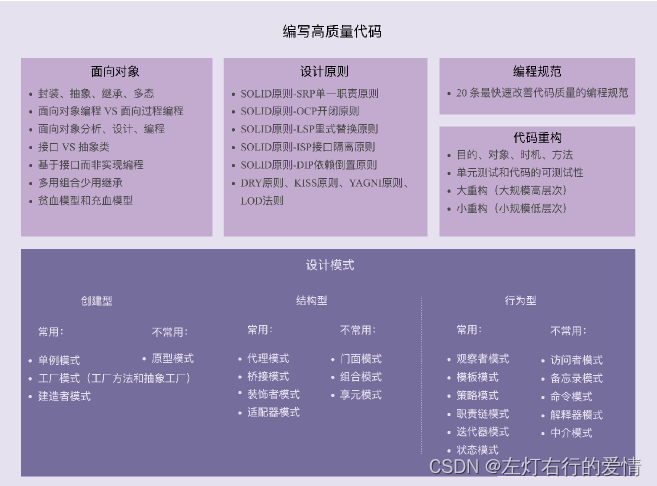

> 原文：[CSDN](https://blog.csdn.net/qq_45852626/article/details/128178707)（历史文章导入，当前状态为草稿）

#### 学习如何编写高质量代码
### 前言

学过了设计模式，但是觉得用处不大，并没有用到我项目里面，这让我很苦恼，感觉除了面试以外并没有什么用，我深知设计模式是基本功，要融入到代码里面，所以报着这样的目的，以后写代码追求高质量，我开始了梳理融合设计模式的知识，同时也更新思考项目里怎么用到设计模式。  
 这篇文章介绍了学习设计模式必知必会的内容，对后面我们深入设计模式大有益处，希望也可以帮助到你。  
 

### 面向对象

#### 面向对象编程，面向对象编程语言

面向对象编程（OOP，Object Oriented Programming）。面向对象编程语言（OOPL，Object Oriented Programming Language）。  
 面向对象编程有两个非常重要的概念，那就是类（Class）和对象（Object）。  
 面向对象编程是一种编程范式或编程风格。它以类或对象作为组织代码的基本单元，并将封装，抽象，继承，多态四个特性，作为代码设计和实现的基石。

面向对象编程语言是支持类或对象的语法机制，并有现成的语法机制，能方便地实现面向对象编程四大特性（封装，抽象，继承，多态）的编程语言

从定义中发现，理解面向对象编程及面向对象编程语言两个概念，其中最关键的一点就是理解面向对象编程的四大特性：封装，抽象，继承，多态。

#### 面向对象分析 ，面向对象设计

面向对象分析（OOA，Object Oriented Analysis）；  
 面向对象设计（OOD，Object Oriented Design）；

OOA，OOD，OOP三个连在一起就是面向对象分析，设计，编程（实现），正好是面向对象软件开发要经历的三个阶段。

#### 封装，抽象，继承，多态

##### 封装

封装也叫信息隐藏或者数据访问保护。  
 类通过暴露有限的访问接口，授权外部仅能通过类提供的方式（或者是函数）来访问内部信息或者数据。

举个栗子：在金融系统中，给每个用户创建一个虚拟钱包，用来记录在我们系统中的虚拟货币量。

```
public class Wallet {
private String id;
private long createTime;
private BigDecimal balance;
private long balanceLastModifiedTime;
// ... 省略其他属性...
public Wallet() {
this.id = IdGenerator.getInstance().generate();
this.createTime = System.currentTimeMillis();
this.balance = BigDecimal.ZERO;
this.balanceLastModifiedTime = System.currentTimeMillis();
}
// 注意：下面对 get 方法做了代码折叠，是为了减少代码所占文章的篇幅
public String getId() { return this.id; }
public long getCreateTime() { return this.createTime; }
public BigDecimal getBalance() { return this.balance; }
public long getBalanceLastModifiedTime() { return this.balanceLastModifiedTime
}

public void increaseBalance(BigDecimal increasedAmount) {
if (increasedAmount.compareTo(BigDecimal.ZERO) < 0) {
throw new InvalidAmountException("...");
}
this.balance.add(increasedAmount);
this.balanceLastModifiedTime = System.currentTimeMillis();
}
public void decreaseBalance(BigDecimal decreasedAmount) {
if (decreasedAmount.compareTo(BigDecimal.ZERO) < 0) {
throw new InvalidAmountException("...");
}
if (decreasedAmount.compareTo(this.balance) > 0) {
throw new InsufficientAmountException("...");
}
this.balance.subtract(decreasedAmount);
this.balanceLastModifiedTime = System.currentTimeMillis();
}
}


```

我们可以发现，Wallet类主要有四个属性（成员变量），就是我们前面定义中提到的信息或者数据。  
 其中id表示钱包的唯一编号，createTime表示钱包创建的时间，balance表示钱包中的余额，balanceLastModifiedTime表示上次钱包余额变更的时间。

按照封装特性，对钱包四个属性的访问进行限制，调用者只允许通过下面这留个方法来访问或者修改钱包的数据。

```
String getId()
long getCreateTime()
BigDecimal getBalance()
long getBalanceLastModifiedTime()
void increaseBalance(BigDecimal increasedAmount)
void decreaseBalance(BigDecimal decreasedAmount)


```

从业务角度来说，id，createTime在创建钱包的时候就确定好了，之后不应该改动，所以不再Wallet类中，暴露id，createTime这两个属性的任何修改方法（比如set），而且这两个属性的初始化设置，对于Wallet类的调用者，也应该是透明的，所以**我们在Wallet类的构造函数内部将其初始化设置好，而不是通过构造函数的参数来外部赋值**。

对于钱包余额balance这个属性，从业务角度来说，只能增或者减，不会被重新设置。  
 所以，我们在Wallet类中，只暴露了increaseBalance()和decreaseBalance()方法，并没有暴露set方法。

对于balanceLastModifiedTime属性，它完全是跟balance这个属性的修改操作绑定在一起的。只有在balance修改的时候，这个属性才会被修改。

所以，把balanceLastModifiedTime这个属性的修改操作完全封装在了increaseBalance()和decreaseBalance()两个方法中，不对外暴露任何修改这个属性的方法和业务细节，这样也可以保证balance和balanceLastModifiedTime两个数据一致性。

对于封装这个特性，我们需要编程语言本身提供一定的语法机制来支持。  
 这个语法机制就是**访问权限控制。**  
 例子中的private，public等关键字就是Java语言中的访问权限控制语法。  
 private关键字修饰的属性只能类本身访问，可以保护其不被类之外的代码直接访问。

如果Java语言没有提供访问权限控制语法，所有的属性默认都是public的，那任意外部代码都可以通过类似wallet.id=111;这样的方式直接访问，修改属性，也就没办法达到隐藏信息和保护数据的目的了，也就无法支持封装特性。

---

**我们现在回过头来看一下封装的意义是什么？它能解决什么编程问题**

如果我们对类中属性的访问不做限制，那任何代码都可以访问，修改类中的属性，这样虽然更加灵活，但是过度的灵活也意味着不可控。

属性可以任意被修改，而且修改逻辑可能散落在代码各个角落，势必影响代码的可读性，可维护性。（加入在某段代码“偷偷地”重设了wallet中的balanceLastModifiedTime属性，那么会导致balance和balanceLastModifiedTime两个数据不一致）

除此之外，类仅仅通过有限的方法暴露必要的操作，也能提高类的易用性。  
 如果我们把类属性都暴露给类的调用者，调用者如果想正确地操作这些属性，就势必要对业务细节有足够的了解，这对于调用者来说也是一种负担。

相反，如果我们将属性封装起来，暴露少许的几个必要方法给调用者使用，调用者就不需要了解太多背后的业务细节，用错的概率就减少很多。  
 （如果一个冰箱有很多按钮，你就要研究很长时间，还不一定能操作正确，但如果只有几个必要的按钮，比如开，停，调节温度，你一眼就知道如何操作，操作出错的概率也降低很多）

##### 抽象

抽象说的是如何隐藏方法的具体实现，让调用者只关心方法提供了哪些功能，并不需要知道功能是如何实现的。  
 面向对象编程中，常借助编程语言提供的接口类或者抽象类两种语法机制，来实现抽象这一特性。

我们把接口语法叫“接口类”而不是“接口”。接口这个词太泛化，可以指很多概念（比如API）。

下面举个例子来进一步解释抽象特性：

```
public interface IPictureStorage {
void savePicture(Picture picture);
Image getPicture(String pictureId);
void deletePicture(String pictureId);
void modifyMetaInfo(String pictureId, PictureMetaInfo metaInfo);
}
public class PictureStorage implements IPictureStorage {
// ... 省略其他属性...
@Override
public void savePicture(Picture picture) { ... }
@Override
public Image getPicture(String pictureId) { ... }
@Override
public void deletePicture(String pictureId) { ... }
@Override
public void modifyMetaInfo(String pictureId, PictureMetaInfo metaInfo) { ...
}


```

上面代码中，我们利用Java中interface接口语法来实现抽象特性。  
 调用者使用图片存储功能时，只需要了解IPictureStorage这个接口类暴露了哪些方法就可以了，不需要查看PictureStorage类里的具体实现逻辑。

实际上，抽象这个特性非常容易实现，并不一定依靠接口类或者抽象类这些特殊语法机制来支持。换言之，并不是说一定腰围实现类抽象出接口类，才叫抽象。单纯的PictureStorage类本身就满足抽象特性。

为什么这么说？  
 因为类的方法是通过编程语言中的“函数”这一语法机制来实现。  
 通过函数包裹具体的实现逻辑，这本身就是一种抽象。调用者在使用函数的时候，并不需要去研究函数内部的实现逻辑，只需要通过函数的命名，注释或者文档，了解其提供什么功能，就可以直接使用了。（我们在使用C语言malloc(）函数的时候，并不需要了解它的底层代码是如何实现的）

**抽象的意义是什么？ 它能解决什么编程问题**  
 抽象和封装都是人处理复杂性的有效有段。  
 在面对复杂系统的时候，人脑能承受的信息复杂程度有限，所以我们必须忽略掉一些非关键性的实现细节。  
 而抽象作为一种只关注功能点而不关注实现的设计思路，正好帮助我们大脑过滤掉许多非必要信息。

除此之外，抽象作为一个非常宽泛的设计思想，在代码设计中，起到非常重要的指导作用。  
 很多设计原则都体现了抽象这种设计思想，比如基于接口而非实现编程，开闭原则（对扩展开放，对修改关闭），代码解耦（降低代码的耦合性）等。

换一个角度来考虑，在定义（命名）类的方法时，也要有抽象思维，不要在方法定义中，暴露太多的实现细节，以保证在某个时间点需要改变方法的实现逻辑时，不用去修改定义。  
 举个例子：上面的getAliyunPictureUrl()就不是一个具有抽象思维的命名，因为某一天如果我们不把图片存储到阿里云上，而是存储在私有云上，那么这个命名也要随之被修改。相反，如果我们定义了一个比较抽象的函数，比如getPictureUrl()，那即使内部存储方式修改了，我们也不需要修改命名。

（也许你会想到，那如果我改为了getPictureUrl()，当我回顾项目时忘记了 怎么办，少年，有个东西叫注释，希望你好好去使用它。）

##### 继承

继承用来表示类之间的is-a关系（比如猫是一种哺乳动物）。  
 从继承关系上来讲，继承可以分为两种模式，单继承和多继承。  
 单继承表示一个子类只继承一个父类；  
 多继承表示一个子类可以继承多个父类（比如猫既是哺乳动物，又是爬行动物）；  
 Java只支持单继承。

**那么为什么Java只支持单继承呢？**

**继承存在的意义是什么？它能解决什么编程问题？**  
 继承最大的一个好处就是**代码复用**。  
 加入两个类有一些相同的属性和方法，我们就可以讲这些相同的部分，抽取到父类中，让两个子类继承父类。这样两个子类就可以重用父类中代码，避免代码重复写很多遍（但也不是继承专用，组合关系也可以实现）。

继承在设计的角度也有一种结构美感也符合人的认知。代码中有一个猫类，有一个哺乳动物类。  
 猫属于哺乳动物，从人的认知角度来说，是一种is-a关系，通过继承来关联了两个类，反应真实世界中的这种关系，非常符合人的认知。

注意：继承概念很好理解，但是也容易过度使用。过度使用继承，继承层次过深过复杂，就会导致代码可读性，可维护性变差。为了了解一个类的功能，我们不仅需要查看这个类的代码，还需要按照继承关系一层一层往上查看“父类，父类的父类…”的代码。  
 子类和父类的高度耦合，修改父类的代码，会直接影响到子类。

所以，继承这个特性也是一个有争议的特性，很多人觉得继承是一种反模式。  
 我们应该尽量少用，甚至不用。  
 这个问题在后面我们说“多用组合少用继承”这种设计思想时，在详细说吧。

##### 多态

多态指，子类可以替换父类，在实际代码运行中，调用子类的方法实现。  
 多态特性纯文字不好解释，我们看个新鲜的栗子：

```
public class DynamicArray {
private static final int DEFAULT_CAPACITY = 10;
protected int size = 0;
protected int capacity = DEFAULT_CAPACITY;
protected Integer[] elements = new Integer[DEFAULT_CAPACITY];
public int size() { return this.size; }
public Integer get(int index) { return elements[index];}
//... 省略 n 多方法...
public void add(Integer e) {
ensureCapacity();
elements[size++] = e;
}
protected void ensureCapacity() {
//... 如果数组满了就扩容... 代码省略...
}
}
public class SortedDynamicArray extends DynamicArray {
@Override
public void add(Integer e) {
ensureCapacity();
for (int i = size-1; i>=0; --i) { // 保证数组中的数据有序
if (elements[i] > e) {
elements[i+1] = elements[i];
} else {
break;
}
}
elements[i+1] = e;
++size;
}
}
public class Example {
public static void test(DynamicArray dynamicArray) {
dynamicArray.add(5);
dynamicArray.add(1);
dynamicArray.add(3);
for (int i = 0; i < dynamicArray.size(); ++i) {
System.out.println(dynamicArray[i]);
}
}
public static void main(String args[]) {
DynamicArray dynamicArray = new SortedDynamicArray();
test(dynamicArray); // 打印结果：1、3、5
}
}


```

多态这种特性需要编程语言提供特殊的语法机制来实现。  
 上面的例子，我们用到了三个语法机制来实现多态：

* 第一个语法机制：编程语言要支持父类对象可以引用子类对象，也就是将SortedDynamicArray传递给DynamicArray。
* 第二个语法机制：要支持继承，也就是SortedDynamicArray继承了DynamicArray，才能将SortedDynamicArray传递给DynamicArray。
* 第三个语法机制：支持子类可以重写（Override）父类中的方法，也就是SortedDyamicArray重写了DynamicArray中的add()方法。

通过这三种语法机制配合在一起，我们实现了test（）方法中，子类SortedDynamicArray替换父类DynamicArray，执行子类SortedDynamicArray的add（）方法，也就是实现了多态特性。

对于多态特性实现——除了利用“**继承加方法重写**”这这种实现方式之外，我们还有其他比较常见的实现方法，接口类语法，我们再举一个例子：

```
public interface Iterator {
String hasNext();
String next();
String remove();
}
public class Array implements Iterator {
private String[] data;
public String hasNext() { ... }
public String next() { ... }
public String remove() { ... }
//... 省略其他方法...
}
public class LinkedList implements Iterator {
private LinkedListNode head;
public String hasNext() { ... }
public String next() { ... }
public String remove() { ... }
//... 省略其他方法...
}
public class Demo {
private static void print(Iterator iterator) {
while (iterator.hasNext()) {
System.out.println(iterator.next());
}
}
public static void main(String[] args) {
Iterator arrayIterator = new Array();
print(arrayIterator);
Iterator linkedListIterator = new LinkedList();
print(linkedListIterator);
}
}


```

这段代码中，Iterator是一个接口类，定义了一个可以遍历集合数据的迭代器。  
 Array和LinkedList都实现了接口类Iterator。我们通过传递不同类型的实现类（Array，LinkedList）到print(Iterator iterator)函数中，支持动态的调用不同的next(),hasNext()实现。

具体来说：当我们向 print(Iterator iterator) 函数传递Array类型的对象时， print(Iterator iterator) 函数就会调用Array的next，hasNext方法的实现逻辑；  
 当我们向 print(Iterator iterator) 传递LinkedList类型时， print(Iterator iterator) 函数就调用LinkedList的next，hasNext（）的实现逻辑。

**多态特性的存在意义是什么？它能解决什么编程问题？**  
 多态特性能提高代码的可扩展性和复用性。  
 我们仅用一个print函数就可以实现遍历打印不同类型集合的数据。当需要再加一种要遍历打印的类型时，比如HashMap，我们只需要让HashMap实现Iterator接口，重新实现自己的hasNext()，next（）等方法就行，完全不需要改动print()函数的代码。所以说，多态提高了代码的可扩展性。

如果不使用多态特性，我们就无法将不同的集合类型（Array，LinkedList）传递给相同的函数（print(Iterator iterator)函数）。我们需要针对每种要遍历打印的集合，分别实现不同的print函数。而利用多态性，我们只需要实现一个print()函数的打印逻辑，就能应对各种集合数据的打印操作，显然提高了代码的复用性。

除此之外，多态也是很多设计模式，设计原则，编程技巧的代码实现基础：策略模式，基于接口而非实现编程，依赖倒置原则，里式替换原则，利用多态去掉冗长的if-else语句等。

#### 面向对象比面向过程有哪些优势，面向过程过时了？

除了面向对象外，被大家熟知的编程范式还有另外两种，面向过程编程和函数式编程。  
 面向过程这种编程范式随着面向对象的出现，已经慢慢退出舞台，而函数式编程目前还没有被广泛接受。

你可能会问：既然面向对象已经成为主流，那么面向过程为什么还要花费时间去说呢?

那是在过往开发中，搞不清面向对象和面向过程的区别，以为使用面向对象编程语言来做开发，就是进行面向对象编程了。  
 实际上，很多人只是用面向对象编程语言，编写面向过程风格的代码而已，并没有发挥面向对象编程的优势。相当于大材小用了。

##### 什么是面向过程编程与面向过程编程语言

我们对比着面向对象编程和面向对象编程语言这两个概念，来理解面向过程编程和面向过程编程语言：

```
面向对象编程是一种编程范式或编程风格。它以类或对象作为组织代码的基本单元，并
将封装、抽象、继承、多态四个特性，作为代码设计和实现的基石 。

面向对象编程语言是支持类或对象的语法机制，并有现成的语法机制，能方便地实现面
向对象编程四大特性（封装、抽象、继承、多态）的编程语言。


```

类比面向对象编程与面向对象编程语言的定义，对于面向过程编程和面向过程编程语言这两个概念，给出下面这样的定义。

```
面向过程编程也是一种编程范式或编程风格。
它以过程（方法，函数，操作）作为组织代码的基本单元，以数据（成员变量，属性）与方法相分离为最主要特点，是一种流程化的编程风格，通过拼接一组顺序执行的方法来操作数据完成一项功能。

面向过程编程语言首先是一种编程语言。
它最大的特点是不支持类和对象两个语法概念，不支持丰富的面向对象编程特性，仅支持面向过程编程。


```

注意，面向对象编程和面向对象编程语言并没有严格的官方定义，面向过程编程和面向过程编程定义也一样。这里只是方便理解。  
 举个栗子：  
 场景如下：  
 我们有一个记录用户信息的文本文件user.txt  
 每行文本的格式是name&age&gender（小王&22&男）。  
 我们一个需求是，从文件中逐行读取用户信息，然后格式化为name\tage\tgender（其中，\t是分隔符）这种文本格式，并且按age从小到大排序，重新写入另一个文本文件formatted\_users.txt中。  
 我们分别用面向过程和面向对象编程风格来实现，看看有什么不同。

```
struct User {
char name[64];
int age;
char gender[16];
};
struct User parse_to_user(char* text) {
// 将 text(“小王 &28& 男”) 解析成结构体 struct User
}
char* format
_
to
_
text(struct User user) {
// 将结构体 struct User 格式化成文本（" 小王\t28\t 男 "）
}
void sort
_
users
_
by_age(struct User users[]) {
// 按照年龄从小到大排序 users
}
void format
_
user
_
file(char* origin_file_path, char* new_file_path) {
// open files...
struct User users[1024]; // 假设最大 1024 个用户
int count = 0;
while(1) { // read until the file is empty
struct User user = parse_to_user(line);
users[count++] = user;
}
sort
_
users
_
by_age(users);
for (int i = 0; i < count; ++i) {
char* formatted
_
user
_
text = format
_
to
_
text(users[i]);
// write to new file...
}
// close files...
}
int main(char** args, int argv) {
format
_
user
_
file("/home/zheng/user.txt", "/home/zheng/formatted_users.txt");
}


```

然后用Java这种面向对象的编写语言来编写。

```
public class User {
private String name;
private int age;
private String gender;
public User(String name, int age, String gender) {
this.name = name;
this.age = age;
this.gender = gender;
}
public static User praseFrom(String userInfoText) {
// 将 text(“小王 &28& 男”) 解析成类 User
}
public String formatToText() {
// 将类 User 格式化成文本（" 小王\t28\t 男 "）
}
}
public class UserFileFormatter {
public void format(String userFile, String formattedUserFile) {
// Open files...
List users = new ArrayList<>();
while (1) { // read until file is empty
// read from file into userText...
User user = User.parseFrom(userText);
users.add(user);
}
// sort users by age...
for (int i = 0; i < users.size(); ++i) {
String formattedUserText = user.formatToText();
// write to new file...
}
// close files...
}
}
public class MainApplication {
public static void main(Sring[] args) {
UserFileFormatter userFileFormatter = new UserFileFormatter();
userFileFormatter.format("/home/zheng/users.txt", "/home/zheng/formatted_us
}
}


```

从上面的代码中，我们可以看出，面向过程和面向对象的最基本区别就是，代码的组织方式不同，面向过程的代码被组织成了一组方法集合以及数据结构（struct User），方法和数据结构的定义是分开的。  
 面向对象风格的代码是被组织成一组类，方法和数据结构被绑定一起，定义中类中。

---

这些内容后面抽时间补，大体框架在这。

##### 面向对象编程相比于面向过程编程有哪些优势？

###### OOP更能应付大规模复杂程秀的开发。

###### OOP风格的代码更易复用，易扩展，易维护

###### OOP语言更加人性化，更加高级，更加智能

##### 哪些代码设计看似是面向对象，实际是面向过程的。

###### 滥用getter，setter方法

###### 滥用全局变量和全局方法

###### 定义数据和方法分离的类

###### 在面向对象编程中，为什么容易写出面向过程风格的代码？

###### 面向过程编程及面向过程编程语言真的无用武之地了吗？

#### 接口和抽象类的区别，如何用普通的类模拟抽象类和接口？

##### 什么是抽象类和接口？区别在哪里？

##### 抽象类和接口能解决什么编程问题？

###### 为什么需要抽象类？它能够解决什么编程问题？

###### 为什么需要接口？它能够解决什么编程问题？

###### 如何决定该用抽象类还是接口？

#### 为什么基于接口而非实现编程？有必要为每个类都定义接口吗？

##### 如何解读原则中的“接口”二字？

##### 实战接口——图片处理和存储业务逻辑

##### 是否需要为每个类定义接口？

#### 为什么多用组合少用继承？如何决定该用组合还是继承？
