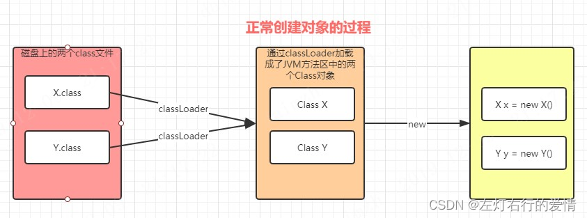
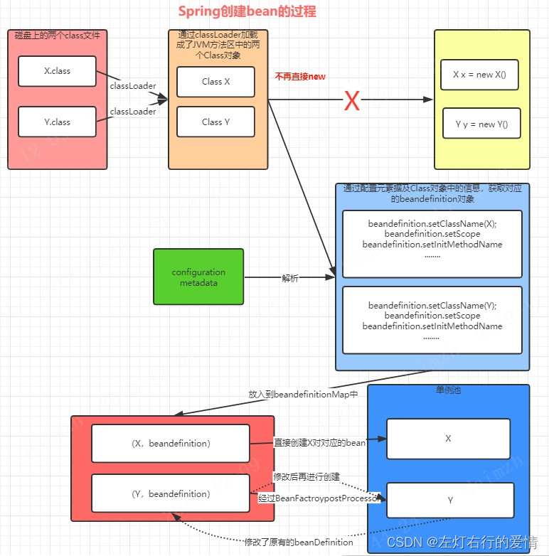
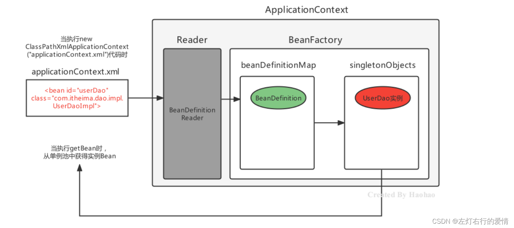

> 原文：[CSDN](https://blog.csdn.net/qq_45852626/article/details/128748042)（历史文章导入，当前状态为草稿）

## 前言

Spring中的BeanDifinition在Bean的实例化流程中占有着非常重要的角色，如果你不了解BeanDifinition的话，面试或者学习Bean的生命周期的话，如同空中楼阁，应付面试可以，如果你想真的成体系化，这部分内容推荐你仔细阅读。  
 本文结合自己平时笔记和大牛博客整理得出，例子都是自己手敲验证过的，放心阅读。

### 什么是BeanDefinition？

这个概念在Spring官网的文档里面介绍的很清楚，参考别人的大致说一下：  
 SpringIOC容器管理一个或多个Bean，这些Bean通过我们提供给容器配置的元数据被创建出来（比如，在xml的定义），在容器中，这些Bean的定义用BeanDefinition对象来表示，包含以下元数据：

* 全限定类名，通过是Bean的实际实现类；
* Bean行为配置元素，它们说明Bean在容器中的行为（作用域，生命周期回调等）；
* Bean执行工作所需要的其他Bean的引用；
* 其他配置信息，比如（管理连接池的bean中，限制池的大小或者使用的连接数量）；  
   大概总结一下，BeanDefinition可以看做是Bean的一个定义或者是一个半成品,是 Spring 框架中用来描述 Bean 的元数据接口，它包含了创建和管理 Bean 所需的所有配置信息。

可以把 BeanDefinition 理解为 **Bean 的"设计图纸"或"配方"**：

* 就像建筑师需要图纸来建造房子
* Spring 容器需要 BeanDefinition 来创建和管理 Bean 实例

```
配置信息（XML/注解/Java配置）
         ↓
    BeanDefinition（Bean的元数据描述）
         ↓
    Bean实例（真正的对象）


```

---

### 为什么要有BeanDefinition？

为什么要这样去设计呢？还要多此一举再添加一个中间状态，直接把Bean创建出来不就好了吗？  
 举个不同方式创建Bean的例子就明白为什么BeanDefinition是有必要存在的：

* 普普通通创建一个Java bean：  
   
* Spring创建Bean：  
   



BeanDefinition 它遵循了"配置与实例分离"的原则。,我可以从源码和实际场景来说明:

#### 延迟实例化,提前验证

如果直接创建 Bean,在启动时就要实例化所有对象。但有了 BeanDefinition:

* 先解析配置,生成 BeanDefinition(元数据)
* 验证配置的正确性(循环依赖、类型冲突等)
* 需要时才创建真正的 Bean 实例

在源码 `BeanDefinitionOverrideFailureAnalyzerTests.java:73: context.setAllowBeanDefinitionOverriding(false);`  
 这说明 Spring 可以在 Bean 实例化之前就检测到定义冲突。

```
	private @Nullable BeanDefinitionOverrideException createFailure(Class<?> configuration) {
		try {
			AnnotationConfigApplicationContext context = new AnnotationConfigApplicationContext();
			context.setAllowBeanDefinitionOverriding(false);
			context.register(configuration);
			context.refresh();
			context.close();
			return null;
		}
		catch (BeanDefinitionOverrideException ex) {
			return ex;
		}
	}


```

#### 动态修改 Bean 的元数据

看 `AbstractDependsOnBeanFactoryPostProcessor.java:116` 的关键代码:

```
  public void postProcessBeanFactory(ConfigurableListableBeanFactory beanFactory) {
     for (String beanName : getBeanNames(beanFactory)) {
         BeanDefinition definition = getBeanDefinition(beanName, beanFactory);
         String[] dependencies = definition.getDependsOn();
         // 动态添加依赖关系
         for (String dependencyName : this.dependsOn.apply(beanFactory)) {
             dependencies = StringUtils.addStringToArray(dependencies, dependencyName);
         }
         definition.setDependsOn(dependencies);  // 修改元数据
     }
 }

//如果没有 BeanDefinition,Bean 已经创建好了
//你怎么修改它的依赖关系?怎么调整初始化顺序?


```

#### 支持条件化注册

BeanDefinition 可以在注册后,实例化前被移除或修改:

* @Conditional 注解的实现
* 自动配置的覆盖机制
* Bean 定义的合并(父子 BeanDefinition)

#### 元数据的丰富性

BeanDefinition 包含大量元数据,这些在 Bean 实例中没有:

* scope (singleton/prototype)
* lazyInit (是否懒加载)
* primary (是否为主候选)
* dependsOn (依赖关系)
* initMethod / destroyMethod
* factoryMethod (工厂方法)

从源码 `SpringApplication.java:49-58` 可以看到这些导入:

```
import org.springframework.beans.factory.config.BeanDefinition;
import org.springframework.beans.factory.support.BeanDefinitionRegistry;
import org.springframework.beans.factory.support.RootBeanDefinition;
import org.springframework.context.annotation.AnnotatedBeanDefinitionReader;
import org.springframework.context.annotation.ClassPathBeanDefinitionScanner;


```

### 实际应用场景

#### 动态添加依赖

```
  // 确保所有 DataSource Bean 在 DatabaseInitializer 之后初始化
  BeanDefinition dataSourceDef = beanFactory.getBeanDefinition("dataSource");
  dataSourceDef.setDependsOn("databaseInitializer");


```

#### 修改作用域

```
  BeanDefinition def = beanFactory.getBeanDefinition("userService");
  def.setScope(BeanDefinition.SCOPE_PROTOTYPE);  // 改为原型模式


```

#### 条件覆盖

```
  if (环境是测试环境) {
      registry.removeBeanDefinition("productionDataSource");
      registry.registerBeanDefinition("testDataSource", testDef);
  }


```

### 在 Spring 容器中的位置

```
┌─────────────────────────────────────────────────────────┐
│                    Spring IoC 容器                        │
│                                                           │
│  1. 配置阶段                                               │
│     @Component, @Bean, XML 等                             │
│            ↓                                              │
│  2. 解析阶段（BeanDefinitionReader）                       │
│     解析配置，生成 BeanDefinition                          │
│            ↓                                              │
│  3. 注册阶段（BeanDefinitionRegistry）                     │
│     将 BeanDefinition 注册到容器                           │
│            ↓                                              │
│  4. 实例化阶段（BeanFactory）                              │
│     根据 BeanDefinition 创建 Bean 实例                     │
│            ↓                                              │
│  5. 初始化阶段                                             │
│     属性注入、初始化方法调用等                              │
│            ↓                                              │
│  6. 就绪状态                                               │
│     Bean 可以被使用                                        │
└─────────────────────────────────────────────────────────┘


```

---

### 主要实现类

Spring 提供了几个重要的实现类：

```
BeanDefinition (接口)
    ↑
    ├── AbstractBeanDefinition (抽象类，提供通用实现)
    │       ↑
    │       ├── RootBeanDefinition (合并后的最终BeanDefinition)
    │       ├── ChildBeanDefinition (可以继承父BeanDefinition)
    │       └── GenericBeanDefinition (通用实现，最常用)
    │
    └── AnnotatedBeanDefinition (带注解元数据的接口)
            ↑
            └── ScannedGenericBeanDefinition (通过@Component等扫描得到)


```

### BeanDefinition 的上下游关系

#### 上游：BeanDefinition 的来源

```
┌──────────────────────────────────────────────────────┐
│                 配置源                                 │
│  • XML配置文件                                         │
│  • @Component/@Service/@Controller 等注解              │
│  • @Configuration + @Bean 方法                         │
│  • 编程方式注册                                         │
└──────────────────────────────────────────────────────┘
                    ↓
┌──────────────────────────────────────────────────────┐
│            BeanDefinitionReader                       │
│  • XmlBeanDefinitionReader (解析XML)                  │
│  • AnnotatedBeanDefinitionReader (解析注解)           │
│  • ClassPathBeanDefinitionScanner (扫描类路径)        │
└──────────────────────────────────────────────────────┘
                    ↓
┌──────────────────────────────────────────────────────┐
│              生成 BeanDefinition                       │
└──────────────────────────────────────────────────────┘


```

#### 中游：BeanDefinition 的注册和存储

```
// BeanDefinitionRegistry 接口（核心注册表）
public interface BeanDefinitionRegistry {
    // 注册 BeanDefinition
    void registerBeanDefinition(String beanName, BeanDefinition beanDefinition);

    // 移除 BeanDefinition
    void removeBeanDefinition(String beanName);

    // 获取 BeanDefinition
    BeanDefinition getBeanDefinition(String beanName);

    // 检查是否包含
    boolean containsBeanDefinition(String beanName);

    // 获取所有Bean名称
    String[] getBeanDefinitionNames();
}


```

**存储位置**：DefaultListableBeanFactory

```
public class DefaultListableBeanFactory extends AbstractAutowireCapableBeanFactory
        implements ConfigurableListableBeanFactory, BeanDefinitionRegistry {

    // 核心存储：ConcurrentHashMap 存储所有的 BeanDefinition
    private final Map<String, BeanDefinition> beanDefinitionMap = new ConcurrentHashMap<>(256);

    // Bean名称列表（保证顺序）
    private volatile List<String> beanDefinitionNames = new ArrayList<>(256);

    @Override
    public void registerBeanDefinition(String beanName, BeanDefinition beanDefinition) {
        // ... 验证逻辑
        this.beanDefinitionMap.put(beanName, beanDefinition);
        this.beanDefinitionNames.add(beanName);
    }
}


```

#### 下游：从 BeanDefinition 到 Bean 实例

```
BeanDefinition
      ↓
BeanFactory.getBean()
      ↓
AbstractAutowireCapableBeanFactory.createBean()
      ↓
┌─────────────────────────────────┐
│  1. createBeanInstance()        │  根据BeanDefinition创建实例
│     - 构造函数推断               │
│     - 工厂方法                   │
│     - 实例化策略                 │
├─────────────────────────────────┤
│  2. populateBean()              │  属性填充（依赖注入）
│     - @Autowired                │
│     - @Value                    │
│     - setter方法注入             │
├─────────────────────────────────┤
│  3. initializeBean()            │  初始化
│     - Aware接口回调              │
│     - BeanPostProcessor前置处理  │
│     - @PostConstruct / init方法  │
│     - BeanPostProcessor后置处理  │
└─────────────────────────────────┘
      ↓
  完整的Bean实例


```

---

### BeanDifinition重点源码

```
package org.springframework.beans.factory.config;

public interface BeanDefinition extends AttributeAccessor, BeanMetadataElement {

    // ========== 作用域相关 ==========
    String SCOPE_SINGLETON = "singleton";
    String SCOPE_PROTOTYPE = "prototype";

    void setScope(@Nullable String scope);
    String getScope();

    // ========== 生命周期相关 ==========
    void setLazyInit(boolean lazyInit);  // 是否懒加载
    boolean isLazyInit();

    // ========== 依赖关系 ==========
    void setDependsOn(@Nullable String... dependsOn);  // 依赖的bean名称
    String[] getDependsOn();

    // ========== Bean类信息 ==========
    void setBeanClassName(@Nullable String beanClassName);  // Bean的类名
    String getBeanClassName();

    // ========== 工厂方法相关 ==========
    void setFactoryBeanName(@Nullable String factoryBeanName);
    String getFactoryBeanName();

    void setFactoryMethodName(@Nullable String factoryMethodName);
    String getFactoryMethodName();

    // ========== 构造函数和属性 ==========
    ConstructorArgumentValues getConstructorArgumentValues();  // 构造参数
    MutablePropertyValues getPropertyValues();  // 属性值

    // ========== 自动装配 ==========
    void setAutowireCandidate(boolean autowireCandidate);
    boolean isAutowireCandidate();

    // ========== 角色分类 ==========
    void setRole(int role);
    int getRole();
    // ROLE_APPLICATION = 0  (用户定义的Bean)
    // ROLE_SUPPORT = 1      (配置类的辅助Bean)
    // ROLE_INFRASTRUCTURE = 2  (Spring内部Bean)
}


```

我们从源码中也可以到看，BeanDIfinition就是对Bean的一个封装。

### 实战案例：完整流程演示

#### 创建示例类

```
package com.example.demo.service;

import org.springframework.beans.factory.annotation.Autowired;
import org.springframework.beans.factory.annotation.Value;
import org.springframework.context.annotation.Lazy;
import org.springframework.context.annotation.Scope;
import org.springframework.stereotype.Service;

import javax.annotation.PostConstruct;

/**
 * 用户服务类 - 演示BeanDefinition如何描述这个Bean
 */
@Service("userService")  // ← Bean名称
@Scope("singleton")      // ← 作用域
@Lazy(false)             // ← 非懒加载
public class UserService {

    @Value("${app.name:MyApp}")  // ← 属性注入
    private String appName;

    @Autowired  // ← 依赖注入
    private UserRepository userRepository;

    @PostConstruct  // ← 初始化方法
    public void init() {
        System.out.println("UserService initialized for: " + appName);
    }

    public void findUser(String username) {
        System.out.println("Finding user: " + username);
        userRepository.query(username);
    }
}

@Service
class UserRepository {
    public void query(String username) {
        System.out.println("Querying database for: " + username);
    }
}


```

#### 查看 BeanDefinition 信息

```
package com.example.demo;

import org.springframework.beans.factory.config.BeanDefinition;
import org.springframework.boot.CommandLineRunner;
import org.springframework.boot.SpringApplication;
import org.springframework.boot.autoconfigure.SpringBootApplication;
import org.springframework.context.ConfigurableApplicationContext;

@SpringBootApplication
public class BeanDefinitionDemoApplication implements CommandLineRunner {

    public static void main(String[] args) {
        SpringApplication.run(BeanDefinitionDemoApplication.class, args);
    }

    @Override
    public void run(String... args) {
        // 获取应用上下文
        ConfigurableApplicationContext context =
            (ConfigurableApplicationContext) SpringApplication.run(
                BeanDefinitionDemoApplication.class, args);

        // 获取 BeanDefinition
        BeanDefinition beanDef = context.getBeanFactory()
            .getBeanDefinition("userService");

        System.out.println("\n========== UserService 的 BeanDefinition 信息 ==========");
        System.out.println("Bean类名: " + beanDef.getBeanClassName());
        System.out.println("作用域: " + beanDef.getScope());
        System.out.println("是否懒加载: " + beanDef.isLazyInit());
        System.out.println("是否单例: " + beanDef.isSingleton());
        System.out.println("是否原型: " + beanDef.isPrototype());
        System.out.println("是否抽象: " + beanDef.isAbstract());
        System.out.println("角色: " + getRoleName(beanDef.getRole()));
        System.out.println("资源描述: " + beanDef.getResourceDescription());

        // 属性值
        System.out.println("\n属性值:");
        beanDef.getPropertyValues().getPropertyValues().forEach(pv -> {
            System.out.println("  - " + pv.getName() + " = " + pv.getValue());
        });

        System.out.println("=======================================================\n");
    }

    private String getRoleName(int role) {
        switch (role) {
            case BeanDefinition.ROLE_APPLICATION: return "APPLICATION (用户Bean)";
            case BeanDefinition.ROLE_SUPPORT: return "SUPPORT (配置支持)";
            case BeanDefinition.ROLE_INFRASTRUCTURE: return "INFRASTRUCTURE (框架内部)";
            default: return "UNKNOWN";
        }
    }
}


```

**输出结果：**

```
========== UserService 的 BeanDefinition 信息 ==========
Bean类名: com.example.demo.service.UserService
作用域: singleton
是否懒加载: false
是否单例: true
是否原型: false
是否抽象: false
角色: APPLICATION (用户Bean)
资源描述: file [E:\...\UserService.class]

属性值:
  - appName = ${app.name:MyApp}
  - userRepository = (RuntimeBeanReference to 'userRepository')
=======================================================


```

#### 编程方式创建 BeanDefinition

```
package com.example.demo.config;

import com.example.demo.service.CustomService;
import org.springframework.beans.factory.config.BeanDefinition;
import org.springframework.beans.factory.support.BeanDefinitionBuilder;
import org.springframework.beans.factory.support.BeanDefinitionRegistry;
import org.springframework.context.annotation.Configuration;
import org.springframework.context.annotation.ImportBeanDefinitionRegistrar;
import org.springframework.core.type.AnnotationMetadata;

/**
 * 手动注册 BeanDefinition 示例
 */
@Configuration
public class CustomBeanRegistrar implements ImportBeanDefinitionRegistrar {

    @Override
    public void registerBeanDefinitions(AnnotationMetadata importingClassMetadata,
                                       BeanDefinitionRegistry registry) {

        // 使用 BeanDefinitionBuilder 构建 BeanDefinition
        BeanDefinition beanDefinition = BeanDefinitionBuilder
            .genericBeanDefinition(CustomService.class)  // 指定Bean类
            .setScope(BeanDefinition.SCOPE_SINGLETON)    // 设置作用域
            .setLazyInit(true)                           // 懒加载
            .addPropertyValue("serviceName", "CustomService")  // 属性值
            .addPropertyReference("userRepository", "userRepository")  // 依赖引用
            .setInitMethodName("init")                   // 初始化方法
            .setDestroyMethodName("destroy")             // 销毁方法
            .getBeanDefinition();

        // 注册到容器
        registry.registerBeanDefinition("customService", beanDefinition);

        System.out.println("✓ 手动注册 BeanDefinition: customService");
    }
}

// 自定义服务类
class CustomService {
    private String serviceName;
    private Object userRepository;

    public void setServiceName(String serviceName) {
        this.serviceName = serviceName;
    }

    public void setUserRepository(Object userRepository) {
        this.userRepository = userRepository;
    }

    public void init() {
        System.out.println("CustomService.init() called - " + serviceName);
    }

    public void destroy() {
        System.out.println("CustomService.destroy() called");
    }
}


```

---

#### BeanDefinition 的修改：BeanFactoryPostProcessor

Spring 允许在 Bean 实例化之前修改 BeanDefinition：

```
package com.example.demo.config;

import org.springframework.beans.BeansException;
import org.springframework.beans.factory.config.BeanDefinition;
import org.springframework.beans.factory.config.BeanFactoryPostProcessor;
import org.springframework.beans.factory.config.ConfigurableListableBeanFactory;
import org.springframework.stereotype.Component;

/**
 * BeanFactoryPostProcessor 可以在Bean实例化前修改BeanDefinition
 */
@Component
public class CustomBeanFactoryPostProcessor implements BeanFactoryPostProcessor {

    @Override
    public void postProcessBeanFactory(ConfigurableListableBeanFactory beanFactory)
            throws BeansException {

        System.out.println("\n========== BeanFactoryPostProcessor 执行 ==========");

        // 修改 userService 的 BeanDefinition
        if (beanFactory.containsBeanDefinition("userService")) {
            BeanDefinition beanDef = beanFactory.getBeanDefinition("userService");

            System.out.println("修改前 - 懒加载: " + beanDef.isLazyInit());

            // 将 userService 改为懒加载
            beanDef.setLazyInit(true);

            System.out.println("修改后 - 懒加载: " + beanDef.isLazyInit());
        }

        // 遍历所有的 BeanDefinition
        String[] beanNames = beanFactory.getBeanDefinitionNames();
        System.out.println("\n容器中共有 " + beanNames.length + " 个 BeanDefinition:");
        for (String name : beanNames) {
            BeanDefinition bd = beanFactory.getBeanDefinition(name);
            if (bd.getRole() == BeanDefinition.ROLE_APPLICATION) {
                System.out.println("  • " + name + " [" + bd.getBeanClassName() + "]");
            }
        }

        System.out.println("===================================================\n");
    }
}


```

---

### 关键源码流程

#### 注解扫描生成 BeanDefinition

```
// ClassPathBeanDefinitionScanner.doScan() 核心代码
protected Set<BeanDefinitionHolder> doScan(String... basePackages) {
    Set<BeanDefinitionHolder> beanDefinitions = new LinkedHashSet<>();

    for (String basePackage : basePackages) {
        // 1. 扫描指定包下的候选组件（带@Component等注解的类）
        Set<BeanDefinition> candidates = findCandidateComponents(basePackage);

        for (BeanDefinition candidate : candidates) {
            // 2. 解析作用域（@Scope）
            ScopeMetadata scopeMetadata = this.scopeMetadataResolver.resolveScopeMetadata(candidate);
            candidate.setScope(scopeMetadata.getScopeName());

            // 3. 生成Bean名称（默认首字母小写的类名）
            String beanName = this.beanNameGenerator.generateBeanName(candidate, this.registry);

            // 4. 设置默认属性（懒加载、自动装配等）
            if (candidate instanceof AbstractBeanDefinition) {
                postProcessBeanDefinition((AbstractBeanDefinition) candidate, beanName);
            }

            // 5. 处理通用注解（@Lazy, @Primary, @DependsOn等）
            if (candidate instanceof AnnotatedBeanDefinition) {
                AnnotationConfigUtils.processCommonDefinitionAnnotations(
                    (AnnotatedBeanDefinition) candidate);
            }

            // 6. 注册到容器
            registerBeanDefinition(definitionHolder, this.registry);

            beanDefinitions.add(definitionHolder);
        }
    }

    return beanDefinitions;
}


```

#### 根据 BeanDefinition 创建实例

```
// AbstractAutowireCapableBeanFactory.createBean() 简化版
protected Object doCreateBean(String beanName, RootBeanDefinition mbd, Object[] args) {

    // 1. 实例化Bean（根据BeanDefinition的构造函数信息）
    BeanWrapper instanceWrapper = createBeanInstance(beanName, mbd, args);
    Object bean = instanceWrapper.getWrappedInstance();

    // 2. 属性注入（根据BeanDefinition的属性配置）
    populateBean(beanName, mbd, instanceWrapper);

    // 3. 初始化（调用BeanDefinition配置的init方法）
    Object exposedObject = initializeBean(beanName, bean, mbd);

    return exposedObject;
}


```

---

### 总结

BeanDifinition初学时不容易，如果没有一个整体的理解，不太容易明白为什么会有BeanDifinition，以及它对于Bean整个生命周期的影响，后面我们聊到生命周期的时候，还会把它拿出来仔细说一说。

#### BeanDefinition 的本质

| 概念 | 说明 |
| --- | --- |
| **是什么** | Bean 的元数据描述对象，包含创建Bean所需的所有配置信息 |
| **作用** | 作为 Spring 容器和 Bean 实例之间的桥梁 |
| **时机** | 在Bean实例化之前存在，用于指导Bean的创建过程 |

#### 核心要点

```
1. 配置来源多样化
   ├── XML配置
   ├── 注解配置（@Component、@Bean）
   └── 编程式注册

2. 存储在容器中
   └── DefaultListableBeanFactory.beanDefinitionMap

3. 可以被修改
   └── BeanFactoryPostProcessor

4. 指导Bean创建
   ├── 实例化策略
   ├── 属性注入
   └── 初始化流程


```

#### 关键接口

* **BeanDefinition**：定义Bean元数据的接口
* **BeanDefinitionRegistry**：注册和管理BeanDefinition
* **BeanDefinitionReader**：读取配置并生成BeanDefinition
* **BeanFactoryPostProcessor**：在实例化前修改BeanDefinition

#### 生命周期位置

```
应用启动
  ↓
解析配置 → 生成BeanDefinition
  ↓
注册到容器（beanDefinitionMap）
  ↓
【可选】BeanFactoryPostProcessor 修改
  ↓
根据BeanDefinition创建Bean实例
  ↓
Bean使用
  ↓
容器关闭，Bean销毁


```

---
