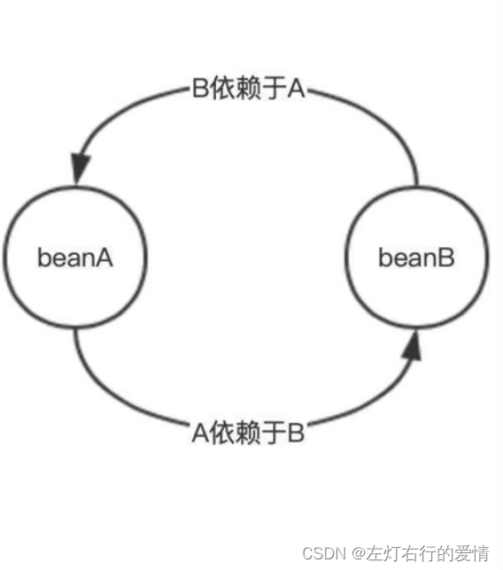
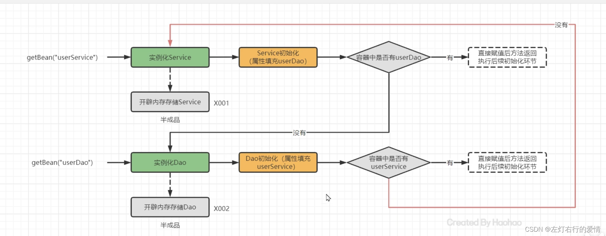
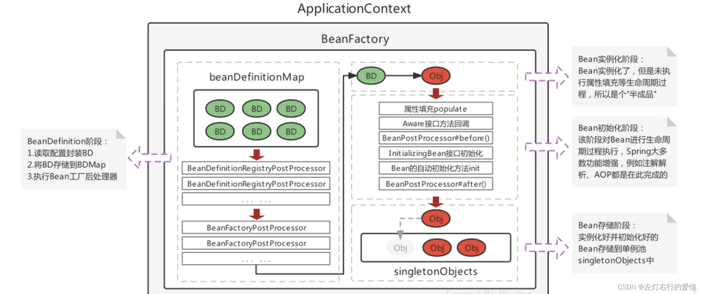

> 原文：[CSDN](https://blog.csdn.net/qq_45852626/article/details/129154492)（历史文章导入，当前状态为草稿）

### 前言

上篇文章我们介绍了Spring的一个核心模块BeanDifinition。  
 那么趁热打铁，我们再来复习一下Bean的整个生命周期是如何工作的。  
 Spring具有高度的灵活性和可扩展性，在Spring框架中，有一些对象是由Spring容器管理的，而这些对象的生命周期受Spring容器的管理。  
 我们先回进行一些前置知识的学习，帮助我们更好的理解。  
 **您的关注是我最大的动力，我会不断打磨自己的笔记和知识点，希望可以一直给您带来帮助，关注交个朋友吧。**

### 为什么要学习Bean的生命周期

在 Spring 框架中，Bean 是一个非常重要的概念，Bean 是 Spring 中的基本组件，它们由 Spring 容器创建、管理和维护，Bean 的生命周期是在容器中创建、初始化、使用和销毁的过程。  
 理解 Bean 的生命周期可以帮助开发人员更好地利用 Spring 框架，更好地管理和控制应用程序的组件。  
 具体而言呢，学习Bean的生命周期可以帮助我们理解：  
 1.理解 Spring 容器如何创建、管理和维护 Bean，从而可以更好地设计和实现应用程序中的组件。  
 2.理解 Bean 生命周期中各个阶段的意义，从而可以在 Bean 的生命周期的不同阶段进行一些必要的处理，比如在初始化阶段执行一些特定的操作。  
 3.学习如何自定义 Bean 生命周期中的各个阶段，从而可以控制 Bean 的创建和销毁过程。  
 后面等我们学习后，这三点我们会通过业务场景分别举例说明，确保我们已经掌握了。

### 前置知识

#### Spring Post-processor（后置处理器）

如果不太了解。麻烦先看这篇文章：[后置处理器](https://editor.csdn.net/md/?articleId=129154666)

#### Aware接口

如果不太了解。麻烦先看这篇文章：[Aware接口](https://editor.csdn.net/md/?articleId=129347485)

如果这两块不太了解，务必去看一下，大概会花费30分钟时间去理解，磨刀不误砍柴工。

### 简单介绍

Spring的生命周期是从Bean实例化之后，即通过反射创建出对象之后，到Bean成为一个完整对象，最终存储到单例池中，这个过程被称为`Spring Bean`的生命周期。`Spring Bean`的生命周期大体上分为三个阶段：

* Bean的实例化阶段：Spring框架会取出`BeanDefinition`信息进行判断当前Bean的范围是否是`singleton`的，是否是延迟加载的，是否是`FactoryBean`等，最终将一个普通的`singleton`的Bean通过反射进行实例化；
* Bean的初始化阶段：Bean创建之后还仅仅是个“半成品”，还需要对Bean实例的属性进行填充，执行一些Aware接口方法，执行`BeanPostProcessor`方法，执行`InitializingBean`接口的初始化方法，执行自定义初始化init方法等。该阶段是Spring最具技术含量和复杂度等阶段，Aop增强功能，后面的Spring注解功能等。
* Bean的完成阶段：经过初始化阶段，Bean就成了一个完整的SpringBean，被存储到单例池`singletonObjects`中去了，即完成了SpringBean的整个生命周期。

### Bean的实例化过程

#### 为什么会有bean的实例化？

Bean的实例化是创建Bean对象，并将其放置在Sprig容器中，以便在需要时可以使用它们。  
 Bean的实例化使得开发者可以通过声明Bean定义来描述Bean的行为和属性，无需关心具体的实例化过程。

#### 过程


Spring容器根据Bean的定义读取配置文件或者注解信息，找到Bean的定义。  
 2.  
 创建BeanDefinition对象：在加载配置文件后，Spring会为每个Bean定义一个BeanDefinition对象。BeanDefinition对象包含了Bean的信息，例如Bean的类名、依赖关系等。  
 3.  
 实例化Bean：在BeanDefinition对象创建完成后，Spring会使用BeanDefinition对象中的信息来创建Bean实例。Bean实例化的方式有多种，例如通过构造函数、工厂方法、对象池等方式来创建Bean实例。。  
 4.  
 如果Bean的作用域为`singleton`且不是懒加载模式，Spring容器会在容器启动时进行实例化。  
 如果作用域为`prototype`或者是`singleton` 且为懒加载模式，Spring容器会在第一次请求该Bean的时候进行实例化。  
 换句话说：Bean实例化后，Spring会根据Bean的作用域(scope)进行相应的处理，如果Bean的作用域是singleton，Spring会在容器初始化时创建Bean实例并将其放入容器中；如果Bean的作用域是prototype，Spring会在每次请求时创建新的Bean实例。

1.Bean的定义：  
 假设有一个名为 “userService” 的 Bean，在配置文件中的定义如下所示：

```
<bean id="userService" class="com.example.UserService">
    <property name="userDao" ref="userDao" />
</bean>


```

2.Bean的实例化  
 当容器启动时，如果 “userService” Bean 是 singleton 作用域且不是懒加载模式，则容器会进行实例化。  
 如果是 prototype 作用域或者是 singleton 且懒加载模式，则容器会在第一次请求该 Bean 的时候进行实例化。  
 3.依赖注入  
 在上述 Bean 定义中，“userService” Bean 的构造函数需要一个名为 “userDao” 的依赖对象。Spring 容器会自动进行依赖注入，例如在上述例子中，容器会先实例化名为 “userDao” 的 Bean，然后将该 Bean 注入到 “userService” Bean 的构造函数中。

Spring 容器在销毁 MyBean 实例之前，会调用其 cleanup() 方法进行清理操作。我们需要在 Bean 类中定义该方法。注意，如果 Bean 同时实现了 DisposableBean 接口和指定了 destroy-method 属性，则 destroy-method 属性中指定的方法会覆盖接口中定义的方法。

**总体来说：**  
 Bean 的实例化过程比较复杂，其中涉及到多个步骤和相关的接口和类。这些步骤和接口可以帮助我们在 Bean 的生命周期中执行自定义的逻辑和操作，增加了 Spring 框架的灵活性和扩展性。

### Bean的初始化阶段

#### 为什么会有Bean的初始化？

在Spring框架中，Bean的初始化是必要的，因为Spring的核心思想是IoC（控制反转）和DI（依赖注入）。在IoC中，对象的创建和维护不再由应用程序负责，而是由框架来完成。这意味着，应用程序只需要声明它需要哪些对象，而不必关心它们的创建和维护。

为了实现这个目标，Spring容器需要能够创建和管理所有声明的Bean。在容器启动时，Spring会读取配置文件（或注解）中的Bean定义，并创建相应的Bean实例。这个过程称为Bean的初始化。  
 Bean的初始化是Spring框架实现IoC和DI的必要步骤之一。

#### Bean的初始化目的是什么？

初始化节点：Bean实例化之后，属性注入之前，以及使用之前执行的操作。  
 目的：使用Bean之前，对Bean进行一些配置，检查，预处理等操作，以确保能够正确地工作。  
 意义：Bean的初始化给了我们一个机会，可以在Bean初始化之前或者之后对Bean进行一些扩展操作（例如：实现BeanPostProcessor接口的后置处理器，可以在Bean实例化后、属性注入前或后、初始化方法前或后等各个阶段对Bean进行操作。）。  
 大致的流程为：  
 1.Bean实例的属性填充：  
 当Spring容器创建一个bean实例时，它会自动注入该实例的依赖项，这些依赖项可以是其他的bean实例或者是基本类型的值。属性注入可以通过构造函数注入、setter方法注入或字段注入来完成。  
 2.Aware接口属性注入：  
 当一个bean实现了Aware接口时，Spring容器在创建bean的过程中会自动调用相应的接口方法，并将相关的依赖项传递给这些方法。这样可以让bean在创建时得到一些额外的信息，例如ApplicationContext、BeanFactory等。  
 3.BeanPostProcessor的before()方法回调  
 4.InitializingBean接口的初始化方法回调  
 5.自定义初始化方法init回调  
 6.BeanPostProcessor的after()方法回调

针对于上面的每个步骤，我们来看个例子就可以更加了解了。  
 1.  
 a. 构造函数注入：

```
public class Person {
    private String name;
    private int age;

    public Person(String name, int age) {
        this.name = name;
        this.age = age;
    }

    // getters and setters
}
<bean id="person" class="com.example.Person">
    <constructor-arg value="John Doe" />
    <constructor-arg value="30" />
</bean>


```

b.setter方法注入:

```
public class Person {
    private String name;
    private int age;

    public void setName(String name) {
        this.name = name;
    }

    public void setAge(int age) {
        this.age = age;
    }

    // getters
}
<bean id="person" class="com.example.Person">
    <property name="name" value="John Doe" />
    <property name="age" value="30" />
</bean>


```

上面的例子中，我们定义了一个名为"person"的bean实例，并且通过字段注入了name和age属性。注入是通过使用@Value注解和XML属性元素的value属性来完成的。

注意，这些示例只是展示了属性填充的一些常见方式，实际上Spring还提供了其他的属性填充方式，例如注解注入和自动装配。  
 spring的自动装配，后面boot的时候我们会详细说。感兴趣可以点个关注哈哈。  
 3.字段注入

```
public class Person {
    @Value("John Doe")
    private String name;

    @Value("30")
    private int age;

    // getters
}
<bean id="person" class="com.example.Person">
    <property name="name" value="John Doe" />
    <property name="age" value="30" />
</bean>


```

2.Aware接口注入  
 如果 Bean 实现了 Aware 接口，例如 BeanNameAware 接口，则 Spring 容器会调用相应的方法将容器中的信息注入到该 Bean 中。例如：

```
public class MyBean implements BeanNameAware {

    private String beanName;

    @Override
    public void setBeanName(String beanName) {
        this.beanName = beanName;
    }
}


```

当容器实例化 “MyBean” Bean 时，会调用 setBeanName() 方法将该 Bean 在容器中的名称注入到 “beanName” 属性中。  
 3.BeanPostProcessor前置处理  
 如果 Bean 实现了 BeanPostProcessor 接口，例如：

```
public class MyBeanPostProcessor implements BeanPostProcessor {
    @Override
    public Object postProcessBeforeInitialization(Object bean, String beanName) throws BeansException {
        // 在 Bean 初始化之前进行处理
        return bean;
    }
}


```

则 Spring 容器会在 Bean 实例化后，调用其 postProcessBeforeInitialization() 方法进行前置处理。例如可以在该方法中修改 Bean 的属性值或者生成代理对象等。  
 4.初始化方法  
 如果 Bean 实现了 InitializingBean 接口，例如：

```
public class MyBean implements InitializingBean {
    @Override
    public void afterPropertiesSet() throws Exception {
        // 在 Bean 初始化完成之后进行操作
    }
}


```


或者指定了自定义的初始化方法，例如：

```
<bean id="myBean" class="com.example.MyBean" init-method="init">
</bean>


```

则 Spring 容器会在 Bean 实例化后，调用其 afterPropertiesSet() 方法或者指定的自定义初始化方法进行初始化操作。  
 6.BeanPostProcessor后置处理  
 如果 Bean 实现了 BeanPostProcessor 接口，例如：

```
public class MyBeanPostProcessor implements BeanPostProcessor {

    @Override
    public Object postProcessAfterInitialization(Object bean, String beanName) throws BeansException {
        // 在 Bean 初始化完成之后进行处理
        return bean;
    }
}


```

则 Spring 容器会在 Bean 初始化之后，调用其 postProcessAfterInitialization() 方法进行后置处理。例如可以在该方法中为 Bean 增加一些功能或者修改其属性值等。  
 8.DisposableBean

```
public class MyBean implements DisposableBean {
    @Override
    public void destroy() throws Exception {
        // 在 Bean 销毁之前进行清理操作
    }
}


```

当 Spring 容器销毁 MyBean 实例时，会调用其 destroy() 方法进行清理操作。开发人员可以在该方法中进行一些清理工作，例如关闭数据库连接、释放资源等。

另外，在 XML 配置文件中也可以通过指定 destroy-method 属性来定义 Bean 的销毁方法，例如：

```
<bean id="myBean" class="com.example.MyBean" destroy-method="cleanup">


```

### 依赖注入

#### 基本概念

依赖注入（Dependency Injection，DI）是一种设计模式，它的核心思想是通过依赖将依赖关系从应用程序代码中抽离出来，由容器来负责和实例化和管理对象之间的依赖关系。  
 优点：  
 1.可测试性：通过将依赖项注入到组件中，可以轻松地模拟和替换这些依赖项，从而使得测试变得更加容易。  
 2.可扩展性：通过注入依赖项，组件的实现可以从外部配置和管理，从而使得应用程序更加灵活和可扩展。  
 3.可维护性：通过解耦组件之间的依赖关系，可以使得代码更加易于维护和修改。  
 4.可读性：通过使用依赖注入，可以使得组件之间的依赖关系更加明确和易于理解。

#### 依赖注入的几种方式

Spring在进行属性填充的时候，会分如下几种情况：

* 注入普通属性：  
   String，int或存储基本类型的集合时，直接通过set方法的反射设置进去；
* 注入单向对象引用属性：  
   从容器中getBean获取后通过set方法反射设置进去，如果容器中没有，则先创建被注入对象Bean实例（完成整个生命周期）后，再进行注入操作；
* 注入双向对象引用属性时：  
   比较复杂了，双向对象引用属性指的是两个对象之间相互引用。涉及到了循环引用（循环依赖）问题，下面我们详细来聊一下这个问题。

需要注意的是，在使用Spring进行属性注入时，应该尽量避免使用双向对象引用属性，因为这样可能会导致复杂度的增加，代码难以维护。同时，需要根据实际情况选择合适的注入方式，保证代码的可读性和可维护性。

我们对于上面三种情况分别举出例子来说明：  
 1.注入普通属性的示例：

```
public class User {
    private String name;
    private int age;

    public void setName(String name) {
        this.name = name;
    }

    public void setAge(int age) {
        this.age = age;
    }

    // ...
}

<!-- XML配置文件中的配置 -->
<bean id="user" class="com.example.User">
    <property name="name" value="Alice"/>
    <property name="age" value="25"/>
</bean>


```

2.注入单向对象引用属性的示例：

```
public class Order {
    private User user;

    public void setUser(User user) {
        this.user = user;
    }

    // ...
}
<!-- XML配置文件中的配置 -->
<bean id="user" class="com.example.User">
    <property name="name" value="Alice"/>
    <property name="age" value="25"/>
</bean>
<bean id="order" class="com.example.Order">
    <property name="user" ref="user"/>
</bean>


```

3.注入双向对象引用属性的示例:

```
public class Department {
    private List<Employee> employees;

    public void addEmployee(Employee employee) {
        employees.add(employee);
        employee.setDepartment(this);
    }
    // ...
}
public class Employee {
    private Department department;

    public void setDepartment(Department department) {
        this.department = department;
    }
    // ...
}
<!-- XML配置文件中的配置 -->
<bean id="department" class="com.example.Department" lazy-init="true"/>

<bean id="employee1" class="com.example.Employee">
    <property name="department" ref="department"/>
</bean>

<bean id="employee2" class="com.example.Employee">
    <property name="department" ref="department"/>
</bean>


```

Department和Employee对象之间形成了双向引用关系，Department持有一个Employee的List，Employee持有一个Department的引用。

#### 重点问题——依赖循环

##### 那么，为什么会出现循环引用问题呢？

循环引用问题通常出现在双向引用关系中，例如A对象持有B对象的引用，B对象持有A对象的引用。在这种情况下，如果不加以限制，可能会导致对象的创建和销毁出现问题。  
 

具体来说，当Spring容器在创建A对象时，需要先创建B对象并将B对象注入到A对象中。而在创建B对象时，又需要先创建A对象并将A对象注入到B对象中。这样就会形成一个循环依赖的情况，导致对象无法创建成功。

为了避免循环引用问题，可以使用一些技巧来限制对象之间的依赖关系。  
 例如，可以使用@Lazy注解来延迟注入，或者使用Setter方法注入来解决循环引用问题，当然spring自带的也有缓存也是解决方案。同时，需要根据实际情况选择合适的注入方式，保证代码的可读性和可维护性。  
 

为了更好懂一些，我们举一个订单系统的 业务场景：  
 假设有一个简单的订单系统，包括订单（Order）和用户（User）两个实体类。  
 其中，一个订单只属于一个用户，而一个用户可以有多个订单。  
 因此，订单类需要持有一个用户对象的引用，用户类需要持有一个订单列表的引用。

代码如下：

```
public class Order {
    private User user;

    public void setUser(User user) {
        this.user = user;
    }

    // ...
}

public class User {
    private List<Order> orders;

    public void setOrders(List<Order> orders) {
        this.orders = orders;
    }

    // ...
}


```

如果使用Spring进行属性注入时，可能会出现循环引用问题。具体来说，当Spring容器在创建User对象时，需要先创建Order对象并将Order对象添加到User对象的订单列表中。而在创建Order对象时，又需要先创建User对象并将User对象注入到Order对象中。这样就形成了一个循环依赖，导致对象创建失败。

#### 如何解决Spring依赖循环问题

##### Spring自身的策略——提供三级缓存

在Bean实例属性填充上：  
 Spring提供了**三级缓存**存储**完整Bean实例**和**半程品Bean实例**，用于解决循环引用问题。  
 在`DefaultListableBeanFactory`的上四级父类`DefaultSingletonBeanRegistry`中提供了如下三个Map：

```
/** Cache of singleton objects: bean name to bean instance. */
//1.存储单例Bean成品的容器，即实例化和初始化都完成的Bean，称之为“一级缓存”
	private final Map<String, Object> singletonObjects = new ConcurrentHashMap<>(256);

	/** Cache of singleton factories: bean name to ObjectFactory. */
//2.单例Bean的工厂池，缓存半成品对象，对象未被引用，使用时再通过工厂创建Bean，称之为“三级缓存”
	private final Map<String, ObjectFactory<?>> singletonFactories = new HashMap<>(16);

	/** Cache of early singleton objects: bean name to bean instance. */
//3.早期Bean单例池，缓存半成品对象，且当前对象已经被其他对象引用了，称之为“二级缓存”。
	private final Map<String, Object> earlySingletonObjects = new ConcurrentHashMap<>(16);


```

我们首先给一个图来看：  
   
 这里简单聊一下大概的过程：  
 1.首先一个`userService`实例化创建完毕之后，并不是直接存到`singletonFactories`三级缓存里面，这个`userService`会用`ObjectFactory`进行一个包装，换句话说就是为它创建一个`ObjectFactory`,然后添加到三级缓存中，我们来看一下这个类：

```
@FunctionalInterface
public interface ObjectFactory<T> {

	/**
	 * Return an instance (possibly shared or independent)
	 * of the object managed by this factory.
	 * @return the resulting instance
	 * @throws BeansException in case of creation errors
	 */
	T getObject() throws BeansException;

}


```

所以等到我们真正去用的时候，再去调用里面的`getObject`方法。  
 我们也很清楚的明白，这个bean是未被引用的。  
 2.我们判断容器中是否有UserDao时，原先是从单例池找，但现在有了三级缓存（这里指的是三个缓存，即：一级，二级，三级），就会把三级缓存整个找下来看有没有UserDao。  
 3.找不到后，进去下半部分的路线，直到执行到判断（容器中是否有UserService），发现第三级缓存（这里只单指第三级缓存）之前存过了，那么就进行注入。  
 4.UserService被注入了，那么就放入到二级缓存

完整流程如下：

1. UserService实例化对象，但还没有初始化，将UserService存储到第三级缓存。
2. UserService属性注入，需要UserDao，从缓存中获取，没有UserDao；
3. UserDao实例化对象，但尚未初始化，将UserDao存储到三级缓存；
4. UserDao属性注入，需要UserService，从三级缓存获取UserService，UserService从三级缓存移入二级缓存。
5. UserDao执行其他生命周期过程，最终成为一个完成Bean，存储到一级缓存，删除二三级缓存。
6. UserService注入UserDao。
7. UserService执行其他生命周期过程，最终成为一个完成Bean，存储到一级缓存，删除二三级缓存。

**这块目前我们只说原理，源码后面等我们聊完refresh后，我们再一块梳理一下整个Bean生命周期的源码流程。**

#### 生命周期总结

一张图，无需多言，这个老师真的非常牛！！！！非常清晰。  
 如果觉得哪里看不明白，欢迎留言。  
 

### 总结

Spring Bean生命周期上文涉及的大多是原理，等到后面源码篇时，我们会聊里面具体的代码实现。如果你对后面的内容感兴趣，麻烦点个关注，后面更新后方便更快查看。
