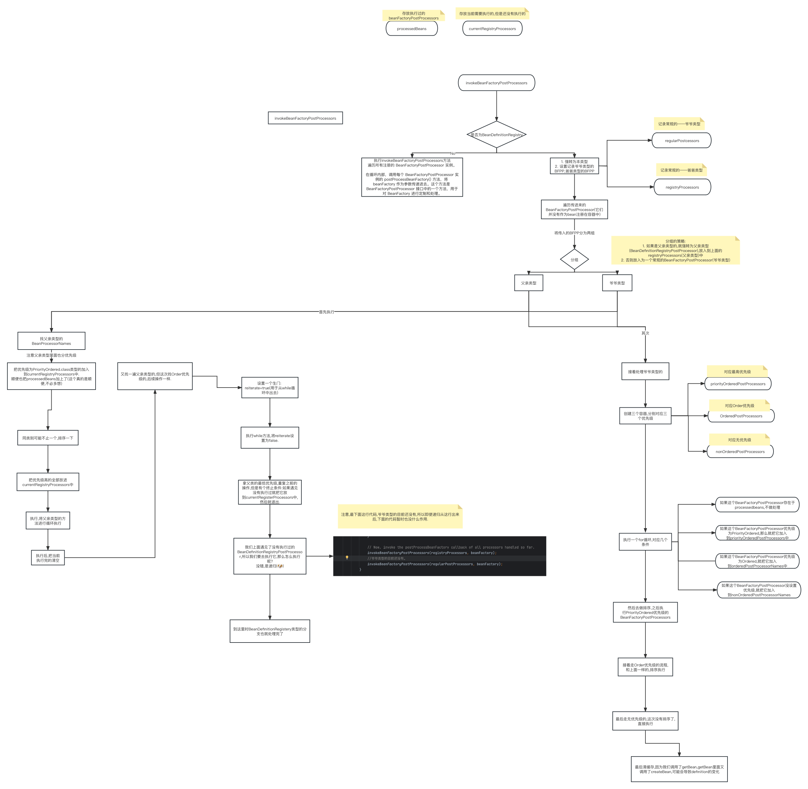

> 原文：[CSDN](https://blog.csdn.net/qq_45852626/article/details/129447982)（历史文章导入，当前状态为草稿）

## 前言

前面我们聊过bean的生命周期，也涉及到了一些容器的初始化，那么现在我们就来一起聊聊Spring框架中当之无愧的炸子鸡之一的`AbstractApplicationContext`类下的Refresh方法。  
 其难度之大，逻辑之复杂，写这篇文章的时候很头大：经常会有盲目深入导致自己理解不了，逻辑盘不明白；简单的浅入又觉得有点遗憾，本篇结合原理和源码，由宏观到细微之处，尽自己全力来发现refresh里面的巧妙。  
 如果你觉得看完本篇有帮助，可以点个关注交个朋友，以后也希望为你带来更多有益的文章。

### 简单介绍

refresh() 方法是 Spring 框架中最为核心的方法之一，可以说整个 Spring 容器的运作机制就是围绕着这个方法来展开的，在Spring框架中，ApplicationContext是容器的核心接口，负责管理和维护Spring应用程序中的所有bean。  
 当应用程序启动时，Spring容器会自动创建并加载所有的bean定义，并将其实例化为bean对象。随着应用程序的运行，这些bean对象可能需要被修改、替换、删除等操作，这时就需要刷新ApplicationContext来更新bean的状态。

#### 为什么会有这个方法的存在

当一个应用程序启动时，Spring IoC容器会初始化并创建所有的bean实例，这些bean实例通常包括数据访问对象、业务对象、控制器等。  
 举个例子来分别展示一下这三个是什么：  
 1.数据访问对象（DAO）  
 假设我们需要访问数据库中的用户信息，我们可以定义一个UserDao接口和UserDaoImpl实现类，如下所示：

```
public interface UserDao {
    List<User> getAllUsers();
}
@Repository (@Repository注解是用于标识该类为数据访问对象（DAO）的注解，它的作用是告诉Spring容器该类的作用以及如何使用该类。)
public class UserDaoImpl implements UserDao {
    @Autowire
    private JdbcTemplate jdbcTemplate;

    public UserDaoImpl(JdbcTemplate jdbcTemplate) {
        this.jdbcTemplate = jdbcTemplate;
    }
    @Override
    public List<User> getAllUsers() {
        String sql = "SELECT * FROM users";
        return jdbcTemplate.query(sql, new UserRowMapper());
    }
}


```

2. 业务对象（Service）  
    编写一个用户管理的业务逻辑，我们可以定义一个UserService接口和UserServiceImpl实现类，如下所示：

```
public interface UserService {
    List<User> getAllUsers();
}
@Service
public class UserServiceImpl implements UserService {
    @Autowire
    private  UserDao userDao;

    public UserServiceImpl(UserDao userDao) {
        this.userDao = userDao;
    }
    @Override
    public List<User> getAllUsers() {
        return userDao.getAllUsers();
    }
}


```

3.控制器（Controller）  
 我们可以定义一个UserController控制器类，如下所示：

```
@RestController
@RequestMapping("/users")
public class UserController {
    @Autowire
    private  UserService userService;

    public UserController(UserService userService) {
        this.userService = userService;
    }
    @GetMapping
    public List<User> getAllUsers() {
        return userService.getAllUsers();
    }
}


```

在应用程序运行期间，如果需要更改bean的属性或者添加新的bean，就需要将这些变化更新到IoC容器中。  
 这时候，就需要使用Spring框架中提供的refresh()方法来重新加载配置文件、更新bean的定义、实例化和注册bean，**以保证容器中的bean与最新的配置文件保持一致**。  
 当我们调用refresh()方法时，IoC容器会先销毁容器中的所有bean，然后重新读取配置文件，更新容器中的bean定义信息，并重新实例化和注册bean。  
 这个过程可以保证应用程序运行期间，容器中的bean信息都是最新的，同时也可以保证容器中的bean的状态与配置文件保持一致。  
 这个过程也被称为IoC容器的刷新过程。

### 框架介绍（宏观介绍）

介绍的思路是：主要的方法+文字解释，一些太难的方法因本人能力有限，会做个预埋，后面有能力的再来补上。  
 整个refresh方法的重点方法：

```
1.preareRefresh————刷新前的工作准备
 1.1:initPropertySources————校验Environment的requiredProperties是否都存在
  1.1.1:AbstractRefreshableWebApplicationContext
默认不做任何实现。
  1.1.2:GenericWebApplication
  1.1.3:StaticWebApplicationContext
 1.2:earlyApplicationListeners————监听器
2.obtainFreshBeanFactory————获取子类刷新后的内容beanFactory实例，它的作用是创建并刷新容器的bean工厂，包括从上下文定义的位置加载bean定义、创建bean工厂实例、设置bean工厂的序列化id等。
 2.1:refreshBeanFactory————刷新beanFactory。
3.prepareBeanFactory——为容器注册必要的系统级别的Bean。
4.postProcessBeanFactory——允许容器的子类去注册postProcessor。
  4.1.AbstractRefreshableWebApplicationContext。
  4.2


```

#### preareRefresh：刷新前的工作准备

##### initPropertySources

```
java
   protected void prepareRefresh() {  
   // Switch to active.  
   //设置启动时间  
   this.startupDate = System.currentTimeMillis();  
   this.closed.set(false);  
   //设置容器的状态为激活  
   this.active.set(true);  
       //配置的日志w等级决定是否详细记录  
   if (logger.isDebugEnabled()) {  
      if (logger.isTraceEnabled()) {  
         logger.trace("Refreshing " + this);  
      }  
      else {  
         logger.debug("Refreshing " + getDisplayName());  
      }  
   }  
  
   // Initialize any placeholder property sources in the context environment.  
   //初始化Environment的propertySources属性  
   //样例<context:property-placeholder location="classpath*:/config/load.properties"/>  
   //3.校验Environment的requiredProperties是否都存在  
   initPropertySources();  
  
   // Validate that all properties marked as required are resolvable:  
   // see ConfigurablePropertyResolver#setRequiredProperties   
   getEnvironment().validateRequiredProperties();  
  
   // Store pre-refresh ApplicationListeners...  
   if (this.earlyApplicationListeners == null) {  
      //创建监听器  
      this.earlyApplicationListeners = new LinkedHashSet<>(this.applicationListeners);  
   }  
   else {  
      // Reset local application listeners to pre-refresh state.  
      this.applicationListeners.clear();  
      this.applicationListeners.addAll(this.earlyApplicationListeners);  
   }  
  
   // Allow for the collection of early ApplicationEvents,  
   // to be published once the multicaster is available...   //创建事件集合  
   this.earlyApplicationEvents = new LinkedHashSet<>();  
  }


```

* 首先我们进入到第一个方法initPropertySources里面：  
   initPropertySources是一个空方法,但是它有三个实现方法,为什么有三个呢?  
   当然是为了满足Spring在Web应用程序场景下的需求和灵活性,我先大致在这里解释一下:
* AbstractRefreshableWebApplicationContext  
   这个子类是为了支持**可刷新**的Web应用程序上下文,即在**运行时可以动态地**重新加载和刷新Bean定义.  
   所以显然它适用于那些需要动态更新Bean定义的Web应用程序(比如:热部署技术,无需重新启动应用程序即可应用新的Bean配置)  
   因为有它提供了动态刷新的功能,所以我们可以在程序不停止的情况下进行部分的更新和修改.
* GenericWebApplicationContext  
   这个子类为了支持通用的Web应用程序上下文,它的主要作用:

1. Java配置类的支持: 是允许我们使用Java代码来配置和管理应用程序的Bean,通过Java配置类,开发者可以使用编程方式配置Bean的依赖关系,作用域,初始化和销毁方法等.
2. 类型安全: 使用Java配置类配置Bean带来更好的安全性.Java 编译器可以在编译时捕获一些错误，例如类型不匹配或不存在的 Bean 引用，从而减少在运行时可能出现的错误。
3. 解耦和模块化: 很显然,使用Java配置类,可以将应用程序的配置逻辑和具体的Bean分开.
4. 注解的支持:J ava 配置类可以使用 Spring 的注解来简化配置，如 @ComponentScan、@Autowired、@Bean 等，这些注解可以更轻松地定义 Bean 和处理依赖关系。
5. 支持Web环境: 并不局限于只能用于Web应用程序，也可以用于非Web应用程序。不过，它确实支持Web环境，可以在Web应用程序中使用，并且与其他Spring Web相关组件结合使用，如Spring MVC。

* StaticWebApplicationContext  
   通过名字我们也能看出来,相比于其他可刷新的应用程序上下文，静态上下文在初始化后不能对 Bean 定义进行动态刷新。它主要用于那些在应用程序生命周期内不需要或不允许动态修改 Bean 定义的场景。  
   主要用途有:

1. 轻量级应用程序：适用于那些较为简单、轻量级的应用程序，这些应用程序在初始化时确定了所有的 Bean 定义，并且不需要在运行时对它们进行修改。这样可以减少应用程序上下文的初始化开销和内存占用。
2. 资源有限的环境: 由于静态上下文不支持动态刷新，它的资源消耗通常较低。因此，在资源有限的环境下（如嵌入式设备、移动设备等），使用静态上下文可以更好地管理资源，并减少不必要的开销。
3. 应用程序生命周期内不需要动态修改 Bean 定义：对于某些应用程序，一旦 Bean 定义确定并加载后，它们在运行时不需要动态地修改或重新加载。例如，一些简单的应用程序只需要在启动时加载配置，然后保持不变，这种情况下使用静态上下文是合适的。
4. 预防 Bean 定义被篡改: 某些安全敏感的环境中，可能希望确保应用程序上下文的内容在初始化后不会被篡改。使用静态上下文可以防止在运行时对 Bean 定义进行修改，从而增加应用程序的安全性。

所以我们能大致看出来,对于不同的场景,Spring给我们提供了灵活子类实现供我们选择.

###### ConfigurableEnvironment

下面我们再了解一下ConfigurableEnvironment类是什么,了解这个有助于下面的理解.emm稍微硬核一点,来读读英文文档吧,链接🔗给你们: [ConfigurableEnvironment文档](https://docs.spring.io/spring-framework/docs/current/javadoc-api/org/springframework/core/env/ConfigurableEnvironment.html)

```
//包的位置
Package org.springframework.core.env

//接口名称
Interface ConfigurableEnvironment

//该接口的父类接口
All Superinterfaces:
ConfigurablePropertyResolver, Environment, PropertyResolver(这个类是Enviroment的父类.)

//所有继承该接口的子接口
All Known Subinterfaces:
ConfigurableWebEnvironment

//所有已实现该接口的类(注意,上面的子接口是未实现的类,一个是接口，一个是类.)
All Known Implementing Classes:
AbstractEnvironment, MockEnvironment, 
StandardEnvironment, StandardServletEnvironment


public interface ConfigurableEnvironment
extends Environment, ConfigurablePropertyResolver

/**
配置接口将由大多数(如果不是所有)环境类型实现。
该接口提供了设置活动和默认配置文件，并操作底层属性源的功能。
允许客户端设置和验证所需的属性，通过ConfigurablePropertyResolver superinterface自定义转换服务等。
**/
Configuration interface to be implemented by most if not all Environment types.
Provides facilities for setting active and default profiles and manipulating underlying property sources. 
Allows clients to set and validate required properties, customize the conversion service and more through the ConfigurablePropertyResolver superinterface.

//操作属性源
Manipulating property sources

/**
属性源可以被删除、重新排序或替换;另外，可以使用getPropertySources()返回的MutablePropertySources实例来添加其他属性源。
下面的例子与ConfigurableEnvironment的标准环境实现不同，但通常适用于任何实现，尽管特定的默认属性源可能不同。
**/
Property sources may be removed, reordered, or replaced; and additional property sources may be added using the MutablePropertySources instance returned from getPropertySources(). The following examples are against the StandardEnvironment implementation of ConfigurableEnvironment, but are generally applicable to any implementation, though particular default property sources may differ.

//例子:添加具有最高搜索优先级的新属性源
Example: adding a new property source with highest search priority

 ConfigurableEnvironment environment = new StandardEnvironment();
 MutablePropertySources propertySources = environment.getPropertySources();
 Map<String, Object> myMap = new HashMap<>();
 myMap.put("xyz", "myValue");
 propertySources.addFirst(new MapPropertySource("MY_MAP", myMap));
 
//删除默认的系统属性属性源
Example: removing the default system properties property source
MutablePropertySources propertySources = environment.getPropertySources();
propertySources.remove(StandardEnvironment.SYSTEM_PROPERTIES_PROPERTY_SOURCE_NAME)
 
//模拟系统环境以进行测试
Example: mocking the system environment for testing purposes
MutablePropertySources propertySources = environment.getPropertySources();
MockPropertySource mockEnvVars = new MockPropertySource().withProperty("xyz", "myValue");
propertySources.replace(StandardEnvironment.SYSTEM_ENVIRONMENT_PROPERTY_SOURCE_NAME, mockEnvVars);
 
当ApplicationContext使用一个Environment时,任何此类属性和资源操作都要在context的refresh()方法被调用之前执行是非常重要的.这确保了在容器引导过程中所有属性源都是可用的，包括属性占位符配置器使用。
When an Environment is being used by an ApplicationContext, it is important that any such PropertySource manipulations be performed before the context's refresh() method is called. This ensures that all property sources are available during the container bootstrap process, including use by property placeholder configurers.


```

那么总结来说,ConfigurableEnvironment在Spring框架中提供了作用如下:  
 提供了对应用程序环境的配置能力。它是Environment接口的子接口，提供了更多的灵活性和配置选项。

1. 设置活动和默认配置文件  
    您可以设置应用程序的活动配置文件和默认配置文件。配置文件是Spring中用于根据不同的环境或需求来加载不同配置的一种机制。通过设置不同的配置文件，您可以轻松地切换应用程序的配置，从而实现不同环境下的应用程序行为。
2. 属性源操作  
    允许我们操作底层的属性源，比如添加、删除或修改属性源。属性源是Spring中用于存储配置信息的地方，比如环境变量、系统属性、属性文件等。通过操作属性源，可以动态地更新应用程序的配置信息，甚至可以在运行时动态地加载新的属性源。
3. 属性验证  
    可以定义和验证所需的属性。这样，可以确保应用程序在启动时获取了必要的配置信息，从而避免由于缺少关键属性而导致的错误。
4. 自定义转换服务  
    Spring中的属性值通常需要进行类型转换，而 ConfigurableEnvironment 允许我们自定义转换服务，以适应特定的数据类型或格式要求。
5. 其他配置选项  
    提供了其他一些配置选项，例如设置属性占位符的前缀和后缀，是否忽略未知的属性等。

```
public interface ConfigurableEnvironment extends Environment, ConfigurablePropertyResolver {

	void setActiveProfiles(String... profiles);

	void addActiveProfile(String profile);

	void setDefaultProfiles(String... profiles);

	MutablePropertySources getPropertySources();

	Map<String, Object> getSystemEnvironment();

	void merge(ConfigurableEnvironment parent);

}


```

再细节的内容就不展开了,还是尽快回到主题,有个大致的了解就好.

```
protected void initPropertySources() {  
   // For subclasses: do nothing by default.  
}
这个一个空方法，下面与三个实现


```

###### AbstractRefreshableWebApplicationContext

```
@Override
	protected void initPropertySources() {
	/**
	getEnvironment() 方法是 AbstractApplicationContext 类中的一个方法，它用于获取应用程序上下文的环境对象。    AbstractRefreshableWebApplicationContext 继承了 AbstractApplicationContext，所以可以通过 getEnvironment() 方法来获取环境对象。
	**/
		ConfigurableEnvironment env = getEnvironment();
		/**
		使用 instanceof 关键字检查 env 是否属于 ConfigurableWebEnvironment 类型。、
		ConfigurableWebEnvironment 是 ConfigurableEnvironment 接口的子接口，专门用于Web应用程序环境的配置。
		**/
		if (env instanceof ConfigurableWebEnvironment) {
		/**
		如果 env 是 ConfigurableWebEnvironment 的实例，那么会调用 initPropertySources() 方法，并传入 this.servletContext 和 this.servletConfig 作为参数。
		this.servletContext 和 this.servletConfig 是 AbstractRefreshableWebApplicationContext 类的成员变量，它们分别表示Servlet上下文和Servlet配置。
		ConfigurableWebEnvironment 接口中的 initPropertySources() 方法会初始化属性源，即从Web环境中获取配置属性的值，并将这些属性值加载到应用程序上下文的配置中，以供后续的初始化过程使用。
		**/
			((ConfigurableWebEnvironment) env).initPropertySources(this.servletContext, this.servletConfig);
		}
/**
	综上所述，这段代码的作用是在刷新可刷新的Web应用程序上下文时，初始化属性源并加载配置属性值，确保应用程序上下文在初始化过程中能够正确获取配置信息。这样，后续的Bean定义和组件初始化可以使用这些属性值来进行配置和处理。
**/
	}


```

###### GenericWebApplicationContext

```
	@Override
	protected void initPropertySources() {
	/**
	通过 getEnvironment() 方法获取应用程序上下文的环境对象，并将其赋值给 env 变量。
	**/
		ConfigurableEnvironment env = getEnvironment();
		/**
		使用 instanceof 关键字检查 env 是否属于 ConfigurableWebEnvironment 类型。
		ConfigurableWebEnvironment 是 ConfigurableEnvironment 接口的子接口，专门用于Web应用程序环境的配置。
		如果 env 是 ConfigurableWebEnvironment 的实例，那么会调用 initPropertySources() 方法，并传入 this.servletContext 和 this.servletConfig 作为参数。
		this.servletContext 和 this.servletConfig 是 GenericWebApplicationContext 类的成员变量，它们分别表示 Servlet 上下文和 Servlet 配置。
		**/
		if (env instanceof ConfigurableWebEnvironment) {
		/**
		ConfigurableWebEnvironment 接口中的 initPropertySources() 方法会初始化属性源，即从Web环境中获取配置属性的值，并将这些属性值加载到应用程序上下文的配置中，以供后续的初始化过程使用。
		**/
			((ConfigurableWebEnvironment) env).initPropertySources(this.servletContext, null);
		}
		
	}


```

###### StaticWebApplicationContext

```
	@Override
	protected void initPropertySources() {
	/**
	在这个实现中，initPropertySources() 方法并不直接初始化属性源，而是委托给了 WebApplicationContextUtils 类的 initServletPropertySources() 方法来完成初始化。
	**/
		WebApplicationContextUtils.initServletPropertySources(getEnvironment().getPropertySources(),
				this.servletContext, this.servletConfig);
	}


```

我们进去initPropertySources方法里面看一看:  
 下面代码里的常量来源如下:

```
 */
public class StandardServletEnvironment extends StandardEnvironment implements ConfigurableWebEnvironment {

	/** Servlet context init parameters property source name: {@value}. */
	public static final String SERVLET_CONTEXT_PROPERTY_SOURCE_NAME = "servletContextInitParams";

	/** JNDI property source name: {@value}. */
	public static final String JNDI_PROPERTY_SOURCE_NAME = "jndiProperties";


```

```
/**
这个方法用于初始化属性源，它接收一个 MutablePropertySources 对象，以及一个可选的 ServletContext 和 ServletConfig 对象作为参数。
MutablePropertySources 是Spring框架中用于管理属性源的接口。
**/
	public static void initServletPropertySources(MutablePropertySources sources,
			@Nullable ServletContext servletContext, @Nullable ServletConfig servletConfig) {
  //代码检查传入的 sources 参数是否为空，如果为空则会抛出异常。
		Assert.notNull(sources, "'propertySources' must not be null");
		
		String name = StandardServletEnvironment.SERVLET_CONTEXT_PROPERTY_SOURCE_NAME;
	/**	如果 servletContext 不为空，并且在 sources 参数中找到了名为 StandardServletEnvironment.SERVLET_CONTEXT_PROPERTY_SOURCE_NAME 的属性源，且该属性源是 StubPropertySource 的实例，那么将使用 ServletContextPropertySource 创建一个新的属性源，并用它替换原有的 StubPropertySource。
	**/
		if (servletContext != null && sources.get(name) instanceof StubPropertySource) {
			sources.replace(name, new ServletContextPropertySource(name, servletContext));
		}
		name = StandardServletEnvironment.SERVLET_CONFIG_PROPERTY_SOURCE_NAME;
		/**
		类似地，如果 servletConfig 不为空，并且在 sources 参数中找到了名为 StandardServletEnvironment.SERVLET_CONFIG_PROPERTY_SOURCE_NAME 的属性源，且该属性源是 StubPropertySource 的实例，那么将使用 ServletConfigPropertySource 创建一个新的属性源，并用它替换原有的 StubPropertySource。
		**/
		if (servletConfig != null && sources.get(name) instanceof StubPropertySource) {
			sources.replace(name, new ServletConfigPropertySource(name, servletConfig));
		}
		
	}


```

那么总的来说,这段代码的作用是在给定的 MutablePropertySources 中初始化属性源，如果存在 StubPropertySource，则用对应的 ServletContextPropertySource 和 ServletConfigPropertySource 替换它们，以便在后续的上下文初始化过程中，可以使用Servlet上下文和Servlet配置中的初始化参数。这样，应用程序可以从Spring的属性源中获取到这些初始化参数并在应用程序中进行使用。

###### 收集监听器和事件

回顾一下上面initPropertySources的代码后半部分

```
 // Store pre-refresh ApplicationListeners...  
 //代码检查是否已经存储了预刷新（pre-refresh）阶段的应用程序监听器。预刷新阶段是在应用程序上下文即将开始刷新之前执行的一部分。
   if (this.earlyApplicationListeners == null) {  
      //如果 this.earlyApplicationListeners（存储预刷新应用程序监听器的集合）为空，表示还未创建预刷新的应用程序监听器集合。在这种情况下，它会创建一个新的 LinkedHashSet，并将当前应用程序监听器 this.applicationListeners 的内容复制到 
      this.earlyApplicationListeners = new LinkedHashSet<>(this.applicationListeners);  
   }  
   else {  
    // 如果 this.earlyApplicationListeners 已经存在，表示预刷新的应用程序监听器集合已经被创建。在这种情况下，代码会将当前应用程序监听器 this.applicationListeners 清空，并重新将预刷新的应用程序监听器集合 this.earlyApplicationListeners 的内容复制回 this.applicationListeners 中。这样，就恢复了 applicationListeners 集合到预刷新状态。
      this.applicationListeners.clear();  
      this.applicationListeners.addAll(this.earlyApplicationListeners);  
   }  
  
  //代码创建一个用于收集早期应用程序事件（Early Application Events）的 LinkedHashSet，并将其赋值给 this.earlyApplicationEvents。早期应用程序事件是在应用程序上下文刷新过程中，会先被收集起来，在 Spring 的事件多播器（ApplicationEventMulticaster）可用后再发布（广播）。
   this.earlyApplicationEvents = new LinkedHashSet<>();  
  }


```

综上所述，这段代码的作用是在应用程序上下文刷新前后，对应用程序监听器和应用程序事件进行处理：  
 预刷新阶段：将当前应用程序监听器复制到预刷新的应用程序监听器集合中，以便在刷新后将其恢复回来。  
 刷新阶段：创建一个用于收集早期应用程序事件的集合，以待 Spring 的事件多播器可用后进行事件发布。

这样的设计允许在刷新过程中对应用程序监听器和事件进行灵活的处理，以确保应用程序在刷新完整个上下文后，再发布早期应用程序事件，从而优化应用程序上下文的初始化和事件处理。

##### obtainFreshBeanFactory

这个方法大致功能:用于获取一个刷新后的新 BeanFactory，并将其返回给调用者，以便后续对 beans 的访问和管理。  
 为了让我们好理解,我们来看看什么是ConfigurableListableBeanFactoty,然后再去看obtainFreshBeanFactory会更好一点

###### 前置知识:ConfigurableListableBeanFactory实例

老样子,先瞅一眼文档开开胃

###### 英文文档

```
//包位置
Package org.springframework.beans.factory.config
//接口
Interface ConfigurableListableBeanFactory
//该接口的父类接口
All Superinterfaces:
AutowireCapableBeanFactory, BeanFactory, ConfigurableBeanFactory, HierarchicalBeanFactory, ListableBeanFactory, SingletonBeanRegistry
//所有继承该接口的子接口
All Known Implementing Classes:
DefaultListableBeanFactory
//所有实现该接口的类
public interface ConfigurableListableBeanFactory
extends ListableBeanFactory, AutowireCapableBeanFactory, ConfigurableBeanFactory
/**
大多数可列出的bean工厂要实现的配置接口。除了ConfigurableBeanFactory之外，
它还提供了分析和修改bean定义以及预实例化单例的功能。
**/
Configuration interface to be implemented by most listable bean factories. In addition to ConfigurableBeanFactory, it provides facilities to analyze and modify bean definitions, and to pre-instantiate singletons.
/**
BeanFactory的这个子接口并不是用于在普通应用程序代码中直接使用的:在大多数情况下，我们应该使用 BeanFactory 或 ListableBeanFactory 接口来进行常规的使用。这个接口只是为了允许框架内部的插件式开发，即使需要访问bean工厂配置方法。
**/
This subinterface of BeanFactory is not meant to be used in normal application code: Stick to BeanFactory or ListableBeanFactory for typical use cases. This interface is just meant to allow for framework-internal plug'n'play even when needing access to bean factory configuration methods.


```

简而言之，ConfigurableListableBeanFactory 接口为可列举的 Bean 工厂提供了更多的功能，包括分析和修改 Bean 定义以及预实例化单例 Bean。但对于普通的应用程序代码来说，通常使用 BeanFactory 或 ListableBeanFactory 就足够了。这个接口主要为了支持框架内部的插件式开发和访问 Bean 工厂的配置方法。

看一下它的源代码,里面的方法就不细究了,大概知道这个类是干什么的就可以.

```
public interface ConfigurableListableBeanFactory
		extends ListableBeanFactory, AutowireCapableBeanFactory, ConfigurableBeanFactory {
		
	void ignoreDependencyType(Class<?> type);
	
	void ignoreDependencyInterface(Class<?> ifc);
	
	void registerResolvableDependency(Class<?> dependencyType, @Nullable Object autowiredValue);

	boolean isAutowireCandidate(String beanName, DependencyDescriptor descriptor)
			throws NoSuchBeanDefinitionException;

	BeanDefinition getBeanDefinition(String beanName) throws NoSuchBeanDefinitionException;
	
	Iterator<String> getBeanNamesIterator();

	void clearMetadataCache();

	void freezeConfiguration();
	
	boolean isConfigurationFrozen();

	void preInstantiateSingletons() throws BeansException;
}


```

**回归正文来看主体内容**

obtainFreshBeanFactory：获取子类刷新后的内容

```
 * 该方法的作用是获取最新的ConfigurableListableBeanFactory实例。
 * 方法内部，调用refreshBeanFactory方法来刷新当前Application的BeanFactory，
 * 并获取刷新后的BeanFactory实例，
 * 通过getBeanFactory方法获取BeanFactory并返回。
 * 因为BeanFactory是Spring IoC容器中管理bean的核心接口，
 * 因此在应用程序启动时，需要确保BeanFactory实例是最新的，以便管理所有的bean。


```

代码如下：

```
protected ConfigurableListableBeanFactory obtainFreshBeanFactory() {
        //调用refreshBeanFactory方法来刷新当前Application的BeanFactory，
		refreshBeanFactory();
		//通过getBeanFactory方法获取BeanFactory并返回。
		return getBeanFactory(); 
	}


```

###### refreshBeanFactory

进入到refreshBeanFactory里

```
	protected abstract void refreshBeanFactory() 
	throws BeansException, IllegalStateException;


```

我们发现这个一个抽象方法,它有两个实现类:

1. AbstractRefreshableApplicationContext
2. GenericApplicationContext

我们逐个来看

###### AbstractRefreshableApplicationContext——refreshBeanFactory

代码如下:

```
	@Override
	protected final void refreshBeanFactory() throws BeansException {
		//检查是否存在BeanFactory。
		//如果存在则销毁现有的所有bean并关闭BeanFactory
		if (hasBeanFactory()) {
			destroyBeans();
			closeBeanFactory();
		}
		try {
			//创建新的BeanFactory
			DefaultListableBeanFactory beanFactory = createBeanFactory();
			beanFactory.setSerializationId(getId());//设置BeanFactory的序列化ID
			customizeBeanFactory(beanFactory);//定制BeanFactory
			loadBeanDefinitions(beanFactory);//加载Bean定义
			this.beanFactory = beanFactory;//将新创建的BeanFactory设置为当前ApplicationContext的BeanFactory
		}
		catch (IOException ex) {
			throw new ApplicationContextException("I/O error parsing bean definition source for " + getDisplayName(), ex);
		}
	}


```

看完代码后应该很容易理解Spring想做什么,综上所述，这段代码的作用是在刷新应用程序上下文时，销毁现有的 BeanFactory 和 Bean，并创建一个新的 BeanFactory，加载 Bean 的定义信息，并将新的 BeanFactory 设置为当前应用程序上下文的 BeanFactory。这样，应用程序上下文就准备好进行后续的 Bean 初始化和依赖注入工作了。

###### GenericApplicationContext——refreshBeanFactory

代码如下:

```
/**
refreshed 是一个 AtomicBoolean 类型的变量，用于记录应用程序上下文是否已经进行过刷新。AtomicBoolean 是一个线程安全的布尔类型变量，用于在多线程环境中进行原子操作。
**/
	private final AtomicBoolean refreshed = new AtomicBoolean();
	
	@Override
	protected final void refreshBeanFactory() throws IllegalStateException {
	/**
	检查 refreshed 变量的值是否为 false，并将其原子地设置为 true。如果 refreshed 变量的值已经是 true，表示应用程序上下文已经进行过刷新，不支持多次刷新。
	**/
		if (!this.refreshed.compareAndSet(false, true)) {
			throw new IllegalStateException(
					"GenericApplicationContext does not support multiple refresh attempts: just call 'refresh' once");
		}
		/**
		通过 this.beanFactory.setSerializationId(getId()) 设置 BeanFactory 的序列化ID（Serialization ID）。这个 ID 可以在应用程序上下文被序列化时用于标识 BeanFactory。
		**/
		this.beanFactory.setSerializationId(getId());
	}


```

我们深入里面setSerializationId方法简单看一看:  
 前置知识:setSerializationId是DefaultListableBeanFactory类的方法,serializableFactories是DefaultListableBeanFactory类中声明的Map集合,如下:

```
private static final Map<String, Reference<DefaultListableBeanFactory>> serializableFactories =
			new ConcurrentHashMap<>(8);


```

你可能会好奇,什么是Reference,这里不挖太深了,在虚拟机引用篇幅中还会拿出来细说的(这里牵扯到JVM垃圾回收部分),大致解释一下:

Reference 类是 Java 中用于建立弱引用（Weak Reference）或软引用（Soft Reference）的抽象类。弱引用和软引用是 Java 中用于垃圾回收的引用类型，它们允许对象在没有强引用（Strong Reference）时被垃圾回收器回收。

在 Java 中，一般的引用类型是强引用。当一个对象被一个强引用所引用时，垃圾回收器不会回收该对象，即使内存不足。但弱引用和软引用允许对象被垃圾回收器回收的条件下，可以在内存不足时进行回收。

弱引用（Weak Reference）：当对象仅被弱引用所引用时，垃圾回收器会自动回收该对象。在下一次垃圾回收周期中，如果一个对象只被弱引用引用，则该对象将被回收，释放其占用的内存。

软引用（Soft Reference）：软引用与弱引用类似，但是在垃圾回收时，软引用的对象会在内存不足时被回收。这使得软引用适合用于缓存等场景，可以在内存不足时回收不再需要的缓存数据，从而释放更多的内存空间。

Reference 类的子类有以下几种：

WeakReference：用于创建弱引用。  
 SoftReference：用于创建软引用。  
 PhantomReference：用于创建虚引用（Phantom Reference），虚引用的主要作用是跟踪对象被垃圾回收的状态，但不能通过虚引用来获取对象本身。  
 这些引用类型可以帮助解决内存泄漏和优化内存使用的问题，特别适用于需要缓存数据或跟踪对象生命周期的场景。通过使用不同类型的引用，我们可以在内存有限的情况下更加灵活地管理对象的生命周期。

好的,前置知识把障碍扫清了,来看看里面setSerializationId的内容吧.

```
        /**
		serializableFactories 是一个 ConcurrentHashMap 类型的变量，
		用于存储序列化 ID 和对应 BeanFactory 的弱引用（WeakReference）。
		ConcurrentHashMap 是线程安全的哈希表。
		**/
	public void setSerializationId(@Nullable String serializationId) {
	
       //如果传入的 serializationId 不为 null
		if (serializationId != null) {
		 // 将当前 BeanFactory 以弱引用的方式存储到 serializableFactories 中，
        // 使用传入的 serializationId 作为键
			serializableFactories.put(serializationId, new WeakReference<>(this));
		}
		// 如果传入的 serializationId 为 null(注意,这里是传入的,不是当前BeanFactory本身的序列化ID)，但当前 BeanFactory 的序列化 ID 不为 null
		else if (this.serializationId != null) {
		/**如果传入的 serializationId 为 null，但当前 BeanFactory 的序列化 ID 不为 null.
		则说明需要将当前 BeanFactory 从 serializableFactories 中移除
		以便在后续的序列化过程中不再持有对该 BeanFactory 的引用。
		从 serializableFactories 中移除当前 BeanFactory 的序列化 ID 对应的弱引用
		**/
			serializableFactories.remove(this.serializationId);
		}
	
		  // 将传入的 serializationId 赋值给当前 BeanFactory 的序列化 ID
		this.serializationId = serializationId;
	}


```

相信看到这里你应该比较清楚了.

###### getBeanFactory

代码如下:

```
	public abstract ConfigurableListableBeanFactory getBeanFactory() throws IllegalStateException;


```

可以看到这也是一个抽象方法,它也是有两个实现类:

1. AbstractRefreshableApplicationContext
2. GenericApplicationContext

###### AbstractRefreshableApplicationContext——getBeanFactory

```
	public final ConfigurableListableBeanFactory getBeanFactory() {
		DefaultListableBeanFactory beanFactory = this.beanFactory;
		// 如果 beanFactory 为 null，说明当前 BeanFactory 未初始化或已经关闭
		if (beanFactory == null) {
		// 抛出 IllegalStateException 异常，提示需要在访问 beans 之前先调用 'refresh' 方法刷新应用程序上下文
			throw new IllegalStateException("BeanFactory not initialized or already closed - " +
					"call 'refresh' before accessing beans via the ApplicationContext");
		}
		// 返回当前应用程序上下文中的 BeanFactory
		return beanFactory;
	}
	/**
总而言之，这个方法用于获取当前应用程序上下文中的 BeanFactory。如果 BeanFactory 未初始化或已经关闭，则会抛出异常，提示应该先调用 refresh 方法刷新应用程序上下文，然后再访问 beans。
**/


```

###### GenericApplicationContext——getBeanFactory

这个方法比较简单,一看就基本明白了:

```
	@Override
	public final ConfigurableListableBeanFactory getBeanFactory() {
		return this.beanFactory;
	}


```

##### prepareBeanFactory方法

它的作用是在创建完应用程序上下文的 BeanFactory 后对其进行进一步的准备工作和定制配置。  
 prepareBeanFactory() 方法为开发者提供了一个扩展点，在新的 BeanFactory 创建完成后，可以对其进行一些自定义的配置和准备工作，以满足特定的业务需求或场景。子类可以重写这个方法来添加自己的逻辑，从而实现对 BeanFactory 的定制和扩展。

```
protected void prepareBeanFactory(ConfigurableListableBeanFactory beanFactory) {  
   // Tell the internal bean factory to use the context's class loader etc.  
   //告诉内部bean工厂使用容器的类加载器  
   beanFactory.setBeanClassLoader(getClassLoader());  
   //设置beanFactory的表达式语言处理器，Spring3开始增加  
   //对语言表达式的支持，默认可以使用#{bean.xxx}的形式来调用相关属性值  
   beanFactory.setBeanExpressionResolver(new StandardBeanExpressionResolver(beanFactory.getBeanClassLoader()));  
    //为beanFactory增加一个默认的propertyEditor  
   beanFactory.addPropertyEditorRegistrar(new ResourceEditorRegistrar(this, getEnvironment()));  
  
   // Configure the bean factory with context callbacks.  
   // 添加该处理器的作用：当应用程序定义的Bean实现ApplicationContextAware接口时  
   // 注入ApplicationContext对象  
   beanFactory.addBeanPostProcessor(new ApplicationContextAwareProcessor(this));  
   //如果某个bean依赖以下几个接口的实现类，在自动装配的时候忽视它们  
   //Spring会通过其他方式来处理依赖。  
   beanFactory.ignoreDependencyInterface(EnvironmentAware.class);  
   beanFactory.ignoreDependencyInterface(EmbeddedValueResolverAware.class);  
   beanFactory.ignoreDependencyInterface(ResourceLoaderAware.class);  
   beanFactory.ignoreDependencyInterface(ApplicationEventPublisherAware.class);  
   beanFactory.ignoreDependencyInterface(MessageSourceAware.class);  
   beanFactory.ignoreDependencyInterface(ApplicationContextAware.class);  
  
   // BeanFactory interface not registered as resolvable type in a plain factory.  
   // MessageSource registered (and found for autowiring) as a bean.  
   //修正依赖，这里注册一些自动装备的特殊规则，比如是BeanFactory class接口的实现类，  
   //则在运行时修指定为当前BeanFactory  
  
   beanFactory.registerResolvableDependency(BeanFactory.class, beanFactory);  
   beanFactory.registerResolvableDependency(ResourceLoader.class, this);  
   beanFactory.registerResolvableDependency(ApplicationEventPublisher.class, this);  
   beanFactory.registerResolvableDependency(ApplicationContext.class, this);  
  
   // Register early post-processor for detecting inner beans as ApplicationListeners.  
   //注册早期后置处理器，用于检测内部bean作为应用程序监听器。  
   //ApplicationListenerDetector的作用就是判断某个Bean是否为ApplicationListener  
   // 如果是，加入到事件监听者队列  
   beanFactory.addBeanPostProcessor(new ApplicationListenerDetector(this));  
  
   // Detect a LoadTimeWeaver and prepare for weaving, if found.  
   //如果找到一个LoadTimeWeaver，那么就准备将后置处理器，"织入"bean工厂。  
   if (beanFactory.containsBean(LOAD_TIME_WEAVER_BEAN_NAME)) {  
      beanFactory.addBeanPostProcessor(new LoadTimeWeaverAwareProcessor(beanFactory));  
      // Set a temporary ClassLoader for type matching.  
      //为类型匹配设置临时类加载器。  
      beanFactory.setTempClassLoader(new ContextTypeMatchClassLoader(beanFactory.getBeanClassLoader()));  
   }  
  
   // Register default environment beans.  
   //注册默认environment环境bean  
   if (!beanFactory.containsLocalBean(ENVIRONMENT_BEAN_NAME)) {  
      beanFactory.registerSingleton(ENVIRONMENT_BEAN_NAME, getEnvironment());  
   }  
   if (!beanFactory.containsLocalBean(SYSTEM_PROPERTIES_BEAN_NAME)) {  
      beanFactory.registerSingleton(SYSTEM_PROPERTIES_BEAN_NAME, getEnvironment().getSystemProperties());  
   }  
   if (!beanFactory.containsLocalBean(SYSTEM_ENVIRONMENT_BEAN_NAME)) {  
      beanFactory.registerSingleton(SYSTEM_ENVIRONMENT_BEAN_NAME, getEnvironment().getSystemEnvironment());  
   }  
}


```

##### postProcessBeanFactory

允许容器的子类去注册postProcessor——钩子🪝方法  
 postProcessBeanFactory() 方法为开发者提供了一个扩展点，在新的 BeanFactory 创建和刷新完成后，可以对其进行进一步的后置处理。这使得开发者可以在应用程序上下文刷新完成后，对 BeanFactory 进行额外的自定义配置和功能扩展。子类可以重写这个方法来添加自己的逻辑，从而实现对 BeanFactory 的后置处理和扩展。

```
protected void postProcessBeanFactory(ConfigurableListableBeanFactory beanFactory) {  
}


```

明显看出这是一个空实现,参数传进来一个BeanFactory对象.  
 它有四个实现类:

1. AbstractRefreshableWebApplicationContext
2. GenericWebApplicationContext
3. ResourceAdapterApplicationContext
4. StaticWebApplicationContext

###### AbstractRefreshableWebApplicationContext——postProcessBeanFactory

```
	/**
	 * Register request/session scopes, a {@link ServletContextAwareProcessor}, etc.
	 */
	/**
	 * 向 BeanFactory 中添加一些后处理器以及忽略一些接口的依赖注入，
	 * 同时也会注册 Web 应用作用域和与 ServletContext 和 ServletConfig 相关的环境 Bean。
	 * @param beanFactory the bean factory used by the application context
	 */
@Override
	protected void postProcessBeanFactory(ConfigurableListableBeanFactory beanFactory) {
		//向BeanFactory中添加ServletContextAwareProcessor后处理器。
		beanFactory.addBeanPostProcessor(new ServletContextAwareProcessor(this.servletContext, this.servletConfig));
		//忽略ServletContextAware接口的依赖注入。
		beanFactory.ignoreDependencyInterface(ServletContextAware.class);
		//忽略ServletConfigAware接口的依赖注入。
		beanFactory.ignoreDependencyInterface(ServletConfigAware.class);
        //注册Web应用作用域。
		WebApplicationContextUtils.registerWebApplicationScopes(beanFactory, this.servletContext);
		//注册与ServletContext和ServletConfig相关的环境Bean。
		WebApplicationContextUtils.registerEnvironmentBeans(beanFactory, this.servletContext, this.servletConfig);
	}


```

###### GenericWebApplicationContext——postProcessBeanFactory

```
	@Override
	protected void postProcessBeanFactory(ConfigurableListableBeanFactory beanFactory) {
		/**
		 * 如果 servletContext 不为 null，
		 * 会添加一个 ServletContextAwareProcessor 后处理器到 BeanFactory 中，
		 * 并忽略 ServletContextAware 接口的依赖。
		 */
		if (this.servletContext != null) {
			beanFactory.addBeanPostProcessor(new ServletContextAwareProcessor(this.servletContext));
			beanFactory.ignoreDependencyInterface(ServletContextAware.class);
		}
		/**
		 * 调用 WebApplicationContextUtils.registerWebApplicationScopes 方法注册 Web 应用的 Scope，
		 * 如 request 和 session 等，这样在 BeanFactory 中创建 Bean 实例时，就能够使用这些 Scope。
		 */
		WebApplicationContextUtils.registerWebApplicationScopes(beanFactory, this.servletContext);
		/**
		 * 调用 WebApplicationContextUtils.registerEnvironmentBeans 方法向 BeanFactory 中注册一些环境相关的 Bean，
		 * 如 servletContext、servletConfig、contextParameters 等，
		 * 这样在应用程序的其他部分就能方便地使用这些环境相关的 Bean。
		 */
		WebApplicationContextUtils.registerEnvironmentBeans(beanFactory, this.servletContext);
	}


```

###### ResourceAdapterApplicationContext——postProcessBeanFactory

```
/**
	 * ResourceAdapterApplicationContext类为IoC容器中的bean添加了一个BootstrapContextAwareProcessor后处理器
	 * 它将BootstrapContext对象注入到容器中的特定bean中，
	 * 以便这些bean能够通过BootstrapContext接口获取到JCA服务的访问权限。
	 * 此外，这个方法还注册了BootstrapContext和WorkManager类型的解决方案，
	 * 以便在需要时可以直接通过这些类型的实例注入到其他Bean中，以满足Bean的依赖需求。
	 * @param beanFactory the bean factory used by the application context
	 * @throws BeansException
	 */
	@Override
	protected void postProcessBeanFactory(ConfigurableListableBeanFactory beanFactory) throws BeansException {
		// 添加BootstrapContextAwareProcessor后处理器，将BootstrapContext注入到特定的Bean中
		beanFactory.addBeanPostProcessor(new BootstrapContextAwareProcessor(this.bootstrapContext));
		// 忽略BootstrapContextAware接口的依赖
		beanFactory.ignoreDependencyInterface(BootstrapContextAware.class);
		// 注册BootstrapContext类型的解决方案，
		// 即将BootstrapContext作为一个可解决的依赖，以便于在需要时直接通过该类型的实例注入到其他Bean中
		beanFactory.registerResolvableDependency(BootstrapContext.class, this.bootstrapContext);

		// JCA WorkManager resolved lazily - may not be available.
		// 注册WorkManager类型的解决方案，WorkManager是一种可选的JavaEE Connector Architecture (JCA)服务，
		// 通过ObjectFactory将WorkManager对象注册到beanFactory中，以便在需要时可以解析为可用的依赖项
		beanFactory.registerResolvableDependency(WorkManager.class,
				(ObjectFactory<WorkManager>) this.bootstrapContext::getWorkManager);
	}


```

###### StaticWebApplicationContext——postProcessBeanFactory

```
/**
	 * Register request/session scopes, a {@link ServletContextAwareProcessor}, etc.
	 */
	/**
	 * 后处理bean工厂的方法
	 * @param beanFactory 可配置的可列举bean工厂
	 */
	@Override
	protected void postProcessBeanFactory(ConfigurableListableBeanFactory beanFactory) {
		// 向bean工厂添加ServletContextAwareProcessor后处理器，该后处理器将ServletContext实例注入实现ServletContextAware接口的bean中
		beanFactory.addBeanPostProcessor(new ServletContextAwareProcessor(this.servletContext, this.servletConfig));
		// 忽略ServletContextAware接口的依赖
	beanFactory.ignoreDependencyInterface(ServletContextAware.class);
		// 忽略ServletConfigAware接口的依赖
	beanFactory.ignoreDependencyInterface(ServletConfigAware.class);
		// 注册Web应用程序作用域
 WebApplicationContextUtils.registerWebApplicationScopes(beanFactory, this.servletContext);
		// 注册环境bean，例如"applicationContext"和"environment"等
 WebApplicationContextUtils.registerEnvironmentBeans(beanFactory, this.servletContext, this.servletConfig);
}


```

##### invokeBeanFactoryPostProcessors

激活容器中注册为bean的BeanFactoryPostProcessors  
 对于注解容器，ConfigurationClassPostProcessor方法扫描应用中所有BeanDefinition并注册到容器之中。

代码如下:

```
	protected void invokeBeanFactoryPostProcessors(ConfigurableListableBeanFactory beanFactory) {
		//这段代码的作用是在beanFactory中调用所有的BeanFactoryPostProcessor
		//getBeanFactoryPostProcessors()：这个方法是 AbstractApplicationContext 类中的一个抽象方法，由子类实现。它用于获取所有注册的 BeanFactoryPostProcessor 实现类的列表。子类可以重写这个方法来返回自定义的 BeanFactoryPostProcessor 实例列表。
		PostProcessorRegistrationDelegate.invokeBeanFactoryPostProcessors(beanFactory, getBeanFactoryPostProcessors());

	//代码块是用来检测 LoadTimeWeaver，并为它进行准备。
	//LoadTimeWeaver 是一个用于加载时织入（load-time weaving）的接口，用于在类加载时对字节码进行植入增强操作。
	//在这里，如果 BeanFactory 中包含名为 LOAD_TIME_WEAVER_BEAN_NAME 的 Bean（通常是由 ConfigurationClassPostProcessor 注册的），则会添加 LoadTimeWeaverAwareProcessor 到 BeanFactory 的 BeanPostProcessor 列表中，并设置一个临时的 ClassLoader。
		if (beanFactory.getTempClassLoader() == null && beanFactory.containsBean(LOAD_TIME_WEAVER_BEAN_NAME)) {
			beanFactory.addBeanPostProcessor(new LoadTimeWeaverAwareProcessor(beanFactory));
			beanFactory.setTempClassLoader(new ContextTypeMatchClassLoader(beanFactory.getBeanClassLoader()));
		}
	}


```

总结起来，这段代码的主要作用是在 BeanFactory 创建完成后，调用所有注册的 BeanFactoryPostProcessor 接口的实现类。它是在应用程序上下文刷新的过程中的一个重要步骤，用于处理 BeanFactoryPostProcessor 的定制逻辑，同时也提供了对 LoadTimeWeaver 的支持。

###### invokeBeanFactoryPostProcessors

或许你以为结束了,但是真正的困难才刚刚开始,你是否会好奇,到底是如何调用所有的BeanFactoryPostProcessor呢?  
 我们来进入到invokeBeanFactoryPostProcessors方法中看一看就明白了,下面这个方法比较繁琐,所以我花了一些时间做了个图,希望能帮助理解:  
 

代码如下:

```
public static void invokeBeanFactoryPostProcessors(
			ConfigurableListableBeanFactory beanFactory, List<BeanFactoryPostProcessor> beanFactoryPostProcessors) {

		// Invoke BeanDefinitionRegistryPostProcessors first, if any.
		//如果有BeanDefinitionRegistryPostProcessor的话优先执行
		//存放执行过的beanFactoryPostProcessors。
		Set<String> processedBeans = new HashSet<>();
		//如果是BeanDefinitionRegistry类型的话
		if (beanFactory instanceof BeanDefinitionRegistry) {
            //既然是BeanDefinitionRegistry了，做一个强转。
			BeanDefinitionRegistry registry = (BeanDefinitionRegistry) beanFactory;
			//用于记录常规BeanFactoryPostProcessor——爷爷类型的
			List<BeanFactoryPostProcessor> regularPostProcessors = new ArrayList<>();
			//用于记录常规BeanDefinitionRegistryPostProcessor——爸爸类型的，优先级高
			List<BeanDefinitionRegistryPostProcessor> registryProcessors = new ArrayList<>();
			//上面两个不同类型的ArrayList分别存放不同类型的BeanFactoryPostProcessor。


            //遍历所有参数传递进来的BeanFactoryPostProcessor（它们并没有作为bean注册在容器中）
			//将所有参数传入的BeanFactoryPostProcessor分为两组：
			//1.如果是BeanDefinitionRegistryPostProcessor——父亲类型的,先强转为BeanDefinitionRegistryPostProcessor（父亲类型）
			// 放入到上面的registryProcessors（父亲类型）
			//2.否则放入为一个常规BeanFactoryPostProcessor（爷爷类型）。
			for (BeanFactoryPostProcessor postProcessor : beanFactoryPostProcessors) {

				if (postProcessor instanceof BeanDefinitionRegistryPostProcessor) {
					BeanDefinitionRegistryPostProcessor registryProcessor =
							(BeanDefinitionRegistryPostProcessor) postProcessor;
					registryProcessor.postProcessBeanDefinitionRegistry(registry);
					registryProcessors.add(registryProcessor);
				}
				else {
					regularPostProcessors.add(postProcessor);
				}
			}

			// Do not initialize FactoryBeans here: We need to leave all regular beans
			// uninitialized to let the bean factory post-processors apply to them!
			// Separate between BeanDefinitionRegistryPostProcessors that implement
			// PriorityOrdered, Ordered, and the rest.
			//存放当前需要执行，但是还没有执行的。
			List<BeanDefinitionRegistryPostProcessor> currentRegistryProcessors = new ArrayList<>();

			// First, invoke the BeanDefinitionRegistryPostProcessors that implement PriorityOrdered.
			//找父亲类型的BeanFactoryPostProcessor。
			String[] postProcessorNames =
					beanFactory.getBeanNamesForType(BeanDefinitionRegistryPostProcessor.class, true, false);
			for (String ppName : postProcessorNames) {
				//父亲类型里面也分优先级
				if (beanFactory.isTypeMatch(ppName, PriorityOrdered.class)) {
					//把找到的加到currentRegistryProcessor里面
					currentRegistryProcessors.add(beanFactory.getBean(ppName, BeanDefinitionRegistryPostProcessor.class));
					//顺便也给processedBeans里面加上了。（真的是顺便，提前添加上，但是不影响。
					processedBeans.add(ppName);
				}
			}
			//同类别的可能不止一个，这里需要排序一下
			sortPostProcessors(currentRegistryProcessors, beanFactory);
			//把优先级高的放进去（全部父亲类型的）
			registryProcessors.addAll(currentRegistryProcessors);
			//执行，将父亲类型的方法进行循环执行
			invokeBeanDefinitionRegistryPostProcessors(currentRegistryProcessors, registry);
			//执行后，把当前执行完的清空。
			currentRegistryProcessors.clear();


			// Next, invoke the BeanDefinitionRegistryPostProcessors that implement Ordered.
			//又找一遍父亲类型的，但是找的是order优先级的。
			postProcessorNames = beanFactory.getBeanNamesForType(BeanDefinitionRegistryPostProcessor.class, true, false);
			for (String ppName : postProcessorNames) {
				if (!processedBeans.contains(ppName) && beanFactory.isTypeMatch(ppName, Ordered.class)) {
					currentRegistryProcessors.add(beanFactory.getBean(ppName, BeanDefinitionRegistryPostProcessor.class));
					processedBeans.add(ppName);
				}
			}
			sortPostProcessors(currentRegistryProcessors, beanFactory);
			registryProcessors.addAll(currentRegistryProcessors);
			invokeBeanDefinitionRegistryPostProcessors(currentRegistryProcessors, registry);
			currentRegistryProcessors.clear();

			// Finally, invoke all other BeanDefinitionRegistryPostProcessors until no further ones appear.
			//能不能找到生门。
			boolean reiterate = true;
			while (reiterate) {
				reiterate = false;
				//这次要拿的是最低优先级的。
				postProcessorNames = beanFactory.getBeanNamesForType(BeanDefinitionRegistryPostProcessor.class, true, false);
				for (String ppName : postProcessorNames) {
					//只要没执行过的就行。
					if (!processedBeans.contains(ppName)) {
						currentRegistryProcessors.add(beanFactory.getBean(ppName, BeanDefinitionRegistryPostProcessor.class));
						processedBeans.add(ppName);
						reiterate = true;
					}
				}
				sortPostProcessors(currentRegistryProcessors, beanFactory);
				registryProcessors.addAll(currentRegistryProcessors);
				invokeBeanDefinitionRegistryPostProcessors(currentRegistryProcessors, registry);
				currentRegistryProcessors.clear();
			}

			// Now, invoke the postProcessBeanFactory callback of all processors handled so far.
			invokeBeanFactoryPostProcessors(registryProcessors, beanFactory);
			//爷爷类型的目前还没有。
			invokeBeanFactoryPostProcessors(regularPostProcessors, beanFactory);
		}

		else {
			// Invoke factory processors registered with the context instance.
			invokeBeanFactoryPostProcessors(beanFactoryPostProcessors, beanFactory);
		}

		// Do not initialize FactoryBeans here: We need to leave all regular beans
		// uninitialized to let the bean factory post-processors apply to them!
		//爷爷类型的。
		String[] postProcessorNames =
				beanFactory.getBeanNamesForType(BeanFactoryPostProcessor.class, true, false);

		// Separate between BeanFactoryPostProcessors that implement PriorityOrdered,
		// Ordered, and the rest.
		//三个优先级。
		List<BeanFactoryPostProcessor> priorityOrderedPostProcessors = new ArrayList<>();
		List<String> orderedPostProcessorNames = new ArrayList<>();
		List<String> nonOrderedPostProcessorNames = new ArrayList<>();
		for (String ppName : postProcessorNames) {
			if (processedBeans.contains(ppName)) {
				// skip - already processed in first phase above
			}
			else if (beanFactory.isTypeMatch(ppName, PriorityOrdered.class)) {
				priorityOrderedPostProcessors.add(beanFactory.getBean(ppName, BeanFactoryPostProcessor.class));
			}
			else if (beanFactory.isTypeMatch(ppName, Ordered.class)) {
				orderedPostProcessorNames.add(ppName);
			}
			else {
				nonOrderedPostProcessorNames.add(ppName);
			}
		}

		// First, invoke the BeanFactoryPostProcessors that implement PriorityOrdered.
		//做个排序
		sortPostProcessors(priorityOrderedPostProcessors, beanFactory);
		//执行
		invokeBeanFactoryPostProcessors(priorityOrderedPostProcessors, beanFactory);

		// Next, invoke the BeanFactoryPostProcessors that implement Ordered.
		//order优先级的
		List<BeanFactoryPostProcessor> orderedPostProcessors = new ArrayList<>(orderedPostProcessorNames.size());
		for (String postProcessorName : orderedPostProcessorNames) {
			orderedPostProcessors.add(beanFactory.getBean(postProcessorName, BeanFactoryPostProcessor.class));
		}
		//排序
		sortPostProcessors(orderedPostProcessors, beanFactory);
		//执行
		invokeBeanFactoryPostProcessors(orderedPostProcessors, beanFactory);

		// Finally, invoke all other BeanFactoryPostProcessors.
		//没有任何优先级的。
		List<BeanFactoryPostProcessor> nonOrderedPostProcessors = new ArrayList<>(nonOrderedPostProcessorNames.size());
		for (String postProcessorName : nonOrderedPostProcessorNames) {
			nonOrderedPostProcessors.add(beanFactory.getBean(postProcessorName, BeanFactoryPostProcessor.class));
		}
		//没有排序，直接执行。
		invokeBeanFactoryPostProcessors(nonOrderedPostProcessors, beanFactory);

		// Clear cached merged bean definitions since the post-processors might have
		// modified the original metadata, e.g. replacing placeholders in values...
		//清除缓存
		//为什么要清除缓存？
		//因为我们调用了getBean，getbean里调用了createbean，可能会导致definition的变化。
		beanFactory.clearMetadataCache();
	}


```

相信根据上面的图和代码注释,你已经大概理解这个方法大致是做什么的了.

##### registerBeanPostProcessors

这个方法的主要主要作用是注册拦截Bean创建过程中的BeanPostProcessor,其实你看方法名字也大概可以明白,很清楚.  
 如果你看过我之前总结的文章,那么你大概也会明白为什么会有BeanPostProcessor这个东西,那么这里根据大司马的假设性原则,我假设你会这个东西的话,这个方法就很容易理解了,直接看代码就好.

```
protected void registerBeanPostProcessors(ConfigurableListableBeanFactory beanFactory) {  
   PostProcessorRegistrationDelegate.registerBeanPostProcessors(beanFactory, this);  
}


```

这个方法可以看到,参数是一个Bean工厂,如果你仔细看上面的内容的话,你会发现它是一个可配置的可列举的 BeanFactory;  
 这个this指的是这个关键字代表当前的对象，即调用 registerBeanPostProcessors() 方法的对象，通常是一个继承自 AbstractApplicationContext 的子类。这么说估计也不太清楚,那么换种方式.  
 谁会调用这个方法呢?  
 在调用 registerBeanPostProcessors() 方法时，this 通常会指向一个继承自 AbstractApplicationContext 或其子类的实例。这是因为 registerBeanPostProcessors() 方法是在 AbstractApplicationContext 类中定义的，并且通常会在 Spring 容器的初始化和刷新过程中被调用。  
 举例来说，如果你创建了一个 ClassPathXmlApplicationContext 类的实例并调用其 refresh() 方法：

```
ClassPathXmlApplicationContext context = new ClassPathXmlApplicationContext("applicationContext.xml");
context.refresh();


```

那么在 registerBeanPostProcessors() 方法中的 this 就会指向 context 这个 ClassPathXmlApplicationContext 类的实例。  
 谨记:this 关键字的具体含义取决于调用 registerBeanPostProcessors() 方法的类的实例，通常是继承自 AbstractApplicationContext 或其子类的实例。  
 相信聪明的你已经理解了.  
 如果你还是不太理解,那么再看看下面的代码.

**进入到registerBeanPostProcessors里面：**  
 看到下面方法的参数,再看看上面的介绍,this代表的是什么应该不难看出了.  
 再次强调:this 关键字的具体含义取决于调用 registerBeanPostProcessors() 方法的类的实例，通常是继承自 AbstractApplicationContext 或其子类的实例。

```
public static void registerBeanPostProcessors(  
      ConfigurableListableBeanFactory beanFactory, AbstractApplicationContext applicationContext) {  
  	//获取所有实现了BeanPostProcessor接口的Bean的名称
   String[] postProcessorNames = beanFactory.getBeanNamesForType(BeanPostProcessor.class, true, false);  
  
  	/**
		 * 当容器中存在 BeanPostProcessor 时，容器在初始化 bean 的过程中会调用 BeanPostProcessor 的方法，
		 * 用于对 bean 进行后置处理。而这个方法会被所有的 BeanPostProcessor 调用，
		 * 包括在初始化 BeanPostProcessor 本身时也会被调用。这个时候就需要一个机制来确保所有 BeanPostProcessor 都可以得到正确的处理，
		 * 即确保所有 BeanPostProcessor 都在所有 bean 实例化前被注册到容器中。
		 * 
		 * beanProcessorTargetCount 的值就是为了满足这个需求而计算出来的。
		 * 它的值等于已经注册的 BeanPostProcessor 数量加上 1（为了确保 BeanPostProcessorChecker 也被处理），
		 * 再加上 postProcessorNames 数组的长度（即还未注册到容器的 BeanPostProcessor 数量）。
		 */
  	int beanProcessorTargetCount = beanFactory.getBeanPostProcessorCount() + 1 + postProcessorNames.length;
  	/**
		 * 接着，beanFactory.addBeanPostProcessor(new BeanPostProcessorChecker(beanFactory, beanProcessorTargetCount));
		 * 将一个新的 BeanPostProcessorChecker 实例注册到容器中，
		 * 该实例的主要作用是在初始化 BeanPostProcessor 时检查是否所有的 BeanPostProcessor 都已经被注册到容器中。
		 * 如果未被正确注册，会打印一条警告日志，提醒我们需要在 BeanPostProcessor 的实现中更加注意。
		 */
   beanFactory.addBeanPostProcessor(new BeanPostProcessorChecker(beanFactory, beanProcessorTargetCount));  
 
   //下面是不是似曾相识呢哈哈,上面我们看invokeBeanFactoryPostProcessors方法有类似的处理
   //存放实现了PriorityOrdered接口的BeanPostProcessor，其优先级最高。
   //PriorityOrdered接口作用：用于对BeanPostProcessor进行优先级排序。
   List<BeanPostProcessor> priorityOrderedPostProcessors = new ArrayList<>();
   //存放内部实现的BeanPostProcessor。
   List<BeanPostProcessor> internalPostProcessors = new ArrayList<>();  
   //存放实现了Ordered接口的BeanPostProcessor，其优先级低于PriorityOrdered接口
   //Ordered接口作用：用于排序功能。
   List<String> orderedPostProcessorNames = new ArrayList<>();  
   // 存放除去内部和有优先级的BeanPostProcessor后，剩余的BeanPostProcessor
   List<String> nonOrderedPostProcessorNames = new ArrayList<>();  
   //遍历BeanPostProcessor对应的名字，进行分堆和创建Bean实例操作。
   for (String ppName : postProcessorNames) {  
      if (beanFactory.isTypeMatch(ppName, PriorityOrdered.class)) {  
         BeanPostProcessor pp = beanFactory.getBean(ppName, BeanPostProcessor.class);  
         priorityOrderedPostProcessors.add(pp);  
         if (pp instanceof MergedBeanDefinitionPostProcessor) {  
            internalPostProcessors.add(pp);  
         }  
      }  
      else if (beanFactory.isTypeMatch(ppName, Ordered.class)) {  
         orderedPostProcessorNames.add(ppName);  
      }  
      else {  
         nonOrderedPostProcessorNames.add(ppName);  
      }  
   }  
   //首先处理最高优先级
   //对PriorityOrdered相关的BeanPostProcessor进行排序操作，
   sortPostProcessors(priorityOrderedPostProcessors, beanFactory);  
   	//排序后的BeanPostProcessor一次注册到BeanFactory里面。
   registerBeanPostProcessors(beanFactory, priorityOrderedPostProcessors);  
   //其次,处理order优先级
   //遍历实现了Ordered接口的BeanPostProcessor
   //如果该processor实现了MergedBeanDefinitionPostProcessor接口
   // 将其加入到内部的BeanPostProcessor集合里面。
   List<BeanPostProcessor> orderedPostProcessors = new ArrayList<>(orderedPostProcessorNames.size());  
   for (String ppName : orderedPostProcessorNames) {  
      BeanPostProcessor pp = beanFactory.getBean(ppName, BeanPostProcessor.class);  
      orderedPostProcessors.add(pp);  
      if (pp instanceof MergedBeanDefinitionPostProcessor) {  
         internalPostProcessors.add(pp);  
      }  
   }  
   //对Ordered优先级的PostProcessors进行排序。
   sortPostProcessors(orderedPostProcessors, beanFactory);  
   	//注册
   registerBeanPostProcessors(beanFactory, orderedPostProcessors);  
  
   //最后,对无优先级的BeanPostProcessor进行遍历，
   // 将实现了MergedBeanDefinitionPostProcessor接口的加入到内部BeanPostProcessor的集合中
   List<BeanPostProcessor> nonOrderedPostProcessors = new ArrayList<>(nonOrderedPostProcessorNames.size());  
   for (String ppName : nonOrderedPostProcessorNames) {  
      BeanPostProcessor pp = beanFactory.getBean(ppName, BeanPostProcessor.class);  
      nonOrderedPostProcessors.add(pp);  
      if (pp instanceof MergedBeanDefinitionPostProcessor) {  
         internalPostProcessors.add(pp);  
      }  
   }  
   //没有先后顺序，因为这个优先级没有排序的必要,一次注册这些Bean实例到BeanFactory里面
   registerBeanPostProcessors(beanFactory, nonOrderedPostProcessors);  
  
   //最后对所有内部BeanPostProcessor实例进行排序操作(注意这里的所有是指所有优先级(包含无优先级)
   //并将其注册到BeanFactory里面
   sortPostProcessors(internalPostProcessors, beanFactory);  
   registerBeanPostProcessors(beanFactory, internalPostProcessors);  
  
   // Re-register post-processor for detecting inner beans as ApplicationListeners,  
   // moving it to the end of the processor chain (for picking up proxies etc).   beanFactory.addBeanPostProcessor(new ApplicationListenerDetector(applicationContext));  
   //对BeanFactory添加一个全局的监听器。
   beanFactory.addBeanPostProcessor(new ApplicationListenerDetector(applicationContext));
}


```

七：initMessageSource——初始化国际化配置  
 这种方法属于非重点方法,本身实现也不难,如果你上面都可以看明白,这里也就不必多说了.  
 这个方法的主要作用是:找到"messageSource"的Bean提供给ApplicationContext使用,使得ApplicationContext具有国际化能力

```
//列举方法里用到的静态变量

	public static final String MESSAGE_SOURCE_BEAN_NAME = "messageSource";


protected void initMessageSource() {  
   // 获取当前应用程序上下文的 BeanFactory
   ConfigurableListableBeanFactory beanFactory = getBeanFactory(); 
   // 检查是否存在名为 MESSAGE_SOURCE_BEAN_NAME 的本地 Bean 
   if (beanFactory.containsLocalBean(MESSAGE_SOURCE_BEAN_NAME)) {  
   // 如果存在，从 BeanFactory 获取该 Bean，并赋值给当前消息源（messageSource）
      this.messageSource = beanFactory.getBean(MESSAGE_SOURCE_BEAN_NAME, MessageSource.class);  
    // 如果存在父上下文且消息源支持层次结构，则将父上下文的消息源设置为当前消息源的父消息源
      if (this.parent != null && this.messageSource instanceof HierarchicalMessageSource) {  
         HierarchicalMessageSource hms = (HierarchicalMessageSource) this.messageSource;  
         if (hms.getParentMessageSource() == null) {  
            // Only set parent context as parent MessageSource if no parent MessageSource  
            // registered already.            hms.setParentMessageSource(getInternalParentMessageSource());  
         }  
      }  
      // 如果日志级别为调试，记录消息源的使用
      if (logger.isTraceEnabled()) {  
         logger.trace("Using MessageSource [" + this.messageSource + "]");  
      }  
   }  
   else {  
        // 如果不存在名为 MESSAGE_SOURCE_BEAN_NAME 的本地 Bean
        // 创建一个新的 DelegatingMessageSource 对象，作为空的消息源  
      DelegatingMessageSource dms = new DelegatingMessageSource();  
      // 将当前消息源的父消息源设置为内部的父消息源
      dms.setParentMessageSource(getInternalParentMessageSource());  
      // 将新创建的消息源注册为名为 MESSAGE_SOURCE_BEAN_NAME 的单例 Bean
      this.messageSource = dms;  
      beanFactory.registerSingleton(MESSAGE_SOURCE_BEAN_NAME, this.messageSource);  
      // 如果日志级别为调试，记录使用空消息源的信息
      if (logger.isTraceEnabled()) {  
         logger.trace("No '" + MESSAGE_SOURCE_BEAN_NAME + "' bean, using [" + this.messageSource + "]");  
      }  
   }  
}


```

##### initApplicationEventMulticaster

这个方法主要作用为:

1. 初始化ApplicationEventMulticaster类作为事件发布者
2. 存储所有事件监听者信息,并根据不同事件,通知不同的事件监听者

```
	public static final String APPLICATION_EVENT_MULTICASTER_BEAN_NAME = "applicationEventMulticaster";
	
protected void initApplicationEventMulticaster() {
        // 获取当前应用程序上下文的 BeanFactory
		ConfigurableListableBeanFactory beanFactory = getBeanFactory();
		  // 如果存在，从 BeanFactory 获取该 Bean，并赋值给容器的应用程序事件广播器（applicationEventMulticaster）
		if (beanFactory.containsLocalBean(APPLICATION_EVENT_MULTICASTER_BEAN_NAME)) {
			this.applicationEventMulticaster =
					beanFactory.getBean(APPLICATION_EVENT_MULTICASTER_BEAN_NAME, ApplicationEventMulticaster.class);
		  // 如果日志级别为调试，记录应用程序事件广播器的使用
			if (logger.isTraceEnabled()) {
				logger.trace("Using ApplicationEventMulticaster [" + this.applicationEventMulticaster + "]");
			}
		}
		else {
			//没有则新建SimpleApplicationEventMulticaster
			//并完成SimpleApplicationEventMulticaster Bean的注册
			this.applicationEventMulticaster = new SimpleApplicationEventMulticaster(beanFactory);
			beanFactory.registerSingleton(APPLICATION_EVENT_MULTICASTER_BEAN_NAME, this.applicationEventMulticaster);
			if (logger.isTraceEnabled()) {
				logger.trace("No '" + APPLICATION_EVENT_MULTICASTER_BEAN_NAME + "' bean, using " +
						"[" + this.applicationEventMulticaster.getClass().getSimpleName() + "]");
			}
		}
	}


```

##### onRefresh

方法的主要作用:

1. 预留给AbstractApplicationContext的子类用于初始化其他特殊的Bean
2. 该方法需要在所有单例bean初始化之前调用
3. 比如Web容器就会去初始化一些和主题展示相关的Bean（ThemeSource）  
    看代码:

```
	protected void onRefresh() throws BeansException {
		// 默认的空方法,已经见惯不怪了
	}


```

它有四个子类:

1. AbstractRefreshableWebApplicationContext
2. GenericWebApplicationContext
3. StaticWebApplicationContext
4. EventPublicationInterceptorTests

前置知识:

###### UiApplicationContextUtils

我们看一看这个类,代码不多,它是Spring 框架中的一个辅助工具类，用于支持与用户界面（UI）相关的应用程序上下文（ApplicationContext）操作。  
 主要功能是初始化和获取与主题（Theme）相关的内容。

```
public abstract class UiApplicationContextUtils {

	/**
	 * Name of the ThemeSource bean in the factory.
	 * If none is supplied, theme resolution is delegated to the parent.
	 * @see org.springframework.ui.context.ThemeSource
	 */
	public static final String THEME_SOURCE_BEAN_NAME = "themeSource";


	private static final Log logger = LogFactory.getLog(UiApplicationContextUtils.class);


	/**
	 * Initialize the ThemeSource for the given application context,
	 * autodetecting a bean with the name "themeSource". If no such
	 * bean is found, a default (empty) ThemeSource will be used.
	 * @param context current application context
	 * @return the initialized theme source (will never be {@code null})
	 * @see #THEME_SOURCE_BEAN_NAME
	 */
	/**
	 * 这段代码的主要作用是初始化 ThemeSource 对象。
	 * ThemeSource 是 Spring 中的一个接口，用于管理应用程序中使用的主题（主题是指一组资源，如图像和样式表，可用于控制应用程序的外观）。
	 * @param context
	 * @return
	 */
	public static ThemeSource initThemeSource(ApplicationContext context) {
		//首先检查给定的 ApplicationContext 是否包含名为 THEME_SOURCE_BEAN_NAME 的 bean。
		if (context.containsLocalBean(THEME_SOURCE_BEAN_NAME)) {
			//如果有，我们就从 ApplicationContext 中获取这个 bean
			ThemeSource themeSource = context.getBean(THEME_SOURCE_BEAN_NAME, ThemeSource.class);
			// 然后使其能够感知父 ThemeSource,如果 ApplicationContext 拥有父容器且其父容器是 ThemeSource 类型
			if (context.getParent() instanceof ThemeSource && themeSource instanceof HierarchicalThemeSource) {
				//就将当前获取的 ThemeSource 对象转换成 HierarchicalThemeSource 类型，
				HierarchicalThemeSource hts = (HierarchicalThemeSource) themeSource;
				if (hts.getParentThemeSource() == null) {
					//将父 ThemeSource 设置为当前 ThemeSource 对象的父 ThemeSource。
					hts.setParentThemeSource((ThemeSource) context.getParent());
				}
			}
			if (logger.isDebugEnabled()) {
				logger.debug("Using ThemeSource [" + themeSource + "]");
			}
			return themeSource;
		}
		//如果 ApplicationContext 中不存在名为 THEME_SOURCE_BEAN_NAME 的 bean，
		else {
            //我们就创建一个 HierarchicalThemeSource 对象作为默认的 ThemeSource。
			HierarchicalThemeSource themeSource = null;
			//如果 ApplicationContext 拥有父容器且其父容器是 ThemeSource 类型的话，
			if (context.getParent() instanceof ThemeSource) {
				//创建一个 DelegatingThemeSource 对象作为 HierarchicalThemeSource 对象的代理
				themeSource = new DelegatingThemeSource();
				//并将父 ThemeSource 设置为 DelegatingThemeSource 对象的父 ThemeSource
				themeSource.setParentThemeSource((ThemeSource) context.getParent());
			}
			else {
				//如果 ApplicationContext 没有父容器或其父容器不是 ThemeSource 类型的话，
				//创建一个 ResourceBundleThemeSource 对象作为 HierarchicalThemeSource 对象的默认 ThemeSource。
				themeSource = new ResourceBundleThemeSource();
			}
			if (logger.isDebugEnabled()) {
				logger.debug("Unable to locate ThemeSource with name '" + THEME_SOURCE_BEAN_NAME +
						"': using default [" + themeSource + "]");
			}
			return themeSource;
		}
	}

}


```

###### 前三个子类(它们的代码都一样)——onRefresh

代码如下:

```
	protected void onRefresh() {
		this.themeSource = UiApplicationContextUtils.initThemeSource(this);
	}


```

###### EventPublicationInterceptorTests——onRefresh

代码如下

```
@Test
public void testExpectedBehavior() {
		// 创建一个 TestBean 实例作为目标对象
		TestBean target = new TestBean();
		// 创建一个 TestApplicationListener 实例作为监听器
		final TestApplicationListener listener = new TestApplicationListener();
		// 创建一个继承 StaticApplicationContext 的内部类 TestContext
		class TestContext extends StaticApplicationContext {
			@Override
			protected void onRefresh() throws BeansException {
				// 在应用程序上下文刷新时，将监听器添加到应用程序上下文中
				addApplicationListener(listener);
			}
		}

		//....
		}


```

##### registerListeners

这个方法的主要作用: 注册监听器（检查监听器的bean并注册它们）

代码如下:

```
	/**
	 * 当Spring应用程序上下文创建完成后，
	 * 会通过调用 registerListeners() 方法来注册应用程序事件监听器。
	 */
	protected void registerListeners() {
		// Register statically specified listeners first.
		//注册静态指定的监听器
		//遍历已经静态指定的应用程序监听器，将它们添加到应用程序事件广播器中。
		for (ApplicationListener<?> listener : getApplicationListeners()) {
			getApplicationEventMulticaster().addApplicationListener(listener);
		}

		// Do not initialize FactoryBeans here: We need to leave all regular beans
		// uninitialized to let post-processors apply to them!
		//不要在此初始化FactoryBean：我们要将常规Bean保持未初始化，
		//我们需要让后处理器先对这些Bean进行处理。。
		String[] listenerBeanNames = getBeanNamesForType(ApplicationListener.class, true, false);
		//将这些监听器添加到应用程序事件广播器中。
		for (String listenerBeanName : listenerBeanNames) {
			getApplicationEventMulticaster().addApplicationListenerBean(listenerBeanName);
		}

		// Publish early application events now that we finally have a multicaster...
		//发布早期应用程序事件，现在我们有了一个多路广播器。
		//在应用程序上下文的生命周期的早期阶段，可能会产生一些应用程序事件，
		//此时应用程序事件广播器还未初始化，这些事件需要在这里处理。
		Set<ApplicationEvent> earlyEventsToProcess = this.earlyApplicationEvents;
		//earlyApplicationEvents 存储了应用程序上下文生命周期早期阶段所产生的应用程序事件，
		// 这里将其保存到 earlyEventsToProcess 中。
		// 如果 earlyEventsToProcess 不为空，就依次处理其中的事件。
		this.earlyApplicationEvents = null;
		if (!CollectionUtils.isEmpty(earlyEventsToProcess)) {
			for (ApplicationEvent earlyEvent : earlyEventsToProcess) {
				getApplicationEventMulticaster().multicastEvent(earlyEvent);
			}
		}
	}


```

##### finishBeanFactoryInitialization

###### 前置知识:ConfigurableApplicationContext

核心代码:

```
public interface ConfigurableApplicationContext extends ApplicationContext, Lifecycle, Closeable {

	String CONFIG_LOCATION_DELIMITERS = ",; \t\n";

	String CONVERSION_SERVICE_BEAN_NAME = "conversionService";

	String LOAD_TIME_WEAVER_BEAN_NAME = "loadTimeWeaver";

	String ENVIRONMENT_BEAN_NAME = "environment";

	String SYSTEM_PROPERTIES_BEAN_NAME = "systemProperties";

	String SYSTEM_ENVIRONMENT_BEAN_NAME = "systemEnvironment";

	String SHUTDOWN_HOOK_THREAD_NAME = "SpringContextShutdownHook";
	
   	//刷新应用程序上下文，重新加载 bean 定义、初始化 bean 等。
	void refresh() throws BeansException, IllegalStateException;

	 //添加一个应用程序事件监听器，用于处理应用程序中发生的事件。
	void addApplicationListener(ApplicationListener<?> listener);
}


```

代码如下:

```
public interface ConfigurableApplicationContext extends ApplicationContext, Lifecycle, Closeable {
	String CONVERSION_SERVICE_BEAN_NAME = "conversionService";
}
protected void finishBeanFactoryInitialization(ConfigurableListableBeanFactory beanFactory) {
		// Initialize conversion service for this context.
		//初始化此容器的转换器。
		//转换器的职责是处理通过配置给Bean实例成员变量赋值的时候的类型转换工作。
		if (beanFactory.containsBean(CONVERSION_SERVICE_BEAN_NAME) &&
				beanFactory.isTypeMatch(CONVERSION_SERVICE_BEAN_NAME, ConversionService.class)) {
			beanFactory.setConversionService(
					beanFactory.getBean(CONVERSION_SERVICE_BEAN_NAME, ConversionService.class));
		}

		// Register a default embedded value resolver if no bean post-processor
		// (such as a PropertyPlaceholderConfigurer bean) registered any before:
		// at this point, primarily for resolution in annotation attribute values.
		//如果没有注册过bean后置处理器post-processor，则注册默认的解析器。
		//（例如主要用于解析properties文件的PropertyPlaceholderConfigurer）
		//@value注解或在xml中使用${}的方式进行环境相关的配置。
		if (!beanFactory.hasEmbeddedValueResolver()) {
			beanFactory.addEmbeddedValueResolver(strVal -> getEnvironment().resolvePlaceholders(strVal));
		}

		// Initialize LoadTimeWeaverAware beans early to allow for registering their transformers early.
		//AOP分为三种方式：编译期织入，类加载期织入和运行期织入。
		//LoadTimeWeaving属于第二种，主要通过JVM进行织入。
		//先初始化LoadTimeWeaverAware bean，以便尽早注册它们的transformers
		String[] weaverAwareNames = beanFactory.getBeanNamesForType(LoadTimeWeaverAware.class, false, false);
		for (String weaverAwareName : weaverAwareNames) {
			getBean(weaverAwareName);
		}

		// Stop using the temporary ClassLoader for type matching.
		//停止使用临时类加载器进行类型匹配
		beanFactory.setTempClassLoader(null);

		// Allow for caching all bean definition metadata, not expecting further changes.
		//允许缓存所有bean定义元数据，不希望有进一步的更改
		beanFactory.freezeConfiguration();

		// Instantiate all remaining (non-lazy-init) singletons.
		//实例化所有剩余的（non-lazy-init非延时加载的）单例
		beanFactory.preInstantiateSingletons();
	}


```

##### finishBeanFactoryInitialization

这部分内容没有什么太重点的内容,给出注释一起看看就行

```
protected void finishBeanFactoryInitialization(ConfigurableListableBeanFactory beanFactory) {  
   // Initialize conversion service for this context.  
   //初始化此容器的转换器。  
   //转换器的职责是处理通过配置给Bean实例成员变量赋值的时候的类型转换工作。  
   if (beanFactory.containsBean(CONVERSION_SERVICE_BEAN_NAME) &&  
         beanFactory.isTypeMatch(CONVERSION_SERVICE_BEAN_NAME, ConversionService.class)) {  
      beanFactory.setConversionService(  
            beanFactory.getBean(CONVERSION_SERVICE_BEAN_NAME, ConversionService.class));  
   }  
  
   // Register a default embedded value resolver if no bean post-processor  
   // (such as a PropertyPlaceholderConfigurer bean) registered any before:   // at this point, primarily for resolution in annotation attribute values.   //如果没有注册过bean后置处理器post-processor，则注册默认的解析器。  
   //（例如主要用于解析properties文件的PropertyPlaceholderConfigurer）  
   //@value注解或在xml中使用${}的方式进行环境相关的配置。  
   if (!beanFactory.hasEmbeddedValueResolver()) {  
      beanFactory.addEmbeddedValueResolver(strVal -> getEnvironment().resolvePlaceholders(strVal));  
   }  
  
   // Initialize LoadTimeWeaverAware beans early to allow for registering their transformers early.  
   //AOP分为三种方式：编译期织入，类加载期织入和运行期织入。  
   //LoadTimeWeaving属于第二种，主要通过JVM进行织入。  
   //先初始化LoadTimeWeaverAware bean，以便尽早注册它们的transformers  
   String[] weaverAwareNames = beanFactory.getBeanNamesForType(LoadTimeWeaverAware.class, false, false);  
   for (String weaverAwareName : weaverAwareNames) {  
      getBean(weaverAwareName);  
   }  
  
   // Stop using the temporary ClassLoader for type matching.  
   //停止使用临时类加载器进行类型匹配  
   beanFactory.setTempClassLoader(null);  
  
   // Allow for caching all bean definition metadata, not expecting further changes.  
   //允许缓存所有bean定义元数据，不希望有进一步的更改  
   beanFactory.freezeConfiguration();  
  
   // Instantiate all remaining (non-lazy-init) singletons.  
   //实例化所有剩余的（non-lazy-init非延时加载的）单例  
   beanFactory.preInstantiateSingletons();  
}


```

进入：preInstantiateSingletons（）

```
public void preInstantiateSingletons() throws BeansException {  
   if (logger.isTraceEnabled()) {  
      logger.trace("Pre-instantiating singletons in " + this);  
   }  
  
   // Iterate over a copy to allow for init methods which in turn register new bean definitions.  
   // While this may not be part of the regular factory bootstrap, it does otherwise work fine.   List<String> beanNames = new ArrayList<>(this.beanDefinitionNames);  
  
   // Trigger initialization of all non-lazy singleton beans...  
   for (String beanName : beanNames) {  
      RootBeanDefinition bd = getMergedLocalBeanDefinition(beanName);  
      if (!bd.isAbstract() && bd.isSingleton() && !bd.isLazyInit()) {  
         if (isFactoryBean(beanName)) {  
            Object bean = getBean(FACTORY_BEAN_PREFIX + beanName);  
            if (bean instanceof FactoryBean) {  
               FactoryBean<?> factory = (FactoryBean<?>) bean;  
               boolean isEagerInit;  
               if (System.getSecurityManager() != null && factory instanceof SmartFactoryBean) {  
                  isEagerInit = AccessController.doPrivileged(  
                        (PrivilegedAction<Boolean>) ((SmartFactoryBean<?>) factory)::isEagerInit,  
                        getAccessControlContext());  
               }  
               else {  
                  isEagerInit = (factory instanceof SmartFactoryBean &&  
                        ((SmartFactoryBean<?>) factory).isEagerInit());  
               }  
               if (isEagerInit) {  
                  getBean(beanName);  
               }  
            }  
         }  
         else {  
            getBean(beanName);  
         }  
      }  
   }  
  
   // Trigger post-initialization callback for all applicable beans...  
   for (String beanName : beanNames) {  
      Object singletonInstance = getSingleton(beanName);  
      if (singletonInstance instanceof SmartInitializingSingleton) {  
         SmartInitializingSingleton smartSingleton = (SmartInitializingSingleton) singletonInstance;  
         if (System.getSecurityManager() != null) {  
            AccessController.doPrivileged((PrivilegedAction<Object>) () -> {  
               smartSingleton.afterSingletonsInstantiated();  
               return null;            }, getAccessControlContext());  
         }  
         else {  
            smartSingleton.afterSingletonsInstantiated();  
         }  
      }  
   }  
}


```
