> 原文：[CSDN](https://blog.csdn.net/qq_45852626/article/details/131399623)（历史文章导入，当前状态为草稿）

### 前言

看这篇文章前，请确保有一定security基础或者看过上篇文章，没基础看不太好理解。

### 认证流程分析

流程分析我们在上一篇每一步都debug看一了下，这里我们进行一个梳理。  
 我们先看一下这张图：  
 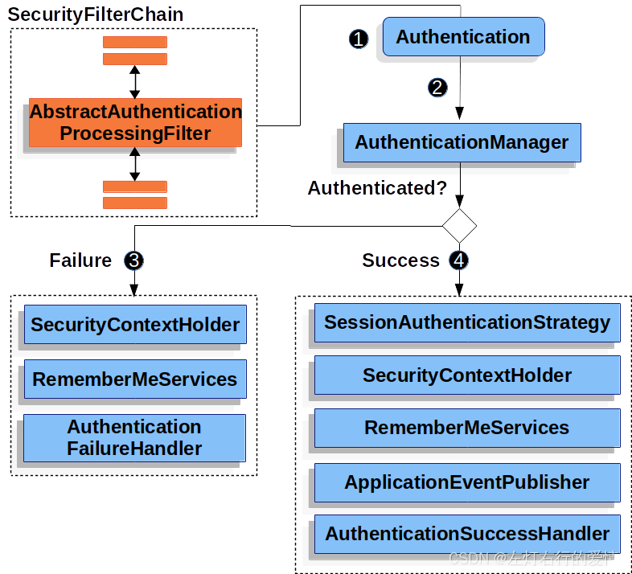

1. 发起认证请求，请求中携带⽤户名、密码，该请求会被  
    `UsernamePasswordAuthenticationFilter` 拦截
2. 在`UsernamePasswordAuthenticationFilter`的`attemptAuthentication`⽅法  
    中将请求中⽤户名和密码，封装为`Authentication`对象，并交给  
    `AuthenticationManager` 进⾏认证
3. 认证成功，将认证信息存储到`SecurityContextHodler`以及调⽤记住我等，并回调`AuthenticationSuccessHandler`处理
4. 认证失败，清除`SecurityContextHodler`以及 记住我中信息，回调`AuthenticationFailureHandler` 处理

#### 易混梳理

不知道在上一篇我们debug时，你是不是有点迷，搞不清`AuthenticationManager`，`ProviderManager`，`AuthenticationProvider` 的关系，  
 `AuthenticationManager` 是认证的核⼼类，但实际上在底层真正认  
 证时还离不开 `ProviderManager` 以及 `AuthenticationProvider` 。下面我们来梳理一下：

* `AuthenticationManager` 是⼀个认证管理器，它定义了 `Spring Security` 过滤  
   器要执⾏认证操作。

```
public interface AuthenticationManager {
	Authentication authenticate(Authentication authentication) throws AuthenticationException;

}


```

* `ProviderManager`是`AuthenticationManager`接⼝的实现类。`Spring Security`  
   认证时默认使⽤就是 `ProviderManager`。

```
//代码太多，只列举较关键的代码
public class ProviderManager implements AuthenticationManager, MessageSourceAware, InitializingBean {

	private AuthenticationEventPublisher eventPublisher = new NullEventPublisher();

	private List<AuthenticationProvider> providers = Collections.emptyList();

	private AuthenticationManager parent;
	
    @Override
	public Authentication authenticate(Authentication authentication) throws AuthenticationException {
		Class<? extends Authentication> toTest = authentication.getClass();
		AuthenticationException lastException = null;
		AuthenticationException parentException = null;
		Authentication result = null;
		Authentication parentResult = null;
		int currentPosition = 0;
		int size = this.providers.size();
		for (AuthenticationProvider provider : getProviders()) {
			if (!provider.supports(toTest)) {
				continue;
			}
			try {
				result = provider.authenticate(authentication);
				if (result != null) {
					copyDetails(authentication, result);
					break;
				}
			}
			catch (AccountStatusException | InternalAuthenticationServiceException ex) {
				prepareException(ex, authentication);
				throw ex;
			}
			catch (AuthenticationException ex) {
				lastException = ex;
			}
		}
		if (result == null && this.parent != null) {
			// Allow the parent to try.
			try {
				parentResult = this.parent.authenticate(authentication);
				result = parentResult;
			}
			catch (ProviderNotFoundException ex) {
//默认为空
			}
			catch (AuthenticationException ex) {
				parentException = ex;
				lastException = ex;
			}
		}
		if (result != null) {
			if (this.eraseCredentialsAfterAuthentication && (result instanceof CredentialsContainer)) 
				((CredentialsContainer) result).eraseCredentials();
			}
			if (parentResult == null) {
				this.eventPublisher.publishAuthenticationSuccess(result);
			}
			return result;
		}
		if (lastException == null) {
			lastException = new ProviderNotFoundException(this.messages.getMessage("ProviderManager.providerNotFound",
					new Object[] { toTest.getName() }, "No AuthenticationProvider found for {0}"));
		}

		if (parentException == null) {
			prepareException(lastException, authentication);
		}
		throw lastException;
	}


```

* `AuthenticationProvider` 就是针对不同的身份类型执⾏的具体的身份认证。

```
public interface AuthenticationProvider {

	Authentication authenticate(Authentication authentication) throws AuthenticationException;

	boolean supports(Class<?> authentication);
}


```

##### AuthenticationManager 与 ProviderManager

先看一下结构图：  
 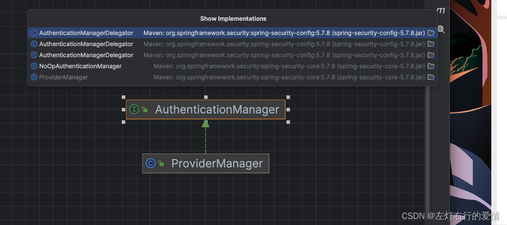  
 为什么列表有五个，但是我只显示了`ProviderManager`，因为其他四个都是内部类（感兴趣可以去看看）。  
 所以我们可以看出来：`ProviderManager` 是`AuthenticationManager`的唯⼀实现，也是 `Spring Security`默认使⽤实现。从这⾥不难看出默认情况下`AuthenticationManager` 就是⼀个ProviderManager。

##### ProviderManager 与 AuthenticationProvider

看一下官网的介绍图：  
 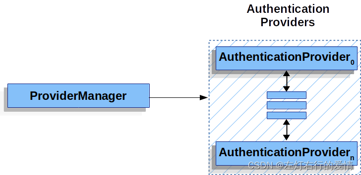  
 在 `Spring Seourity`中，允许系统同时⽀持多种不同的认证⽅式，例如同时⽀持⽤  
 户名/密码认证、`ReremberMe` 认证、⼿机号码动态认证等，⽽不同的认证⽅式对应了不同  
 的 `AuthenticationProvider`，所以⼀个完整的认证流程可能由多个  
 `AuthenticationProvider` 来提供。  
 多个 `AuthenticationProvider` 将组成⼀个列表，这个列表将由  
 `ProviderManager` 代理。换句话说，在`ProviderManager` 中存在⼀个  
 `AuthenticationProvider` 列表，在`Provider Manager` 中遍历列表中的每⼀个  
 `AuthenticationProvider` 去执⾏身份认证，最终得到认证结果。

`ProviderManager` 本身也可以再配置⼀个 `AuthenticationManager` 作为  
 parent，这样当`ProviderManager` 认证失败之后，就可以进⼊到 parent 中再次进⾏认  
 证。

理论上来说，`ProviderManager`的 parent 可以是任意类型的  
 `AuthenticationManager`，但是通常都是由  
 `ProviderManager` 来扮演 parent 的⻆⾊，也就是 `ProviderManager` 是  
 `ProviderManager` 的 parent。

###### 难点：为什么ProviderManager会有一个parent？

ProviderManager 本身也可以有多个，多个ProviderManager 共⽤同⼀个  
 parent。

因为有时，⼀个应⽤程序有受保护资源的逻辑组（例如，所有符合路径模式的⽹络资  
 源，如/api!!\*），每个组可以有⾃⼰的专⽤ AuthenticationManager。通常，每个组  
 都是⼀个ProviderManager，它们共享⼀个⽗级。然后，⽗级是⼀种 全局资源，作为所有  
 提供者的后备资源。

根据上⾯的介绍，我们绘出新的 `AuthenticationManager`、`ProvideManager` 和  
 `AuthentictionProvider`关系：  
 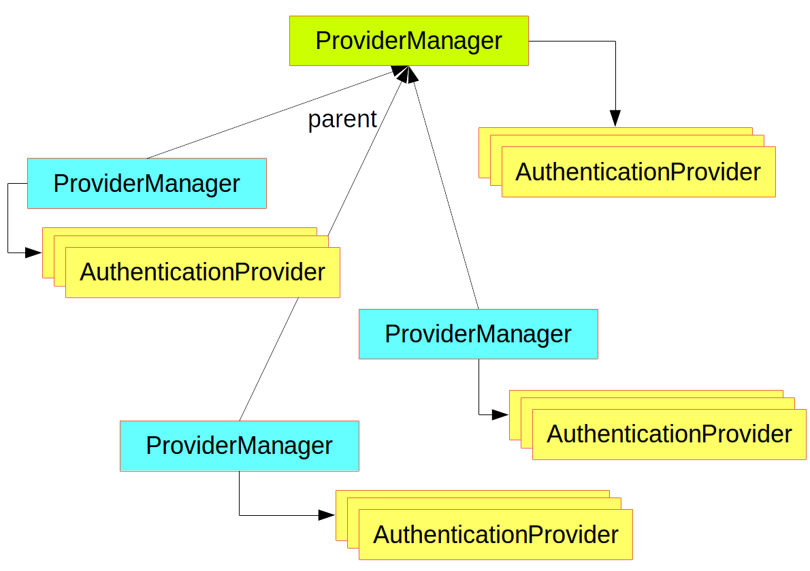

### 数据源的获取

默认情况下`AuthenticationProvider` 是由 `DaoAuthenticationProvider` 类来实现认证的(上篇文章有提到过，不清楚的可以去看一下debug的过程，这个是parent的默认provider），在`DaoAuthenticationProvider` 认证时⼜通过 `UserDetailsService` 完成数据源的  
 校验。  
 下面我们debug看一下这个流程：

1. 首先我们执行到DaoAuthenticationProvider这块内容：  
    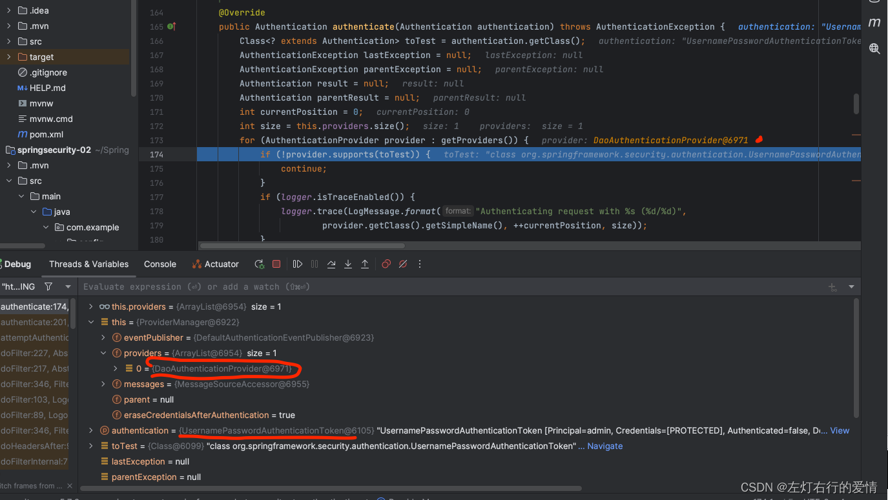
2. 执行到authenticate方法下：  
    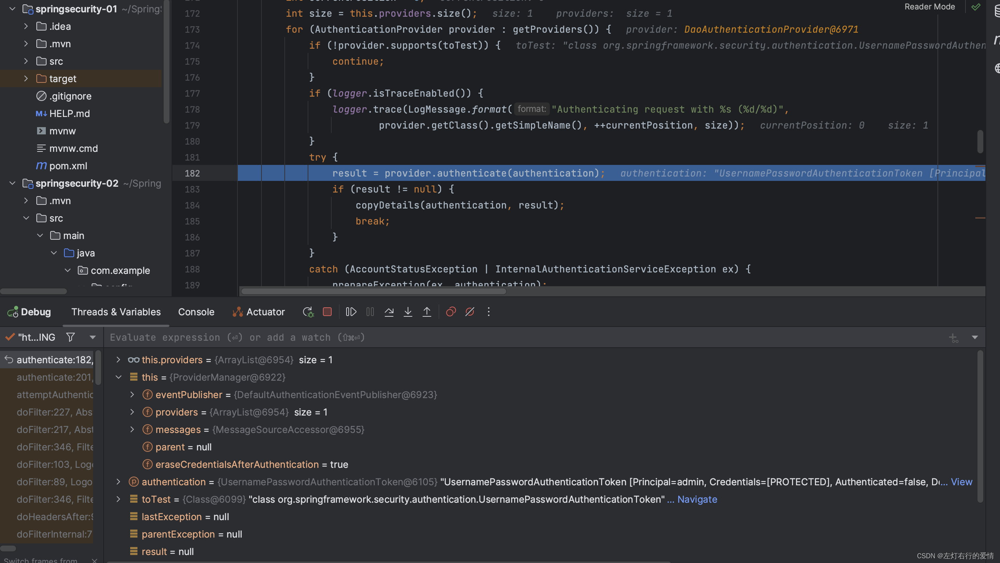
3. 执行`authenticate`方法，跳转到`AbstractUserDetailsAuthenticationProvider`这个方法下的`authenticate`：  
    为什么会跳转到跳转到`AbstractUserDetailsAuthenticationProvider`，因为`DaoAuthenticationProvider`没有覆盖这个方法，所以用的是父类`AbstractUserDetailsAuthenticationProvider`的。  
    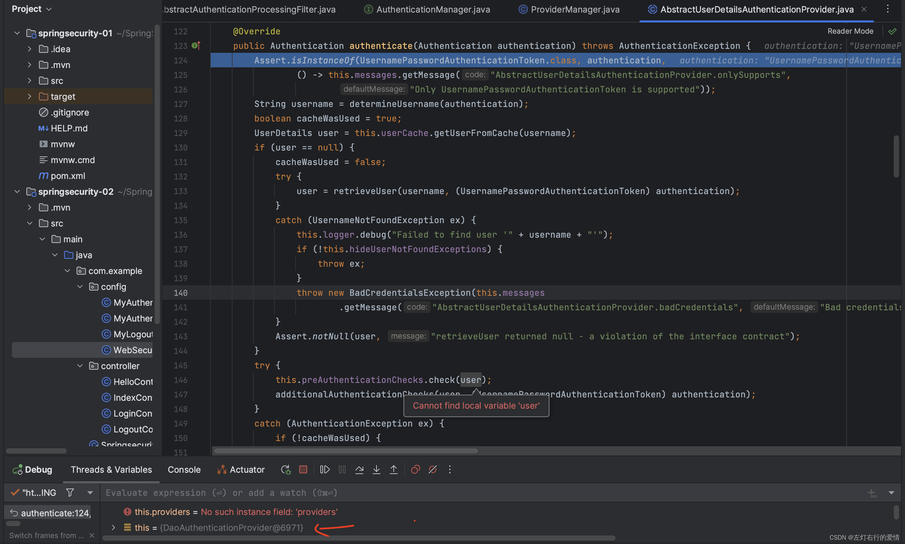
4. 一路执行到执行`retrieveUser`方法并进入到方法里面：  
    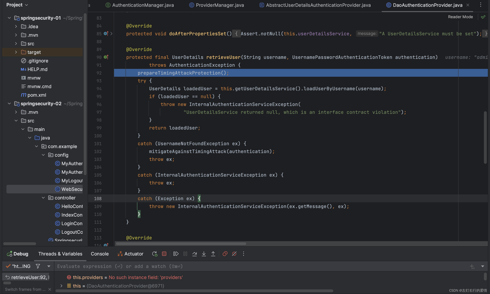
5. 往下执行到`loadUserByUsername`方法并进入，通过调用内存中的数据完成认证：  
    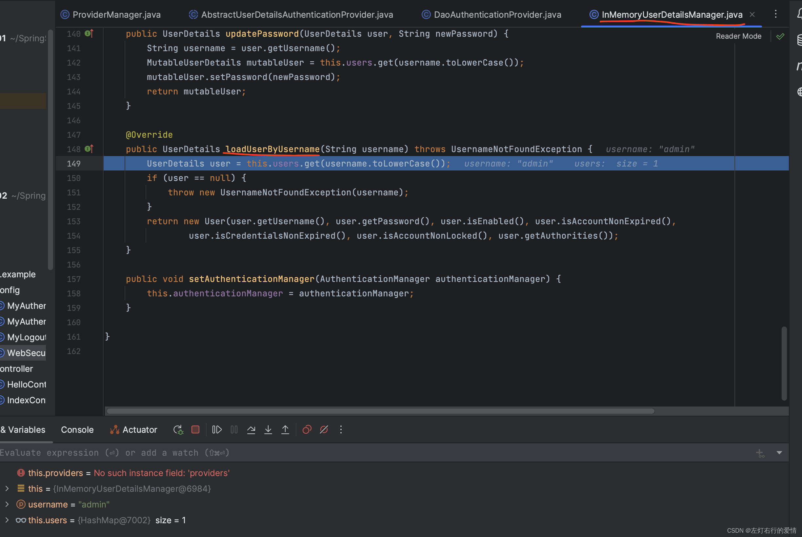  
    下面是一个流程图：  
    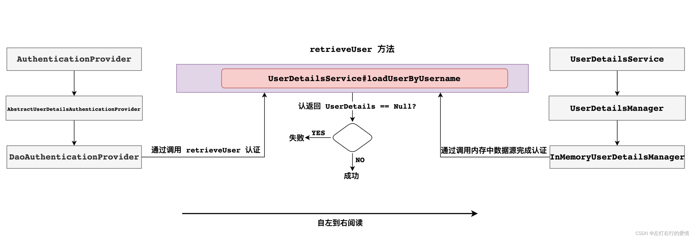  
    总结：  
    `AuthenticationManager` 是认证管理器，在 `Spring Security` 中有全局  
    `AuthenticationManager`，也可以有局部`AuthenticationManager`。  
    全局的`AuthenticationManager`⽤来对全局认证进⾏处理，局部的`AuthenticationManager`⽤来对某些特殊资源认证处理。  
    当然⽆论是全局认证管理器还是局部认证管理器都是由`ProviderManger` 进⾏实现。  
    每⼀个`ProviderManger`中都代理⼀个`AuthenticationProvider`的列表，列表中每⼀个实现代表⼀种身份认证⽅式。认证时底层数据源需要调⽤ `UserDetailService`来实现。

### 配置AuthenticationManager

上面我们了解到`AuthenticationManager`的作用是什么，接下来我们去写一下这个，如果业务工作有需求，可以自定义配置。

首先，我们之前在`application.properties`里面配置的账号信息（名称，密码，权限）注释一下。  
 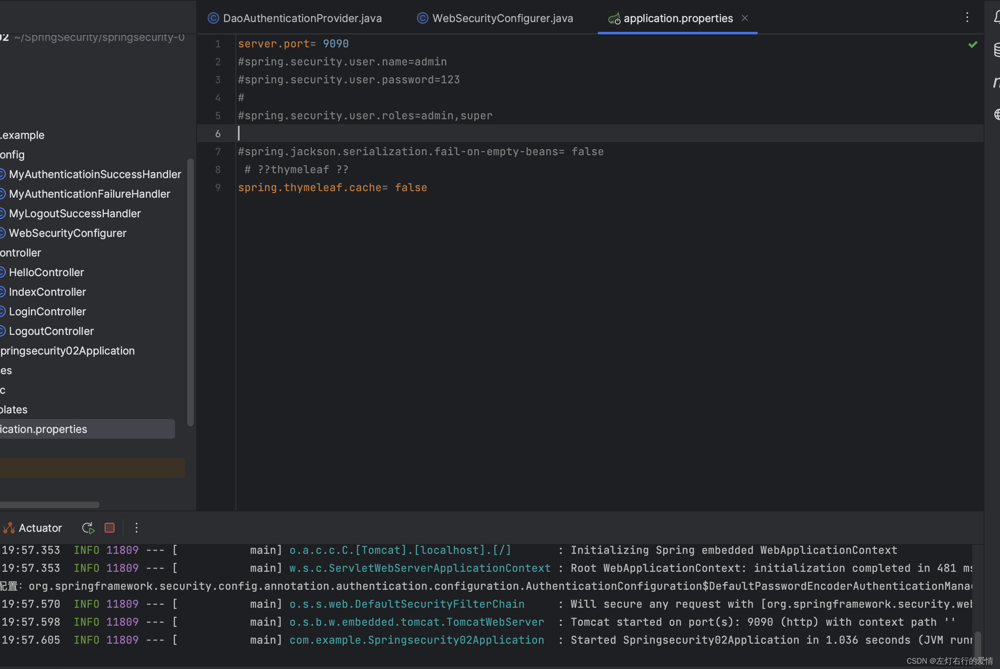

#### 默认的全局 AuthenticationManager

springboot 对 security 进⾏⾃动配置时⾃动在⼯⼚中创建⼀个全局`AuthenticationManager`。  
 代码例子如下(不优化版本)：

```
@Configuration
public class WebSecurityConfigurer extends WebSecurityConfigurerAdapter {

    @Autowired
 public void initialize(AuthenticationManagerBuilder builder) throws Exception {
     System.out.println("SpringBoot默认配置："+ builder);
     InMemoryUserDetailsManager userDetailsService = new InMemoryUserDetailsManager();
     userDetailsService.createUser(User.withUsername("aaa").password("{noop}123").roles("admin").build());
     builder.userDetailsService(userDetailsService);
 }
 //configue方法省略 
 }


```

结果如下：  
 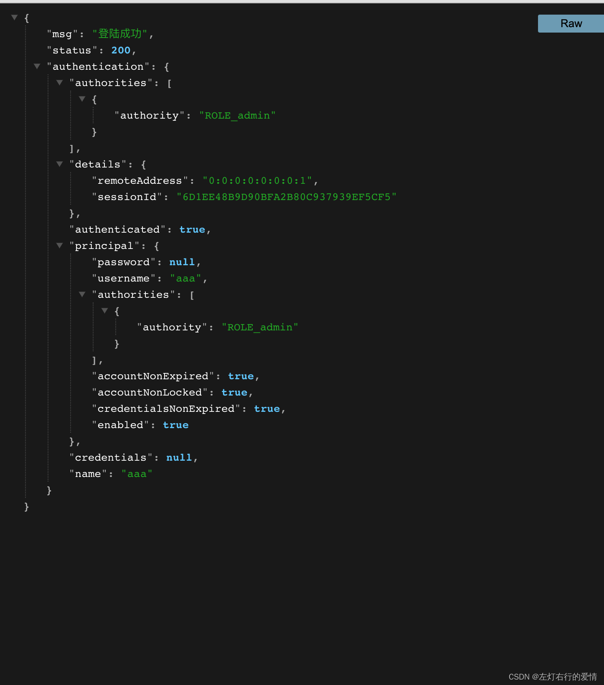  
 第二种(优化后版本)：  
 优化思路：  
 `AuthenticationManagerBuilder`是默认配置对象，它默认找当前项目中是否存在自定义`UserDetailService`实例自动将当前项目`UserDetailService`实例设置为数据源。  
 我们看一下`UserDetailServiceAutoConfigutation`源码：

```
@AutoConfiguration
@ConditionalOnClass(AuthenticationManager.class)
@ConditionalOnBean(ObjectPostProcessor.class)
@ConditionalOnMissingBean(
		value = { AuthenticationManager.class,
		          AuthenticationProvider.class,   
		          UserDetailsService.class,
				  AuthenticationManagerResolver.class },
public class UserDetailsServiceAutoConfiguration {
//...
	@Bean
	@Lazy
	public InMemoryUserDetailsManager inMemoryUserDetailsManager(SecurityProperties properties,
			ObjectProvider<PasswordEncoder> passwordEncoder) {
		SecurityProperties.User user = properties.getUser();
		List<String> roles = user.getRoles();
		return new InMemoryUserDetailsManager(User.withUsername(user.getName())
			.password(getOrDeducePassword(user, passwordEncoder.getIfAvailable()))
			.roles(StringUtils.toStringArray(roles))
			.build());
	}
//...


```

我们在最上面的注解`@ConditionalOnMissingBean`中发现 `UserDetailsService.class`，意思是如果有这个类，那么就不调用下面  
 `inMemoryUserDetailsManager`这个方法，就会直接用我们的给到AuthenticationManagerBuilder。

那么我们可以优化，代码如下：

```
    @Bean
    public UserDetailsService userDetailsService() {
        InMemoryUserDetailsManager userDetailsService = new InMemoryUserDetailsManager();
        userDetailsService.createUser(
                User.withUsername("aaa")
                .password("{noop}123")
                .roles("admin")
                .build());
     return userDetailsService;
    }

//    @Autowired
//    public void initialize(AuthenticationManagerBuilder builder) throws Exception {
//        System.out.println("SpringBoot默认配置：" + builder);
//        InMemoryUserDetailsManager userDetailsService = new InMemoryUserDetailsManager();
//        userDetailsService.createUser(User.withUsername("aaa").password("{noop}123").roles("admin").build());
//        builder.userDetailsService(userDetailsService);
//    }


```

只要我们有自定义的`UserDetailService`，工厂默认的就不生效了。而且SpringBoot会自动将我们创建的Bean—`userDetailsService`赋值给默认创建出来的`AuthenticationManager`（`AuthenticationManager`会自动检测）。

#### 自定义AuthenticationManager

自定义代码(错误版本)如下：

```
    @Bean
    public UserDetailsService userDetailsService() {
        InMemoryUserDetailsManager userDetailsService = new InMemoryUserDetailsManager();
        userDetailsService.createUser(
                User.withUsername("aaa")
                .password("{noop}123")
                .roles("admin")
                .build());
     return userDetailsService;
    }
    
   @Override
    public void configure(AuthenticationManagerBuilder builder){
        System.out.println("自定义Authenticationmanager:"+builder);
    }


```

这样会配置失败，因为自定义时，会覆盖掉工厂默认方法，SpringBoot就不会再自动配置了，所以此时我们的`AuthenticationManagerBuilder`就不会自动去找`userDetailsService`了，需要手动设置。

正确版本：

```
  @Bean
    public UserDetailsService userDetailsService() {
        InMemoryUserDetailsManager userDetailsService = new InMemoryUserDetailsManager();
        userDetailsService.createUser(
                User.withUsername("aaa")
                .password("{noop}123")
                .roles("admin")
                .build());
     return userDetailsService;
    }

    //自定义AuthenticationManager
    @Override
    public void configure(AuthenticationManagerBuilder builder) throws Exception {
        System.out.println("自定义Authenticationmanager:"+builder);
        builder.userDetailsService(userDetailsService());
    }


```

结果如下：  
 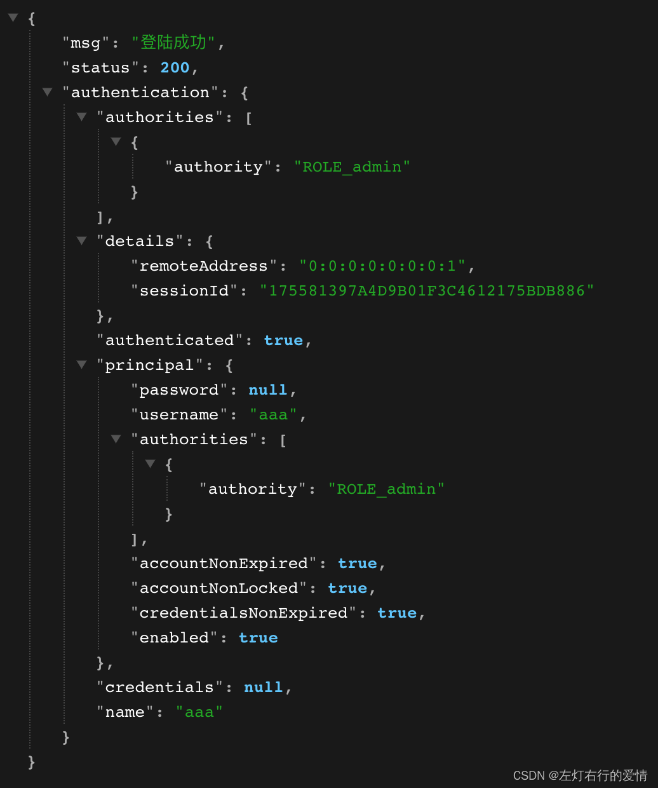  
 但是上面还存在一个问题——自定义的`AuthenticationManager`并没有在工厂中暴露出来，只能这个类中使用。

如果我们想让它在工厂中暴露，可以在任何位置注入，添加覆盖下面的方法即可：

```
    @Override
    @Bean
    public AuthenticationManager authenticationManagerBean() throws Exception {
        return super.authenticationManagerBean();
    }


```

我们进去简单看看，它会调用父类的实现：

```
protected AuthenticationManager authenticationManager() throws Exception {

		if (!this.authenticationManagerInitialized) {
			configure(this.localConfigureAuthenticationBldr);
			////如果是本地的，暴露本地的
			if (this.disableLocalConfigureAuthenticationBldr) {
				this.authenticationManager = this.authenticationConfiguration.getAuthenticationManager();
			}
			
			else {
				this.authenticationManager = this.localConfigureAuthenticationBldr.build();
			}
			this.authenticationManagerInitialized = true;
		}
		//如果不是，暴露是springboot默认的
		return this.authenticationManager;
	}


```

### 库表设计

从上面的内容我们可以看出，真正帮我们做底层用户认证的是`UserDetailsService`，它有一个`loadUserByUsername`方法，传入一个用户名，默认是在内存中。  
 所以我们自己写实现这个方法，并设置给`AuthenticationManager`，实现更换数据源。

我们来看一下`UserDetailsService`的`loadUserByUsername`方法：

```
	UserDetails loadUserByUsername(String username) throws UsernameNotFoundException;


```

它的返回值是`UserDetails`，我们来看看它(注意，这是一个接口：

```
public interface UserDetails extends Serializable {

	Collection<? extends GrantedAuthority> getAuthorities();

	String getPassword();

	String getUsername();

	boolean isAccountNonExpired();

	boolean isAccountNonLocked();

    boolean isCredentialsNonExpired();

	boolean isEnabled();

}


```

它最底层的实现类我们可以返回一个User‘实例：  
 `public class User implements UserDetails, CredentialsContainer` 。

因为我们后面数据源要切换为数据库实现，所以需要一张用户表，那么我们就参考User来设计表，User源码如下：

```
public class User implements UserDetails, CredentialsContainer {

	private static final long serialVersionUID = SpringSecurityCoreVersion.SERIAL_VERSION_UID;

	private static final Log logger = LogFactory.getLog(User.class);

	private String password;

	private final String username;

	private final Set<GrantedAuthority> authorities;

	private final boolean accountNonExpired;

	private final boolean accountNonLocked;

	private final boolean credentialsNonExpired;

	private final boolean enabled;
//...


```

根据上面信息，设计出表结构，如下：

```
// ⽤户表
CREATE TABLE `user`
(
`id` int(11) NOT NULL AUTO_INCREMENT,
`username` varchar(32) DEFAULT NULL,
`password` varchar(255) DEFAULT NULL,
`enabled` tinyint(1) DEFAULT NULL,
`accountNonExpired` tinyint(1) DEFAULT NULL,
`accountNonLocked` tinyint(1) DEFAULT NULL,
`credentialsNonExpired` tinyint(1) DEFAULT NULL,
PRIMARY KEY (`id`) ) ENGINE=InnoDB AUTO_INCREMENT=4 DEFAULT CHARSET=utf8;
// ⻆⾊表
CREATE TABLE `role`
(
`id` int(11) NOT NULL AUTO_INCREMENT,
`name` varchar(32) DEFAULT NULL,
`name_zh` varchar(32) DEFAULT NULL,
PRIMARY KEY (`id`) ) ENGINE=InnoDB AUTO_INCREMENT=4 DEFAULT CHARSET=utf8;
// ⽤户⻆⾊关系表
CREATE TABLE `user_role`
(
`id` int(11) NOT NULL AUTO_INCREMENT,
`uid` int(11) DEFAULT NULL,
`rid` int(11) DEFAULT NULL,
PRIMARY KEY (`id`),
KEY `uid` (`uid`),
KEY `rid` (`rid`) ) ENGINE=InnoDB AUTO_INCREMENT=5 DEFAULT CHARSET=utf8;

------------------------
//插入数据
BEGIN;
INSERT INTO `user`
VALUES (1, 'root', '{noop}123', 1, 1, 1, 1);
INSERT INTO `user`
VALUES (2, 'admin', '{noop}123', 1, 1, 1, 1);
INSERT INTO `user`
VALUES (3, 'blr', '{noop}123', 1, 1, 1, 1);
COMMIT;
// 插⼊⻆⾊数据
BEGIN;
INSERT INTO `role`
VALUES (1, 'ROLE_product', '商品管理员');
INSERT INTO `role`
VALUES (2, 'ROLE_admin', '系统管理员');
INSERT INTO `role`
VALUES (3, 'ROLE_user', '⽤户管理员');
COMMIT;
// 插⼊⽤户⻆⾊数据
BEGIN;
INSERT INTO `user_role`
VALUES (1, 1, 1);
INSERT INTO `user_role`
VALUES (2, 1, 2);
INSERT INTO `user_role`
VALUES (3, 2, 2);
INSERT INTO `user_role`
VALUES (4, 3, 3);
COMMIT;


```

### 代码实现

#### 踩坑点

1. 请确认你的MySQL版本是否为8.0以上，如果为8.0以上，那么mysql引入的依赖注意版本参数，配置 springboot 配置⽂件时，`spring.datasource.driver-class-name`参数为：`com.mysql.cj.jdbc.Driver`。
2. mapper的xml文件中，如果resultTppe爆红，使用全路径即可。

#### 引入依赖

```
  <dependency>
            <groupId>com.alibaba</groupId>
            <artifactId>druid</artifactId>
            <version>1.1.16</version>
        </dependency>
        这里我用的是8.0版本的，请注意！！！
        <dependency>
            <groupId>mysql</groupId>
            <artifactId>mysql-connector-java</artifactId>
            <version>8.0.18</version>
        </dependency>
        <dependency>
        <groupId>org.mybatis.spring.boot</groupId>
            <artifactId>mybatis-spring-boot-starter</artifactId>
            <version>2.2.0</version>
        </dependency>


```

#### 配置 springboot 配置⽂件

```
server.port= 9090

 # 关闭thymeleaf 缓存
spring.thymeleaf.cache= false

# 配置数据源
spring.datasource.type= com.alibaba.druid.pool.DruidDataSource
spring.datasource.driver-class-name= com.mysql.cj.jdbc.Driver
spring.datasource.url= jdbc:mysql://localhost:3306/security?characterEncoding=UTF-8&useSSL=false&&serverTimezone=CST
spring.datasource.username= 输入你的用户名
spring.datasource.password= 输入你的密码

# Mybatis配置
# 注意mapper目录必须用"/"
mybatis.mapper-locations= classpath:com/wang/mapper/*.xml
mybatis.type-aliases-package=com.example.eneity

# 日志处理
logging.level.com.example = debug


```

#### 创建entity

##### 创建User对象

```
import org.springframework.security.core.GrantedAuthority;
import org.springframework.security.core.authority.SimpleGrantedAuthority;
import org.springframework.security.core.userdetails.UserDetails;

import java.util.*;


public class User implements UserDetails {
        private Integer id;
        private String username;
        private String password;
        private Boolean enabled;
        private Boolean accountNonExpired;
        private Boolean accountNonLocked;
        private Boolean credentialsNonExpired;
        private List<Role> roles = new ArrayList();
        @Override
        public Collection<? extends GrantedAuthority> getAuthorities() {

           Set<GrantedAuthority> authorities = new HashSet();
            roles.forEach(role->{
                SimpleGrantedAuthority simpleGrantedAuthority = new SimpleGrantedAuthority(role.getName());
                authorities.add(simpleGrantedAuthority);
            });
            return authorities;
        }
        @Override
        public String getPassword() {
            return password;
        }
        @Override
        public String getUsername() {
            return username;
        }
        @Override
        public boolean isAccountNonExpired() {
            return accountNonExpired;
        }
        @Override
        public boolean isAccountNonLocked() {
            return accountNonLocked;
        }
        @Override
        public boolean isCredentialsNonExpired() {
            return credentialsNonExpired;
        }
        @Override
        public boolean isEnabled() {
            return enabled;
        }

    public void setRoles(List<Role> roles) {
        this.roles = roles;
    }

    public Integer getId() {
        return id;
    }

    public void setUsername(String username) {
        this.username = username;
    }

    public void setPassword(String password) {
        this.password = password;
    }

    public Boolean getEnabled() {
        return enabled;
    }

    public void setEnabled(Boolean enabled) {
        this.enabled = enabled;
    }

    public Boolean getAccountNonExpired() {
        return accountNonExpired;
    }

    public void setAccountNonExpired(Boolean accountNonExpired) {
        this.accountNonExpired = accountNonExpired;
    }

    public Boolean getAccountNonLocked() {
        return accountNonLocked;
    }

    public void setAccountNonLocked(Boolean accountNonLocked) {
        this.accountNonLocked = accountNonLocked;
    }

    public Boolean getCredentialsNonExpired() {
        return credentialsNonExpired;
    }

    public void setCredentialsNonExpired(Boolean credentialsNonExpired) {
        this.credentialsNonExpired = credentialsNonExpired;
    }

    public List<Role> getRoles() {
        return roles;
    }
}


```

##### 创建Role对象

```
public class Role {
    private Integer id;
    private String name;
    private String nameZh;


    public Integer getId() {
        return id;
    }

    public void setId(Integer id) {
        this.id = id;
    }

    public String getName() {
        return name;
    }

    public void setName(String name) {
        this.name = name;
    }

    public String getNameZh() {
        return nameZh;
    }

    public void setNameZh(String nameZh) {
        this.nameZh = nameZh;
    }
}


```

##### 创建UserDao接口

```
//注意这里引用的是我们自定义的类型
import com.example.entity.Role;
import com.example.entity.User;
import org.apache.ibatis.annotations.Mapper;
import java.util.List;
@Mapper
public interface UserDao {

    //提供根据用户名返回方法
    User loadUserByUsername(String username);
    
    //提供根据用户id查询用户角色信息方法
    List<Role> getRoleByUid(Integer id);
}


```

##### 创建UserMapper实现

```
<?xml version="1.0" encoding="UTF-8"?>
<!DOCTYPE mapper
        PUBLIC "-//mybatis.org//DTD Mapper 3.0//EN"
        "http://mybatis.org/dtd/mybatis-3-mapper.dtd">
<mapper namespace="com.example.dao.UserDao">

<!--        更具用户名查询用户方法-->
        <select id="loadUserByUsername" resultType="com.example.entity.User">
                select id,
                       username,
                       password,
                       enabled,
                       accountNonExpired,
                       accountNonLocked,
                       credentialsNonExpired
                from user
                where username = #{username}
        </select>
<!--        查询指定⾏数据-->
        <select id="getRoleByUid" resultType="com.example.entity.Role">
        select r.id,
        r.name,
        r.name_zh nameZh
        from role r,
        user_role ur
        where r.id = ur.rid
        and ur.uid = #{uid}
        </select>
</mapper>


```

##### 创建 UserDetailService 实例

```
import com.example.dao.UserDao;
import com.example.entity.Role;
import com.example.entity.User;
import org.springframework.beans.factory.annotation.Autowired;
import org.springframework.security.core.userdetails.UserDetails;
import org.springframework.security.core.userdetails.UserDetailsService;
import org.springframework.security.core.userdetails.UsernameNotFoundException;
import org.springframework.stereotype.Component;
import org.springframework.util.ObjectUtils;

import java.util.List;

@Component
public class MyUserDetailService implements UserDetailsService {

    private final UserDao userDao;

    @Autowired
    public MyUserDetailService(UserDao userDao){
        this.userDao = userDao;
    }

    @Override
    public UserDetails loadUserByUsername(String username) throws UsernameNotFoundException {
        //1. 查询用户
       User user = userDao.loadUserByUsername(username);
       if (ObjectUtils.isEmpty(user)) {
           throw new UsernameNotFoundException("用户名不正确");
       }
       //2. 查询权限信息
        List<Role> roles = userDao.getRoleByUid(user.getId());
        user.setRoles(roles);
        return user;
    }
}


```

##### 配置 authenticationManager 使⽤⾃定义UserDetailService

```
   private final MyUserDetailService myUserDetailService;


//    @Bean
//    public UserDetailsService userDetailsService() {
//        InMemoryUserDetailsManager userDetailsService = new InMemoryUserDetailsManager();
//        userDetailsService.createUser(
//                User.withUsername("aaa")
//                .password("{noop}123")
//                .roles("admin")
//                .build());
//     return userDetailsService;
//    }

    @Autowired
    public WebSecurityConfigurer(MyUserDetailService myUserDetailService){
        this.myUserDetailService = myUserDetailService;
    }

    //自定义AuthenticationManager
    @Override
    public void configure(AuthenticationManagerBuilder builder) throws Exception {
        System.out.println("自定义Authenticationmanager:"+builder);
        builder.userDetailsService(myUserDetailService);
    }


```

##### 最后启动测试

1. 请确保你的数据库版本
2. 确保你的数据在数据库里面  
    最后结果：  
    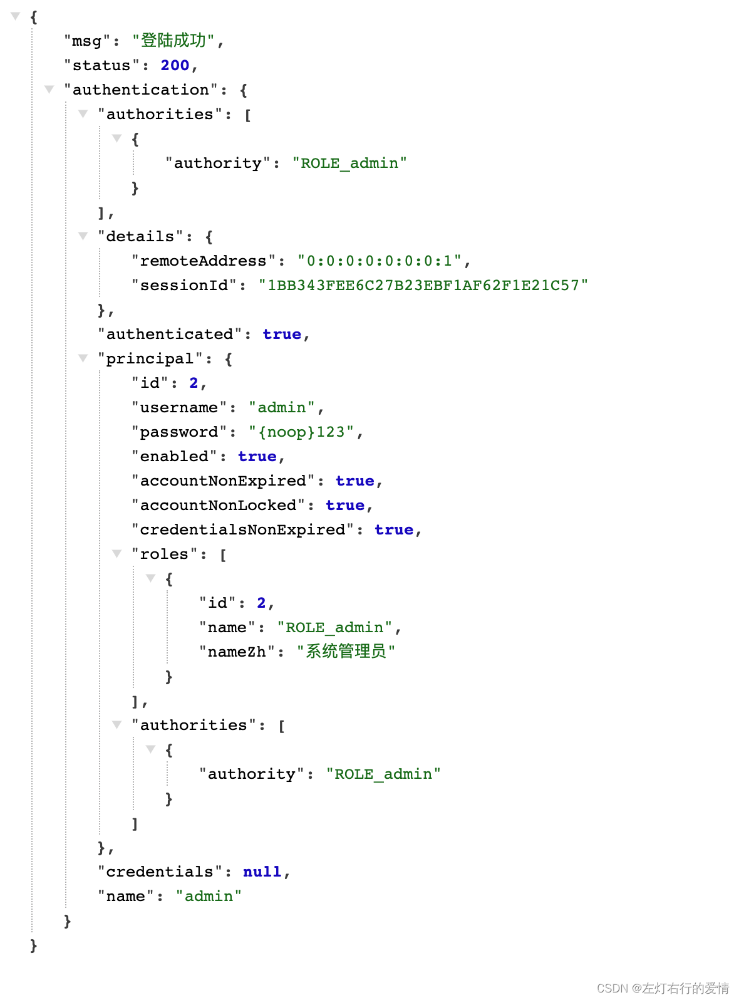
