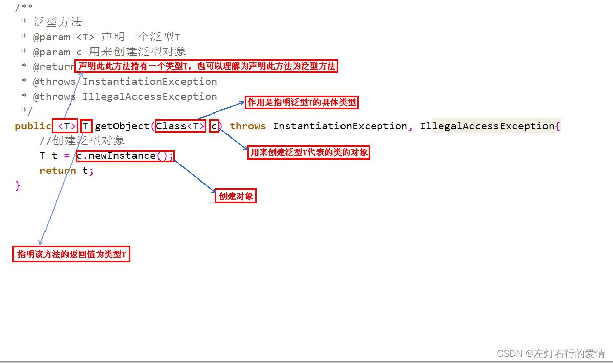
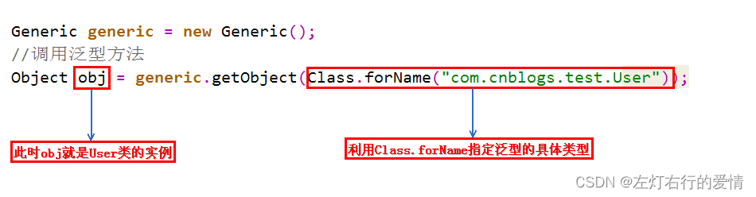
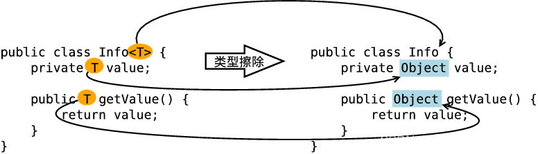
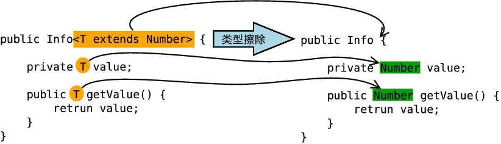
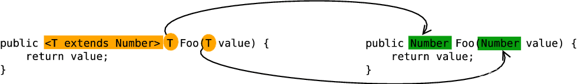
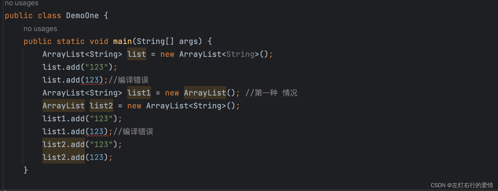
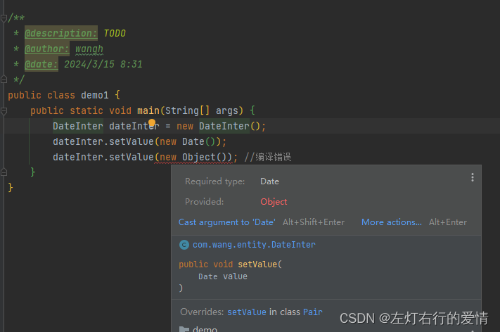

> 原文：[CSDN](https://blog.csdn.net/qq_45852626/article/details/136664018)（历史文章导入，当前状态为草稿）

### 基本概念

Java泛型是JDK5引入的一个新特性,它提供编译时类型安全检测机制.  
 该机制可以在编译时检测到非法的类型.  
 泛型的本质是参数化类型(所操作的数据类型被指定为一个参数)  
 换句话说:由原来具体的类型,转换为类似方法中的变量参数(形参

### 为什么我们需要泛型

我们举个例子来看一下:

```
List arrayList = new ArrayList();
     arrayList.add("string");
     arrayList.add(1);

     for(int i = 0; i< arrayList.size();i++){
          String item = (String)arrayList.get(i);
          System.out.println("泛型测试"+"item = " + item);
     }


```

这段代码在编译时没问题,但一运行就会报错,报错日志如下:

```
java.lang.Integer cannot be cast to java.lang.String


```

在JDK1.5之前,没有范型的情况下,通过对类型Object的引用来实现参数的“任意化”,“任意化”带来的缺点是要做显式的强制类型的转换,这需要开发者对实际参数类型可以预知才能进行.  
 对于强转类型的转换作物,编译器在编译期可能不会提示错误,在运行时才出现异常,所以这是一个安全隐患.

1. 提高代码的利用率  
    范型使得数据的类别可以像参数一样由外部传递进来.它提供了一种扩展能力.更符合面向抽象开发的软件编程宗旨
2. 把一些运行时错误提前到了编译时,提高安全性.  
    只有相匹配的数据才可以正常赋值,否则编译起不通过,它属于类型安全检测机制,提高了软件的安全性,防止出现低级失误

我们再来一个例子来体验一下泛型的好处:

```
private static int add(int a, int b) {
    System.out.println(a + "+" + b + "=" + (a + b));
    return a + b;
}

private static float add(float a, float b) {
    System.out.println(a + "+" + b + "=" + (a + b));
    return a + b;
}

private static double add(double a, double b) {
    System.out.println(a + "+" + b + "=" + (a + b));
    return a + b;
}


```

如果没有泛型的话,要实现这种不同类型的加法,每种类型都需要重载一个add方法;  
 通过泛型,我们可以复用为一个方法:

```
private static <T extends Number> double add(T a, T b) {
    System.out.println(a + "+" + b + "=" + (a.doubleValue() + b.doubleValue()));
    return a.doubleValue() + b.doubleValue();
}


```

### 泛型类型

泛型有三种存在方式:

1. 泛型类
2. 泛型接口
3. 泛型方法
4. 泛型数组

#### 泛型类

泛型用于类的定义中,通过泛型可以完成对一组类向外提供相同的接口

我们先从一个简单泛型类看起

##### 简单泛型类

```
class Point<T>{         // 此处可以随便写标识符号，T是type的简称  
    private T var ;     // var的类型由T指定，即：由外部指定  
    public T getVar(){  // 返回值的类型由外部决定  
        return var ;  
    }  
    public void setVar(T var){  // 设置的类型也由外部决定  
        this.var = var ;  
    }  
}  
public class GenericsDemo06{  
    public static void main(String args[]){  
        Point<String> p = new Point<String>() ;     // 里面的var类型为String类型  
        p.setVar("it") ;                            // 设置字符串  
        System.out.println(p.getVar().length()) ;   // 取得字符串的长度  
    }  
}


```

##### 多元泛型类

```
class Notepad<K,V>{       // 此处指定了两个泛型类型  
    private K key ;     // 此变量的类型由外部决定  
    private V value ;   // 此变量的类型由外部决定  
    public K getKey(){  
        return this.key ;  
    }  
    public V getValue(){  
        return this.value ;  
    }  
    public void setKey(K key){  
        this.key = key ;  
    }  
    public void setValue(V value){  
        this.value = value ;  
    }  
} 
public class GenericsDemo09{  
    public static void main(String args[]){  
        Notepad<String,Integer> t = null ;        // 定义两个泛型类型的对象  
        t = new Notepad<String,Integer>() ;       // 里面的key为String，value为Integer  
        t.setKey("汤姆") ;        // 设置第一个内容  
        t.setValue(20) ;            // 设置第二个内容  
        System.out.print("姓名；" + t.getKey()) ;      // 取得信息  
        System.out.print("，年龄；" + t.getValue()) ;       // 取得信息  
  
    }  
}


```

#### 泛型接口

与泛型类的定义及使用基本相同,允许在接口定义中使用类型参数.  
 实现该接口的类可以为这些类型参数提供具体的类型.  
 增加了代码的灵活性和重用性  
 常被用在各种类的生产器中.  
 举个例子来说:

```
interface Info<T>{        // 在接口上定义泛型  
    public T getVar() ; // 定义抽象方法，抽象方法的返回值就是泛型类型  
}  
class InfoImpl<T> implements Info<T>{   // 定义泛型接口的子类  
    private T var ;             // 定义属性  
    public InfoImpl(T var){     // 通过构造方法设置属性内容  
        this.setVar(var) ;    
    }  
    public void setVar(T var){  
        this.var = var ;  
    }  
    public T getVar(){  
        return this.var ;  
    }  
} 
public class GenericsDemo24{  
    public static void main(String arsg[]){  
        Info<String> i = null;        // 声明接口对象  
        i = new InfoImpl<String>("汤姆") ;  // 通过子类实例化对象  
        System.out.println("内容：" + i.getVar()) ;  
    }  
}  


```

#### 泛型方法

##### 为什么要使用泛型方法呢?

因为泛型类需要在实例化的时候就指明类型,一旦实例化完成，这个对象的泛型类型就固定下来了。如果你想使用另一种类型的泛型对象，你需要重新实例化这个类，并指定新的类型。不太灵活;  
 而泛型方法允许在调用方法的时候才指定泛型的具体类型。这意味着可以在不重新实例化类的情况下，多次调用同一个泛型方法，并每次指定不同的类型。  
 举个例子来说:

* 泛型类

```
public class Box<T> {  
    private T t;  
      
    public void set(T t) {  
        this.t = t;  
    }  
      
    public T get() {  
        return t;  
    }  
}  
  
// 使用时需要指定具体类型，并实例化  
Box<Integer> integerBox = new Box<>();  
integerBox.set(10);  
Integer value1 = integerBox.get(); // 获取时类型已经确定为Integer  
  
Box<String> stringBox = new Box<>(); // 需要重新实例化来存储字符串类型  
stringBox.set("Hello");  
String value2 = stringBox.get(); // 获取时类型已经确定为String


```

* 泛型方法

```
public class Utility {  
    // 泛型方法，可以在调用时指定类型  
    public static <T> T echo(T input) {  
        return input;  
    }  
}  
  
// 使用时直接调用方法，并指定类型（类型推断）  
Integer intValue = Utility.echo(10); // 这里T被推断为Integer类型  
String strValue = Utility.<String>echo("Hello"); // 这里显式指定了T为String类型，但实际上可以省略，因为编译器可以推断出来  


```

##### 使用方法

在调用方法的时候指明泛型的具体类型.泛型方法的定义比泛型类和接口要复杂.  
 泛型类是指实例化类的时候指明泛型的具体类型;  
 泛型方法是在调用方法的时候指明泛型的具体类型.  
 只有声明了 的方法才是泛型方法,在泛型类中使用了泛型的成员方法并不是泛型方法.  
 举个例子来说明基本语法:

```
/**
 * 泛型方法介绍
 * @param url
 * @param result 
 * @param <T> 只有声明了<T>的方法才是泛型方法，泛型类中的使用了泛型的成员方法并不是泛型方法
 *           与泛型类的定义一样，此处T可以随便写为任意标识，常见的如T、E、K、V等形式的参数常用于表示泛型。
 * @return T 返回值为T类型
 */
public static <T> T doGetRequst(String url,Result<T> result){
}


```

或者拿一张网图来解释:  
   
 调用泛型方法语法格式  
   
 `Class<T>`的作用是指明泛型的具体类型,而`Class<T>`类型的变量c,可以用来创建泛型类的对象.

为什么要用变量c来创建对象呢?  
 因为既然是泛型方法,就代表我们不知道具体的类型是什么,也不知道构造方法是什么,因此没有办法去new一个对象  
 但是我们可以利用变量c的`newInstance`方法区创建对象,也就是利用反射创建对象.

看一个简单的实例帮助理解:

```
public class GenericMethodExample {  
  
    public static <T> void printArray(T[] array) {  
        for (T element : array) {  
            System.out.print(element + " ");  
        }  
        System.out.println();  
    }  
  
    public static void main(String[] args) {  
        Integer[] intArray = {1, 2, 3, 4, 5};  
        String[] strArray = {"Hello", "World"};  
  
        // 调用泛型方法并传入整型数组  
        printArray(intArray);  
  
        // 调用泛型方法并传入字符串数组  
        printArray(strArray);  
    }  
}


```

#### 泛型的上下限

泛型上下限是用来约束泛型类型参数的范围/

##### 上限

泛型的上限使用`extends`来定义,表示参数化的类型必须是制定类型或其子类.  
 eg: `<T extends Number>`表示T可以是`Number`类或其任何子类(如`Integer,Double`等)  
 所以它也称为上界通配符,它定义了泛型类型的上界,在泛型方法或泛型类中使用上限时,可以确保类型安全,并且只允许在泛型容器中添加符合约束条件的对象.  
 **上限例子**

```
class Info<T extends Number>{    // 此处泛型只能是数字类型
    private T var ;        // 定义泛型变量
    public void setVar(T var){
        this.var = var ;
    }
    public T getVar(){
        return this.var ;
    }
    public String toString(){    // 直接打印
        return this.var.toString() ;
    }
}
public class demo1{
    public static void main(String args[]){
        Info<Integer> i1 = new Info<Integer>() ;        // 声明Integer的泛型对象
    }
}


```

##### 下限

泛型的下限使用`super`关键字来定义,表示参数化的类型必须是制定类型或其超类(父类).  
 泛型系统并不支持下界通配符(`? super T`) 作为类型参数来声明泛型类或接口.  
 但是在使用泛型方法的时候,可以使用下界通配符(`? super T`)来放宽对类型的约束,允许方法接受更广泛的类型参数.  
 实际上在泛型方法的参数中使用下界通配符的情况相对较少见，因为Java的类型推断通常足够智能，可以推断出正确的类型参数而无需显式指定下界。

我们在使用通配符(如 `? , ? extends T , ? super T`)来表示未知类型或类型范围,但是要遵循一定的规则和最佳实践,确保代码的类型安全和可读性.  
 例如,在**PECS原则**(`Product Extends, Consumer Super`)中建议,当泛型容器用于提供(`produce`) 元素时,应使用上限通配符;  
 当用于消费(`consume`)元素时,应使用无界通配符或下限通配符（尽管Java不支持直接作为类型参数约束的下限通配符）  
 这样可以确保类型兼容性并避免不必要的类型转换错误。  
 **下限例子**

```
class Info<T>{
    private T var ;        // 定义泛型变量
    public void setVar(T var){
        this.var = var ;
    }
    public T getVar(){
        return this.var ;
    }
    public String toString(){    // 直接打印
        return this.var.toString() ;
    }
}
public class GenericsDemo21{
    public static void main(String args[]){
        Info<String> i1 = new Info<String>() ;        // 声明String的泛型对象
        Info<Object> i2 = new Info<Object>() ;        // 声明Object的泛型对象
        i1.setVar("hello") ;
        i2.setVar(new Object()) ;
        fun(i1) ;
        fun(i2) ;
    }
    public static void fun(Info<? super String> temp){    // 只能接收String或Object类型的泛型，String类的父类只有Object类
        System.out.print(temp + ", ") ;
    }
}


```

##### 加点难度的例子

###### 例子一

```
class A{}
class B extends A {}

// 如下两个方法不会报错
public static void funA(A a) {
    // ...          
}
public static void funB(B b) {
    funA(b);
    // ...             
}

// 如下funD方法会报错
public static void funC(List<A> listA) {
    // ...          
}
public static void funD(List<B> listB) {
    funC(listB);          
}


```

为什么`funD`方法会报错呢?  
 如果你不了解泛型的上下限,这个问题很难作答.  
 即使B是A的子类型,List**也并不是List的子类型.  
 所以我们不能直接将List**传递给需要List****的方法,这就是funD方法报错的原因.****

那么如果我们想实现上面的情况,希望`funD`可以调用`funC`

```
public static void funC(List<? extends A> listA) {  
    // ...            
}


```

因为List**是List<? extends A>的子类型(因为B是A的子类型).**

###### 例子二

```
private  <E extends Comparable<? super E>> E max(List<? extends E> e1) {
    if (e1 == null){
        return null;
    }
    //迭代器返回的元素属于 E 的某个子类型
    Iterator<? extends E> iterator = e1.iterator();
    E result = iterator.next();
    while (iterator.hasNext()){
        E next = iterator.next();
        if (next.compareTo(result) > 0){
            result = next;
        }
    }
    return result;
}


```

上述代码中类型参数是E的范围是`<E extends Comparable<? super E>>`  
 这个我们来分布解释一下:

* <E extends Comparable<? super E>>  
   这是一个泛型方法,它定义了一个类型参数E.  
   这个类型参数E有一个约束,即它必须扩展(或实现)`Comparable`接口.而`Comparable`的类型参数是`? super E`,意味着它可以接受E或E的任意超类作为类型参数.  
   这是为了确保`compareTo`方法可以接受当前对象或者其父类型的对象作为参数
* List<? extends E> e1  
   接受一个列表作为参数,这个列表包含的元素是E或E的任意子类型,表示要操作的数据是E的子类的列表,指定上限,这样容器才够大.

###### 例子三

```
public class Client {
    //工资低于2500元的上班族并且站立的乘客车票打8折
    public static <T extends Staff & Passenger> void discount(T t){
        if(t.getSalary()<2500 && t.isStanding()){
            System.out.println("恭喜你！您的车票打八折！");
        }
    }
    public static void main(String[] args) {
        discount(new Me());
    }
}


```

代码中使用的泛型`<T extends Staff & Passenger>` 是一个有限定的类型参数.  
 这里的泛型声明表示T必须是一个类型,该类型同事是`Staff`接口和`Passenger`接口的子类型(或者是直接实现了这两个接口的类)

#### 泛型数组

可以存储多种不同类型的数组的数组,而不仅仅是一种特定类型的数据,在Java中，泛型通常用于集合类，如ArrayList、List、Map和Set等，以提供类型安全和减少类型转换的需要。  
 泛型数组在Java中并不直接存在,而是通过对泛型集合类的使用来实现类似的功能.  
 举一些例子来看

```
List<String>[] list11 = new ArrayList<String>[10]; //编译错误，非法创建 
List<String>[] list12 = new ArrayList<?>[10]; //编译错误，需要强转类型 
List<String>[] list13 = (List<String>[]) new ArrayList<?>[10]; //OK，但是会有警告 
List<?>[] list14 = new ArrayList<String>[10]; //编译错误，非法创建 
List<?>[] list15 = new ArrayList<?>[10]; //OK 
List<String>[] list6 = new ArrayList[10]; //OK，但是会有警告


```

至于说为什么有些会编译错误,有些会有警告,看完后面深入理解泛型的内容,相信你肯定就明白了

举两个使用场景的例子

```
public class GenericsDemo30{  
    public static void main(String args[]){  
        Integer i[] = fun1(1,2,3,4,5,6) ;   // 返回泛型数组  
        fun2(i) ;  
    }  
    public static <T> T[] fun1(T...arg){  // 接收可变参数  
        return arg ;            // 返回泛型数组  
    }  
    public static <T> void fun2(T param[]){   // 输出  
        System.out.print("接收泛型数组：") ;  
        for(T t:param){  
            System.out.print(t + "、") ;  
        }  
    }  
}


```

```
public ArrayWithTypeToken(Class<T> type, int size) {
    array = (T[]) Array.newInstance(type, size);
}


```

#### 深入理解泛型

泛型这个特性是从JDK1.5才开始加入的,所以为了兼容之前的版本,Java的范型实现是采取的“伪泛型”  
 即虽然Java语法上支持泛型,但是编辑阶段会进行所谓的“类型擦除(Type Erasure)”,将所有的泛型表示(尖括号中的内容)都替换成具体的类型(其对应的原生态类型),所以看起来就像是没有泛型一样.

##### 什么是泛型擦除后保留的原始类型

原始类型: 擦除去了泛型信息,最后在字节码中的类型变量的真正类型,无论何时定义一个泛型,相应的原始类型都会被自动提供,类型变量擦除,并使用其限定类型(无限定的变量用Object)替换  
 举个例子  
 Pair的范型情况:

```
class Pair<T> {  
    private T value;  
    public T getValue() {  
        return value;  
    }  
    public void setValue(T  value) {  
        this.value = value;  
    }  
} 


```

Pair的原始类型为

```
class Pair {  
    private Object value;  
    public Object getValue() {  
        return value;  
    }  
    public void setValue(Object  value) {  
        this.value = value;  
    }  
}


```

因为Pair中,T是一个无限定的类型变量,所以用Object替换,其结果就是一个普通的类,如同泛型加入Java之前的已经实现的样子.  
 在程序中可以包含不同类型的Pair，如Pair或Pair，但是擦除类型后他们的就成为原始的Pair类型了，原始类型都是Object。

那如果类型变量有限定,那么原始类型就用第一个边界的类型变量类替换  
 如果Pair这样声明的话:  
 `public class Pair<T extends Comparable> {}`  
 那么原始类型就是`Comparable`

我们要分清原始类型喝泛型变量的类型

##### 泛型类型擦除原则

* 消除类型参数声明,即删除<>及其包围的部分
* 根据类型参数的上下界推断并替换所有的类型参数为原生态类型:

1. 类型参数是无限制通配符或没有上下界限定则替换为Object
2. 存在上下界限则根据子类替换原则取类型参数的最左边限定类型(即父类)

* 为了保证类型安全,必要时插入强制类型转换代码
* 自动产生“桥接方法”以保证擦除类型后的代码仍然具有泛型的“多态性”

##### 如何进行擦除的?

* 擦除类定义中的类型参数 - 无限制类型擦除  
   当类定义中的类型参数没有任何限制的时候,在类型擦除中直接被替换为Object,即形如 和 <?>的类型参数都被替换为Object.  
   
* 擦除类定义中的类型参数 - 有限制类型擦除  
   当类定义中的类型参数存在限制(上下界)时,在类型擦除中替换为类型参数的上界和下界,比如`<T extends Number>`和`<? extends Number>`的类型参数被替换为`Number`，`<? super Number>` 被替换为`Object`.  
   
* 擦除方法定义中的类型参数  
   擦除方法定义中的类型参数原则和擦除类定义中的类型参数是一样的,这里仅以擦除方法定义中的有限制类型参数为例.  
   

##### 怎么证明存在类型擦除呢

如果存在泛型类型擦除,那么我们可以从两个方面来证明

* 如果存在类型擦除,则原始类型肯定相等

```
public class Test {

    public static void main(String[] args) {

        ArrayList<String> list1 = new ArrayList<String>();
        list1.add("abc");

        ArrayList<Integer> list2 = new ArrayList<Integer>();
        list2.add(123);

        System.out.println(list1.getClass() == list2.getClass()); // true
    }
}


```

定义了两个不同泛型类型的ArrayList数组,我们通过比对类的信息,最后发现结果都为true,说明泛型类型String喝Integer都被擦除掉了,只剩下原始类型.

* 通过反射添加其他类型元素

```
public class Test {

    public static void main(String[] args) throws Exception {

        ArrayList<Integer> list = new ArrayList<Integer>();

        list.add(1);  //这样调用 add 方法只能存储整形，因为泛型类型的实例为 Integer

        list.getClass().getMethod("add", Object.class).invoke(list, "asd");

        for (int i = 0; i < list.size(); i++) {
            System.out.println(list.get(i));
        }
    }

}


```

我们定义了一个ArrayList泛型类型实例化为Integer对象,如果直接调用add方法,是只能存储整数数据  
 但我们利用反射调用add,却可以存储字符串,说明了Interger泛型实例中编译之后被擦除掉了,只保留了原始类型.

##### 如何理解泛型的编译期检查

既然说类型变量在编译的时候擦除掉,那为什么像ArrayList创建的对象中添加整数会报错呢?  
 不是说泛型变量String在编译的时候会变为Object类型嘛?  
 既然类型擦除了,那为什么不能存别动类型,到底是如何保证我们只能使用泛型变量限定类型的呢?

答: Java编译器是通过先检查代码中泛型的类型,然后再进行类型擦除,再进行编译

举个例子:

```
public static  void main(String[] args) {  
    ArrayList<String> list = new ArrayList<String>();  
    list.add("123");  
    list.add(123);//编译错误  
}


```

上面代码中,用add添加一个整型会直接报错,说明这就是在编译之前进行检查(因为如果是编译之后检查,类型擦除后,原始类型为Object,时应该允许任意引用类型添加的).  
 那么这个类型检查时针对谁的呢?  
 我们再举个例子来看,先看一下参数话类型和原始类型的兼容.  
 以ArrayList为例子,以前的写法

```
ArrayList list = new ArrayList();  


```

现在的写法:

```
ArrayList<String> list = new ArrayList<String>(); 


```

我们兼容一下以前的代码,则会出现下面的情况:

```
ArrayList<String> list1 = new ArrayList(); //第一种 情况
ArrayList list2 = new ArrayList<String>(); //第二种 情况


```

第一种情况可以实现与完全使用泛型参数一样的效果,第二种情况则没有这个效果.  
 

这是为什么呢?  
 因为类型检查中编译之前就完成了,new ArrayList()只是在内存中开辟了一个存储空间，可以存储任何类型对象.  
 所以真正涉及类型检查的是它的引用,因为我们是使用它的引用list1来调用它的方法,比如说所以list1引用能完成泛型类型的检查。而引用list2没有使用泛型，所以不行。

所以我们可以明白,类型检查就是针对引用的,谁是一个引用,这个引用调用泛型方法,就会对着干引用调用的方法进行类型检测,而无关它真正引用的对象.

##### 泛型中参数化类型为什么不考虑继承关系

如果考虑继承的话,会有两种情况出现

```
ArrayList<String> list1 = new ArrayList<Object>(); //编译错误  
ArrayList<Object> list2 = new ArrayList<String>(); //编译错误


```

* 第一种情况,我们扩展成下面的形式

```
ArrayList<Object> list1 = new ArrayList<Object>();  
list1.add(new Object());  
list1.add(new Object());  
ArrayList<String> list2 = list1; //编译错误


```

第四行代码出现编译错误  
 我们假设它编译没错,那么list2引用去使用get方法取之的时候,返回的都是String类型的对象(上面提到了,类型检测是根据引用来决定的),可是它里面实际上已经被我们存放了Object对象,那么就会抛出`ClassCastException`.  
 所以为了避免这种极易出现的错误,Java不允许进行这样的引用传递(这也是泛型出现的原因，就是为了解决类型转换的问题，我们不能违背它的初衷)

* 第二种情况,我们拓展成下面的形式

```
ArrayList<String> list1 = new ArrayList<String>();  
list1.add(new String());  
list1.add(new String());
ArrayList<Object> list2 = list1; //编译错误


```

这样的情况比第一种情况好的多，最起码，在我们用list2取值的时候不会出现ClassCastException，因为是从String转换为Object。  
 可是，这样做是没有意义呢，泛型出现的原因，就是为了解决类型转换的问题。如果我们按上面这样做,我们使用了泛型，到头来，还是要自己强转，违背了泛型设计的初衷。  
 再说，如果用list2往里面add()新的对象，那么到时候取得时候，我怎么知道我取出来的到底是String类型的，还是Object类型的呢？  
 泛型中的引用传递的问题要额外注意,这就是泛型中引用传递的基本问题.

##### 如何理解泛型的多态和桥接方法

我们举个例子来说明  
 有一个泛型类如下

```
class Pair<T> {  

    private T value;  

    public T getValue() {  
        return value;  
    }  

    public void setValue(T value) {  
        this.value = value;  
    }  
}

//然后有一个子类继承它
class DateInter extends Pair<Date> {  

    @Override  
    public void setValue(Date value) {  
        super.setValue(value);  
    }  

    @Override  
    public Date getValue() {  
        return super.getValue();  
    }  
}


```

我们假设父类的泛型类型为Pair,在子类中,覆盖了父类的两个方法  
 我们原意是这样的: 父类泛型类型限定为Date,那么父类里两个方法的参数都为Date类型.  
 所以,在子类重写这两个方法一点问题都没有吗?我们分析一下  
 类型擦除后,父类的泛型类型全部变为了原始类型Object,所以父类编译之后会变成下面的样子:

```
class Pair {  
    private Object value;  

    public Object getValue() {  
        return value;  
    }  

    public void setValue(Object  value) {  
        this.value = value;  
    }  
} 


```

再看子类的两个重写的方法的类型:

```
@Override  
public void setValue(Date value) {  
    super.setValue(value);  
}  
@Override  
public Date getValue() {  
    return super.getValue();  
}


```

父类的类型是Object,而子类的类型是Date,参数类型不一样,这如果是在普通的继承关系中,根本不会是重写,而是重载,我们在main方法测试一下  
   
 如果是重载,那么子类的两个setValue方法,一个是参数Date,一个是Object,没有子类继承父类Object类型参数方法,确实是重写了,而不是重载了.

**为什么会这样呢?**  
 我们传入的父类泛型是Date,Pair,本意是将泛型类变为如下:

```
class Pair {  
    private Date value;  
    public Date getValue() {  
        return value;  
    }  
    public void setValue(Date value) {  
        this.value = value;  
    }  
}


```

然后在子类中重写参数类型为Date的两个方法,实现继承中的多态.  
 但是由于JVM是用类型擦除的策略,变为原始的类型Object.  
 就导致我们本来是想重写实现多态,但是却变成了重载  
 这样的话,类型擦除就和多态有了冲突  
 但是JVM其实知道我们的本意,但是它并不能直接实现  
 **JVM采用了一个特殊的方法来完成这项功能,那就是桥方法.**  
 首先,我们用`javap -c className`的方式反编译下DateInter子类的字节码,结果如下:

```
class com.tao.test.DateInter extends com.tao.test.Pair<java.util.Date> {  
  com.tao.test.DateInter();  
    Code:  
       0: aload_0  
       1: invokespecial #8                  // Method com/tao/test/Pair."<init>":()V  
       4: return  

  public void setValue(java.util.Date);  //我们重写的setValue方法  
    Code:  
       0: aload_0  
       1: aload_1  
       2: invokespecial #16                 // Method com/tao/test/Pair.setValue:(Ljava/lang/Object;)V  
       5: return  

  public java.util.Date getValue();    //我们重写的getValue方法  
    Code:  
       0: aload_0  
       1: invokespecial #23                 // Method com/tao/test/Pair.getValue:()Ljava/lang/Object;  
       4: checkcast     #26                 // class java/util/Date  
       7: areturn  

  public java.lang.Object getValue();     //编译时由编译器生成的桥方法  
    Code:  
       0: aload_0  
       1: invokevirtual #28                 // Method getValue:()Ljava/util/Date 去调用我们重写的getValue方法;  
       4: areturn  

  public void setValue(java.lang.Object);   //编译时由编译器生成的桥方法  
    Code:  
       0: aload_0  
       1: aload_1  
       2: checkcast     #26                 // class java/util/Date  
       5: invokevirtual #30                 // Method setValue:(Ljava/util/Date; 去调用我们重写的setValue方法)V  
       8: return  
}


```

从编译结果来看,本意重写setValue和getValue方法的子类,竟然有四个方法.  
 但其实最后的两个方法是编译器自己生成的桥方法(可以看到参数都是Object)  
 **那就很明显了,子类中真正覆盖父类两个方法的就是这两个我们看不到的桥方法.**  
 我们自己定义的setValue和getValue方法上面的@Override只不过是假象,桥方法内部实现是调用我们自己重写的那两个方法.  
 所以JVM巧妙使用了桥方法,来解决了类型擦除和多态的冲突.

不过我们要注意,这里的setValue和getValue这两个桥方法意义又有不同.

* setValue : 为了解决类型擦除和多态之间的冲突
* getValue: 有着普遍意义与协变

这里重点说一下普遍意义与协变

* 普遍意义  
   在这里指因为它是一个常见的获取器(getter)方法,用于从对象中检索值
* 协变  
   又称**协变返回类型重写(covariant return type override)**,是Java语言的一个特性,它允许子类在重写父类方法时,返回一个比父类方法中声明的返回类型更具体的子类.  
   具体来说:  
   如果子类方法中声明的返回类型是父类方法返回类型的子类或实现类,那么子类方法就可以返回这个子类型.  
   这种返回类型的变换被称为协变.

获取你还有个疑问,子类中的桥方法`Object getValue()`和`Date getValue()`是同时存在的,可是如果是常规的两个方法,它们的方法签名是一样的,也就是说JVM根本不能分别这两个方法,这样的代码是无法通过编译器检查的.  
 但是JVM却是允许这样做的,因为JVM通过参数类型和返回类型来确定一个方法,所以编译器为了实现泛型的多态允许自己做这个看起来"不合法"的事情,然后交给JVM去区别.

##### 如何理解基本类型不能作为泛型类型

举个例子  
 我们没有ArrayList，只有ArrayList,为什么呢?  
 主要有两个:

* 类型擦除  
   在编译后,泛型信息会被擦除,替换为它们的限定类型(如果有的话)或者Object类型.  
   由于基本类型不是Object的子类(Java中基本类型并不是对象),所以它们不能作为泛型参数.  
   而Integer等包装类都是Object的子类,所以可以作为泛型参数.
* 泛型的设计初衷  
   泛型的设计初衷就是为了提供一种类型安全的集合,同时能够复用已有的代码.  
   基本类型在Java中已经有了对应的包装类(如Integer对应Int),这些包装类已经提供了基本类型所需的所有操作.  
   因此,从设计角度来看,没有必要为基本类型再单独设计一套泛型系统.

虽然我们不能用ArrayList，但我们可以使用ArrayList，后者功能上完全可以替代前者,并且提供了跟高类型安全性和更多的操作.  
 当我们需要像ArrayList添加int类型的值时,Java会自动进行装箱操作(将Int转换为Integer),同样地,当我们从ArrayList中去取出值时,Java会自动进行拆箱操作(将Integer转换为Int).  
 这些自动的装箱和拆箱操作使得使用ArrayList与使用ArrayList（如果后者存在的话）在语法上几乎没有区别。  
 另外需要注意，我们能够使用list.add(1)是因为Java基础类型的自动装箱拆箱操作

##### 如何理解泛型类型不能实例化

主要还是由于类型擦除决定的  
 我们可以看下面代码在编译器中会报错  
 `T test = new T(); // ERROR`  
 因为Java编译期没法确定泛型参数化类型,所以找不到对应的类字节码文件,自然就不行了  
 此外,由于T被擦除为Object,如果可以new T() 则变成了可以new Object(), 失去了本意.

如果我们确实需要实例化一个泛型,那么可以通过反射实现:

```
static <T> T newTclass (Class < T > clazz) throws InstantiationException, IllegalAccessException {
    T obj = clazz.newInstance();
    return obj;
}


```

##### 如何理解泛型类中的静态方法和静态变量

**泛型类重的静态方法和静态变量不可以使用泛型类所声明的泛型类型参数**  
 举例如下:

```
public class Test2<T> {    
    public static T one;   //编译错误    
    public static  T show(T one){ //编译错误    
        return null;    
    }    
}


```

**因为泛型类重的泛型参数的实例化是在定义对象的时候指定的,而静态变量和静态方法不需要使用对象来调用**  
 对象都没有创建,无法确定这个泛型参数是何种类型,所以当然是错误的.  
 但是要区分下面这一种情况:

```
public class Test2<T> {    

    public static <T >T show(T one){ //这是正确的    
        return null;    
    }    
}


```

我们要注意,show方法里的T和Test2类声明的T没有直接关系,他们是两个独立的泛型参数,只是恰好都使用了T这个名称.  
 **静态方法是不能直接访问泛型类的类型参数.**  
 而代码示例中的静态方法show之所以是正确的,是因为它中方法级别声明了自己的泛型类型参数T.

##### 如何理解异常中使用泛型

* 不能抛出也不能捕获泛型类的对象  
   范型类扩展Throwable都不合法,比如:

```
public class Problem<T> extends Exception {

}


```

异常都是在运行时捕获和抛出的,而且编译的时候,泛型信息全都会被擦除掉.

* 不能在catch子句中使用泛型变量

```
public static <T extends Throwable> void doWork(Class<T> t) {
    try {
        ...
    } catch(T e) { //编译错误
        ...
    }
}


```

因为泛型信息在编译的时候已经变为原始类型,那么上面的T会变成原始类型的Throwable,那么如果允许可以在catch子句中使用泛型变量,那么下面的定义:

```
public static <T extends Throwable> void doWork(Class<T> t){
    try {

    } catch(T e) { //编译错误

    } catch(IndexOutOfBounds e) {

    }                         
}


```

根据异常捕获原则,一定是子类在前面,父类在后面,那么上面就违背了这个原则.  
 即使你在使用该静态方法的使用T是`ArrayIndexOutofBounds`，在编译之后还是会变成`Throwable，ArrayIndexOutofBounds`是`IndexOutofBounds`的子类，违背了异常捕获的原则。

* 异常声明中可以使用类型变量,

```
public static<T extends Throwable> void doWork(T t) throws T {
    try{
        ...
    } catch(Throwable realCause) {
        t.initCause(realCause);
        throw t; 
    }
}


```

##### 如何获取泛型的参数类型

既然类型被擦除了,那么如何获取泛型的参数类型呢?  
 **可以通过反射获取泛型**  
 `java.lang.reflect.Type`是Java中所有类型的公共高级接口,代表了所有类型.  
 Type体系中类型的包括：数组类型(GenericArrayType)、参数化类型(ParameterizedType)、类型变量(TypeVariable)、通配符类型(WildcardType)、原始类型(Class)、基本类型(Class), 以上这些类型都实现Type接口。

举个例子来说:

```
public class GenericType<T> {
    private T data;

    public T getData() {
        return data;
    }

    public void setData(T data) {
        this.data = data;
    }

    public static void main(String[] args) {
        GenericType<String> genericType = new GenericType<String>() {};
        Type superclass = genericType.getClass().getGenericSuperclass();
        //getActualTypeArguments 返回确切的泛型参数, 如Map<String, Integer>返回[String, Integer]
        Type type = ((ParameterizedType) superclass).getActualTypeArguments()[0]; 
        System.out.println(type);//class java.lang.String
    }
}


```

其中`ParameterizedType`

```
public interface ParameterizedType extends Type {
    // 返回确切的泛型参数, 如Map<String, Integer>返回[String, Integer]
    Type[] getActualTypeArguments();
    
    //返回当前class或interface声明的类型, 如List<?>返回List
    Type getRawType();
    
    //返回所属类型. 如,当前类型为O<T>.I<S>, 则返回O<T>. 顶级类型将返回null 
    Type getOwnerType();
}


```

##### 参考文章

* https://pdai.tech/md/java/basic/java-basic-x-generic.html#%E5%A6%82%E4%BD%95%E7%90%86%E8%A7%A3%E5%BC%82%E5%B8%B8%E4%B8%AD%E4%BD%BF%E7%94%A8%E6%B3%9B%E5%9E%8B
* https://blog.csdn.net/sunxianghuang/article/details/51982979
* https://blog.csdn.net/LonelyRoamer/article/details/7868820
* https://docs.oracle.com/javase/tutorial/extra/generics/index.htmlhttps://blog.csdn.net/s10461/article/details/53941091
* https://www.cnblogs.com/iyangyuan/archive/2013/04/09/3011274.html
* https://www.cnblogs.com/rudy-laura/articles/3391013.html
* https://www.jianshu.com/p/986f732ed2f1https://blog.csdn.net/u011240877/article/details/53545041
