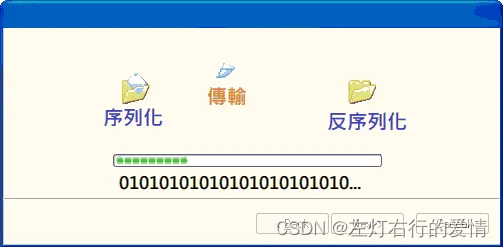
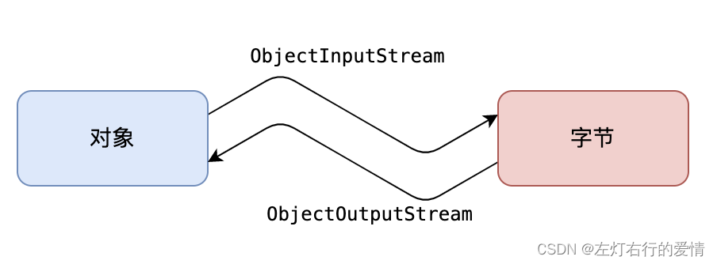
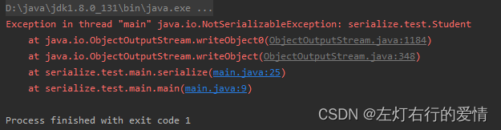
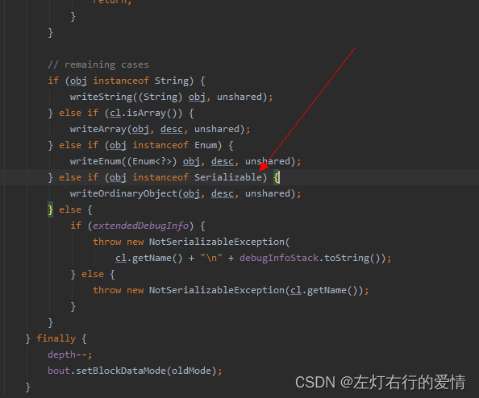
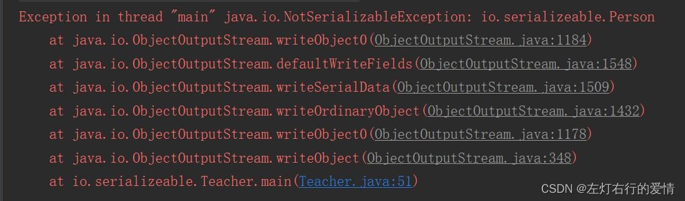
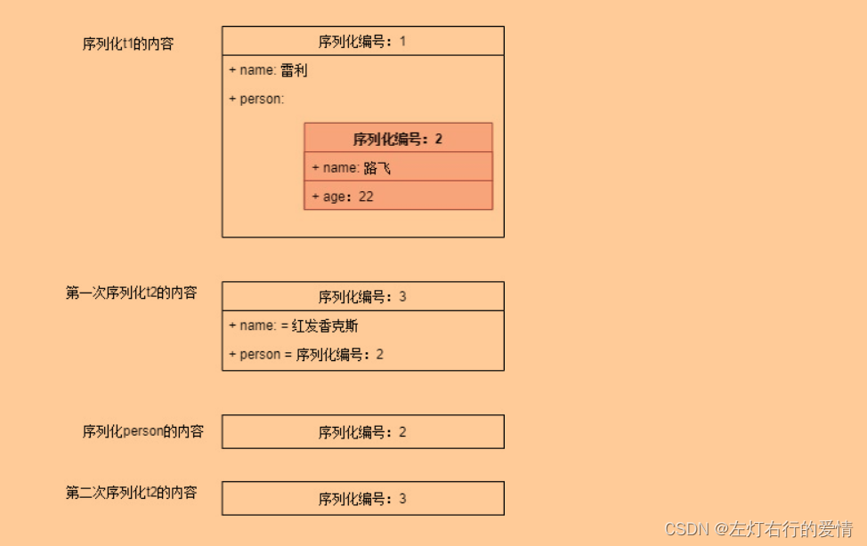
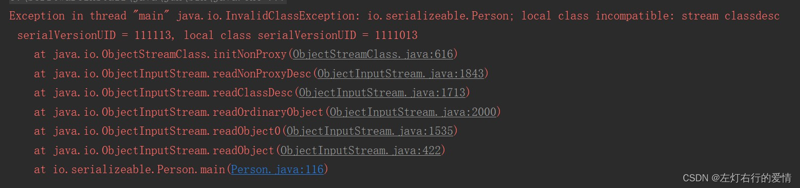

> 原文：[CSDN](https://blog.csdn.net/qq_45852626/article/details/136736487)（历史文章导入，当前状态为草稿）

### 前言

数据的最小单元是比特(bit),8个bit组成一个字节(Byte),也就是像00110011,在ASCII编码里A这个字为65->01000001(二进制).  
 我们在电脑上和朋友打字聊天时,传输的文字都是像01000001这种(序列化),但电脑自动帮我们转换为对应的文字(反序列化)  
 

### 什么是序列化和反序列化

序列化的意图是希望对一个Java对象做一下变换,变成字节序列,这样方便持久化存储到磁盘,避免程序运行结束后对象就从内存里消失,另外变换成字节序列也更便于网络运输和传播.  
 概念:

* 序列化: 把Java对象转换为字节序列
* 反序列化: 把字节序列恢复为原先的Java对象  
   

序列化机制从某种意义上来说也弥补了平台化的一些差异,毕竟转换后的字节流可以在其他平台上进行反序列化来恢复对象.

### 如何让对象序列化和反序列化

在Java中,对象想实现序列化,必须要实现下面两个接口之一:

* Serializable接口
* Externalizable接口  
   我们分别介绍这两个接口

#### Serializable接口

Serializable接口是一个标记接口,不用实现任何方法.一旦实现了此接口,该类的对象就是可序列化的  
 具体操作一下

* 序列化

```
public class Student implements Serializable {

    private String name;
    private Integer age;
    private Integer score;
    
    @Override
    public String toString() {
        return "Student:" + '\n' +
        "name = " + this.name + '\n' +
        "age = " + this.age + '\n' +
        "score = " + this.score + '\n'
        ;
    }
    
    // ... 其他省略 ...
}


```

```
public static void serialize(  ) throws IOException {

    Student student = new Student();
    student.setName("CodeSheep");
    student.setAge( 18 );
    student.setScore( 1000 );

    ObjectOutputStream objectOutputStream = 
        new ObjectOutputStream( new FileOutputStream( new File("student.txt") ) );
    objectOutputStream.writeObject( student );
    objectOutputStream.close();
    
    System.out.println("序列化成功！已经生成student.txt文件");
    System.out.println("==============================================");
}

- 反序列化
```
```java
MyClass obj = null;
try {
public static void deserialize(  ) throws IOException, ClassNotFoundException {
    ObjectInputStream objectInputStream = 
        new ObjectInputStream( new FileInputStream( new File("student.txt") ) );
    Student student = (Student) objectInputStream.readObject();
    objectInputStream.close();
    
    System.out.println("反序列化结果为：");
    System.out.println( student );
}


```

类 `ObjectInputStream` 和 `ObjectOutputStream` 是高层次的数据流，它们包含反序列化和序列化对象的方法。

如果我们在定义Student类时忘记加`implement Serializable`时会发生什么呢?  
 结果就是:此时程序运行会报错,并抛出`NotSerializableException`异常  
   
 那么为什么会抛出异常呢?  
 我们跟一下源码看一下ObjectOutputStream的writeObject0方法底层  
   
 如果一个对象既不是字符串、数组、枚举，而且也没有实现Serializable接口的话，在序列化时就会抛出`NotSerializableException`异常.

#### Externalizable 接口

它是Serializable接口的子类,用户必须要实现其中的`writeExternal()`和`readExternal()`方法,用来决定如何序列化和反序列化.

##### 普通序列化

```
public interface Externalizable extends java.io.Serializable {    
 void writeExternal(ObjectOutput out) throws IOException;    
 void readExternal(ObjectInput in) throws IOException, ClassNotFoundException;
}


```

举个例子来看

```
public UserInfo() {
    userAge=20;//这个是在第二次测试使用，判断反序列化是否通过构造器
}
public void writeExternal(ObjectOutput out) throws IOException  {
    //  指定序列化时候写入的属性。这里仍然不写入年龄
    out.writeObject(userName);
    out.writeObject(usePass);
}
public void readExternal(ObjectInput in) throws IOException, ClassNotFoundException  {
    // 指定反序列化的时候读取属性的顺序以及读取的属性
    // 如果你写反了属性读取的顺序，你可以发现反序列化的读取的对象的指定的属性值也会与你写的读取方式一一对应。因为在文件中装载对象是有序的
    userName=(String) in.readObject();
    usePass=(String) in.readObject();
}


```

##### 成员是引用的序列化

在Java中基本类型（如int, double, boolean等）和String类型都是可序列化的.  
 所以如果一个可序列化类的成员不是基本类型,也不算String类型,那这个引用类型也必须是可序列化的;否则会导致此类不能序列化

```
public class Teacher implements Serializable {
private String name;
private Person person;
 public Teacher(String name, Person person) {
        this.name = name;
        this.person = person;
    }
    public static void main(String[] args) throws Exception {
   try (ObjectOutputStream oos = new ObjectOutputStream(new FileOutputStream("teacher.txt"))) {      
        Person person = new Person("路飞", 20);
        Teacher teacher = new Teacher("雷利", person);
            oos.writeObject(teacher);
        }
    }
}


```

  
 程序直接报错，因为Person类的对象是不可序列化的，这导致了Teacher的对象不可序列化

##### 同一对象序列化多次的机制

同一对象序列化多次，会将这个对象序列化多次吗？答案是否定的。

```
public class WriteTeacher {   
 public static void main(String[] args) throws Exception { 
 try (ObjectOutputStream oos = new ObjectOutputStream(new FileOutputStream("teacher.txt"))) {
  Person person = new Person("路飞", 20);          
  Teacher t1 = new Teacher("雷利", person);         
  Teacher t2 = new Teacher("红发香克斯", person);
  //依次将4个对象写入输入流        
    oos.writeObject(t1);          
    oos.writeObject(t2);          
    oos.writeObject(person);          
    oos.writeObject(t2);
           }
    }
}


```

依次将t1、t2、person、t2对象序列化到文件teacher.txt文件中。  
 注意：反序列化的顺序与序列化时的顺序一致。

```
public class ReadTeacher {
    public static void main(String[] args) {
     try (ObjectInputStream ois = new ObjectInputStream(new FileInputStream("teacher.txt"))) {           
      Teacher t1 = (Teacher) ois.readObject();
      Teacher t2 = (Teacher) ois.readObject();      
      Person p = (Person) ois.readObject(); 
      Teacher t3 = (Teacher) ois.readObject();
      System.out.println(t1 == t2);           
      System.out.println(t1.getPerson() == p);         
      System.out.println(t2.getPerson() == p);
      System.out.println(t2 == t3);
      System.out.println(t1.getPerson() == t2.getPerson());
      } catch (Exception e) {
        e.printStackTrace();
      }
  }
}
//输出结果
//false
//true
//true
//true
//true


```

从输出结果可以看出，Java序列化同一对象，并不会将此对象序列化多次得到多个对象。

##### java序列化算法

我们先聊一下Java序列化的算法

1. 所有保存到磁盘的对象都有一个序列化编码号
2. 当程序试图序列化一个对象时,都会先检查此对象是否已经序列化过,只有此对象从未(在此虚拟机)被序列化过,才会将对象序列化为字节序列输出
3. 如果此对象已经序列化过,则直接输出编号即可  
    图示上述序列化过程  
    

##### java序列化算法潜在的问题

由于Java序列化算法不会重复序列化同一个对象,只会记录序列化对象的编号.  
 如果序列化一个可变对象(对象内的内容可更改)后,更改了对象内容,再次序列化,并不会再次将次对象转换为字节序列,而是保存序列化编号

#### 对比

| 实现Serializable接口 | 实现Externalizable接口 |
| --- | --- |
| 系统自动存储必要的信息 | 程序员自己决定存储需要的信息 |
| Java内建支持,易于实现,只需要实现该接口即可,无需任何代码支持 | 必须实现接口内的两个方法 |
| 性能略差 | 性能略好 |

虽然实现`Externalizable`接口能带来一定的性能提升,但由于实现`Externalizable`接口导致编程复杂度增加,所以大部分时候都是采用实现`Externalizable`接口方式来实现序列化.

#### transient关键字

有些时候,我们有特殊的需求,某些属性不需要序列化,那么使用transient关键字就可以选择不需要序列化的字段  
 反序列化出的对象中,被transient修饰的属性是默认值.  
 对于引用类型,值为null  
 对于基本类型,值为0  
 对于boolean类型,值为false

#### 序列化版本号serialVersionUID

反序列化必须拥有class文件,但随着项目的升级,class文件也会升级,序列化怎么保证升级前后的兼容性呢?

java提供了一个`private static final long serialVersionUID`的序列化版本号,只要版本号相同,即使更改了序列化属性,对象也可以正确被反序列化回来.

```
public class Person implements Serializable {    
//序列化版本号    
private static final long serialVersionUID = 1111013L;   
 private String name;    
 private int age;   
  //省略构造方法及get,set}


```

如果反序列化使用的class的版本号与序列化时使用的不一致,反序列化会报`InvalidClassException`  
   
 序列化版本号可自由制定,如果自己不指定,JVM会根据类信息自己计算一个版本号,这样随着class的升级,就无法正确反序列化;  
 不指定版本号另一个明显隐患是:不利于JVM间的移植,可能class文件没有更改,但不同JVM计算规则可能不一样,这样也导致无法反序列化.  
 如果不想手动赋值，你也可以借助IDE的自动添加功能，比如我使用的IntelliJ IDEA，按alt + enter就可以为类自动生成和添加serialVersionUID字段，十分方便.  
 注意: 如果修改了非瞬态变量(没有被transient修饰的变量),则可能导致序列化失败.  
 如果新类中实例变量的类型与序列化时类的**类型不一致**,则会序列化失败,这时候需要更改serialVersionUID。  
 如果只是新增了实例变量，则反序列化回来新增的是默认值；如果减少了实例变量，反序列化时会忽略掉减少的实例变量。
