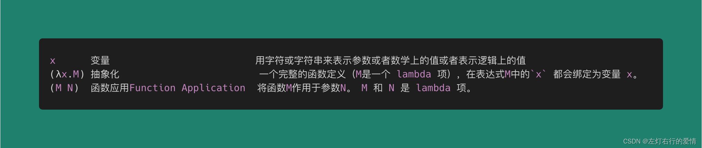
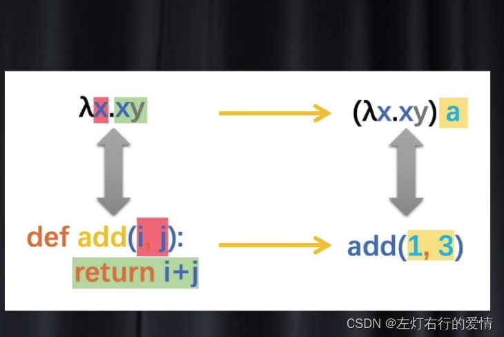
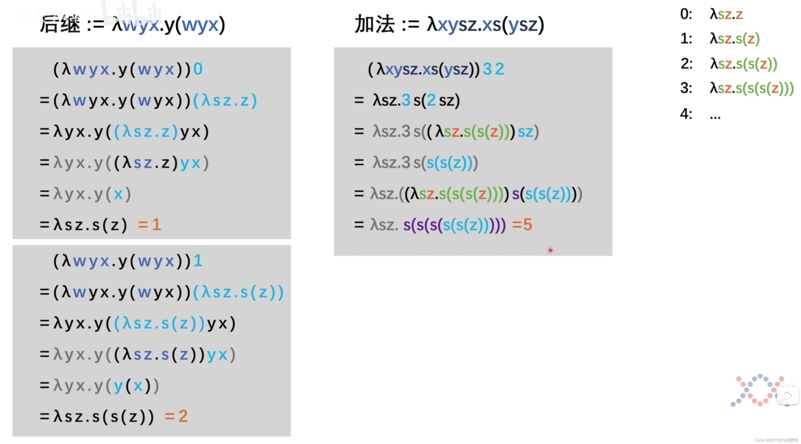
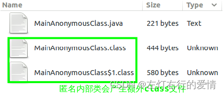
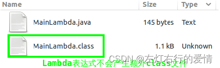
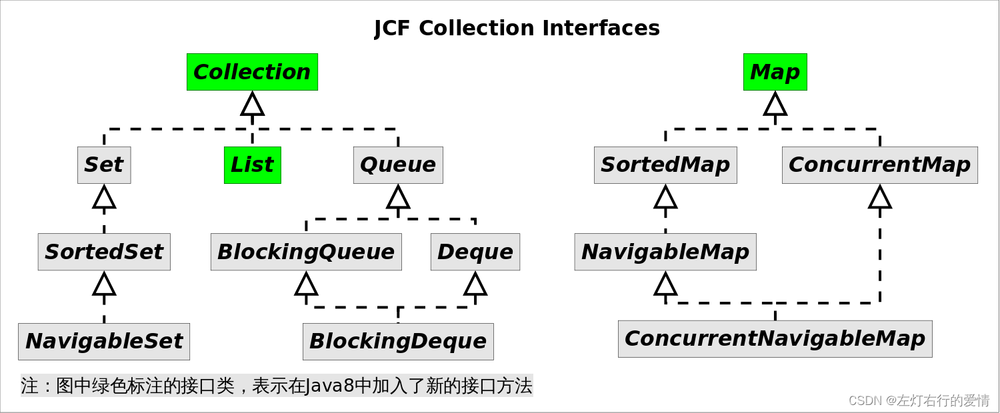

> 原文：[CSDN](https://blog.csdn.net/qq_45852626/article/details/136749297)（历史文章导入，当前状态为草稿）

### 前言

函数式编程，曾经有过一段黄金时代，后来又因面向对象范式的崛起而逐步变为小众范式。但是，函数式编程目前又开始在不同的语言中流行起来了，像Java 8、JS、Rust等语言都有对函数式编程的支持。  
 面向对象编程是对数据进行抽象,而函数式编程是对行为进行抽象.  
 这种抽象方式好处还是有很多的,可以让程序员写出更容易阅读的代码,这种代码更清晰的表达了业务逻辑,而不是从机制上如何实现.  
 在写回调函数和事件处理器时,我们不用再纠缠于匿名内部类的冗繁和可读性.  
 **核心思想: 使用不可变值和函数,函数对一个值进行处理,映射成另一个值**

### 前置知识

#### λ小故事

这块有时间填坑

#### 函数式编程起源: λ演算法

λ演算(读作lambda演算),它从数理逻辑(Mathematical logic)发展而来,使用变量绑定(binding)和代换规则(substitution)来研究函数如何抽象化定义(define),函数如何被应用(
apply 
)以及递归(recursion)的形式系统.  
 

λ演算式有三个要点:

* 绑定关系 : 变量任意性,x,y,z都可以,它仅仅是具体数据的代称
* 递归定义 : λ项递归定义,M可以是一个λ项
* 替换归约 : λ项可应用,空格分隔表示对M应用N ,N可以是一个λ项

注意,在λ演算法里面,任何东西都是在函数之上建立起来的,而且λ里面的函数和我们编程中的函数几乎是一模一样的,举个例子来看:

```
λ函数如下:
λx.xy
对应的函数如下
def add(i,j):
return i+j


```

add括号里面的i和j就是形参  
 所以对应λ演算法的函数就是一个x,而它.后面就是函数体(定义了函数要做什么),在调用函数的时候,形参和函数体会被形参括起来,比如:(λx.xy)a == add(1,3) 其中这个a就是函数里的实参,如下图  
 

我们习惯中的编程语言的函数在里面写的都是操作和指令,告诉计算机传进来的参数要对其进行什么操作.  
 也就是先有的数据和指令,函数是被定义在数据和指令这两个基础概念之上的  
 **而对于λ演算法来说,函数是第一概念,最初是没有数据和指令的,也就是说数据和指令也需要建立在函数这个概念之上.**

我们用上图的例子来说明  
 对于上图例子而言,x我们知道是实参,但是y是什么呢??  
 其实y是什么根本就不重要,因为在λ演算法里,**重点不是符号是什么,而是两个符号之间的关系**.  
 第一个x是形参,第二个y是什么无所谓,它只要和第一个符号不一样就行.  
 为了帮助我们更好的理解,我们拿过来一个例子来看符号之间的关系  
   
 上面的内容看不太明白也没关系,可以去看一下这个b站视频:【4. 用“λ演算法”去理解，为什么函数式编程会有更少的bug】https://www.bilibili.com/video/BV1d34y1v7xr?vd\_source=e69b8b220e292b8e4922bf6622e13c51  
 受限于时间和篇幅,没办法把视频中的思想很好的表达出来,不妨直接去看一下这个视频,相信就可以更好理解了.

### 概念

lambda表达式,也称λ表达式,是一种匿名函数,即没有函数名的函数.  
 它是基于数学中的λ演算得名,直接对应其中的lambda抽象.  
 在编程语言中,lambda允许我们以简洁的方式表示函数,无需进行完整的函数定义.  
 具体来说,lambda表达式由参数和表达式组成,其中参数是函数的输入,表达式是函数的输出.  
 lambda表达式主要特点是其匿名性和简洁性,使得我们可以快速定义简单的函数,并在需要的地方使用它们.  
 此外,它可以作为参数传递给其他函数,或者从其他函数中返回,从而实现函数的灵活组合和调用.  
 lambda表达式不仅仅是匿名内部类的语法糖,
JVM 
内部通过invokedynamic指令来实现lambda表达式的.

### Lambda && 匿名类

lambda表达式可以简化匿名内部类的书写,但lambda表达式并不能取代所有的匿名内部类,只能用来取代函数接口(Functional Interface)的简写.

#### 无参类型的简写

如果需要一个线程,常见的写法是:

```
new Thread( new Runnable(){
  @Override
  public void run(){
     System.out.println("Thread run()");
     }
}).start();


```

Thread类传递了一个匿名的Runnable对象,重载Runnable接口的run()方法来实现相应逻辑,这是JDK7及其以前的做法,虽然省去了为类起名字的烦恼,但是还不够简化,在JDK8中可以简化如下方式:

```
new Thread(
 () ->    System.out.println("Thread run()"); //省略接口名和方法名
)


```

上述代码和匿名内部类作用是一样的,但比匿名内部类更进一步,连着接口名和函数名都一同省掉了.

#### 带参函数的简写

如果给一个字符串列表通过自定义比较器,按照字符串长度进行排序,JDK7书写形式

```
List<String> list = Arrays.asList("I", "love", "you", "too");
Collections.sort(list,new Comparator<String>(){
  @Override
  public int compare(String s1,String s2){
    if(s1==null)
    return -1;
    if(s2 == null)
    return 1;
    return s1.length() - s2.length();
    }
  });


```

上述代码通过内部类存储重载了Comparator接口的
compare
()方法,实现比较逻辑.  
 采用lambda表达式可简写如下:

```
// JDK8 Lambda表达式写法
List<String> list = Arrays.asList("I", "love", "you", "too");
Collections.sort(list,(s1,s2)->{
 if(s1 == null)
        return -1;
    if(s2 == null)
        return 1;
  return s1.length() - s2.length();
  {);


```

除了省略接口名和方法名,代码中把参数表的类型也忽略了.  
 得益于javac的类型推断机制,编译期能够根据上下文信息推断出参数的类型,当然也有推断失败的时候,这时候就需要手动指明参数类型了.  
 注意: Java是强类型语言,每个变量和对象都必需有明确的类型.

### 简写的依据

并不是所有的接口都可以使用lambda简写,能够使用lambda的依据是必须有相应的函数接口(函数接口,是指内部只有一个抽象方法的接口).这一点跟Java是强类型语言吻合,也就是说你并不能在代码的任何地方任性的写lambda表达式.  
 lambda的类型就是对应函数接口的类型.  
 lambda表达式另一个依据就是类型推断机制,在上下文信息足够多的情况下,编译期可以推断出参数表的类型,而不需要显示指名.lambda表达更多合法的书写形式如下:

```
// Lambda表达式的书写形式
Runnable run = () -> System.out.println("Hello World");// 1 :无参函数的简写
ActionListener listener = event -> System.out.println("button clicked");// 2 有参函数的简写
Runnable multiLine = () -> {// 3 代码块写法
    System.out.print("Hello");
    System.out.println(" Hoolee");
};
BinaryOperator<Long> add = (Long x, Long y) -> x + y;// 4 
BinaryOperator<Long> addImplicit = (x, y) -> x + y;// 5 类型推断机制


```

### 自定义函数接口

自定义函数接口很容易,只需要编写一个只有一个抽象方法的接口即可

```
@FunctionalInterface
public interface ConsumerInterface<T>{
   void accept(T t)
}


```

有了上述接口定义,我们可以写出下面的代码

```
ConsumerInterface<String> consumer = str -> System.out.println(str)


```

进阶一点的用法

```
class Mystream<T>{
 private List<T> list;
  public void myForEach(ConsumerInterface<T> consumer){
  for(T t:list){
  consumer.accept(t);
  }
 }
}
MyStream<String> stream = new MyStream<String>();
stream.myForEach(str -> System.out.println(str)); // 自定义函数接口书写lambda表达式


```

### lambda && 匿名类JVM层面区别

lambda表达式似乎只是为了简化匿名内部类书写,看起来仅仅是通过语法糖在编译阶段把所有的lambda表达式替换成匿名内部类就可以了.  
 但其实并非如此,在JVM层面,lambda表达式和匿名内部类有着明显的差别.

#### 匿名内部类实现

匿名内部类仍然是一个类,只是不需要程序员显示指定类名,编译期会自动为该类取名,编译之后会产生两个class文件:

```
public class MainAnonymousClass {
	public static void main(String[] args) {
		new Thread(new Runnable(){
			@Override
			public void run(){
				System.out.println("Anonymous Class Thread run()");
			}
		}).start();;
	}
}


```

  
 进一步分析主类MainAnonymousClass.class字节码,可发现其创建了匿名内部类的对象:

```
// javap -c MainAnonymousClass.class
public class MainAnonymousClass {
  ...
  public static void main(java.lang.String[]);
    Code:
       0: new           #2                  // class java/lang/Thread
       3: dup
       4: new           #3                  // class MainAnonymousClass$1 /*创建内部类对象*/
       7: dup
       8: invokespecial #4                  // Method MainAnonymousClass$1."<init>":()V
      11: invokespecial #5                  // Method java/lang/Thread."<init>":(Ljava/lang/Runnable;)V
      14: invokevirtual #6                  // Method java/lang/Thread.start:()V
      17: return
}


```

#### Lambda表达式实现

Lambda表达式通过invokedynamic指令实现,书写lambda表达式不会产生新的类,如果有如下代码,编译之后只有一个class文件:

```
public class MainLambda {
	public static void main(String[] args) {
		new Thread(
				() -> System.out.println("Lambda Thread run()")
			).start();;
	}
}


```

编译后的结果:  
   
 通过javap反编译命名,我们可以看到Lambda表达式内部表示的不同:

```
// javap -c -p MainLambda.class
public class MainLambda {
  ...
  public static void main(java.lang.String[]);
    Code:
       0: new           #2                  // class java/lang/Thread
       3: dup
       4: invokedynamic #3,  0              // InvokeDynamic #0:run:()Ljava/lang/Runnable; /*使用invokedynamic指令调用*/
       9: invokespecial #4                  // Method java/lang/Thread."<init>":(Ljava/lang/Runnable;)V
      12: invokevirtual #5                  // Method java/lang/Thread.start:()V
      15: return

  private static void lambda$main$0();  /*Lambda表达式被封装成主类的私有方法*/
    Code:
       0: getstatic     #6                  // Field java/lang/System.out:Ljava/io/PrintStream;
       3: ldc           #7                  // String Lambda Thread run()
       5: invokevirtual #8                  // Method java/io/PrintStream.println:(Ljava/lang/String;)V
       8: return
}


```

反编译之后我们发现lambda表达式被封装了主类的一个私有方法,并通过i`nvokedynamic`指令进行调用

#### 推论, this 引用的意义

既然lambda表达式不是内部类的简写,那么lambda内部的this引用和内部类对象没关系了.  
 在Lambda表达式中this的意义跟在表达式外部完全一样。因此下列代码将输出两遍Hello Hoolee，而不是两个引用地址。

```
public class Hello {
	Runnable r1 = () -> { System.out.println(this); };
	Runnable r2 = () -> { System.out.println(toString()); };
	public static void main(String[] args) {
		new Hello().r1.run();
		new Hello().r2.run();
	}
	public String toString() { return "Hello Hoolee"; }
}


```

可能你会问,r1会输入`Hello Hoolee`呢?  
 我们来详细解释一下:

* r1的lambda表达式中,this直接引用了Hello类实例,并调用了toString方法(当你尝试打印一个对象时,Java会自动调用该对象的toString方法)
* 在 r2 的 Lambda 表达式中，你调用了 toString() 方法，没有显式使用 this，但由于 toString() 是 Hello 类的一个成员方法，它隐式地使用了 this 来调用该方法。

### lambda && 集合

为引入lambda表达式,Java8新增了`java.util.function`包,里面包含常用函数接口,这是lambda表达式的基础,java集合框架也新增部分接口,以便与lambda表达式对接.  
 回顾一下Java集合框架的接口继承结构:  
   
 上图中绿色标注的接口类,表示在Java8中加入了新的接口方法,由于继承关系,他们相应的子类都会继承这些新方法,下面详细列举了这些方法.

| 接口名 | 兼容的方法 |
| --- | --- |
| Collection | forEach, stream, parallelStream, spliterator,removeIf |
| List | sort, replaceAll |
| Map | forEach,getOrDefault,replaceAll,putIfAbsent,remove,replace, computeIfAbsent,computeIfPresent,compute,merge |
| 这些新加入的方法大部分都要用到`java.util.function`包下的接口,意味着这些方法大部分都跟lambda表达式相关. |  |
| 下面我们逐一学习这些方法. |  |

#### Collection中的新方法

接口Collection和List新加入了一些方法,我们是以List的子类ArrayList为例来说明.

##### forEach()

```
  default void forEach(Consumer<? super T> action) {
        Objects.requireNonNull(action);
        for (T t : this) {
            action.accept(t);
        }
    }


public interface Consumer<T> {

    /**
     * Performs this operation on the given argument.
     *
     * @param t the input argument
     */
    void accept(T t);

//无关代码省略
}


```

方法签名为`void forEach(Consumer<? super E> action)`,作用是对容器中的每个元素执行action指定的动作,其中Consumer是函数接口,里面只有一个待实现方法`void accept(T t)`(后面可以看到,这个方法叫什么根本不重要,甚至不需要
记忆 
它的名字)

需求: 假设有一个字符串列表,需要打印出其中所有长度大于3的字符串  
 Java7及以前我们可以用增强for循环实现:

```
//使用增强for循环迭代
ArrayList<String> list = new ArrayList<>(Arrays.asList("I", "love", "you", "too"));
for(String str : list){
 if(str.length()>3)
    System.out.println(str)
}


```

使用forEach方法结合匿名内部类可以这样实现:

```
//使用forEach()结合匿名内部类迭代
ArrayList<String> list = new ArrayList<>(Arrays.asList("I", "love", "you", "too"));
list.forEach(new Consumer<String>(){
  @Override
  public void accept(String str){
   if(str.length()>3)
      System.out.println(str)
  }
});


```

上面调用forEach且使用匿名内部类实现Consumer接口,目前为止没看到这种设计的好处,但我们还有Lambda表达式,如下

```
ArrayList<String> list = new ArrayList<>(Arrays.asList("I", "love", "you", "too"));
list.forEach( str -> {
 if(str.length() > 3)
  System.out.println(str);
});


```

我们不需要知道accept方法,也不需要知道Consumer接口,类型推导帮我们做了一切.

##### removeIf()

```
    default boolean removeIf(Predicate<? super E> filter) {
        Objects.requireNonNull(filter);
        boolean removed = false;
        final Iterator<E> each = iterator();
        while (each.hasNext()) {
            if (filter.test(each.next())) {
                each.remove();
                removed = true;
            }
        }
        return removed;
    }

@FunctionalInterface
public interface Predicate<T> {

    /**
     * Evaluates this predicate on the given argument.
     *
     * @param t the input argument
     * @return {@code true} if the input argument matches the predicate,
     * otherwise {@code false}
     */
    boolean test(T t);
    //省略无关代码
}


```

方法签名`boolean removeIf(Predicate <? super E> filter)`,作用是删除容器中所有满足filter指定条件的元素.  
 其中Predicate是一个函数接口,里面只有一个待实现的方法 `boolean test(T t)`,同样这个方法的名字不重要,用的时候不需要写这个名字.

需求: 假设有一个字符串列表，需要删除其中所有长度大于3的字符串。

在迭代过程中对容器进行删除操作必须使用迭代器,否则会抛出`ConcurrentModificationException`,所有上述需求传统写法为:

```
// 使用迭代器删除列表元素
ArrayList<String> list = new ArrayList<>(Arrays.asList("I", "love", "you", "too"));
while(it.hasNext()){
if(it.next().length()>3) // 删除长度大于3的元素
    it.remove();
}


```

现在使用`removeIf()`方法结合匿名内部类,我们可以这样实现:

```
// 使用removeIf()结合匿名名内部类实现
ArrayList<String> list = new ArrayList<>(Arrays.asList("I", "love", "you", "too"));
list.removeIf(new Predicate<String>(){ //删除长度大于3的元素
   @Override
   public boolean test(String str){
     return str.length() >3;
   }
 });


```

上述代码使用`removeIf()`方法,并使用匿名内部类实现`Precicate`接口.相信你已经可以使用lambda表达式写了

```
// 使用removeIf()结合Lambda表达式实现
ArrayList<String> list = new ArrayList<>(Arrays.asList("I", "love", "you", "too"));
list.removeIf(str -> str.length() >3); //删除长度大于3的元素


```

看的出来,使用`lambda`不需要记忆`Predicate`接口名,也不需要记忆`test()`方法名,只需要知道此处需要一个返回布尔类型的`lambda`表达式就可以了.

##### replaceAll()

```
  public void replaceAll(UnaryOperator<E> operator) {
     root.replaceAllRange(operator, offset, offset + size);
}

  private void replaceAllRange(UnaryOperator<E> operator, int i, int end) {
        Objects.requireNonNull(operator);
        final int expectedModCount = modCount;
        final Object[] es = elementData;
        for (; modCount == expectedModCount && i < end; i++)
            es[i] = operator.apply(elementAt(es, i));
        if (modCount != expectedModCount)
            throw new ConcurrentModificationException();
    }


```

该方法签名为`void replaceAll(UnaryOperator<E> operator)`  
 作用是对每个元素执行operator制定的操作,并用操作结果来替换原来的元素.  
 其中`unaryOperator`是一个函数接口,里面只有一个待实现函数`T apply(T t)`  
 需求: 假设有一个字符串列表,将其中所有长度大于3的元素转换成大写,其余元素不变.  
 Java7及之前似乎没有优雅的办法:

```
// 使用下标实现元素替换
ArrayList<String> list = new ArrayList<>(Arrays.asList("I", "love", "you", "too"));
for(int i =0; i<list.size(); i++){
String str = list.get(i);
if(str.length()>3)
 list.set(i,str.toUpperCase());
 }


```

使用`replaceAll()`方法结合匿名内部类可以实现如下:

```
// 使用匿名内部类实现
ArrayList<String> list = new ArrayList<>(Arrays.asList("I", "love", "you", "too"));
list.replaceAll(new UnaryOperator<String>(){
@Override
public String apply(String str){
 if(str.length()>3)
  return str.toUpperCase();
return str;
}
});


```

更简洁的lambda表达式实现:

```
// 使用Lambda表达式实现
ArrayList<String> list = new ArrayList<>(Arrays.asList("I", "love", "you", "too"));
list.replaceAll(str -> {
if(str.length()>3)
 return str.toUpperCase();
return str;
});


```

##### sort()

该方法定义在List接口中,方法签名为`void sort(Comparator<? super E> c)`,根据`c`指定的比较规则对容器元素进行排序.

```
   @Override
    @SuppressWarnings("unchecked")
    public void sort(Comparator<? super E> c) {
        final int expectedModCount = modCount;
        Arrays.sort((E[]) elementData, 0, size, c);
        if (modCount != expectedModCount)
            throw new ConcurrentModificationException();
        modCount++;
    }


```

Java7及以前`sort()`方法在`Collections`工具类中,代码如下:

```
// Collections.sort()方法
ArrayList<String> list = new ArrayList<>(Arrays.asList("I", "love", "you", "too"));
Collections.sort(list, new Comparator<String>(){
 @Override
 public int compare(String str1, String str2){
   return str1.length()-str2.length();
}
});


```

现在可以直接用list.sort方法,结合lambda表达式,如下:

```
// List.sort()方法结合Lambda表达式
ArrayList<String> list = new ArrayList<>(Arrays.asList("I", "love", "you", "too"));
list.sort((str1, str2) -> str1.length() - str2.length());


```

#### Map中的新方法

相比于`Collection`,Map加入了更多的方法,我们以`HashMap`为例来看

##### forEach()

```
       public final void forEach(Consumer<? super K> action) {
            Node<K,V>[] tab;
            if (action == null)
                throw new NullPointerException();
            if (size > 0 && (tab = table) != null) {
                int mc = modCount;
                for (Node<K,V> e : tab) {
                    for (; e != null; e = e.next)
                        action.accept(e.key);
                }
                if (modCount != mc)
                    throw new ConcurrentModificationException();
            }
        }
    }


```

该方法签名为`void forEach(BiConsumer<? super K,? super V> action)`,作用是对Map中的每个映射执行`action`指定的操作,其中`BinConsumer`接口名字和`accept()`方法名字都不重要,不要记忆它们.  
 需求：假设有一个数字到对应英文单词的Map，请输出Map中的所有映射关系．

Java7以及之前代码如下：

```
// Java7以及之前迭代Map
HashMap<Integer, String> map = new HashMap<>();
map.put(1, "one");
map.put(2, "two");
map.put(3, "three");
for(Map.Entry<Integer,String> entry : map.entrySet()){
  System.out.println(entry.getKey() + "=" + entry.getValue());
}


```

使用`Map.forEach()`方法,结合匿名内部类,代码如下:

```
// 使用forEach()结合匿名内部类迭代Map
HashMap<Integer, String> map = new HashMap<>();
map.put(1, "one");
map.put(2, "two");
map.put(3, "three");
map.forEach(new BiConsumer<Integer,String>(){
@Override
public void accept(Integer k ,String v){
 System.out.println(k + "=" + v);
}
});


```

匿名内部类实现BiConsumer接口,但是实际场景根本每日用这种写法,因为有lambda表达式

```
// 使用forEach()结合Lambda表达式迭代Map
HashMap<Integer, String> map = new HashMap<>();
map.put(1, "one");
map.put(2, "two");
map.put(3, "three");
map.forEach((k,v) -> System.out.println(k+ "=" + v));


```

##### replaceAll()

```
  @Override
    public void replaceAll(BiFunction<? super K, ? super V, ? extends V> function) {
        Node<K,V>[] tab;
        if (function == null)
            throw new NullPointerException();
        if (size > 0 && (tab = table) != null) {
            int mc = modCount;
            for (Node<K,V> e : tab) {
                for (; e != null; e = e.next) {
                    e.value = function.apply(e.key, e.value);
                }
            }
            if (modCount != mc)
                throw new ConcurrentModificationException();
        }
    }


```

方法签名为`replaceAll(BiFunction<? super K,? super V,? extends V> function)`  
 作用是对Map中的每个映射执行`function`指定的操作,并用function的执行结果替换原来的value,  
 其中BiFunction是一个函数接口,里面有一个待实现方法`R apply (T t ,U u)`.  
 需求：假设有一个数字到对应英文单词的Map，请将原来映射关系中的单词都转换成大写．

Java7以及之前经典的代码如下：

```
// Java7以及之前替换所有Map中所有映射关系
HashMap<Integer, String> map = new HashMap<>();
map.put(1, "one");
map.put(2, "two");
map.put(3, "three");
for(Map.Entry<Integer,String> entry : map.entrySet()){
    entry.setValue(entry.getValue().toUpperCase());
}


```

使用`replaceAll()`方法结合匿名内部类,实现如下:

```
// 使用replaceAll()结合匿名内部类实现
HashMap<Integer, String> map = new HashMap<>();
map.put(1, "one");
map.put(2, "two");
map.put(3, "three");
map.replaceAll(new BiFunction<Integr,String,String>(){
@Override
public String apply(Integer k ,String v){
return v.toUpperCase();
}
});


```

使用lambda表达式实现如下:

```
// 使用replaceAll()结合Lambda表达式实现
HashMap<Integer, String> map = new HashMap<>();
map.put(1, "one");
map.put(2, "two");
map.put(3, "three");
map.replaceAll((k,v) -> v.toUpperCase());


```

非常简洁!!!

##### computeIfAbsent()

```
   @Override
    public V computeIfAbsent(K key,
                             Function<? super K, ? extends V> mappingFunction) {
        if (mappingFunction == null)
            throw new NullPointerException();
        int hash = hash(key);
        Node<K,V>[] tab; Node<K,V> first; int n, i;
        int binCount = 0;
        TreeNode<K,V> t = null;
        Node<K,V> old = null;
        if (size > threshold || (tab = table) == null ||
            (n = tab.length) == 0)
            n = (tab = resize()).length;
        if ((first = tab[i = (n - 1) & hash]) != null) {
            if (first instanceof TreeNode)
                old = (t = (TreeNode<K,V>)first).getTreeNode(hash, key);
            else {
                Node<K,V> e = first; K k;
                do {
                    if (e.hash == hash &&
                        ((k = e.key) == key || (key != null && key.equals(k)))) {
                        old = e;
                        break;
                    }
                    ++binCount;
                } while ((e = e.next) != null);
            }
            V oldValue;
            if (old != null && (oldValue = old.value) != null) {
                afterNodeAccess(old);
                return oldValue;
            }
        }
        int mc = modCount;
        V v = mappingFunction.apply(key);
        if (mc != modCount) { throw new ConcurrentModificationException(); }
        if (v == null) {
            return null;
        } else if (old != null) {
            old.value = v;
            afterNodeAccess(old);
            return v;
        }
        else if (t != null)
            t.putTreeVal(this, tab, hash, key, v);
        else {
            tab[i] = newNode(hash, key, v, first);
            if (binCount >= TREEIFY_THRESHOLD - 1)
                treeifyBin(tab, hash);
        }
        modCount = mc + 1;
        ++size;
        afterNodeInsertion(true);
        return v;
    }


```

该方法签名为`V computeIfAbsent(K key, Function<? super K, ? extends V> mappingFunction)`.  
 作用是: 当前`Map`中不存在`key`值的映射或应设置为`null`时,调用`mappingFunction`,并在`mappingFunction`执行结果非`null`时,将结果与`key`关联.  
 `Function`是一个函数接口,里面有一个待实现方法`R apply(T t)`.  
 `computeIfAbsent()` 常用来对Map的某个key值建立初始化映射.  
 比如我们要实现一个多值映射,Map的定义可能是`Map<K, Set<V>>`,要向Map中放入新值,通过下面代码实现:

```
Map<Integer, Set<String>> map = new HashMap<>();
// Java7及以前的实现方式
if(map.containsKey(1)){
    map.get(1).add("one");
}else{
    Set<String> valueSet = new HashSet<String>();
    valueSet.add("one");
    map.put(1, valueSet);
}
// Java8的实现方式
map.computeIfAbsent(1, v -> new HashSet<String>()).add("yi");


```

##### computeIfPresent()

作用是:当前Map中存在key值的映射且非null时,才调用`remappingFunction`,如果`remappingFunction`执行结果为null,  
 则删除key的映射,否则使用该结果替换key原来的映射

```
// Java7及以前跟computeIfPresent()等效的代码
if (map.get(key) != null) {
    V oldValue = map.get(key);
    V newValue = remappingFunction.apply(key, oldValue);
    if (newValue != null)
        map.put(key, newValue);
    else
        map.remove(key);
    return newValue;
}
return null;


```
