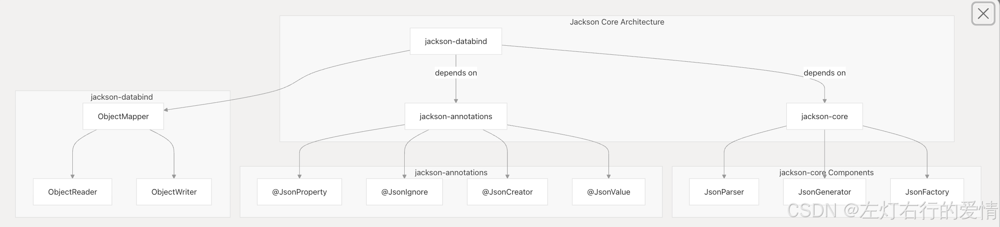
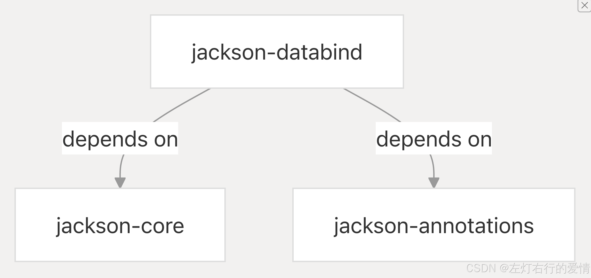
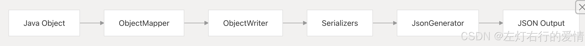
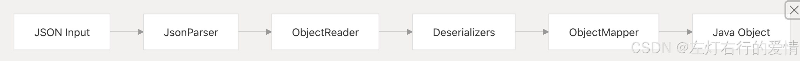
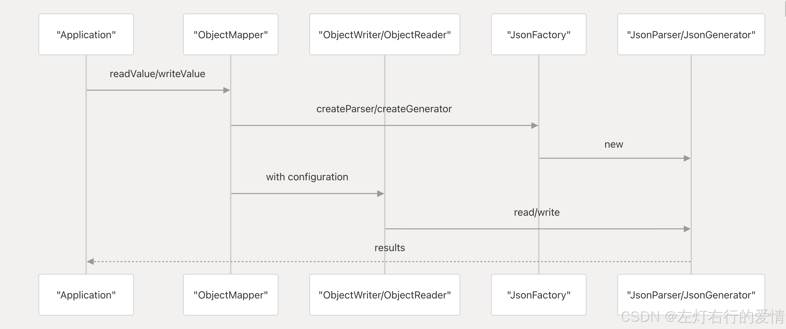

> 原文：[CSDN](https://blog.csdn.net/qq_45852626/article/details/156465708)（历史文章导入，当前状态为草稿）

#### Jackson核心内容-入门到实战
## 简介

一句话形容: Jackson是用来序列化和反序列化 json 的 Java 的开源框架.  
 用官方的话来说:是一套用于 Java 和 JVM 平台的数据处理工具。内容涵盖 Jackson 的用途、核心架构和模块生态系统。

## 它能干嘛

1. 用于解析和生成数据的流式 API
2. 用于在 Java 对象和数据格式之间进行转换的数据绑定框架
3. 用于配置和自定义的注释系统

## jackson仓库挖宝藏🏴‍☠️

github仓库: https://github.com/FasterXML/jackson

### 核心架构(简述)

从这个图中我们可以看到有三个核心模块: jackson-core,jackson-annotations,jackson-databind

简单一些可以这样列举  
 

#### jackson-core

它提供用于读取和写入 JSON 的**底层流式 API**.  
 其中包含:

1. JsonParser：用于读取 JSON
2. JsonGenerator：用于写入 JSON
3. JsonFactory：用于创建解析器和生成器  
    是其他Jackson模块构建的基础

jackson-core 模块通过其流式 API为 Jackson 的处理能力提供了基础。该 API 在Token（标记）级别上工作，对 JSON 内容进行逐个 Token 的处理。

| 组件 | 作用 |
| --- | --- |
| JsonFactory | 工厂类，用于创建 JsonParser 和 JsonGenerator 实例 |
| JsonParser | 读取并将 JSON 内容解析为 Token 流 |
| JsonGenerator | 以 Token 序列的形式写出 JSON 内容 |
| JsonToken | 枚举类型，表示不同的 JSON Token（例如 START\_OBJECT、FIELD\_NAME） |

流式 API 的设计旨在提高效率，并提供对 JSON 内容的最低级别访问。由于它以增量方式处理内容，无需构建完整的内存表示，因此内存开销极低。

#### jackson-annotations

提供用于配置 Jackson 如何处理 Java 对象的注解。这些注解独立于实际的处理逻辑。

| 注解 | 作用 |
| --- | --- |
| @JsonProperty | 指定属性在 JSON 中对应的名称 |
| @JsonIgnore | 标记某个属性在序列化 / 反序列化时被忽略 |
| @JsonCreator | 标记用于对象创建的构造方法或工厂方法 |
| @JsonValue | 指定一个方法，其返回值将作为对象的序列化结果 |
| @JsonFormat | 为属性指定格式化规则（如日期格式） |
| @JsonInclude | 控制属性在什么条件下才会被包含进 JSON |

这些注解可以应用在类、字段、方法以及方法参数上，用于在不修改底层处理逻辑的前提下，灵活地定制 JSON 的序列化与反序列化过程。  
 在实际项目里，Jackson 的“**难点几乎都集中在注解组合和生效时机上**”，而不是 API 本身。  
 理解这些注解的作用边界，能少踩很多坑。

#### jackson-databind

jackson-databind 模块提供了大多数应用会直接使用的高级数据绑定 API。  
 它将 底层的流式处理能力（jackson-core） 与 注解提供的配置（jackson-annotations） 连接起来，实现 JSON 与 Java 对象之间的自动转换。  
 它以ObjectMapper 为核心，是大多数应用的主要入口,提供ObjectReader 和 ObjectWriter 接口，用于更细分、可定制的操作.  
 同时它依赖 jackson-core 和 jackson-annotations.

| 组件 | 作用 |
| --- | --- |
| ObjectMapper | 数据绑定过程的核心协调者 |
| ObjectReader | 用于读取 JSON 并创建 Java 对象的专用类 |
| ObjectWriter | 用于将 Java 对象写出为 JSON 的专用类 |
| SerializerProvider | 序列化器的注册与提供中心 |
| DeserializerProvider | 反序列化器的注册与提供中心 |
| BeanDescription | 对 Java Bean 的结构与元信息进行内省后的描述 |

ObjectMapper 是应用中最常用的入口点。  
 它负责协调 JSON ↔ Java 对象 的整个转换流程，并将具体工作委派给各个专用组件来完成。

**真正理解 ObjectMapper，就等于理解了 Jackson 的 70%。**  
 剩下 30% 的坑，基本都出在自定义序列化器、反序列化器以及注解冲突上。  
 一般来说,我们业务场景基本只会用到 jackson-databind,但是学习理解core 和 annotations 的边界，在排查序列化/反序列化“诡异问题”时其实挺关键的,后续实战我们会聊一下这部分.

### 生态

Jackson提供的功能比我一开始理解的要很多,我看到仓库代码的时候意识到,wow,原来做了这么多的事情.  
 我根据自己的理解大概写了一下(按模块区分吧)

#### 数据格式模块

Jackson 的格式扩展到 JSON 以外的其他格式,包括但不限于XML、CSV、YAML等格式的流式API,并允许同一个ObjectMapper API处理多种格式.

#### 数据类型模块

增加对常用Java库和框架的支持,实现第三方类型的无缝序列化和反序列化.

#### 语言模块

提供对 Java 以外的 JVM 语言的支持,包含 Kotlin 和 Scala 的模块.

#### 扩展模块

提供额外功能或优化  
 例如 JAX-RS 提供程序、Afterburner（性能增强）和 Mr Bean（界面实现）- 这块我不太懂,我只是知道大概有这个东西,可能我这辈子都不会用到(大概率是这样,目前看个乐呵就行).

### 序列化流程（Java → JSON）

  
 序列化步骤

1. 应用程序将一个 Java 对象 交给 ObjectMapper
2. ObjectMapper 将工作委派给 ObjectWriter
3. ObjectWriter 为对象及其属性查找合适的 序列化器（Serializer）
4. 各个序列化器将对象转换为 JSON Token

JsonGenerator 将这些 Token 写入输出目标（字符串、文件、流等）

### 反序列化流程（JSON → Java）

  
 反序列化步骤

1. JsonParser 读取 JSON 输入并将其解析为 Token 流
2. ObjectReader 根据目标 Java 类型请求合适的 反序列化器（Deserializer）
3. 反序列化器根据 Token 构建 Java 对象
4. ObjectMapper 返回完整构建好的 Java 对象层级结构

### 核心组件交互关系

下面的时序图（示意）展示了 Jackson 核心组件在典型操作中的协作方式。  
   
 **组件职责划分:**

一: ObjectMapper  
 a. 提供高级 API  
 b. 统一管理配置

二: ObjectWriter / ObjectReader  
 a. 执行具体的序列化 / 反序列化逻辑

三: JsonFactory  
 a. 创建 JsonParser 和 JsonGenerator

四: JsonParser / JsonGenerator  
 a. 负责底层的 Token 级别处理

这种交互模式体现了 Jackson 架构中明确的职责分离。

### 抽象层级（Abstraction Layers）

Jackson 的架构被清晰地划分为多个抽象层，我们可以根据需要选择使用深度。

#### 高层（对象映射层 / Object Mapping）

大多数应用只使用这一层,通过 ObjectMapper 实现 JSON 与 Java 对象的直接转换

#### 中层（定制层 / Customization）

需要特殊处理时使用.  
 包括：

1. 自定义 Serializer / Deserializer
2. 使用或扩展注解解析机制

#### 底层（流式层 / Streaming）

1. 面向高性能或特殊场景
2. 直接使用 JsonParser / JsonGenerator
3. 按 Token 逐个处理 JSON

## 架构设计原则

Jackson 的核心架构遵循以下关键原则：

**关注点分离（Separation of Concerns）**  
 不同模块分别负责：流式 I/O、配置、数据绑定

**渐进式暴露（Progressive Disclosure）**  
 简单场景简单用，复杂场景有更底层 API 可用

**高度可扩展性（Extensibility）**  
 提供大量扩展点，支持深度定制

**高性能（Performance）**  
 以流式处理为基础，简单用法几乎没有额外开销

**最小依赖（Minimal Dependencies）**  
 核心模块依赖极少  
 jackson-core：无外部依赖  
 jackson-annotations：无外部依赖
