> 原文：[CSDN](https://blog.csdn.net/qq_45852626/article/details/135635990)（历史文章导入，当前状态为草稿）

### 前言

随着编程语言和软件的诞生，异常情况就如影随形地纠缠着我们，只有正确处理好意外情况，才能保证程序的可靠性。  
 Java 语言在设计之初就提供了相对完善的异常处理机制，这也是 Java 得以大行其道的原因之一，因为这种机制大大降低了编写和维护可靠程序的门槛。如今，异常处理机制已经成为现代编程语言的标配。

### 基础概念

#### 使用异常的好处

参考Java异常的官方文档，总结有如下好处：  
 • 能够将错误代码和正常代码分离  
 • 能够在调用堆栈上传递异常  
 • 能够将异常分组和区分  
 举例说明:

```
public class ExceptionBenefitsExample {
    public static void main(String[] args) {
        try {
            performOperation();  // 调用可能抛出异常的操作
        } catch (CustomException e) {  // 捕获自定义异常
            e.printStackTrace();  // 打印异常堆栈
        }
    }

    public static void performOperation() throws CustomException {
        try {
            int result = divideNumbers(10, 0); // 调用可能抛出异常的方法
        } catch (ArithmeticException e) {  // 捕获算术异常
            throw new CustomException("An error occurred while performing the operation", e);  // 抛出自定义异常
        }
    }

    public static int divideNumbers(int dividend, int divisor) {
        return dividend / divisor;  // 执行可能会抛出算术异常的操作
    }
}

class CustomException extends Exception {
    public CustomException(String message, Throwable cause) {
        super(message, cause);
    }
}


```

通过上面这个例子,我们可以验证列出的三点好处:

1. 能够将错误代码和正常代码分离：异常被放置在try-catch块中，可以将正常执行的代码与异常处理代码分隔开来，提高了代码的可读性和可维护性。
2. 能够在调用堆栈上传递异常：当异常发生时，异常对象包含了发生异常的调用堆栈信息，通过调用printStackTrace方法可以打印出异常在调用堆栈中的轨迹，有助于追踪和定位问题。
3. 能够将异常分组和区分：通过自定义异常，可以根据具体情况将不同类型的异常分组和区分开来，使得异常处理更加精细化和针对性。

#### 什么是异常

如果一个方法不能通过正常的路径完成任务的话,它可以通过另一种路径去结束这个方法.  
 然后抛出一个封装错误信息的对象,同时这个方法立刻退出并且不返回任何值.  
 另外,调用这个方法的其他代码也不会继续执行,异常处理机制会将代码执行交给异常处理器.

#### 异常分类

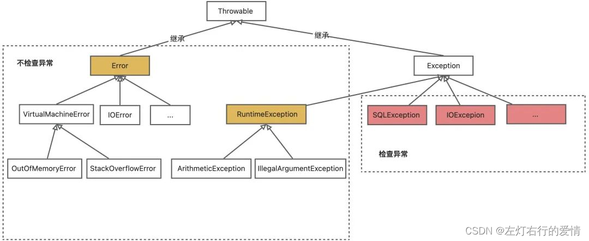  
 还有个扩展图:

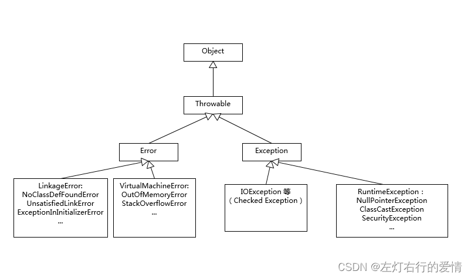

Throwable它是Java语言中所有错误或者异常的超类.  
 它的下一层为Error和Exception.  
 为什么这么分呢  
 主要是在于它们所表示的问题类型以及程序处理问题方式.

Error  
 问题类型:指Java运行时系统的内部错误和资源耗尽错误.应用程序并不会抛出该类对象.  
 (绝大部分的 Error 都会导致程序（比如 JVM 自身）处于非正常的、不可恢复状态。既然是非正常情况，所以不便于也不需要捕获，常见的比如 OutOfMemoryError 之类，都是 Error 的子类。)  
 处理方式:主要是由Java虚拟机负责的，因为它们通常表示严重的问题如果出现该类情况,告知用户,剩下的就是尽力让程序安全的终止.

Exception

* 受检异常

问题类型:编译时需要处理的异常  
 处理方式:需要通过try-catch块或者向上抛出throws来处理的异常.一般编译器会强制去捕获此类异常

**举例子**  
 一般包括几个方面:

1. 想在文件尾部读取数据
2. 想打开一个错误格式的URL
3. 想根据字符串查找Class对象,而这个字符串表示的类不存在

```
public class CheckedExceptionExample {
    public static void main(String[] args) throws IOException {
        // 1. 想在文件尾部读取数据
        try (BufferedReader br = new BufferedReader(new FileReader("file.txt"))) {
            String line;
            while ((line = br.readLine()) != null) {
                System.out.println(line);
            }
        } catch (FileNotFoundException e) {
            System.out.println("File not found: " + e.getMessage());
        }

        // 2. 想打开一个错误格式的URL
        try {
            new URL("some invalid url");
        } catch (MalformedURLException e) {
            System.out.println("Malformed URL: " + e.getMessage());
        }

        // 3. 想根据字符串查找Class对象,而这个字符串表示的类不存在
        try {
            Class.forName("some.invalid.Class");
        } catch (ClassNotFoundException e) {
            System.out.println("Class not found: " + e.getMessage());
        }
    }
}


```

* 非受检异常  
   问题类型: 开发时出现的异常和错误,通常是由程序逻辑引起的.  
   处理方式:这些异常不需要显示进行处理,我们可以选择捕获并处理它们.

自定义非受检异常:  
 自定义非检查异常只需要继承 RuntimeException 即可.

**举例**

1. 空指针异常
2. 栈溢出

```
public class UncheckedExceptionExample {
    public static void main(String[] args) {
        // 1. 空指针异常
        String str = null;
        try {
            System.out.println(str.length());
        } catch (NullPointerException e) {
            System.out.println("NullPointerException caught: " + e.getMessage());
        }

        // 2. - 例如 StackOverflowError
        try {
            recursiveMethod(0);
        } catch (StackOverflowError e) {
            System.out.println("StackOverflowError caught: " + e.getMessage());
        }
    }

    private static void recursiveMethod(int i) {
        System.out.println("Recursive method called: " + i);
        recursiveMethod(i + 1);
    }
}


```

自定义非受检异常  
 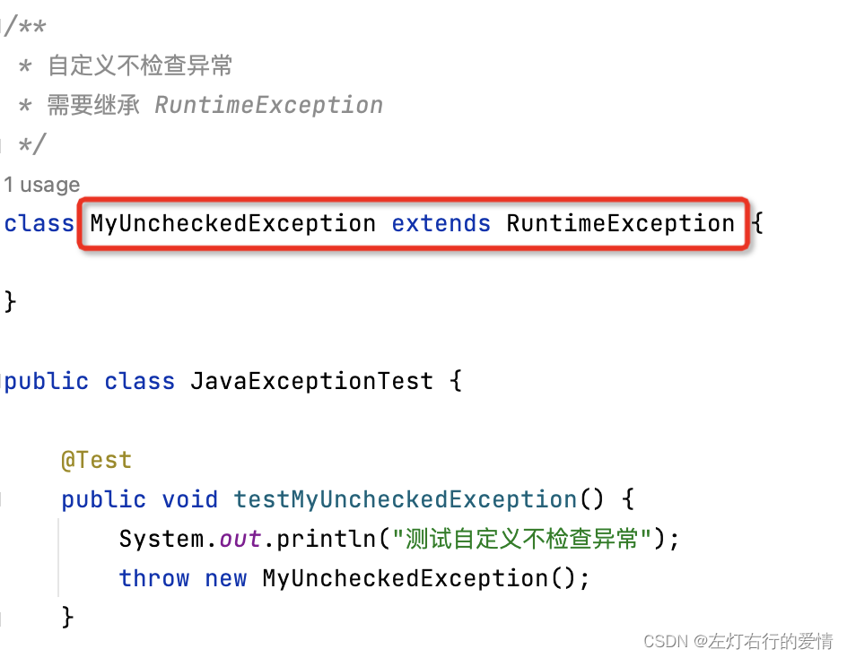

#### 细节分析

分析Exception和Error的区别,是从概念角度考察Java处理机制.  
 但我们还需要掌握两个方面:  
 一: 理解Throwable,Exception,Error的设计与分类  
 比如掌握应用最广泛的子类,以及如何自定义异常等.  
 这里给出一道入门题目:  
 NoClassDefFoundError 和 ClassNotFoundException 有什么区别?

回答:  
 NoClassDefFoundError 是个Error，是指一个class在编译时存在，在运行时找不到了class文件了；  
 ClassNotFoundException 是个Exception，是使用类似Class.foName()等方法时的checked exception。

二:理解Java语言中操作Throwable的元素和实践.  
 掌握最基本的语法,如try-catch-finally块,throw,throws关键字等.

异常处理代码比较繁琐,比如:

1. 写很多千篇一律的捕获代码
2. finally里面做一些资源回收的工作.

为了更加便利,Java引入了一些特性:  
 **multiple catch**  
 应用场景:有时当我们调用一段处理时，需要同时捕获多个异常，但是我们对这些异常处理的代码是相同的  
 比如:

```
FileInputStream fis = new FileInputStream(file);
try {
  // do something
} finally {
  fis.close();
}


```

可以等价为:

```
try (FileInputStream fis = new FileInputStream(file)) {
  // do something
}


```

**try-with-resources:**  
 应用场景:  
 当处理某些资源的时候，通常都会在finally里面做一些资源回收的工作。  
 比如:

```
try {
  // do something
} catch (AException e) {
  throw new MyException(e);
} catch (BException e) {
  throw new MyException(e);
}


```

可以等价为:

```
try {
  // do something
} catch (AException | BException e) {
  throw new MyException(e);
}


```

#### 异常的处理方式

有两种处理方式:

* 遇到问题不具体处理,而是抛出给调用者  
   抛出异常有三种方式

1. throw
2. throws
3. 系统自动抛异常  
    **举例子**

```
public static void main(String[] args) { 
 String s = "abc"; 
 if(s.equals("abc")) { 
 throw new NumberFormatException(); 
 } else { 
 System.out.println(s); 
 } 
} 
int div(int a,int b) throws Exception{
   return a/b;
}


```

* try catch 捕获异常针对性处理方式  
   举例子:

```
public static void main(String[] args) {
        // 1. 空指针异常
        String str = null;
        try {
            System.out.println(str.length());
        } catch (NullPointerException e) {
            System.out.println("NullPointerException caught: " + e.getMessage());
        }
}


```

我有点好奇,Throw和throws有什么区别呢?

它们主要是位置不同,功能不同

**位置不同**  
 throws用在函数上,后面跟的是异常类,可以跟多个;而throw用在函数内,后面跟的是异常对象.  
 **功能不同**

1. throws用来声明异常,让调用者明白功能可能出现的问题,可以给出预先的处理方式;而throw抛出具体的问题对象,执行到throw,功能就已经结束了,跳转到调用者,并将具体的问题对象抛给调用者.(所以正如上面所提到的,当throw语句独立存在时,下面定义其他语句没有意义,因为执行不到.)
2. throws表示出现异常的一种可能性,并不一定会发生这些异常;throw则是抛出了异常,执行throw则一定抛出了某种异常对象.

它们也有相同的点,它们都是比较消极的处理异常的方式,只是抛出或者可能抛出异常,但是不会由函数去处理异常,真正的处理异常由函数的上层调用处理.

### 字节码层面分析异常处理

通过字节码层面的分析可以让我们对try-catch-finally有更深入的认识.

#### try-catch-finally的本质是什么

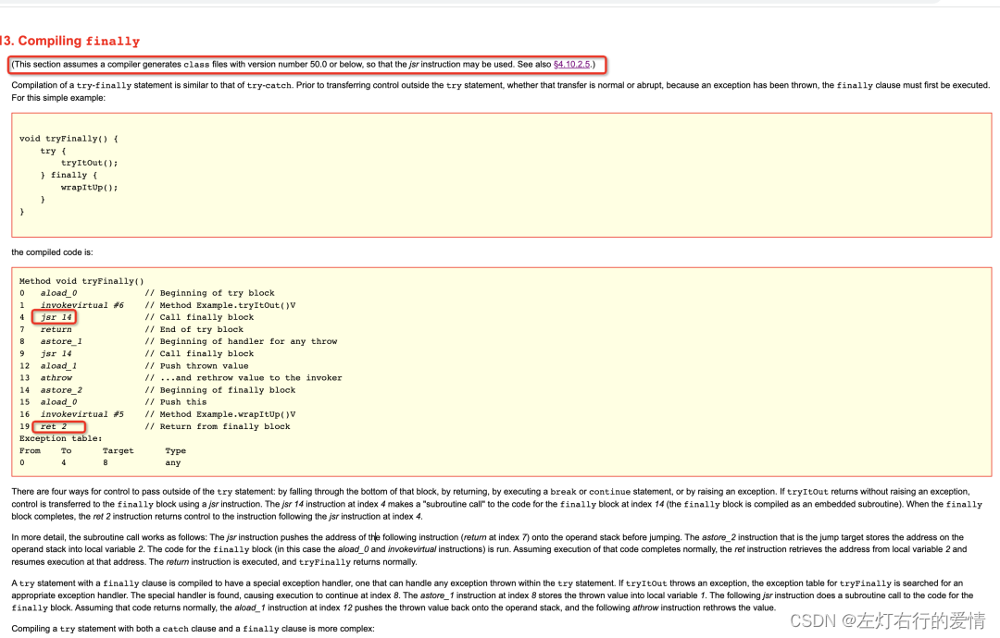  
 **前置知识:**  
 jsr指令: 全称Jump to Subroutine .作用为:跳转到一个子例程.  
 ret指令: 全称Return form Subroutine.作用为:从子例程到调用搜者.  
 从官方图可以看到,在JDK1.6及其以前的编译器生成时,可以使用jsr和ret指令.  
 但是如果你现在去Idea 中通过 jclasslib 插件查看 try-catch-finally 的字节码文件,你会发现并没有 jsr/ret 指令.  
 因为在JDK1.6之后的javac就不生成jsr/ret指令了.  
 原因是:  
 jsr/ret机制最初用于实现finally块,但是最后发现节省代码大小并不值得额外的复杂性,因此就被淘汰了.

那finally如何实现呢?  
 很简单嘛,那就不节省代码了,直接把finally块的内容复制到原本每个jsr指令所在的地方(就是这么简单粗暴= =).  
 带来的影响就是字节码大小会膨胀,但是降低了字节码的复杂性(因为减少了两个字节码指令)

下面我们根据几个案例来深入理解  
 **案例一: try-catch 字节码分析**  
 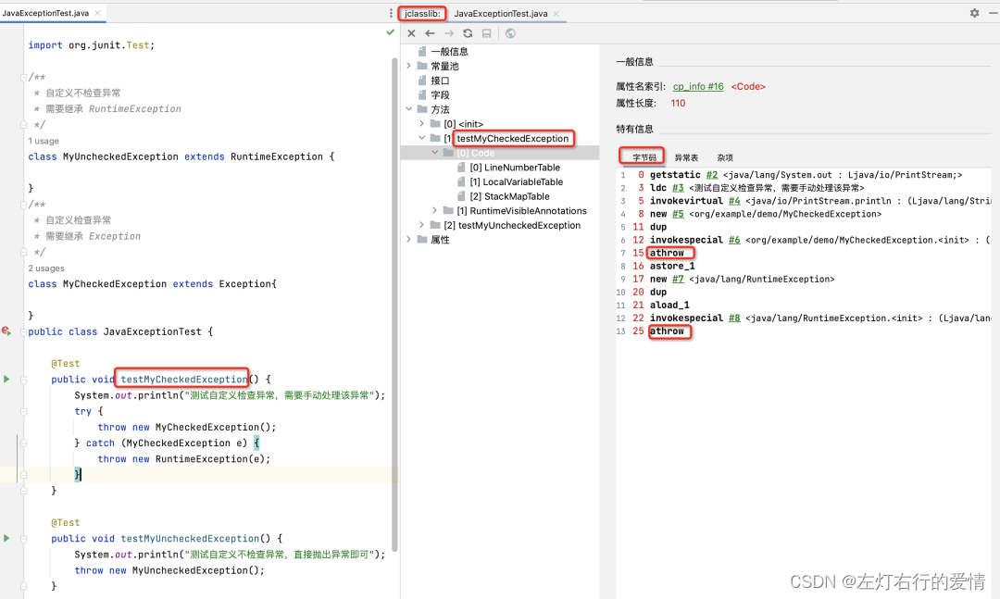  
 这里我们先说明athrow指令的作用:  
 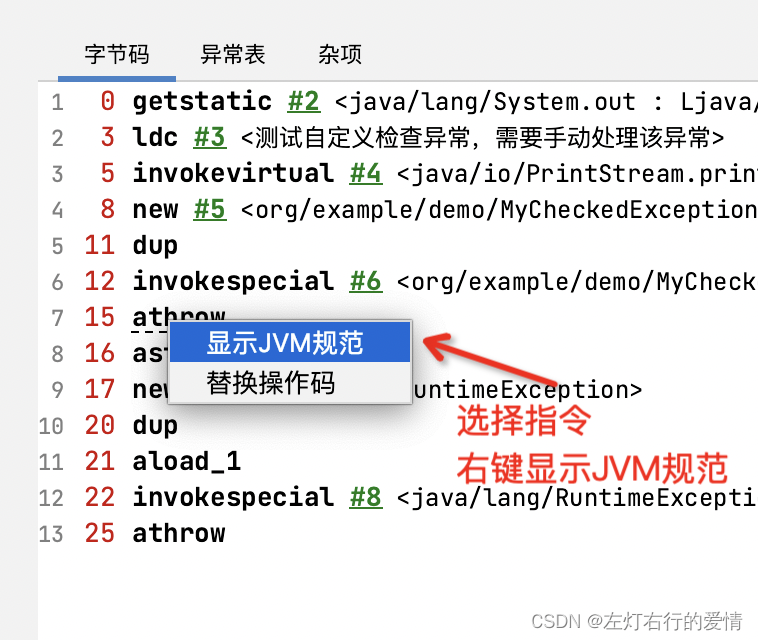  
 **athrow指令**  
 Java程序中显示抛出异常的操作(throw语句)都是由athrow指令来实现的.  
 athrow指令抛出的objectref(对象的引用)必须是类型引用,以便在异常处理过程中识别和操作这个异常对象.  
 它从操作数堆栈中弹出,然后通过在当前方法的异常表中搜索与objectref类匹配的第一个异常处理程序  
 这里有三种情况需要注意:

1. 如果在异常表中找到与objectref类匹配的异常处理程序,PC寄存器会重置到处理此异常代码的位置,然后清除当前帧的操作数堆栈,objectref也会被推回操作数堆栈,执行继续.
2. 当前没有找到匹配的异常处理程序,则弹出该栈帧,该异常会抛给上层调用方法.这里注意一下特殊情况,即如果是一个同步方法的话,那么同步方法内部抛出异常后,该同步异常相关的监视器也会被正确释放,以确保其他线程有机会获取这个对象锁(避免抛出异常导致资源泄露或死锁问题).
3. 如果所有栈帧弹出前都没有找到合适的异常处理程序,这个线程将终止.

**异常表**  
 用来记录程序计数器的位置和异常类型,如下图所示:  
 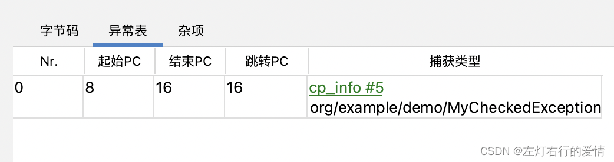

图中表示的意思:  
 如果8-16(不包括16)行之间的指令抛出异常匹配MyCheckedException 类型的异常,那么程序跳到16的位置继续执行.  
 分析上图中的字节码:  
 第一个 athrow 指令抛出 MyCheckedException 异常到操作数栈顶，然后去到异常表中查找是否有对应的类型，异常表中有 MyCheckedException ，然后跳转到 16 继续执行代码。  
 第二个 athrow 指令抛出 RuntimeException 异常，然后在异常表中没有找到匹配的类型，当前方法强制结束并弹出当前栈帧，该异常重新抛给调用者，任然没有找到匹配的处理器，该线程被终止。

**案例二: try-catch-finally 字节码分析**  
 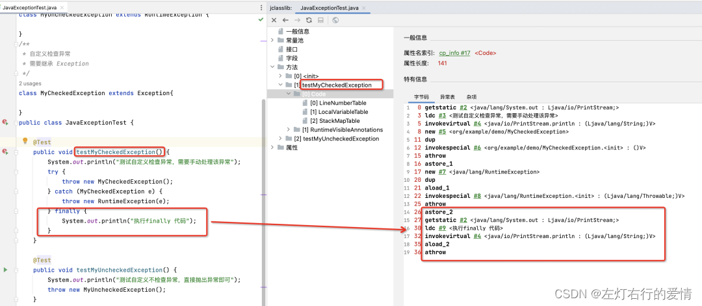  
 异常表信息如下:  
 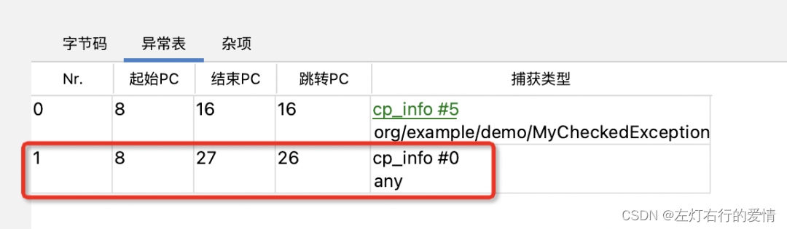  
 finally代码块后,在异常表中新增了一条记录,捕获类型为any.  
 解释一下这条记录:  
 在 8 到 27（不包括27） 之间的指令执行过程中，抛出或者返回任何类型的结果都会跳转到 26 继续执行。

从上图的字节码中可以看到,字节码索引为 26 后到结束的指令都是 finally 块中的代码,再解释一下finally块的字节码指令的含义，从 25 开始介绍，finally 块的代码是从 26 开始的：

```
 // 匹配到异常表中的异常 any，清空操作数栈，将 RuntimeExcepion 的引用添加到操作数栈顶
25 athrow 

// 将栈顶的引用保存到局部变量表索引为 2 的位置
26 astore_2  

// 获取类的静态字段引用放在操作数栈顶
27 getstatic #2 <java/lang/System.out : Ljava/io/PrintStream;> 

//将字符串的放在操作数栈顶
30 ldc #9 <执行finally 代码>

// 调用方法
32 invokevirtual #4 <java/io/PrintStream.println : (Ljava/lang/String;)V>

// 将局部变量表索引为 2 到引用放到操作数栈顶，这里就是前面抛出的RuntimeExcepion 的引用
35 aload_2

// 在异常表中没有找到对应的异常处理程序，弹出该栈帧，该异常会重新抛给上层调用的方法
36 athrow


```

**案例三: finally 块中的代码为什么总是会执行**  
 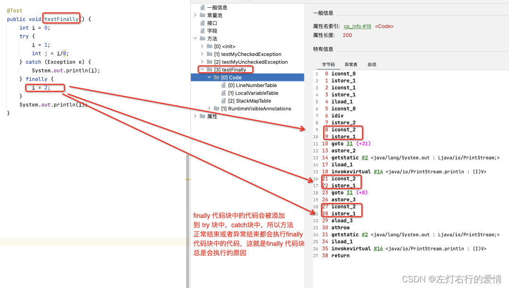  
 异常表:  
 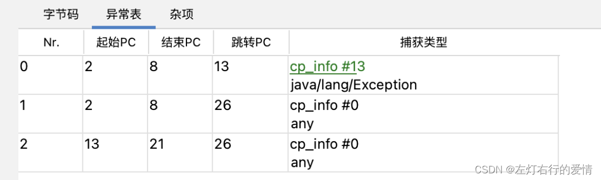  
 我们来简单分析一下上面代码的字节码指令:  
 字节码指令 2 到 8 会抛出 ArithmeticException 异常，该异常是 Exception 的子类，正好匹配异常表中的第一行记录，然后跳转到 13 继续执行，也就是执行 catch 块中的代码，然后执行 finally 块中的代码，最后通过 goto 31 跳转到 finally 块之外执行后续的代码。

如果 try 块中没有抛出异常，则执行完 try 块中的代码然后继续执行 finally 块中的代码，因为编译器在编译的时候将 finally 块中的代码添加到了 try 块代码后面，执行完 finally 的代码后通过 goto 31 跳转到 finally 块之外执行后续的代码 。

编译器会将 finally 块中的代码放在 try 块和 catch 块的末尾，所以 finally 块中的代码总是会执行。

**案例四:finally 块中使用 return 字节码分析**

```
public int getInt() {
    int i = 0;
    try {
        i = 1;
        return i;
    } finally {
        i = 2;
        return i;
    }
}

public int getInt2() {
    int i = 0;
    try {
        i = 1;
        return i;
    } finally {
        i = 2;
    }
}


```

我们先分析一下getInt()方法的字节码:  
 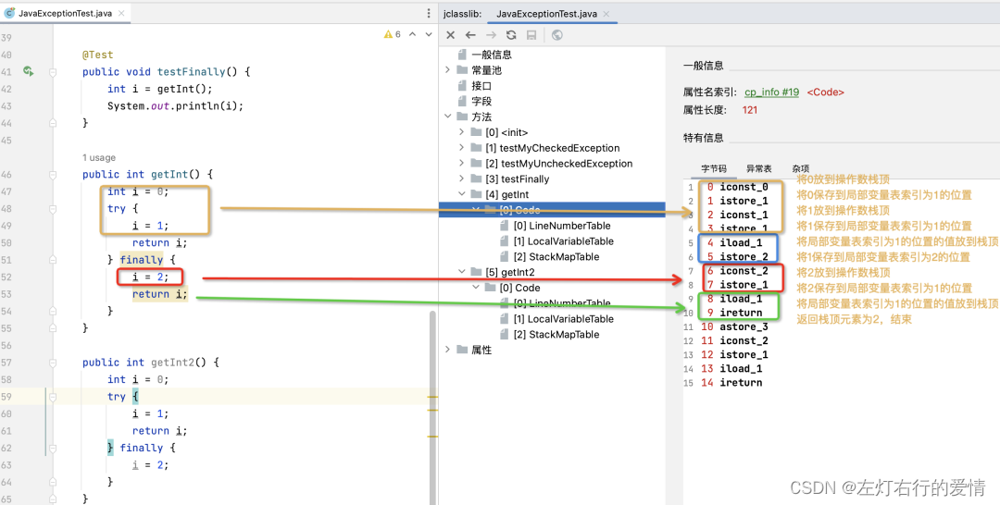  
 局部变量表:  
 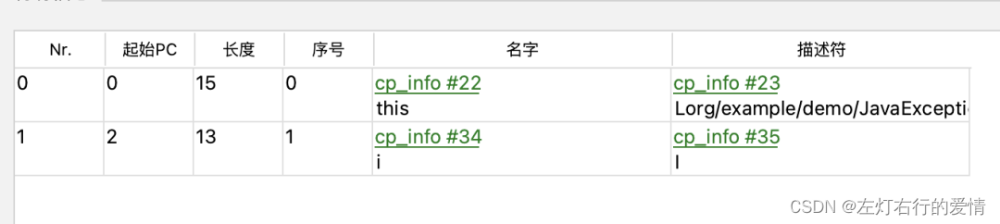  
 异常表:  
 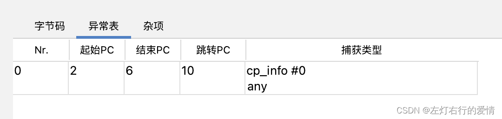  
 我们可以看出,如果finally块中有return关键字,那么try块以及catch块中的return都会失效,所以开发过程中不应该在finally块中写return语句.

再分析一下getInt2()方法的字节码:  
 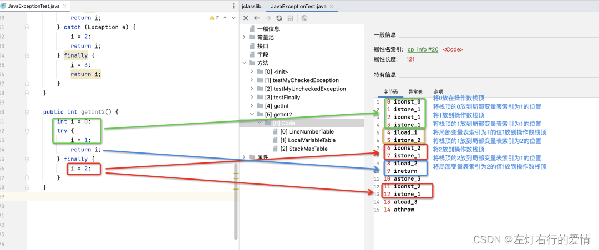  
 异常表:  
 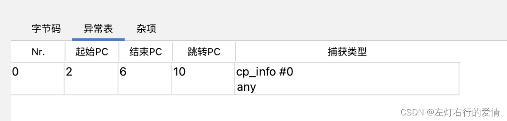  
 从上面的字节码可以看到,虽然执行了finally块中的代码，但是返回的值还是 1，这是因为在执行finally代码块之前，将原来局部变量表索引为 1 的值 1 保存到了局部变量表索引为 2 的位置，最后返回到是局部变量表索引为 2 的值，也就是原来的 1。

所以,如果finally块中没有return语句,那么无论在finally代码块中是否修改返回值,返回值都不会改变,仍然是执行finally代码块之前的值.

#### try-with-resources的本质

下面通过一个打包文件的代码来演示说明一下 try-with-resources 的本质：

```
 /**
     * 打包多个文件为 zip 格式
     *
     * @param fileList 文件列表
     */
    public static void zipFile(List<File> fileList) {
        // 文件的压缩包路径
        String zipPath = OUT + "/打包附件.zip";
        // 获取文件压缩包输出流
        try (OutputStream outputStream = new FileOutputStream(zipPath);
             CheckedOutputStream checkedOutputStream = new CheckedOutputStream(outputStream, new Adler32());
             ZipOutputStream zipOut = new ZipOutputStream(checkedOutputStream)) {
            for (File file : fileList) {
                // 获取文件输入流
                InputStream fileIn = new FileInputStream(file);
                // 使用 common.io中的IOUtils获取文件字节数组
                byte[] bytes = IOUtils.toByteArray(fileIn);
                // 写入数据并刷新
                zipOut.putNextEntry(new ZipEntry(file.getName()));
                zipOut.write(bytes, 0, bytes.length);
                zipOut.flush();
            }
        } catch (FileNotFoundException e) {
            System.out.println("文件未找到");
        } catch (IOException e) {
            System.out.println("读取文件异常");
        }
    }


```

可以看到try()的括号中定义需要关闭的资源,实际上是Java的一种语法糖,查看编译后的代码就知道编译器为我们做了什么,下面是反编译的代码:

```
    public static void zipFile(List<File> fileList) {
        String zipPath = "./打包附件.zip";

        try {
            OutputStream outputStream = new FileOutputStream(zipPath);
            Throwable var3 = null;

            try {
                CheckedOutputStream checkedOutputStream = new CheckedOutputStream(outputStream, new Adler32());
                Throwable var5 = null;

                try {
                    ZipOutputStream zipOut = new ZipOutputStream(checkedOutputStream);
                    Throwable var7 = null;

                    try {
                        Iterator var8 = fileList.iterator();

                        while(var8.hasNext()) {
                            File file = (File)var8.next();
                            InputStream fileIn = new FileInputStream(file);
                            byte[] bytes = IOUtils.toByteArray(fileIn);
                            zipOut.putNextEntry(new ZipEntry(file.getName()));
                            zipOut.write(bytes, 0, bytes.length);
                            zipOut.flush();
                        }
                    } catch (Throwable var60) {
                        var7 = var60;
                        throw var60;
                    } finally {
                        if (zipOut != null) {
                            if (var7 != null) {
                                try {
                                    zipOut.close();
                                } catch (Throwable var59) {
                                    var7.addSuppressed(var59);
                                }
                            } else {
                                zipOut.close();
                            }
                        }

                    }
                } catch (Throwable var62) {
                    var5 = var62;
                    throw var62;
                } finally {
                    if (checkedOutputStream != null) {
                        if (var5 != null) {
                            try {
                                checkedOutputStream.close();
                            } catch (Throwable var58) {
                                var5.addSuppressed(var58);
                            }
                        } else {
                            checkedOutputStream.close();
                        }
                    }

                }
            } catch (Throwable var64) {
                var3 = var64;
                throw var64;
            } finally {
                if (outputStream != null) {
                    if (var3 != null) {
                        try {
                            outputStream.close();
                        } catch (Throwable var57) {
                            var3.addSuppressed(var57);
                        }
                    } else {
                        outputStream.close();
                    }
                }

            }
        } catch (FileNotFoundException var66) {
            System.out.println("文件未找到");
        } catch (IOException var67) {
            System.out.println("读取文件异常");
        }

    }


```

JDK1.7开始，java引入了 try-with-resources 声明，将 try-catch-finally 简化为 try-catch，在编译时会进行转化为 try-catch-finally 语句，我们就不需要在 finally 块中手动关闭资源。  
 try-with-resources声明包含三部分:

1. try(声明需要关闭的资源)
2. try块
3. catch块  
    它要求在 try-with-resources 声明中定义的变量实现了 **AutoCloseable 接口**，这样在系统可以自动调用它们的close方法，从而替代了finally中关闭资源的功能，编译器为我们生成的异常处理过程如下：

* try块没有发生异常时,自动调用close方法
* try块发生异常,就自动调close方法;如果close也异常怎么办.这里注意:close方法的异常会在catch中通过调用Throwable.addSuppressed 来压制异常,而catch块只会捕捉try块抛出的异常.所以你要是想获取到压制异常的数组,可以在catch块中使用Throwable.getSuppressed 方法.

### Java异常处理不规范的案例

异常处理分为三个阶段:

1. 捕获
2. 传递
3. 处理  
    try…catch的作用: 捕获异常  
    throw 的作用: 将异常传递给合适的处理程序

这三步任何一个阶段处理不好,都会影响整个系统.

下面来看不规范的案例

**捕获不规范**

* 捕获时不区分异常类型

```
try{
    ……
} catch (Exception e){ // 不应对所有类型的异常统一捕获，应该抽象出业务异常和系统异常，分别捕获
    ……
}


```

* 捕获异常不完全,该捕获的异常类型没有捕获到

**传递**

* 异常信息丢失
* 异常信息转义错误,比如抛出异常时将业务异常包装成系统异常
* 吃掉异常
* 不必要的异常包装
* 检查异常传递过程中不适用费检查异常包装,造成代码被throws污染

```
try{
    ……
} catch (BIZException e){ 
    throw new BIZException(e); // 重复包装同样类型的异常信息 
} catch (Biz1Exception e){ 
    throw new BIZException(e.getMessage()); // 没有抛出异常栈信息，正确的做法是throw new BIZException(e); 
} catch (Biz2Exception e){
    throw new Exception(e); // 不能使用低抽象级别的异常去包装高抽象级别的异常，这样在传递过程中丢失了异常类型信息
} catch (Biz3Exception e){
    throw new Exception(……); // 异常转译错误，将业务异常直接转译成了系统异常
} catch (Biz4Exception e){
    …… // 不抛出也不记Log，直接吃掉异常
} catch (Exception e){
    throw e;
}


```

**处理**

* 重复处理
* 处理方式不统一
* 处理位置分散

```
try{
    try{
        try{
            ……
        } catch (Biz1Exception e){
            log.error(e);  // 重复的LOG记录
            throw new e;
        }
        try{
            ……
        } catch (Biz2Exception e){
            ……  // 同样是业务异常，既在内层处理，又在外层处理
        }
    } catch (BizException e){
        log.error(e); // 重复的LOG记录
        throw e;
    }
} catch (Exception e){
    // 通吃所有类型的异常
    log.error(e.getMessage(),e);
}


```

#### 日常开发不规范案例

##### 案例一

下面代码反映了异常处理中哪些不当之处?

```
try {
  // 业务代码
  // …
  Thread.sleep(1000L);
} catch (Exception e) {
  // Ignore it
}


```

回答:  
 这段代码虽然很短，但是已经违反了异常处理的两个基本原则。  
 第一: 尽量不要捕获类似Exception这样的通用异常,而是应该捕获特定异常,上面例子中我们捕获的应该是InterruptedException。  
 第二: 不要生吞异常,这很可能会导致非常难以诊断的诡异情况.

##### 案例二

```
try {
   // 业务代码
   // …
} catch (IOException e) {
    e.printStackTrace();
}


```

这段代码作为一段实验代码，它是没有任何问题的，但是在产品代码中，通常都不允许这样处理。你先思考一下这是为什么呢？

回答:

1. 我们先来看看printStackTrace()的文档，开头就是`“Prints this throwable and its backtrace to the standard error stream”`。问题就在这里，在稍微复杂一点的生产系统中，标准出错（STERR）不是个合适的输出选项，因为你很难判断出到底输出到哪里去了。
2. 标准输出错误，内部含有synchronized代码块。锁的是System.err这个静态变量。 因此，多个e.printStackTrace()会争抢锁，其它线程等待，会比较慢.
3. 部署到Linux中，产生的日志信息可读性差

对于回答1可能会有点没明白,我们举个例子就好了:

```
public class TestPrintStackTrace {

    public static void main(String[] args) {
        try {
            System.out.println("异常前");
            exception();
        }catch (Exception e){
            e.printStackTrace();
        }
        System.out.println("异常后");
    }

    public static void exception() throws Exception{
        System.out.println("异常发生");
        throw new Exception();
    }
}


```

那么上面代码可能会出现几种打印情况:  
 情况1:

```
java.lang.Exception
	at com.fang.java.exception.Test.exception(Test.java:24)
异常前
	at com.fang.java.exception.Test.main(Test.java:14)
异常发生
异常后


```

情况2:

```
异常前
异常发生
异常后
java.lang.Exception
	at com.fang.java.exception.TestPrintStackTrace.exception(TestPrintStackTrace.java:24)
	at com.fang.java.exception.TestPrintStackTrace.main(TestPrintStackTrace.java:14)


```

情况3:

```
java.lang.Exception
异常前
	at com.fang.java.exception.TestPrintStackTrace.exception(TestPrintStackTrace.java:24)
	at com.fang.java.exception.TestPrintStackTrace.main(TestPrintStackTrace.java:14)
异常发生
异常后


```

printStackTrace()打印出的堆栈日志跟正常输出或者业务代码执行日志是交错混合在一起的,所以非常不便于查看.

##### 案例三

```
public void readPreferences(String fileName){
   //...perform operations... 
  InputStream in = new FileInputStream(fileName);
   //...read the preferences file...
}


```

### Java异常处理规范案例

#### 阿里巴巴Java异常处理制约

1. Java 类库中定义的一类 RuntimeException 可以通过预先检查进行规避，而不应该通过 catch 来处理.比如: IndexOutOfBoundsException ， NullPointerException 等等。  
    注意: 无法通过预检查的异常除外,比如在外部传来字符串形式的数字时,我们要通过`catch NumberFormatException` 来实现。  
    举例:

```
//正例 : 
if (obj != null) {...}
//反例 :
 try { obj.method() } catch (NullPointerException e) {...}


```

2. 异常不要用来做流程控制,条件控制,因为异常的处理效率比条件分支低.  
    举例:

```
// 不推荐的做法：异常用于条件控制
try {
    // 可能会抛出异常的代码
    if (someCondition) {
        throw new CustomException("Some error occurred");
    }
    // 其他逻辑
} catch (CustomException e) {
    // 处理异常的逻辑
}
// 推荐的做法：条件控制使用条件语句
if (someCondition) {
    // 处理条件为真的逻辑
} else {
    // 处理条件为假的逻辑
}


```

下面解释一下为什么会低.  
 a. 异常的抛出和捕获涉及更多的处理步骤.当抛出异常时,系统需要收集异常的堆栈信息,创建异常对象,并查找相对应的catch块来处理异常.这些步骤会导致性能开销.  
 b. 条件分支通常只涉及简单的逻辑判断,因此执行效率更高  
 而且本质来说,异常就应该专门用于处理异常情况,例如错误或意外情况,而不应该用于控制程序的正常流程.

3. 不要对大段代码进行try-catch,这是不负责任的表现. catch时请分清稳定代码和非稳定代码.  
    说明: 稳定代码: 无论如何不会出错的代码.  
    对于非稳定代码的catch尽可能的进行区分异常类型,再做对应的异常处理.  
    例子:

```
public class ExceptionHandlingExample {
    public static void main(String[] args) {
        // 稳定代码示例
        try {
            int result = divide(10, 2);
            System.out.println("Result: " + result);
        } catch (ArithmeticException e) {
            System.out.println("Divide by zero error: " + e.getMessage());
        }

        // 非稳定代码示例
        try {
            String str = null;
            System.out.println("Length of string: " + getStringLength(str));
        } catch (NullPointerException e) {
            System.out.println("Null pointer exception: " + e.getMessage());
        } catch (Exception e) {
            System.out.println("An unexpected error occurred: " + e.getMessage());
        }
    }

    // 稳定代码：除法操作
    public static int divide(int dividend, int divisor) {
        return dividend / divisor;
    }

    // 非稳定代码：获取字符串长度
    public static int getStringLength(String str) {
        return str.length();
    }
}


```

4. 捕获异常是为了处理它，不要捕获了却什么都不处理而抛弃之，如果不想处理它，请将该异常抛给它的调用者。最外层的业务使用者，必须处理异常，将其转化为用户可以理解的内容。  
    举例:

```
public class ExceptionHandlingExample {
    public static void main(String[] args) {
        try {
            // 调用业务逻辑方法
            performBusinessLogic();
        } catch (BusinessLogicException e) {
            // 如果业务逻辑方法抛出异常，则在最外层负责捕获并处理
            System.out.println("An error occurred while performing business logic: " + e.getMessage());
            // 将异常信息转化为用户可以理解的内容并反馈给用户
            displayErrorMessageToUser("An unexpected error occurred. Please try again later.");
        }
    }

    // 业务逻辑方法
    public static void performBusinessLogic() throws BusinessLogicException {
        try {
            // 可能会抛出异常的业务逻辑代码
            processOrder();
        } catch (DataAccessException e) {
            // 如果当前方法无法处理该异常，则将其抛给调用者处理
            throw new BusinessLogicException("Error processing order", e);
        }
    }

    // 处理订单的方法
    public static void processOrder() throws DataAccessException {
        // 一些可能会引发DataAccessException的代码
        if (someCondition) {
            throw new DataAccessException("Error accessing data");
        }
    }

    // 将异常信息转化为用户可以理解的内容并反馈给用户的方法
    public static void displayErrorMessageToUser(String message) {
        // 将错误信息显示给用户的代码
        System.out.println("Error message displayed to user: " + message);
    }
}

// 自定义业务逻辑异常
class BusinessLogicException extends Exception {
    public BusinessLogicException(String message, Throwable cause) {
        super(message, cause);
    }
}

// 自定义数据访问异常
class DataAccessException extends Exception {
    public DataAccessException(String message) {
        super(message);
    }
}


```

5. 有 try 块放到了事务代码中，catch 异常后，如果需要回滚事务，一定要注意手动回滚事务。  
    举例:

```
Connection connection = null;
try {
    // 获取数据库连接并设置自动提交为false，开启事务
    connection = DriverManager.getConnection("jdbc:mysql://localhost:3306/mydb", "username", "password");
    connection.setAutoCommit(false);

    // 执行事务操作
    // ...

    // 提交事务
    connection.commit();
} catch (SQLException e) {
    // 出现异常时手动回滚事务
    if (connection != null) {
        try {
            connection.rollback();
        } catch (SQLException rollbackEx) {
            System.out.println("Rollback failed: " + rollbackEx.getMessage());
        }
    }
    System.out.println("An error occurred: " + e.getMessage());
} finally {
    // 关闭连接
    if (connection != null) {
        try {
            connection.close();
        } catch (SQLException closeEx) {
            System.out.println("Error while closing connection: " + closeEx.getMessage());
        }
    }
}


```

6. 不能在 finally 块中使用 return，finally 块中的 return 返回后方法结束执行，不会再执行 try 块中的 return 语句。
7. 捕获异常与抛异常，必须是完全匹配，或者捕获异常是抛异常的父类。  
    说明 : 如果预期对方抛的是绣球，实际接到的是铅球，就会产生意外情况。
8. 定义时区分 unchecked / checked 异常，避免直接抛出 new RuntimeException()，更不允许抛出 Exception 或者 Throwable，应使用有业务含义的自定义异常。推荐业界已定义过的自定义异常，如: DAOException / ServiceException 等。

```
// 自定义DAOException
public class DAOException extends Exception {
    public DAOException(String message) {
        super(message);
    }
}

// 数据访问层
public class DataLayer {
    public void fetchData() throws DAOException {
        try {
            // 一些数据访问操作
            // ...
            if (errorCondition) {
                throw new DAOException("Error fetching data from the database");
            }
        } catch (SQLException e) {
            // 捕获数据库访问异常并抛出DAOException
            throw new DAOException("Error accessing database", e);
        }
    }
}

// 业务逻辑层
public class BusinessLayer {
    private DataLayer dataLayer;

    public BusinessLayer() {
        this.dataLayer = new DataLayer();
    }

    public void performBusinessLogic() throws DAOException {
        try {
            dataLayer.fetchData();
            // 其他业务逻辑
        } catch (DAOException e) {
            // 捕获DAOException并处理
            throw new DAOException("Error in business logic", e);
        }
    }
}

// 应用层
public class Application {
    public static void main(String[] args) {
        BusinessLayer businessLayer = new BusinessLayer();
        try {
            businessLayer.performBusinessLogic();
        } catch (DAOException e) {
            // 处理DAOException
            System.out.println("An error occurred in the application: " + e.getMessage());
        }
    }
}


```

#### 异常处理最佳实践

1. 使用try-with-resource关闭资源
2. 抛出具体的异常而不是Exception,并在注释中使用@throw进行说明
3. 捕获异常后使用描述性语言记录错误信息,如果是调用外部服务最好是包括入参和出参

```
logger.error("说明信息，异常信息：{}", e.getMessage(), e)


```

4. 有限捕获具体异常
5. 不要捕获Throwable异常,除非有特殊情况
6. 不要忽略异常,异常捕获一定需要处理
7. 不要同时记录和抛出异常，因为异常会打印多次.正确的处理方式要么抛出异常要么记录异常，如果抛出异常，不要原封不动的抛出，可以自定义异常抛出。
8. 自定义异常不要丢弃原有异常,应该将原始异常传入自定义异常中

```
throw MyException("my exception", e);


```

9. 自定义异常尽量不要使用检查异常。
10. 尽可能晚的捕获异常，如非必要，建议所有的异常都不要在下层捕获，而应该由最上层捕获并统一处理这些异常
11. 为了避免重复输出异常日志，建议所有的异常日志都统一交由最上层输出。就算下层捕获到了某个异常，如非特殊情况，也不要将异常信息输出，应该交给最上层统一输出日志。

### 项目中异常处理实践

#### 如何自定义异常

Java体系中定义了很多异常,但通常都是技术层面的异常,对于应用程序来说更多出现的是业务相关的异常(下面举几个例子):

1. 用户输入了一些不合法的参数
2. 用户没有登录  
    我们通过异常来对不同的业务问题进行分类,以便我们排查问题,所以需要自定义异常.  
    那么我们如何自定义异常呢?  
    **请注意我们前面提到的,不要定义检查异常,应该定义费检查异常(运行时异常)**  
    我们在应用程序中定义的异常应该分为两类:

* 业务异常:用户能看懂且可以处理.比如用户没登录,提示用户登录即可.
* 系统异常:用户看不懂需要程序员处理的异常.比如网络连接超时,需要程序员排查.  
   下面给出应用程序中异常体系分类:  
   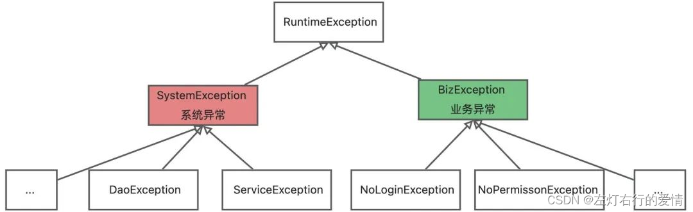  
   我们通常在遇到不符合预期的情况下，通过抛出异常来阻止程序继续运行.  
   在抛出对应的异常时，需要在异常对象中描述抛出该异常的原因以及异常堆栈信息,以便提示用户和开发人员如何处理该异常.

那么我们该如何自定义异常呢?  
 一般来说，异常的定义我们可以参考Java的其他异常定义就可以了，比如异常的构造方法,方法有哪些构造参数.  
 但是这样做自定义的话,只是通过异常的类名给异常进行一个分类.  
 我们还需要给异常描述信息进行完善,异常的描述信息只是一个字符串,如果可以的话,能添加一个错误码(code)是更好的.  
 添加错误码的好处有两点:

1. 和http请求中的状态码优点差不多
2. 提供翻译功能,不同的语言环境能够通过错误码找到对应语言的错误提示信息而不需要修改代码。

综上我们可以这样定义异常类:  
 首先定义一个描述异常信息的枚举类,对一些通用的异常信息可以在枚举中定义.  
 举例:

```
/**
 * 异常信息枚举类
 *
 */
public enum ErrorCode {
    /**
     * 系统异常
     */
    SYSTEM_ERROR("A000", "系统异常"),
    /**
     * 业务异常
     */
    BIZ_ERROR("B000", "业务异常"),
    /**
     * 没有权限
     */
    NO_PERMISSION("B001", "没有权限"),

    ;
    /**
     * 错误码
     */
    private String code;
    /**
     * 错误信息
     */
    private String message;

    ErrorCode(String code, String message) {
        this.code = code;
        this.message = message;
    }

    /**
     * 获取错误码
     *
     * @return 错误码
     */
    public String getCode() {
        return code;
    }

    /**
     * 获取错误信息
     *
     * @return 错误信息
     */
    public String getMessage() {
        return message;
    }

    /**
     * 设置错误码
     *
     * @param code 错误码
     * @return 返回当前枚举
     */
    public ErrorCode setCode(String code) {
        this.code = code;
        return this;
    }

    /**
     * 设置错误信息
     *
     * @param message 错误信息
     * @return 返回当前枚举
     */
    public ErrorCode setMessage(String message) {
        this.message = message;
        return this;
    }

}


```

然后自定义系统异常类,其他类型的异常类似,只是异常的类名不同,如下:

```
/**
 * 系统异常类
 *
 */
public class SystemException extends RuntimeException {


    private static final long serialVersionUID = 8312907182931723379L;
  /**
     * 错误码
     */
    private String code;

 

    /**
     * 构造一个没有错误信息的 <code>SystemException</code>
     */
    public SystemException() {
        super();
    }


    /**
     * 使用指定的 Throwable 和 Throwable.toString() 作为异常信息来构造 SystemException
     *
     * @param cause 错误原因， 通过 Throwable.getCause() 方法可以获取传入的 cause信息
     */
    public SystemException(Throwable cause) {
        super(cause);
    }

    /**
     * 使用错误信息 message 构造 SystemException
     *
     * @param message 错误信息
     */
    public SystemException(String message) {
        super(message);
    }

    /**
     * 使用错误码和错误信息构造 SystemException
     *
     * @param code    错误码
     * @param message 错误信息
     */
    public SystemException(String code, String message) {
        super(message);
        this.code = code;
    }

    /**
     * 使用错误信息和 Throwable 构造 SystemException
     *
     * @param message 错误信息
     * @param cause   错误原因
     */
    public SystemException(String message, Throwable cause) {
        super(message, cause);
    }

    /**
     * @param code    错误码
     * @param message 错误信息
     * @param cause   错误原因
     */
    public SystemException(String code, String message, Throwable cause) {
        super(message, cause);
        this.code = code;
    }

    /**
     * @param errorCode ErrorCode
     */
    public SystemException(ErrorCode errorCode) {
        super(errorCode.getMessage());
        this.code = errorCode.getCode();
    }

    /**
     * @param errorCode ErrorCode
     * @param cause     错误原因
     */
    public SystemException(ErrorCode errorCode, Throwable cause) {
        super(errorCode.getMessage(), cause);
        this.code = errorCode.getCode();
    }

    /**
     * 获取错误码
     *
     * @return 错误码
     */
    public String getCode() {
        return code;
    }


}


```

上面定义的 SystemException 类中定义了很多的构造方法，我这里只是给出一个示例，所以保留了不传入错误码的构造方法，建议保留不使用错误码的构造方法，可以提高代码的灵活性，因为错误码的规范也是一个值得讨论的问题，关于如何定义错误码在阿里巴巴开发规范手册中有介绍，这里不再详细说明。

#### 如何使用异常

前面介绍了如何自定义异常，接下来介绍一下如何使用异常，也就是什么时候抛出异常。  
 **异常可以看作方法的返回结果**,出现非预期的情况时,可以通过抛出异常来阻止程序继续执行.

那就有个问题了,什么时候抛出业务异常,什么时候抛出系统异常?  
 **业务异常（bizException/bussessException）：** 用户操作业务时,提示出来的异常信息.这些信息能直接让用户可以继续下一步操作，或者换一个正确操作方式去使用，换句话就是用户可以自己能解决的。比如：“用户没有登录”，“没有权限操作”。

\*\*系统异常（SystemException）：\*\*用户操作业务时,提示系统程序的异常信息,这类异常信息用户看不懂,需要通知程序员排查对应的问题,如NullPointerException，IndexOfException。  
 另一个情况就是 **接口对接时，参数的校验时提示出来的信息**，如：缺少ID，缺少必须的参数等，这类的信息对于客户来说也是看不懂的，也是解决不了的，所以我把这两类的错误应当统一归类于系统异常。

关于应该抛出业务异常还是系统异常，一句话总结就是：  
 **该异常用户能否处理，如果用户能处理则抛出业务异常，如果用户不能处理需要程序员处理则抛出系统异常。**

实战一下:  
 在调用第三方的 rpc 接口时，我们应该如何处理异常呢？

首先我们需要知道 rpc 接口抛出异常还是返回的包含错误码的 Result 对象,通过实际观察知道 rpc 的返回基本都是包含错误码的 Result 对象，所以这里以返回错误码的情况进行说明。  
 首先需要明确 rpc 调用失败应该返回系统异常，所以我们可以定义一个继承 SystemException 的 rpc 异常 RpcException，代码如下所示：

```
/**
 * rpc 异常类
 */
public class RpcException extends SystemException {


    private static final long serialVersionUID = -9152774952913597366L;

    /**
     * 构造一个没有错误信息的 <code>RpcException</code>
     */
    public RpcException() {
        super();
    }


    /**
     * 使用指定的 Throwable 和 Throwable.toString() 作为异常信息来构造 RpcException
     *
     * @param cause 错误原因， 通过 Throwable.getCause() 方法可以获取传入的 cause信息
     */
    public RpcException(Throwable cause) {
        super(cause);
    }

    /**
     * 使用错误信息 message 构造 RpcException
     *
     * @param message 错误信息
     */
    public RpcException(String message) {
        super(message);
    }

    /**
     * 使用错误码和错误信息构造 RpcException
     *
     * @param code    错误码
     * @param message 错误信息
     */
    public RpcException(String code, String message) {
        super(code, message);
    }

    /**
     * 使用错误信息和 Throwable 构造 RpcException
     *
     * @param message 错误信息
     * @param cause   错误原因
     */
    public RpcException(String message, Throwable cause) {
        super(message, cause);
    }

    /**
     * @param code    错误码
     * @param message 错误信息
     * @param cause   错误原因
     */
    public RpcException(String code, String message, Throwable cause) {
        super(code, message, cause);
    }

    /**
     * @param errorCode ErrorCode
     */
    public RpcException(ErrorCode errorCode) {
        super(errorCode);
    }

    /**
     * @param errorCode ErrorCode
     * @param cause     错误原因
     */
    public RpcException(ErrorCode errorCode, Throwable cause) {
        super(errorCode, cause);
    }

}


```

这个 RpcException 所有的构造方法都是调用的父类 SystemExcepion 的方法，所以这里不再赘述。  
 定义好了异常后接下来是处理 rpc 调用的异常处理逻辑，调用 rpc 服务可能会发生 ConnectException 等网络异常.  
 **我们并不需要在调用的时候捕获异常，而是应该在最上层捕获并处理异常**，调用 rpc 的处理demo代码如下：

```
private Object callRpc() {
    Result<Object> rpc = rpcDemo.rpc();
    log.info("调用第三方rpc返回结果为：{}", rpc);
    if (Objects.isNull(rpc)) {
        return null;
    }
    if (!rpc.getSuccess()) {
        throw new RpcException(ErrorCode.RPC_ERROR.setMessage(rpc.getMessage()));
    }
    return rpc.getData();
}


```

#### 如何处理异常

**我们应该尽可能晚的捕获异常，如非必要，建议所有的异常都不要在下层捕获，而应该由最上层捕获并统一处理这些异常。**

##### rpc 接口全局异常处理

对于 rpc 接口，我们这里将 rpc 接口的返回结果封装到包含错误码的 Result 对象中.  
 所以可以定义一个 aop 叫做 RpcGlobalExceptionAop，在 rpc 接口执行前后捕获异常，并将捕获的异常信息封装到 Result 对象中返回给调用者。  
 我们还要写一个RPC接口全局异常处理:

```
/**
 * Result 结果类
 *
 */
public class Result<T> implements Serializable {

    private static final long serialVersionUID = -1525914055479353120L;
    /**
     * 错误码
     */
    private final String code;
    /**
     * 提示信息
     */
    private final String message;
    /**
     * 返回数据
     */
    private final T data;
    /**
     * 是否成功
     */
    private final Boolean success;

    /**
     * 构造方法
     *
     * @param code    错误码
     * @param message 提示信息
     * @param data    返回的数据
     * @param success 是否成功
     */
    public Result(String code, String message, T data, Boolean success) {
        this.code = code;
        this.message = message;
        this.data = data;
        this.success = success;
    }

    /**
     * 创建 Result 对象
     *
     * @param code    错误码
     * @param message 提示信息
     * @param data    返回的数据
     * @param success 是否成功
     */
    public static <T> Result<T> of(String code, String message, T data, Boolean success) {
        return new Result<>(code, message, data, success);
    }

    /**
     * 成功，没有返回数据
     *
     * @param <T> 范型参数
     * @return Result
     */
    public static <T> Result<T> success() {
        return of("00000", "成功", null, true);
    }

    /**
     * 成功，有返回数据
     *
     * @param data 返回数据
     * @param <T>  范型参数
     * @return Result
     */
    public static <T> Result<T> success(T data) {
        return of("00000", "成功", data, true);
    }

    /**
     * 失败，有错误信息
     *
     * @param message 错误信息
     * @param <T>     范型参数
     * @return Result
     */
    public static <T> Result<T> fail(String message) {
        return of("10000", message, null, false);
    }

    /**
     * 失败，有错误码和错误信息
     *
     * @param code    错误码
     * @param message 错误信息
     * @param <T>     范型参数
     * @return Result
     */
    public static <T> Result<T> fail(String code, String message) {
        return of(code, message, null, false);
    }


    /**
     * 获取错误码
     *
     * @return 错误码
     */
    public String getCode() {
        return code;
    }

    /**
     * 获取提示信息
     *
     * @return 提示信息
     */
    public String getMessage() {
        return message;
    }

    /**
     * 获取数据
     *
     * @return 返回的数据
     */
    public T getData() {
        return data;
    }

    /**
     * 获取是否成功
     *
     * @return 是否成功
     */
    public Boolean getSuccess() {
        return success;
    }
}


```

在编写 aop 代码之前需要先导入 spring-boot-starter-aop 依赖：

```
<dependency>
    <groupId>org.springframework.boot</groupId>
    <artifactId>spring-boot-starter-aop</artifactId>
</dependency>


```

##### RpcGlobalExceptionAop

代码如下:

```
/**
 * rpc 调用全局异常处理 aop 类
 *
 */
@Slf4j
@Aspect
@Component
public class RpcGlobalExceptionAop {
    /**
     * execution(* com.xyz.service ..*.*(..))：表示 rpc 接口实现类包中的所有方法
     */
    @Pointcut("execution(* com.xyz.service ..*.*(..))")
    public void pointcut() {}

    @Around(value = "pointcut()")
    public Object handleException(ProceedingJoinPoint joinPoint) {
        try {
            //如果对传入对参数有修改，那么需要调用joinPoint.proceed(Object[] args)
            //这里没有修改参数，则调用joinPoint.proceed()方法即可
            return joinPoint.proceed();
        } catch (BizException e) {
            // 对于业务异常，应该记录 warn 日志即可，避免无效告警
            log.warn("全局捕获业务异常", e);
            return Result.fail(e.getCode(), e.getMessage());
        } catch (RpcException e) {
            log.error("全局捕获第三方rpc调用异常", e);
            return Result.fail(e.getCode(), e.getMessage());
        } catch (SystemException e) {
            log.error("全局捕获系统异常", e);
            return Result.fail(e.getCode(), e.getMessage());
        } catch (Throwable e) {
            log.error("全局捕获未知异常", e);
            return Result.fail(e.getMessage());
        }
    }

}


```

aop 中 @Pointcut 的 execution 表达式配置说明：

```
execution(public * *(..)) 定义任意公共方法的执行
execution(* set*(..)) 定义任何一个以"set"开始的方法的执行
execution(* com.xyz.service.AccountService.*(..)) 定义AccountService 接口的任意方法的执行
execution(* com.xyz.service.*.*(..)) 定义在service包里的任意方法的执行
execution(* com.xyz.service ..*.*(..)) 定义在service包和所有子包里的任意类的任意方法的执行
execution(* com.test.spring.aop.pointcutexp…JoinPointObjP2.*(…)) 定义在pointcutexp包和所有子包里的JoinPointObjP2类的任意方法的执行


```

##### http 接口全局异常处理

如果是SpringBoot项目,HTTP接口的异常处理主要分三类:

* 基于请求转发的方式处理异常；
* 基于异常处理器的方式处理异常；
* 基于过滤器的方式处理异常。

**基于请求转发的方式：** 真正的全局异常处理。  
 实现方式有：  
 • BasicExceptionController  
 **基于异常处理器的方式：** 不是真正的全局异常处理，因为它处理不了过滤器等抛出的异常。  
 实现方式有：  
 • @ExceptionHandler  
 • @ControllerAdvice+@ExceptionHandler  
 • SimpleMappingExceptionResolver  
 • HandlerExceptionResolver  
 **基于过滤器的方式：** 近似全局异常处理。它能处理过滤器及之后的环节抛出的异常。  
 实现方式有：  
 • Filter  
 关于 http 接口的全局异常处理，这里重点介绍基于异常处理器的方式，其余的方式建议查阅相关文档学习。  
 在介绍基于异常处理器的方式之前需要导入 spring-boot-starter-web 依赖即可，如下所示：

```
<dependency>
    <groupId>org.springframework.boot</groupId>
    <artifactId>spring-boot-starter-web</artifactId>
</dependency>


```

通过 @ControllerAdvice+@ExceptionHandler 实现基于**异常处理器的http接口全局异常处理：**

```
/**
* http 接口异常处理类
*/
@Slf4j
@RestControllerAdvice("org.example.controller")
public class HttpExceptionHandler {

    /**
     * 处理业务异常
     * @param request 请求参数
     * @param e 异常
     * @return Result
     */
    @ExceptionHandler(value = BizException.class)
    public Object bizExceptionHandler(HttpServletRequest request, BizException e) {
        log.warn("业务异常：" + e.getMessage() , e);
        return Result.fail(e.getCode(), e.getMessage());
    }

    /**
     * 处理系统异常
     * @param request 请求参数
     * @param e 异常
     * @return Result
     */
    @ExceptionHandler(value = SystemException.class)
    public Object systemExceptionHandler(HttpServletRequest request, SystemException e) {
        log.error("系统异常：" + e.getMessage() , e);
        return Result.fail(e.getCode(), e.getMessage());
    }

    /**
     * 处理未知异常
     * @param request 请求参数
     * @param e 异常
     * @return Result
     */
    @ExceptionHandler(value = Throwable.class)
    public Object unknownExceptionHandler(HttpServletRequest request, Throwable e) {
        log.error("未知异常：" + e.getMessage() , e);
        return Result.fail(e.getMessage());
    }

}


```

### 总结

**Java异常处理机制:** 当一个异常被抛出时，JVM会在当前的方法里寻找一个匹配的处理，如果没有找到，这个方法会强制结束并弹出当前栈帧，并且异常会重新抛给上层调用的方法（在调用方法帧）。  
 如果在所有帧弹出前仍然没有找到合适的异常处理，这个线程将终止。如果这个异常在最后一个非守护线程里抛出，将会导致JVM自己终止.

**Java异常的用法:** Java语言的异常处理方式有两种，一种是 try-catch 捕获异常，另一种是通过 throw 抛出异常。  
 在程序中可以抛出两种类型的异常，一种是检查异常，另一种是非检查异常;  
 应该尽量抛出非检查异常，遇到检查异常应该捕获进行处理不要抛给上层。  
 在异常处理的时候应该尽可能晚的处理异常，最好是定义一个全局异常处理器，在全局异常处理器中处理所有抛出的异常，并将异常信息封装到 Result 对象中返回给调用者。  
 最后极客看到的一个段子分享给大家,非常好:  
 假如你开车上山，车坏了，你拿出工具箱修一修，修好继续上路（Exception被捕获，从异常中恢复，继续程序的运行），车坏了，你不知道怎么修，打电话告诉修车行，告诉你是什么问题，要车行过来修。（在当前的逻辑背景下，你不知道是怎么样的处理逻辑，把异常抛出去到更高的业务层来处理）。  
 你打电话的时候，要尽量具体，不能只说我车动不了了。那修车行很难定位你的问题。（要补货特定的异常，不能捕获类似Exception的通用异常）。

还有一种情况是，你开车上山，山塌了，这你还能修吗？（Error：导致你的运行环境进入不正常的状态，很难恢复）
