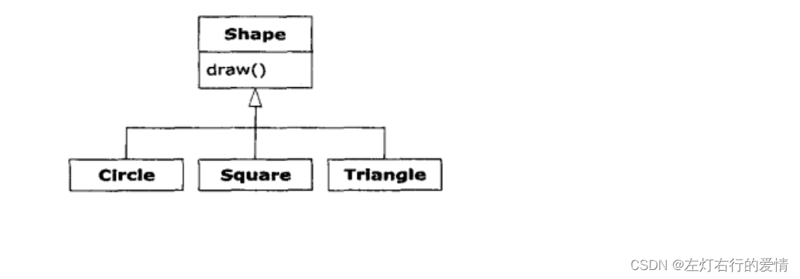
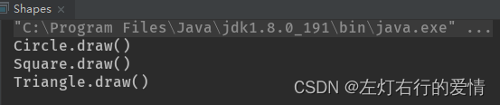
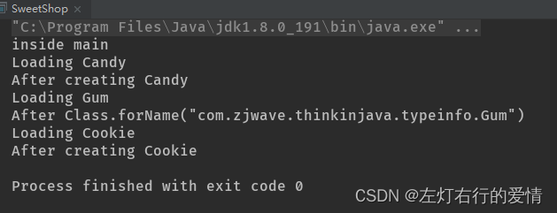
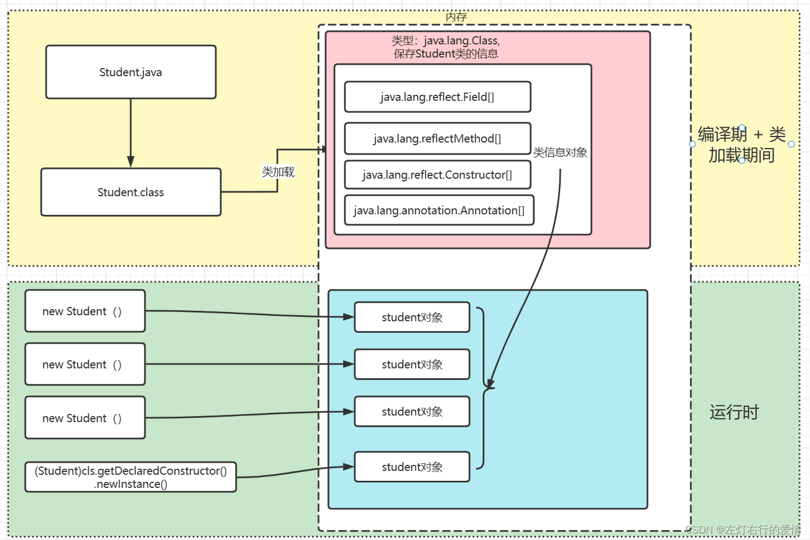

> 原文：[CSDN](https://blog.csdn.net/qq_45852626/article/details/135677619)（历史文章导入，当前状态为草稿）

### 前置知识

#### 动态语言

动态语言：运行时可以改变其结构（新的函数可以引进，已有的函数可以被删除等结构上的变化）。  
 比如JavaScript就是动态语言，除此之外，Python等也属于动态语言；而C，C++则不属于动态语言。  
 从反射角度来说，Java属于半动态语言。  
 因为它在运行时具有一定程序的反射能力，可以检查和修改它本身的结构。  
 与某些动态语言相比，Java对于类的结构修改和重构的能力相对受限，因此被归类为半动态语言，而不是完全动态语言。  
 那么具体的限制在哪些方面呢？

1. 访问权限限制：使用反射可以访问和操作类的私有成员，但是在默认情况下，Java的安全管理器会阻止对私有成员的访问。需要显式地设置安全管理策略才能绕过这种限制。
2. 性能影响：与直接调用方法相比，通过反射调用方法通常会更慢，因为它涉及到查找和验证类的结构。
3. 编译时安全性检查的缺失：使用反射可以绕过编译时的类型安全检查，可能导致运行时的类型错误。
4. 缺乏编译时优化：由于反射调用的动态性质，编译器无法进行某些优化，可能导致性能下降。
5. 受限的类型检查：反射操作可能导致无法捕获到所有的类型错误，这可能会在运行时导致异常。

#### JVM堆

堆是所有线程共享的一块
内存 
区域,在JVM启动时创建,此内存区域唯一目的:存储对象实例(数组也是一种对象),几乎所有的对象实例以及数据都在这里分配内存.

#### Java引用变量类型

Java的引用变量有两个类型:编译时类型和运行时类型.

##### 编译时类型

编译器根据变量声明的类型来进行类型检查和编译时错误检测.  
 在编译时,编译器会将变量类型确定为声明类型

作用是什么:

1. 决定了编译时可以使用哪些成员变量和方法
2. 编译时进行类型检查,以确保代码的类型安全性和正确性
3. 帮助编译器进行方法重载和方法重写的判断

##### 运行时类型

在程序运行时由实际引用对象决定.  
 运行时,JVM会根据实际引用对象的类型来确定变量的动态行为.

作用是什么:

1. 决定了实际调用哪个对象的成员变量和方法
2. 支持Java中的多态特性,使得父类引用可以指向子类对象,并根据实际对象类型调用相应的方法
3. 在运行时动态确定对象的类型,支持动态绑定和多态

##### 举栗

假设有一个动物类Animal.  
 它有两个子类Dog（狗）和Cat（猫）.  
 我们可以创建一个Animal类型的引用变量，然后根据需要将其指向不同的子类对象。

```
Animal myPet; // 编译时类型为Animal
myPet = new Dog(); // 运行时类型为Dog
myPet.makeSound(); // 调用的是Dog类的makeSound方法


```

myPet引用变量的编译时类型是Animal，因此**在编译时**只能使用Animal类中定义的方法和属性。  
 然而，当我们在**运行时**将myPet指向Dog对象时，它的运行时类型就变成了Dog。  
 这意味着在运行时，我们可以调用Dog类中定义的特定方法和属性，即使编译器在编译时无法确定这些方法和属性的存在。

##### 特殊情况

1. **要访问子类中特有的方法和属性，在编写代码时，则必须进行类型转换**
2. **对象的属性则不具备多态性。**通过引用变量来访问其包含的实例属性时，系统总是试图访问**它编译时类所定义的属性**，而不是它运行时所定义的属性。

#### RRTI概念

RTTI(Run-Time Type Identification) 运行时类别识别,对于这个词一直是C++的概念.  
 在Java中出现RRTI的说法源于《
Thinking 
 in Java》书中,它的作用:在运行时识别一个对象的类型和类的信息.  
 这里有两种RRTI:

1. 传统的"RRTI",它假定我们在编译期已经知道了所有类型(编译期已经确定其使用类型,如new对象时该类已经定义好了)
2. 反射机制:允许我们在运行时发现和使用类型的信息.

##### 为什么需要RTTI

举个多态类层次结构例子.  
 基类为Shape,派生出的具体类有Circle,Square,Triangle.



那么面向对象的目的是:代码只需要操作对基类的引用.所以,如果要添加一个新类(比如派生出Rhombold)来扩展程序,就不会影响到原来的代码.  
 Shape接口动态的绑定了draw()方法,目的是我们使用泛化的Shape来调用draw().  
 **draw()在所有派生类里都会被覆盖，并且由于它是被动态绑定的，所以即使是通过泛化的Shape引用来调用，也能产生正确的行为。**  
 因此,我们通常会创建一个具体的对象,把它向上转型成Shape(忽略对象的具体类型),并在后面的程序中使用匿名的Shape引用.  
 代码如下:

```
import java.util.Arrays;
import java.util.List;

public class Shapes {
    public static void main(String[] args) {
        List<Shape> shapes = Arrays.asList(new Circle(), new Square(), new Triangle());
        for (Shape shape : shapes) {
            shape.draw();
        }
    }
}


abstract class Shape{
    void draw(){
        System.out.println(this + ".draw()");
    }
    public abstract String toString();
}

class Circle extends Shape{
    @Override
    public String toString() {
        return "Circle";
    }
}

class Square extends Shape{
    @Override
    public String toString() {
        return "Square";
    }
}

class Triangle extends Shape{

    @Override
    public String toString() {
        return "Triangle";
    }
}


```

调用结果如下:  
   
 把Shape对象(这里指Cir,Squ,Tri,以上为缩写)放入List的
数组 
时会向上转型.  
 但在向上转型为Shape的时候也丢失了Shape对象的具体类型.  
 因此,对于数组而言,它们只是Shape类的对象.

当从数组中取出元素时,这种容器—实际上它将所有对象当做Object持有—会自动将结果转型回Shape

那么也就是RTTI名字的含义:在运行时,识别一个对象的类型.

但是我们可以发现,这里的RTTI类型转换的并不彻底:  
 Object被转型为Shape,而不是转型为Circle,Square和Triangle.  
 因为List保存的都是Shape,而没有进一步转型为具体的子类类型.  
 因为在编译时我们不确定存储在List中的具体对象是哪个子类的实例。  
 编译时,容器和Java的泛型系统会强制确这保一点;  
 而在运行时,由类型转换操作来确保这一点.

接下来就是多态机制的事情了，Shape对象实际执行什么样的代码，是由引用所指向的具体对象Circle、Square和Triangle而决定的。  
 我们希望大部分代码尽可能少地了解对象的具体类型，而是只与对象家族中的一个通用表示打交道（在这个例子中是Shape）。这样代码会更容易写，更容易读，且更便于维护；设计也更容易实现、理解和改变。所以“多态”是面向对象编程的基本目标。

RTTI的方便之处在于:  
 如果你碰到了一个特殊的编程问题-------能够知道某个泛化引用的确切类型,就可以使用最简单的方式去解决它  
 假设我们有一个List，我们想要对其中的具体形状进行特定操作，比如改变颜色或进行旋转。通过RTTI，我们可以在运行时识别出每个形状的具体类型（是圆形、正方形还是三角形），然后针对每种类型执行相应的操作。这种灵活性使得我们能够针对每个具体类型做出相应的处理，而无需事先知道它们的具体类型。

##### 例子

我们创建了Shape及其子类Circle、Square和Triangle。在Main类中，我们创建了一个包含各种形状对象的List。然后，我们使用for循环遍历该List，对每个形状进行检查，使用instanceof运算符来判断每个形状的确切类型，并执行相应的操作。通过使用instanceof和类型转换，我们能够根据对象的实际类型来执行相应的操作，充分利用了RTTI的灵活性。

```
import java.util.ArrayList;
import java.util.List;

class Shape {
    void highlight() {
        System.out.println("Highlighting the shape");
    }
}

class Circle extends Shape {
    void rotate() {
        System.out.println("Rotating the circle");
    }
}

class Square extends Shape {
    void rotate() {
        System.out.println("Rotating the square");
    }
}

class Triangle extends Shape {
    void rotate() {
        System.out.println("Rotating the triangle");
    }
}

public class Main {
    public static void main(String[] args) {
        List<Shape> shapes = new ArrayList<>();
        shapes.add(new Circle());
        shapes.add(new Square());
        shapes.add(new Triangle());

        for (Shape shape : shapes) {
            if (shape instanceof Circle) {
                shape.highlight();
                ((Circle) shape).rotate();
            } else if (shape instanceof Square) {
                shape.highlight();
                ((Square) shape).rotate();
            } else if (shape instanceof Triangle) {
                shape.highlight();
                ((Triangle) shape).rotate();
            }
        }
    }
}


```

#### Class类对象

想知道RTTI在Java中的工作原理,那么必须要知道类型信息是如何表示的.  
 这项工作是由称为Class对象的特殊对象完成的(包含了与类有关的信息).  
 事实上,Class对象就是用来创建类的所有的"常规"对象的.Java使用Class对象来执行其RTTI,即使你正在执行的是类似转型这样的操作.Class类还拥有大量的使用RTTI的其他方式.

类是程序的一部分,每个类都有一个Class对象.换句话说,每当写一个新类被编译时,就会产生一个Class对象(更恰当的说,是被保存在一个同名的.class文件中).  
 为了生成这个类的对象,运行这个程序的Java虚拟机(JVM)使用"类加载器"这个子系统.

##### 前置知识

###### 类加载器

下面简单介绍一下类加载器的概念,如果想深入了解一下,之前写过一篇文章可以当参考补充[深度学习与总结JVM专辑（五）：类加载机制](https://blog.csdn.net/qq_45852626/article/details/128098525?ops_request_misc=%257B%2522request%255Fid%2522%253A%2522170691994216800215074019%2522%252C%2522scm%2522%253A%252220140713.130102334.pc%255Fblog.%2522%257D&request_id=170691994216800215074019&biz_id=0&utm_medium=distribute.pc_search_result.none-task-blog-2~blog~first_rank_ecpm_v1~rank_v31_ecpm-5-128098525-null-null.nonecase&utm_term=JVM&spm=1018.2226.3001.4450)

###### 概念

这里就简单描述一下.  
 类加载器子系统实际上可以包含一条类加载器链,但是只有一个原生类加载器,它是JVM实现的一部分.  
 原生类加载器加载的是所谓的可信类,包括Java API类,它们通常是从本地盘加载的.在这条链中,通常不需要添加额外的类加载器,但是如果有特殊需求(比如以某种方式加载类,用来支持Web服务器应用,或者在网络中下载类),那么你可以接入额外的类加载器.  
 所有的类都是在第一次被使用时,动态加载到JVM中的.当程序创建对第一个类的静态成员的引用时,就会加载这个类.这也证明了构造器是类的静态方法,即使构造器并没有使用static关键字.  
 所以,使用new操作符创建类的新对象会被当做类静态成员的引用.  
 因此,Java程序在它开始运行之前并非被完全加载,其各个部分是在需要时才加载.这一点与许多传统语言都不同,动态加载类的行为,在C++这样的语言中很难或根本不可能复制的.

###### 作用

那类加载器是如何发挥作用的呢?  
 类加载器首先检查这个类的Class对象是否已经加载.  
 如果是未加载,默认的类加载器就会根据类型查找.class文件(例如,某个附加类加载器可能会在数据库中查找字节码)  
 一旦某个类的Class对象被载入内存,它就被用来创建这个类的所有对象.下面例子可以证明:

```
public class SweetShop {
    public static void main(String[] args) {
        System.out.println("inside main");
        new Candy();
        System.out.println("After creating Candy");
        try {
            Class.forName("com.zjwave.thinkinjava.typeinfo.Gum");
        }catch (ClassNotFoundException e){
            System.out.println("Couldn't find Gum");
        }
        System.out.println("After Class.forName(\"com.zjwave.thinkinjava.typeinfo.Gum\")");
        new Cookie();
        System.out.println("After creating Cookie");
    }
}

class Candy{
    static {
        System.out.println("Loading Candy");
    }
}
class Gum{
    static {
        System.out.println("Loading Gum");
    }
}
class Cookie{
    static {
        System.out.println("Loading Cookie");
    }
}


```

  
 这里的每个类Candy、Gum和Cookie，都有一个static子句，该子句在类第一次被加载时执行。这时会有相应的信息打印出来，告诉我们这个类什么时候被加载了。  
 从输出中可以看到，Class对象仅在需要的时候才被加载，static初始化是在类加载时进行的

##### Class类对象的概念

Class也有类,存在于JDK的java.lang包中,部分源码如下:

```
public final class Class<T> implements java.io.Serializable,
                              GenericDeclaration,
                              Type,
                              AnnotatedElement,
                              TypeDescriptor.OfField<Class<?>>,
                              Constable {
    private static final int ANNOTATION= 0x00002000;
    private static final int ENUM      = 0x00004000;
    private static final int SYNTHETIC = 0x00001000;

    private static native void registerNatives();
    static {
        registerNatives();
    }

    /*
     * Private constructor. Only the Java Virtual Machine creates Class objects.
     * This constructor is not used and prevents the default constructor being
     * generated.
     * 重点看一下这个注释
     */
    private Class(ClassLoader loader, Class<?> arrayComponentType) {
        // Initialize final field for classLoader.  The initialization value of non-null
        // prevents future JIT optimizations from assuming this final field is null.
        classLoader = loader;
        componentType = arrayComponentType;
    }


    public String toString() {
        return (isInterface() ? "interface " : (isPrimitive() ? "" : "class "))
            + getName();
    }
}


```

那么Class对象是类的实例化,所以Class类被创建后的对象就是Class对象,Class对象表达的含义据说类 的类型信息  
 举个例子来说吧:  
 我们创建了一个demo类,那么JVM就会创建一个Java对应Class类的Class对象,这个Class对象保存了demo类相关的类型信息  
 **Java每个类都只有一个Class对象**  
 每当我们编写并且编译一个新创建的类就会产生一个对应Class对象并且这个Class对象会被保存在同名.class文件里.  
 它具有非常重要的意义.

Java虚拟机（JVM）中的类加载器子系统负责将Java类加载到JVM中。一旦类被加载到JVM中，JVM就可以根据这个类的信息创建类的实例对象或者提供静态变量的引用值。

那么我们也可以反推得出，无论创建多少个实例对象，在JVM中都只有一个Class对象，即在内存中每个类有且只有一个相对应的Class对象。

  
 当然我们也可以用代码证明，非常简单：

```
Class cls = Class.forName("com.zimug.java.reflection.Student");
Class cls2 = new Student().getClass();

System.out.println(cls == cls2); //比较Class对象的地址，输出结果是true


```

##### Class类对象的总结

1. Java语言对大小写是敏感的,所以Class和class是不同的,Class类也是类的一种,与class关键字不同.
2. 类被编译后会产生一个Class对象,作用是创建保存类的类型信息,并且这个Class对象保存在同名的.class文件中(字节码文件)
3. 通过class关键字标识的类,在内存中只有一个与之对应的Class对象来描述其类型信息,即使有多个对象,它们依据的都是同一个Class对象
4. Class类只存在私有构造函数,所以只能被JVM创建和加载
5. Class对象作用是运行时提供或者获得某个对象的类型信息,这点对于反射技术非常非常重要.

#### 总结一下前置知识

我们最后再举一个例子贯通一下类的正常加载过程和Class对象的内容:

```
import java.util.Date; // 先有类

public class Test {
    public static void main(String[] args) {
        Date date = new Date(); // 后有对象
        System.out.println(date);
    }
}


```

1. JVM将代码编译为.class字节码文件,然后被类加载器(Class Loader)加载进JVM的内存中
2. 创建一个Date类的Class对象存储到堆中(注意不是new出来的对象,而是类的类型对象)
3. JVM在创建Date对象前,会先检查其类是否加载,寻找类对应的Class对象
4. 如果加载好,则分配内存,然后再进行初始化new Date()

OK,那么加载完一个类后,堆内存就产生了一个Class对象,这个对象包含了完整的类的结构信息,我们是可以通过这个Class对象看到类的结构,就好像一面镜子一样.我们形象的称之为反射.

再解释一下,上面提到过,一定是先有类再有对象,我们把这个通常情况称为正.  
 那么反射中的"反",我们就可以理解为根据对象找到对象所属的类(对象的出处)

```
Date date = new Date();
System.out.println(date.getClass()); // "class java.util.Date"


```

### 反射基础概念

Java的反射机制是指在运行状态中,对于任意一个类都能知道这个类所有的属性和方法;  
 并且对于任意一个对象,都能调用它的任意一个方法;  
 这种动态获取信息以及动态调用对象方法的功能成为Java语言的反射机制.  
 这个类的字节码被加载时,它们会接受验证,以确保其没有被破坏,并且不包含不良Java代码(Java用于安全防范目的的措施之一)

### 为什么要学反射

反射的好处一句话可以概括:提高程序的灵活性,并且屏蔽掉实现细节,让使用者调用起来更加方便好用  
 举个例子来说明:  
 我们都知道,使用接口可以提高代码的可维护性和可扩展性,并且降低代码的耦合度

```
public class Test {
    
    interface X {
    	public void test();
	}

    class A implements X{
        @Override
        public void test() {
             System.out.println("I am A");
        }
    }

    class B implements X{
        @Override
        public void test() {
            System.out.println("I am B");
    }
}


```

那么通常情况下,我们需要使用哪个实现类就直接new一下就好了

```
public class Test {    

    ......

	public static void main(String[] args) {
        X a = create1("A");
        a.test();
        X b = create1("B");
        b.test();
    }

    public static X create1(String name){
        if (name.equals("A")) {
            return new A();
        } else if(name.equals("B")){
            return new B();
        }
        return null;
    }

}


```

你是否已经开出来弊端了,如果有十几个不同的实现类需要创建,那就非常麻烦了.  
 我们使用反射可以很好解决这个问题

```
public class Test {

    public static void main(String[] args) {
		X a = create2("A");
        a.test();
        X b = create2("B");
        b.testReflect();
    }
    
	// 使用反射机制
    public static X create2(String name){
        Class<?> class = Class.forName(name);
        X x = (X) class.newInstance();
        return x;
    }
}


```

通过create2()方法传入包名和类名,通过反射机制动态的加载指定的类,然后再实例化对象.

#### 我需要学到什么程度

刚开始的入门的话,掌握下面的程度就可以了

* 懂得Class对象获取的途径
* 懂得通过Class对象创建出对象,获取构造器,成员变量,方法
* 懂得通过反射的API修改成员变量的值,调用方法

进阶程度的话,就要明白一些底层的内容和JVM相关,后面单开一篇文件聊这个,感兴趣可以先关注一下,更新后会提醒你.

### 反射的基础内容

#### 获取Class类对象的四种方式

* 知道具体类的情况下可以使用

```
Class alunbarClass = TargetObject.class;


```

但是我们一般是不知道具体类的，基本都是通过遍历包下面的类来获取 Class 对象，通过此方式获取 Class 对象不会进行初始化。

* 通过Class.forName()传入全类名获取

```
Class alunbarClass1 = Class.forName("com.xxx.TargetObject");


```

这个方法内部实际调用的是 forName0  
 它还有第 2 个 boolean 参数:  
 表示类是否需要初始化，默认是需要初始化。一旦初始化，就会触发目标对象的 static 块代码执行，static 参数也会被再次初始化。

* 通过对象实例instance.getClass()获取

```
Date date = new Date();
Class alunbarClass2 = date.getClass(); // 获取该对象实例的 Class 类对象


```

* 通过类加载器xxxClassLoader.loadClass()传入类路径获取

```
class clazz = ClassLoader.LoadClass("com.xxx.TargetObject");


```

通过类加载器获取 Class 对象不会进行初始化，意味着不进行包括初始化等一些列步骤，静态块和静态对象不会得到执行。这里可以和 forName 做个对比。

#### 通过反射构造类的实例

上面我们介绍了获取Class类对象的方式,那么成功获取之后,我们就需要构造对应的实例,下面介绍三种方法,第一种最为常见,最后一种稍作了解就可以.

* 使用 `Class.newInstance`

```
Date date1 = new Date();
Class alunbarClass2 = date1.getClass();
Date date2 = alunbarClass2.newInstance(); // 创建一个与 alunbarClass2 具有相同类类型的实例


```

注意:  
 `newInstance`方法调用默认的构造函数(无参构造函数)初始化新创建对象.  
 如果这个类没有默认的构造函数,就会抛出一个异常!

* 通过反射先获取构造方法再调用函数  
   不是所有的类都有无参构造或类构造器是private,这样的情况下,使用`Class.newInstance`是无法满足的.  
   此时我们可以使用`Constructor`的`newInstance`的方法来实现,先获取构造函数,再执行构造函数.  
   从上面代码很容易看出,`Construct.newInstance`是可以携带参数的,而`Class.newInstace`是无参的,这也就是为什么它只能调用无参构造函数的原因了.

综上:  
 如果被调用的类的构造函数为默认的构造函数,采用`Class.newInstance`是比较好的选择,一句代码就OK  
 如果需要调用类的带参构造函数,私有构造函数等,就需要采用`Constractor.newInstance()`

##### 批量获取

* 获取所有"公有的"构造方法

```
public Constructor[] getConstructors() { }


```

* 获取所有的构造方法(包括私有,受保护,默认,公有)

```
public Constructor[] getDeclaredConstructors() { }


```

##### 单个获取

* 获取一个指定参数类型的"公有的"构造方法

```
public Constructor getConstructor(Class... parameterTypes) { }


```

* 获取一个指定参数类型的"构造方法"(包括私有,受保护,默认,公有的)

```
public Constructor getDeclaredConstructor(Class... parameterTypes) { }


```

举个例子来说:  
 先定义一下基本的内容

```
public class Student {
	//（默认的构造方法）
	Student(String str){
		System.out.println("(默认)的构造方法 s = " + str);
	}
	// 无参构造方法
	public Student(){
		System.out.println("调用了公有、无参构造方法执行了。。。");
	}
	// 有一个参数的构造方法
	public Student(char name){
		System.out.println("姓名：" + name);
	}
	// 有多个参数的构造方法
	public Student(String name ,int age){
		System.out.println("姓名："+name+"年龄："+ age);//这的执行效率有问题，以后解决。
	}
	// 受保护的构造方法
	protected Student(boolean n){
		System.out.println("受保护的构造方法 n = " + n);
	}
	// 私有构造方法
	private Student(int age){
		System.out.println("私有的构造方法年龄："+ age);
	}
}


```

执行反射

```
public class Constructors {
	public static void main(String[] args) throws Exception {
		// 加载Class对象
		Class clazz = Class.forName("fanshe.Student");
        
		// 获取所有公有构造方法
		Constructor[] conArray = clazz.getConstructors();
		for(Constructor c : conArray){
			System.out.println(c);
		}
        
		// 获取所有的构造方法(包括：私有、受保护、默认、公有)
		conArray = clazz.getDeclaredConstructors();
		for(Constructor c : conArray){
			System.out.println(c);
		}
        
		// 获取公有、无参的构造方法
        // 因为是无参的构造方法所以类型是一个null,不写也可以：这里需要的是一个参数的类型，切记是类型
		// 返回的是描述这个无参构造函数的类对象。
		Constructor con = clazz.getConstructor(null);
		Object obj = con.newInstance(); // 调用构造方法
		
		// 获取私有构造方法
		con = clazz.getDeclaredConstructor(int.class);
		System.out.println(con);
		con.setAccessible(true); // 为了调用 private 方法/域 我们需要取消安全检查
		obj = con.newInstance(12); // 调用构造方法
	}
}


```

* 使用开源库`Objenesis`  
   Objenesis 是一个开源库，和上述第二种方法一样，可以调用任意的构造函数，不过封装的比较简洁

```
public class Test {
    // 不存在无参构造函数
    private int i;
    public Test(int i){
        this.i = i;
    }
    public void show(){
        System.out.println("test..." + i);
    }
}

------------------------
    
public static void main(String[] args) {
        Objenesis objenesis = new ObjenesisStd(true);
        Test test = objenesis.newInstance(Test.class);
        test.show();
    }


```

使用起来比较简单,顺便说一下,`Objenesis`由子类 `ObjenesisObjenesisStd`实现.

#### 反射获取成员变量

获取成员变量也分批量获取和单个获取,返回值通过Field类型来接受

##### 批量获取

* 获取所有公有的字段

```
public Field[] getFields() { }


```

* 获取所有的字段(包括私有,受保护,默认的)

```
public Field[] getDeclaredFields() { }


```

##### 单个获取

* 获取一个指定名称的公有字段

```
public Field getField(String name) { }


```

* 获取一个指定名称的字段(包括私有,受保护,默认的)

```
public Field getDeclaredField(String name) { }


```

上面我们了解到了如何获取成员变量,获取之后如何修改它们的值呢?  
 这时候可以用`set`方法来修改:  
 包含两个参数:

1. obj:哪个对象要修改这个成员变量
2. value:要修改成哪个值

举个例子:  
 定义内容如下

```
public class Student {
	public Student(){
        
	}
	
	public String name;
	protected int age;
	char sex;
	private String phoneNum;
	
	@Override
	public String toString() {
		return "Student [name=" + name + ", age=" + age + ", sex=" + sex
				+ ", phoneNum=" + phoneNum + "]";
	}
}


```

用反射来操作

```
public class Fields {
    public static void main(String[] args) throws Exception {
        // 获取 Class 对象
        Class stuClass = Class.forName("fanshe.field.Student");
        // 获取公有的无参构造函数
        Constructor con = stuClass.getConstructor();
		
		// 获取私有构造方法
		con = clazz.getDeclaredConstructor(int.class);
		System.out.println(con);
		con.setAccessible(true); // 为了调用 private 方法/域 我们需要取消安全检查
		obj = con.newInstance(12); // 调用构造方法
        
        // 获取所有公有的字段
        Field[] fieldArray = stuClass.getFields();
        for(Field f : fieldArray){
            System.out.println(f);
        }

         // 获取所有的字段 (包括私有、受保护、默认的)
        fieldArray = stuClass.getDeclaredFields();
        for(Field f : fieldArray){
            System.out.println(f);
        }

        // 获取指定名称的公有字段
        Field f = stuClass.getField("name");
        Object obj = con.newInstance(); // 调用构造函数，创建该类的实例
        f.set(obj, "刘德华"); // 为 Student 对象中的 name 属性赋值


        // 获取私有字段
        f = stuClass.getDeclaredField("phoneNum");
        f.setAccessible(true); // 暴力反射，解除私有限定
        f.set(obj, "18888889999"); // 为 Student 对象中的 phoneNum 属性赋值
    }
}


```

#### 反射获取成员方法

##### 批量获取

* 获取所有公共方法(包含父类的方法,也包含Object类)

```
public Method[] getMethods() { }


```

* 获取所有的成员方法,包括私有的(不包括继承的)

```
public Method[] getDeclaredMethods() { }


```

##### 单个获取

* 获取一个指定方法名和参数类型的成员方法

```
public Method getMethod(String name, Class<?>... parameterTypes)


```

那么获取到方法之后如何调用它们呢?

我们可以用invoke方法,它包含两个参数:

* obj:哪个对象要来调用这个方法
* args:调用方法时所传递的实参

举个例子:  
 定义内容如下

```
public class Student {
	public void show1(String s){
		System.out.println("调用了：公有的，String参数的show1(): s = " + s);
	}
	protected void show2(){
		System.out.println("调用了：受保护的，无参的show2()");
	}
	void show3(){
		System.out.println("调用了：默认的，无参的show3()");
	}
	private String show4(int age){
		System.out.println("调用了，私有的，并且有返回值的，int参数的show4(): age = " + age);
		return "abcd";
	}
}


```

用反射来操作

```
public class MethodClass {
	public static void main(String[] args) throws Exception {
		// 获取 Class对象
		Class stuClass = Class.forName("fanshe.method.Student");
        // 获取公有的无参构造函数
        Constructor con = stuClass.getConstructor();
        
		// 获取所有公有方法
		stuClass.getMethods();
		Method[] methodArray = stuClass.getMethods();
		for(Method m : methodArray){
			System.out.println(m);
		}
        
		// 获取所有的方法，包括私有的
		methodArray = stuClass.getDeclaredMethods();
		for(Method m : methodArray){
			System.out.println(m);
		}
        
		// 获取公有的show1()方法
		Method m = stuClass.getMethod("show1", String.class);
		System.out.println(m);
		Object obj = con.newInstance(); // 调用构造函数，实例化一个 Student 对象
		m.invoke(obj, "小牛肉");
		
		// 获取私有的show4()方法
		m = stuClass.getDeclaredMethod("show4", int.class);
		m.setAccessible(true); // 解除私有限定
		Object result = m.invoke(obj, 20);
		System.out.println("返回值：" + result);
	}
}


```

#### 反射的应用

对于反射的应用,jdbc和Spring的配置项已经被举烂了,这块我想着后面根据SpringAOP结合起来一起分析,目前先更基础内容吧.举烂的东西写出来意义不大.

### 后续还会有更新.
