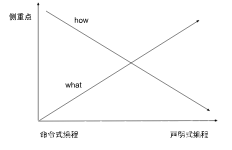
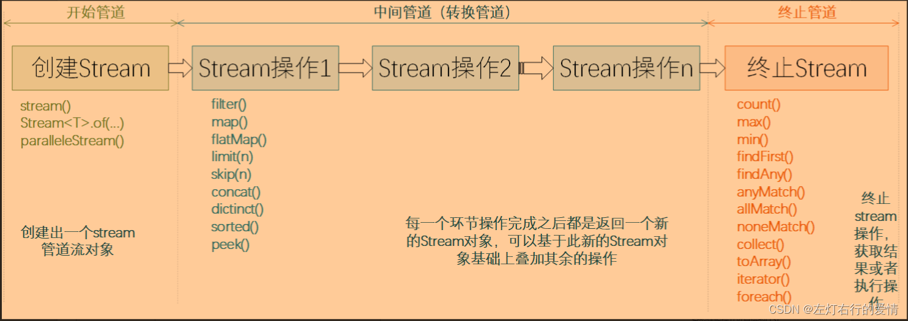
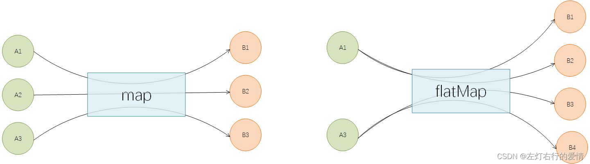
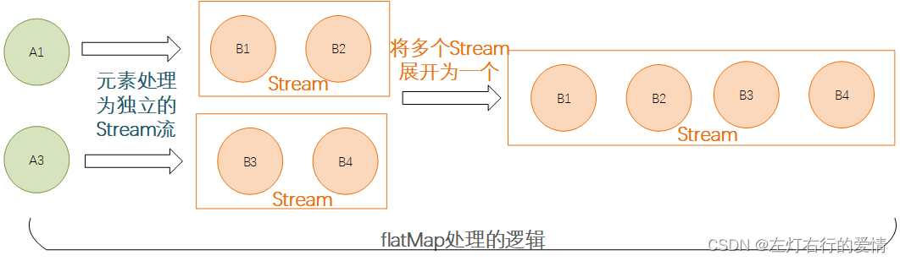

> 原文：[CSDN](https://blog.csdn.net/qq_45852626/article/details/136862710)（历史文章导入，当前状态为草稿）

### 前言

Stream流是Java8及之后版本引入的新特性,主要用于简化集合和数组操作.  
 通过Stream流,可以将集合或数据中的数据按照特定方式进行转换,过滤,映射,排序等操作,从而实现复杂的数据处理逻辑.  
 它提供了一种新的数据处理方式,简化集合和数组的操作,提高代码的可读性和可维护性.

### Stream概念

Java8新增的接口,允许以声明性方式处理
数据集合
.  
 Stream可以看作遍历数据集合的高级迭代器(Iterator).  
 Stream操作可以像Builder一样逐步叠加,形成一条流水线.流水线由数据源+N个中间操作+一个终端操作构成.

补充:  
 **什么是声明式编程**  
 声明式的理解都是相对于命令式(imperativ)而言的,是对于命令式编程不同的编程泛型的一种合称.  
 声明式编程中我们描述的是目标状态,命令式编程中我们描述的是一系列动作.  
 

### Stream特点

* **只能消费一次**: Stream实例只能遍历一次,终端操作一次遍历后就结束,再次遍历需要重新生成实例,这一点类似于Iterator迭代器.
* **保护数据源**: 对Stream中任何元素的修改都不会导致数据源被修改,比如过滤删除流中的一个元素,再次遍历该数据源依然可以获取该元素.
* **懒惰**: 串联一系列的中间运算,如果没有一个终端操作,那么这些中间运算永远不会被执行.

### Stream基本内容

可以将Stream流操作分为3种类型:

* 创建Stream
* Stream中间处理
* 终止Stream  
   每个Stream管道操作类型都包含N个API方法,先列举下各API方法的功能介绍.

#### 开始管道

可以新建一个Stream流,或者基于现有的数组,List,Set,Map等集合类型对象创建出新的Stream流.

| API | 功能说明 |
| --- | --- |
| stream() | 创建出一个新的stream串行流对象 |
| parallelStream() | 创建出一个可并行执行的stream流对象 |
| Stream.of() | 通过给定的一系列元素创建一个新的Stream串行流对象 |

* 使用集合创建Stream实例(常用方式)

```
List<String> list = Arrays.asList("a", "b", "c");
Stream<String> stream = list.stream();
再来一个例子
 List<String> list = new ArrayList<>();
        list.add("武汉加油");
        list.add("中国加油");
        list.add("世界加油");
 Stream<String> stream = list.stream();
 
集合还可以调用parallelStream()方法创建并发流,默认使用ForkJoinPool.commonPool()线程池
List<Long> aList = new ArrayList<>();
Stream<Long> parallelStream = aList.parallelStream();


```

* 使用数组创建Stream实例

```
1. 使用Arrays.stream()
int[] array={1,3,5,6,8};
Stream<String> stream = Arrays.stream(array)
2.使用Stream.of()
stream = Stream.of("武汉加油", "中国加油", "世界加油");
查看 Stream 源码的话，你会发现 of() 方法内部其实调用了 Arrays.stream() 方法。
public static<T> Stream<T> of(T... values) {
    return Arrays.stream(values);
}


```

#### 中间管道

负责对Stream进行处理操作,并返回一个新的Stream对象,中间管道操作可以进行叠加.

| API | 功能说明 |
| --- | --- |
| filter() | 按照条件过滤符合要求的元素,返回新的stream流 |
| map() | 将已有元素转换为另一个对象类型,一对一逻辑,返回新的stream流 |
| flatMap() | 将已有元素转换为另一个对象类型,一对多逻辑,即原来一个元素对象可能会转换为1个或者多个新类型的元素,返回新的stream流 |
| limit() | 仅保留集合前面制定个数的元素,返回新的stream流 |
| skip() | 跳过集合前面制定个数的元素,返回新的stream流 |
| concat() | 将两个流的数据合并起来为1个新的流,返回新的stream流 |
| distinct() | 对stream中所有元素进行去重,返回新的stream流 |
| sorted() | 对stream中所有元素按照指定规则进行排序,返回新的stream流 |
| peek() | 对stream流中的每个元素进学逐个遍历处理,返回处理后的stream流 |

##### map与flatMap

map与flatMap都是用于已有的元素转换为其他元素.  
 区别点在于:

* map必须是一对一的,即每个元素都只能转换为一个新元素
* flatmapkey是一对多的,即每个元素都可以转换为一个或者多个新的元素.  
     
   举个例子:有一个字符串ID列表，现在需要将其转为User对象列表。
* 用map来实现

```
/**
 * 演示map的用途：一对一转换
 */
public void stringToIntMap() {
    List<String> ids = Arrays.asList("205", "105", "308", "469", "627", "193", "111");
    // 使用流操作
    List<User> results = ids.stream()
            .map(id -> {
                User user = new User();
                user.setId(id);
                return user;
            })
            .collect(Collectors.toList());
    System.out.println(results);
}
执行结果如下:
[User{id='205'}, 
 User{id='105'},
 User{id='308'}, 
 User{id='469'}, 
 User{id='627'}, 
 User{id='193'}, 
 User{id='111'}]


```

再举个例子:现有一个句子列表，需要将句子中每个单词都提取出来得到一个所有单词列表。这时map就不行了.

* 用flatMap来实现

```
public void stringToIntFlatmap() {
    List<String> sentences = Arrays.asList("hello world","Jia Gou Wu Dao");
    // 使用流操作
    List<String> results = sentences.stream()
            .flatMap(sentence -> Arrays.stream(sentence.split(" ")))
            .collect(Collectors.toList());
    System.out.println(results);
}
执行结果如下:
[hello, world, Jia, Gou, Wu, Dao]


```

补充一句: flatMap操作的时候其实是先对每个元素处理后返回一个stream,然后将多个stream展开
合并 
为一个新的完整的stream,如下图所示:  
 

##### peek和foreach方法

它们都可以对元素进行遍历然后逐个进行处理  
 但是注意,peek属于中间方法,而foreach属于终止方法,也就是说peek只能作为管道中途的一个处理步骤,而没办法直接执行得到结果,其后面必须还要有其他终止操作的时候才会被执行.

```
public void testPeekAndforeach() {
    List<String> sentences = Arrays.asList("hello world","Jia Gou Wu Dao");
    // 演示点1： 仅peek操作，最终不会执行
    System.out.println("----before peek----");
    sentences.stream().peek(sentence -> System.out.println(sentence));
    System.out.println("----after peek----");
    // 演示点2： 仅foreach操作，最终会执行
    System.out.println("----before foreach----");
    sentences.stream().forEach(sentence -> System.out.println(sentence));
    System.out.println("----after foreach----");
    // 演示点3： peek操作后面增加终止操作，peek会执行
    System.out.println("----before peek and count----");
    sentences.stream().peek(sentence -> System.out.println(sentence)).count();
    System.out.println("----after peek and count----");
}
执行结果:
----before peek----
----after peek----
----before foreach----
hello world
Jia Gou Wu Dao
----after foreach----
----before peek and count----
hello world
Jia Gou Wu Dao
----after peek and count----


```

##### filter,sorted,distinct,limit

这几个都是常用的stream的中间操作方法,具体的方法的含义在上面的表格里面有说明.  
 具体使用的时候,key根据需要选择一个或者多个进行组合使用,或者同时使用多个相同方法的组合:

```
public void testGetTargetUsers() {
    List<String> ids = Arrays.asList("205","10","308","49","627","193","111", "193");
    // 使用流操作
    List<Dept> results = ids.stream()
            .filter(s -> s.length() > 2)
            .distinct()
            .map(Integer::valueOf)
            .sorted(Comparator.comparingInt(o -> o))
            .limit(3)
            .map(id -> new Dept(id))
            .collect(Collectors.toList());
    System.out.println(results);
}

执行结果:
[Dept{id=111},  Dept{id=193},  Dept{id=205}]


```

1. 使用filter过滤掉不符合条件的数据
2. 通过distinct对存量元素进行去重操作
3. 通过map操作将字符串转成整数类型
4. 借助sorted制定按照数字大小正序排列
5. 使用limit截取排在前3位的元素
6. 又一次使用map将id转为Dept对象类型
7. 使用collect终止操作将最终处理后的数据收集到list中

#### 终止管道

通过终止管道后,Stream流将会结束,最后可能会执行某些逻辑处理,或者是按照要求返回某些执行后的结果数据.

| API | 功能说明 |
| --- | --- |
| count() | 返回stream处理后最终的元素个数 |
| max() | 返回stream处理后的元素最大值 |
| min() | 返回stream处理后的元素最小值 |
| findFirst() | 找到第一个符合条件的元素时则终止流处理 |
| findAny() | 找到任何一个符合条件的元素时则退出流处理,这个对于串行流时与findFirst相同,对于并行流时比较高效,任何分片中找到都会终止后续计算逻辑. |
| anyMatch() | 返回一个boolean值,类似于isContains(),用于判断是否有符合条件的元素 |
| allMatch() | 返回一个boolean值,用于判断是否所有元素都符合条件 |
| noneMatch() | 返回一个boolean值,用于判断是否所有元素都不符合条件 |
| collect() | 将流转换为指定的类型,通过Collectors进行指定 |
| toArray() | 将流转换为数组 |
| iterator() | 将流转换为Iterator对象 |
| forEach() | 无返回值,对元素进行逐个遍历,然后执行给定的处理逻辑 |

##### 简单结果终止方法

所谓的简单,指的是结果形式是数字,布尔值或者
Optional 
对象值等.  
 我们可以使用`count,max,min,findAny,findFirst,anyMatch,allMatch,noneMatch`等方法来处理终止.

```
public void testSimpleStopOptions() {
    List<String> ids = Arrays.asList("205", "10", "308", "49", "627", "193", "111", "193");
    // 统计stream操作后剩余的元素个数
    System.out.println(ids.stream().filter(s -> s.length() > 2).count());
    // 判断是否有元素值等于205
    System.out.println(ids.stream().filter(s -> s.length() > 2).anyMatch("205"::equals));
    // findFirst操作
    ids.stream().filter(s -> s.length() > 2)
            .findFirst()
            .ifPresent(s -> System.out.println("findFirst:" + s));
}

执行结果为:
6
true
findFirst:205


```

注意: 一旦一个stream流被执行了终止操作之后,后续就不可以再读这个流执行其他的操作了.

##### 结果收集终止方法

因为stream主要用于集合数据的处理场景,所以对于集合类的结果对象,就需要`collect`出场了,它支持生成下面类型的结果数据:

* **集合类**,比如`List,Set,HashMap等`
* `StringBuilder`对象,支持将多个**字符串进行拼接**处理并输出拼接后的结果
* 记录个数或者计算总和的对象(**数据批量运算统计**)
* 生成集合

```
public void testCollectStopOptions() {
    List<Dept> ids = Arrays.asList(new Dept(17), new Dept(22), new Dept(23));
    // collect成list
    List<Dept> collectList = ids.stream().filter(dept -> dept.getId() > 20)
            .collect(Collectors.toList());
    System.out.println("collectList:" + collectList);
    // collect成Set
    Set<Dept> collectSet = ids.stream().filter(dept -> dept.getId() > 20)
            .collect(Collectors.toSet());
    System.out.println("collectSet:" + collectSet);
    // collect成HashMap，key为id，value为Dept对象
    Map<Integer, Dept> collectMap = ids.stream().filter(dept -> dept.getId() > 20)
            .collect(Collectors.toMap(Dept::getId, dept -> dept));
    System.out.println("collectMap:" + collectMap);
}

执行结果如下:
collectList:[Dept{id=22}, Dept{id=23}]
collectSet:[Dept{id=23}, Dept{id=22}]
collectMap:{22=Dept{id=22}, 23=Dept{id=23}}


```

* 生成拼接字符串

```
原始做法:
public void testForJoinStrings() {
    List<String> ids = Arrays.asList("205", "10", "308", "49", "627", "193", "111", "193");
    StringBuilder builder = new StringBuilder();
    for (String id : ids) {
        builder.append(id).append(',');
    }
    // 去掉末尾多拼接的逗号
    builder.deleteCharAt(builder.length() - 1);
    System.out.println("拼接后：" + builder.toString());
}
stream流做法:
public void testCollectJoinStrings() {
    List<String> ids = Arrays.asList("205", "10", "308", "49", "627", "193", "111", "193");
    String joinResult = ids.stream().collect(Collectors.joining(","));
    System.out.println("拼接后：" + joinResult);
}

执行结果如下:
拼接后：205,10,308,49,627,193,111,193


```

* 批量数学运算

```
public void testNumberCalculate() {
    List<Integer> ids = Arrays.asList(10, 20, 30, 40, 50);
    // 计算平均值
    Double average = ids.stream().collect(Collectors.averagingInt(value -> value));
    System.out.println("平均值：" + average);
    // 数据统计信息
    IntSummaryStatistics summary = ids.stream().collect(Collectors.summarizingInt(value -> value));
    System.out.println("数据统计信息： " + summary);
}
执行结果如下:

平均值：30.0
总和： IntSummaryStatistics{count=5, sum=150, min=10, average=30.000000, max=50}


```

##### 详解部分规约操作

规约操作(reduction operation)又被称为折叠操作(fold),通过某个连接动作将所有元素汇总成一个汇总结果的过程.  
 将所有元素转换成一个列表或集合,这些都属于规约操作.  
 stream类库有两个通用的规约操作:reduce和collect.  
 当然也有为简化书写而设计的专用规约操作:sum,max,count等  
 我们着重介绍reduce()和collect(),这是有些不太好理解.

###### reduce

可以实现从一组元素中生成一个值,如`sum(),max(),min(),count()`等都是reduce操作,将他们单独设为函数只是因为常用.  
 reduce()的方法定义有三种重写形式:

* Optional reduce(BinaryOperator accumulator)
* T reduce(T identity, BinaryOperator accumulator)
* U reduce(U identity, BiFunction<U,? super T,U> accumulator, BinaryOperator combiner)  
   虽然函数定义越来越长,但是语义是不变的,多的参数只是为了指明初始值(参数identity),或者是制定并行执行时多个部分结果的合并方式(参数combiner).  
   reduce()最常用的场景就是从一堆值中生成一个值.  
   举例来说:  
   需求:从一组单词中找出最长的单词。

```
Stream<String> stream = Stream.of("I", "love", "you", "too");
stream.reduce((s1,s2)->s1.length()>=s2.length() ? s1: s2);
System.out.println(longest.get());
执行结果:
打印出love


```

其中Optional是值的容器,使用它可以避免null值的麻烦.  
 当然你如果使用`Stream.max(Comparator<? super T> comparator)`方法来达到相同效果,但reduce有它存在的理由  
 需求:求出一组单词的长度之和。

```
// 求单词长度之和
Stream<String> stream = Stream.of("I", "love", "you", "too");
stream.reduce(0, //初始值
(sum,str) -> sum+str.length(), //累加器
(a,b) -> a+b);  //部分和拼接器,并行执行时才会用到
System.out.println(lengthSum);


```

###### collect

如果你发现某个功能在stream接口中没找到,那么大概就在collect方法中可以找到其方法实现.  
 collect()是stream接口方法最灵活的一个,我们先看几个热身小例子:

```
// 将Stream转换成容器或Map
Stream<String> stream = Stream.of("I", "love", "you", "too");
List<String> list = stream.collect(Collectors.toList()); // (1)
// Set<String> set = stream.collect(Collectors.toSet()); // (2)
// Map<String, Integer> map = stream.collect(Collectors.toMap(Function.identity(), String::length)); // (3)


```

语义是很明确的,将stream流转换为List,Set和Map,但是可能会有几个疑问:

* Function.identity()是干什么的?
* String::length是什么意思?
* Collectors是个什么东西?

###### 接口的静态方法和默认方法

Function是一个接口,那么Function.identiry是什么意思呢?可以从两方面解释:

1. Java8允许在接口中加入具体方法.具体方法有两种,default方法和static方法,identiy就是Function接口的一个静态方法.
2. Function.identity返回一个输出与输入一样的lambda表达式对象,等价于T-t形式的lambda表达式  
    在接口中default方法是一个无奈之举,在Java7及其之前要想在定义好的接口中加入新的抽象方法基本不可能,因为所有实现了该接口的类都要重新实现.  
    试想一下在Collection接口中加入一个stream抽象方法会怎么样?  
    default方法就是用来解决这个尴尬问题的,直接在接口中实现新加入的方法

###### 方法引用

例如String::length的语法形式叫做方法引用(method references),这种语法用来替代某些特定形式lambda表达式.  
 **如果lambda表达式全部内容就是调用一个已有的方法,那么该方法引用可以用来替代lambda表达式.**

| 方法引用类别 | 举例 |
| --- | --- |
| 引用静态方法 | Integer::sum |
| 引用某个对象的方法 | list::add |
| 引用某个类的方法 | String::length |
| 引用构造方法 | HashMap::new |

###### 收集器

收集器(Collector)是为stream.collect()方法量身打造的工具接口(类).  
 考虑一下将一个stream转换成一个容器(或者Map)需要做哪些工作?我们至少需要两样东西:

* 目标容器是什么?是ArrayList还是HashSet,或者是TreeMap.
* 新元素如何添加到容器中? 是List.add()还是Map.put().

如果并行的还需要规约,需要告诉collect多个部分如何合并成一个.  
 综上分析,collect方法定义为`<R> R collect(Supplier<R> supplier, BiConsumer<R,? super T> accumulator, BiConsumer<R,R> combiner)`,三个参数依次对应上述三条分析.  
 不过每次调用collect()都要传入这三个参数太麻烦,收集器Collector就是对三个参数简单封装,所以collect()另一个定义为`<R,A> R collect(Collector<? super T,A,R> collector)`.  
 Collectors工具类可以通过静态方法生成各种常用的Collector.  
 举例如下:

```
//　将Stream规约成List
Stream<String> stream = Stream.of("I", "love", "you", "too");
List<String> list = stream.collect(ArrayList::new, ArrayList::add, ArrayList::addAll);// 方式１
//List<String> list = stream.collect(Collectors.toList());// 方式2
System.out.println(list);


```

通常情况下我们不需要手动指定collect()的三个参数,而是调用`collect(Collector<? super T,A,R> collector)`方法,并且参数中的Collector对象大多数都是通过Collector工具类获得.

###### 使用collect生成Collection

前面提到通过collect方法将Stream转换为容器的方法,这里再汇总一下.  
 将Stream转换成List或Set是比较常见的操作,所以这里Collectors工具已经为我们提供了对应的收集器,通过如下代码即可完成:

```
// 将Stream转换成List或Set
Stream<String> stream = Stream.of("I", "love", "you", "too");
List<String> list = stream.collect(Collectors.toList()); // (1)
Set<String> set = stream.collect(Collectors.toSet()); // (2)


```

上述代码可以满足大部分需求,但是返回结果是接口类型,我们并不知道类库实际选择的容器类型是什么,有时候我们想要认为指定容器的实际类型,这个需求可以通过`Collecors.toCollection(Supplier<C> collectionFactory)`方法完成

```
// 使用toCollection()指定规约容器的类型
ArrayList<String> arrayList = stream.collect(Collectors.toCollection(ArrayList::new));// (3)
HashSet<String> hashSet = stream.collect(Collectors.toCollection(HashSet::new));// (4)


```

###### 使用collect生成Map

stream背后依赖的数据库可以是数组,容器,但不能是Map.  
 反过来stream是可以生成Map 的,只是需要想清楚Map的key和value分别代表什么,要想清楚是要干什么,通常三种情况下collect的结果会是Map:

* 使用Collectors.toMap()生成的收集器,用户需要指定如何生成Map 的可以和value.

```
// 使用toMap()统计学生GPA
Map<Student, Double> studentToGPA =
     students.stream().collect(Collectors.toMap(Function.identity(),// 如何生成key
                                     student -> computeGPA(student)));// 如何生成value


```

* 使用Collectors.partitioningBy()生成的收集器,对元素进行二分区操作时可以用到.  
   这种情况适用将stream中的元素根据某个二值逻辑(满足条件,或不满足)分成互补相交的两部分,比如男女性别,成绩及格与否等.

```
// Partition students into passing and failing
Map<Boolean, List<Student>> passingFailing = students.stream()
         .collect(Collectors.partitioningBy(s -> s.getGrade() >= PASS_THRESHOLD));


```

* 使用Collectors.groupingBy()生成的收集器,对元素做group操作时可以用到.  
   跟sql中的groupby语句类似,这里的groupingBy也是按照某个属性对数据进行分组,属性相同的元素会被对应到Map的同一个key上.  
   下面代码展示员工按照部分进行分组:

```
// Group employees by department
Map<Department, List<Employee>> byDept = employees.stream()
            .collect(Collectors.groupingBy(Employee::getDepartment));


```

但有时候仅仅分组是不够的,在
sql 
中使用groupby是为了协助其他查询,比如1.先将员工按照部门分组;2.然后统计每个部分员工的人数.  
 Java类库设计者也考虑到了这种情况,增强版的groupingBy()能够满足这种需求.  
 增强版的groupingBy()允许我们对元素分组之后再执行某种运算,比如求和,计数,平均值等.  
 这种将元素分组的收集器叫做**上游收集器**  
 之后执行其他运算的收集器叫做**下游收集器**

```
// 使用下游收集器统计每个部门的人数
Map<Department, Integer> totalByDept = employees.stream()
                    .collect(Collectors.groupingBy(Employee::getDepartment,
                                                   Collectors.counting()));// 下游收集


```

看起来代码逻辑像sql,高度非结构化.  
 但还有更复杂一些的,下游收集器还可以包含更下游的收集器,不是为了炫技而设计,确实是有实际场景需要.  
 考虑将员工按照部门分组的场景,如果我们想得到每个员工的名字(字符串),而不是一个个Employee对象,可通过如下方式做到:

```
// 按照部门对员工分布组，并只保留员工的名字
Map<Department, List<String>> byDept = employees.stream()
                .collect(Collectors.groupingBy(Employee::getDepartment,
                        Collectors.mapping(Employee::getName,// 下游收集器
                                Collectors.toList())));// 更下游的收集器


```

### 结尾

本篇初稿描述了stream流最基础的用法,后续我也会不断的完善这篇文章,并且多多放入并发stream的内容,并且加业务场景进来,stream想要优雅的使用还是需要一些练习和更多的知识,我也会慢慢发掘和执行我的补全计划.
