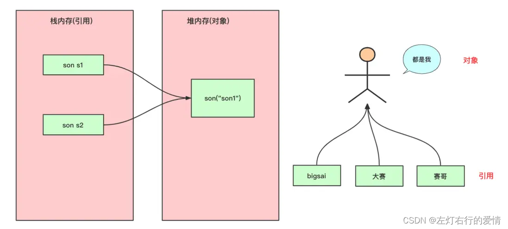
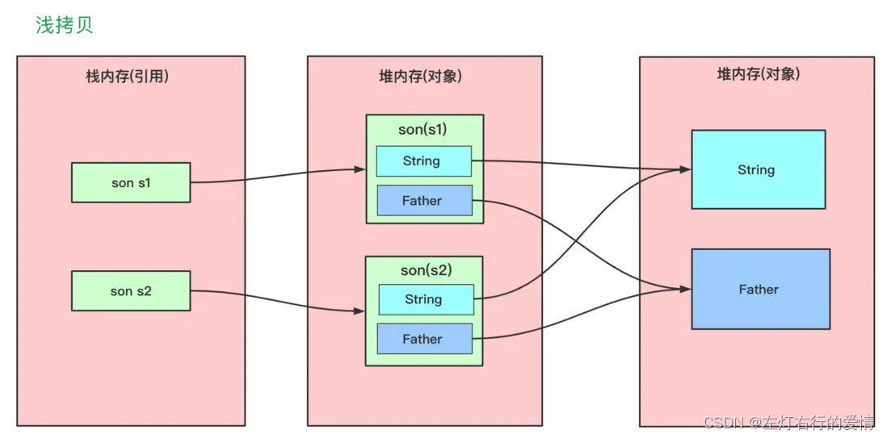
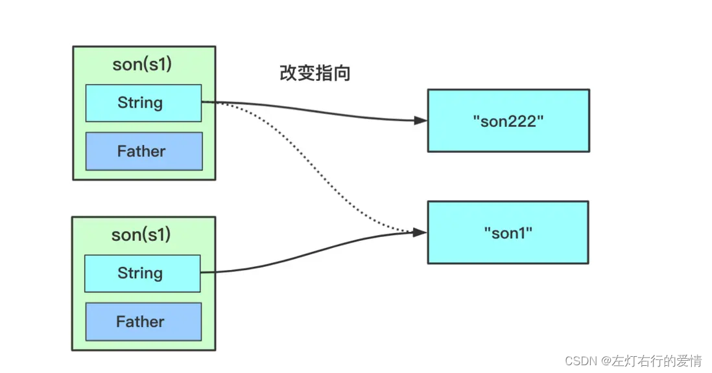
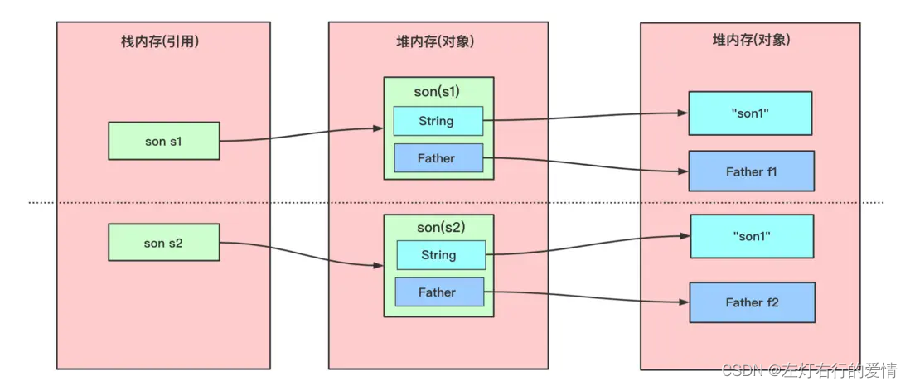
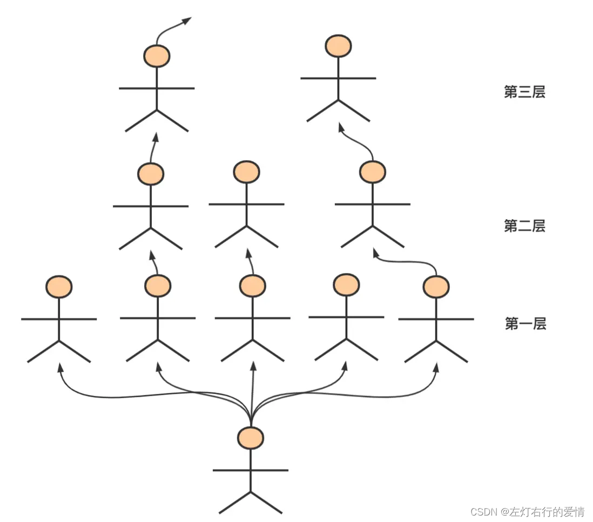

> 原文：[CSDN](https://blog.csdn.net/qq_45852626/article/details/136745684)（历史文章导入，当前状态为草稿）

## 前言

在编码中,我们可能会遇到需要将对象的属性复制到另一个对象中,这种情况叫做拷贝.  
 拷贝与Java内存结构有密切关系,拷贝有三种情况,引用拷贝,深拷贝和浅拷贝,下面来了解一下.

## 引用拷贝

引用拷贝会生成一个新的对象引用地址,但是他们最终指向依然是同一个对象.  
 举个例子来说:  
 一个人可以有多个名字,比如我中文名叫王一,英文名叫Ian(开头大写i),这两个名字指的都是我.  
 参考下图  
   
 代码示例:

```
class Son {
    String name;
    int age;

    public Son(String name, int age) {
        this.name = name;
        this.age = age;
    }
}
public class test {
    public static void main(String[] args) {
        Son s1 = new Son("son1", 12);
        Son s2 = s1;
        s1.age = 22;
        System.out.println(s1);
        System.out.println(s2);
        System.out.println("s1的age:" + s1.age);
        System.out.println("s2的age:" + s2.age);
        System.out.println("s1==s2" + (s1 == s2));//相等
    }
}


```

输出的结果为:

```
Son@135fbaa4
Son@135fbaa4
s1的age:22
s2的age:22
true


```

## 浅拷贝

如果我们只是想将目标对象的内容复制过来而不是直接拷贝引用,那么使用浅拷贝是很好的方式.  
 浅拷贝概念: 浅拷贝会创建一个对象,新对象和原对象本身没有任何关系,新对象和原对象不相等,但是新对象的属性和老对象相同.  
 具体可以看如下区别:

* 属性是基本类型(int,double,long,boolean等)  
   拷贝的是基本类型的值
* 属性是引用类型  
   拷贝的是内存地址(即复制引用但不复制引用的对象),因为如果其中一个对象改变了这个地址,就会影响到另一个对象.  
   如下图:  
     
   那么如何实现浅拷贝呢?  
   **在需要拷贝的类上实现Cloneable接口并重写其clone(方法)**  
   为什么要重写呢?  
   重写是为了扩大访问权限,如果不重写,Object的clone方法的修饰符是protected，除了与Object同包(java.lang)和直接子类能访问，其他类无权访问。

```
@Override
protected Object clone() throws CloneNotSupportedException {
  return super.clone();
}


```

在使用的时候直接调用类的clone()方法即可.如下

```
class Father{
    String name;
    public Father(String name) {
        this.name=name;
    }
    @Override
    public String toString() {
        return "Father{" +
                "name='" + name + '\'' +
                '}';
    }
}
class Son implements Cloneable {
    int age;
    String name;
    Father father;
    public Son(String name,int age) {
        this.age=age;
        this.name = name;
    }
    public Son(String name,int age, Father father) {
        this.age=age;
        this.name = name;
        this.father = father;
    }
    @Override
    public String toString() {
        return "Son{" +
                "age=" + age +
                ", name='" + name + '\'' +
                ", father=" + father +
                '}';
    }
    @Override
    protected Son clone() throws CloneNotSupportedException {
        return (Son) super.clone();
    }
}
public class test {
    public static void main(String[] args) throws CloneNotSupportedException {
        Father f=new Father("bigFather");
        Son s1 = new Son("son1",13);
        s1.father=f;
        Son s2 = s1.clone();
        
        System.out.println(s1);
        System.out.println(s2);
        System.out.println("s1==s2:"+(s1 == s2));//不相等
        System.out.println("s1.name==s2.name:"+(s1.name == s2.name));//相等
        System.out.println();

        //但是他们的Father father 和String name的引用一样
        s1.age=12;
        s1.father.name="smallFather";//s1.father引用未变
        s1.name="son222";//类似 s1.name=new String("son222") 引用发生变化
        System.out.println("s1.Father==s2.Father:"+(s1.father == s2.father));//相等
        System.out.println("s1.name==s2.name:"+(s1.name == s2.name));//不相等
        System.out.println(s1);
        System.out.println(s2);
    }
}


```



## 深拷贝

如何绝对的拷贝这个对象,使这个对象完全独立于原对象?  
 这时候可以使用深拷贝.  
 在实际使用时，我们肯定是希望新拷贝出来的对象不受原对象的影响，否则咱们做出拷贝的意义何在？（我就碰到过因为对象被同事插进来的代码导致对象发生了变更，代码出现BUG的问题，后面是使用的深拷贝才消除同事的代码对该对象的影响）  
 深拷贝概念:  
 在对引用数据类型进行拷贝的时候,创建了一个新的对象,并且复制其内的成员变量.  
   
 在具体实现深拷贝上,这里提供两个方式,重写clone()方法和序列法

### 重写clone()方法

如果要使用这种方法,那么就要将类中所有自定义引用变量的类也实现Cloneable接口实现clone()方法

```
//Father clone()方法
@Override
protected Father clone() throws CloneNotSupportedException {
    return (Father) super.clone();
}
//Son clone()方法
@Override
protected Son clone() throws CloneNotSupportedException {
    Son son= (Son) super.clone();//待返回克隆的对象
    son.name=new String(name);
    son.father=father.clone();
    return son;
}


```

结果如下:

```
Son{age=13, name='son1', father=Father{name='bigFather'}}
Son{age=13, name='son1', father=Father{name='bigFather'}}
s1==s2:false
s1.name==s2.name:false

s1.Father==s2.Father:false
s1.name==s2.name:false
Son{age=12, name='son222', father=Father{name='smallFather'}}
Son{age=13, name='son1', father=Father{name='bigFather'}}


```

### 序列化

如果引用数量太多,或者层数太多了使用深拷贝会让人绝望!  
 那么我们可以使用序列化的方式来实现深拷贝  
   
 序列化后,将二进制字节流内容写到一个媒介(文本或字符数组),然后通过这个媒介读取数据,原对象写入这个媒介后拷贝给clone对象,原对象的修改不会影响clone对象,因为clone对象是从这个媒介读取的.  
 熟悉对象缓存的知道Java对象存在Redis中,在Redis中读取出来生成Java对象,这就需要用到序列化和反序列化.  
 一般是将Java对象存储为字节流或者Json串然后反序列化成Java对象.  
 因为序列化会储存对象的属性但是无法存储对象在内存中地址相关信息,所以在反序列化成Java对象的时候会重新创建所有的引用对象.  
 具体实现上:  
 自定义类需要实现Serializable接口,在需要深拷贝的类(Son)中定义一个函数返回该类对象.

```
protected Son deepClone() throws IOException, ClassNotFoundException {
      Son son=null;
      //在内存中创建一个字节数组缓冲区，所有发送到输出流的数据保存在该字节数组中
      //默认创建一个大小为32的缓冲区
      ByteArrayOutputStream byOut=new ByteArrayOutputStream();
      //对象的序列化输出
      ObjectOutputStream outputStream=new ObjectOutputStream(byOut);//通过字节数组的方式进行传输
      outputStream.writeObject(this);  //将当前student对象写入字节数组中

      //在内存中创建一个字节数组缓冲区，从输入流读取的数据保存在该字节数组缓冲区
      ByteArrayInputStream byIn=new ByteArrayInputStream(byOut.toByteArray()); //接收字节数组作为参数进行创建
      ObjectInputStream inputStream=new ObjectInputStream(byIn);
      son=(Son) inputStream.readObject(); //从字节数组中读取
      return  son;
}


```

结果

```
Son{age=13, name='son1', father=Father{name='bigFather'}}
Son{age=13, name='son1', father=Father{name='bigFather'}}
s1==s2:false
s1.name==s2.name:false

s1.Father==s2.Father:false
s1.name==s2.name:false
Son{age=12, name='son222', father=Father{name='smallFather'}}
Son{age=13, name='son1', father=Father{name='bigFather'}}


```
