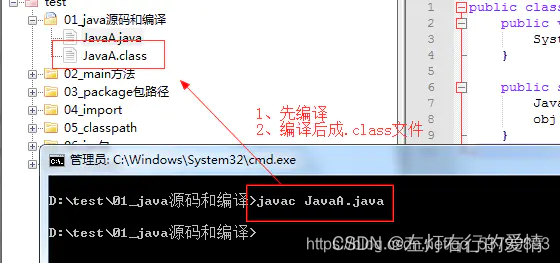
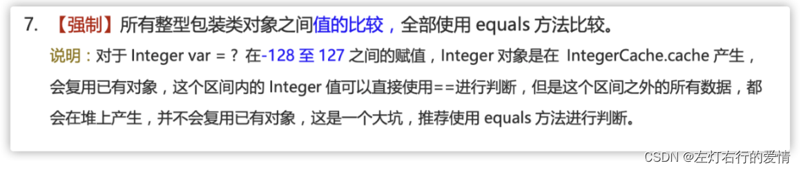
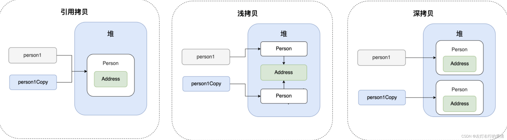
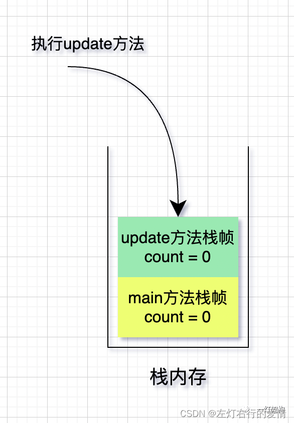

> 原文：[CSDN](https://blog.csdn.net/qq_45852626/article/details/139376920)（历史文章导入，当前状态为草稿）

## Java语言

### Java语言有什么特点

* Java是一门面向对象的编程语言,具备**封装,继承,多态,抽象**四大特性  
   封装: 提高类的易用性,减少编程过程中代码出错的风险  
   继承: 实现代码的复用  
   抽象: 能让程序的设计和实现分离  
   多态: 提高了程序的可扩展性
* Java具有平台独立性和移植性  
   一次编写,到处运行.已编译的Java程序可以在任何带有JVM的平台上运行.  
   方式: 将代码编译成.class文件,再把class文件打成java包,这个jar包就可以在不同的平台运行了.
* Java具有稳健型  
   Java上一个强类型语言:  
   检测潜在类型不匹配问题的功能;  
   要求显示的方法声明,不支持c风格的隐式说明;  
   有异常处理;

### Java与C++区别

* C++支持多继承,并且有指针的概念,程序员自己管理内存
* Java上单继承,可以用接口实现多继承;Java不提供指针直接访问内存,有JVM自动内存管理机制,不需要程序员手动释放无用内存.

### Java如何实现跨平台

Java通过JVM(Java虚拟机)实现跨平台  
 JVM可以理解成一个软件,不同平台有不同版本.  
 编写的Java代码编译后生成.class文件(字节码文件).  
 JVM就是负责将字节码文件翻译成特定平台下的机器码.  
 不同平台下翻译生成的字节码上一样的,但是由JVM翻译成的机器码却不一样的.

### JVMvsJDKvsJRE

JVM上运行Java字节码的虚拟机.  
 JVM有针对不同系统的特定实现(windos,linux,macOS)  
 目的是使用相同的字节码,他们都会给出相同的结果.  
 JVM并不是只有一种,只要满足JVM规范,每个人或组织都可以开发自己的专属JVM.

JDK  
 JDK是Java Development Kit(Java开发工具包) 缩写,它是功能齐全的Java 还有编译器和工具,可以创建和编译程序.

SDK(Software Development Kit)软件开发工具包.

JRE  
 Java运行时环境,它是运行已编译Java程序所需的所有内容集合(包括JVM,Java类库,Java命令和其他一些基础构件)

总结  
 JRE = JVM+Java核心库  
 JDK = jRE+Java工具+编译器+调试器

### 什么是字节码,采用字节码的好处是什么?

JVM可以理解的代码为字节码(扩展名为.class的文件),它不面向任何特定的处理器,只面向虚拟机.  
 一定程序上解决了传统解释型语言执行效率低的问题,同时又保留了解释型语言可移植的特点.  
 因为字节码并不针对一种特定的机器,所以Java程序无序重新编译便可在多种不同操作系统的计算机上运行.  
   
 在.class->机器码这步,JVM类加载器首先加载字节码文件,然后通过解释器逐行解释.  
 但这种方式执行速度相对较慢,同时有些方法和代码块是需要被经常调用(热点代码)  
 我们引进JIT(just-in-time compilation,及时编译)编译器.  
 JIT完成第一次编译后,会将字节码对应的机器码保存下来,下次可以直接使用.

### 为什么说Java语言是“编译与解释并存“

高级编程语言按照程序的执行方式分为两种:

* 编译型  
   编译型语言通过编译器将源代码一次性翻译为可被该平台执行的机器码.  
   执行速度比较快,开发效率比较低(C,C++,Go,Rust)
* 解释型  
   通过解释器一句一句将代码解释为机器代码后再执行.  
   解释型语言执行速度比较慢,开发效率比较快(Python,JS,PHP等)  
   JVM为了避免解释型语言带来的执行效率低问题,采用了即时编译JIT技术,将热点代码的字节码直接编译为机器指令来提高性能.  
   Java程序要经过先编译,后解释两个步骤,由Java编写的程序需要先经过编译步骤,生成字节码(.class文件),这种字节码必须由Java解释器来解释执行.  
   先编译为字节码目的是实现平台无关性,而字节码采用解释的方式是为了实现一些动态特性(例如动态代理),最后JIT会因为性能需要进行一个提前编译.

### Java和C++的区别

Java和C++都是面向对象语言,都支持封装,继承和多态,但还是有一些方面不同

* Java不提供指针直接访问内存,程序内存更加方便,并且提供垃圾回收机制,不需要程序员手动释放无用内存
* Java类是单继承,C++支持多继承,但Java提供接口来解决提供多继承功能
* Java只支持方法重载,不支持操作符重载

### 标识符和关键字的区别是什么

写程序时,需要为程序,类,变量,方法取名字就有了标识符.  
 简单来说,标识符就是一个名字  
 但对于有些标识符,Java语言已经赋予了其特殊的含义,只能用于特定的地方,这些特殊的标识符就是关键字.

### 自增自减运算符

符号在前先加减,符号在后后加减

### 移位运算符

移位操作中,被操作的数据被视为二进制数,移位就是向左或向右移动若干位的运算.  
 三种移位运算符

* << :左移运算符,向左移若干位,高位丢弃,低位补零
* > > : 带符号右移,向右移若干位,高位补符号位,低位丢弃.  
  > >  正数高位补0,负数高位补1.
* > > > : 无符号右移,忽略符号位,空位都以0补齐  
  > > >  移位操作服支持的类型只有int和long.  
  > > >  编译器对short,byte,char类型进行移位前,都会将其转换为int类型再操作.  
  > > >  **移位超过所占有位数会先求余(%)再进行左移和右移操作**

### continue,break,return的区别是什么

循环结构中,当循环条件不满足或者是循环次数达到要求时,循环正常结束,  
 但有时候需要中循环过程中,发生某种条件时,提前终止循环,就会用到下面几个关键词

* continue: 跳出当前的这一次循环,继续下一次循环
* break: 跳出整个循环体,继续执行循环下面的语句
* return: 跳出所在方法,结束该方法的运行.

### final,finally,finalize的区别

* final  
   用于修饰属性,方法和类,分别表示  
   属性不能被重新修改  
   方法不可被覆盖  
   类不可被继承
* finally  
   异常处理语句结构的一部分,一般已try-catch-finally的形式出现,finally总是被执行
* finalize  
   Object 类的一个方法,该方法一般由垃圾回收器来调用,当我们调用**System.gc**方法时,由垃圾回收器调用finalize方法回收垃圾,JVM并不保证此方法总被调用(垃圾回收的确切时间和频率是由 JVM 的垃圾回收器（GC）算法和策略决定的，这些算法和策略可能因不同的 JVM 实现和配置而异。)

### final关键字的作用时什么

* final修饰的类不能被继承
* final修饰的方法不能被重写
* final修饰的变量叫常量,常量必须初始化,初始化之后值就不能被修改.

## 变量

### 成员变量与局部变量的区别

* **语法**  
   成员变量属于类,局部变量属于代码块或方法定义的变量或者方法的参数  
   成员变量可以被**访问控制符**修饰以及static,final修饰.  
   成员变量和局部变量只能被final修饰.
* **存储方式**  
   变量存储在内存中.  
   成员变量如果用static修饰—成员变量则是属于类的,此成员变量放在方法区  
   如果没有用static修饰–成员变量属于实例,而对象存在在堆内存,所以该成员变量存放在堆内存

局部变量存在与栈内存

* **生存时间**  
   成员变量上对象的一部分,它随着对象创建而存在  
   局部变量是随着方法的生命周期创建和消亡.
* **默认值**  
   成员变量会自动以类型的默认值而赋值(如果被final修饰则必须显式地赋值)  
   局部变量不会自动赋值.

### 字符型常量和字符串常量的区别

* 语法  
   字符常量上单引号的一个字符  
   字符串上双引号的0个字符或n个字符
* 含义  
   字符常量相当于一个整型值(ASCII值),可以参加表达式运算  
   字符串常量代表一个地址值(该字符串中内存中存放位置)
* 内存大小  
   字符常量只占2个字节;  
   字符串常量上n个字节;

## 方法

### 静态方法为什么不能调用非静态成员

静态方法上属于类的,在类加载的时候就会被分配内存,可以通过类名直接访问.  
 非静态成员属于实例对象,只有在对象实例化之后才存在,通过通过**类实例对象**去访问

所以,类的非静态成员不存在的时候静态方法就已经存在了,此时调用在内存中还不存在的非静态成员,属于非法操作.

### 静态方法和实例方法有什么不同

* 调用方式  
   在外部调用静态方式时,使用类名.方法名的方式,也可以使用对象.方法名的方式.  
   而实例方法只有对象.方法名的方式.  
   也就是说,调用静态方法无需创建对象.  
   **注意:不建议使用对象.方法名调用静态方法,容易造成误解,静态方法不属于对象而是属于类**
* 访问类成员是否存在限制  
   静态方法访问本类成员时,只允许访问静态成员(静态成员变量和静态方法),不允许访问实例成员.

### 重载和重写有什么区别

* 重载  
   同一个类中多个**同名方法**根据**不同的传参**来执行**不同的逻辑处理**
* 重写  
   子类对父类方法的重新改造,**外部样子不能改变**,内部逻辑可以改变.、  
   但是要遵从两同两小一大  
   两同:  
   方法名相同,行参列表相同  
   两小:  
   子类方法返回值类型比父类更小或相等  
   子类方法抛出的异常类比父类抛出的更小或相等  
   一大:  
   子类**方法访问权限**比父类更大或相等  
   这里返回值类型不够准确:  
   如果方法返回类型时void和基本数据类型----返回值重写时不可修改  
   方法返回值时引用类型----返回值可以返回引用类型的子类

## 基本数据类型

### 几种基本数据类型

Java有8种基本数据类型,分别为:

* 6种数字类型

1. 4种整数型  
    byte,short,int,long
2. 2种浮点型  
    float,double

* 字符类型  
   char
* 布尔类型  
   boolean

### 基本类型和包装类型的区别

* 默认值  
   基本类型有默认值且不为null  
   包装类型不赋值就是null
* 是否可以用于范型  
   基本类型不可以用  
   包装类可用
* 存储位置  
   基本类型:  
   局部变量—JVM栈中的局部变量表  
   成员变量—JVM的堆中(未被static修饰)  
   包装类型:  
   包装类型属于对象类型,都存在于堆中.
* 占用空间大小  
   基本数据类型: 占用空间非常小  
   包装类型: 占用空间>基本数据类型

### 为什么需要包装类

Java是面向对象语言,很多地方需要使用对象而不是基本数据类型.  
 比如在集合中,无法将int等类型放进去----因为集合要求元素是Object类型  
 **为了让基本类型也有对象的特征,就出现了包装类型**,并且为其添加了属性和方法,丰富了基本类型的操作.

### 包装类的缓存机制了解吗

Java包装类型的大部分都用到了缓存机制来提升性能  
 在**类初始化**时,**提前创建好会频繁使用的包装类对象**,当需要**使用某个类的包装类对象时**,如果该对象包装的值在缓存范围内,就返回缓存的对象,否则就创建新的对象并返回

注意: 所有整型包装类对象之间值的比较,全部使用equals方法比较  
 举例:

```
Integer A = 40;
Integer B = new Integer(40);
System.out.println(A == B)


```

第一行代码会发生装箱,也就说这行代码等价于`Integer A = Integer.valueOf(40)`.  
 所以A直接使用的是缓存中的对象,而Integer B 会直接创建新的对象,  
 所以答案是false/  
 

### Integer 和 int 有什么区别

* 数据类型  
   int 是基本数据类型,Integer是引用数据类型  
   基本数据类型是预定义的,不需要实例化就可以使用  
   引用数据类型是需要实例化后才可以使用  
   这意味着基本数据类型不需要任何额外的内存分配  
   而引用数据类型必须为对象分配内存.
* 自动装箱和拆箱  
   Integer作为int的包装类可用实现自动装箱和拆箱.
* 空指针异常  
   基本数据类型不会出现空指针异常  
   而包装类必须通过实例化对象来赋值,否则对其进行操作时就会出现空指针异常.  
   null值是无法进行自动拆箱的

### 自动装箱与拆箱了解吗?原理是什么?

装箱: 将基本类型用它们对象的引用类型包装起来  
 拆箱: 将包装类型转换为基本数据类型  
 装箱起时就是调用了包装类的valueOf方法  
 而拆箱就是调用了xxxValue方法(xxx根据类型发生改变)  
 频繁的拆装箱会严重影响系统的性能,应该尽量避免不必要的拆装箱操作.

## 面向对象基础

### 面向对象和面向过程的区别

主要区别是**解决问题的方式**不同

* 面向过程  
   把解决问题的过程拆成一个个方法,通过一个个方法的执行解决问题
* 面向对象  
   先**抽象出对象**,然后用对象执行方法的方式去解决问题  
   面向对象开发程序一般更容易去维护,复用和扩展.

### 创建对象用什么运算符,对象实体与对象引用有什么不同

New运算符.  
 New创建对象实例(在堆内存中),对象引用指向对象实例(引用一般放在栈或者堆内存中)  
 1个对象引用可以指向0/1个对象  
 一个对象可以有n个引用指向它.

### 对象相等和引用相等的区别

对象相等比较的是**内存中存放的内容**是否相等  
 引用相等比较多说它们指向**内存地址**是否相等

### 面向对象的三大特征

封装，就是将客观事物抽象为逻辑实体，实体的属性和功能相结合，形成一个有机的整体。并对实体的属性和功能实现进行访问控制，向信任的实体开放，对不信任的实体隐藏。，通过开放的外部接口即可访问，无需知道功能如何实现。

也就是说，封装主要有以下目的：

可隐藏实体实现的细节。  
 提高安全性，设定访问控制，只允许具有特定权限的使用者调用。  
 简化编程，调用方无需知道功能是怎么实现的，即可调用。

* 封装  
   将客观事物**抽象**为逻辑实体,实体的属性和功能相结合,形成一个整体.  
   并实现对属性和功能的控制访问.  
   通过开放的外部接口即可访问,无需知道功能里面是如何实现的  
   例子:  
   我们看不到空调内部零件,但是可以通过遥控器控制空调.

目的:

1. 隐藏实体实现的细节。
2. 提高安全性，设定访问控制，只允许**具有特定权限**的使用者调用。
3. 简化编程，调用方无需知道功能是怎么实现的，即可调用。  
    -继承  
    形成有层级的类，使得低层级的类可以延用高层级类的特征和方法。继承的实现方式有两种：实现继承、接口继承。  
    有了继承就使得类有了层级,低层级的类可以**延用高层级类的特征和方法.**  
    实现方式有两种:  
    一: 实现继承  
    直接使用基类公开的属性和方法,不需要额外敲代码  
    二:接口继承  
    使用接口公开的属性和方法名称,需要子类实现

目的:  
 一:复用代码,减少冗余代码,减少开发工作量  
 二:为多态实现打下基础,使类与类之间产生联系

* 多态  
   一个类的同名方法,在不同情况下实现细节不同.  
   多态机制使得**不同内部实现**结构共用一个外部接口

目的:  
 一个外部接口可以被多个同类使用  
 不同对象调用同个方法,可以有不同实现

所以可以看出,**多态的实现基础是基于继承**

### 面向对象的五大基本原则

### 接口和抽象类的共同点和区别

共同点

1. 都不能被实例化
2. 都可以包含抽象方法
3. 都可以有默认的实现方法(java8 可以用default关键字在接口中定义默认方法)  
    区别  
    一:  
    接口是对类的行为进行约束,你实现了某个接口就具有了对应的行为  
    抽象类主要用于代码的服用,且强调的是所属关系  
    二:  
    接口的成员变量只能说 `public static final`,不能背修改且必须有初始值.  
    抽象类的成员变量默认为default,可在子类中重新定义,也可以背重新赋值.

### 深拷贝和浅拷贝区别了解吗?

* 深拷贝  
   完全复制整个对象.包含这个对象所包含的内部对象
* 浅拷贝  
   会在堆上创建一个新的对象(区别引用拷贝的一点),只拷贝对象本身,如果原对象内部属性是引用类型的话,会复制内部对象的引用地址,与原对象共用一个内部对象.



### Java中是值传递还是引用传递,还是两者共存

Java传递的只有值  
 执行方法时,会将方法的栈帧压入栈内存,但是栈帧中的变量不会相互影响.  
 

## Java常见类

### Object类的常见方法有哪些

getClass  
 clone  
 hashCode  
 equals  
 notify  
 notifyAll  
 wait  
 finalize  
 toString

常用的:  
 hashCode: 获取哈希码  
 equals: 判断两个对象是否相等  
 getClass: 返回一个对象运行时的实例类  
 toString: 返回该对象的字符串表示

### == 和 equals()的区别

==对于基本数据类型和引用数据类型的作用效果是不同的:

* 对于基本数据类型来说,== 比较的是值的内容
* 对于引用数据类型来说,==比较的对象的内存地址

因为Java只有值的传递,所以对于==来说,不管是比较哪一个数据类型,本质比较多都是值,只不过引用类型变量存的值是对象的地址.

equals不能用于判断基本数据类型的变量,只能用于判断两个对象是否相等  
 因为equals方法是存在Object类中的,而Object类是所有类的直接或间接父类,因此所有的类都有equals方法  
 equals方法存在两种使用情况:

* 类没有重写equals()方法  
   通过equals()比较该类的两个对象时,等价于通过 == 比较两个对象,使用的默认是Object类equals方法

```
public boolean equals(Object obj){
 return (this == obj)
}


```

* 类重写了equals()方法  
   一般会重写equals方法来比较**两个对象中的属性是否相等**;  
   若它们的属性相等,则返回true(即认为这两个对象相等)

String的equals方法是被重写过的,Object的equals比较多对象的内存地址,而String的equals比较的是对象的值.

### hashCode()有什么用

作用是获取哈希码(int整数),也称为散列码.  
 这个哈希码的作用是确定该**对象在哈希表中的索引位置**  
 hashCode是本地方法,也就是说用c/c++语言实现的,通常是用来将对象的内存地址转换为整数后返回.

```
public native int hashCode()


```

散列表存储的是键制对(key-value),特点是:根据“键“快速检索出对应的值.

### 为什么要有hashCode方法

hashCode和equals都是用于比较两个对象是否相等  
 **那为什么JDK要同时提供这两个方法呢?**  
 因为在容器中,有了hashCode之后,判断元素是否在对应**容器中的效率会更高**  
 比如在在元素添加到HashSet的过程中,如果同样的hashCode有多个对象,会继续使用equals来判断是否真多相同.  
 **换句话说: hashCode帮助我们大大缩小了查找成本**  
 **为什么不只提供hashCode方法呢?**  
 hashCode使用的哈希算法可能会发生哈希碰撞,也就说说不同的对象得到相同的hashCode

总结就是:

* 如果两个对象的hashCode值相等,那这两个对象不一定相等
* 如果两个对象的hashCode值相等并且equals方法也返回true,我们才认为这两个对象相等
* 如果两个对象的hashCode值不相等,我们可以直接认为这两个对象不相等

### 为什么重写equals()时必须重写hashCode()方法

因为两个相等的对象的hashCode值必须是相等.  
 换句话说,如果equals方法判断两个对象相等,那么两个对象的hashCode值也要相等  
 如果重写equals时没有重写hashCode方法的话可能会导致equals判断结果是相等对象,而hashCode值却不相等

## String

### String,StringBuffer,StringBuilder的区别

* 可变性  
   String是不可变的  
   StringBuffer和StringBuilder都是可变的,它们继承自`AbstractStringBuilder类`,这个类中使用字符数组保存字符串,并且提供了很多修改字符串的方法比如append fan方法.
* 线程安全性  
   String对象是不可变的,也可以理解为常量,线程安全  
   StringBuffer对方法添加了同步锁或者对调用的方法加了同步锁,所以线程安全  
   StringBuilder没有对方法加同步锁,所以是非线程安全的
* 性能  
   String 进行改变时,都会新生成一个String对象,然后将指针指向新的String对象.  
   StringBuffer和StringBuilder能在对象本身上进行操作,StringBuilder比StringBuffer快一些(10%-15%)
* 适用场景  
   操作少量数据: 使用String  
   单线程字符串缓冲区操作大量数据: 使用StringBuilder  
   多线程字符串缓冲区操作大量数据: 使用StringBuffer

### String为什么不可变

String类使用private,final关键字修饰字符数组来保存字符串.

### 字符串拼接用"+"还是StringBuilder?

Java本身不支持运算符重载  
 +和+= 是专门为String类重载的运算符,也是Java仅有的两个重载过的运算符  
 用+ 的实质还是通过StringBuilder调用append方法实现的,拼接完成后调用toString得到一个String对象.

“+” 的弊端:  
 如果在循环内使用+进行字符串拼接的话,编译器会创建多个Stringbuilder.

### 字符串常量池的作用了解过吗?

字符串常量池是JVM为了**提升性能和减少内存消耗**对**字符串(String)专门开辟**的一块区域  
 主要目的是**避免字符串的重复创建**  
 存储位置:  
 堆内存中

### String s1 = new String(“abc”);这句话创建了几个字符串对象?

创建1个或者2个对象

* 创建2个对象  
   如果字符串常量池不存在字符串对象"abc"的引用,那么堆中创建2个字符串对象"abc"—常量池一个,堆里再创1个
* 创建1个对象  
   如果字符串常量池已存在字符串对象"abc"的引用,则只会在堆中创建1个字符串对象"abc"

## 异常

### 什么是异常

一个方法不能通过正常的路径完成任务的话,异常提供了另外一种路径去结束这个方法.  
 然后抛出一个封装了错误信息的对象,这个方法会立即退出并且不返回任何值.  
 另外,调用这个方法的其他代码也不会被执行,异常处理机制会把代码执行交给异常处理器.

### 异常体系

Java有个类叫Throwable,它是所有错误和异常的超类.  
 它的下一层是Error和Exception  
 分别表示**问题类型**以及**程序处理问题方式.**

Error:  
 它的问题类型:Java运行时**系统的内部错误**和**资源耗尽错误**,应用程序不会抛出该类对象.  
 不抛出的原因在于,绝大多数的error都会导致程序非正常且不可恢复状态,比如OutOfMemoryError  
 处理方式: 主要是JVM负责处理.

Exception:

* 检查时异常  
   问题类型: 编译时需要去处理的异常  
   处理方式: 需要通过try-catch块或者向上抛出throws来处理异常.  
   常见的错误时`ClassNotFoundException`
* 运行时异常  
   问题类型: 开发时出现的异常和错误,通常是**程序逻辑**引起的  
   举例: `NullPointException`  
   处理方式: 捕获然后去处理它们
* 自定义运行时异常  
   它的实现方式: 继承RuntimeException即可.  
   例子:  
   假如你开车上山，车坏了，你拿出工具箱修一修，修好继续上路（Exception被捕获，从异常中恢复，继续程序的运行），车坏了，你不知道怎么修，打电话告诉修车行，告诉你是什么问题，要车行过来修。（在当前的逻辑背景下，你不知道是怎么样的处理逻辑，把异常抛出去到更高的业务层来处理）。  
   你打电话的时候，要尽量具体，不能只说我车动不了了。那修车行很难定位你的问题。（要补货特定的异常，不能捕获类似Exception的通用异常）。

还有一种情况是，你开车上山，山塌了，这你还能修吗？（Error：导致你的运行环境进入不正常的状态，很难恢复）

### throw和throws的区别

位置不同:  
 throw是用在函数内,后面跟的是异常对象  
 throws用在函数上,后面跟的上异常类,并且可以跟多个  
 功能不同  
 throw是抛出具体问题对象,执行到throw,功能也就结束了,然后跳转到调用者,并将具体的问题对象抛给调用者.  
 throws用来声明异常,让调用者明白功能可能出现的问题,可以给出预先的处理方式.

相同点:  
 它们都是比较消极的处理异常的方式,只是抛出或可能抛出异常,但不会由函数去处理异常  
 真正处理异常由函数的上层调用处理.

### try-catch-finnaly的本质是什么?

### try-catch-finnaly中,如果catch中return了,finally还会执行吗?

会,当try和catch中国有return时,finally仍然会执行

### finnaly一定会被执行吗

不一定,有两种情况finnaly不会被执行:

* 程序未执行到try代码块
* 一个线程执行try语句块或者catch语句块被打断(interrupted)或者被终止(killed),finally不会执行
* 如果运行try或catch语句块时,突然死机或者断电,finally语句块肯定不会执行了.

### finally内存回收情况

* 数据库  
   如果在try… catch 部台用Connection 对象连接了数据库，而且在后继部台不会再用到这个连接对象，那么一定要在 finally从句中关闭该连接对象， 否则i亥连接对象所占用的内存资源无法被回收。
* IO操作  
   如果在try… catch 部分用到了一些IO对象进行了读写操作，那么也一定要在finally 中关闭这些IO对象，否则，IO对象所占用的内存资源无法被回收。
* 集合  
   如果在try .catch 部分用到了ArrayList 、Linkedlist 、Hash Map 等集合对象，而且这些对象之后不会再被用到，那么在finally中建议通过调用clear方法来清空这些集合。
* 对象  
   例如，在try .catch 语句中育一个对象obj 指向7一块比较大的内存空间（假设100MB) ，而且之后不会再被用到，那么在 finally 从句中建议写上 obj=null，这样能提升内存使用效率。

Java基础  
 6. Java语言的特点  
 7. 面向对象四大特性  
 8. JVM,JDK,JRE  
 9. 详细说编译与解释并存  
 10. 标识符与关键字  
 11. final,finally,finalize区别  
 12. 成员变量与局部变量的区别  
 13. 重载和重写有什么区别  
 14. 深拷贝与浅拷贝  
 10.String,StringBuffer,StringBuilder区别,  
 15. == 和equals  
 16. java异常的了解  
 17.  
 18. 了解范型吗  
 19. 范型的使用方式  
 20. 了解反射吗  
 21. 动态代理  
 22. 了解注解吗  
 23. 注解的解析方法有哪几种

新特性  
 java8

集合  
 1.ArrayList与LinkedList区别,他们对于内存空间占用  
 2. ArrayList扩容机制  
 3. HashSet的实现原理  
 4. HashSet不允许重复的值,数据结构有什么区别.  
 5. Queue与Deque的区别  
 6. HashMap的put流程  
 7. HashMap的长度为什么说2的幂次方  
 8. HashMap在多线程操作会导致什么问题.如何解决呢  
 9. HashMap和HashTable有什么区别?

Java并发  
 1.并发编程三个必要因素  
 10. 如何保证多线程的运行安全  
 11. happens-before  
 12. 创建线程的几种方式  
 13. sleep和wait 有什么区别  
 14. 唤醒阻塞的线程  
 15. 说一下你对锁的理解  
 16. 说一下你对synchronize底层原理  
 17. 可重入原理是什么  
 18. 内存模型  
 19. Lock接口和synchronize对比同步有什么优势.  
 20. 乐观锁和悲观锁的理解  
 21. CAS是什么  
 22. CAS会产生什么问题?  
 23. 线程池是什么,我们为什么要用线程池.核心参数  
 24. 线程池的拒绝策略有哪些  
 25. 线程池有哪些状态  
 26. AQS底层数据结构  
 27. CLH入队的流程

并发集合  
 28. ConcurrentHashMap实现原理  
 29.lian biao  
 29. ConcurrentHashMap的put流程  
 30. get方法需要枷锁吗,为什么?key,value是否为空

## 泛型

### 什么是泛型

泛型是JDK5引入的一个新特性,  
 主要提供了编译时期**类型安全的检测机制.**  
 这个机制可以在程序编译时检测到非法类型,从而进行错误提示.  
 它的好处是: 一方面**显示**给我们**当前方法接收或返回的参数类型**  
 另一方面避免程序**运行时的类型转换错误**.

举个例子:ArrayList中,存储元素使用的结构是一个Object[]对象数组  
 当我们在里面同时添加字符串和Integer类型时,编译器就会报错显示类型转换错误.

也就是说
