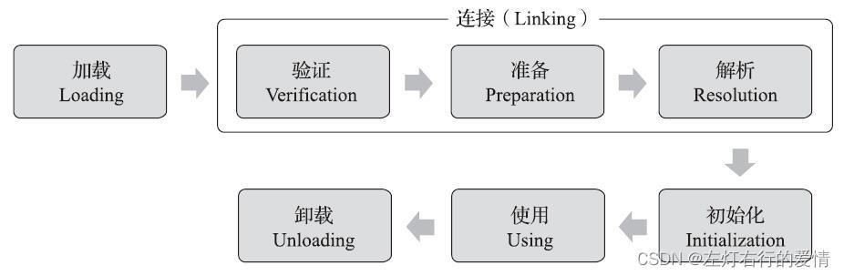
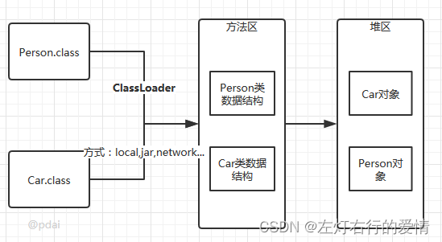
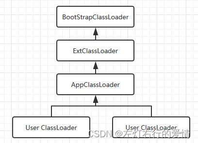

> 原文：[CSDN](https://blog.csdn.net/qq_45852626/article/details/128098525)（历史文章导入，当前状态为草稿）

### 前言

之前我们了解了Class文件存储格式的具体细节，在Class文件中描述的各类信息，最终都需要加载到JVM中才可以被运行和使用。  
 那么JVM要如何加载这些Class文件，Class文件进入到JVM后会发生什么变化呢？

#### 什么是类加载机制

JVM把描述类的数据从Class文件加载到内存，并对数据进行校验，转换解析和初始化，最终形成可以被JVM直接使用Java类型，这个过程就称为JVM的类加载机制。

在Java语言里面，类型的加载，连接和初始化过程都是在程序运行期间完成的，这种策略让Java语言进行提前编译会面临额外的困难，也让类加载稍微增加了性能开销，但是却为Java应用提供了极高的扩展性和灵活性，Java天生可以动态扩展的语言特性就是依赖运行期动态加载和动态连接这个特点实现的。

### 类的生命周期

类加载的过程包含了加载，验证，准备，解析，初始化五个阶段，其中，加载，验证，准备和初始化这四个阶段发生的顺序是确定的，而解析阶段则不一定，它在某些情况下可以在初始化阶段之后开始（这是为了支持Java语言的运行时绑定，也称之为动态绑定或晚期绑定）。另外注意这几个阶段是按顺序开始，而不是按顺序进行或完成，因为这些阶段通常都是相互交叉地混合进行，通常在一个阶段执行的过程中调用或激活另一个阶段。  
 

#### 类的加载：查找并加载类的二进制数据

加载是类加载过程的第一个阶段，在加载阶段，JVM需要完成以下三件事情：

* 通过一个类的全限定名来获取其定义的二进制字节流。
* 将这个字节流所代表的静态存储结构转化为方法区的运行时数据结构。
* 在Java堆中生成一个代表这个类的java.lang.Class对象，作为对方法区中这些数据的访问入口。  
     
   相对于类加载的其他阶段而言，加载阶段（准确来说，是加载阶段获取类的二进制字节流的动作）是可控性最强的阶段，因为开发人员既可以使用系统提供的类加载器来完成加载，也可以自定义自己的类加载器来完成加载。

加载阶段完成后，JVM外部的二进制字节流就按JVM所需的格式存储在方法区中，而且在Java堆中也后仓健一个java.lang.Class类的对象，这样便可以通过该对象访问方法区中的这些数据。

类加载器并不需要等到某个类被“首次主动使用”时再加载它，JVM规范允许类加载器在预料某个类将要使用时就预先加载它，如果在预先加载的过程中遇到了.class文件缺失或存在错误，类加载器必需在程序首次主动使用该类时才报告错误（LinkageError错误）如果这个类一直没有被程序主动使用，那么类加载器就不会报告错误。

《JVM规范》没有指明二进制字节流要从哪里获取，如何获取，所以我们有很多方式去实现，加载.class文件的方式：

* 从本地系统之间加载
* 通过网络下载.class文件
* 从zip，jar等归档文件中加载.class文件
* 从专有数据库中提取.class文件
* 将Java源文件动态编译为.class文件。

#### 链接

##### 验证：确保被加载的类的正确性

验证是连接阶段的第一步，这一阶段的目的是为了确保Class文件的字节流中包含的信息符合当前JVM的要求，并且不会危害JVM自身的安全。  
 验证阶段大致分为4个阶段的检验动作：

* 文件格式验证：验证字节流是否符合Class文件格式的规范；比如：是否以咖啡宝贝开头，主次版本号是否在当前JVM的处理范围之内，常量池中的常量是否有不被支持的类型。
* 元数据验证：对字节码描述的信息进行语义分析（对比：javac编译阶段的语义分析），以保证其描述的信息符合Java语言规范的要求；例如：这个类是否有父类，除了java.lang.Object之外。
* 字节码验证：通过数据流和控制流分析，确定程序语义是合法的，符合逻辑的。
* 符号引用验证：确保解析动作能正确执行，可以看作对类自身意外（常量池中的各种符号引用）的各类信息进行匹配性校验，通俗来说就是，该类是否缺少或者被禁止访问它依赖的某些外部类，方法，字段等资源。

注意：验证阶段是非常重要的，但是不是必须的，它对程序运行期没有影响，如果所引用的类经过反复验证，那么可以考虑采用-Xverifynone参数来关闭大部分的类验证措施，以缩短JVM类加载时间。

##### 验证？有必要吗

可能看到这你会说，为什么会需要验证Class文件的字节流信息呢？  
 Java语言本身是相对安全的编程语言，使用纯粹的Java代码无法做到例如访问数组边界以外的数据等等，如果尝试去做了，那么编译器会直接抛出异常，拒绝编译。  
 但是我们前面也聊到了，Class文件并不一定只能由Java源码编译而来，它可以使用包括靠键盘0和1直接在二进制编译器中敲出Class文件在内的任何途径产生。  
 JVM如果不检查输入的字节流，对其完全信任的话，很有可能会因为载入了有错误或者恶意企图的字节码流而导致整个系统受攻击甚至崩溃。

##### 准备：为类的静态变量分配内存，并将其初始化为默认值

准备阶段是正式为类变量分配内存并设置类变量初始值的阶段，**这些内存都将在方法区中分配**。  
 我们需要注意几点：

* 此时进行内存分配的仅仅包括类变量（static），而不包括实例变量，实例变量会在对象实例化时随着对象一块分配在Java堆中。
* 这里所设置的初始值**通常**是数据类型默认的零值（如0,0L，null，false等）,而不是被在Java代码中被显式地赋予的值。

举个栗子：假设一个类变量的定义为：`public static int value=3`;  
 变量value在准备阶段过后的初始值为0，而不是3，因为这时候尚未开始执行任何Java方法，而是把value赋值为3的put static指令是程序被编译后，存放与类构造器()方法之中，所以value赋值为123的动作要到**类的初始化阶段才会被执行**。

注意：上面我们说通常情况下初始值是零值，特殊情况如下：如果类字段的字段属性表中存在ConstantValue属性，那么在准备阶段变量值就会被初始化为ConstantValue属性所指定的初始值，也就是说准备阶段JVM就会根据ConstantValue的设置将value设置为3。

还需要注意几点：

* 对基本属性类型来说：  
   对于类变量(static）和全局变量，如果不显式对其赋值而直接使用，则系统会为其默认赋值为零值；  
   对于局部变量来说，在使用前必须显式地为其赋值，否则编译时不通过。
* 对于同时被static和final修饰的常量：  
   必须在声明的时候就为其显式地赋值，否则编译时不通过。  
   而对于只被final修饰的常量则既可以在声明时显式赋值，也可以在类初始化时显式地赋值，总之在使用前必须为其显式地赋值，系统不会为其赋值默认零值。
* 如果在数组初始化时没有对数组中的各元素赋值，那么其中的元素将根据对应的数据类型而被赋予默认的零值。

##### 解析：把类中的符号引用转换为直接引用

解析阶段是JVM将常量池内的符号引用替换为直接引用的过程，解析动作主要针对类或接口，字段，方法，接口方法，方法类型，方法句柄，调用点限定符7类符号引用进行。  
 符号引用和直接引用我们在第一篇JVM基础已经详细介绍过了，如果不太明白的可以去那里瞧一瞧，链接如下：  
 [深度学习与总结JVM专辑（一）：基础介绍&&内存结构（图文+代码）](https://blog.csdn.net/qq_45852626/article/details/127478146?spm=1001.2014.3001.5501)

##### 初始化

初始化，为类的静态变量赋予正确的初始值，JVM负责对类进行初始化，主要对类变量进行初始化。在Java中对类变量进行初始值设定有两种方式：

* 声明类变量是指定初始值
* 使用静态代码块Wie类变量指定初始值

JVM初始化步骤：

* 假如这个类还没有被加载和连接，则程序先加载并连接该类
* 假如该类的直接父类还没有被初始化，则先初始化其直接父类
* 假如类中有初始化语句，则系统依次执行这些初始化语句

类初始化时机：只有当对类的主动使用的时候才会导致类的初始化。  
 类的初始化主动使用包括以下六种：

* 创建类的实例，也就是new的方式
* 访问某个类或接口的静态变量，或者对该静态变量赋值
* 调用类的静态方法
* 反射
* 初始化某个类的子类，则其父类也会被初始化
* JVM启动时被标明为启动类的类（Java Test），直接使用java.exe命令来运行某个主类。

**补充**  
 在准备阶段时，变量已经赋过一次系统要求的初始零值。  
 在初始化阶段，则会根据程序员通过**程序编码制定的主观计划**去初始化**类变量和其他资源**。

初始化阶段就是执行类构造器()方法的过程。  
 ()并不是程序员在Java代码中直接编写的方法，它是javac编译器的自动生成物，但有必要了解这个方法如何产生以及运行行为细节。

()方法是由编译器自动收集类中的所有类变量的赋值动作和静态语句块（static{}块）中的语句合并而成；  
 编译器的收集顺序是由语句在源文件中出现的顺序决定的。

* 静态语句块中只能访问到定义在静态语句块之前的变量，在前面的静态语句块可以赋值，但是不能访问。  
   举个栗子：

```
public class Test {
    static {
        i = 0;  //  给变量复制可以正常编译通过
        System.out.print(i);  // 这句编译器会提示“非法向前引用”
    }
    static int i = 1;
}


```

* ()方法和类的构造函数（即在JVM视角中实例构造器()方法）不同，它不需要显式地调用父类构造器。  
   JVM会保证在子类的()方法执行前，父类的()方法已经执行完毕，因此JVM中第一个被执行的()方法肯定是java.lang.Object。
* 父类中定义的静态语句要优先于子类的变量赋值操作  
   因为父类的()方法要先执行。
* ()方法对于类和接口来说并不是必须的  
   如果一个类中没有静态语句块，也没有对变量的赋值操作，那么编译器可以不生成()方法。
* 接口中不能使用静态语句块，但仍然有变量初始化的赋值操作，因此接口和类一样都会生成()方法。  
   但接口与类不同的是，执行接口的()方法不需要先执行父接口的()方法，**因为只有当父接口中定义的变量被使用时**，父接口才会初始化。  
   此外，接口的实现类在初始化时也一样不会执行接口的()方法。
* JVM必需保证一个类的()方法在多线程环境中被正确地加锁同步，如果多个线程同时初始化一个类，只会有其中一个线程去执行，其他线程阻塞知道活动线程执行完毕()方法。

#### 使用

类访问方法区的数据结构的接口，对象是Heap区的数据。

#### 卸载

JVM结束生命周期的几种情况：

* 执行了System.exit()方法
* 程序正常执行结束
* 程序在执行过程中遇到了异常或错误而异常终止
* 由于操作系统出现错误而导致JVM进程终止

### 类加载器

JVM设计团队有意把类加载阶段中的“通过一个类的全限定名来获取描述该类的二进制字节流”这个动作放到JVM外部去实现，以便让应用程序自己决定如何去获取所需的类。  
 实现这个动作的代码被称为“类加载器”（Class Loader）。

#### 类与类加载器

类加载器虽然只用于实现类的加载动作，但它在Java程序中起到的作用却远超类加载阶段。  
 对于任意一个类，都必须由加载它的类加载器和这个类本身一起共同确立其在JVM中的唯一性，每一个类加载器，都拥有一个独立的类名称空间。  
 换句话说：比较两个类是否“相等”，只有在这两个类是由同一个类加载器加载的前提下才有意义，否则即使这两个类来源于同一个Class文件，被同一个Java虚拟机加载，只要加载它们的类加载器不同，那么这两个类就必定不相等。

#### 类加载器的层次

  
 这里父类加载器并不是通过继承来实现的，而是通过组合实现的。

##### 不同的视角去看类加载器

JVM的角度：  
 只存在两种不同的类加载器：

* 启动类加载器，使用C++实现，是虚拟机自身的一部分
* 其他类加载器，由Java语言实现，独立于JVM之外，并且全部继承自抽象类`java.lang.ClassLoader`,这些类加载器需要由启动类加载器加载到内存中之后才能去加载其他的类。

Java开发人员角度来看：  
 大致分为以下三类：

* 启动类加载器：Bootstrap ClassLoader，负责加载存放在JDK\jre\lib(JDK代表JDK的安装目录，下同)下，或被-Xbooclasspath参数指定的路径中的，并且能被JVM识别的类库（如rt.jar，所有的java.\*开头的类均被Bootstrap ClassLoader加载）。启动类加载器是无法被Java程序直接引用的。
* 扩展类加载器：Extension ClassLoader ，该记载器由`sun.misc/Launcher$ExtClassLoader`实现，它负责加载JDK\jre\lib\ext目录中，或者由java.ext.dirs系统变量指定的路径中的所有类库（如javax.\*开头的类），开发者可以直接使用扩展类加载器。
* 应用程序加载器：Application ClassLoader，该类加载器由`sun.misc.Launcher$AppClassLoader`来实现，它负责加载用户类路径（ClassPath）所指定的类，开发者可以直接使用该类加载器，如果应用程序中没有自定义过自己的类加载器，一般情况下这个就是程序中默认的类加载器。

应用程序都是由这三种类加载器互相配合进行加载的，如有必要，我们还可以加入自定义的类加载器。  
 因为JVM自带的ClassLoader只是懂得从本地文件系统加载标准的Java Class文件，如果编写了自己的ClassLoader，便可以做到以下几点：

* 在执行非置信代码之前，自动验证数字签名
* 动态地创建符合用户特定需要的定制化构建类
* 从特定的场所取得java class，例如数据库中和网络中。

##### 寻找类加载器

有个好栗子：

```
public class demo4one {
    public static void main(String[] args) {
        ClassLoader loader = Thread.currentThread().getContextClassLoader();
        System.out.println(loader);
        System.out.println(loader.getParent());
        System.out.println(loader.getParent().getParent());
    }

}


```

结果如下：

```
sun.misc.Launcher$AppClassLoader@18b4aac2
sun.misc.Launcher$ExtClassLoader@1b6d3586
null


```

##### 类的加载

类加载有三种方式：

* 命令行启动应用由JVM初始化加载
* 通过Class.forName()方法动态加载
* 通过ClassLoader.loadClass()方法动态加载

举个栗子：

```
public class loaderTest { 
        public static void main(String[] args) throws ClassNotFoundException { 
                ClassLoader loader = HelloWorld.class.getClassLoader(); 
                System.out.println(loader); 
                //使用ClassLoader.loadClass()来加载类，不会执行初始化块 
                loader.loadClass("Test2"); 
                //使用Class.forName()来加载类，默认会执行初始化块 
//                Class.forName("Test2"); 
                //使用Class.forName()来加载类，并指定ClassLoader，初始化时不执行静态块 
//                Class.forName("Test2", false, loader); 
        } 
}

public class Test2 { 
        static { 
                System.out.println("静态初始化块执行了！"); 
        } 
}


```

分别切换加载方式，会有不同的输出结果。

Class.forName()和ClassLoader.loadClass()区别

* Class.forName()：将类的.class文件加载到JVM中之外，还会对类进行解释，执行类中的static块。
* ClassLoader.loadClass()：只干一件事情，就是将.class文件加载到JVM中，不会执行static中的内容，只有在newInstance才会去执行static块。
* Class.forName(name,intialize,loader)带参函数也可控制是否加载static块。并且只有调用了newInstance()方法采用调用构造函数，创建类的对象。

##### JVM类加载机制

* 全盘负责  
   当一个类加载器负责加载某个Class时，该Class所依赖的和引用的其他Class也将由该类加载器负责载入，除非显示使用另外一个类加载器来载入。
* 父类委托  
   先让父类加载器试图加载该类，只有在父类加载器无法加载该类时才尝试从自己的类路径中加载该类。
* 缓存机制  
   保证所有加载过的Class都会被缓存，当程序中需要使用某个Class时，类加载器先从缓存区寻找该Class，只有缓存区不存在，系统才会读取该类对应的二进制数据，并将其转换成Class对象，存入缓存区。这就是为什么修改了Class后，必需重启JVM，程序的修改才会生效。
* 双亲委派机制  
   如果一个类加载器收到了类加载的请求，它首先不会自己去尝试加载这个类，而是把请求委托给父加载器去完成，一次向上，因此，所有的类加载请求最终都应该被传递到顶层的启动类加载器中，只有当父加载器在它的搜索范围中没有找到所需的类时，即无法完成该加载，子加载器才会尝试自己去加载该类。

###### 双亲委派机制过程

1. 当AppClassLoader加载一个class时，它首先不会自己去尝试加载这个类，而是把类加载请求委派给父类加载器ExtClassLoader去完成。
2. 当ExtClassLoader加载一个class时，它首先也不会自己去尝试加载这个类，而是把类加载请求委派给BootStrapClassLoader去完成。
3. 如果BootStrapClassLoader加载失败（例如在$JAVA\_HOME/jre/lib里未查找到该class），会使用ExtClassLoader来尝试加载；
4. 若ExtClassLoader也加载失败，则会使用AppClassLoader来加载，如果AppClassLoader也加载失败，则会报出异常ClassNotFoundException。

```
public Class<?> loadClass(String name)throws ClassNotFoundException {
            return loadClass(name, false);
}
    protected synchronized Class<?> loadClass(String name, boolean resolve)throws ClassNotFoundException {
            // 首先判断该类型是否已经被加载
            Class c = findLoadedClass(name);
            if (c == null) {
                //如果没有被加载，就委托给父类加载或者委派给启动类加载器加载
                try {
                    if (parent != null) {
                         //如果存在父类加载器，就委派给父类加载器加载
                        c = parent.loadClass(name, false);
                    } else {
                    //如果不存在父类加载器，就检查是否是由启动类加载器加载的类，通过调用本地方法native Class findBootstrapClass(String name)
                        c = findBootstrapClass0(name);
                    }
                } catch (ClassNotFoundException e) {
                 // 如果父类加载器和启动类加载器都不能完成加载任务，才调用自身的加载功能
                    c = findClass(name);
                }
            }
            if (resolve) {
                resolveClass(c);
            }
            return c;
        }


```

双亲委派优势：

* 系统类防止内存中出现多份同样的字节码
* 保证Java程序安全稳定运行

##### 自定义类加载器

目前不太熟悉，挖个坑，主要是3次破坏双亲委派有点蒙，找不出栗子给大家吃，不知道怎么衔接到自定义这，容我再想想。
