> 原文：[CSDN](https://blog.csdn.net/qq_45852626/article/details/127478146)（历史文章导入，当前状态为草稿）

## 前言

学习JVM的时候看了一些博客，总觉的差点意思，有些博客写的很好，但是作为一个初学者来说感觉难度较大，如今学完JVM的大概内容，结合之前的笔记和前人的博客再去结合一下，希望可以帮助到你。  
 内容结合了一些大佬的博客，书籍，零零散散的笔记。

### 基础介绍

#### 铺垫

Java是一门面向对象的编程语言，它不仅吸收了C++语言的优点，也摒弃了C++里很多难理解的多继承，指针等概念，体现了Java语言功能强大，简单易用的两个特征。  
 有了java语言的出现，不仅仅是作为静态面向对象编程语言的优秀代表，极好地实现了面向对象理论，更重要的是让我们呢可以优雅的进行复杂编程。  
 那么java的语言特点有几个比较突出的我们来看一下：  
 1.面向对象（封装，继承，多态）  
 2.平台无关性（一次编写，到处运行，Write Once,Run any Where）  
 3.支持多线程  
 4.编译与解释并存

#### 为什么要学习JVM

1.只有理解了JVM，你才可以了解Java是如何执行的  
 2.为什么java可以有平台无关性以及为什么有些语言可以具有可移植强的特性  
 3.高薪必备，大佬必学

#### 什么是JVM

JVM是Java Virtual Machine（Java虚拟机）的缩写，它是一个虚构出来的计算机，是通过在实际计算机上仿真模拟各种计算机功能来实现的。  
 引入Java语言虚拟机后，Java语言在不同平台上运行时不需要重新编译。（后面我会详细解释）  
 Java使用JVM屏蔽了与具体平台相关的信息，使得Java语言编译程序只需生成在Java虚拟机上运行的目标代码（字节码），就可以在多种平台上不加修改地运行。  
 JVM是《JVM虚拟机规范》中提出来的规范，相当于“接口”，并不是具体实现，真正实现他的是例如HotSpot的“实现类”（注意，JVM有多种实现，我们这里只聊HotSpot）。  
 值得注意的是：JVM并不是只为Java语言服务，而是针对字节码文件，只要是字节码文件，JVM就会支持。  
 展示一个小黑盒来看一下：  
 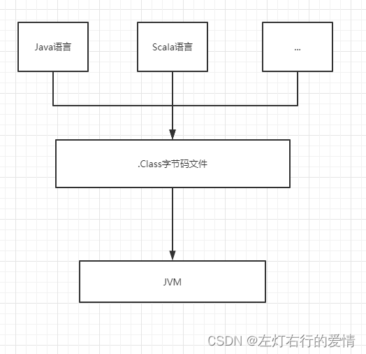  
 我们再来开里面的黑盒  
 JVM对字节码进行解释，翻译成特定底层平台匹配的机器指令并运行。（后面会解释为什么要翻译成字节码）  
 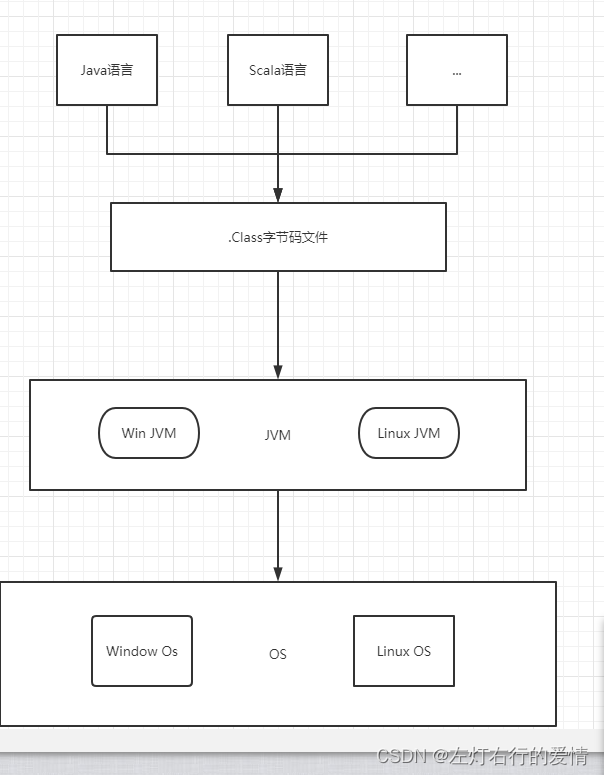  
 如果把中间JVM细节隐藏，那么就会成这样  
 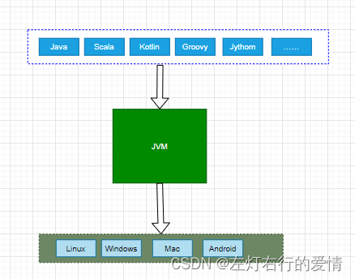  
 所以我们可以看到，JVM和Java语言没有必然的联系，它只与Class文件格式关联。也就是任何文件，只要能翻译成符合规范的字节码文件，都是能被JVM运行的。所以我们说JVM是跨语言平台。

#### 为什么Java要在虚拟机里运行

Java作为一门高级程序语言，它的语法非常复杂，抽象程序也很高，直接在硬件上运行这么复杂的程序并不现实，所以在运行Java程序之前，我们需要进行转换（在CPU层面上来看，计算机中所有的操作都是一个个指令的运行汇集而成，Java是高级语言，只有人类才能理解其逻辑，计算机无法识别）。  
 这个转换的操作，目前主流思想是这样：  
 设计一个面向Java语言特性的虚拟机  
 通过编译器将Java程序转换成虚拟机所能识别的指令序列（也称Java字节码，之所以这么取名，是因为Java字节码指令的操作码被固定为一个字节）

```
# 最左列是偏移；中间列是给虚拟机读的机器码；最右列是给人读的代码
0x00: b2 00 02 getstatic java.lang.System.out
0x03: 12 03 ldc "Hello, World!"
0x05: b6 00 04 invokevirtual java.io.PrintStream.println
0x08: b1 return


```

JVM是不可以直接运行Java代码的，所以Java代码必须要先编译成字节码文件，JVM才能正确识别代码转换后的指令并将其运行。  
 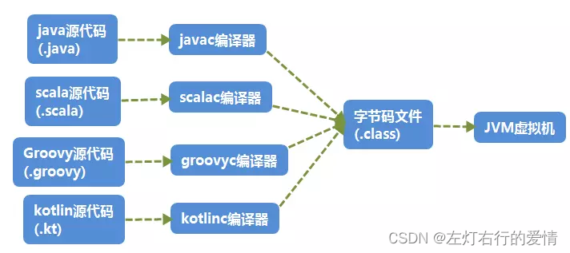  
 JVM可以由硬件实现，但更为常见的是在各个现有平台（Windows\_x64,Linux\_aarch64）上提供的软件实现。  
 意义在于：一旦一个程序被转换成Java字节码，那么它便可以在不同平台上的虚拟机实现里运行。这也就是我们常说的：一次编写，到处运行。

#### 托管环境

JVM带来的另一个好处就是带来了一个托管环境。  
 这个托管环境可以代替我们处理一些代码中冗长而且容易出错的部分。比如大家最熟悉的当属自动内存管理和垃圾回收，这部分内容也催生出了一波垃圾回收调优的业务。  
 除此之外，托管环境还提供了诸如数据越界，动态类型，安全权限等动态检测，让我们免于写无关业务逻辑的代码。

#### 字节码文件

Class文件本质上是一个以8位字节为基础单位的二进制流，各个数据项目严格按照顺序紧凑排列在Class文件中。  
 JVM根据特定的规则解析该二进制数据，从而得到相关信息。

#### Class文件的结构属性

简单过目一下，有个印象，后面我们会详细聊聊：  
 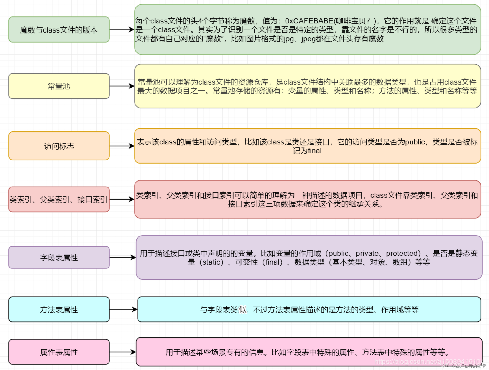

#### Java虚拟机具体是怎么运行Java字节码

我们以JDK中的HotSpot虚拟机为例，从虚拟机以及底层硬件两个角度，来聊一聊Java虚拟机具体怎么运行Java字节码。  
 虚拟机角度：  
 执行Java代码首先需要将它编译而成的class文件加载到Java虚拟机中。  
 加载后的Java类会被存放到方法区（Method Area）中，实际运行时，虚拟机会执行方法区内的代码。  
 Java虚拟机在内存中划分出堆和栈来存储运行时数据。  
 而且，Java虚拟机会将栈细分为面向Java方法的Java方法栈，面向本地方法（用C++写的native方法）的本地方法栈，以及存放各个线程执行位置的PC寄存器。  
 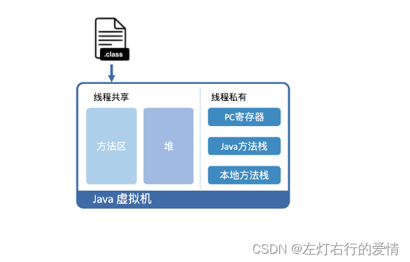  
 在运行过程中，每当调用进入一个Java方法，Java虚拟机会在当前线程的Java方法栈中生成一个栈帧，用以存放局部变量以及字节码的操作数。这个栈帧大小是提前计算好的，而且JVM不要求栈帧在内存空间内连续分布。  
 在退出执行方法时，不管是正常返回还是异常返回，JVM均会弹出当前线程的当前栈帧，并舍弃。

从硬件角度：Java字节码无法直接执行。因此，JVM需要将字节码翻译成机器码。  
 在HotSpot里，翻译过程有两种形式：  
 1.解释执行：逐条将字节码翻译成机器码并执行  
 2.即时编译（Just-In-Time compilation，JIT）：将一个方法中包含的所有字节码编译成机器码后再执行。  
 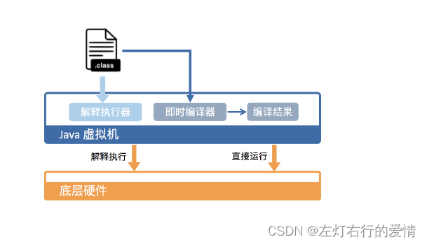  
 解释执行的优势：无需等待编译  
 即时编译优势：实际运行速度更快  
 HotSpot默认采用混合模式：综合解释执行和即时编译两者的优点。它会先解释执行字节码，而后将其中反复执行的热点代码，以方法为单位进行即时编译。

#### Java虚拟机的运行效率究竟如何

HotSpot采用了多种技术来提升启动性能以及峰值性能，刚刚提到的即时编译是其中重要的技术之一。  
 即时编译建立在程序符合二八定律的假设上，百分之二十的代码占据了百分之八十的计算资源。  
 对于占据大部分的不常用的代码，我们无需耗费时间将其翻译成机器码，而是采取解释执行的方式运行；  
 另一方面，对于仅占据小部分的热点代码，我们则可以将其编译成机器码，以达到理想的运行速度。  
 理论上讲，即时编译后的Java程序的执行效率，是可能超过C++程序的。因为与静态编译相比，即时编译拥有程序的运行时信息，并且能够根据这个信息做出相应的优化。  
 举个栗子：  
 虚方法用来实现面向对象语言的多态性，对于一个虚方法的调用，尽管它有很多个目标方法，但是实际运行过程中它可能只调用其中一个。  
 这个信息便可以被即使编译器所利用，来规避虚方法调用的开销，从而达到比静态编译的C++程序更高的性能。

#### JDK&JRE&JVM有什么区别

JVM：Java Virtual Machine，Java虚拟机，Java程序运行在Java虚拟机上。  
 针对不同系统的实现（Windows，Linux，MacOs）不同的JVM，因此Java可以实现跨平台。  
 JRE：Java运行时环境。  
 它是运行已编译Java程序所需的所有内容的集合，包括Java虚拟机（JVM），Java类库，Java命令和其他的一些基础构件。但是不能用于创建新程序。  
 JDK：Java Development Kit，它是功能齐全的Java SDK，它拥有JRE所拥有的一切，还有编译器（JavaC）和工具（JavaDoc和JDB）。它能够创建和编译程序。  
 简单来说：JDK包括JRE，JRE包含JVM。

## 内存管理

JVM内存区域最粗略的划分可以分为堆和栈，当前，按虚拟机规范，可以划分以下几个区域：  
 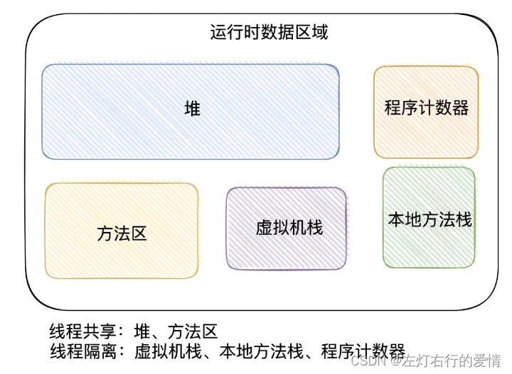  
 接下来我们分别聊一聊这些区域的具体内容与意义。

### 程序计数器

Program Counter Register 程序计数器（寄存器）  
 **线程私有**

#### 为什么要使用PC寄存器记录当前线程的执行地址呢

Java是多线程的语言，线程数大于CPU数是很常见的现象，那么就会出现线程切换，切换意味着中断和恢复，那么我们自然就需要有一块区域来保存[当前线程的执行信息],当线程切换回来时，我们需要知道接着从哪开始继续执行。所以程序计数器就是用于记录各个线程执行的字节码地址（分支，循环，跳转，异常，线程恢复都依赖计数器）。

#### 为什么要设置为线程私有

多线程在一个特定时间段内只会执行其中某一个线程方法，CPU会不停的做任务切换，这样必然会导致经常中断或恢复。为了能准确的记录各个线程正在执行的当前字节码指令地址，所以为每个线程都分配了一个PC寄存器，每个线程都独立计算，不会相互影响。  
 我们可以看作当前线程所执行的字节码的行号指示器。  
 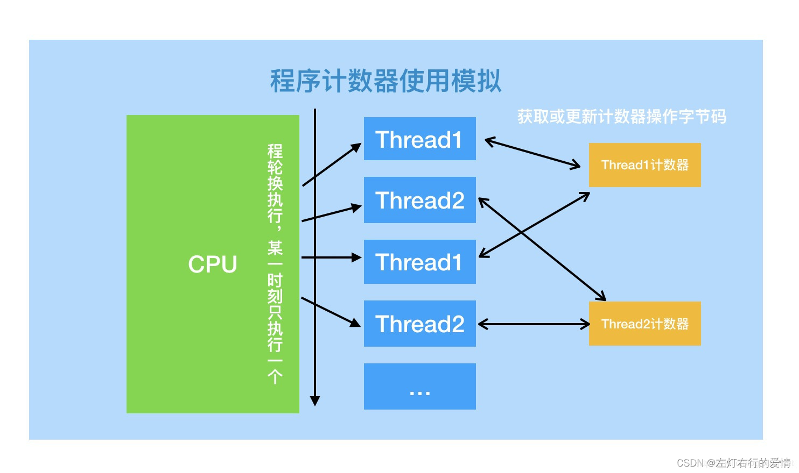

#### 总结

1.它是一块很小的内存空间，几乎忽略不计，但也是运行速度最快的存储区域。  
 2.在JVM规范中，每个线程都有它自己的程序计数器，是线程私有的，生命周期与线程的生命周期一致。  
 3.任何时间一个线程都只有一个方法在执行，也就是所谓的当前方法。  
 如果正在执行的当前方法是Java方法，程序计数器记录的JVM字节码指令地址  
 如果执行的是Native方法，则是未指定值（undefined）。  
 4.它是程序控制流的指示器，分支，循环，跳转，异常处理，线程恢复等基础功能都需要依赖这个计数器完成。  
 5.字节码解释器工作时就是通过改变这个计数器的值来选取下一条需要执行的字节码指令。

### Java虚拟机栈

**线程私有**  
 每个线程运行时所需要的内存，成为虚拟机栈，即每个线程在创建的时候都会创建一个【虚拟机栈】，其内部保存一个个栈帧（Stack Frame），对应着一次次Java方法调用。  
 作用：主管Java程序的运行。  
 每个【栈帧】会包含几块内容：局部变量表，操作数栈，动态链接，返回地址。  
 下图可以帮助理解：  
 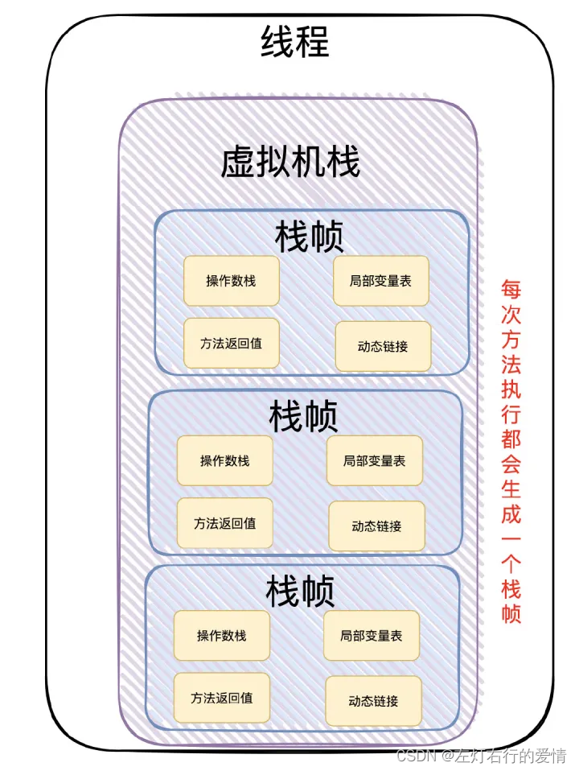

#### 栈的特点

* 栈是一种快速有效的分配存储方式，访问速度仅次于程序计数器
* JVM直接对虚拟机的操作只有两个：每个方法执行，伴随着入栈（进栈/压栈）,方法执行结束出栈。
* 栈不存在垃圾回收问题

#### 栈中存在的内部结构

栈中存储了什么？

* 每个线程都有自己的栈，栈中的数据都是以栈帧（Stack Frame）的格式存在
* 在这个线程上正在执行的每个方法都各自有对应的一个栈帧
* 栈帧是一个内存区块，是一个数据集，维系着方法执行过程中的各种数据信息  
   栈帧的内部结构都有什么？
* 局部变量表
* 操作数栈
* 动态链接
* 方法返回地址
* 一些附加信息  
   附下图：  
   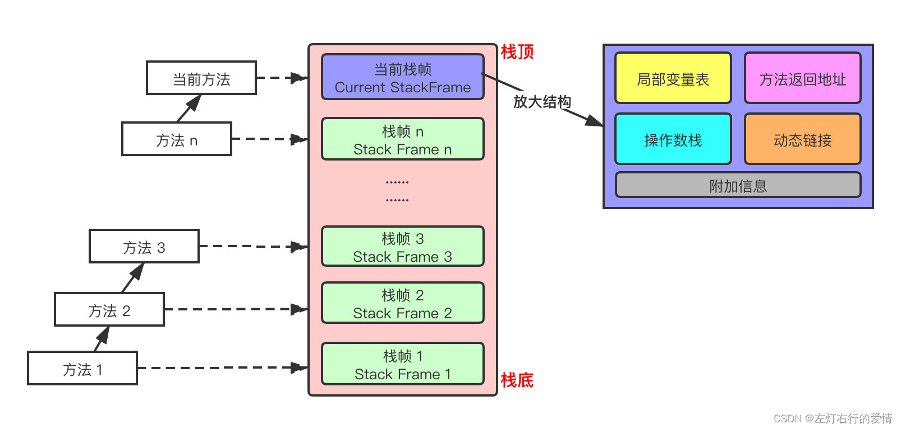

### 局部变量表

局部变量表也被称之为局部变量数据或者本地变量表。  
 1.它是一组变量值存储空间，主要作用是**存储方法参数**和**定义在方法体内的局部变量**，包括：

* 编译器可知的各种Java虚拟机基本数据类型（boolean，byte，char，short，int，float，long，double）
* 对象引用（reference类型，它不等同对象本身，可能只是一个指向对象起始地址的引用指针，也可能是指向一个代表对象的句柄或其他与此相关的位置）
* returnAddress类型（指向一条字节码指令的地址，已被异常表取代）。需要注意的是，局部变量表中的变量只在当前方法调用中有效（在方法执行时，虚拟机通过使用局部变量表完成参数值到参数变量列表的传递过程），当方法调用结束，随着方法栈帧被销毁，局部变量表也会随之销毁。

2.局部变量表所需的容量大小是编译器确定下来的，在方法运行期间不会改变局部变量表的大小。

3.因为局部变量表是建立在线程的栈上，是线程私有数据，不存在安全问题

4.方法嵌套调用的次数由栈的大小决定。一般来说，栈越大，方法嵌套调用次数越多。对一个函数而言，它的参数和局部变量越多，使得局部变量表膨胀，它的栈帧就越大，以满足方法调用所需传递的信息增大的需求。进而函数调用就会占用更多栈空间，导致其嵌套调用次数就会减少。

5.参数值的存放总是在局部变量数据的index0开始，到数组长度-1的索引结束。

#### 槽Slot

局部变量表最基本的存储单元是Slot（变量槽），32以内的类型只占一个Slot（包括ReturnAddress类型），64位的类型（long和double）占用两个连续的Slot，注意：  
 byte，short，char在存储前被转换为int，boolean也被转换成int，0表示false，非0表示true  
 long和double则占据两个Slot。  
 JVM会为局部变量表中的每一个Slot都分配一个**访问索引**，通过这个索引可成功访问局部变量表中指定的局部变量值，索引值的范围是从0到局部变量表最大的Slot数量。  
 那么，当一个实例方法被调用时，它的方法参数和方法体内部定义的局部变量将会按照顺序被复制到局部变量表中的每一个Slot上。  
 注意，如果你想访问局部变量表中一共64bit的局部变量值时，只需要使用前一个索引即可（比如：访问龙或double类型的变量，不可以采用任何方式单独访问其中的某一个Slot）  
 由于栈帧的局部变量表中槽位是可以重复使用，所以一个局部变量如果过了其作用域，那么在其作用域之后申明新的局部变量就可能是复用过期局部变量的槽位，达到节省资源的目的。  
 注意：局部变量表中的变量也是重要的垃圾回收根节点，只要被局部变量表中直接或间接引用的对象都不会被回收。

### 操作数栈

后进后出的操作数栈，可以称之为表达式栈。  
 在方法执行过程中，根据字节码指令，向操作数栈中写入数据或提取数据，即入栈，出栈。  
 某些字节码指令将值压入操作数栈，其余的字节码指令将操作数取出栈。使用它们后再把结果压入栈。  
 比如：执行复制，交换，求和等操作。

操作数栈，主要用于保存计算过程的中间结果，同时作为计算过程中变量临时的存储空间。  
 操作数栈就是JVM执行引擎的一个工作区，当一个方法刚开始执行的时候，一个新的栈帧也会随之被创建出来，此时这个方法的操作数栈是空的。  
 操作数栈并非采用访问索引的方式来进行数据访问，而是只能通过标准的入栈和出栈操作来完成一次数据访问。  
 如果被调用的方法带有返回值的话，其返回值将会压入栈帧的操作数栈中，并更新PC寄存器中下一条需要执行的字节码指令。

### 动态链接（指向运行时常量池的方法引用）

我们要补充学习几个名词，然后再去看动态链接，这块属于比较难的一点，耐心看一定收获不少，自认为总结提炼的比较全面，一定可以帮助到你。

#### 符号引用&&直接引用

**符号引用**  
 1.概念：  
 符号引用：引用一组符号来描述所引用的目标（符号可以是任何形式的字面量），使用时能够无歧义的定位到目标。  
 2.为什么符号引用会出现  
 在Java中，一个Java类将会编译成一个Class文件在编译的时候，Java类并不知道所引用的类的实际地址，所以迫不得已只能使用符号引用来代替。  
 举个栗子：  
 com.wang.People类引用com.wang.Dog类，在**编译时**（注意是在编译是）People类并不知道Dog类的实际内存地址，所以只能使用符号com.wang.Dog来表示Dog类的地址，我们可以看出，这个符号包含了足够的信息，以供实际使用时可以找到相应的位置。

**直接引用**  
 有多种实现形式：  
 1.直接指向目标的指针（比如，指向“类型”【Class对象】,类变量，类方法的直接引用可能是指向方法区的指针）  
 2.相对偏移量（比如，指向实例变量，实例方法的直接引用都是偏移量）  
 3.一个能间接定位到目标的句柄  
 需要注意的是：同一个符号引用在不同的虚拟机实例上翻译出来的直接引用一般不会相同。如果有了直接引用，那么引用的目标必定已经加载入内存中了。

**直接引用与符号引用的关系**  
 第一次运行时，根据符号内容，找到定位的目标，运行一次后，符号引用就会被替换成直接引用，下次不需要搜索了。

我们实操看一看，来个糖炒栗子：  
 代码如下：

```
public class Two {
    public void a(){
        b();//调用b方法
    }
    public void b(){
        c();//调用c方法
    }
    public void c(){
        System.out.println("haha");
    }
}


```

我们编译一下Class文件，它的文本表现形式如下：

```
public class demo1.Two

Constant pool:
   #1 = Methodref          #8.#18         // java/lang/Object."<init>":()V
   #2 = Methodref          #7.#19         // demo1/Two.b:()V
   #3 = Methodref          #7.#20         // demo1/Two.c:()V
   #4 = Fieldref           #21.#22        // java/lang/System.out:Ljava/io/PrintStream;
   #5 = String             #23            // haha
   #6 = Methodref          #24.#25        // java/io/PrintStream.println:(Ljava/lang/String;)V
   #7 = Class              #26            // demo1/Two
   #8 = Class              #27            // java/lang/Object
   #9 = Utf8               <init>
  #10 = Utf8               ()V
  #11 = Utf8               Code
  #12 = Utf8               LineNumberTable
  #13 = Utf8               a
  #14 = Utf8               b
  #15 = Utf8               c
  #16 = Utf8               SourceFile
  #17 = Utf8               Two.java
  #18 = NameAndType        #9:#10         // "<init>":()V
  #19 = NameAndType        #14:#10        // b:()V
  #20 = NameAndType        #15:#10        // c:()V
  #21 = Class              #28            // java/lang/System
  #22 = NameAndType        #29:#30        // out:Ljava/io/PrintStream;
  #23 = Utf8               haha
  #24 = Class              #31            // java/io/PrintStream
  #25 = NameAndType        #32:#33        // println:(Ljava/lang/String;)V
  #26 = Utf8               demo1/Two
  #27 = Utf8               java/lang/Object
  #28 = Utf8               java/lang/System
  #29 = Utf8               out
  #30 = Utf8               Ljava/io/PrintStream;
  #31 = Utf8               java/io/PrintStream
  #32 = Utf8               println
  #33 = Utf8               (Ljava/lang/String;)V
{
  public demo1.Two();
    descriptor: ()V
    flags: (0x0001) ACC_PUBLIC
    Code:
      stack=1, locals=1, args_size=1
         0: aload_0
         1: invokespecial #1                  // Method java/lang/Object."<init>":()V
         4: return
      LineNumberTable:
        line 3: 0

  public void a();
    descriptor: ()V
    flags: (0x0001) ACC_PUBLIC
    Code:
      stack=1, locals=1, args_size=1
         0: aload_0
         1: invokevirtual #2                  // Method b:()V
         4: return
      LineNumberTable:
        line 5: 0
        line 6: 4

  public void b();
    descriptor: ()V
    flags: (0x0001) ACC_PUBLIC
    Code:
      stack=1, locals=1, args_size=1
         0: aload_0
         1: invokevirtual #3                  // Method c:()V
         4: return
      LineNumberTable:
        line 8: 0
        line 9: 4

  public void c();
    descriptor: ()V
    flags: (0x0001) ACC_PUBLIC
    Code:
      stack=2, locals=1, args_size=1
         0: getstatic     #4                  // Field java/lang/System.out:Ljava/io/PrintStream;
         3: ldc           #5                  // String haha
         5: invokevirtual #6                  // Method java/io/PrintStream.println:(Ljava/lang/String;)V
         8: return
      LineNumberTable:
        line 11: 0
        line 12: 8
}


```

首先不要慌，我们一点点看，先不要去关注常量池里的东西，我们先关注下图画红线的代码：  
 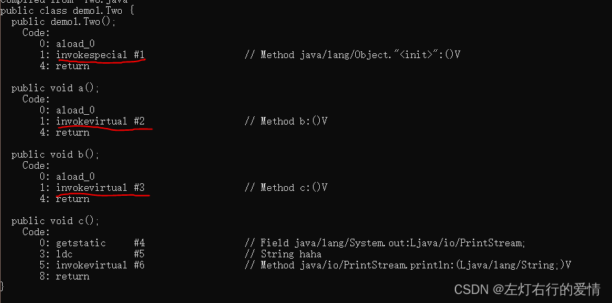  
 我们来看一下a()方法里的一条字节码指令：

```
1: invokevirtual #2                  // Method b:()V


```

在这里Class文件中的实际编码（注意是十六进制表示，Class文件里使用高位在前字节序）为：

```
[B6][00 02]


```

里面的0xB6是invokevirtual指令的操作码，后面0x00002是该指令的操作数，用于指定要调用的目标方法。  
 那么我们去看一下这个参数在Class文件常量池里是什么意思：

```
 #2 = Methodref          #7.#19         // demo1/Two.b:()V


```

我们再次分析Class文件中的实际编码为：

```
[0A] [00 03] [00 13]


```

这里的0x0A是CONSTANT\_Methodref\_info的tag（0A=7，所以这里为CONSTANT\_Methodref\_info，若tag为其他数值，这里就为CONSTANT\_待定\_info，后面我们会详细解析Class文件格式，这里知道大概意思就行），后面0x0003和0x0013是该常量池的两个部分：claas\_index和name\_and\_type\_index。这两个部分都是常量池下标，引用着另外两个常量池项。  
 那么顺着这个线索我们把能传递引用到的常量池都找出来，会发现（深度优先顺序排列）：

```
#2 = Methodref          #7.#19         // demo1/Two.b:()V
#7 = Class              #26            // demo1/Two
#26 = Utf8               demo1/Two
#19 = NameAndType        #14:#10        // b:()V
#14 = Utf8               b
#10 = Utf8               ()V


```

那么把引用关系做成一颗树：

```
                #2 = Methodref  demo1/Two.b:()V
                /                        \
     #7 = Class demo1/Two          #14 = Utf8  b
         /                                \
#26 = Utf8   demo1/Two              #10 = Utf8  ()V
     


```

这样是不是清晰了很多，根据上面的信息我们可以看到，Class文件中的invokevirtual指令的操作数经过几层间接之后，最后都是由字符串来表示的。  
 **这就是Class文件里的“符号引用”的实态：带有类型（tag）/结构（符号间引用层次）的字符串**

---

我们现在来看一看概念，相信你很容易理解了。

#### 动态链接概念

1.每一个栈帧内部都包含一个指向**运行时常量池**中该栈帧所属方法的引用。包含这个引用的目的就是为了支持当前方法的代码能够实现动态链接（Dynamic Linking）。  
 2.在Java源文件被编译到字节码文件中时，**所有的变量和方法引用都作为符号引用**保存在Class文件的常量池中。比如：描述一个方法调用了另外的方法时，通过常量池中指向方法的符号引用来表示的，**所以动态链接的作用就是为了讲这些符号引用转换为调用方法的直接引用**  
 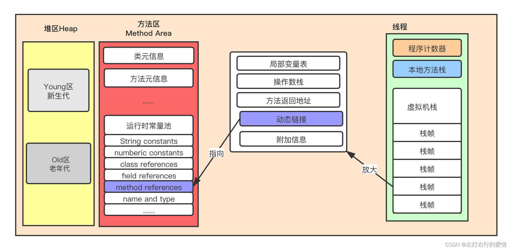  
 当然，这里也会牵扯到JVM是如何执行方法的调用，这些细节我们放在后面详细去聊，因为牵扯到类加载等内容，后面我们学过之后再聊。

#### 方法返回地址

概念：用来存放该方法的PC寄存器的值  
 对于方法的结束，有两种方式：  
 1.正常执行完成  
 2.出现未处理的异常，未正常退出  
 当一个方法开始执行时，只有两种方式可以退出这个方法：  
 1.执行引擎遇到任意一个方法返回的字节码指令，将返回值传递给上层的法法调用者–正常完成出口  
 2.方法执行的过程中遇到了异常，并且这个异常没有在方法内进行处理（换句话说，本方法的异常表中没有搜索到匹配的异常处理器）就会导致方法退出----异常完成出口。

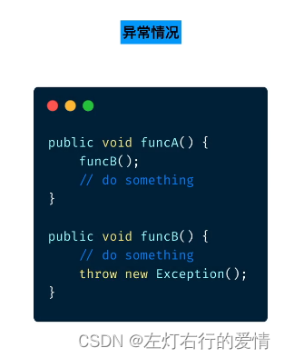  
 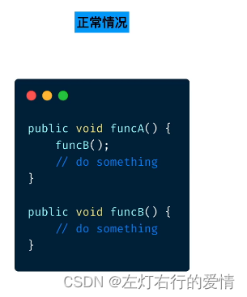  
 

那么任何方式的退出，都会返回到该方法被调用的位置，需要注意的是，两种退出方式会带来返回地址的不同：  
 正常退出—调用者PC寄存器的值作为返回地址，即调用该方法的下一条指令的地址。  
 异常退出—返回地址由异常表来确定，**栈帧一般不会保存这部分信息**。

本质上来说，方法的退出就是当前栈帧出栈的过程。  
 所以，出栈后面临着恢复数据（上层方法的局部变量表，操作数栈，将返回值压入调用者栈帧的操作数栈，设置PC寄存器等），让调用者方法继续执行下去。

需要注意的是：正常完成出口和异常完成出口的区别在于-----异常完成出口不会给他的上层调用者产生任何返回值。

#### 附加信息

栈帧中还允许携带与 Java 虚拟机实现相关的一些附加信息。  
 例如，对程序调试提供支持的信息，但这些信息取决于具体的虚拟机实现。  
 目前不需要多了解。

### 本地方法栈

我们先了解一下本地方法。

#### 本地方法接口

简单来讲，一个Native Method就是一个Java调用非Java代码的接口，比如我们了解的Unsafe类就有很多本地方法（这个在我前面写的并发专辑里有，感兴趣可以去看看）。  
 **那么。为什么我们要使用本地方法呢？**  
 虽然我们用Java非常方便，但是有些层次的任务用Java实现也不容器，或者我们对程序的效率很在意，这时问题就来了。  
 那么用本地方法可以干嘛呢？

* 与Java环境外交互：有时Java应用需要与Java外面的环境交互，这也是本地方法存在的原因。
* 与操作系统交互：JVM支持Java语言本身和运行时库，但是有时仍需要依赖一些底层系统的支持。通过本地方法，我们可以实现用Java与实现了JRE底层系统交互，JVM的一部分就是C语言写的。
* Sun’s Java：Sun的解释器就是C实现的，这使得它能像一些普通的C一样与外部交互。JRE大部分都是用JAVA实现的，它也通过一些本地方法与外部交互（比如：类 java.lang.Thread 的 setPriority() 的方法是用Java 实现的，但它实现调用的是该类的本地方法 setPrioruty()，该方法是C实现的，并被植入 JVM 内部）。

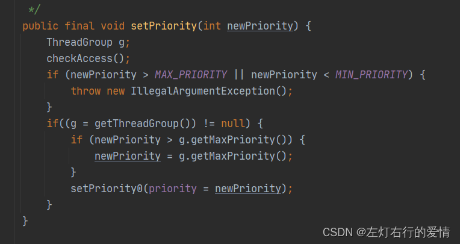  
 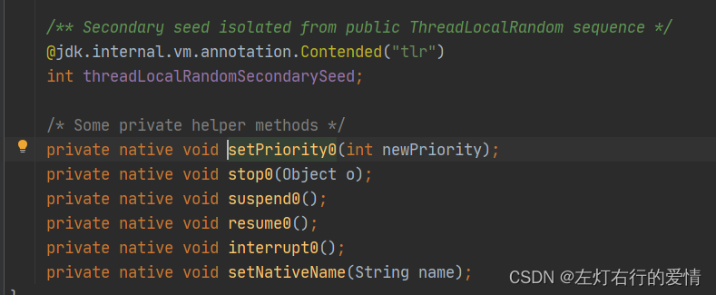

#### 本地方法栈

我们了解到了Java虚拟机栈用于管理Java方法的调用，而本地方法栈则用于管理本地方法（用C语言实现的方法）的调用。  
 注意：**本地方法栈是线程私有的**

##### 内存大小方面

允许被实现成固定或者可动态扩展的内存大小。  
 这里牵扯到报错问题：  
 如果线程请求分配的栈容量超过本地方法栈允许的最大容量，Java虚拟机会抛出一个stackoverflowError异常。  
 如果本地方法栈可以动态扩展，并且在尝试扩展的时候无法申请到足够的内存，或者创建新的线程时没有足够的内存去创建对应的本地方法栈，那么Java虚拟机会抛出一个outofMemoryError异常。

##### 运行原理

我们先看一个图片  
 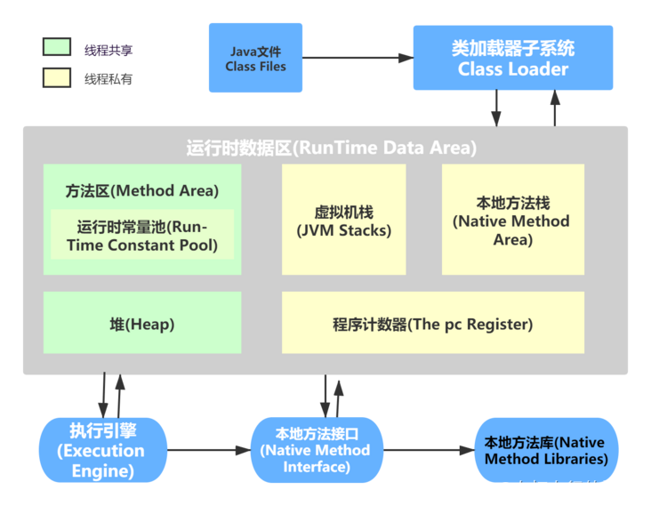  
 它的具体做法是：  
 本地方法栈中登记native方法，在执行引擎执行时加载本地方法库  
 在某个线程调用一个本地方法时，它就进入了一个全新不受虚拟机限制的地方，它和虚拟机有同样的权限。  
 所以，本地方法可以通过本地方法接口来访问虚拟机内部的运行时数据区  
 甚至可以直接使用本地处理器中的寄存器，也可以直接从本地内存的堆中分配任意数量的内存。

需要注意的是，并不是所有JVM都支持本地方法。

### 堆内存

堆是所有线程共享的一块内存区域，在JVM启动时创建，此内存区域的唯一目的就是用来存储对象实例（数组也是一种对象）几乎所有的对象实例以及数据都在这里分配内存。  
 Java堆是垃圾收集器管理的内存区域，因此一些文档里也会称它为“GC堆”，由于现代垃圾收集器大部分都是基于分代收集理论设计，所以Java堆中经常会出现几个名词：  
 新生代，老年代，Eden空间，From Survivor空间，To Survivor空间等，下面我们来分别介绍一下。

为了高效的垃圾回收，虚拟机把堆内存逻辑上分为了三块区域（分代的唯一理由就是优化GC性能），贴个图看一下：  
 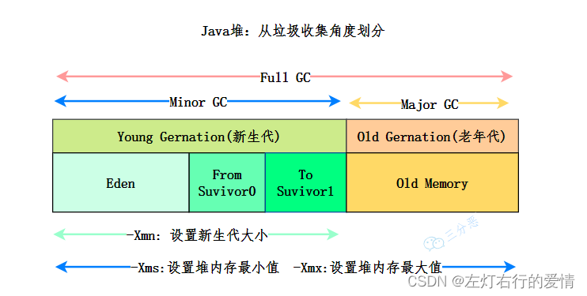  
 简单解释一下三大块内容：  
 新生带（年轻代）：新对象和没达到一定年龄的对象都在这里。  
 老年代（养老区）：被长时间使用的对象，老年代的内存空间应该比年轻代更大。  
 元空间（JDK1.8之前叫永久代）：一些方法中的操作临时对象等，1.8之前用JVM内存，1.8之后用物理内存。

这里我们关注一下Java堆里内存空间：  
 Java堆处于物理上不连续的内存空间中，只要逻辑上连续即可，像磁盘空间一样。  
 实现时既可以是固定大小，也可以是可扩展的（一般主流JVM都是可扩展，通过-Xmx，-Xms控制），如果堆中没有完成实例分配，并且堆无法再扩展时，会抛出OutOfMemoryError异常。

#### 年轻代

年轻代是所有新对象创建的地方。当填充年轻代时，会执行垃圾收集（Minor GC）。  
 年轻一代会被分为三个部分——伊甸园（Eden Memory）和两个幸存区（Survivor Memory，分别细称为From Survivor，To Survivor）默认的比例是8:1：1。  
 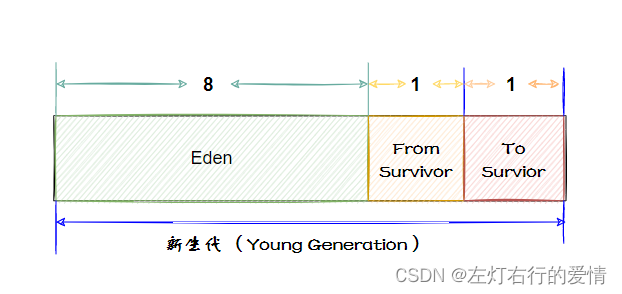  
 新生代的垃圾收集主要是采用了标记-复制算法（后面我们介绍到垃圾回收时会着重去说，这里了解就好）。

**因为新生代存活对象比较少**，每次复制少量的存活对象效率比较高。

那么基于这种算法，**JVM每次分配内存只用Eden和其中一块Survivor**。当发生垃圾收集时，将Eden和Survivor中仍然存活的对象一次性复制到另一块Survivor空间上，然后直接清理掉Eden和已用过的那块Survivor空间。

有几点需要我们注意：

* 大多数新创建的对象都位于Eden内存空间中
* 当Eden空间被对象填充时，执行Minor GC，并将所有幸存者对象移动到一个幸存者空间中
* Minor GC 检查幸存者对象，并将它们移动到另一个幸存者空间。所以每次执行后，总有一个幸存者空间是空的。
* 经过多次GC循环后存活下来的对象被移动到老年代。通常，这是通过设置年轻一代对象的**年龄阈值**来实现的，然后他们才有资格提升到老年代。

#### 老年代

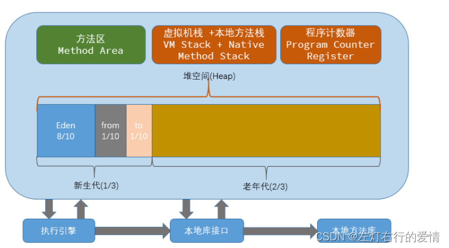

旧的一代内存包含那些经过许多轮小型GC后仍然存活的对象。  
 通常，垃圾收集是在老年代内存满时执行的，老年代垃圾收集成为**主GC**（Major GC），通常需要更长的时间。  
 大对象是直接进入老年代的（大对象指的是需要大量连续内存空间的对象），这样做的目的是**避免在Eden区和两个Survivor区之间发生大量的内存拷贝**。

#### 元空间

JDK8之前的永久代和JDK8之后的元空间，都看作是Java虚拟机规范中方法区的实现。  
 虽然JVM规范把方法区描述为堆的一个逻辑部分，但是它有一个别名交Non-Heap（非堆），目的是与Java堆区分开，这个元空间我们在后面的方法区再说，这里先了解一下。

#### 堆内容大小与内存泄漏

**堆内存大小如何设置？**  
 Java堆用于存储Java对象实例，堆的大小在JVM启动时就确定了，我们可以通过-Xmx和-Xms来设定：  
 1.-Xms用来表示堆的起始内存，等价于-XX:InitialHeapSize  
 2.-Xmx用来表示堆的最大内存，等价于-XX:MaxHeapSize  
 如果堆的内存大小超过-Xmx设定的最大内存，就会抛出OutOfMemoryError异常。  
 注意：我们一般会将-Xms和-Xmx两个参数配置为相同的值，其目的是为了能够在垃圾回收机制清理完堆后不再需要重新分隔计算堆的大小，从而提高性能  
 默认情况下，初始堆内存大小为：电脑内存大小/64  
 默认情况下，最大堆内存大小为：电脑内存大小/4

#### Java创键的对象到底放在哪里。

创建对象时，对象是在堆内存中创建的，但堆内存又分为新生代和老年代，新生代又分为Eden空间，From Survivor，To Survivor空间，那么我们创建的对象到底在哪里呢？

##### 对象优先在Eden分配

堆内存分为新生代和老年代。  
 新生代是用于存放使用后准备被回收的对象，老年代是用于存放生命周期比较长的对象。  
 大部分我们创建的对象，都属于生命周期比较短，所以会存放新生代。而新生代又细分Eden空间，From Survivor，To Survivor空间。  
 我们创建的对象会优先在Eden分配：  
 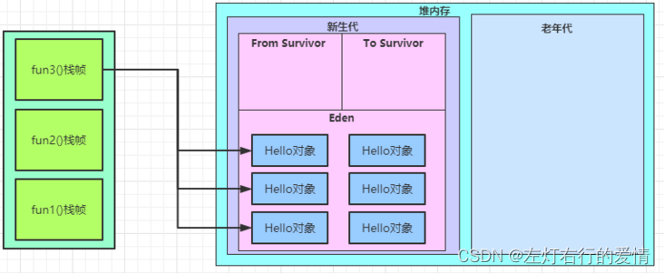  
 随着对象的创建，Eden剩余的空间越来越少，就会触发Minor GC，这时Eden的存活对象就会被放入From Survivor空间：  
 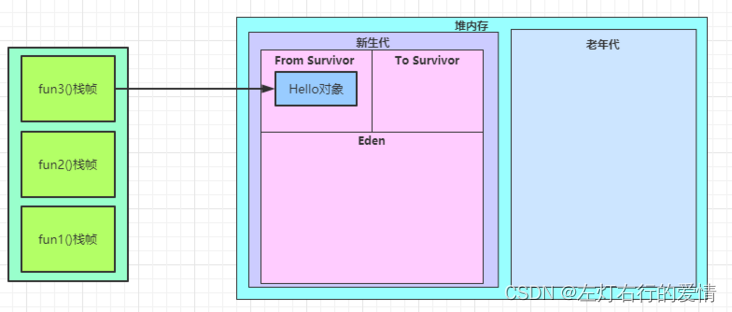  
 Minor GC后，新对象依然会往Eden分配：  
 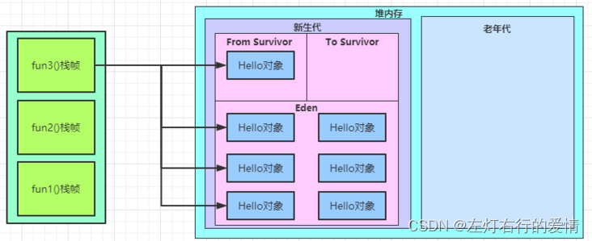  
 Eden剩余内存空间越来越少后，又会触发Minor GC，于是Eden和From Survivor的存活对象会放入To Survivor空间。  
 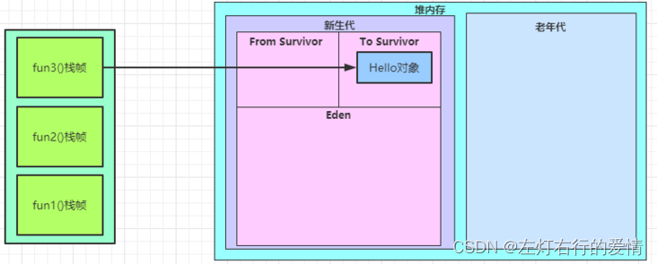

##### 大对象会直接进入老年代

我们之前聊过，如果一个对象（占用连续内存很大），会直接进入老年代，我们可以用XX:PretenureSizeThreshold来设置这些大对象的阈值。  
 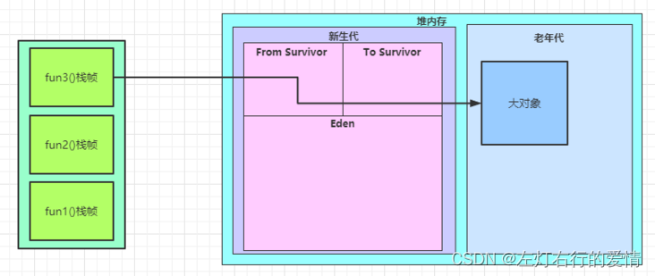

##### 长期存活的对象将进入老年代

如果一个对象为Hello，已经经历了15次Minor GC还存活在Survivor空间中。那么他会将转移到老年代，这个15是年龄阈值，可以根据-XX:MaxTenuringThreshold来设置，默认是15。  
 那么，JVM为了给对象计算他到底经历了几次Minor GC，会给每个对象定义了一个对象年龄计数器。如果对象在Eden中经过第一次Minor GC后仍然存活，移动到Survivor空间年龄+1，在Survivor区中每经历过Minor GC后仍然存活年龄+1,。年龄到年龄阈值，则进入老年代。  
 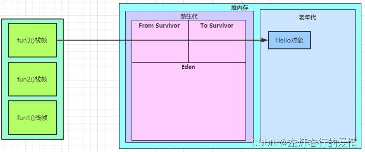

##### 动态年龄判断

除了上面所说的达到年龄阈值，还有一种方式可以进入老年代，那就是动态年龄判断：在Survivor空间中相同年龄所有对象大小的总和>Survivor空间的一半，年龄>=该年龄的对象可以直接进入老年代。  
 举个栗子：  
 Survivor是100M，Hello1和Hello2都是5岁，并且大小总和超过了50M，还有一个Hello3是7岁，那么这时候，它们都有光明的未来（都进入了老年代）：  
 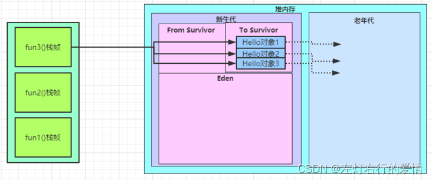

##### 空间分配担保

我们先提前了解一个名词：  
 -XX:HandlePromotionFailure开启后——老年代连续空间>新生代对象的总大小或者历次晋升到老年代的对象的平均大小就进行Minor GC,否则Full GC.

**核心思想:**  
 老年代（Old Generation）为新生代（Young Generation）提供一种“担保”，确保在 Minor GC 后，即使 Survivor 空间不足以容纳所有存活下来的对象，这些对象也有地方可去（即被提前移动到老年代），从而让 Minor GC 能够顺利完成。  
 **为什么需要空间担保？**

1. Minor GC 的流程：  
    Minor GC 主要回收 Eden 区和其中一个 Survivor 区（From 区）。存活的对象会被复制到另一个 Survivor 区（To 区）。
2. 潜在问题： 极端情况下，可能发生 Eden 区和 From 区的所有对象在 Minor GC 后都存活下来的情况（虽然概率很低）。或者，即使不是全部存活，存活对象的总体积也可能超过 To 区的容量。
3. 后果： 如果没有备用方案，当 To 区放不下所有存活对象时，Minor GC 就无法完成，系统可能会卡死或出错。

---

**空间担保的具体机制:**  
 一. 检查条件  
 Minor GC之前，虚拟机会先检查一下老年代最大可用的连续空间是否大于新生代所有对象总空间  
 二: 根据检查结果决策  
 如果大于：则可以发起Minor GC  
 如果小于：则看一下HandlePromotionFailure 是否有设置，如果没有设置就发起full GC，那如果设置了HandlePromotionFailure ，就看老年代最大可用的连续空间是否大于历次晋升到老年代对象的平均大小（  
 如果小于，则发起full GC  
 如果大于，则发起Minor GC  
 ）  
 MinorGC后，看Survivor空间是否足够存放活对象，  
 如果不够，就放入老年代，如果老年代都不够存放活对象，则担保失败，发起full GC  
 如果够，就直接存放Survivor空间。

我们来张图总结一下：  
 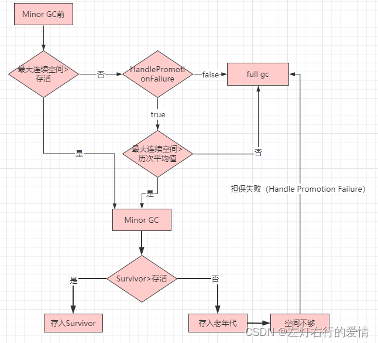  
 总结:

* 空间担保是老年代为新生代 Minor GC 提供的一种失败处理机制。
* 它通过事前检查老年代的可用空间，并结合事中处理（当 Survivor 空间不足时，将对象直接晋升到老年代），来确保 Minor GC 的顺利进行。
* 如果最终连老年代也无法容纳从新生代晋升过来的对象（即担保失败），通常就会触发一次 Full GC 来尝试回收更多空间。如果 Full GC 后空间仍然不足，最终可能导致 OutOfMemoryError。

##### 对象在堆中的生命周期

为什么我要把这小节内容放到分配后面，就是怕刚学习时对象到底该去哪里比较迷，  
 我们了解了对象的分配，现在来了解生命周期就非常简单了。  
 1.在JVM内存模型的堆中，堆被分为新生代和老年代  
 新生代又被进一步划分为Eden区和Survivor区，Survivor区由From Survivor和To Survivor组成。  
 2.当创建一个对象时，对象会被优先分配到新生代的Eden区  
 这时JVM会给对象定义一个对象年龄计数器（-XX:MaxTenuringThreshold）  
 3.当Eden空间不足时，JVM将执行新生代的垃圾回收（Minor GC）  
 JVM会把存活的对象转移到Survivor中，并且对象年龄+1；  
 对象在Survivor中同样也会经历Minor GC，每经历Minor GC，对象年龄都会+1  
 4.如果分配的对象超过了对象年龄计数器，对象会被直接分配到老年代

##### 堆并不是分配对象存储的唯一选择

这块先鸽，因为讲清楚比较麻烦，而且也不太适合直接放在这一块，后面我更完JVM会补上这系列（牵扯到JIT）。

### 方法区

是各个线程共享的内存区域，用于存储已被JVM加载的类型信息，常量，静态变量，JIT编译后的代码缓存等数据。  
 虽然JVM规范把方法区描述为堆的一个逻辑部分，但是它有别名为Non-Heap（非堆），目的是与Java堆区分开。  
 方法区的大小和堆空间是一样的，可以选择固定大小或者可扩展，方法区的大小决定了系统可以放多少个类，如果系统类太多，导致方法区溢出，JVM会报抛出内存溢出错误。  
 JVM启动时创建方法区，并且它的实际物理内存空间和Java堆区一样都可以不连续  
 JVM关闭后方法区即被释放。  
 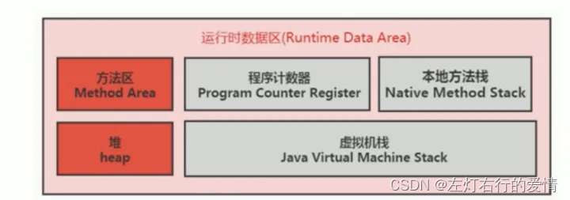

#### 方法区，永久代，元数据哪个才是张麻子

  
 有的内存结构图有方法区，有的是永久代，元数据，到底什么情况？  
   
 事实上，方法区（Method Area）只是JVM规范中定义的一个概念，用于存储类信息，常量池，静态变量，JIT编译后的代码等数据，并没有规定如何去实现它。  
 这导致了不同的厂商有不同的实现，而永久代（PermGen）是Hotspot虚拟机特有的概念，Java8的时候又被元空间取代，所以说，永久代和元空间都可以理解为方法区的落地实现。

那么为什么要用元空间把替代永久代呢？  
 因为永久代物理是堆的一部分，和新生代，老年代是连续（受垃圾回收器管理），而元空间存在于本地内存（我们常说的堆外内存，不受垃圾回收器管理），这样就不受JVM限制了（元空间的大小仅受本地内存限制），为永久代设置空间大小是很难确定的，也比较难发生OOM（注意，只是比较难发生，不代表没有）。  
 其次呢就是永久代调优比较困难。  
 JDK8以前，习惯上把方法区成为永久代，但是JDK8开始，使用元空间取代了永久代。

难道说永久代等同于方法区？  
 并不是这样的，有几点变化需要我们知道：  
 1.取消永久代，类型信息，字段，方法，常量保存在本地内存的元空间，但是字符串常量池，静态变量仍在堆中——相当于永久代的数据被分到了堆和元空间中。  
 2.永久代的参数（PermSize MaxPermSize） -> 元空间参数（MetaspaceSize MaxMetaspaceSize）

#### 方法区的内部结构

大致区域浏览图：  
 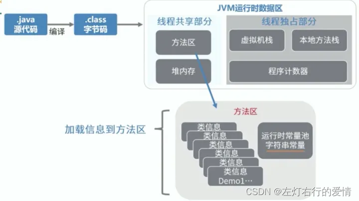  
 《深入理解 Java 虚拟机》书中对方法区（ Method Area) 存储内容描述如下：它用于存储已被虚拟机加载的类信息、常量、静态变量、即时编译器编译后的代码缓存等。  
 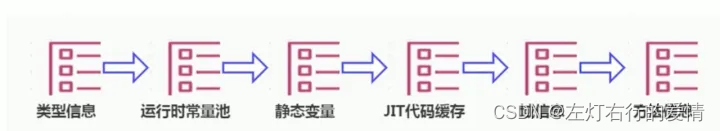  
 我们一个个看这些内容：

##### 类型信息

对每个加载的类型（类Class，接口Interface，枚举Enum，注解Annotation），JVM必需在方法区存储以下类型信息：  
 1.这个类型的完整有效名称（全名=包名.类名）  
 2.这个类型直接父类的完整有效名（对于Interface或者是Java.lang.Object，都没有父类）  
 3.这个类型的修饰符（public，abstract，final的某个子集）  
 4.这个类型直接接口的一个有序列表

##### 常量池

运行时常量池（Runtime Constant Pool）是方法区的一部分，理解运行时常量池的话，我们先来说说字节码文件（Class文件）中的常量池（常量表）。

##### 常量池

一个有效的字节码文件除了包含类的版本信息，字段，方法以及接口等描述信息外，还包含一项信息就是常量池表，包含各种字面量和对类型，域和方法的符号引用。

为什么需要常量池呢？

我们知道一个Java源文件中的类，接口，编译后产生一个字节码文件。  
 而Java中的字节码需要数据支持，通常这种数据会很大以至于不能直接存到字节码里面，需要换一种方式，可以存到常量池，这个字节码包含了指向常量池的引用。  
 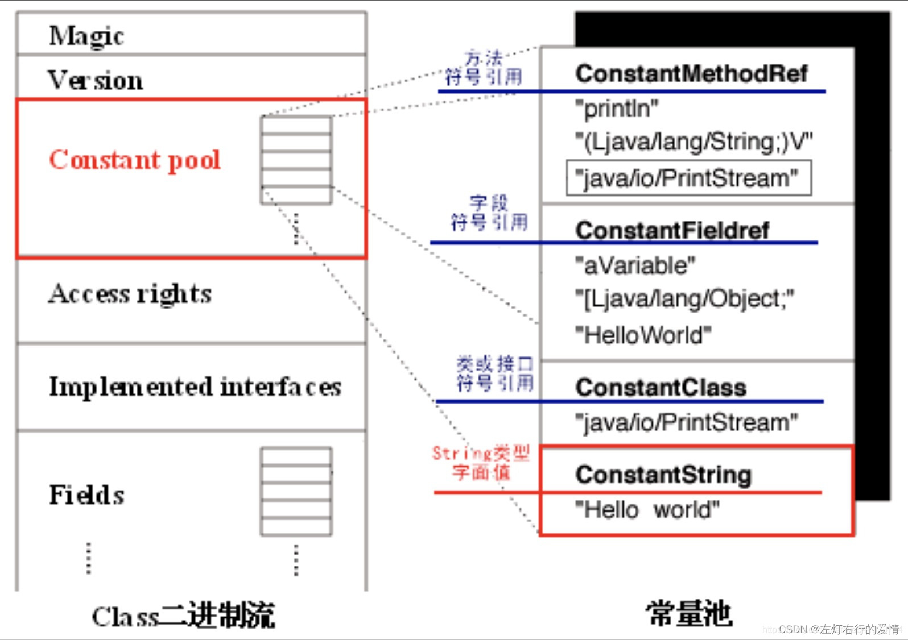  
 常量池中存放的符号信息，在JVM执行指令时需要依赖使用。常量池中的所有项都具有如下的通用格式（详细信息后面细聊，这里做个铺垫）：

```
cp_info {
    u1 tag;     //表示cp_info的单字节标记位
    u1 info[];  //两个或更多的字节表示这个常量的信息，信息格式由tag的值确定
}


```

在动态链接的时候用到的就是运行时常量池。  
 通过Jclasslib查看，字节码中的#2，#3指向的就是常量池。  
 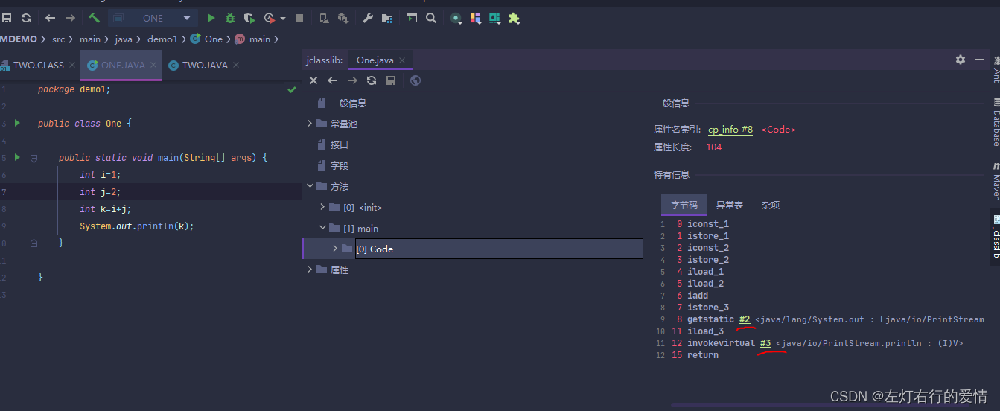  
 综上而言，常量池可以看作是一张表，虚拟机指令根据这张常量表找到要执行的类名，方法名，参数类型，字面量等类型。

##### 运行时常量池

1.什么是运行时常量池：  
 就是将**编译后**的类信息放入**方法区**中，也就是说它是方法区的一部分。  
 2.创建运行时常量池的时机：  
 在加载类和结构到虚拟机后，就会创建对应的运行时常量池。  
 3.运行时常量池是在类加载完成之后，包含了不同的常量（编译器已经明确的数值字面量，运行期解析后才能获得的方法或字段引用），此时不再是常量池中的符号地址，这里转换为真实地址  
 4.注意运行时常量池有**动态性**，Java语言并不要求常量一定只有编译期间才能产生，运行期间也可以将新的常量放入池中，String类的intern()方法就是这样。  
 5.当创建类或接口的运行时常量池时，如果构造运行时常量池所需的内存空间超过了方法区所能提供的最大值，JVM会抛出OutOfMemoryError异常。

##### 字符串常量池

字符串池中的内容是在类加载完成，经过验证，准备阶段之后存放在字符串常量池中。  
 后面我们具体聊一聊字符串常量池的内容，这里做个铺垫。

在我们日常开发中，字符串的创建是比较频繁的，而字符串的分配和其他对象的分配是类似的，需要耗费大量的时间空间，影响程序运行性能，作为最基础常用的引用数据类型，Java设计者在JVM层提供了字符串常量池。  
 字符串常量池相当于给字符串开辟一个常量池空间类似于缓存区，对于直接复制的字符串（String s=“xxx”）来说，在每次  
 创建字符串时优先使用已经存在字符串常量池的字符串，如果字符串常量池里没有相关的字符串，会先在字符串常量池中创建该字符串，然后将引用地址返回变量，如下图：

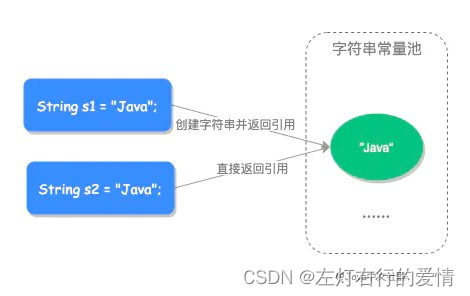  
 **字符串常量池的内存布局**

在JDK1.7之前运行时常量池逻辑包含字符串常量池存放在方法区，此时HotSpot虚拟机对方法区的实现为永久代。  
 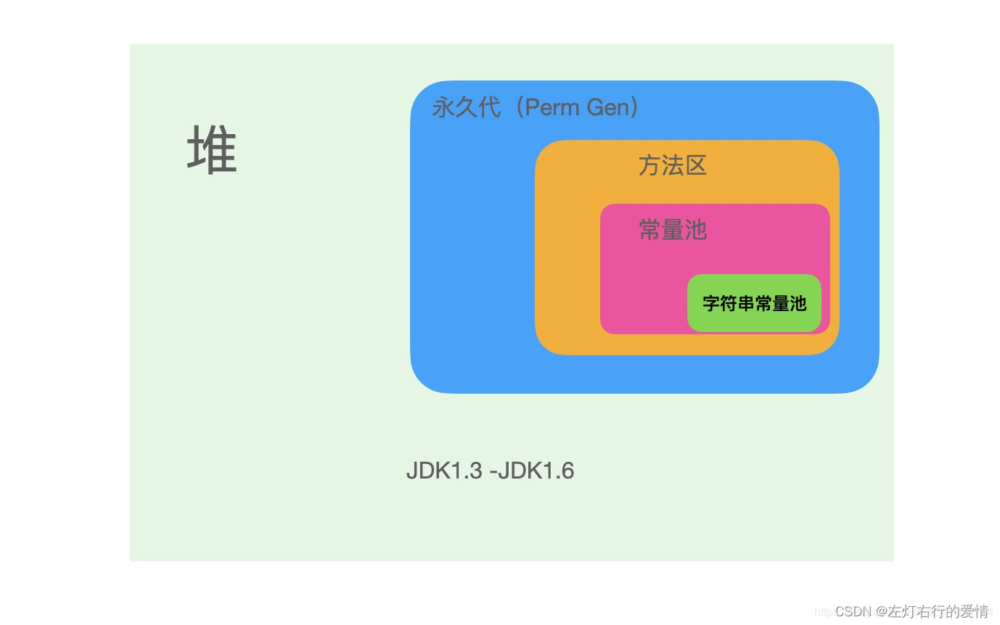  
 在JDK1.7字符串常量池和静态变量被从方法区拿到了堆中，运行时常量池剩下的还在方法区，也就是HotSpot中的永久代。  
 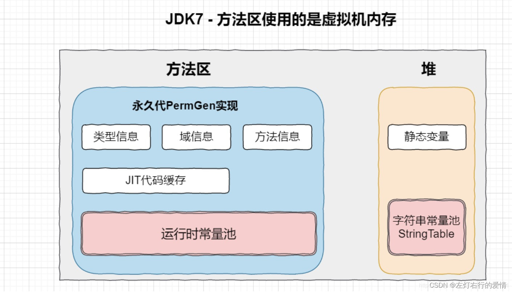  
 在JDK8 时，HotSpot移除了永久代改为元空间，这时候字符串常量池还在堆中，运行时常量池还在方法区，只不过方法区的实现从永久代改为了元空间。  
 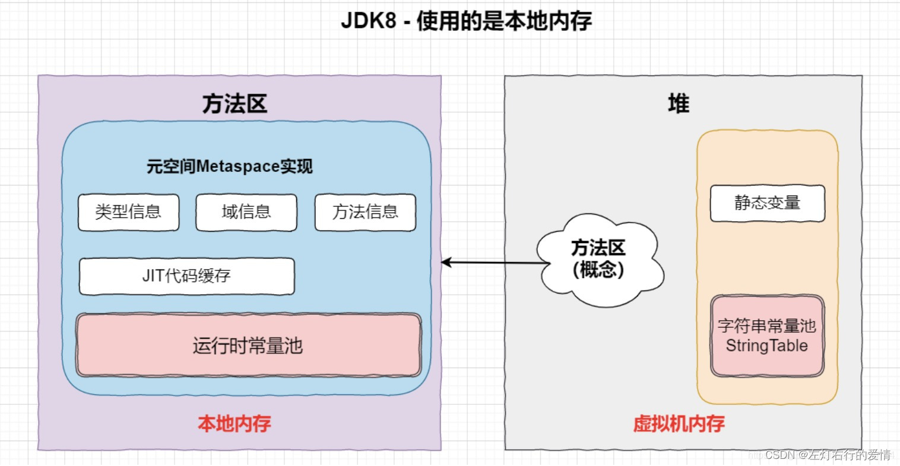

## 总结

按需所求，感谢观看，觉得有知识整理不好，欢迎指出。
