> 原文：[CSDN](https://blog.csdn.net/qq_45852626/article/details/127968283)（历史文章导入，当前状态为草稿）

## 垃圾收集器G1
## 前言

我们之前已经了解过了基本的G1内容，现在我们来详细了解一下G1的细节与实现原理。  
 学习的时候查了很多博客和书，查博客的时候发现很多都是自顶而下的去讲解，对于一些结构内容和前因后果并没有明确指名，导致我看了半天不知道为什么要学这个，为什么突然出来这个东西，所以写G1的时候我挺苦恼的，本身就属于我只是理解的内容，现在要掰开笔记和总结去写出来，比较考验我的表达和整体理解，不过自信还是有的，如果看完这篇我都能学个差不多，相信你肯定也是可以的。  
 本篇文章文字叙述较多，有的地方不好理解，如果你有哪些地方觉得我总结的不好，欢迎评论区或私信指正。  
 

## 概述

G1是一个分代的，增量的，并行与并发的标记-复制垃圾回收器。  
 它开创了收集器面向局部收集的设计思路和基于Region的内存布局形式。  
 它的设计目标是为了适应不断扩大的内存和不断增加的处理器数量，进一步降低暂停时间，同时兼顾良好的吞吐量。  
 G1作为主要面向服务端应用的垃圾收集器，HotSpot开发团队赋予的期望是在为未来可以替换掉JDK5中发布的CMS收集器。

### 停顿时间模型

那么作为CMS收集器的替代者和继承人，设计者希望做出一款能够简历起“停顿时间模型”的收集器。  
 停顿时间模型：能够支持指定在一个长度为M毫秒的时间片段内，消耗在垃圾收集上的时间大概率不超过N毫秒这样的目标。

那么我们该如何实现这个目标呢？  
 首先就是思想上的转变：  
 G1出现之前所有的收集器，垃圾收集目标范围要么是整个新生代（Minor GC），要么是整个老年代（Major GC），再要么是整个Java堆（Full GC），而G1跳出了这个牢笼，它面向堆内存的任何部分来组成回收集（Collection Set，一般称为CSet）进行回收，**衡量标准不再是它属于哪个分代，而是哪块内存中存放的垃圾数量最多，回收收益最大**，这就是G1的Mixed GC 模式。  
 所以，G1开创的基于Region的堆内存布局是它能够实现这个目标的关键。

### 内存布局

#### 传统内存布局过时了

G1不再坚持固定大小以及固定数量的分代区域划分，而是把连续的Java堆划分为多个大小相等的独立区域（Region），每一个Region都可以根据需要，扮演新生代的Eden，Survivor空间或者是老年代空间。  
 收集器能够对扮演不同角色的Region采用不同的策略去处理，所以无论是新创建的对象还是已经存活了一段时间，熬过多次收集的旧对象都能获取良好的收集效果。

虽然G1依旧保留新生代和老年代的概念，但是新生代和老年代不再是固定的了，他们都是一系列区域（不需要连续）的**动态集合**。  
 G1收集器之所以能建立可预测的停顿时间模型，是因为它将Region作为单次回收的最小单元，即每次收集到的内存空间都是Region大小的整数倍，这样可以有计划地避免在整个Java堆中进行全区域的垃圾收集。

更具体的思路：G1去跟踪各个Region里面垃圾堆积的“价值”大小，价值即回收所获得的**空间大小以及回收所需时间的经验值**，然后在后台维护一个优先级列表，根据用户设定允许的收集停顿时间，优先处理回收价值收益最大的那些Region，也就是“Garbage First”名字的由来。

#### G1实现的几个关键细节问题

G1将堆内存“化整为零”的解题思路，看起来不难理解，但实现细节用将近10年从倒腾出来可以商用的G1，我们来看一看里面的一些细节问题，引出下面我们要详细了解的G1结构。

* 将Java堆分为多个独立的Region后，Region里面存在的跨Region引用对象如何解决？

##### 铺垫知识：跨代引用

我们在上一篇文章里了解到了分代收集理论，很容易发现分代收集并非只是简单划分一下内存区域那么容易，它至少存在一个明显困难：**对象不是孤立的，对象之间存在跨代引用**。

举个栗子：如果现在进行一次只局限于新生代区域内的收集（Minor GC），但新生代中的对象是完全可能被老年代所引用的，为了找出区域中的存活对象，不得不在固定的GC Roots之外，再额外遍历整个老年代中所有对象来确保可达性分析结果的正确性，反过来一样。这个理论是可行的，但是会为内存回收带来很大的性能负担。

所以我们就看到了之前的第三条假说：**存在相互引用关系的两个对象，是倾向于同时生存或同时消亡的，且跨代引用相对于同代引用仅占极少数**。

举个栗子：  
 某个新生代对象存在跨代引用，由于老年代对象难以消亡，该引用会使得新生代对象在收集时同样得以存活，进而在年龄增长之后晋升老年代，跨代引用也随机被消除了。

依据这点，我们就不应再为了少量的跨代引用去扫描整个老年代，也不必浪费空间专门记录每一个对象是否存在及存在哪些跨代引用，只需要在新生代上建立一个全局的数据结构（记忆集，Remembered Set），这个结构把老年代划分为若干个小块，标识出老年代哪一块会存在跨代引用。

当发生Minor GC时，只有包含了跨代引用的小块内存里的对象才会被加入到GC Roots的扫描。

这个方法需要在对象改变引用关系（如将自己或者某个属性复制）时维护记录数据的正确性，会增加一些运行时开销，但是比起收集时扫描整个老年代来说仍然划算。

##### 铺垫知识：记忆集，卡表，卡页

分代收集理论提到为解决对象跨代引用所带来的问题，垃圾收集器在新生代中建立了名为记忆集（Remembered Set）的数据结构，用以避免把整个老年代加进GC Roots扫描范围。  
 事实上，并不只是新生代，老年代之间才会有跨代引用问题，所有涉及部分区域收集行为的垃圾收集器，都会面临相关的问题，所以详细聊一聊记忆集是有必要的。  
 记忆集是一种用于记录从**非收集区域指向收集区域**的指针集合的抽象数据结构。  
 假设我们不计效率和成本，那么最简单的实现就是用非收集区域中所有含跨代引用的对象数组来时间这个数据结构。

```
Class RememberedSet {
    Object[] set[OBJECT_INTERGENERATIONAL_REFERENCE_SIZE];
}


```

这种记录全部含跨代引用对象的实现方案，无论是空间占用还是维护成本都想当高昂。  
 对于垃圾收集的场景中，**收集器只需要通过记忆集判断出某一块非收集区是否存在有指向了收集区域的指针就可以了**，并不需要了解这些跨代指针的全部细节。  
 RSet在内部使用Per Region Table（PRT）记录分区的引用情况，如果一个分区非常“受欢迎”，那么RSet占用会上升，从而降低分区的可用空间，G1应对这个问题采用了改变RSet的密度的方式。  
 我们可以选择更粗犷的记录粒度来节省记忆集的存储和维护成本，下面列举了一些可供选择的记录精度：

* 字长精度：每个记录精确到一个机器字长（就是处理器的寻址位数，如常见的32位或64位，这个精度决定了机器访问物理内存地址的指针长度），该字包含跨代指针。
* 对象精度：每个记录精确到一个对象，该对象有字段含有跨代指针。
* 卡精度：每个记录精确到一块内存区域，该区域有对象含有跨代指针。  
   从上到下逐渐粗犷。  
   由上可知，粗粒度的PRT只是记录了引用数量，需要通过整堆扫描才能找出所有引用，因此扫描速度也是最慢的。

其中，**卡精度所指的是用一种称为“卡表（Card Table）”方式去实现记忆集**。  
 一些资料直接把它与记忆集混为一谈，这里我们要明确：我们前面说到的记忆集是一种“抽象”的数据结构，只是定义了记忆集的行为意图，但是没有定义其行为的具体实现。卡表就是记忆集的一种具体实现，它定义了记忆集的记录精度，与堆内存的映射关系等。不妨按照HashMap与Map之间的关系来类比理解。  
 卡表最简单的形式可以只是一个字节数组，而HotSpot虚拟机也确实是这样做的，以下是HotSpot默认卡表标记逻辑的代码实现：

```
CARD_TABLE [this address >> 9] = 0;


```

字节数组CARD\_TABLE的每一页元素都对应着其标识的内存区域中**一块特定大小的内存块**，这个内存块被称为“卡页”（Card Page）。  
 一般来说卡页大小都是2的N次幂的字节数，上面代码是2的9次幂，即512字节，  
 如果卡表标识内存区域的起始地址是0x0000的话，数组CARD\_TABLE的第0、1、2号元素，分别对应了地址范围为0x0000～0x01FF、0x0200～0x03FF、0x0400～0x05FF的卡页内存块，如下图所示：  
 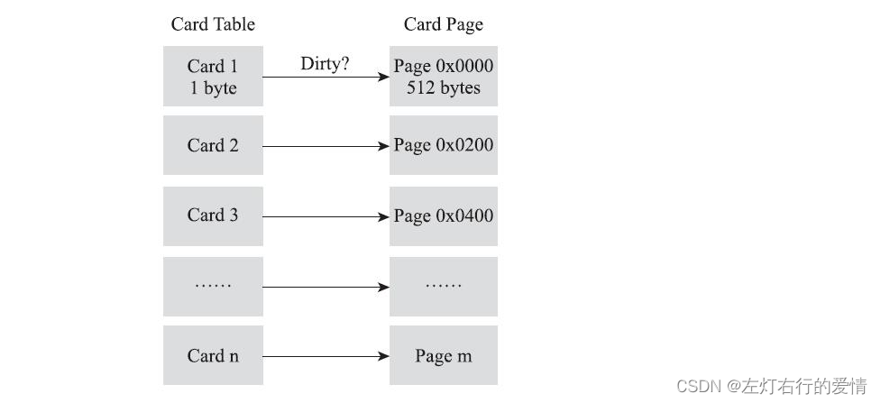  
 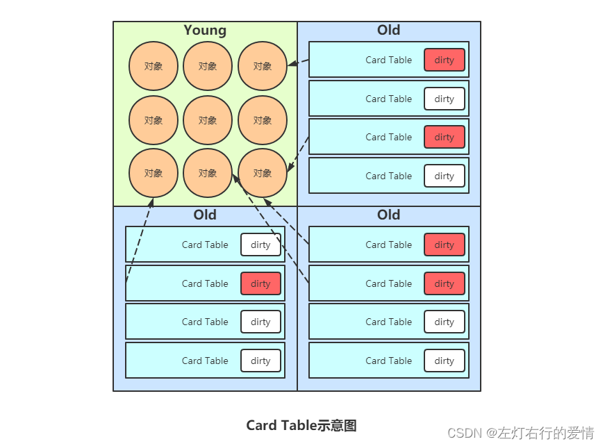

一个卡页的内存中通常包含不止一个对象，只要卡页内有一个（或多个）对象的字段存在着跨代指针，那就将对应的卡表的数组元素的值标识为1，称这个元素变脏（Dirty），没有则标识为0。  
 这样，在垃圾收集发生时，只要筛选出卡表中变脏的元素，就能轻易得出哪些卡页内存块中包含跨代指针，把它们加入GC Roots中一并扫描。

看到这里，求知好学的你一定在想，卡表元素如何维护呢？它们何时变脏？谁使它们变脏？  
 所以要引出下面写屏障的内容

##### 铺垫知识：写屏障

已经解决了如何使用记忆集来缩减GC Roots扫描范围的问题，但还没有解决卡表元素如何维护的问题，例如它们何时变脏、谁来把它们变脏等，我们接下来一起一一分析。  
 卡表元素何时变脏？  
 有其他分代区域中对象引用了本区域对象时，其对应的卡表元素就应该变脏。  
 变脏的时间点原则上应该发生在**引用类型字段赋值的那一刻**。

那如何变脏呢，换句话说，如何在对象赋值的那一刻去更新维护卡表呢？  
 假如是解释执行的字节码，那么就相对好处理，因为JVM负责每条字节码指令的执行，我们会有充分的介入空间；  
 问题是，在编译执行的场景中（经过了编译后的代码已经是纯粹的机器指令流了），就必须找到一个机器码层面的手段，把维护卡表的动作放到每一个赋值操作中。  
 所以，为了解决这个问题，HotSpot虚拟机通过写屏障（Write Barrier）技术来维护卡表的状态。**注意这里的写屏障要和并发乱序执行问题中的“内存屏障”区分开来，避免混淆。**

写屏障可以看作JVM层面对“引用类型字段赋值”这个动作的AOP切面，这引用对象赋值时会产生一个环形（Around）通知，供程序执行额外的动作，换句话说就是赋值前后都在写屏障的覆盖范畴内。  
 那么就很容易理解：  
 赋值前的部分的写屏障——写前屏障（Pre-Write-Barrier）  
 赋值后的部分的写屏障——写后屏障（Post-Write-Barrier）。  
 在G1收集器出现之前，其他收集器都只用到了写后屏障。  
 举个栗子（更新卡表状态的简化逻辑代码）：

```
void oop_field_store(oop* field, oop new_value) {
    // 引用字段赋值操作
    *field = new_value;
    // 写后屏障，在这里完成卡表状态更新
    post_write_barrier(field, new_value);
}


```

或者用个图来表示一下：  
 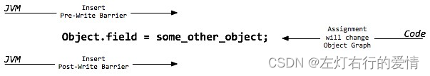

所以，应用写屏障后，JVM就会为所有的赋值操作生成相应的指令，一旦收集器在写屏障中增加了更新卡表操作，无论操作的是不是老年代对新生代对象的引用，每次只要对引用进行更新，就会产生额外的开销，不过这个开销与Minor GC时扫描整个老年代的代价相比还是低很多的。

注意，卡表在高并发场景下还面临着“伪共享”（False Sharing）问题。  
 伪共享是处理并发底层细节时一种经常需要考虑的问题，线代中央处理器的缓存系统是以缓存行（Cache Line）为单位存储的，当多线程修改互相独立的变量时，如果这些变量恰好共享同一缓存行，就会彼此影响（写回，无效化或者同步）而导致性能降低，这就是伪共享问题。  
 举个栗子：  
 假设处理器的缓存行大小为64字节，由于一个卡表元素占1个字节，64个卡表元素将共享同一个缓存行。这64个卡表元素对应的卡页总的内存为32KB（64×512字节），也就是说如果不同线程更新的对象正好处于这32KB的内存区域内，就会导致更新卡表时正好写入同一个缓存行而影响性能。

为了避免伪共享问题，一种简单的解决方案是不采用无条件的写屏障，而是先检查卡标记，只有当该卡元素未被标记过时才将其标记变脏，即将卡表更新的逻辑变为以下代码所示：

```
if (CARD_TABLE [this address >> 9] != 0)
    CARD_TABLE [this address >> 9] = 0;


```

JDK7之后，HotSpot虚拟机增加了一个新参数：`-XX：+UseCondCardMark`，用来决定是否开启卡表更新的条件判断。  
 开启会增加一次额外判断的开销，但是能避免伪共享问题，两者各有性能损耗，是否打开要根据应用实际运行情况来测试权衡。

##### 插眼往下看

聊到这里了，想要解决我们之前提出的那个问题还差点东西，之前我们了解了：跨代引用，记忆集，卡表，卡页，写屏障，现在理解分区模型就不难了。  
 这里我们先跳出问题，去看内存模型的内容（估计看的人觉得有点跳跃，这是我权衡之下不得已这样设计，为的就是好懂，只是有点跳跃而已。）

### G1内存模型

#### 分区Region

G1采用了分区（Region）的思路，将整个堆空间分成若干个大小相等的内存区域，每次分配对象空间将逐段地使用内存。  
 因此，在堆的使用上，G1并不要求对象的存储一定是物理上连续的，只要逻辑上连续即可；  
 每个分区也不会确定地为某个代服务，可以按需在年轻代和老年代之间切换，默认将整堆划分为2048个分区。  
 分区示意图：

#### 卡片Card

在每个分区（Region）内部又被分为了若干个512Byte大小的卡片，标识堆内存最小可用粒度所有分区的卡片将会记录在全局卡片表（Global Card Table）中，分配的对象会占用物理上连续的若干个卡片，当查找对分区对象的引用时便可通过记录卡片来查找该引用对象（见RSet）。每次对内存的回收，都是对指定分区的卡片进行处理。  
 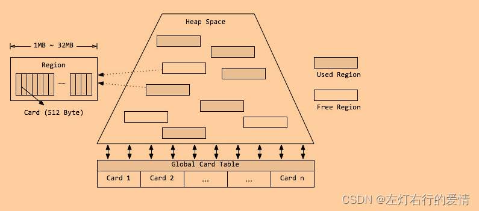

#### 堆Heap

G1同样可以通过-Xms/-Xmx来指定堆空间大小。  
 当发生年轻代收集或混合收集时，通过计算GC与应用的耗费时间比，自动调整堆空间大小，如果GC频率太高，则通过增加堆尺寸，来减少GC频率，相应地GC占用的时间也随之降低；  
 当空间不足时，G1会首先尝试增加堆空间，如果扩容失败，则发起担保的Full GC。Full GC后，堆尺寸计算结果也会调整堆空间。

### 分代模型

#### 分代垃圾收集

分代垃圾收集可以将关注点集中在最近被分配的对象上而无需整堆扫描，避免长命对象的拷贝，同时独立收集有助于降低响应时间。  
 虽然分区使得内存分配不再要求紧凑的内存空间，但G1仍然使用了分代的思想。  
 G1将内存在逻辑上划分为年轻代和老年代，其中年轻代又划分为Eden空间和Survivor空间，但年轻代的空间并不是固定不变的，当现有年轻代分区占满时，JVM会分配新的空闲分区加入到年轻代空间。

#### 本地分配缓冲Local Allocation Buffer（Lab）

由于分区的思想，每个线程均可以“认领”某个分区用于线程本地的内存分配，而不需要顾及分区是否连续。因此，每个应用线程和GC线程都会独立的使用分区，进而减少同步时间，提升GC效率，这个分区称为本地分配缓存区（Lab）。  
 其中，应用线程可以独占一个本地缓冲区（TLAB）来创建对象，而大部分都会落入Eden区域（巨型对象或分配失败除外），因此TLAB的分区属于Eden空间；  
 每次垃圾收集时，每个GC线程同样可以独占一个本地缓冲区（GCLAB）用来转移对象，每次回收会将对象复制到Suvivor空间或老年代空间；  
 对于从Eden/Survivor空间晋升（Promotion）到Survivor/老年代空间的对象，同样有GC独占的本地缓冲区进行操作，该部分成为晋升本地缓冲区（PLAB）。

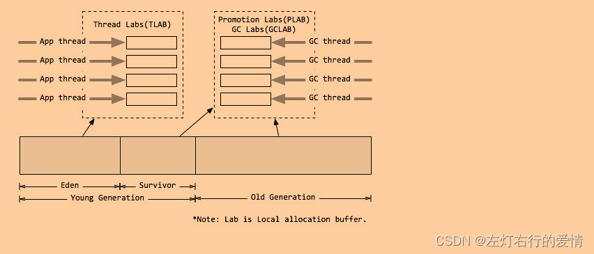

### 分区模型

G1对内存的使用是以分区（Region）为单位，但是对对象的分配则是以卡片（Card）为单位。  
 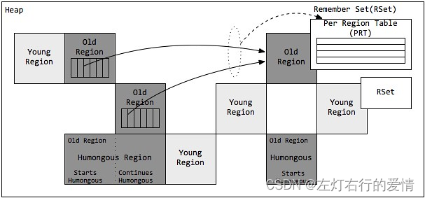

#### 巨型对象Humongous Region

一个大小达到甚至超过分区一半大小的对象成为巨型对象。  
 当线程为巨型对象分配空间时，不能简单在TLAB进行分配，因为巨型对象的移动成本很高，而且有可能一个分区不能容纳巨型对象。因此巨型对象会直接在老年代分配，所占用的连续空间称为巨型分区（Humongous Region）。  
 G1内部做了一个优化，一旦发现没有引用指向巨型对象，则可直接在年轻代收集周期中被回收。

巨型对象会独占一个或多个连续分区，其中第一个分区被标记开始巨型（StartsHumongous），相邻连续分区被标记为连续分区（ContinuesHumongous）。  
 由于无法享受Lab带来的优化，并且确定一片连续的内存空间需要扫描整堆，因此确定巨型对象开始位置的成本非常高，如果可以，应用程序应该避免生成巨型对象。

#### 已记忆集合Remembered Set（RSet）

我们对上面提到的RSet进行一些补充和完善。  
 在串行和并行收集器中，GC通过整堆扫描，来确定对象是否处于可达路径中。  
 G1为了避免STW式的整堆扫描，在每个分区记录了一个已记忆集合（RSet），内部类似一个反向指针（记录引用分区对象的卡片**索引**）。  
 当要回收该分区时，通过扫描分区的RSet，来确定引用本分区的对象是否存活，进而确定本分区内的对象存活情况。

##### RSet的维护

由于不能扫描，有需要计算分区确切的活跃度，因此，G1需要一个增量式的完全标记并发算法，通过维护RSet，得到准确的分区引用信息。在G1中，RSet的维护主要来自于两个方面：

* 写栅栏
* 并发优化线程  
   写栅栏不多说了，前面应该蛮详细的了。  
   这里聊一聊并发优化线程的事情。  
   当赋值语句发生后，写后栅栏会先通过G1的过滤技术判断是否跨分区的引用更新，并将跨分区更新对象的卡片加入缓冲区序列，即更新日志缓冲区或脏卡片队列。与SATB（初始快照，后面会详细聊，这里留个印象就行）类似，一旦日志缓冲区用尽，则分配一个新的日志缓冲区，并将原来的缓冲区加入全局列表中。  
   并发优化线程（Concurrence Refinement Threads），只专注于扫描日志缓冲区记录的卡片来维护更新RSet，线程最大数目可通过-XX:G1ConcRefinementThreads（默认等于-XX:ParellelGCThreads）来设置。  
   并发优化线程是永远活跃的，一旦发现全局列表有路局存在，就开始并发处理。  
   如果记录增长很快或者来不及处理，那么通过阈值-X:G1ConcRefinementGreenZone/-XX:G1ConcRefinementYellowZone/-XX:G1ConcRefinementRedZone，G1会用分层的方式调度，使更多的线程处理全局列表。  
   如果并发优化线程也不能跟上缓冲区数量，则Java应用线程会挂起应用并被加起来帮助处理，知道全部处理完。  
   因此必须避免此类场景出现。

---

综上对于RSet而言：  
 事实上，并非所有的引用都需要记录在RSet中，如果一个分区确实是需要扫描的，那么无需RSet也可以无遗漏的得到引用关系，那么引用源自本分区的对象，没必要落入RSet中。  
 同时，G1 GC 每次都会对年轻代进行整体收集，因此引用源自年轻代的对象，也不需要在RSet中记录，最后只有老年代的分区可能会有RSet记录，这些分区称为拥有RSet分区。

#### 收集集合（CSet）

收集集合（CSet）代表**每次GC暂停时回收的一系列目标分区**。  
 在任意一次收集暂停时，CSet所有分区都会被释放，内部存活的对象都会被转移到分配的空闲分区中。  
 因此，无论是年轻代收集，还是混合收集，工作机制都是一致的。  
 年轻代收集CSet只容纳年轻代分区，混合收集会通过启发式算法，在老年代候选回收分区中，筛选出回收收益最高的分区添加到CSet中。

候选老年代分区的CSet准入条件，可以通过活跃度阈值-XX:G1MixedGCLiveThresholdPercent(默认85%)进行设置，从而拦截那些回收开销巨大的对象；  
 同时每次混合收集可以包含候选老年代分区，可根据CSet对堆的总大小占比  
 -XX:G1OldCSetRegionThresholdPercent(默认10%)设置数量上限。

由上述可知，G1的收集都是根据CSet进行操作，年轻代收集与混合收集没有明显的不同，最大的区别在于两种收集的触发条件。

##### 年轻代收集集合 CSet of Young Collection

应用线程不断活动后，年轻代会被逐渐填满。  
 当JVM分配对象到Eden区域失败（Eden区已满）时，便会触发一次STW式的年轻代收集。  
 在年轻代收集中，Eden分区存活的对象将被拷贝到Survivor分区；  
 原有Survivor分区存活对象，将根据任期阈值分别晋升到PLAB（本地缓冲区）中，新的survivor分区和老年代分区。  
 而原有的年轻代分区将会整体回收掉。

同时，年轻代收集还负责维护对象的年龄（存活次数），辅助判断老化对象晋升的时候是到Survivor分区还是老年代分区。  
 年轻代收集首先先将晋升对象尺寸总和，对象年龄信息维护到年龄表中，再根据年龄表，Survivor尺寸，Survivor填充容量-XX:TargetSurvivorRatio(默认50%)，最大任期阈值-XX:MaxTenuringThreshold(默认15)，计算出一个恰当的任期阈值，凡是超过任期阈值的对象都会被晋升到老年代。

##### 混合收集集合 CSet of Mixed Collection

年轻代收集不断活动后，老年代的空间也会被逐渐填充。  
 当老年代占用空间超过整堆比IHOP阈值-XX:InitiatingHeapOccupancyPercent(默认45%)时，G1就会启动一次混合垃圾收集周期，为了满足暂停目标，G1可能不能一口气将所有的候选分区收集掉，因此G1可能会产生连续多次的混合收集与应用线程交替执行，每次STW的混合收集与年轻代收集过程类似。

为了确定包含到年轻代收集集合CSet的老年代分区，JVM通过参数混合周期的最大总次数-XX:G1MixedGCCountTarget(默认8)、堆废物百分比-XX:G1HeapWastePercent(默认5%)。  
 通过候选老年代分区总数和混合周期最大总次数，确定每次包含到CSet的最小分区数量；  
 根据堆废物百分比，当收集达到参数时，不再启动新的混合收集。  
 而每次添加到CSet的分区，则通过计算得到的GC效率进行安排。

##### 并发标记算法（三色标记法）

上篇文章中我们了解到了可达性算法，我们介绍了最简单的实现方案是：从GC Roots节点开始，使用【标记-清除】算法去实现。  
 这种实现方案分为两个阶段：标记阶段，清除阶段。  
 在标记阶段：它从GC Roots节点开始扫描整个引用链，找到所有可达的对象。  
 在清除阶段：扫描整个引用链的不可达对象，然后将垃圾对象清除掉。  
 整个算法实现如下所示：  
 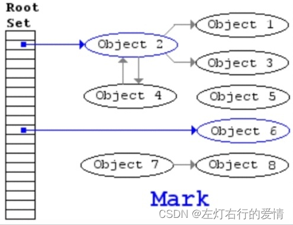  
 但是这种方式有一个很大的缺点，整个过程必需【Stop The World】。这就导致了整个应用程序必需停止，不能做任何改变，非常不友好，CMS回收器出现之前的所有回收器，都是用这种方式实现的，因此GC停顿时间都挺长的。

为了解决上面【标记-清除】算法的问题，出现了【三色标记算法】！

并发类回收器的并发标记阶段，GC线程和应用线程是并发进行的。所以一个对象被标记后，应用线程可能篡改对象的引用关系，从而造成对象的漏标，误标（误标没什么关系，漏标后果致命，原因后面细聊），为了解决并发标记过程中出现漏标的情况，我们在并发标记时使用三色标记法。  
 CMS和G1在并发标记时使用的是同一算法：三色标记法，采用黑，灰，白三种颜色。黑色表示从GC Roots开始，已经扫描过它全部引用的对象，灰色指的是扫描过对象本身，还没有完全扫描过它全部引用的对象，白色指的是还没有扫描过的对象。  
 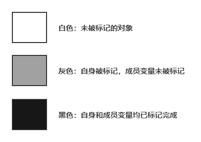  
 有个动图，可以看一看：  
 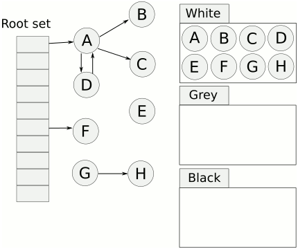  
 四个过程的静态图：  
 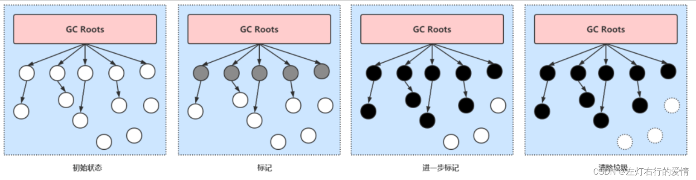

* 初始状态：  
   GC开始前所有对象都是白色，GC一开始所有跟都能够直达的对象被压到栈中。  
   这个阶段需要【Stop the World】。
* 并发标记：  
   从灰色节点开始，去扫描整个引用链，  
   没有子节点的话，将本节点变为黑色。  
   有子节点的话，则当前节点变为黑色，子节点变为灰色。  
   这个阶段不需要【Stop the World】。
* 重新标记阶段：  
   指的是去校正并发标记阶段的错误，直至灰色对象没有其他子节点引用时结束。  
   这个阶段需要【Stop the World】。
* 并发清除阶段：  
   指的是将已经确定为垃圾的对象清除掉。  
   这个阶段不需要【Stop the World】。

对比一下【四阶段拆分】和【一段式】实现方式，我们可以看出：**通过将最耗时的引用链扫描剥离出来作为并发标记阶段，将其用户线程并发执行，从而极大地降低了GC停顿时间**。  
 但是，GC线程与用户线程并发执行，会带来新的问题：**对象引用关系可能会发生变化，有可能会发生我们上面提到的多标和漏标问题**。

##### 多标和漏标问题

**多标**  
 多标问题：  
 指的是原本应该回收的对象，被多余地标记为黑色存活对象，从而导致该垃圾对象没有被回收。  
 出现的原因：  
 在并发标记阶段，有可能之前已经被标记为存活的对象，其引用被删除，从而变成了不可达对象。

举个栗子：  
 假设我们现在遍历到了节点E，此时应用执行了`objD.fieldE=null`。  
 那么此刻之后，对象E，F，G应该是被回收的。  
 但是因为节点E已经是灰色的，那么E，F，G节点都会被标记为存活的黑色状态。  
 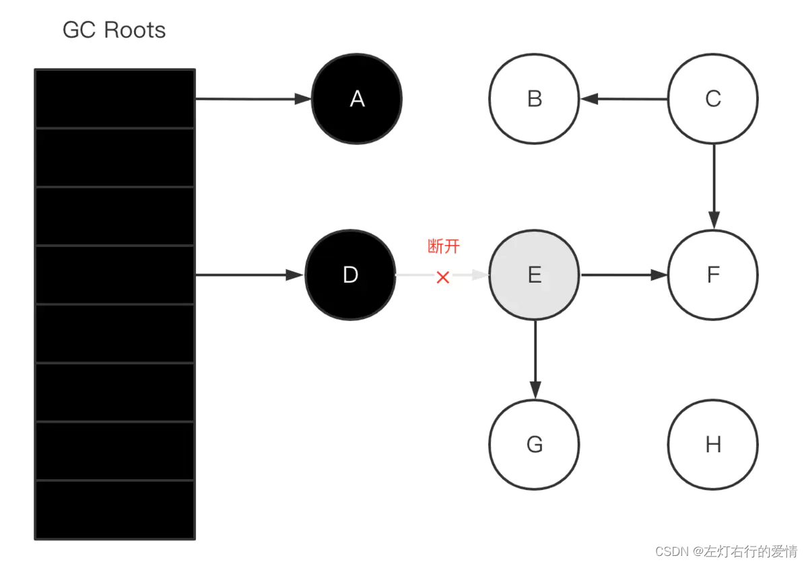  
 多表问题会导致内存产生浮动垃圾，但是好在可以在下次GC 的时候回收掉这些浮动垃圾，因此问题不算很严重。  
 **漏标**  
 漏标问题：  
 原本应该被标记为存活的对象，被遗漏标记为黑色（该变黑色却被遗漏了），从而导致该对象为白色垃圾对象被错误回收。  
 出现原因：  
 只有同时满足以下两个条件才会发生漏标。

* 一个或者多个黑色对象重新引用了白色对象；级黑色对象成员变量增加了新的引用。
* 灰色对象断开了白色对象的引用（直接或者间接的引用）；即灰色对象原来成员变量的引用发生了变化。

举个栗子：  
 假设GC线程已经遍历到了E对象（变为灰色了），此时应用线程先执行了：

```
Object G = objE.fieldG;
objE.fieldG = null;  // 灰色E 断开引用 白色G 
objD.fieldG = G;  // 黑色D 引用 白色G


```

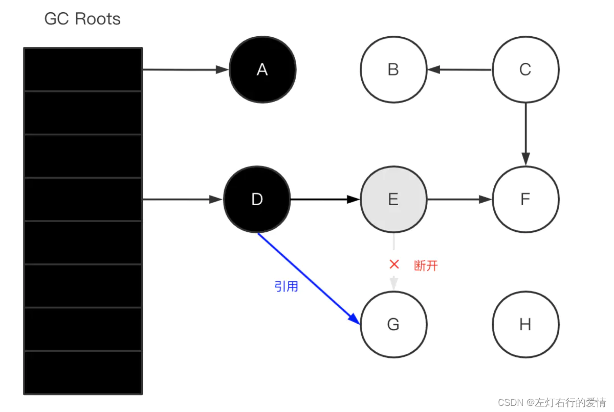  
 漏标问题就非常严重了，会导致存活对象被回收，严重影响程序功能。

那么我们垃圾回收器如何解决这个问题呢？  
 增加一个【重新标记】阶段。无论是在CMS还是G1回收器，它们都在并发标记阶段之后，新增了一个【重新标记】阶段来校正【并发标记】阶段出现的问题。  
 只不过对于两个不同的回收器来说，解决的原理不同。  
 我们在这只聊G1的解决方案，CMS的我们后面聊到它的专辑会说的。  
 具体解决原理：  
 我们之前也知道了漏标问题发生需要满足两个条件：

* 一个或者多个黑色对象重新引用了白色对象；即黑色对象成员变量增加了新的引用。
* 灰色对象断开了白色对象的引用（直接或者间接的引用）；即灰色对象原来成员变量的引用发生了变化。  
   只有当上面两个条件都满足时，才会发生漏标问题，换句话说，只要我们破坏了其中任意一个条件，这个白色对象就不会被漏标。  
   那么就产生了两种解决方式：增量更新，原始快照。  
   **原始快照方案**  
   G1采用的是原始快照方案，破坏第二个条件【灰色对象断开了白色对象的引用（直接或者间接的引用）；即灰色对象原来成员变量的引用发生了变化。】  
   既然灰色对象在扫描完成（针对自身）后删除了对白色对象的引用，那么我们能否在灰色对象取消引用之前，先将灰色对象引用的白色对象记录下来。  
   随后在【重新标记】阶段再以白色对象为根，对它的引用进行扫描，从而避免了漏标的问题。  
   通过这种方式，原本漏标的对象就会被重新扫描变成灰色，从而变为存活状态。  
   缺点在于：产生浮动垃圾。因为当用户线程取消引用时，有可能是真的取消引用，对应的对象是真的要回收掉的。我们通过这种方式，就会把本该回收的对象又复活了，从而导致出现浮动垃圾。但是相对于本该存活的对象被回收，这个还是可以接受的，毕竟下次GC就可以回收了。

补充一个更细节的说法：原始快照又名起始快照算法（Snapshot at the beginning）（SATB）。  
 SATB会创建一个对象图，相当于堆的逻辑快照，从而确保并发标记阶段所有的垃圾对象都能通过快照被鉴别出来。  
 当赋值语句发生时，应用将会改变它的对象图，JVM需要记录被覆盖的对象。  
 因此写前栅栏会在引用变更前，将值记录在STAB日志或缓冲区中。  
 每个线程都会独占一个SATB缓冲区，初始有256条记录空间。  
 当空间用尽时，线程会分配新的SATB缓冲区继续使用，而原有的缓冲区则加入全局列表中。  
 最终在并发标记阶段，并发标记线程（Concurrent Marking Threads）在标记的同时，还会定期检查和处理全局缓存区列表的记录，然后根据标记位图分片的标记位，扫描引用字段来更新RSet。  
 此过程又称并发标记/SATB写前栅栏。

### G1的垃圾回收周期

G1的垃圾收集周期主要有4种类型：年轻代收集周期，多级并发标记周期，混合收集周期，Full GC（转移失败的安全保护机制）。  
 我们先来看一眼G1垃圾收集活动时序图：  
 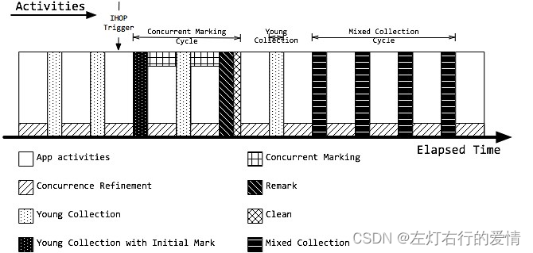

#### 年轻代收集

应用刚启动，慢慢流量进来，开始生成对象。

G1会选一个分区并指定它为Eden分区，当这块分区用满了之后，G1会选一个新的分区作为Eden分区，这个操作会一直进行下去直到达到Eden分区上限，也就是说Eden分区已经被占满，那么就会触发一次年轻代收集。

年轻代收集首先就是迁移存活的对象（它使用单Eden，双Survivor进行复制算法），将存活的对象从Eden分区转移到Survivor分区，Survivor分区内的某些对象达到了任期阈值之后，会晋升到老年代分区。原有的年轻代分区会被整个回收掉。

同时，年轻代收集还负责维护对象年龄，存活对象经历过年轻代收集总次数等信息。  
 G1将晋升对象的尺寸总和和它们的年龄信息维护到年龄表中，结合年龄表，Survivor占比（–XX:TargetSurvivorRatio 默认50%），最大任期阈值（–XX:MaxTenuringThreshold 默认为15）来计算一个合适的任期阈值。

#### 并发标记周期

随着时间推移，越来越多的对象晋升到老年代中，当老年代占比（相对于Java总堆而言）达到IHOP参数（上图中的IHOP Trigger）之后，G1首先会触发并发标记周期（上图的Concurrent Marking Cycle），当完成后才会开始下一小节的混合垃圾收集周期。  
 G1的并发标记循环分5个阶段：  
 并发标记位图过程：  
 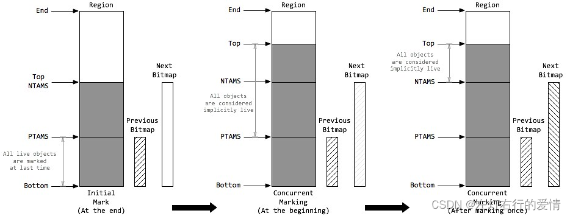  
 要标记存活对象，每个分区都需要创建【位图】（BItmap）信息来存储标记数据，来确定标记周期被分配的对象。

G1采用了两个位图Previous Bitmap，Next Bitmap，来存储标记数据，Previous位图存储上次的标记数据，Next位图**在标记周期内不断变化更新**，同时Previous位图的标记数据也越来越过时，当标记周期结束后Next位图便替换Previous位图，成为上次标记的位图。

同时，每个分区通过顶部开始标记（TAMS），来记录已标记过的内存范围。

同样的，G1使用了两个顶部开始标记Previous TAMS（PTAMS），Next TAMS（NTAMS），记录已标记的范围。

每个并发标记周期：  
 在初始标记STW的最后，G1会分配一个空的Next位图和一个指向分区顶部（Top）的NTAMS标记。

* Previous位图记录的上次标记数据，上次的标记位置，即PTAMS。
* 在PTAM与分区底部（Bottom）的范围内，所有存活对象都已被标记。  
   那么在PTAMS与Top之间的对象都将会是隐式存活（Implicitly Live）。
* 在并发标记阶段，Next位图吸收了Previous位图的标记数据，同时每个分区都会有新的对象分配，则Top与NTAMS分离，前往更高的地址空间。
* 在并发标记的一次标记中，并发标记线程将找出NTAMS与PTAMS之间的所有存活对象，将标记数据存储在Next位图中。
* 同时，在NTAMS与Top之间的对象即成为已标记对象。
* 如此不断的更新Next位图信息，并在清除阶段与Previous位图交换角色

##### 初始标记 Initial Mark

初始标记（Initial Mark）负责标记所有能被直接可达的根对象（原生栈对象，全局对象，JNI对象），根是对象图的起点，因此初始标记需要将Java应用线程暂停掉，也就是需要一个STW的时间段。  
 事实上，当达到IHOP阈值时，G1并不会立即发起并发标记周期，而是等待下一次年轻代收集，利用年轻代收集的STW时间段，完成初始标记，这种方式称之为【借道】。  
 在初始标记暂停时，分区的NTASM都被设置为分区顶部Top，初始标记是并发执行，直到所有的分区处理完。

##### 根分区扫描 Root Region Scanning

在初始标记暂停结束后，年轻代收集也完成的对象复制到Survivor的工作，应用线程开始活跃起来。  
 此时为了保证标记算法的正确性，所有新复制到Survivor分区的对象，都需要被扫描并标记成根，这个过程称之为根分区扫描（Root Region Scanning），同时扫描的Survivor分区也被称之为根分区（Root Region）。  
 根分区扫描必须在下一次年轻代垃圾收集启动前完成（并发标记的过程中，可能会被若干次年轻代垃圾收集打断），因为每次GC会产生新的存活对象集合。

##### 并发标记 Concurrent Marking

和应用线程并发执行，并发标记线程在并发标记阶段启动，由参数-XX:ConcGCThreads（默认GC线程数的1/4，即-XX:ParallelGCThreads/4）控制启动数量，每个线程每次只扫描一个分区，从而标记出存活对象图。  
 这一阶段会处理Previous/Next标记位图，扫描标记对象的引用字段。  
 同时，并发标记线程还会定期检查和处理STAB全局缓冲区列表的记录，更新对象引用信息。参数-XX:+ClassUnloadingWithConcurrentMark会开启一个优化，如果一个类不可达（不是对象不可达），则在重新标记阶段，这个类就会被直接卸载。  
 所有的标记任务必需在堆满前就完成扫描，如果并发标记耗时很长，那么可能在并发标记过程中，又经历了几次年轻代收集。  
 如果堆满前没有完成标记任务，则会触发担保机制，经历一次长时间串行的Full GC。

##### 存活数据计算 Live Data Accounting

存活数据计算是标记操作的附加产物，只要一个对象被标记，同时会被计算字节数，并计入分区空间。  
 只有NATMS以下的对象会被标记和计算，在标记周期的最后，Next位图将被清空，等待下次标记周期。

##### 重新标记 Remark

重新标记是最后一个标记阶段。  
 在该阶段中，G1需要一个暂停的时间，去处理剩下的SATB日志缓冲区和所有更新，找出所有未被访问的存活对象，同时安全完成存活数据计算。  
 这个阶段也是并行执行的，通过参数XX:ParallelGCThread可设置GC暂停时可用的GC线程数。  
 同时，引用处理也是重新标记阶段的一部分，所有重度使用引用对象（弱引用，软引用，虚引用，最终引用）的应用都会在引用处理上产生开销。

##### 清除 Cleanup

紧挨着重新标记阶段的清楚（Clean）阶段也是STW的。  
 Previous/Next标记位图，以及PTAMS/NTAMS，都会在清楚阶段交换角色。  
 主要执行以下操作：

* RSet梳理，启发式算法会根据活跃度和RSet尺寸对分区定义不同等级，同时RSet梳理也有助于发现无用的引用。参数-XX:+PrintAdaptiveSizePolicy可以开启打印启发式算法决策细节。
* 整理堆分区，为混合收集周期识别回收收益高（基于释放空间和暂停目标）的老年代分区集合。
* 识别所有空间分区，即发现无存活对象的分区。该分区可在清楚阶段直接回收，无需等待下次收集周期。

### 年轻代收集/混合收集周期

年轻代收集和混合收集周期，是G1回收空间的主要活动。  
 当应用运行开始时，堆内存可用空间还比较大，只会在年轻代满时，触发年轻代收集；  
 随着老年代内存增长，当到达IHOP阈值-XX:InitiatingHeapOccupancyPercent（老年代占整堆比，默认45%）时，G1开始着手准备收集老年代空间。  
 首先经历并发标记周期，识别出高收益的老年代分区，前文已述。  
 但随后G1并不会马上开始一次混合收集，而是让应用线程先运行一段时间，等待触发一次年轻代收集。  
 在这次STW中，G1将保准整理混合收集周期。  
 接着再次让应用线程运行，当接下来的几次年轻代收集时，将会有老年代分区加入到CSet中，即触发混合收集，这些连续多次的混合收集称之为混合收集周期（Mixed Collection Cycle）。

#### GC工作线程数

GC工作线程数：-XX:ParallelGCThreads  
 JVM可以通过参数-XX:ParallelGCThreads进行指定GC工作的线程数量。  
 参数-XX:ParallelGCThreads默认值不是固定的，而是根据当前CPU资源进行计算。  
 如果用户没有指定，且CPU小于等于8，则默认与CPU核数相等；  
 若CPU大于8，则默认JVM会经过计算得到一个小于CPU核数的线程数；  
 当然也可以人工指定与CPU核数相等。

#### 年轻代收集 Young Collection

每次手机过程中，既有并行执行的活动，也有串行执行的活动，但都可以是多线程的。  
 在并行执行的任务中，如果某个任务过重，会导致其他线程在等待某项任务的处理，需要对这些地方进行优化。

##### 并行活动

* 外部根分区扫描 Ext Root Scanning：此活动对堆外的根（JVM系统目录、VM数据结构、JNI线程句柄、硬件寄存器、全局变量、线程对栈根）进行扫描，发现那些没有加入到暂停收集集合CSet中的对象。如果系统目录（单根）拥有大量加载的类，最终可能其他并行活动结束后，该活动依然没有结束而带来的等待时间。
* 更新已记忆集合 Update RS：并发优化线程会对脏卡片的分区进行扫描更新日志缓冲区来更新RSet，但只会处理全局缓冲列表。作为补充，所有被记录但是还没有被优化线程处理的剩余缓冲区，会在该阶段处理，变成已处理缓冲区（Processed Buffers）。为了限制花在更新RSet的时间，可以设置暂停占用百分比-XX:G1RSetUpdatingPauseTimePercent（默认10%，，即-XX:MaxGCPauseMills/10）。  
   值得注意的是，如果更新日志缓冲区更新的任务不降低，单纯地减少RSet的更新时间，会导致暂停中被处理的缓冲区减少，将日志缓冲区更新工作推到并发优化线程上，从而增加对Java应用线程资源的争夺。
* RSet扫描 Scan RS：在收集当前CSet之前，考虑到分区外的引用，必需扫描CSet分区的RSet。如果RSet发生粗化，则会增加RSet的扫描时间。  
   开启诊断模式-XX:UnlockDiagnosticVMOptions后，通过参数-XX:+G1SummarizeRSetStats可以确定并发优化线程是否能够及时处理更新日志缓冲区，并提供更多的信息，来帮助为RSet粗化总数提供窗口  
   。参数-XX：G1SummarizeRSetStatsPeriod=n可设置RSet的统计周期，即经历多少此GC后进行一次统计。
* 代码根扫描 Code Root Scanning：对代码根集合进行扫描，扫描JVM编译后代码Native Method的引用信息（nmethod扫描），进行RSet扫描。事实上，只有CSet分区中的RSet有强代码根时，才会做nmethod扫描，查找对CSet的引用。
* 转移和回收 Object Copy：通过选定的CSet以及CSet分区完整的引用集，将执行暂停时间的主要部分：CSet分区存活对象的转移，CSet分区空间的回收。通过工作窃取机制来负载均衡地选定复制对象的线程，并且复制和扫描对象被转移的存活对象将拷贝到每个GC线程分配缓冲区GCLAB。  
   G1会通过计算，预测分区复制所花费时间，从而调整年轻代的尺寸。
* 终止 Termination：完成上述任务后，如果任务队列已空，则工作线程会发起终止要求。如果还有其他线程继续工作，空闲的线程会通过工作窃取机制尝试帮助其他线程处理。而单独执行根分区扫描的线程，如果任务过重，最终会晚于终止。
* GC外部的并行活动 GC Worker Other：该部分并非GC的活动，而是JVM活动导致占用了GC暂停时间（例如JNI编译）

##### 串行活动

* 代码根更新 Code Root Fixup：根据转移对象更新代码根。
* 代码根清理 Code Root Purge：清理代码根集合表。
* 清除全局卡片标记 Clear CT：在任意收集周期会扫描CSet 与RSet记录的PRT，扫描时会在全局卡片表中进行标记，防止重复扫描。在收集周期的最后将会清楚全局卡片表中的已扫描标志。
* 选择下次收集集合 Choose CSet：该部分主要用于并发标记周期后的年轻代收集，以及混合收集中，在这些收集过程中，由于有老年代候选分区的加入，往往需要对下次收集的范围做出界定；但单纯的年轻代收集中，所有收集分区都会被收集，不存在选择。
* 引用处理 Ref Proc：主要针对软引用，弱引用，虚引用，final引用，JNI引用。当Ref Proc 占用时间过多时，可选择使用参数-XX:ParallelRefProcEnabled激活多线程引用处理。G1希望应用能小心使用软引用，因为软引用会一直占据内存空间知道空间耗尽时被Full GC回收掉；即使未发生Full GC，软引用对内存的占用，也会导致GC次数的增加。
* 引用排队 Ref Enq：此项活动可能会导致RSet的更新，此时会通过记录日志，将关联的卡片标记为脏卡片。
* 卡片重新脏化：重新脏化卡片
* 回收空闲巨型分区 Humongous Reclaim：G1做了一个优化：通过查看所有根对象以及年轻代分区的RSet，如果确定RSet中巨型对象没有任何引用，则说明G1发现了一个不可达的巨型对象，该对象分区会被回收。
* 释放分区 Free CSet：回收CSet分区的所有空间，并加入到空闲分区中。
* 其他活动 Other：GC中可能还会经历其他耗时很小的活动，如修复JNI句柄等。

##### 并发标记周期后的年轻代收集 Young Collection Following Concurrent Marking Cycle

当G1发起并发标记周期之后，并不会马上开始混合收集。G1会先等待下一次年轻代收集，然后在该收集阶段中，确定下次混合收集的CSet。

##### 混合收集周期 Mixed Collection Cycle

单次的混合收集与年轻代收集并无二致。根据暂停目标，老年代的分区可能不能一次暂停收集中被处理完，G1会发起连续多次的混合收集，称为混合收集周期（Mixed Collection Cycle）。G1会计算每次加入CSet中的分区数量，混合收集进行次数，并且在上次的年轻代收集，以及接下来的混合收集中，G1会确定下次加入的CSet的分区集（Choose CSet），并且确定是否结束混合收集周期。

##### 转移失败的担保机制 Full GC

转移失败（Evacuation Failure）是指当G1无法在堆空间中申请新的分区时，G1便会触发担保机制，执行一次STW式的，单线程的Full GC。  
 Full GC 会对整堆做标记清除和压缩，最后将只包含纯粹的存活对象。参数-XX:G1ReservePercent(默认10%)可以保留空间，来应对晋升模式下的异常情况，最大占用整堆50%，更大没意义。  
 G1在以下场景会触发FullGC，同时在日志中记录to-space-exhausted以及Evacuation Failure：

* 从年轻代分区拷贝存活对象时，无法找到可用的空闲分区
* 从老年代分区转移存活对象时，无法找到可用的空闲分区
* 分配巨型对象时在老年代无法找到足够的连续分区  
   由于G1的应用场合往往堆内存都比较大，所以Full GC的收集代价非常昂贵，应该避免Full GC的发生。
