> 原文：[CSDN](https://blog.csdn.net/qq_45852626/article/details/127949548)（历史文章导入，当前状态为草稿）

## 基础概念

### 什么是垃圾回收

垃圾回收是JVM垃圾回收器提供的一种用在空闲时间不定时回收无任何对象引用的对象所占据的内存空间的一种机制。  
 垃圾收集器在一个Java程序汇总的执行是自动的，不能强制执行，我们能做的就是通过调用System.gc方法来**建议**执行垃圾收集器，但是到底是否可执行，什么时候执行都是不可知的，虽然这是它的缺点，但瑕不掩瑜。

### 为什么要进行垃圾回收

如果你了解过C++，你肯定明白对象所占的内存在程序结束前一直被占用，在明确释放之前不能分配给其他对象；  
 在Java中，垃圾回收能自动释放内存空间，减轻编程负担，JVM的一个系统级线程会自动释放该内存块。

这使得C++程序员最头疼的内存管理问题迎刃而解，而且因为垃圾回收机制，Java中的对象也不再有“对象域”的概念，只有对象的引用才有“对象域”。  
 此外，垃圾回收可以有效防止内存泄漏，有效的使用空间内存。  
 小段子，在餐厅里吃饭，吃完把餐盘端走清理，是C++程序员，而吃完直接走的，是Java程序员。

## 垃圾

先看一下内存区域  
 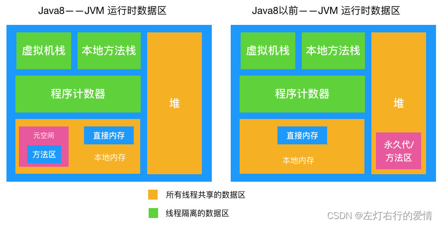

### 什么是垃圾

垃圾，这里指的是可以销毁的对象，其占有的空间是可以回收。  
 根据JVM架构划分，几乎所有的对象实例都在堆中存放，所以垃圾回收主要是针对堆来进行的。  
 JVM的眼中，垃圾就是指在堆中存在，但是已经“死亡”的对象。  
 而对于死亡的定义，我们简单理解为“不可能再被任何途径使用的对象”。  
 问题来了，你怎么证明对象是死是活呢？

### 你是垃圾吗？让我用算法来测测你。

JVM没有明确说使用哪种垃圾回收算法，但是任何一种垃圾回收算法一般要做2件基本的事情：  
 1：找到所有存活对象  
 2：回收被无用对象占用的内存空间，使该空间可被程序再次使用

#### 引用计数算法

给对象添加一个引用计数器：  
 当对象增加一个引用时，计数器+1；  
 当对象失效一个引用时，计数器-1；  
 两个对象如果出现循环引用的情况，此时引用计数器永不为0，导致无法对它们进行回收。  
 所以因为有循环引用存在，JVM不使用引用计数算法（经典白雪）。  
 代码如下：

```
public class ReferenceCountingGC {

    public Object instance = null;

    public static void main(String[] args) {
        ReferenceCountingGC objectA = new ReferenceCountingGC();
        ReferenceCountingGC objectB = new ReferenceCountingGC();
        objectA.instance = objectB;
        objectB.instance = objectA;
    }
}


```

#### 可达性分析算法

上面那种是计数法，因为会造成循环依赖问题，所以不被广泛使用。  
 第二种就是我们下面要介绍的根可达算法。  
 现代虚拟机基本都是采用这种算法来判断对象的存活。  
 通过叫做GC Roots的对象为起点出发，引出它们指向的下一个节点，再以下个节点为起点，引出此节点指向的下一个节点（这样通过GC Root串成的一条线就叫引用链），直到所有节点都遍历完毕，如果相关对象不在任意一个以GC Root为起点的引用链中，则这些对象都会被判断为垃圾，被GC回收。  
 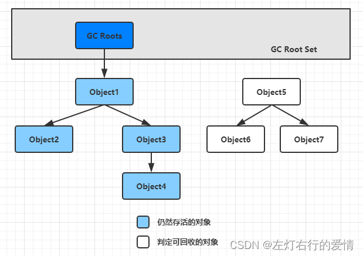  
 那么有哪些对象有机会可以作为GC Roots，分为以下几种：  
 1.虚拟机栈（栈帧中本地变量表）中引用的对象，比如各个线程被调用的方法堆栈中使用到的参数，局部变量，临时变量等  
 2.在方法区中类静态变量引用的对象  
 3.在方法区中常量引用的对象  
 4.在本地方法中JNI（Native方法）引用的对象  
 5.在JVM内部的引用，如基本数据类型对应的Class对象，一些常驻异常对象及系统类加载器  
 6.所有被同步锁持有的对象  
 7.反应 Java 虚拟机内部情况的 JMXBean，JVMTI 中注册的回调，本地代码缓存等。  
 除了这些固定的GC Roots集合以外，根据用户所选用的垃圾收集器以及当前回收的内存区域不同，还可能会有其他对象“临时性”加入，共同构成完整的GC Roots集合。

##### 对象引用

可达性分析是基于引用链进行判断的，在JDK1.2后，Java将引用关系分为以下四类：

* 强引用（Strongly Reference）：最传统的引用，如Object obj=new Object（）。无论任何情况下，只要强引用关系还存在，垃圾收集器就永远不会回收掉被引用的对象。
* 软引用（Soft Reference）：用于描述一些还有用，但非必需的对象。只要被软引用关联着的对象，在系统将要发生内存溢出异常之前，会被列入回收范围进行第二次回收，如果这次回收后还没有足够的内存，才会抛出内存溢出异常。
* 弱引用（Weak Reference）：用于描述那些非必需的对象，强度比较比软引用弱。被弱引用关联对象只能生存到下一次垃圾收集发生时，无论当前内存是否足够，弱引用都会被回收。
* 虚引用（Phantom Reference）：最弱的引用关系。为一个对象设置虚引用关联的唯一目的只是为了能在这个对象被回收时收到一个系统通知。

##### 对象，真的死了吗

要宣告一个对象死亡，需要经过至少两次标记过程：  
 1.如果对象进行可达性分析后发现GC Roots不可达，将会进行第一次标记；  
 2.随后进行一次筛选，条件是——此对象是否有必要执行finalized()方法。  
 如果对象没有覆盖finalized()方法，或者finalized方法以及被JVM调用过了，那么都会被视为没有必要执行。  
 如果判断结果是有必要执行，此时对象会被放入名为F-Queue的队列，收集器会进行第二次小规模的标记，如果对象在finalized()方法中重新将自己与引用链上的任何一个对象进行了关联，那么它完成了自我拯救，第二次标记会将其移除“即将回收”的集合，否则该对象就将被真正回收，走向死亡。

## 方法区回收

在Java堆上进行对象回收的性价比通常比较高，因为大多数对象都是朝生夕灭。  
 而方法区由于回收条件比较苛刻，对应的回收性价比通常比较低，主要回收两部分内容：  
 废弃常量和无用的类。

### 废弃常量

与堆中对象回收类似，以常量池字面量回收为例，如果字符串“abc”进入了常量池，但是没有任何一个String对象引用它，也没有任何地方引用了这个字面量，如果发生内存回收，有必要的话，这个常量会被系统清理出常量池。

### 无用类

* 该类所有的实例都已经被回收了（堆中不存在该类的任何实例）
* 加载该类的ClassLoader已经被回收
* 该类对应的Java.lang.Class对象没有在任何地方被引用，无法在任何地方通过反射访问该类的方法。  
   JVM可以对满足以上三个条件的无用类进行回收，但不是一定被回收。  
   是否对类回收HotSpot提供了-Xnoclassgc参数进行控制。

## 垃圾回收算法

当前大多数虚拟机都遵循“分代收集”的理论进行设计，它建立在强弱两个分代假说下：

* 弱分代假说（Weak Generational Hypothesis）：绝大数对象都是朝生夕灭（IBM 公司的专业研究表明，有将近98%的对象是朝生夕死）。
* 强分代假说（Strong Generational Hypothesis）：熬过越多次垃圾收集过程的对象就越难以消亡。
* 跨带引用假说（Intergenerational Reference Hypothesis）：基于上面两条假说还可以得出一条隐含推论：存在相互引用关系的两个对象，应该倾向于同时生存或者同时消亡。顺便提一嘴，跨代引用相对于同代引用仅占极少数。

强弱分代假说奠定了垃圾收集器的设计原则：  
 收集器应该将Java堆划分不同的区域，然后将回收对象依据年龄（对象经历垃圾收集的次数）分配到不同的区域中进行存储。  
 如果一个区域中的对象都是朝生夕灭的，那么收集器只需要关注少量对象的存活而不是去标记那些大量要回收的对象，此时就能以较小代价获取较大空间。  
 最后再将难以消亡的对象集中到一起，根据强分代假说，它们很难消亡，所以JVM可以使用较低频率进行回收，兼顾了时间和内存空间的开销。  
 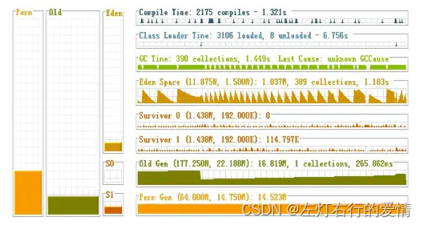

### 回收类型

根据分代收集理论，收集范围可以分为以下几种类型：

* 部分收集（Partial GC）：具体分为：  
   新生代收集（Minor GC/Young GC）：只对新生代进行垃圾收集；  
   老年代收集（Major GC/Old GC）：只对老年代进行垃圾收集。  
   混合收集（Mixed GC）：对整个新生代和部分老年代进行垃圾收集。
* 整堆收集（Full GC）：收集整个Java堆和方法区。

### 分代收集理论

我们通过了可达性算法来识别哪些数据是垃圾，那么如何高效的对这些垃圾回收呢？  
 由于JVM规范并没有对如何实现垃圾收集器做出明确的规定，因此各个厂商的虚拟机可以采用不同的方式来实现垃圾收集器，这里主要有下面几种方式。

### 标记清除算法（Mark-Sweep）

标记清除算法是基础垃圾回收算法，分为两部分：  
 1.先把内存区域中的这些对象标记（哪些属于可回收标记出来）  
 2.把这些垃圾拎出来清理掉。  
 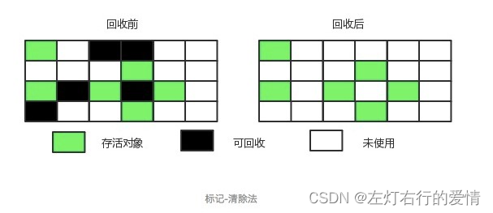

缺点：  
 1.虽然逻辑十分清晰，但是会产生大量内存碎片，从而可能导致无法为大对象分配足够的连续内存。  
 2.执行效率不稳定，如果Java堆上包含大量需要回收的对象，则需要进行大量标记和清除动作。

### 标记-复制算法

标记-复制算法基于“半区复制”算法：  
 1.它将可用内存按容量划分为大小相等的两块，每次只使用其中一块。  
 2.当这一块的内存使用完了，就将还存活着的对象复制到另外一块上面。  
 3.将使用过的那块内存空间一次性清理掉。  
 优点：避免了内存空间碎片化的问题  
 缺点：  
 1.如果内存中多数对象都是存活的，这种算法将产生大量的复制开销；  
 2.浪费内存空间，内存空间变为了原有的一半。  
 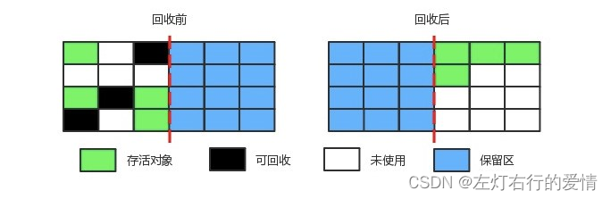### 标记-整理算法  
 在标记完成之后，让所有存活对象都向内存的一端移动，然后直接清理掉边界以外的内存。  
 优点：可以避免内存空间碎片化，也可以充分利用内存空间；  
 缺点：  
 1.它对内存变动的更频繁，需要整理所有存活对象的引用地址，效率上比复制算法要差很多。  
 2.在移动存活对象可能要全程暂停用户程序。  
 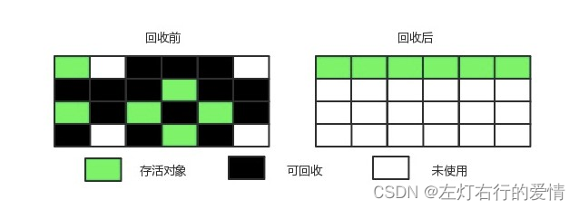

### 分代收集算法

商业虚拟机采用分代收集算法，根据对象存活周期将内存划分为几块，不同块采用适当的收集算法，严格来说并不是一种思想或者理论，而是融合三种基础的算法思想，针对不同情况采用不同算法的一套组合拳。  
 一般将堆分为新生代和老年代。

* 新生代使用：复制算法。
* 老年代使用：标记-清除或者标记-整理算法。

## 经典垃圾收集器

并行和并发是并发编程中的专有名词，在谈论垃圾收集器的上下文语境中，它们的含义如下：

* 并行（Parallel）：并行描述的是多条垃圾收集器线程之间的关系，说明同一时间有多条这样的线程在协同工作，默认用户线程处于等待状态。
* 并发（Concurrent）：并发描述的是垃圾收集器线程与用户线程之间的关系，说明同一时间垃圾收集器线程和用户线程都在运行。但由于垃圾收集器线程会占一部分系统资源，所以程序的吞吐量依然会受到一定影响，除了CMS和G1之外，其他垃圾收集器都是以串行方式执行。  
   下图中的连线代表了可以配合使用。  
   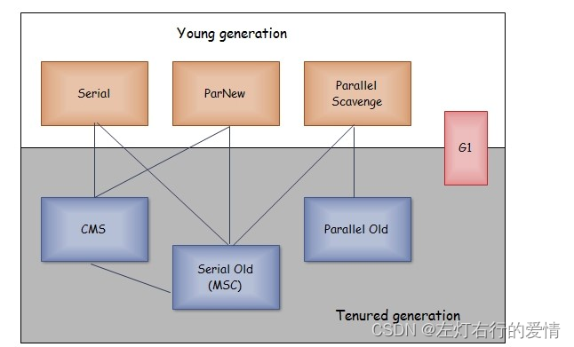

### Serial收集器

最基础，历史最悠久的收集器，进行垃圾回收时，必需暂停其他所有的工作线程，直到收集结束。  
 缺点：要暂停其他所有的工作线程，直到收集结束。  
 优点：单线程避免了多线程复杂的上下文切换，因此在单线程环境下收集效率非常高。  
 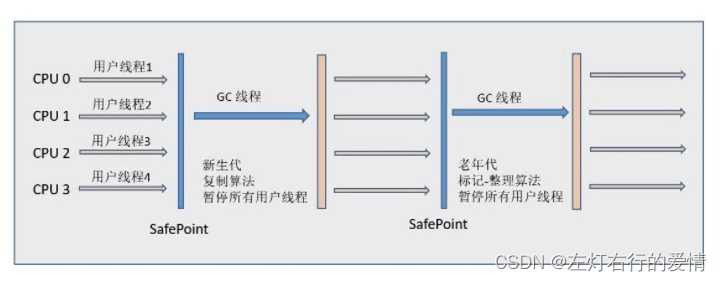

### Serial Old收集器

它是Serial收集器的老年代版本，同样是一个单线程收集器，采用标记-整理算法，主要用于给客户端模式下的HotSpot虚拟机使用：  
 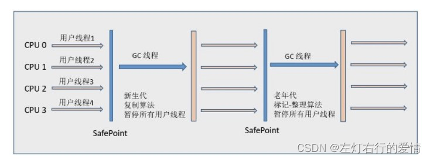

### ParNew收集器

Serial收集器的多线程版本，可以使用多条线程进行垃圾回收：  
 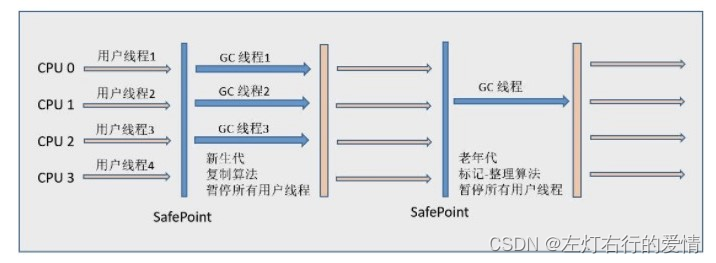

### Paralled Old 收集器

它是Parallel Scavenge收集器的老年代版本，支持多线程并发收集，采用标记-整理算法实现：  
 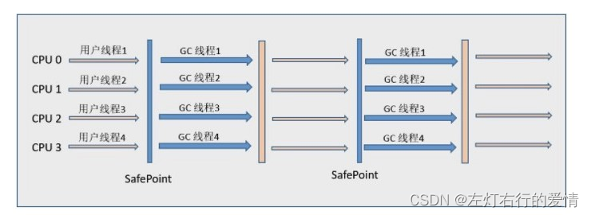

### Parallel Scavenge收集器

与ParNew一样是多线程收集器  
 其他收集器的关注点在于尽可能缩短垃圾收集时用户现场的停顿时间，而它的目标是达到一个可控制的吞吐量，被称为“吞吐量优先”收集器。这里的吞吐量是指CPU用于运行用户代码的时间占总时间的比值  
 `（吞吐量 = 运行用户代码时间 \ (运行用户代码时间 + 运行垃圾收集时间)）`。  
 停顿时间越短就越适合需要与用户相互的程序，良好的响应速度能提升用户体验。  
 缩短停顿时间是以牺牲吞吐量和新生代空间来换取的：新生代空间越小，垃圾回收越频繁，导致吞吐量下降。  
 高吞吐量则可以高效率地利用CPU时间，尽快完成程序的运算任务，主要适合在后台运算而不需要太多交互的任务。

### CMS收集器

它是一种以获取最短回收停顿时间为目标的收集器，基于标记-清除算法实现，整个收集过程分为以下四个阶段：  
 1.初始标记（inital mark）：标记GC Roots能直接关联到的对象，耗时短但需要暂停用户线程；  
 2.并发标记（concurrent mark）：从GC Roots能直接关联到对象开始遍历整个对象图，耗时长但不需要暂停用户线程。  
 3.重新标记（remark）：采用增量更新算法，对并发标记阶段因为用户线程运行而产生变动的那部分对象进行重新标记，耗时比初始标记稍长且需要暂停用户线程；  
 4.并发清除（inital sweep）：并发清楚掉已经死亡的对象，耗时长但不需要暂停用户线程。  
 在整个过程中耗时最长的并发标记和并发清除过程中，收集器线程都可以与用户线程一起工作，不需要进行停顿。  
   
 缺点：

* 吞吐量低：低停顿时间是以牺牲吞吐量为代价，导致CPU利用率不够高。
* 无法处理浮动垃圾：  
   浮动垃圾是指并发清除阶段由于用户线程继续运行而产生的垃圾。  
   这部分垃圾只能到下一次GC时才能进行回收。由于浮动垃圾的存在，因此需要预留出一部分内存，意味着CMS收集不能像其他收集器那样等待老年代快满时再回收。  
   如果预留的内存不够存放浮动垃圾，就会出现Concurrent Mode Failure，这时虚拟机会临时启动Serial Old来替代CMS。
* 标记-清除法导致的空间碎片：往往出现老年代空间剩余，但是无法找到足够大连续空间来分配当前对象，不得不提前触发一次Full GC。

### G1收集器（Garbage-First）

面向服务端应用的垃圾收集器，在多CPU和大内存的场景下有很好的性能。HotSpot开发团队赋予它的使命是未来可以替换掉CMS收集器。

堆被分为新生代和老年代，其他收集器进行手机的范围是整个新生代或者老年代，而G1可以直接对新生代和老年代一起回收。

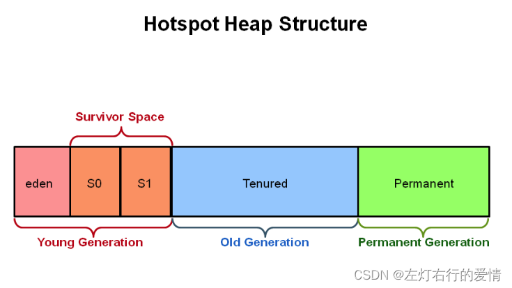  
 G1把堆划分为多个大小相等的独立区域，新生代和老年代不再物理隔离。  
 （H代表了大对象）  
 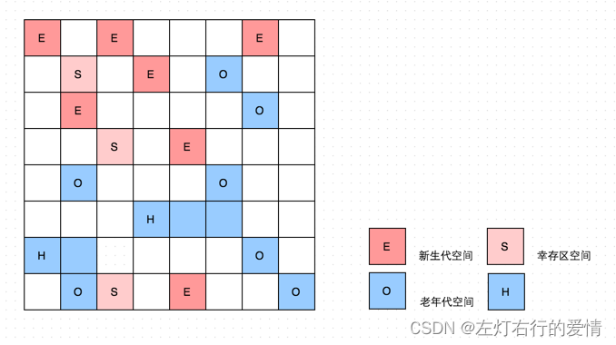

通过引入Region的概念，从而将原来的一整块内存空间划分为多个小空间，使得每个小空间可以进行单独的垃圾回收。  
 每个Region都可以根据不同的需求来扮演不同的新老年代空间。  
 这种划分带来了很大的灵活性，使得可预测的停顿事件模型成为可能。  
 通过记录每个Region垃圾回收时间以及回收所获得的空间（这两个值是通过过去回收的经验获得），维护一个优先列表，每次根据允许的收集时间，优先回收价值最大的Region。

每个Region都有一个Remembered Set，用来记录该Region对象的引用对象所在的Region。  
 通过使用Remembered Set ，在做可达性分析的时候就可以避免全堆扫描。

在不计算维护Remembered Set的操作，G1收集器的运作大致可划分为以下几个步骤：

* 初始标记：标记GC Roots能直接关联到的对象，并且修改TAMS（Top at Mark Start）指针的值，让下一阶段用户线程并发运行时，能够正确的在Region中分配新对象。  
   G1为每个Region都涉及了两个名为TAMS的指针，新分配的对象必须位于这两个指针位置以上，位于这两个指针位置以上的对象默认被隐式标记为存活，不会纳入回收范围。
* 并发标记：从GC Roots能直接关联到的对象开始遍历整个对象图。  
   遍历完成后，还需要处理SATB记录中变动的对象。SATB（snapshot-at-the-beginning，开始阶段快照）能够有效的解决并发标记阶段因为用户线程运行而导致的对象变动，其效率比CMS重新标记阶段所使用的增量更新算法效率更高。
* 最终标记：为了修正并发标记期间用户程序继续运作而导致标记变动的那一部分标记记录，JVM将这段时间对象变化记录在线程的Remembered Set Logs里面，最终标记阶段需要把Remembered Set Logs的数据合并到Remembered Set中。这阶段需要停顿线程，但是可并行执行。
* 筛选回收：首先对各个Region中的回收价值和成本进行排序，根据用户所期望的GC停顿时间来制定回收计划。此阶段其实也可以做到与用户程序一起并发执行，但是因为只回收一部分Region，时间是用户可控制的，而且停顿用户线程将大幅度提高收集效率。  
   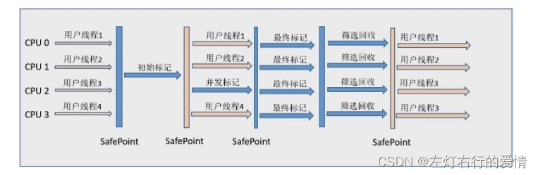

具备的特点：  
 空间整合：整体来看是基于“标记-整理”算法实现的收集器，从局部（两个Region之间）来看是基于复制算法实现，这意味着运行期间不会产生内存空间碎片。  
 可预测的停顿：能让使用者明确指定在一个长度为M毫秒的时间片段内，消耗在Gc上的时间不得超过N毫秒。
