> 原文：[CSDN](https://blog.csdn.net/qq_45852626/article/details/128079372)（历史文章导入，当前状态为草稿）

## 概述

计算机只认识0和1，所以我们写的程序需要被编译器翻译成由0和1构成的二进制格式才能被计算机执行。  
 但由于虚拟机以及大量建立在虚拟机之上的程序语言雨后春笋搬的出现并且蓬勃发展，我们编写的程序编译成二进制本地机器码（Native Code）已经不是唯一的选择了，越来越多的程序语言选择了与操作系统和机器指令集无关的，平台中立的格式作为程序编译后的存储格式。

### 无关性的基石

直到今天，或许还有相当一部分程序员认为Java虚拟机执行Java程序是一件理所当然天经地义的事情。但是Java技术发展之初，设计者就考虑过其他语言运行在Java虚拟机之上的可能性。  
 实现语言无关性的基础仍然是虚拟机和字节码存储格式。  
 Java虚拟机不与包括Java语言在内的任何程序语言绑定，它只与“Class文件”这种特定的二进制文件格式所关联，Class文件中包含了Java虚拟机指令集，符号表以及若干其他辅助信息。  
 JVM规范要求在Class文件中必须应用许多强制性语法和结构化约束，但图灵完备的字节码格式，保证了任意一门功能性语言都可以表示为一个能被Java虚拟机所接受的有效Class文件。  
 Java语言中各种语法，关键字，常量变量和运算符号的语义最终都会由多条字节码指令组合来表达，这决定了字节码指令所能提供的语言描述能力必须比Java语言更加强大才行。  
 因此，有一些Java语言本身无法有效支持的语言特性并不代码在字节码也无法有效表达出来，这为其他程序语言实现一些有别于Java的语言特性提供了发挥空间。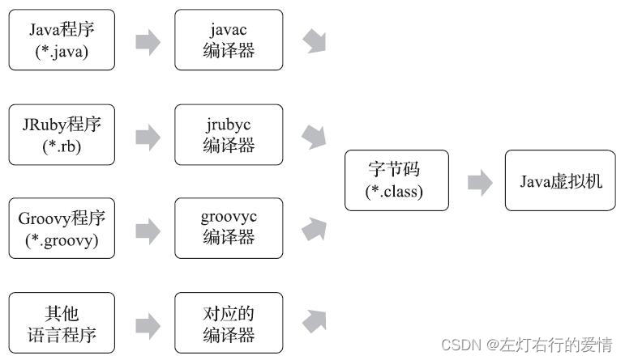

## Class类文件结构

### 前言

阅读本章时，不可避免的感觉枯燥，但这部分内容又是Java虚拟机的重要基础之一，是了解虚拟机的必经之路，如果想比较深入地学习虚拟机相关知识，这部分是无法回避的。  
 Java技术能够一直保持着非常良好的向后兼容性，Class文件结构的稳定功不可没，任何一门程序语言能够获得商业上的成功，都不可能去做升级版本后，旧版本编译的产品就不再能够运行这种事情。

### 字节码文件

Class文件是一组以8个字节为基础单位的二进制流（当遇见需要占用8个字节以上空间的数据项时，则会按照高位在前的方式分割成若干个8个字节进行存储），各个数据项目严格按照顺序紧凑地排列在文件之中，中间没有添加任何分隔符，这使得整个Class文件中存储的内容几乎全部都是程序运行的必要数据，没有空隙存在。

根据《Java虚拟机规范》的规定，Class文件格式采用一种类似于C语言结构体的伪结构来存储数据，这种伪结构只有两种数据类型：

* 无符号数  
   属于基本数据类型，以u1，u2，u4，u8来分别代表1个字节，2个字节，4个字节，8个字节的无符号数，无符号数可以用来描述数字，索引引用，数量值或者按照UTF-8编码构成字符串值。
* 表  
   由多个无符号数或者其他表作为数据项构成的复合数据类型，为了便于区分，所有表的命名都习惯性地以“\_info”结尾。表用于描述有层次关系的复合结构的数据，整个Class文件本质上也可以视作一张表，如下图所示：  
   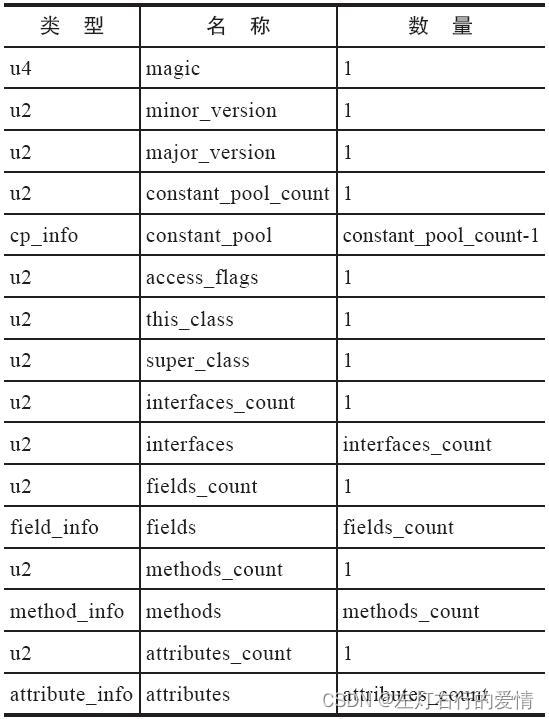  
   注意：无论是无符号数还是表，当需要描述同一类型但数量不定的多个数据时，经常会使用一个前置的容量计数器加若干个连续的数据项的形式，这时候称这一系列连续的某一类型的数据为某一类型的“集合”。

Class结构由于没有任何分隔符号，所以在上图中的数据项，无论是顺序还是数量，甚至与数据存储的字节序这样的细节，都是被严格限定的，哪个字节代表什么含义，长度是多少，先后顺序如何，全部都不允许改变。

### 结构属性

这里我们先一个个介绍，最后列一个总和和例子来帮助理解。  
 这里给一个例图：  
 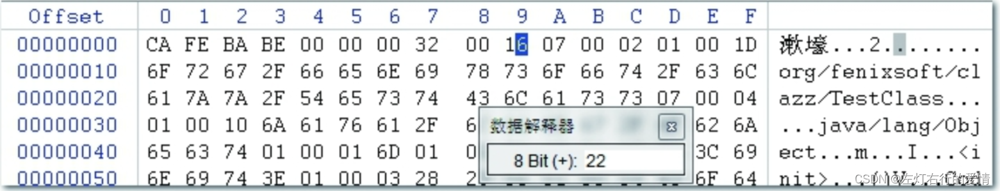

#### 魔数与Class文件的版本号

##### 魔数

每个Class文件的头四个字节被称之为魔数（Magic Number），唯一作用是：确定这个文件是否为一个能被虚拟机接受的Class文件。使用魔数而不是扩展名只要是基于安全考虑，因为文件扩展名可以随意改动。  
 Class文件的魔数值为0xCAFEBABE（咖啡宝贝）。

##### 版本号

紧接着魔数的四个字节存储的是Class文件的版本号：  
 第5-6个字节——次版本号（Minor Verson）  
 第7-8个字节——主版本号（Major Version）。  
 Java的版本号从45开始，JDK1.1之后每个JDK大版本发布主版本号向上+1。  
 高版本的JDK能向下兼容以前版本的Class文件，但不能运行以后版本的Class文件（因为JVM规范在Class文件校验部分明确要求：即使文件格式并未发生任何变化，JVM也必须拒绝执行超过其版本号的Class文件）。  
 举个栗子：  
 JDK 1.1能支持版本号为45.0～45.65535的Class文件，无法执行版本号为46.0以上的Class文件。  
 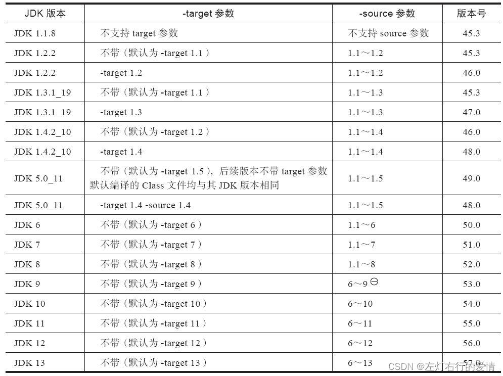

#### 常量池

紧接着主，次版本之后就是常量池的入口，常量池可以比喻Class文件里的资源仓库，它是Class文件结构中与其他项目关联最多的数据，通常也是占用Class文件空间最大的数据项目之一，顺便一提：是Class文件里第一个出现表类型数据项目。  
 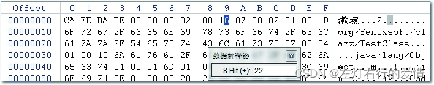

由于常量池中常量的数量是不固定的，所以常量池的入口需要放置一项u2类型的数据，代表常量池计数值（constant\_pool\_count）。  
 与Java语言习惯不同，这个容量计数是从1而不是0开始的，常量池容量（偏移地址：0x00000008）为十六进制数0x0016，即十进制的22，这就代表常量池中有21项常量，索引值范围是1~21。

第0项空出来是有特殊考虑的，目的在于：  
 如果后面某些指向常量池的索引值的数据在特定情况下需要表达“不引用任何一个常量池项目”的含义，可以把索引值设置为0来表示。

常量池主要存放两大类常量：

* 字面量（Literal）  
   字面量比较接近于Java语言层面的常量概念（如文本字符串，被声明为final的常量值等）
* 符号引用（Symbolic References）  
   属于编译原理方面的概念，主要包括下面几类常量：  
   1.被模块导出或者开放的包（Package）  
   2.类和接口的全限定名（Fully Qualified Name）  
   3.字段的名称和描述符（Descriptor）  
   4.方法的名称和描述符  
   5.方法句柄和方法类型（Method Handle，Method Type，Invoke Dynamic）  
   6.动态调用点和动态常量（Dynamically-Computed Call Site，Dynamically-Computed Constant）

常量池中每一项常量都是一个表，最初常量表中共有11种各不相同的表结构数据，后来为了更好地支持动态语言调用，额外增加了4种动态语言相关的常量，为了支持Java模块化系统（Jigsaw），又加入了CONSTANT\_Module\_info和CONSTANT\_Package\_info两个常量，所以截至JDK 13，常量表中分别有17种不同类型的常量。  
 这17类表都有一个共同的特点，表结构起始的第一位是个u1类型的标志位（tag），代表当前常量属于哪种常量类型。  
 17种常量类型具体含义如下图所示：  
 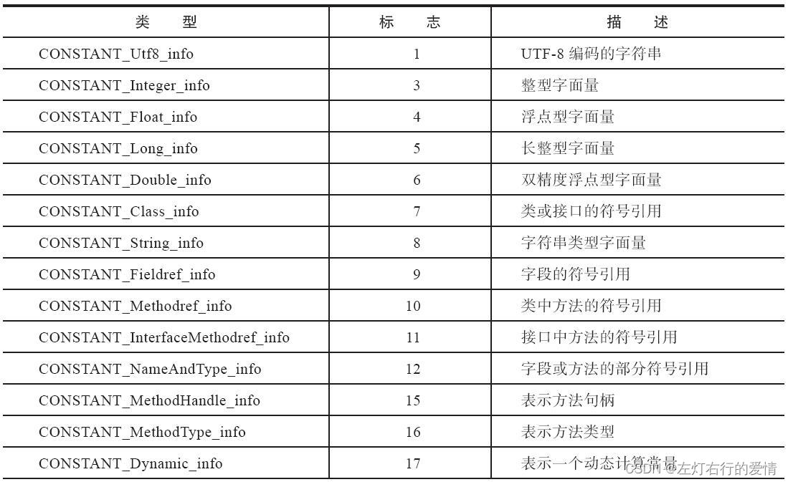  
 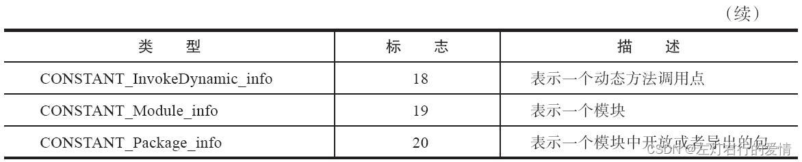  
 之所以说常量池是最烦琐的数据，是因为这17种常量类型各自有完全独立的
数据结构
，相互之间没有什么共性和联系。

我们再来看一下这个图:  
   
 常量池的第一项常量，它的标志位（偏移地址：0x0000000A）是0x07，查表可知属于CONSTANT\_Class\_info 类型，此类型的常量代表一个类或者接口的符号引用。  
 我们来简单看一看这个类型的结构：  
   
 tag是标志位，它用于区分常量类型。  
 name\_index是常量池的索引值，它指向常量池中的一个CONSTANT\_Utf8\_info 类型的常量，此常量代表了这个类（或者接口）的全限定名。  
 本例中的name\_index值（偏移位置：0x0000000B）为0x0002，也就是指向了常量池中的第二项常量，它的标志位（地址：0x0000000D）是0x01，查表可知是一个CONSTANT\_Utf8\_info 类型的常量，它的结构如下：  
 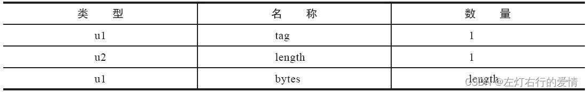  
 length值说明了这个UTF-8编码的字符串长度是多少字节，它后面紧跟的长度为length字节的连续数据是一个使用UTF-8缩略编码表示的字符串。  
 本例中字符串的length值为0x001D，长29字节。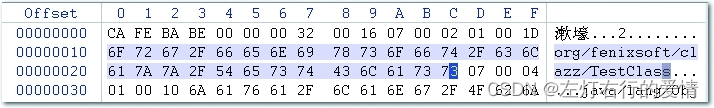  
 这里我们就分析两个，未提到的其余19个常量都可以通过类似方法逐一计算出来，当然这是反人性的，所以我们要借助计算机软件来帮忙完成。

#### 反编译软件

首先用javac将类名.java文件编译为类名.class文件

然后使用到Java内置的一个反编译工具Javap可以反编译文件，用法：javap  
 其中，选项包括

```
-help  --help  -?        输出此用法消息
  -version                 版本信息
  -v  -verbose             输出附加信息
  -l                       输出行号和本地变量表
  -public                  仅显示公共类和成员
  -protected               显示受保护的/公共类和成员
  -package                 显示程序包/受保护的/公共类
                           和成员 (默认)
  -p  -private             显示所有类和成员
  -c                       对代码进行反汇编
  -s                       输出内部类型签名
  -sysinfo                 显示正在处理的类的
                           系统信息 (路径, 大小, 日期, MD5 散列)
  -constants               显示最终常量
  -classpath <path>        指定查找用户类文件的位置
  -cp <path>               指定查找用户类文件的位置
  -bootclasspath <path>    覆盖引导类文件的位置


```

输入javap -verbose -p 类名.class查看输出内容  
 代码如下：

```
public class demo3 {
    private int m;

    public int inc(){
        return m+1;
    }
}


```

反编译之后：

```
E:\JVMDEMO\src\main\java\demo2>javap -verbose -p demo3.class
Classfile /E:/JVMDEMO/src/main/java/demo2/demo3.class
  Last modified 2022年11月28日; size 273 bytes
  MD5 checksum d3ccae49421ef0f0ee107ec9d74ee214
  Compiled from "demo3.java"
public class demo2.demo3
  minor version: 0
  major version: 55
  flags: (0x0021) ACC_PUBLIC, ACC_SUPER
  this_class: #3                          // demo2/demo3
  super_class: #4                         // java/lang/Object
  interfaces: 0, fields: 1, methods: 2, attributes: 1
Constant pool:
   #1 = Methodref          #4.#15         // java/lang/Object."<init>":()V
   #2 = Fieldref           #3.#16         // demo2/demo3.m:I
   #3 = Class              #17            // demo2/demo3
   #4 = Class              #18            // java/lang/Object
   #5 = Utf8               m
   #6 = Utf8               I
   #7 = Utf8               <init>
   #8 = Utf8               ()V
   #9 = Utf8               Code
  #10 = Utf8               LineNumberTable
  #11 = Utf8               inc
  #12 = Utf8               ()I
  #13 = Utf8               SourceFile
  #14 = Utf8               demo3.java
  #15 = NameAndType        #7:#8          // "<init>":()V
  #16 = NameAndType        #5:#6          // m:I
  #17 = Utf8               demo2/demo3
  #18 = Utf8               java/lang/Object
{
  private int m;
    descriptor: I
    flags: (0x0002) ACC_PRIVATE

  public demo2.demo3();
    descriptor: ()V
    flags: (0x0001) ACC_PUBLIC
    Code:
      stack=1, locals=1, args_size=1
         0: aload_0
         1: invokespecial #1                  // Method java/lang/Object."<init>":()V
         4: return
      LineNumberTable:
        line 3: 0

  public int inc();
    descriptor: ()I
    flags: (0x0001) ACC_PUBLIC
    Code:
      stack=2, locals=1, args_size=1
         0: aload_0
         1: getfield      #2                  // Field m:I
         4: iconst_1
         5: iadd
         6: ireturn
      LineNumberTable:
        line 7: 0
}
SourceFile: "demo3.java"


```

#### 访问标志

在常量池结束之后，紧接着2个字节代表访问标志（access\_flags），这个标志用于识别一些类或者接口层次的访问信息，包括：这个Class是类还是接口；是否定义为public类型；如果是类的话，是否被声明为
final 
等等。  
 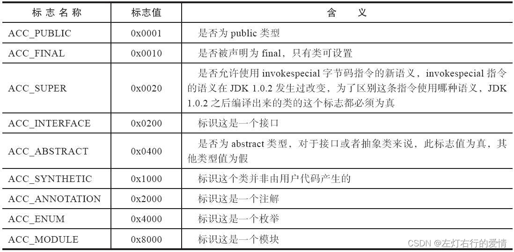  
 access\_flags中一共有16个标志位可以使用，当前只定义了其中9个，没有使用到的标志位一律为0.  
 举个栗子：  
 有一个类如下：

```
public class demo3 {
    private int m;

    public int inc(){
        return m+1;
    }
}


```

demo3是一个普通的类，不是接口、枚举、注解或者模块，被public关键字修饰但没有被声明为final和abstract，并且它使用了JDK 1.2之后的编译器进行编译，因此它的ACC\_PUBLIC、ACC\_SUPER标志应当为真，而ACC\_FINAL、ACC\_INTERFACE、ACC\_ABSTRACT、ACC\_SYNTHETIC、ACC\_ANNOTATION、ACC\_ENUM、ACC\_MODULE这七个标志应当为假，因此它的access\_flags的值应为：0x0001|0x0020=0x0021。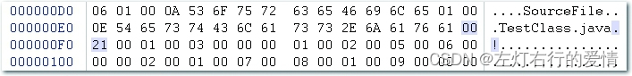

#### 类索引，父类索引与接口索引集合

* 类索引（this\_class）和父类索引（super\_class）  
   这两个都是一个u2类型的数据，而接口索引集合（interfaces）是一组u2类型的数据的集合，Class文件中由这三项数据来确定该类型的继承关系。  
   类索引引用于确定这个类的全限定名；  
   父类索引用于确定这个类的父类的全限定名。  
   由于Java语言不允许多重继承，所以父类索引只有一个，出来Java.lang.Object 之外，所有的Java类都有父类，因此除了Java.lang.Object 外，所有Java类的父类索引都不为0。
* 接口索引集合  
   用来描述这个类实现了哪些接口，这些被实现的接口将按implements关键字（如果这个Class文件表示的是一个接口，则应当是extends关键字）后的接口顺序从左到右排列在接口索引集合中。

类索引，父类索引，接口索引集合都按顺序排列在访问标志之后。  
 类索引和父类索引引用两个u2类型的索引值标识，它们各自指向一个类型为CONSTANT\_Class\_info的类描述符常量，通过CONSTANT\_Class\_info类型的常量中的索引值可以找到定义在CONSTANT\_Utf8\_info类型的常量中的全限名字符串。如下图所示：  
 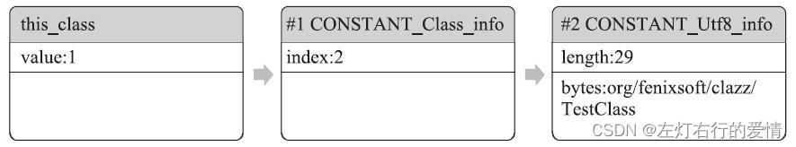  
 对于接口索引集合，入口第一项u2类型的数据为接口计数器（interfaces\_count），表示索引表的容量。  
 如果该类没有实现任何接口，则该计数器的值为0，后面接口的索引表不再占用任何字节。

我们综合上面举个栗子：  
 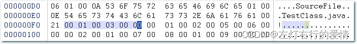  
 从偏移地址0x000000F1开始的3个u2类型的值分别为0x0001、0x0003、0x0000，分别代表了类索引为1，父类索引为3，接口索引大小为0.  
 那么给出常量池的内容，相信你可以找出对应的类和父类的常量了。

```
const #1 = class        #2;     //  org/fenixsoft/clazz/TestClass
const #2 = Asciz        org/fenixsoft/clazz/TestClass;
const #3 = class        #4;     //  java/lang/Object
const #4 = Asciz        java/lang/Object;


```

#### 字段表集合

字段表（field\_info）用于描述接口或者类中声明的变量。  
 Java语言中的“字段”包括：类级变量，实例级变量，但不包含方法内部声明的局部变量。  
 字段包含的修饰符有：  
 作用域（public，private，protected），  
 实例变量还是类变量（static），  
 可变性（final），  
 并发可见性（volatile，是否强制从主
内存读写
），  
 可否被序列化（transient），  
 字段数据类型（基本类型，对象，数组），  
 字段名称。

上述这些信息，各个修饰符都是布尔值，要么有某个修饰符，要么没有，很适合用标志位来表示，而字段叫做什么名字，字段被定义为什么数据类型，这些都是无法固定，只能引用常量池中的常量来描述。

我们来看一下字段表的结构：  
 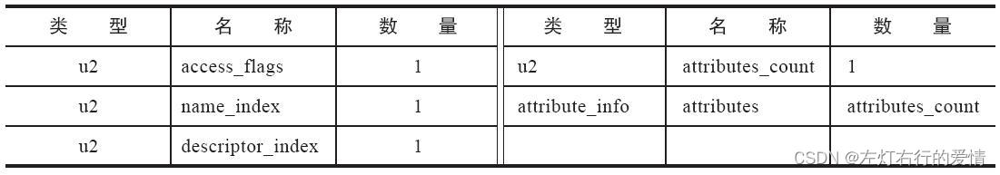  
 字段修饰符放在access\_flags项目中，它与类中的access\_flags项目是非常类似的，都是一个u2的数据类型，其中可以设置的标志位和含义如下图所示：  
 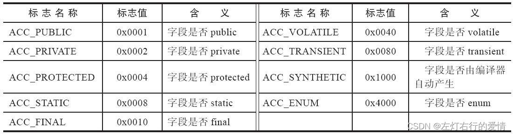  
 很明显，由于语法规则的约束：

* ACC\_PUBLIC、ACC\_PRIVATE、ACC\_PROTECTED三个只能选一个。
* ACC\_FINAL、ACC\_VOLATILE不能同时选择
* 接口之中的字段必须有ACC\_PUBLIC、ACC\_STATIC、ACC\_FINAL  
   这些都是由Java本身的语言规则所导致的。

跟随access\_flags标志的是两项索引值：name\_index和descriptor\_index。  
 它们都是对常量池项的引用，分别代表着字段的简单名称以及字段和方法的描述符。

我们来解释一下前面提到的“简单名称”，“描述符”，“全限定名”这三个字符串的概念：  
 以一串代码为例：`org/fenixsoft/clazz/TestClass`  
 是这个类的全限定名，仅仅把类全名的"."替换成了“/”而已。  
 简单名称则就是指没有类型和参数修饰的方法或者字段名称，比如类中的inc方法和m字段的简单名称就是inc，m。

相比于全限定名和简单名称，方法和字段的描述符就要复杂一点。

描述符的作用是用来描述字段的数据类型，方法的参数列表（包括数量，类型以及顺序）和返回值。根据描述符的规则，基本数据类型（byte，char，double，float，int，long，short，boolean）以及代表无返回值的void类型都用一个大写字符来表示，而对象类型则用字符L加对象的全限定名来表示，如下图：  
 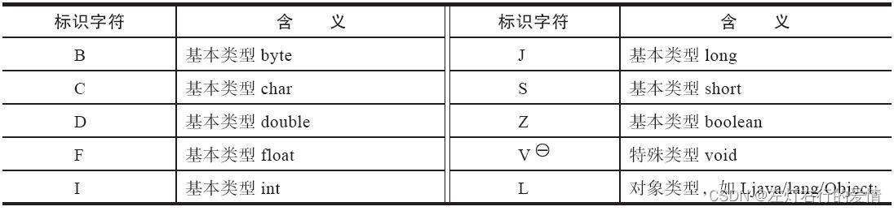  
 对于数组类型，每一维度将使用一个前置"["字符来描述，如定义为“java.lang.
String 
[][]”类型的二维数组将会被记录为：“[[Ljava/lang/String”；一个整形数组“int[]”将被记录为“[I”。

用描述符描述方法时，按照先参数列表，后返回值的顺序描述，参数列表按照参数的严格顺序放在一组小括号“（）”之内。  
 比如void inc()描述符为“()V”;  
 方法java.lang.String toString()的描述符为“()Ljava/lang/String”;  
 难一点的例子，方法int indexOf(char[]source，int sourceOffset，int sourceCount，char[]target，int targetOffset，int targetCount，int fromIndex)的描述符为“([CII[CIII)I”。

#### 方法表集合

Class文件存储格式中对方法的描述与对字段的描述采用了几乎完全一致的方式，方法表的结构如同字段表一样，依次包括访问标志（access\_flags），名称索引（name\_index）,描述符索引（descriptor\_index），属性表集合（attributes）几项，如下图所示：  
 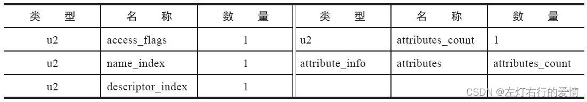  
 因为volatile 和transient关键字不能修饰方法，所以方法表的访问标志中没有了ACC\_VOLATILE标志和ACC\_TRANSIENT标志。  
 与之相对，synchronized、native、strictfp和abstract关键字可以修饰方法，方法表中也对应增加了ACC\_SYNCHRONIZED、ACC\_NATIVE、ACC\_STRICTFP和ACC\_ABSTRACT标志。  
 如下图：  
 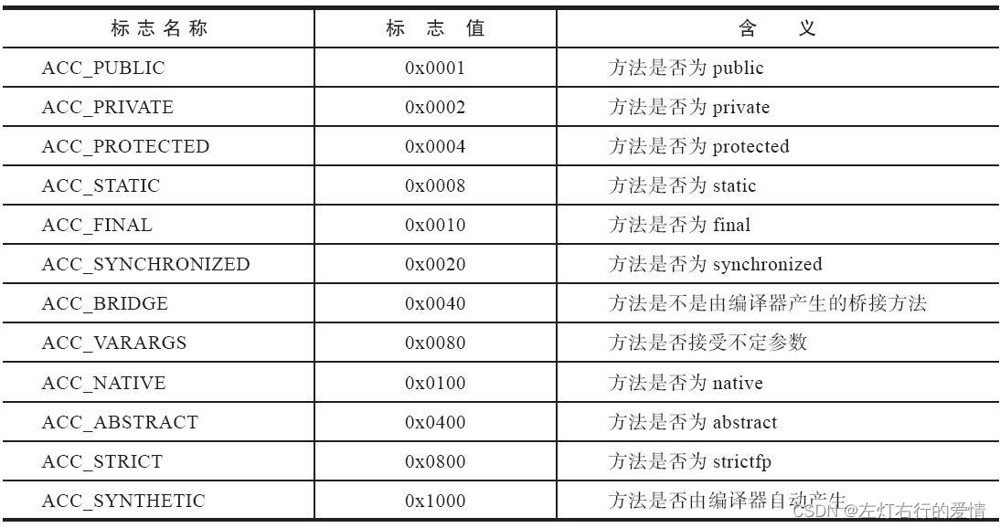  
 不知道你是不是有这样疑问：方法的定义可以通过访问标志，名称索引，描述符索引来表达清楚，但是方法里面的代码去哪里了？

答：方法里的代码，经过Javac编译器编译成字节码指令后，存放在方法属性表集合中一个名为“Code”的属性里面，属性表后面会聊到。这里给个图看一下：  
 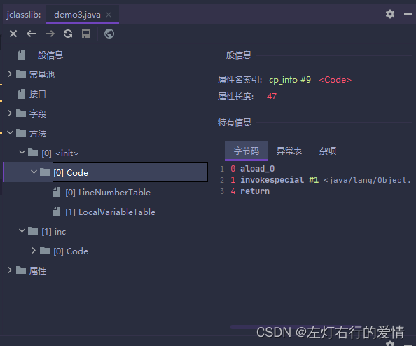  
 我们以之前一共Class文件为例，对方法表集合进行分析。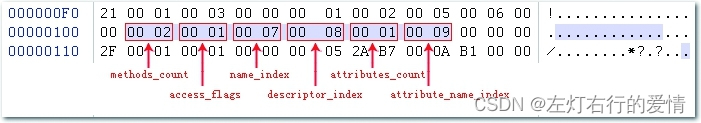  
 方法表集合入口地址为0x00000101：  
 第一个u2类型的数据（即计数器容量）的值为0x0002，代表集合有两个方法这两个方法为编译器添加的实例构造器和源码定义的方法inc()；  
 第一个方法的访问标志值为0x0001，也就是ACC\_PUBLIC标志位真，  
 名称索引值为0x0007，查常量池得方法名为“”，  
 描述符索引值为0x0008，对应常量为“()V”，  
 属性表计数器attributes\_count的值为0x0001，表示方法的属性表集合有1项属性，  
 属性名称的索引值为0x0009，对应常量为“Code”，说明此属性是方法的字节码描述。  
 与字段表集合相对应地，如果父类方法在子类中没有被重写（Override），方法表集合中就不会出现来自父类的方法信息。  
 有可能会出现由编译器自动添加的方法，最常见的便是类构造器“()”方法和实例构造器"()"方法。

在Java语言中，要重载（Overload）一个方法，除了要与原方法具有相同的简单名称之外，还要求必须拥有一个与原方法不同的特征签名。  
 特征签名是指一个方法中各个参数在常量池中的字段符号引用的集合，也正是因为返回值不会包含在特征签名中，所以Java语言是无法仅仅依靠返回值的不同来对一个已有方法进行重载的。  
 在Class文件格式中，特征签名的范围明显更大一些，只要描述符不是完全一致的两个方法就可以共存。也就是说，如果两个方法有相同的名称和特征签名，但返回值不同，那么也是可以合法共存于同一个Class文件中的。

#### 属性表集合

Class文件，字段表，方法表都可以携带自己的属性表集合，以描述某些场景专有的信息。  
 与Class文件中其他的数据项目要求严格的顺序，长度和内容不同，属性表集合的限制稍微宽松一些，不再要求各个属性表具有严格顺序，并且《JVM规范》允许只要不与已有的属性名重复，任何人实现的编译器都可以向属性表里面写入自定义属性信息，JVM运行时会忽略它不认识的属性。  
 下图简单看一看：  
 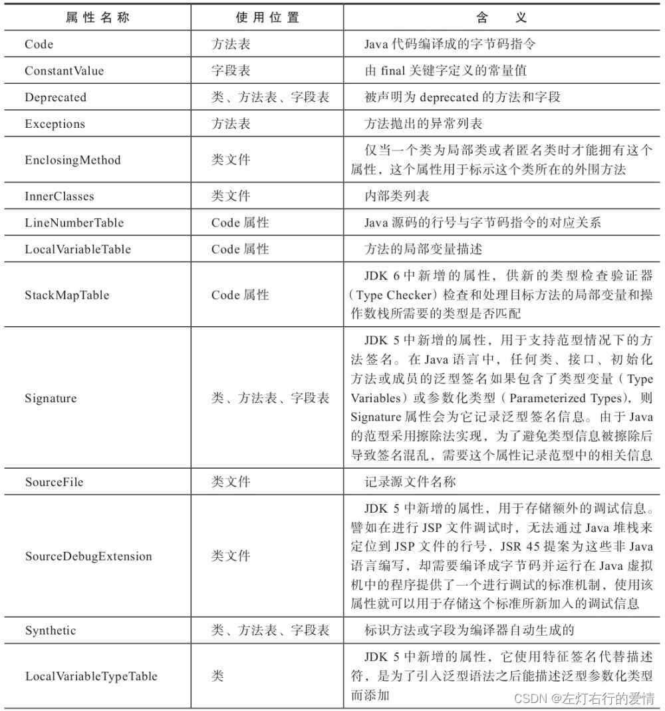  
 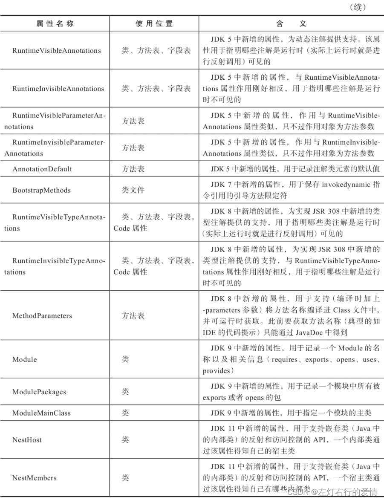  
 对于每一个属性，它的名称都要从常量池中引用一个CONSTANT\_Utf8\_info类型的常量来表示，而属性值的结构则是完全自定义的，只需要通过一个u4的长度属性去说明属性值所占用的位数即可。  
 应该满足下图的结构：  
 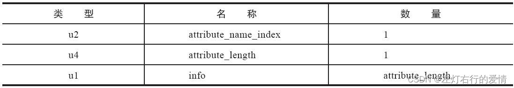

##### Code属性

Java程序方法体里面的代码经过Javac编译器处理之后，最终变为字节码指令存储在Code属性内。  
 Code属性出现在方法表的属性集合之中，但并非所有的方法表都必须存在这个属性（比如接口，抽象类中方法就不存在Code属性），Code属性的结构如下表所示：  
 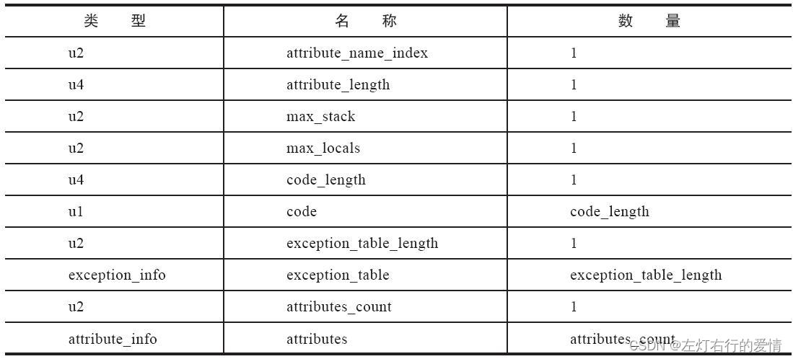

##### attribute\_name\_index

是一项指向CONSTANT\_Utf8\_info型常量的索引，此常量固定为“Code”，代表了该属性的属性名称。  
 ######attribute\_length  
 指向了属性值的长度，由于属性名称索引与属性长度一共为6个字节，所以属性值的长度固定为整个属性表长度-6个字节。

##### max\_stack

代表了操作数栈（Operand Stack）深度的最大值，JVM运行时需要根据这个值来分配栈帧（Stack Frame）中的操作栈深度。

##### max\_locals

代表了局部变量表所需的存储空间。在这里，max\_locals的单位是变量槽（Slot），下面简单介绍一下变量槽：

---

**变量槽**  
 变量槽是JVM为局部变量分配内存所使用的最小单位。  
 数据类型占用变量槽位：  
 对于byte、char、float、int、short、boolean和returnAddress等长度不超过32位的数据类型，每个局部变量占用一个变量槽，而double和long这两种64位的数据类型则需要两个变量槽来存放。  
 哪些局部变量类型存放变量槽：  
 方法参数（包括实例方法中的隐藏参数“this”）  
 显示异常处理程序的参数（Exception Handler Parameter，就是try-catch语句中catch块中定义的异常）  
 方法体重定义的局部变量  
 这些都需要依赖局部变量表来存放。  
 注意，并不是在方法中用了多少个局部变量，就把这些局部变量所占变量槽数量之和作为max\_locals的值！操作数栈和局部变量表直接决定一个该方法的栈帧所耗费的内存，**不必要的操作数栈深度和变量槽数量会造成内存浪费**。  
 JVM的做法是：将局部变量表中的变量槽进行重用，**当代码执行超出一个局部变量的作用域时**，这个局部变量所占的变量槽可以被其他局部变量所使用，Javac编译器会根据变量的作用域来分配变量槽给各个变量使用，根据同时生存的最大局部变量数量和类型来计算出max\_locals的大小。

---

##### code\_length和code

用来存储Java源程序编译后生成的字节码指令。code\_length代表字节码长度，code用于存储字节码指令的一系列字节流。

字节码指令，顾名思义就是每一个指令就是一个u1类型的单字节，当JVM读取到code中的一个字节码时，就可以对应找出这个字节码代表的是什么指令，并且可以知道这条指令后面是否需要跟随参数，以及后续的参数应当如何解析。

code\_length虽然是一个u4类型长度值，但是实际只使用了u2的长度，如果超过这个限制，Javac编译器就会拒绝编译。

Code属性是Class文件中最重要的一个属性，如果把一个Java程序中的信息分为代码（Code，方法体里面的代码）和元数据（Metadata，包括类，字段，方法定义及其他信息）两部分，那么整个Class文件里，Code属性是用于描述代码，所有其他数据项目都用于描述元数据。  
 我们依旧那demo3.class文件举例：  
 代码如下：

```
public class demo3 {
    private int m;

    public int inc(){
        return m+1;
    }
}


```

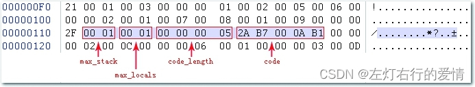  
 上图可知，它的操作数栈最大深度和本地变量表容量都为0x0001  
 字节码区域所占区域为0x0005.  
 JVM读取到字节码区域的长度后，按照顺序依次读入紧随的5个字节，并根据字节码指令表翻译出所对应的字节码指令。  
 翻译“2A B7 000A B1”的过程：

* 读入2A，查表的0x2A对应的指令为aload\_0，这个指令的含义是将第0个变量槽中为reference类型的本地变量推送到操作数栈顶。
* 读入B7，查表的0xB7对应的指令为invokespecial，这条指令作用是以栈顶的reference类型的数据所指向的对象作为方法接受者，调用此对象的实例构造器方法，private方法或者它的父类的方法。这个方法有一个u2类型的参数说明具体调用哪一个方法，它指向常量池中一个CONSTANT\_Methodref\_info类型常量，即此方法的符号引用。
* 读入000A，这是invokespecial指令的参数，代表一个符号引用，查常量池得0x000A对应的常量为实例构造器“()”方法的符号引用
* 读入B1，查表的0xB1对应的指令为return，含义是方法的返回，并且返回值为void。这条指令执行后，当前方法正常结束。

这段字节码很短，但是我们可以看出它执行过程中的数据交换，方法调用等操作都是基于栈（操作数栈）的。  
 我们可以初步猜测，JVM执行字节码应该是基于栈的体系结构，但又发现与通常基于栈的指令集里都是无参数的又不太一样，某些指令（如invokespecial）后面还会带有参数，对于虚拟机字节码执行，我们后面详细说。

##### javap命令计算字节码指令的内容

原始Java代码：

```
public class TestClass {
    private int m;

    public int inc() {
        return m + 1;
    }
}


```

javap -verbose TestClass之后：

```
// 常量表部分的输出因版面原因这里省略掉
public org.fenixsoft.clazz.TestClass();
    Code:
        Stack=1, Locals=1, Args_size=1
        0:   aload_0
        1:   invokespecial   #10; //Method java/lang/Object."<init>":()V
        4:   return
    LineNumberTable:
        line 3: 0

    LocalVariableTable:
        Start  Length  Slot  Name    Signature
        0      5       0     this    Lorg/fenixsoft/clazz/TestClass;

public int inc();
    Code:
        Stack=2, Locals=1, Args_size=1
        0:   aload_0
        1:   getfield        #18; //Field m:I
        4:   iconst_1
        5:   iadd
        6:   ireturn
    LineNumberTable:
        line 8: 0

    LocalVariableTable:
        Start  Length  Slot  Name    Signature
        0      7       0     this    Lorg/fenixsoft/clazz/TestClass;


```

##### Args\_size为什么为1？

如果你注意到了“Args\_size”的值，可能会有疑问：  
 这个类有两个方法——实例构造器()和inc()，这两个方法很明显都是没有参数的，为什么Args\_size会为1？  
 而且无论是参数列表还是方法体内，都没有定义任何局部变量，那Locals又为什么等于1？  
 答：我们忽略了一条Java语言里面的潜规则：在任何实例方法里面，都可以通过“this”关键字访问到此方法所属的对象。它的实现方式很简单，仅仅是通过在javac编译器编译的时候把对this关键字的访问转变为对一个普通方法参数的访问，然后虚拟机调用实例方法时自动传入此参数而已。因此在实例方法的局部变量表中至少会存在一个指向当前对象实例的局部变量，局部变量表中也会预留出第一个变量槽位来存放对象实例的引用，所以实例方法参数值从1开始计算。（这个处理仅对实例方法有效，如果代码为inc()方法被声明了static，那么Args\_size就不会等于1而是等于0了）

##### 异常表

在字节码指令之后的是这个方法的显示异常处理表（简称“异常表”），异常表对于Code属性来说并不是必须存在的，如果存在异常表，格式如下图所示：  
 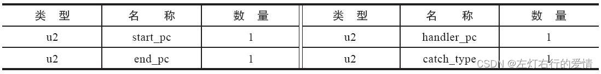  
 如果字节码从第start\_pc行到end\_pc行之间（不含end\_pc行，左闭右开）出现了类型为catch\_type或者其子类的异常（catch\_type为指向一个CONSTANT\_Class\_info 型常量的所以你），则转到第handler\_pc行继续处理。当catch\_type的值为0时，代表任意异常情况都需要转到handler\_pc处进行处理。

异常表是Java代码的一部分，尽管字节码中最初为处理异常设计的有跳转指令，但是《JVM规范》中明确要求Java语言的编译器应当选择使用异常表而不是通过跳转指令来实现Java异常及finally处理机制。

我们展示一个异常表如何运作的例子：  
 源码：

```
public int inc() {
    int x;
    try {
        x = 1;
        return x;
    } catch (Exception e) {
        x = 2;
        return x;
    } finally {
        x = 3;
    }
}


```

编译后的ByteCode字节码及异常表：

```
public int inc();
    Code:
        Stack=1, Locals=5, Args_size=1
        0:   iconst_1           // try块中的x=1
        1:   istore_1
        2:   iload_1    // 保存x到returnValue中，此时x=1
        3:   istore  4
        5:   iconst_3   // finaly块中的x=3
        6:   istore_1
        7:   iload   4  // 将returnValue中的值放到栈顶，准备给ireturn返回
        9:   ireturn
        10:  astore_2   // 给catch中定义的Exception e赋值，存储在变量槽 2中
        11:  iconst_2   // catch块中的x=2
        12:  istore_1
        13:  iload_1    // 保存x到returnValue中，此时x=2
        14:  istore  4
        16:  iconst_3   // finaly块中的x=3
        17:  istore_1
        18:  iload 4    // 将returnValue中的值放到栈顶，准备给ireturn返回
        20:  ireturn
        21:  astore_3   // 如果出现了不属于java.lang.Exception及其子类的异常才会走到这里
        22:  iconst_3   // finaly块中的x=3
        23:  istore_1
        24:  aload_3    // 将异常放置到栈顶，并抛出
        25:  athrow
    Exception table:
    from   to  target type
        0     5    10   Class java/lang/Exception
        0     5    21   any
        10    16   21   any


```

编译器为这段Java源码生成了三段异常表记录，对应三条可能出现的代码执行路径。从Java代码语义上讲，这三条执行路径分别为：

* 如果try语句块中出现属于Exception或者子类的异常，转到catch语句块处理；
* 如果try语句块中出现不属于Exception或其子类的异常，转到finally语句块处理
* 如果catch语句块中出现任何异常，转到finally语句块处理。  
   我们从字节码上看看：  
   字节码0-4行所做的操作：将整数1赋值给变量x，并且将此时的x的值复制一份副本到最后一个本地变量槽中（这个变量槽里面的值在ireturn指令执行前将会被重新读到操作栈顶，作为方法返回值使用。这里成为returnValue）。

如果没出现一次，则会继续走第5-9行：将变量x赋值为3，然后将之前保存在returnValue中的整数1读入到操作栈顶，最后ireturn指令会以int形式返回操作栈顶中的值，方法结束。

如果出现了异常，PC寄存器指针转到第10行，第10-20行所做的事情就是将2赋值给变量x，然后将变量x此时的值赋给returnValue，最后再将变量x的值改为3。方法返回前同样将returnValue中的整数2读到操作栈顶。

从21行开始的代码，作用是将变量x的值赋值为3，并将栈顶的异常抛出，方法结束。

我们继续看Code属性表里面没说完的属性，注意下面说的不是异常表的内容，而是Code属性。

##### Exception属性

列举出方法中可能抛出的受查异常，也就是方法描述时在throws关键字后面列举的异常，结构如下：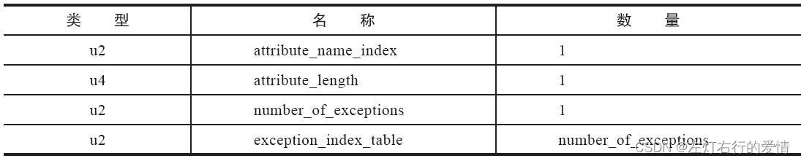  
 此属性中number\_of\_exceptions项表示方法可能抛出number\_of\_exceptions种受查异常，每一种受查异常使用一个exception\_index\_table项表示；  
 exception\_index\_table是一个指向常量池中的CONSTANT\_Class\_info型常量的索引，代表了该受查异常的类型。

##### LineNumberTable属性

用于描述Java源码行号与字节码行号（字节码的偏移量）之间的对应关系。  
 结构属性如下图：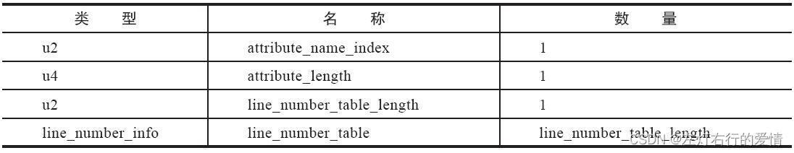  
 line\_number\_table是一个数量为line\_number\_table\_length，类型为line\_number\_info 的集合；  
 line\_number\_info表包含start\_pc和line\_number两个u2类型的数据项，前者是字节码行号，后者是Java源码行号。  
 它并不是运行时必需的属性，但默认会生成到Class文件之中，可以在Javac中使用-g：none或-g：lines选项来取消或要求生成这项信息。

##### LocalVariable以及LocalVariableTypeTable属性

LocalVariableTable属性用于描述栈帧中局部变量表的变量与Java源码中定义的变量之间的关系，它也不是运行时必需的属性，但默认会生成到Class文件中。  
 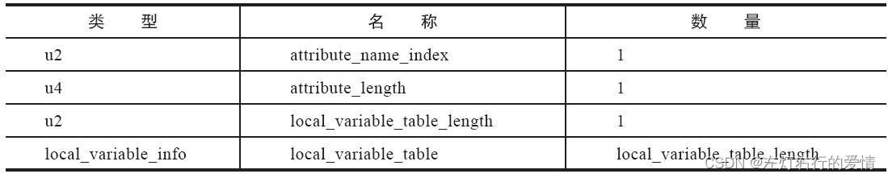  
 可以在Javac中使用-g：none或-g：vars选项来取消或要求生成这项信息。  
 如果没有生成这项属性，最大的影响就是当其他人引用这个方法时，所有的参数名称都将会丢失，譬如IDE将会使用arg0，arg1之类的占位符代替原有的参数名，这对程序运行没有影响，但是会对代码编写带来较大不便，而且在调试期间无法根据参数名称从上下文获得参数值。

其中local\_variable\_info项目代表了一个栈帧与源码中的局部变量的关联，结构如下所示：  
 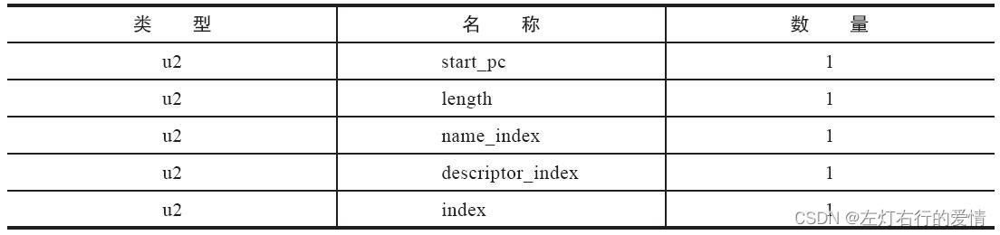  
 start\_pc：局部变量的生命周期开始的字节码偏移量  
 length:其作用范围覆盖的长度  
 上面两者结合起来就是这个局部变量在字节码之中的作用域范围。  
 name\_index，descriptor\_index：都是指向了常量池中CONSTANT\_Utf8\_info 型常量的索引，分别代表了局部变量的名称以及这个局部变量的描述符。  
 index：局部变量在栈帧的局部变量表中变量槽的位置。

在JDK5引入泛型之后，LocalVariableTable属性增加了一个姐妹属性——LocalVariableTypeTable。这个新增属性结构与LocalVariableTable非常相似，仅仅是把记录字段描述符的descriptor\_index替换成了字段的特征签名（Signature）。对于非泛型类型来说，描述符和特征签名能描述的信息是能吻合一致的，但是泛型引入之后，**由于描述符中泛型的参数化类型被擦除掉 ，描述符就不能准确描述泛型类型了**。因此出现了LocalVariableTypeTable属性，使用字段的特征签名来完成泛型的描述。

##### SourceFile属性

用于记录生成这个Class文件的源码文件名称。

##### ConstantValue属性

通知JVM自动为静态变量赋值。只有被Static关键字修饰的变量（类变量）从可以使用这项数量。  
 属性结构如下：  
 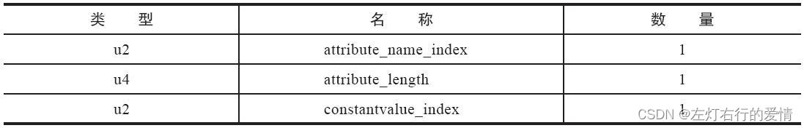  
 ConstantValue属性是一个定长属性，它的attribute\_length数据项值必须固定为2.  
 constantvalue\_index数据项代表了常量池中一个字面量常量的引用，根据字段类型的不同，字面量可以是：  
 CONSTANT\_Long\_info,  
 CONSTANT\_Float\_info,  
 CONSTANT\_Double\_info,  
 CONSTANT\_Integer\_info,  
 CONSTANT\_String\_info常量中的一种。

类似“int x=123”和“static int x=123”这样的变量定义在Java程序里面是非常常见的事情，但JVM对这两种变量赋值的方式和时刻都有所不同。  
 对非static类型的变量（也就是实例变量）的赋值是在实例构造器()方法中进行的；  
 而对static变量，则有两种方式可以选择：  
 在类构造器()方法中或者使用ConstantValue属性。

##### innerClasses属性

记录内部类与宿主类之间的关联。如果一个类中定义了 内部类，那编译器将会为它以及它所包含的内部类生成InnerClasses属性。  
 属性结构如下：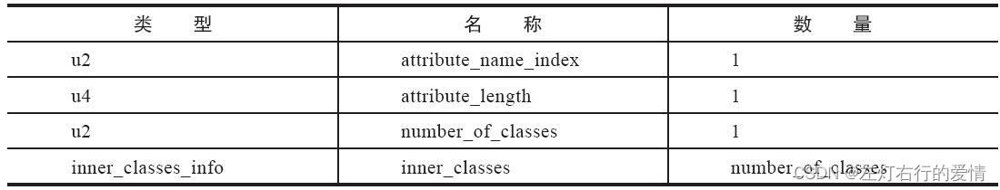  
 数据项number\_of\_classes代表需要记录多少个内部类信息，每一个内部类的信息都由一个inner\_classes\_info表进行表述。  
 inner\_classes\_info表的结构如下图所示：  
 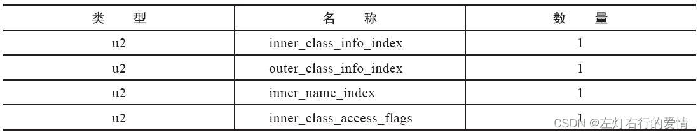  
 inner\_class\_info\_index和outer\_class\_info\_index都是指向常量池中CONSTANT\_Class\_info型常量的索引，分别代表了内部类和宿主类的符号引用。  
 inner\_name\_index是指向常量池中CONSTANT\_Utf8\_info型常量的索引，代表这个内部类的名称，如果是匿名内部类，值为0。  
 inner\_class\_access\_flags是内部类的访问标志，类似于类的access\_flags，它的取值范围如下表：  
 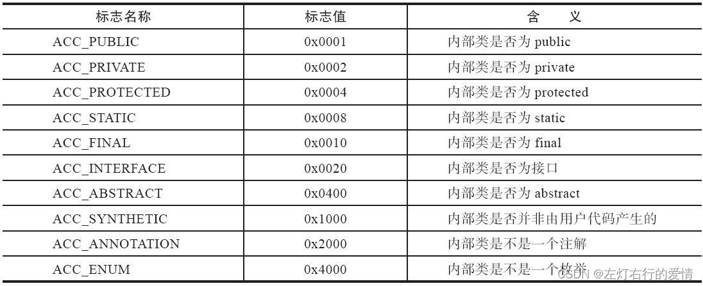

##### Deprecated及Synthetic属性

Deprecated和Synthetic两个属性属于标志类型的布尔属性，只存在有和没有的区别，没有属性值的概念。  
 Deprecated属性用于表示某个类，字段或者方法，已经被程序作者定位不再推荐使用。  
 Synthetic属性代表此字段或者方法不是由Java源码直接产生的，而是由编译器自行添加的。  
 它们的结构如下：  
 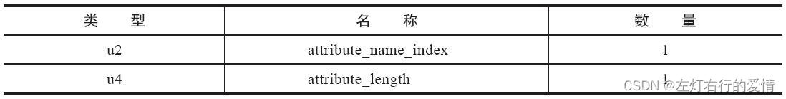

##### StackMapTable属性

在JVM加载字节码验证阶段被新类型检查验证器（Type Checker）使用，目的在于代替以前比较消耗性能的基于数据流分析的类型推导验证器。

##### Signature属性

记录泛型的签名信息。  
 之所以要专门使用这样一个属性去记录泛型类型，是因为Java语言的泛型采用的是擦除法实现的伪泛型，字节码（Code属性）中所有的泛型信息编译（类型编译，参数化类型）在编译之后都通通被擦除掉。  
 属性结构如下表：  
   
 Signature\_index项的值必须是一个对常量池的有效索引。  
 常量池在该索引处的项是CONSTANT\_Utf8\_info结构，表示类签名或方法类型签名或字段类型签名。  
 如果当前的Signature属性是类文件的属性，则这个结构表示类签名；  
 如果当前的Signature属性是方法表的属性，则这个结构表示方法类型签名；如果当前Signature属性是字段表的属性，则这个结构表示字段类型签名。

* MethodParameters属性  
   作用是记录方法的各个形参名称和信息。  
   结构如下：  
   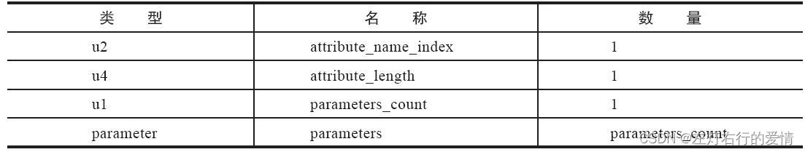  
   其中，引用到的parameter结构如下表：  
     
   name\_index是一个指向常量池CONSTANT\_Utf8\_info常量的索引值，代表了该参数的名称。  
   access\_flags是参数的状态指示器，它可以包含以下三种状态中的一种或多种：  
   ·0x0010（ACC\_FINAL）：表示该参数被final修饰。

·0x1000（ACC\_SYNTHETIC）：表示该参数并未出现在源文件中，是编译器自动生成的。

·0x8000（ACC\_MANDATED）：表示该参数是在源文件中隐式定义的。Java语言中的典型场景是this关键字。

## 总结

Class类文件结构真的值得去好好体会一下，里面有些内容太深不明白就没总结上去，有能力去看一些书和博客进行补充，上面的内容校招面试来说应该说是问题不大了。  
 后面如果有面试题的话我会进行扩展补充的。
