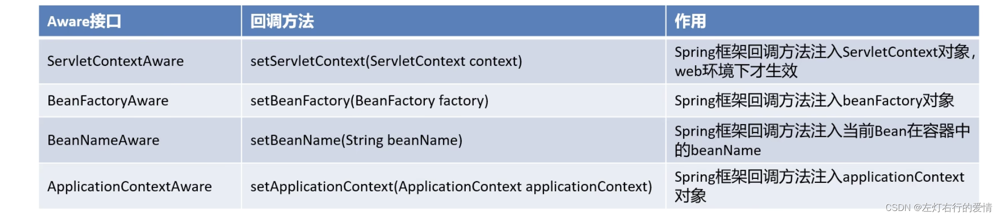

> 原文：[CSDN](https://blog.csdn.net/qq_45852626/article/details/129347485)（历史文章导入，当前状态为草稿）

## 前言

普通的Bean 不需要主动获取 Spring 容器的引用，也不需要调用容器的 API.

但是实际开发的时候，我们经常要用到Spring容器本身的功能资源，所以Spring容器中的Bean需要有主动获取Spring容器的引用和全局信息的能力.  
 我们可以通过Spring提供的一系列接口Spring Aware来实现具体的功能。

Aware翻译过来：“感知”，如果是XxxAware也就是对…感知的。

## 举例说明

### 普通Bean(无感知,低耦合)

```
// 这是 Spring Boot 源码中的典型例子
  @Component
  public class MyComponent {
      // 看！没有导入任何 Spring 容器相关的类
      // 只用了 @Component 注解（这是元数据，不是运行时依赖）

      private final SomeService service;

      // 构造函数注入 - Spring 帮你注入，但你不需要知道"谁"注入的
      public MyComponent(SomeService service) {
          this.service = service;
      }

      public void doWork() {
          service.execute();
          // 完全不需要知道 Spring 容器的存在
          // 不需要调用 context.getBean()
          // 不需要知道自己是被 Spring 管理的
      }
  }


```

关键点：

* Bean 在容器里
* Spring 会注入依赖
* 但 Bean 的代码里没有容器的 API 调用（这才是"无感知"的真正含义）

### 需要主动访问容器的 Bean（有感知）

```
// 如果你需要"主动获取容器中的信息"
  public class AdvancedComponent implements ApplicationContextAware {

      private ApplicationContext context;  // 持有容器引用

      @Override
      public void setApplicationContext(ApplicationContext context) {
          this.context = context;  // Spring 注入容器本身
      }

      public void doAdvancedWork() {
          // 主动调用容器 API 获取信息
          String[] beanNames = context.getBeanDefinitionNames();
          Environment env = context.getEnvironment();
          context.publishEvent(new CustomEvent());

          // 这就是"感知容器"的意思
      }
  }


```

### 对比表格

| 维度 | 普通 Bean（无感知） | Aware Bean（有感知） |
| --- | --- | --- |
| 是否在容器中？ | 是 | 是 |
| Spring 是否注入依赖？ | 是 | 是 |
| 代码中是否调用容器 API？ | 否 | 是 |
| 是否持有容器引用？ | 否 | 是 |
| 能否主动获取容器信息？ | 否 | 是 |
| 可移植性 | 高（可换容器） | 低（绑定 Spring） |

---

### 基本内容

Aware接口是一种框架辅助属性注入的一种思想，其他框架中  
 瞧一眼源码：

```
/**
 * Marker superinterface indicating that a bean is eligible to be
 * notified by the Spring container of a particular framework object
 * through a callback-style method. Actual method signature is
 * determined by individual subinterfaces, but should typically
 * consist of just one void-returning method that accepts a single
 * argument.
 *
 * <p>Note that merely implementing {@link Aware} provides no default
 * functionality. Rather, processing must be done explicitly, for example
 * in a {@link org.springframework.beans.factory.config.BeanPostProcessor BeanPostProcessor}.
 * Refer to {@link org.springframework.context.support.ApplicationContextAwareProcessor}
 * and {@link org.springframework.beans.factory.support.AbstractAutowireCapableBeanFactory}
 * for examples of processing {@code *Aware} interface callbacks.
 *
 * @author Chris Beams
 * @since 3.1
 */
public interface Aware {

}


```

我们可以看到，Aware是一个具有标识作用的超级接口，实现该接口的Bean都具有被Spring容器通知的能力。  
 而被通知的方式就是通过回调.

**简单来说：直接或者间接实现了这个接口的类，都具有被Spring容器通知的能力。**

Aware接口是回调，监听器和观察者设计模式的混合，它表示bean有资格通过回调方式被Spring容器通知。  
 有时我们的在Bean的初始化中使用Spring框架自身的一些对象来执行一些操作，比如：

* 获取ServletContext的一些参数。
* 获取ApplicationContext中的BeanDefinition的名字。
* 获取Bean在容器中的名字等等。

这些接口均继承自`org.springframework.beans.factory.Aware`标记接口，并提供一个将由Bean实现的Set方法，Spring通过基于Setter的依赖注入方式使相应的对象可以被Bean使用。  
 常见的Aware接口：  
 

### 例子

以BeanNameAware为例：  
 BeanNameAware：使对象能够知道容器中定义的bean名称。

```
public class MyBeanName implements BeanNameAware {
   @Override
   public void setBeanName(String beanName){
     System.out.println(beanName);
    }
}


```

在Spring配置
类 
中注册这种类型的bean:

```
@Configuration
public class Config{
  @Bean(name="WangBeanName")
  public MyBeanName getMyBeanName(){
  return new MyBeanName();
}

}


```

启动应用程序上下文并从中获取bean:

```
AnnotationConfigApplicationContext context = new AnnotationConfigApplicationContext(Config.class);
MyBeanName myBeanName = context.getBean(MyBeanName.class); 


```

从控制台可以看到，setBeanName方法打印出来了"WangBeanName"。  
 若从@Bean注解中删除name =“…”代码，则在这种情况下，将getMyBeanName()方法名称分配给bean，所以输出将是“getMyBeanName”。

### 结尾

对于这个接口我觉得说这么多就好，其实重点在于它的设计模式，后面写到设计模式的时候我再把它拿回来说。
