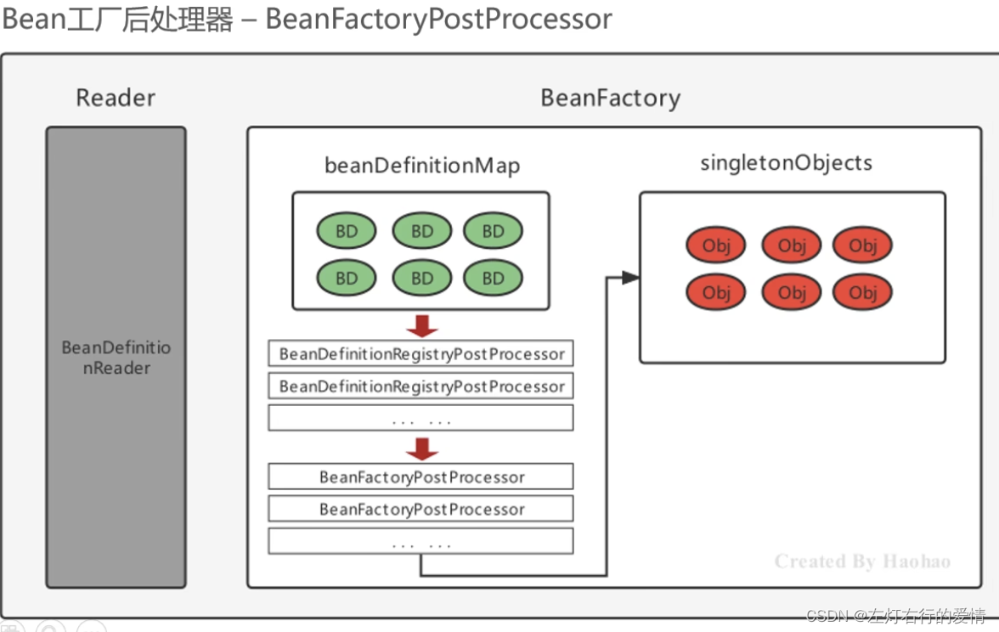
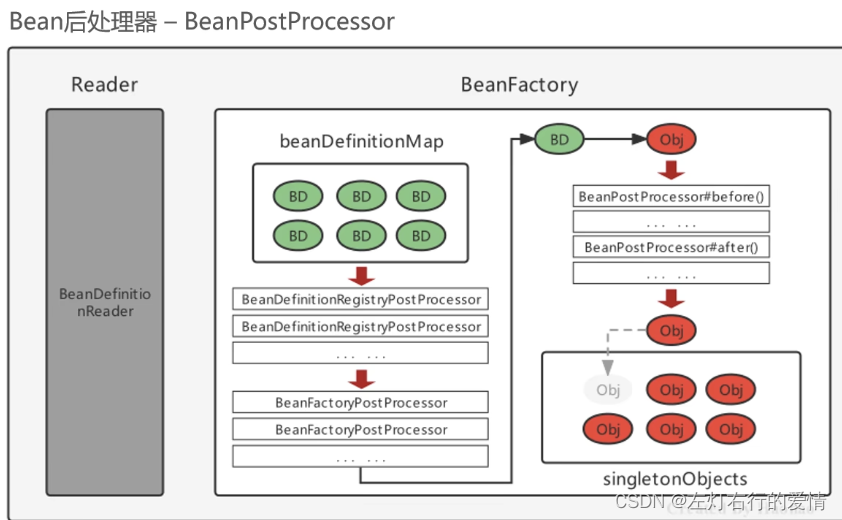

> 原文：[CSDN](https://blog.csdn.net/qq_45852626/article/details/129154666)（历史文章导入，当前状态为草稿）

#### 后置处理器
## 前言

Spring的后处理器是Spring对外开发的重要扩展点，允许我们介入到Bean的整个实例化流程中来，以达到动态注册BeanDefinition，动态修改BeanDefinition，以及动态修改Bean的作用。  
 如果你不太清楚BeanDefinition是干嘛的，推进你看看我写的另外一篇文章，相信可以帮助到你：[Spring核心模块解析—BeanDifinition。](https://blog.csdn.net/qq_45852626/article/details/128748042)

### Spring的后处理器

Sping的后处理器是Spring对外开发的重要扩展点，允许我们介入到Bean的整个实例化流程中来，以达到动态注册BeanDefinition，以及动态修改Bean的作用，那么Spring主要有两种后处理器，下面我们分别进行介绍他们的基本概念和业务场景。希望你可以更好的理解。

### BeanFactoryPostProcessor（工厂后处理器）

#### 执行节点

在BeanDefinitDefinitionMap填充完毕，Bean实例化之前执行。

#### 作用

1.允许我们在**Spring容器加载Bean定义之后**，对Bean定义进行修改，从而影响到容器中实际实例化的Bean。  
 2.主要用途是应用程序上下文准备就绪前，修改或添加Bean定义。  
 3.也可以用来执行自定义的Bean验证或Bean初始化逻辑。

#### 基本信息

beanFactoryPostProcessor是一个接口规范，实现了该接口的
类 
只要交由Spring容器管理的话，那么Spring就会回调该接口的方法，用于对**BeanDefinition注册和修改的功能**。

```
@FunctionalInterface
public interface BeanFactoryPostProcessor {

	void postProcessBeanFactory(ConfigurableListableBeanFactory beanFactory) throws BeansException;

}


```

我们先来关注一下接口里面方法的参数：`ConfigurableListableBeanFactory`  
 本质来说，这个参数其实是BeanFacotry的子接口，我们看一下这层关系：

```
public interface ConfigurableListableBeanFactory
		extends ListableBeanFactory, AutowireCapableBeanFactory, ConfigurableBeanFactory 


```

然后进入到`ListableBeanFactory`中：

```
public interface ListableBeanFactory extends BeanFactory 


```

#### 经典场景

业务场景：配置文件中的占位符替换为实际值的情况。比如将配置文件中的数据库连接URL，用户名和密码等信息替换为实际的值。  
 经典用途是用它实现属性占位符的解析，通过实现`BeanFactoryPostProcessor`接口并重写`postProcessBeanFactory()`，我们使用Spring的占位符解析机制（如${…}）来解析Bean定义中的属性占位符，并将其替换为实际的属性值。  
 下面我们来介绍一下代码实现：  
 1.首先在Spring配置文件中定义`PropertyPlaceholderConfigurer`实例，用来解析占位符。

```
<bean class="org.springframework.beans.factory.config.PropertyPlaceholderConfigurer">
   <property name="location" value="classpath:jdbc.properties"/>
</bean>


```

上面的配置中，`PropertyPlaceholderConfigurer`实例用于解析`jdbc.properties`文件中的占位符。  
 2.实现一个`BeanFactoryPostProcessor`接口的实现类，用于在应用程序上下文准备就绪之前替换Bean定义中的占位符，例如：

```
public class PropertyPlaceholderReplacer implements BeanFactoryPostProcessor {
    
    @Override
    public void postProcessBeanFactory(ConfigurableListableBeanFactory beanFactory) throws BeansException {
        // 获取名为 "org.springframework.beans.factory.config.PropertyPlaceholderConfigurer#0" 的 PropertyPlaceholderConfigurer 对象
        // 该对象用于解析配置文件中的占位符，并将解析后的值设置回相应的 Bean 定义中
        PropertyPlaceholderConfigurer configurer = (PropertyPlaceholderConfigurer)beanFactory.getBean("org.springframework.beans.factory.config.PropertyPlaceholderConfigurer#0");
        
        // 获取所有的 Bean 名称
        String[] beanNames = beanFactory.getBeanDefinitionNames();
        for (String beanName : beanNames) {
            // 获取 Bean 的定义
            BeanDefinition beanDefinition = beanFactory.getBeanDefinition(beanName);
            // 获取 Bean 的属性值
            MutablePropertyValues propertyValues = beanDefinition.getPropertyValues();
            PropertyValue[] propertyValueArray = propertyValues.getPropertyValues();
            for (PropertyValue propertyValue : propertyValueArray) {
                Object value = propertyValue.getValue();
                // 如果属性值是一个字符串类型，那么就将其转换为实际的值
                if (value instanceof String) {
                    // 调用 PropertyPlaceholderConfigurer 的 convertPropertyValue() 方法将占位符解析为实际的值
                    Object convertedValue = configurer.convertPropertyValue((String) value);
                    // 将转换后的值设置回属性值中
                    propertyValue.setConvertedValue(convertedValue);
                }
            }
        }
    }
}


```

3.最后在Spring配置文件中注册`PropertyPlaceholderReplacer`实例，让它参与应用程序上下文创建过程：

```
<bean class="com.example.PropertyPlaceholderReplacer"/>


```

Spring容器启动时，`PropertyPlaceholderReplacer`实例会被创建并自动调用`postProcessBeanFactory`方法，在此方法中实现占位符的解析，然后将解析后的实际值设置回相应的`Bean`定义中。这样，应用程序中的占位符就会被正确地替换为实际的值。

#### 子接口——BeanDefinitiRegistryPostProcessor

##### 基本介绍

它是Spring框架的一个扩展点，用于对Bean定义的注册过程进行干预和定制。  
 继承`BeanFactoryPostProcessor`接口，并在其基础上扩展了一个新的方法，即：`postProcessBeanDefinitionRegistry()`方法。

##### 用途

在Spring容器初始化时，首先会读取应用程序中的配置文件，并解析出所有的Bean定义，然后将这些Bean定义注册到容器中。  
 在这个过程中，`BeanDefinitionRegistryProcessor`提供了一种机制，允许开发人员在Bean定义注册之前和之后对Bean定义进行自定义处理，例如添加，修改或删除Bean定义等。

##### 具体原理

具体来说，`BeanDefinitionRegistryPostProcessor`提供了以下两个方法：

1. `postProcessBeanDefinitionRegistry(BeanDefinitionRegistry registry)`：该方法在所有**Bean定义加载完成之后，Bean实例化之前被调用**，允许开发人员对Bean定义进行自定义修改，例如添加，修改或删除Bean定义等。
2. `postProcessBeanFactory(ConfigurableListableBeanFactory beanFactory)`: 该方法是继承自`BeanFactoryPostProcessor`接口的方法，用于在**BeanFactory完成实例化之后**对BeanFactory进行后置处理。  
    那么我们通过`BeanDefinitionRegistryPostProcessor`接口，开发人员可以在Spring容器启动时干预Bean的注册过程，从而实现对Bean的自定义处理。  
    例如：  
    可以通过该接口来动态注册Bean定义，从而实现基于注解或者其他方式的自动发现和注册Bean。  
    同时，该接口也提供了一种扩展点，允许开发人员在Bean定义注册之后再进行后置处理，例如对Bean的属性进行统一设置，验证等操作。

##### 例子——注册BeanDefinition

`BeanDefinitionRegistryPostProcessor`接口主要用于注册和修改`BeanDefinition`。  
 在`postProcessBeanDefinitionRegistry()`方法中，开发人员可以通过`BeanDefinitionRegistry`对象注册新的`BeanDefinition`，例如：

```
import org.springframework.beans.BeansException;
import org.springframework.beans.factory.config.BeanDefinition;
import org.springframework.beans.factory.config.BeanDefinitionHolder;
import org.springframework.beans.factory.config.ConfigurableListableBeanFactory;
import org.springframework.beans.factory.support.BeanDefinitionRegistry;
import org.springframework.beans.factory.support.BeanDefinitionRegistryPostProcessor;
import org.springframework.beans.factory.support.RootBeanDefinition;

/**
 * 自定义的BeanDefinitionRegistryPostProcessor
 */
public class MyBeanDefinitionRegistryPostProcessor implements BeanDefinitionRegistryPostProcessor {

    /**
     * 重写BeanDefinitionRegistryPostProcessor的postProcessBeanDefinitionRegistry方法
     */
    @Override
    public void postProcessBeanDefinitionRegistry(BeanDefinitionRegistry registry) throws BeansException {
        // 创建一个RootBeanDefinition实例，该实例对应的BeanClass是MyBean
        RootBeanDefinition beanDefinition = new RootBeanDefinition(MyBean.class);
        // 向BeanDefinitionRegistry注册MyBean的BeanDefinition
        registry.registerBeanDefinition("myBean", beanDefinition);
    }

    /**
     * 重写BeanDefinitionRegistryPostProcessor的postProcessBeanFactory方法
     */
    @Override
    public void postProcessBeanFactory(ConfigurableListableBeanFactory beanFactory) throws BeansException {
        // do nothing
    }

    /**
     * 自定义的Bean
     */
    public static class MyBean {
        private String message = "Hello, World!";

        public String getMessage() {
            return message;
        }

        public void setMessage(String message) {
            this.message = message;
        }
    }
}


```

在应用程序的Spring配置文件中，我们可以通过下面的方式来注册`MyBeanDefinitionRegistryPostProcessor`

```
<bean class="com.example.MyBeanDefinitionRegistryPostProcessor"/>


```

在容器启动时，Spring会自动检测到`MyBeanDefinitionRegistryPostProcessor`并将其实例化和注册到容器中。在容器启动完成后，我们的`myBean`就可以在容器中被其他的Bean所依赖和使用了。

后面针对这个执行顺序，我们引用一个图来说明，相信看到这你就明白啦：  
 你以为到这就结束啦吗？咱们No，再来一个Demo收尾！

##### 使用Spring的BeanFactoryPostProcessor扩展点完成自定义注解扫描

——todo晚上回宿舍补上

### BeanPostPrecessor (后处理器）

Bean实例化之后，到最终缓存到名为singletonObjects的单例池之前，中间会经过Bean的初始化过程。例如：属性的填充，初始化init的执行等，其中有一个对外进行扩展的点BeanPostProcessor，它允许在Bean的初始化流程中插入自定义的逻辑。我们称之为BeanPostProcessor，会在流程节点上被Spring自动调用。

##### 基本原理

它定义了两个方法：  
 `postProcessBeforeInitialization(Object bean, String beanName)`：在 Bean 初始化之前调用。  
 `postProcessAfterInitialization(Object bean, String beanName)`：在 Bean 初始化之后调用。

我们可以通过实现`BeanPostProcessor`接口，并将其注册到Spring容器中，来实现对Bean初始化过程的控制和定制。  
 在这两个方法中，我们可以根据需要对Bean进行一些自定义操作，例如：修改属性值，注入依赖，动态代理等等。

在 Spring 容器启动的过程：  
 1.当一个 Bean 被实例化后，Spring 容器会按照一定的顺序调用注册在容器中的所有 `BeanPostProcessor` 实现的`postProcessBeforeInitialization` 方法，  
 2.然后调用 Bean 的 init 方法，最后再按照相反的顺序调用所有 `BeanPostProcessor` 实现的 `postProcessAfterInitialization` 方法。  
 这个过程中，`BeanPostProcessor` 扮演着一个监听器的角色，允许开发人员在 Bean 初始化的过程中干预和修改 Bean 的行为，从而实现对 Spring 容器的定制和扩展。

##### 运用的场景

* 日志记录：  
   可以使用BeanPostProcessor来实现在Bean实例化后、初始化前后打印日志，从而实现记录Bean生命周期的目的。
* 数据库连接管理：  
   可以使用BeanPostProcessor来在Bean实例化后、初始化前后获取并设置数据库连接，从而实现数据库连接的管理和复用。
* 安全检查：  
   可以使用BeanPostProcessor来实现在Bean实例化后、初始化前后对Bean的属性进行安全检查，例如检查是否有不安全的属性或敏感的数据，从而保证系统的安全性。
* AOP（面向切面编程）：  
   可以使用BeanPostProcessor来在Bean实例化后、初始化前后进行动态代理，从而实现AOP编程，例如实现事务控制、日志记录等功能。
* 自定义注解：  
   可以使用BeanPostProcessor来实现在Bean实例化后、初始化前后扫描并解析自定义注解，从而实现自定义注解的功能。例如，可以在Bean实例化后、初始化前后，扫描并解析所有的@MyAnnotation注解，并根据注解的内容进行相应的操作。

##### 经典例子——时间日志增强

要求：

* Bean的方法执行之前控制台打印当前时间。
* Bean的方法执行之后控制台打印当前时间。  
   分析：
* 对方法进行增强主要是代理设计模式和包装设计模式
* 由于Bean方法不确定，所以使用动态代理在运行期间执行增强操作
* 在Bean实例创建完毕后，进入到单例池之前，使用Proxy代替真正的目标Bean。

——todo晚上回宿舍补上

最后梳理一下，如果你前面耐心看完，这张图不用多解释了，一看就明白了🫡：  
 

#### BeanFactoryPostProcessor&&BeanPostProcessor的不同点

`BeanFactoryPostProcessor`是Spring容器中用于在Bean定义加载到容器后、实例化之前对Bean的定义进行修改和扩展的扩展点。  
 它可以通过实现`BeanFactoryPostProcessor`接口来注册自己的处理逻辑，对所有的Bean定义进行修改和扩展，包括修改Bean的属性值、修改Bean的依赖关系、注册新的Bean定义等等。  
 通常情况下，我们可以使用`BeanFactoryPostProcessor`来实现一些与Bean定义相关的操作，例如通过解析外部配置文件动态修改Bean的属性值、实现Bean依赖的自动装配、注册新的Bean定义等等。

`BeanPostProcessor`是Spring容器中用于在Bean实例化后、初始化前后对Bean进行自定义处理的扩展点。  
 它可以通过实现`BeanPostProcessor`接口来注册自己的处理逻辑，对所有的Bean实例进行修改和扩展，包括修改Bean的属性值、动态代理Bean、实现AOP编程、记录日志等等。  
 通常情况下，我们可以使用`BeanPostProcessor`来实现一些与Bean实例相关的操作，例如实现Bean的自定义初始化逻辑、记录Bean的生命周期、实现Bean的动态代理等等。

### 结尾

这块知识，无论是学Bean的生命周期还是刷新逻辑都很重要，希望你可以学会，如果有哪些地方觉得总结的不好，欢迎留言。🙏
