> 原文：[CSDN](https://blog.csdn.net/qq_45852626/article/details/131230561)（历史文章导入，当前状态为草稿）

### 自定义资源权限规则

#### 资源分 类

对于资源来说，并不是所有的资源都需要认证和授权，有些公共的资源是可以直接访问的，所以我们要对资源有一个分类。  
 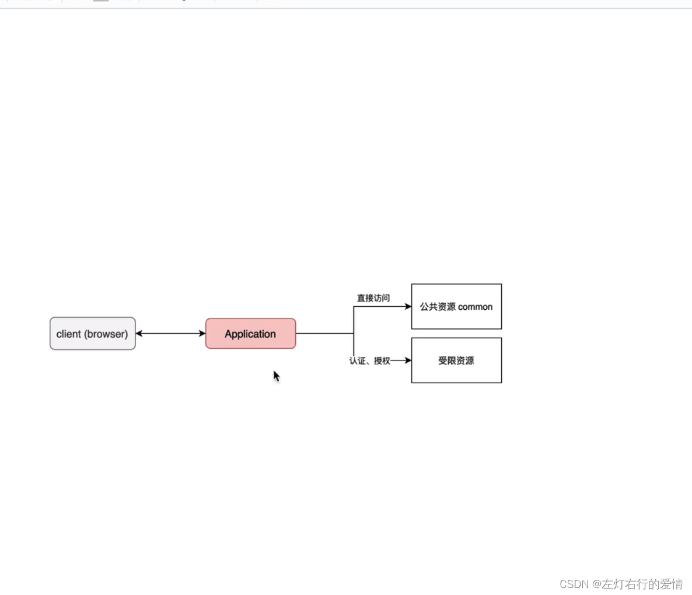

#### 自定义资源权限规则

##### 为什么我们要自定义呢？

我们举个例子来说：

* /index 公共资源
* /hello … 受保护资源  
   我们之前看过源码：

```
@Configuration(proxyBeanMethods = false)
	@ConditionalOnDefaultWebSecurity
	static class SecurityFilterChainConfiguration {

		@Bean
		@Order(SecurityProperties.BASIC_AUTH_ORDER)
		SecurityFilterChain defaultSecurityFilterChain(HttpSecurity http) throws Exception {
			http.authorizeRequests().anyRequest().authenticated();
			http.formLogin();
			http.httpBasic();
			return http.build();
		}

	}


```

上面表示了对所有的http请求都开启了权限认证，并且任何请求都需要认证后才可以访问。  
 所以如果我们要根据不同的资源去划分不同的认证方式， 我们就要覆盖上面这个方法。

##### 如何去覆盖呢？

看上面的注解：`@ConditionalOnDefaultWebSecurity`，找到里面的源码：

```
class DefaultWebSecurityCondition extends AllNestedConditions {

	DefaultWebSecurityCondition() {
		super(ConfigurationPhase.REGISTER_BEAN);
	}

	@ConditionalOnClass({ SecurityFilterChain.class, HttpSecurity.class })
	static class Classes {

	}

	@ConditionalOnMissingBean({
			org.springframework.security.config.annotation.web.configuration.WebSecurityConfigurerAdapter.class,
			SecurityFilterChain.class })
	@SuppressWarnings("deprecation")
	static class Beans {

	}

}


```

我们可以看到，要满足上面的两个注解条件：

* `@ConditionalOnClass({ SecurityFilterChain.class, HttpSecurity.class })`  
   那么只要我们引入了Spring Security这个依赖，这两个就自动满足了。
* `@ConditionalOnMissingBean({ WebSecurityConfigurerAdapter.class, SecurityFilterChain.class })`  
   同时不能存在 `WebSecurityConfigurerAdapter.class`或者 `SecurityFilterChain.class`。  
   如果不满足上面的条件，那么`DefaultWebSecurityCondition`就会失效。

所以就很明显了，我们有两种方式就是去写`WebSecurityConfigurerAdapter`或`SecurityFilterChain`，这里先去写WebSecurityConfigurerAdapter，后面再说另一种。

##### WebSecurityConfigurerAdapter

###### 它是干什么用的

WebSecurityConfigurerAdapter是Spring Security提供的一个**方便的基类**，用于配置和自定义Web应用程序的
安全性 
。**通过扩展WebSecurityConfigurerAdapter类并覆盖其方法**，您可以定义应用程序的安全规则、访问权限和身份验证配置。

WebSecurityConfigurerAdapter提供了一组可覆盖的方法，让我们进行以下配置：

* **身份验证**（Authentication）  
   可以通过覆盖`configure(AuthenticationManagerBuilder auth)`方法来配置用户身份验证的方式。可以定义自己的用户存储机制（如内存中的用户、数据库中的用户等），设置密码编码器，并配置用户的角色和权限。
* **授权**（Authorization）  
   可以通过覆盖configure(HttpSecurity http)方法来配置请求的授权规则。我们可以定义哪些URL路径需要哪些角色或权限才能访问，配置登录页面、注销行为、错误处理等。
* **安全性**（Security）  
   可以通过覆盖`configure(WebSecurity web)`方法来配置Web安全性。我们可以忽略某些URL路径的安全性检查，例如静态资源文件。

通过使用`WebSecurityConfigurerAdapter`，可以将
Spring Security 
集成到Web应用程序中，并定义细粒度的安全规则和配置。它提供了一种简单且灵活的方式来自定义应用程序的安全性需求。

这里我们看一个要被覆盖的configure方法去实现授权：

```
	protected void configure(HttpSecurity http) throws Exception {
		this.logger.debug("Using default configure(HttpSecurity). "
				+ "If subclassed this will potentially override subclass configure(HttpSecurity).");
		http.authorizeRequests((requests) -> requests.anyRequest().authenticated());
		http.formLogin();
		http.httpBasic();
	}


```

我们可以看到，它的默认实现也是所有请求都必须认证，认证方式是表单或者
Basic
认证。  
 所以，我们只需要写这个类的实现，并且覆盖这个方法就可以了。

###### 实例

新构建一个module模块，项目结构如下：  
 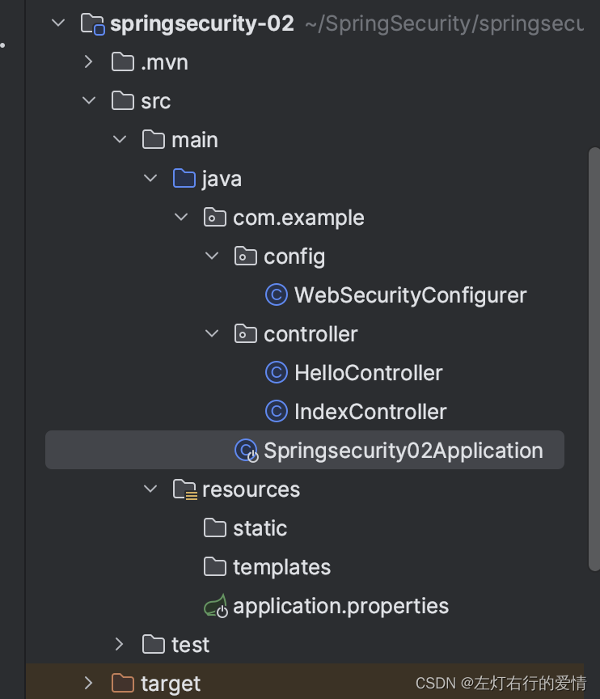  
 其中config包下的代码如下所示：

```
import org.springframework.context.annotation.Configuration;
import org.springframework.security.config.annotation.web.builders.HttpSecurity;
import org.springframework.security.config.annotation.web.configuration.WebSecurityConfigurerAdapter;

@Configuration
public class WebSecurityConfigurer extends WebSecurityConfigurerAdapter {

    @Override
     protected void configure(HttpSecurity http) throws Exception {
         http.authorizeRequests()
                 .mvcMatchers("/index").permitAll() //放行资源写在前面
                 .anyRequest().authenticated()
                 .and()
                 .formLogin();
     }


}


```

* permitAll() 代表放⾏该资源,该资源为公共资源 ⽆需认证和授权可以直接访问
* anyRequest().authenticated() 代表所有请求,必须认证之后才能访问
* formLogin() 代表开启表单认证

**注意：放⾏资源必须放在所有认证请求之前!**

### 自定义登录界面

#### 步骤

* 引入模版依赖

```
      <dependency>
            <groupId>org.springframework.boot</groupId>
            <artifactId>spring-boot-starter-thymeleaf</artifactId>
        </dependency>


```

* 定义登陆页面 controller

```
import org.springframework.stereotype.Controller;
import org.springframework.web.bind.annotation.RequestMapping;
@Controller
public class LoginController {

    @RequestMapping("/login.html")
    public String login(){
        return "login";
    }
}


```

* 在templates 中定义登陆页面

```
<!DOCTYPE html>
<html lang="en" xmlns:th="http://www.thymeleaf.org">
<head>
    <meta charset="UTF-8">
    <title>User Login</title>
</head>
<body>
<h1>User Login</h1>
<form method=th:action="">
    UserName：<input name="uname" type="text"><br>
    PassWord：<input name="passwd" type="text"><br>
    <input type="submit" value="Login">
</form>

</body>
</html>


```

##### 源码解析

如果按上面这么写的话，就会出问题，为什么呢？我们来看看formLogin里面的源码。

```
	public FormLoginConfigurer<HttpSecurity> formLogin() throws Exception {
		return getOrApply(new FormLoginConfigurer<>());
	}


```

进入到`getOrApply`方法参数中的`FormLoginConfigurer`里面去：

```
	public FormLoginConfigurer() {
		super(new UsernamePasswordAuthenticationFilter(), null);
		usernameParameter("username");
		passwordParameter("password");
	}


```

在这里里面我们发现了一个过滤器为`UsernamePasswordAuthenticationFilter`,进去看看,关键代码如下：

```
public class UsernamePasswordAuthenticationFilter extends AbstractAuthenticationProcessingFilter {

	public static final String SPRING_SECURITY_FORM_USERNAME_KEY = "username";

	public static final String SPRING_SECURITY_FORM_PASSWORD_KEY = "password";

	private static final AntPathRequestMatcher DEFAULT_ANT_PATH_REQUEST_MATCHER = new AntPathRequestMatcher("/login",
			"POST");

	private String usernameParameter = SPRING_SECURITY_FORM_USERNAME_KEY;

	private String passwordParameter = SPRING_SECURITY_FORM_PASSWORD_KEY;

	private boolean postOnly = true;

	public UsernamePasswordAuthenticationFilter() {
		super(DEFAULT_ANT_PATH_REQUEST_MATCHER);
	}

	public UsernamePasswordAuthenticationFilter(AuthenticationManager authenticationManager) {
		super(DEFAULT_ANT_PATH_REQUEST_MATCHER, authenticationManager);
	}
    //下面发现一个试图认证的方法。
	@Override
	public Authentication attemptAuthentication(HttpServletRequest request, HttpServletResponse response)
			throws AuthenticationException {
		//代码检查了请求的方法是否为POST，如果设置为仅接受POST请求并且当前请求不是POST方法，就会抛出一个AuthenticationServiceException异常，表示不支持该身份验证方法。
		if (this.postOnly && !request.getMethod().equals("POST")) {
			throw new AuthenticationServiceException("Authentication method not supported: " + request.getMethod());
		}
		//调用obtainUsername和obtainPassword方法从请求中获取用户名和密码。
		String username = obtainUsername(request);
		username = (username != null) ? username.trim() : "";
		String password = obtainPassword(request);
		password = (password != null) ? password : "";
		//使用获取到的用户名和密码创建一个UsernamePasswordAuthenticationToken对象，
		//该对象表示待验证的用户名和密码信息。这个对象被标记为未经验证状态。
		UsernamePasswordAuthenticationToken authRequest = UsernamePasswordAuthenticationToken.unauthenticated(username,
				password);
		// 调用setDetails方法，将请求的详细信息设置到UsernamePasswordAuthenticationToken对象中。
		setDetails(request, authRequest);
		//调用getAuthenticationManager方法获取AuthenticationManager对象，并使用该对象对UsernamePasswordAuthenticationToken对象进行身份验证。
		//注意：getAuthenticationManager方法是一个抽象方法，需要子类提供具体的实现。
		return this.getAuthenticationManager().authenticate(authRequest);
	}


```

`obtainUsername`和`obtainPassword`方法如下：

```
//obtainUsername方法用于从HTTP请求中获取用户名，由上面的代码我们可以知道，usernameParameter = SPRING_SECURITY_FORM_USERNAME_KEY = "username";
	protected String obtainUsername(HttpServletRequest request) {
		return request.getParameter(this.usernameParameter);
	}
	//同理。
		protected String obtainPassword(HttpServletRequest request) {
		return request.getParameter(this.passwordParameter);
	}


```

所以我们看过上面的源码后，在这里有四个要注意的点：

1. 登陆表单method必须为post。

```
if (this.postOnly && !request.getMethod().equals("POST")) {
			throw new AuthenticationServiceException("Authentication method not supported: " + request.getMethod());


```

2. action的请求路径为/login.

```
	private static final AntPathRequestMatcher DEFAULT_ANT_PATH_REQUEST_MATCHER = new AntPathRequestMatcher("/login",
			"POST");


```

3. 用户名的name属性为username

```
String username = obtainUsername(request);
username = (username != null) ? username.trim() : "";


```

4. 密码的name属性为password。

```
String password = obtainPassword(request);
password = (password != null) ? password : "";


```

* 配置 Spring Security 配置类

```
@Configuration
public class WebSecurityConfigurer extends WebSecurityConfigurerAdapter {

    @Override
     protected void configure(HttpSecurity http) throws Exception {
         http.authorizeRequests()
                 .mvcMatchers("/login.html").permitAll()
                 .mvcMatchers("/index").permitAll() //放行资源写在前面。
                 .anyRequest().authenticated()
                 .and()
                 .formLogin()
                 .loginPage("/login.html") //用来指定默认登陆页面，注意：一旦自定义登陆页面以后必须只能登陆URL。
                 .loginProcessingUrl("/doLogin")  //指定处理登陆请求URL。
                 .usernameParameter("uname"). //指定用户名的name属性
                 .passwordParameter("passwd") //指定密码的的name属性
                 //.successForwardUrl("/index") //认证成功， forward 跳转路径 始终在认证成功之后跳转到指定请求
                 //.defaultSuccessUrl("/index",true) //认证成功 redirect 之后跳转，根据上一保存请求进行成功跳转。
                 .and()
                 .csrf().disable(); //禁止csrf跨站请求保护。
     }

}
配置类有一些方法可以改变默认的配置，方法都有基本的解析，也不多赘述了。


```

* 最终login页面：

```
<!DOCTYPE html>
<html lang="en" xmlns:th="http://www.thymeleaf.org">
<head>
    <meta charset="UTF-8">
    <title>User Login</title>
</head>
<body>
<h1>User Login</h1>
<form method="post" th:action="@{/doLogin}">
    UserName：<input name="uname" type="text"><br>
    PassWord：<input name="passwd" type="text"><br>
    <input type="submit" value="Login">
</form>

</body>
</html>


```

#### 自定义登录成功处理（ 前后端分离 的情况）

##### 项目环境

当我们项目是前后端分离开发时，上面`WebSecurityConfigurer`配置的 `successForwardUrl`和`defaultSuccessUrl`就失去了作用，因为后端项目没有网页去进行跳转，我们是通过ajax给前端传递信息，SpringSecurity设计了`successHandler`来解决这个问题。

##### successHandler

我们来看看这个它的代码：

```
	public final T successHandler(AuthenticationSuccessHandler successHandler) {
		this.successHandler = successHandler;
		return getSelf();
	}


```

它接受一个`AuthenticationSuccessHandler`，那么我们来看看这个：  
 它的结构图如下：  
 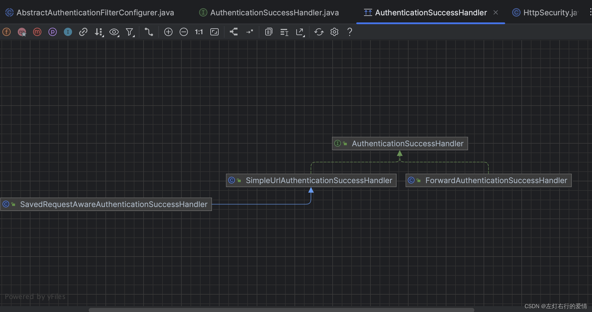  
 这里我们可以看到上面我们提到的`successForwardUrl`和`defaultSuccessUrl`分别是这里的`ForwardAuthenticationSuccessHandler`和`SavedRequestAwareAuthenticationSuccessHandler`。

```
public interface AuthenticationSuccessHandler {
	default void onAuthenticationSuccess(HttpServletRequest request, HttpServletResponse response, FilterChain chain,
			Authentication authentication) throws IOException, ServletException {
		onAuthenticationSuccess(request, response, authentication);
		chain.doFilter(request, response);
	}
	void onAuthenticationSuccess(HttpServletRequest request, HttpServletResponse response,
			Authentication authentication) throws IOException, ServletException;
}


```

这是一个接口类型，后面我们要写它的实现类，它的实现类默认是有3个，在上面的结构图里面都有介绍。  
 里面有两个默认方法：  
 第一个默认方法是处理一些特殊情况，这里我们先忽略就行。  
 第二个方法是提供了让我们实现类去实现的方法。

##### 自定义AuthenticationSucccessHandler实现

在前后端分离开发中不需要成功之后跳转⻚⾯。  
 只需要给前端返回⼀个 JSON 通知登录成功还是失败与否。这个时候可以通过⾃定义  
 `AuthenticationSucccessHandler`实现。

```
/**
* 自定义认证成功之后处理
*/
public class MyAuthenticatioinSuccessHandler implements AuthenticationSuccessHandler {
    @Override
    public void onAuthenticationSuccess(HttpServletRequest request, HttpServletResponse response, Authentication authentication) throws IOException, ServletException {
        Map<String,Object> result = new HashMap<>();
        result.put("msg","登陆成功");
        result.put("status",200);
        result.put("authentication", authentication);
        response.setContentType("application/json;charset=UTF-8");
        String s = new ObjectMapper().writeValueAsString(request);
        response.getWriter().println(s);
    }
}


```

##### 配置AuthenticationSuccessHandler

```
     protected void configure(HttpSecurity http) throws Exception {
         http.authorizeRequests()
                 .mvcMatchers("/login.html").permitAll()
                 .mvcMatchers("/index").permitAll() //放行资源写在前面。
                 .anyRequest().authenticated()
                 .and()
                 .formLogin()
                 .loginPage("/login.html") //用来指定默认登陆页面，注意：一旦自定义登陆页面以后必须只能登陆URL。
                 .loginProcessingUrl("/doLogin")  //指定处理登陆请求URL。
                 .usernameParameter("uname")
                 .passwordParameter("passwd")
                 .successHandler(new MyAuthenticatioinSuccessHandler()) //认证成功时处理，前后端分离解决方案。
                 .and()
                 .csrf().disable(); //禁止csrf跨站请求保护。
     }


```

#### 显示登录失败处理

首先我们在登陆页面输入错误的信息，然后再进入到`attemptAuthentication`中，如下图：  
 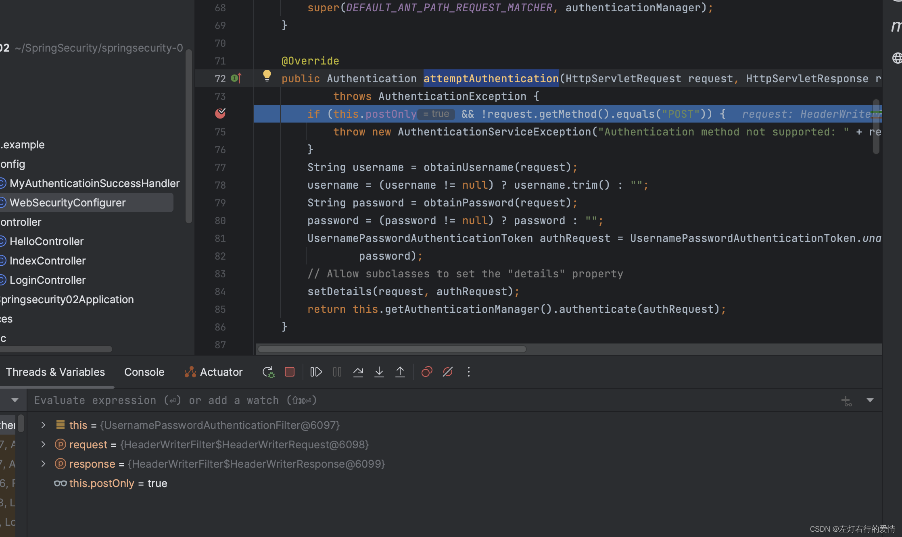  
 然后我们进入到最后一行代码里的`authenticate`方法：  
 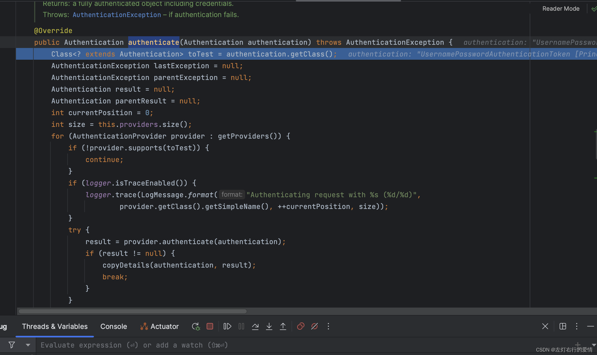  
 这个方法是在ProviderManager里面，上面有个变量：`private List<AuthenticationProvider> providers = Collections.emptyList();`  
 存储了AuthenticationProvider，那么在这里是存储了一个基于内存方式的一个认证`AnonymousAuthenticationProvider`  
 。  
 此时provider为：`AnonymousAuthenticationProvider`  
 解析一下这个方法：

```
public Authentication authenticate(Authentication authentication) throws AuthenticationException {
	// 获取待验证的Authentication对象的具体类
	Class<? extends Authentication> toTest = authentication.getClass();
	AuthenticationException lastException = null;
	AuthenticationException parentException = null;
	Authentication result = null;
	Authentication parentResult = null;
	int currentPosition = 0;
	int size = this.providers.size();
	
	// 遍历所有的AuthenticationProvider进行身份验证
	for (AuthenticationProvider provider : getProviders()) {
		// 检查当前Provider是否支持待验证的Authentication对象的类
		if (!provider.supports(toTest)) {
			continue;
		}
		// 输出日志，指示当前使用的AuthenticationProvider
		if (logger.isTraceEnabled()) {
			logger.trace(LogMessage.format("Authenticating request with %s (%d/%d)",
					provider.getClass().getSimpleName(), ++currentPosition, size));
		}
		try {
			// 调用Provider的authenticate方法进行身份验证
			result = provider.authenticate(authentication);
			if (result != null) {
				// 如果验证成功，将验证结果的详细信息复制到原始的Authentication对象中
				copyDetails(authentication, result);
				break;
			}
		}
		catch (AccountStatusException | InternalAuthenticationServiceException ex) {
			// 处理账户状态异常和内部认证服务异常
			prepareException(ex, authentication);
			// 如果身份验证失败是由于账户状态异常引起的，直接抛出异常，不再继续尝试其他Provider
			throw ex;
		}
		catch (AuthenticationException ex) {
			// 记录最后一个AuthenticationException，用于在没有找到合适的Provider时抛出异常
			lastException = ex;
		}
	}
	
	if (result == null && this.parent != null) {
		// 如果所有的Provider都无法验证通过，并且存在父级AuthenticationManager，则调用父级AuthenticationManager进行验证
		try {
			parentResult = this.parent.authenticate(authentication);
			result = parentResult;
		}
		catch (ProviderNotFoundException ex) {
			// 如果父级AuthenticationManager找不到合适的Provider，则忽略该异常，继续抛出下面的异常
		}
		catch (AuthenticationException ex) {
			// 记录父级AuthenticationManager抛出的异常
			parentException = ex;
			lastException = ex;
		}
	}
	
	if (result != null) {
		// 如果验证成功
		if (this.eraseCredentialsAfterAuthentication && (result instanceof CredentialsContainer)) {
			// 如果配置为在验证完成后擦除验证结果中的凭据信息，则执行擦除操作
			((CredentialsContainer) result).eraseCredentials();
		}
		// 如果父级AuthenticationManager存在并且验证成功，则父级AuthenticationManager会发布一个AuthenticationSuccessEvent事件。
		// 为避免重复发布事件，这里进行了检查。
		if (parentResult == null) {
			this.eventPublisher.publishAuthenticationSuccess(result);
		}
		return result;
	}
	
	// 如果所有的Provider都无法验证通过，抛出异常
	if (lastException == null) {
		lastException = new ProviderNotFoundException(this.messages.getMessage("ProviderManager.providerNotFound",
				new Object[] { toTest.getName() }, "No AuthenticationProvider found for {0}"));
	}
	// 如果父级AuthenticationManager存在并且验证失败，则父级AuthenticationManager会发布一个AbstractAuthenticationFailureEvent事件。
	// 为避免重复发布事件，这里进行了检查。
	if (parentException == null) {
		prepareException(lastException, authentication);
	}
	throw lastException;
}


```

我们debug流程走一遍，看看它如是如何存储失败的信息的。  
 进入到for循环里面：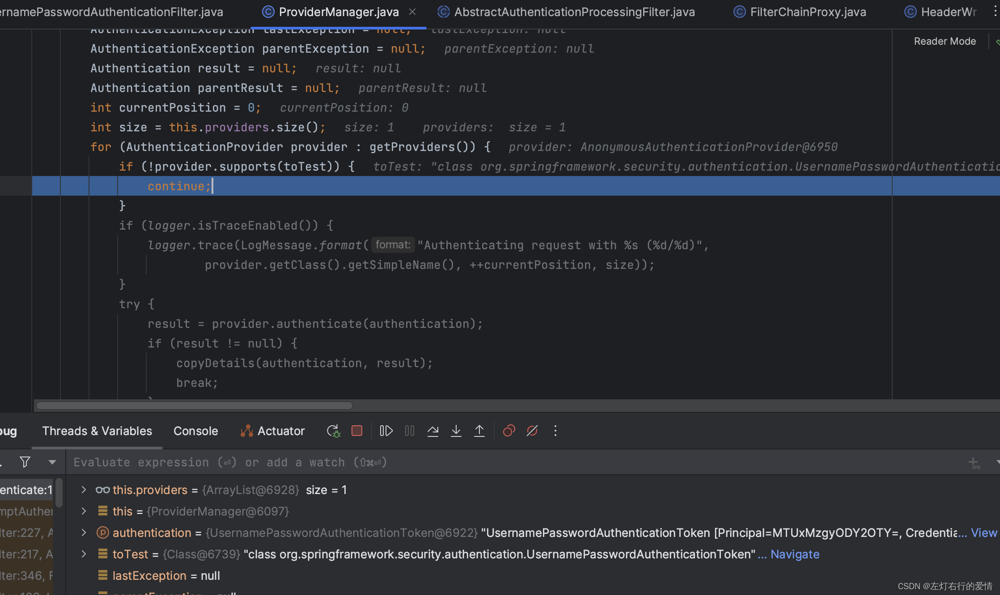  
 我们看到，唯一的`AuthenticationProvider`不支持待验证的Authentication对象的类，所以直接进入方法体里面执行
continue
。  
 然后因为只有一个，所以再次执行for循环时跳出for循环，执行下面的代码：  
 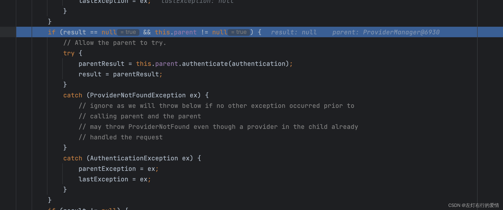  
 这个时候发现：所有的Provider在上面的for循环里都无法验证通过（因为执行continue了，根本没执行for循环里面的代码），并且存在父级`AuthenticationManager`，则调用父级`AuthenticationManager`进行验证。  
 接下来执行父级`AuthenticationManager`进行验证，依旧是走这个方法，注意下面的providers中只有`DaoAuthticationProvider`：  
 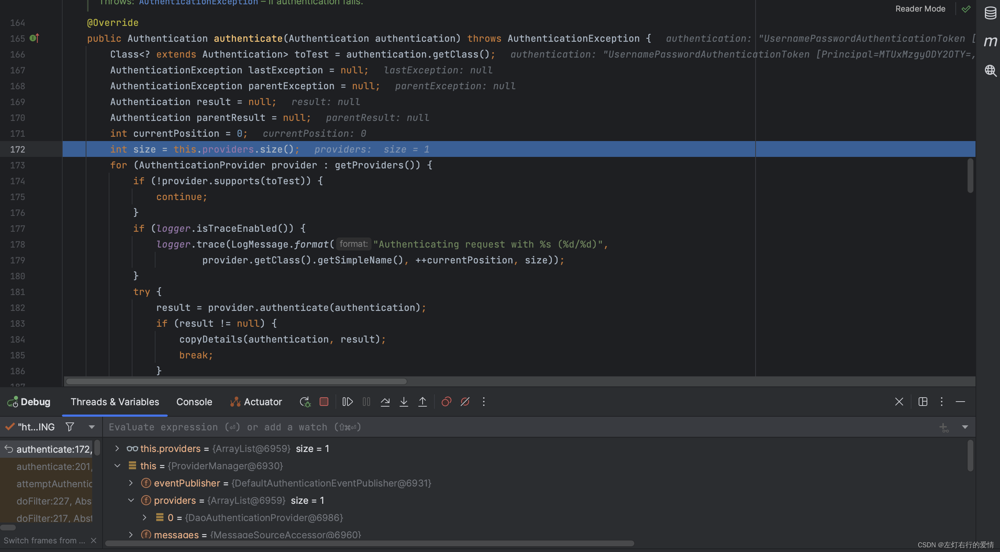  
 走到for循环的第一个if判断时，因为支持待验证的Authentication对象的类，所以不进去方法体，当走到下图时：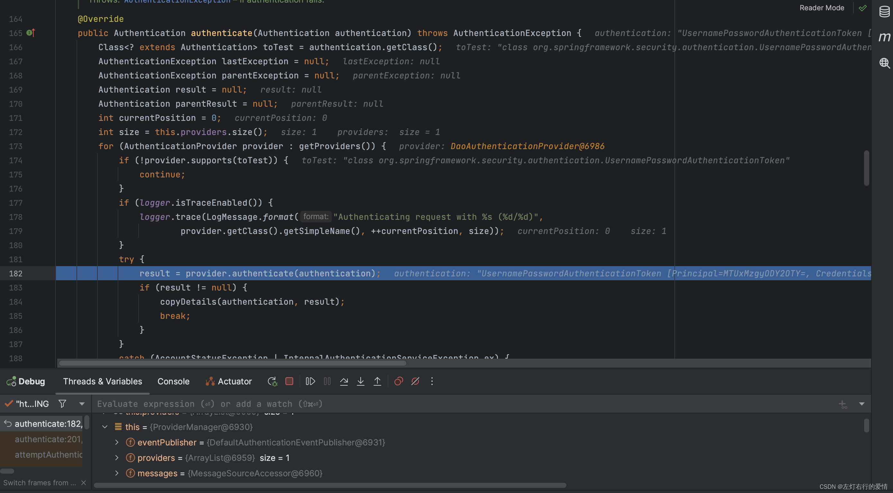  
 此时provider为`DaoAuthticationProvider`，进入验证方法，我们先解析方法：

```
public Authentication authenticate(Authentication authentication) throws AuthenticationException {
	// 验证传入的 authentication 参数是否为 UsernamePasswordAuthenticationToken 类型
	Assert.isInstanceOf(UsernamePasswordAuthenticationToken.class, authentication,
			() -> this.messages.getMessage("AbstractUserDetailsAuthenticationProvider.onlySupports",
					"Only UsernamePasswordAuthenticationToken is supported"));

	// 从 authentication 参数中获取用户名
	String username = determineUsername(authentication);

	// 判断是否从缓存中获取了用户信息
	boolean cacheWasUsed = true;
	UserDetails user = this.userCache.getUserFromCache(username);

	// 如果缓存中不存在用户信息，则从数据源中检索用户信息
	if (user == null) {
		cacheWasUsed = false;
		try {
			// 通过 retrieveUser 方法从数据源中检索用户信息
			user = retrieveUser(username, (UsernamePasswordAuthenticationToken) authentication);
		} catch (UsernameNotFoundException ex) {
			this.logger.debug("Failed to find user '" + username + "'");
			if (!this.hideUserNotFoundExceptions) {
				throw ex;
			}
			// 如果隐藏了用户未找到异常，则抛出 BadCredentialsException 异常
			throw new BadCredentialsException(this.messages
					.getMessage("AbstractUserDetailsAuthenticationProvider.badCredentials", "Bad credentials"));
		}
		Assert.notNull(user, "retrieveUser returned null - a violation of the interface contract");
	}

	try {
		// 对用户进行预验证，如账号是否过期等
		this.preAuthenticationChecks.check(user);
		// 对用户进行附加验证，如密码是否正确等
		additionalAuthenticationChecks(user, (UsernamePasswordAuthenticationToken) authentication);
	} catch (AuthenticationException ex) {
		if (!cacheWasUsed) {
			throw ex;
		}
		// 如果在缓存未使用的情况下发生了异常，则再次尝试检索用户信息并进行验证
		cacheWasUsed = false;
		user = retrieveUser(username, (UsernamePasswordAuthenticationToken) authentication);
		this.preAuthenticationChecks.check(user);
		additionalAuthenticationChecks(user, (UsernamePasswordAuthenticationToken) authentication);
	}

	// 对用户进行后验证，如账号是否锁定等
	this.postAuthenticationChecks.check(user);

	// 如果缓存未使用，则将用户信息存入缓存
	if (!cacheWasUsed) {
		this.userCache.putUserInCache(user);
	}

	Object principalToReturn = user;
	if (this.forcePrincipalAsString) {
		// 如果强制将 principal 返回为字符串，则返回用户名作为 principal
		principalToReturn = user.getUsername();
	}

	// 创建验证成功的 Authentication 对象并返回
	return createSuccessAuthentication(principalToReturn, authentication, user);
}


```

下面走debug的流程，执行到第一个判断，发现不是从缓存中拿到的用户数据：  
 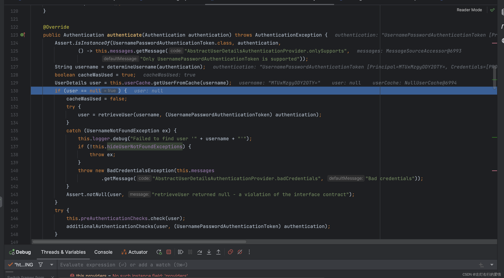  
 然后进入try，执行retrieveUser，从数据源拿用户数据，发现拿不到（因为我们输入的是错误的数据），执行下面的catch方法：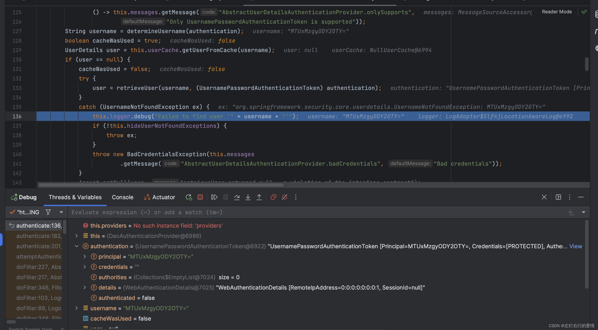  
 然后继续向下执行，看最后报错是哪个：  
 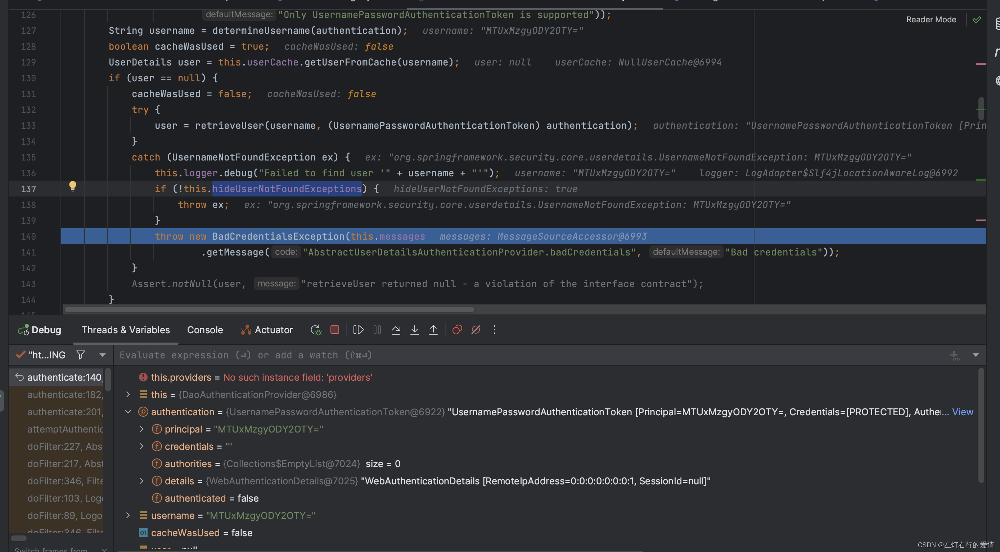  
 发现最后没有抛出ex，而是抛出`BadCredentialsException`错误类型，那么你是否会好奇，这个`hideUserNotFoundExceptions`是干什么的呢？

##### 扩展：hideUserNotFoundExceptions

当进行身份验证时，如果传入的用户名在数据源中不存在，通常会抛出`UsernameNotFoundException`异常。这个异常可以向调用方提供有关身份验证失败的详细信息。

然而，有时在安全考虑下，我们不希望明确告知调用方用户名是否存在，以防止潜在的安全漏洞。在这种情况下，可以将`hideUserNotFoundExceptions`属性设置为true，这样当发生`UsernameNotFoundException`异常时，将抛出一个更通用的`BadCredentialsException`异常，而不会明确指示用户名是否存在。

通过隐藏具体的用户名信息，可以增加系统的安全性，因为攻击者无法通过错误消息得知系统中是否存在特定的用户账号，从而减少了可能的信息泄露和攻击风险。

好的我们继续回来，抛出`BadCredentialsException`后，接着回调到provider为`DaoAuthenticationProvider`中：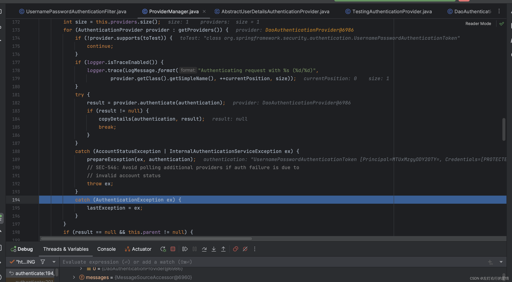  
 执行完catch中的方法后,跳出for循环，因为只有一个provider：  
 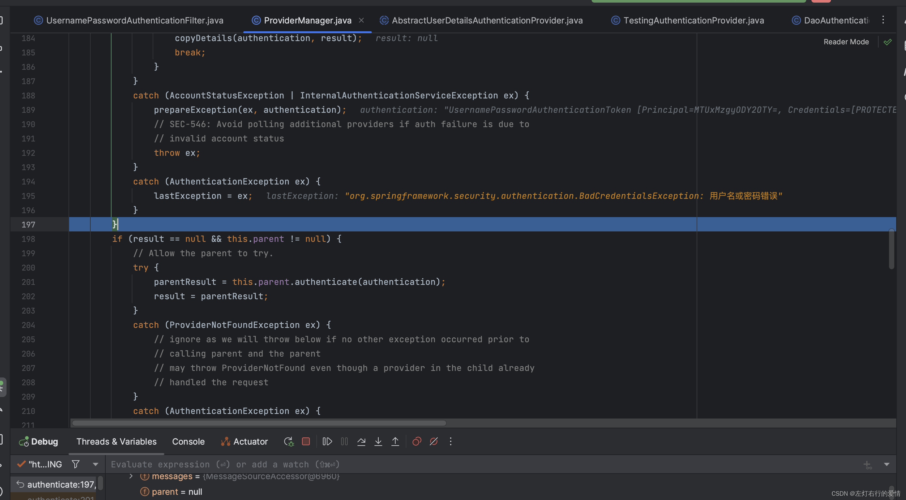  
 接着往下走，到if条件中发现，都不符合：  
 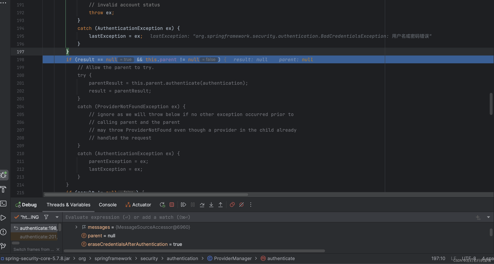  
 到第三个if判断中，还是不符合：  
 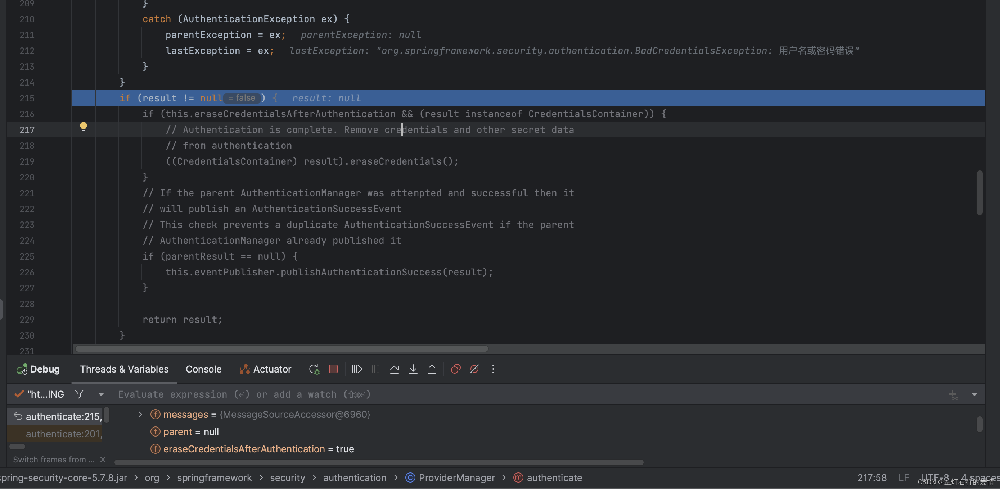  
 接着进入下一个if判断，我们此时lastException不为空，所以不符合：  
 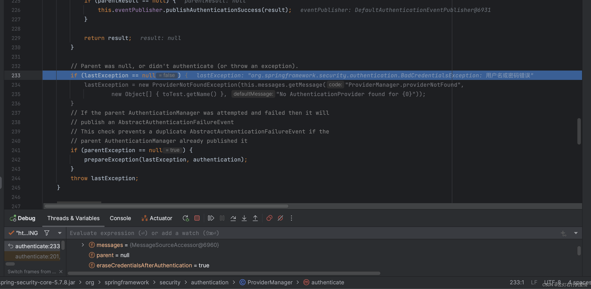  
 走到最后一个if条件时，发现我们的parentException为空，符合条件：

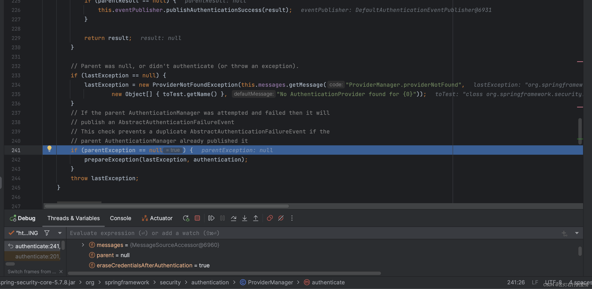  
 进入方法里面，执行`prepareException`, 如果父级AuthenticationManager存在并且验证失败，则父级AuthenticationManager会发布一个AbstractAuthenticationFailureEvent事件。为避免重复发布事件，这里进行了检查。

接着抛出错误：  
 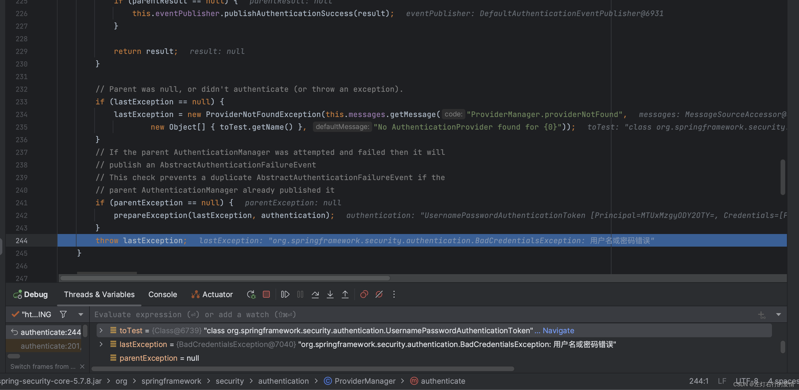  
 最后回到provider为`AnonymousAuthenticationProvider`，执行完catch里面的方法后，进入if判断，此时result为空，不符合：  
 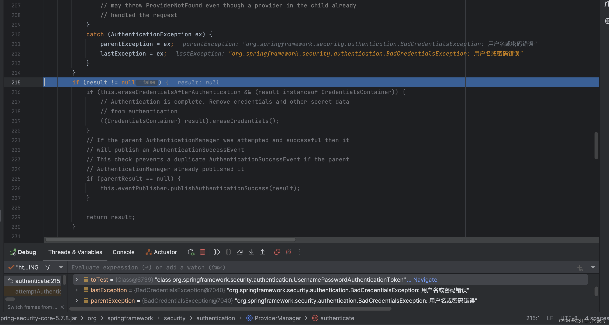  
 进入下一个判断，这里lastException不为空，所以不符合：  
 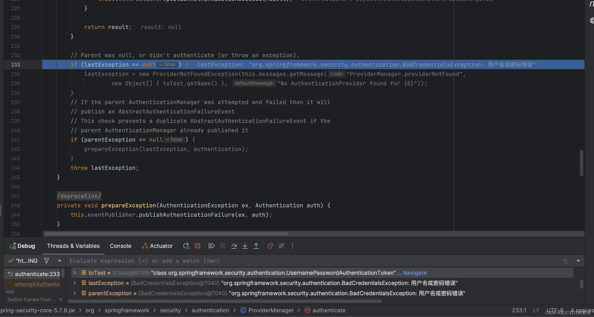  
 最后一个判断，此时parentException不为空，不符合：

  
 最后抛出错误：  
 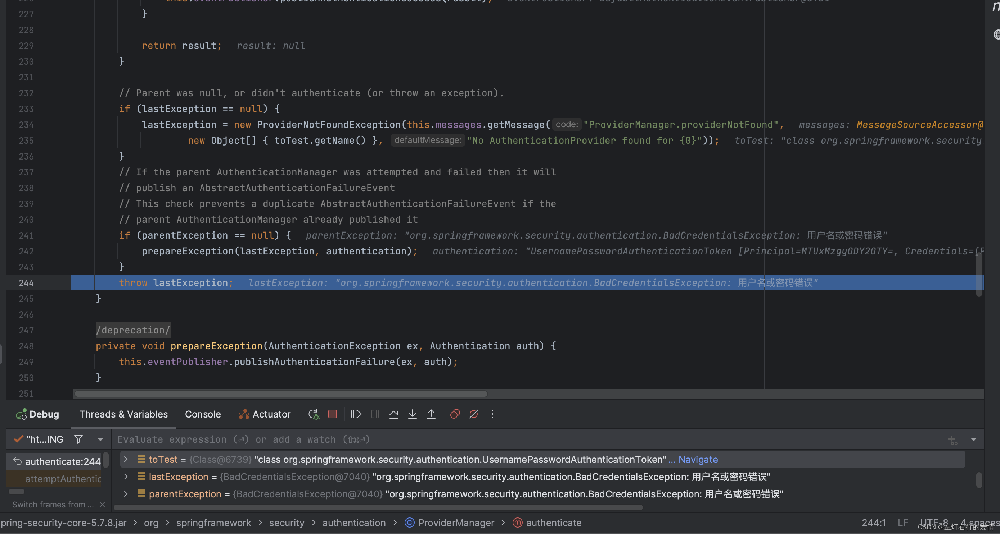  
 抛出错误后，错误回调，来到`AbstractAuthenticationProcessingFilter`  
 类的doFileter里面，在这里面catch房啊捕获到异常，执行方法体里面的`unsuccessfulAuthentication`方法：  
 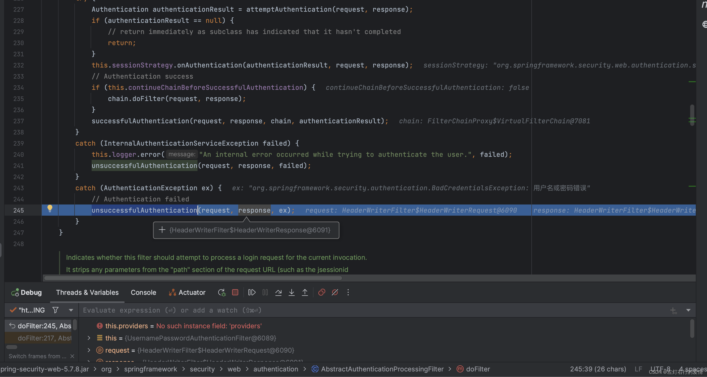  
 进入`unsuccessfulAuthentication`方法里面，我们来看看这里面的内容：

```
protected void unsuccessfulAuthentication(HttpServletRequest request, HttpServletResponse response,
		AuthenticationException failed) throws IOException, ServletException {
	// 清除 SecurityContextHolder 中的身份验证信息
	SecurityContextHolder.clearContext();
	// 记录身份验证失败的异常信息到日志
	this.logger.trace("Failed to process authentication request", failed);
	// 清除 SecurityContextHolder
	this.logger.trace("Cleared SecurityContextHolder");
	// 处理记住我功能的登录失败
	this.rememberMeServices.loginFail(request, response);
	// 调用身份验证失败处理器进行处理
	this.failureHandler.onAuthenticationFailure(request, response, failed);
}


```

我们执行到最后一步，进入到身份验证失败处理器方法里面：  
 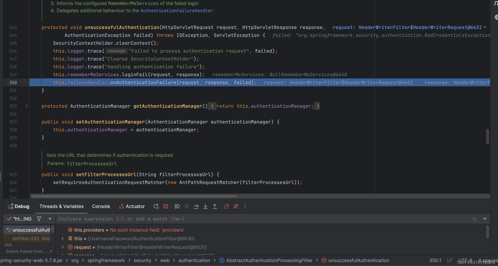  
 进入`onAuthenticationFailure`方法，我们先看看里面的内容：

```
public void onAuthenticationFailure(HttpServletRequest request, HttpServletResponse response,
		AuthenticationException exception) throws IOException, ServletException {
	if (this.defaultFailureUrl == null) {
		// 如果没有设置默认的失败 URL，则发送 401 未经授权的错误
		if (this.logger.isTraceEnabled()) {
			this.logger.trace("Sending 401 Unauthorized error since no failure URL is set");
		} else {
			this.logger.debug("Sending 401 Unauthorized error");
		}
		response.sendError(HttpStatus.UNAUTHORIZED.value(), HttpStatus.UNAUTHORIZED.getReasonPhrase());
		return;
	}
	// 将异常保存到request属性中
	saveException(request, exception);
	if (this.forwardToDestination) {
		// 如果设置为转发到目的地，则使用请求转发将请求转发到默认的失败 URL
		this.logger.debug("Forwarding to " + this.defaultFailureUrl);
		request.getRequestDispatcher(this.defaultFailureUrl).forward(request, response);
	} else {
		// 否则，使用重定向策略将请求重定向到默认的失败 URL
		this.redirectStrategy.sendRedirect(request, response, this.defaultFailureUrl);
	}
}


```

debug走一下里面的流程,刚进入时，注意里面的默认失败url，此时默认失败url不为null，不符合：  
 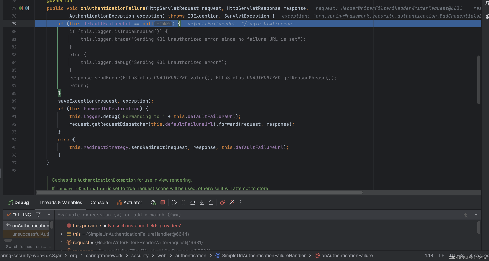  
 然后执行saveException，将异常保存到请求属性中：  
 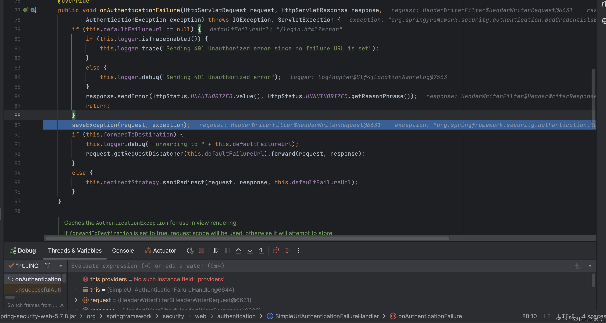  
 它里面的内容如下：

```
protected final void saveException(HttpServletRequest request, AuthenticationException exception) {
	if (this.forwardToDestination) {
		// 如果配置为转发到目的地，则将异常保存到requset属性中
		request.setAttribute(WebAttributes.AUTHENTICATION_EXCEPTION, exception);
		return;
	}
	
	// 否则，根据会话配置将异常保存到session中
	HttpSession session = request.getSession(false);
	if (session != null || this.allowSessionCreation) {
		request.getSession().setAttribute(WebAttributes.AUTHENTICATION_EXCEPTION, exception);
	}
}


```

接着执行下一个if条件，因为forwardToDestination为false，也就是没有设置为跳转转发，所以不会为true，不符合，然后直接进入到else里面，进行重定向转发。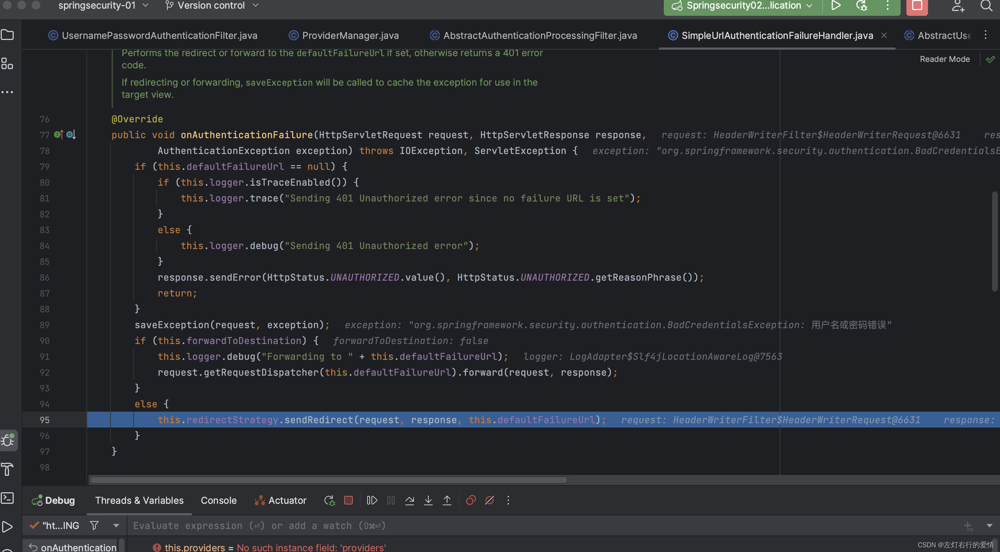

所以，我们默认为redirect，报错信息存储在session中，命名属性为SPRING\_SECURITY\_LAST\_EXCEPTION。  
 如果是forward，报错信息存储在reqeust中，后面是一样的。

那么我们如何设置认证失败后的跳转方式呢，security给我们提供了两个方法：

* failureForwardUrl() // 认证失败后，forward跳转。
* failureUrl() // 认证失败后，redirect跳转。

最后实现效果：  
 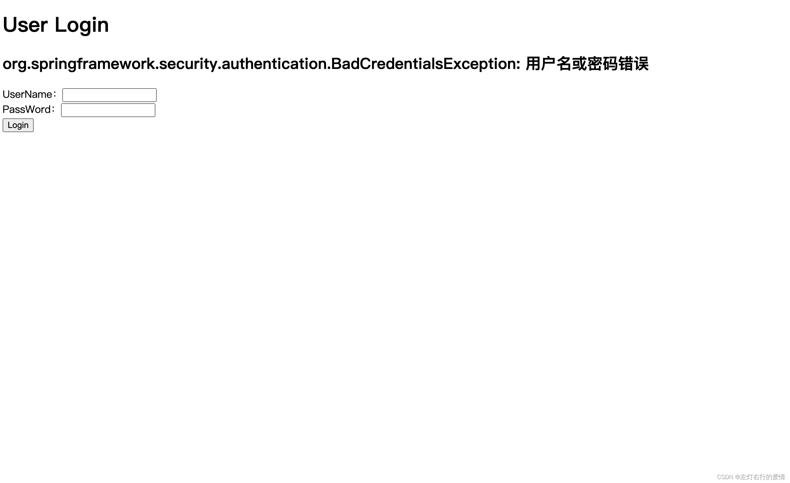

#### 自定义登录失败处理

和自定义登陆成功的使用场景一样，在面对前后端分离时，上面`failureForwardUrl`和`failureUrl`两个方法就力不从心了，所以security提供了`failureHandler`方法用来自定义认证失败之后处理。  
 我们来看一看里面的内容：

```
	public final T failureHandler(AuthenticationFailureHandler authenticationFailureHandler) {
		this.failureUrl = null;
		this.failureHandler = authenticationFailureHandler;
		return getSelf();
	}


```

##### AuthenticationFailureHandler

它的结构如下图：  
 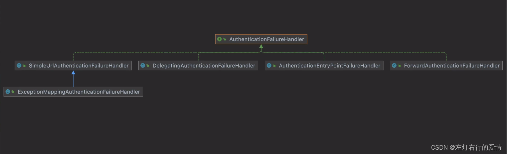

我们来看看里面的内容：

```
public interface AuthenticationFailureHandler {

	void onAuthenticationFailure(HttpServletRequest request, HttpServletResponse response,
			AuthenticationException exception) throws IOException, ServletException;

}


```

这是一个接口方法，它会在验证失败之后回调，所以我们只需要自定义实现就可以。

##### AuthenticationFailureHandler自定义实现

代码如下：

```
import com.fasterxml.jackson.databind.ObjectMapper;
import org.springframework.security.core.AuthenticationException;
import org.springframework.security.web.authentication.AuthenticationFailureHandler;

import javax.servlet.ServletException;
import javax.servlet.http.HttpServletRequest;
import javax.servlet.http.HttpServletResponse;
import java.io.IOException;
import java.util.HashMap;
import java.util.Map;

public class MyAuthenticationFailureHandler  implements AuthenticationFailureHandler {

    @Override
    public void onAuthenticationFailure(HttpServletRequest request, HttpServletResponse response, AuthenticationException exception) throws IOException, ServletException {
        Map<String,Object> result = new HashMap<>();
        result.put("msg","登陆失败："+ exception.getMessage());
        result.put("status",500);
        response.setContentType("application/json;charset=UTF-8");
        String s = new ObjectMapper().writeValueAsString(result);
        response.getWriter().println(s);
    }
}


```

##### 配置自定类

代码如下：

```
import org.springframework.context.annotation.Configuration;
import org.springframework.security.config.annotation.web.builders.HttpSecurity;
import org.springframework.security.config.annotation.web.configuration.WebSecurityConfigurerAdapter;

@Configuration
public class WebSecurityConfigurer extends WebSecurityConfigurerAdapter {

    @Override
     protected void configure(HttpSecurity http) throws Exception {
         http.authorizeRequests()
                 .mvcMatchers("/login.html").permitAll()
                 .mvcMatchers("/index").permitAll() //放行资源写在前面。
                 .anyRequest().authenticated()
                 .and()
                 .formLogin()
                 .loginPage("/login.html") //用来指定默认登陆页面，注意：一旦自定义登陆页面以后必须只能登陆URL。
                 .loginProcessingUrl("/doLogin")  //指定处理登陆请求URL。
                 .usernameParameter("uname")
                 .passwordParameter("passwd")
                 .successHandler(new MyAuthenticatioinSuccessHandler()) //认证成功时处理，前后端分离解决方案。
                 .failureHandler(new MyAuthenticationFailureHandler()) //认证失败时处理，前后端分离解决方案。
                 .and()
                 .csrf().disable(); //禁止csrf跨站请求保护。
     }


}


```

#### 注销登录配置

Security提供默认的注销登录配置，开发时也可以按照自己的需求对注销进行个性化定制。  
 过滤器`LogoutFilter`专门处理注销登陆，默认是加载的。

* 开启注销登录 默认开启

```
@Configuration
public class WebSecurityConfigurer extends
WebSecurityConfigurerAdapter {
@Override
protected void configure(HttpSecurity http) throws
Exception {
http.authorizeHttpRequests()
//...
 .and()
 .formLogin()
//...
 .and()
 .logout(). //开启注销配置
 .logoutUrl("/logout"). //指定退出登录请求地址，默认是 GET 请求，路径为 /logout
 .invalidateHttpSession(true)  //退出时是否是 session 失效，默认值为 true
 .clearAuthentication(true)  //退出时是否清除认证信息，默认值为 true
 .logoutSuccessUrl("/login.html") //退出登录时跳转地址
 .and()
 .csrf().disable();  //这⾥先关闭 CSRF
 }
}


```

* 配置多个注销登录请求

```
 .logoutRequestMatcher(new OrRequestMatcher(
new
AntPathRequestMatcher("/aa","GET"),
new
AntPathRequestMatcher("/bb","POST")
 ))


```

* 前后端分离注销登录配置  
   如果是前后端分离开发，注销成功之后就不需要⻚⾯跳转了，只需要将注销成功的信息  
   返回前端即可，此时我们可以通过⾃定义 LogoutSuccessHandler 实现来返回注销  
   之后信息：

1. 创建`MyLogoutSuccessHandler`方法：

```
public class MyLogoutSuccessHandler implements LogoutSuccessHandler {
    @Override
    public void onLogoutSuccess(HttpServletRequest request, HttpServletResponse response, Authentication authentication) throws IOException, ServletException {
        Map<String,Object> result = new HashMap<>();
        result.put("msg","注销成功，当前认证对象为："+ authentication);
        result.put("status",200);
        response.setContentType("application/json;charset=UTF-8");
        String s = new ObjectMapper().writeValueAsString(result);
        response.getWriter().println(s);
    }
}


```

2. 配置

```
        .logoutSuccessHandler(new MyLogoutSuccessHandler())


```

##### LogoutSuccessHandler

这个方法如下

```
	public LogoutConfigurer<H> logoutSuccessHandler(LogoutSuccessHandler logoutSuccessHandler) {
		this.logoutSuccessUrl = null;
		this.customLogoutSuccess = true;
		this.logoutSuccessHandler = logoutSuccessHandler;
		return this;
	}


```

LogoutSuccessHandler内容如下所示：

```
public interface LogoutSuccessHandler {

	void onLogoutSuccess(HttpServletRequest request, HttpServletResponse response, Authentication authentication)
			throws IOException, ServletException;

}


```

#### 获取用户认证信息

##### SecurityContextHolder解析

Spring Security 会将登录⽤户数据保存在 Session 中。但是，为了使⽤⽅  
 便,Spring Security在此基础上还做了⼀些改进，其中最主要的⼀个变化就是线程绑定。  
 当⽤户登录成功后,Spring Security 会将登录成功的⽤户信息保存到  
 SecurityContextHolder 中。

SecurityContextHolder 中的数据保存默认是通过ThreadLocal 来实现的，使⽤  
 ThreadLocal 创建的变量只能被当前线程访问，不能被其他线程访问和修改，也就是⽤户  
 数据和请求线程绑定在⼀起。

当登录请求处理完毕后，Spring Security 会将  
 SecurityContextHolder 中的数据拿出来保存到 Session 中，同时将  
 SecurityContexHolder 中的数据清空。以后每当有请求到来时，Spring Security  
 就会先从 Session 中取出⽤户登录数据，保存到SecurityContextHolder 中，⽅便在  
 该请求的后续处理过程中使⽤，同时在请求结束时将 SecurityContextHolder 中的数据  
 拿出来保存到 Session 中，然后将SecurityContextHolder 中的数据清空。

实际上 SecurityContextHolder 中存储是 SecurityContext，在  
 SecurityContext 中存储是 Authentication。  
 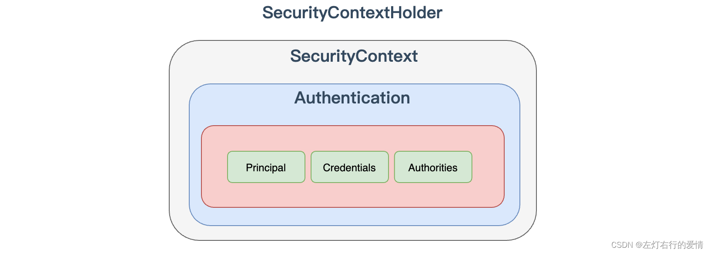

下面我们来看一看这个来类里面的内容：  
 先解释一下类里面的常量是什么意思：

* MODE\_THREADLOCAL:  
   使用线程本地变量（`ThreadLocal`）来存储 `SecurityContext`，每个线程拥有独立的 `SecurityContext`。  
   Threadlocal 的特点是在哪个线程中存储就要在哪个线程中读取，⾮常适合 web 应⽤，因为在默认情况下，⼀个请求⽆论经过多少 Filter 到达  
   Servlet，都是由⼀个线程来处理的。这也是 SecurityContextHolder 的默认存储  
   策略，但这种存储策略意味着如果在具体的业务处理代码中，开启了⼦线程，在⼦线程中  
   去获取登录⽤户数据，就会获取不到。
* MODE\_INHERITABLETHREADLOCAL:  
   使用可继承的线程本地变量（`InheritableThreadLocal`）来存储 `SecurityContext`，子线程可以继承父线程的 `SecurityContext`。  
   这种存储模式适⽤于多线程环境，如果希望在⼦  
   线程中也能够获取到登录⽤户数据，那么可以使⽤这种存储模式。
* MODE\_GLOBAL  
   使用全局静态变量来存储 `SecurityContext`，所有线程共享同一个 `SecurityContext`。  
   这种存储模式实际上是将数据保存在⼀个静态变量中，在 JavaWeb开  
   发中，这种模式很少使⽤到。
* MODE\_PRE\_INITIALIZED:  
   预初始化模式，要求在使用时先设置完整的 `SecurityContextHolderStrategy`实例。  
   基本没有业务场景（据我了解所知），欢迎评论区讨论。

```
public class SecurityContextHolder {

    // 不同的策略模式常量
    public static final String MODE_THREADLOCAL = "MODE_THREADLOCAL";
    public static final String MODE_INHERITABLETHREADLOCAL = "MODE_INHERITABLETHREADLOCAL";
    public static final String MODE_GLOBAL = "MODE_GLOBAL";
    private static final String MODE_PRE_INITIALIZED = "MODE_PRE_INITIALIZED";

    // 从系统属性中获取策略名称的键名
    public static final String SYSTEM_PROPERTY = "spring.security.strategy";

    private static String strategyName = System.getProperty(SYSTEM_PROPERTY);
    private static SecurityContextHolderStrategy strategy;
    private static int initializeCount = 0;

    static {
        initialize();
    }

    // 初始化 SecurityContextHolder
    private static void initialize() {
        initializeStrategy();
        initializeCount++;
    }

    // 初始化策略
    private static void initializeStrategy() {
        if (MODE_PRE_INITIALIZED.equals(strategyName)) {
            // 如果策略名称为 MODE_PRE_INITIALIZED，则需要确保 strategy 已经被设置
            Assert.state(strategy != null, "When using " + MODE_PRE_INITIALIZED
                    + ", setContextHolderStrategy must be called with the fully constructed strategy");
            return;
        }

        // 如果没有指定策略名称，默认为 MODE_THREADLOCAL
        if (!StringUtils.hasText(strategyName)) {
            strategyName = MODE_THREADLOCAL;
        }
        // 根据策略名称创建相应的策略实例
        if (strategyName.equals(MODE_THREADLOCAL)) {
            strategy = new ThreadLocalSecurityContextHolderStrategy();
            return;
        }
        if (strategyName.equals(MODE_INHERITABLETHREADLOCAL)) {
            strategy = new InheritableThreadLocalSecurityContextHolderStrategy();
            return;
        }
        if (strategyName.equals(MODE_GLOBAL)) {
            strategy = new GlobalSecurityContextHolderStrategy();
            return;
        }
        //根据给定的策略名称 strategyName 使用反射机制来动态创建并实例化对应的 SecurityContextHolderStrategy 对象。
        try {
            Class<?> clazz = Class.forName(strategyName);
            Constructor<?> customStrategy = clazz.getConstructor();
            strategy = (SecurityContextHolderStrategy) customStrategy.newInstance();
        } catch (Exception ex) {
            ReflectionUtils.handleReflectionException(ex);
        }
    }
    // 清除当前线程的 SecurityContext
    public static void clearContext() {
        strategy.clearContext();
    }
    // 获取当前线程的 SecurityContext
    public static SecurityContext getContext() {
        return strategy.getContext();
    }
    // 获取 SecurityContextHolder 的初始化次数
    public static int getInitializeCount() {
        return initializeCount;
    }
    // 设置当前线程的 SecurityContext
    public static void setContext(SecurityContext context) {
        strategy.setContext(context);
    }
    // 设置策略名称，并重新初始化 SecurityContextHolder
    public static void setStrategyName(String strategyName) {
        SecurityContextHolder.strategyName = strategyName;
        initialize();
    }
    // 设置自定义的 SecurityContextHolderStrategy，并重新初始化 SecurityContextHolder
    public static void setContextHolderStrategy(SecurityContextHolderStrategy strategy) {
        Assert.notNull(strategy, "securityContextHolderStrategy cannot be null");
        SecurityContextHolder.strategyName = MODE_PRE_INITIALIZED;
        SecurityContextHolder.strategy = strategy;
        initialize();
    }
    // 获取当前使用的 SecurityContextHolderStrategy
    public static SecurityContextHolderStrategy getContextHolderStrategy() {
        return strategy;
    }
    // 创建一个空的 SecurityContext
    public static SecurityContext createEmptyContext() {
        return strategy.createEmptyContext();
    }
    @Override
    public String toString() {
        return "SecurityContextHolder[strategy='" + strategy.getClass().getSimpleName() + "'; initializeCount="
                + initializeCount + "]";
    }
}


```

##### SecurityContextHolderStrategy解析

上下文在获取时，并不是直接可以获取的，而是通过策略（strategy）来获取，我们来看一看这个strategy里面是什么内容，通过 SecurityContextHolder 可以得知，SecurityContextHolderStrategy 接⼝  
 ⽤来定义存储策略⽅法：

```
public interface SecurityContextHolderStrategy {
//清除存储的 SecurityContext对象
	void clearContext();
//获取存储的 SecurityContext 对象
	SecurityContext getContext();
//设置存储的 SecurityContext 对象
	void setContext(SecurityContext context);
//创建⼀个空的 SecurityContext 对象
	SecurityContext createEmptyContext();
}


```

我们可以看到，在setContext实现类中，有四种类型分别为：

* GlobalSecurityContextHolderStrategy
* InheritableThreadLocalSecurityContextHolderStrategy
* ListeningSecurityContextHolderStrategy（这种基本不用，下面就不展示了）
* ThreadLocalSecurityContextHolderStrategy

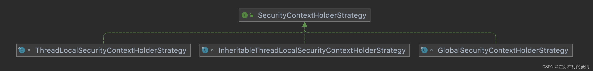

##### 例子

* 代码中获取认证之后⽤户数据

```
@RestController
public class HelloController {
@RequestMapping("/hello")
public String hello() {
Authentication authentication = SecurityContextHolder
 .getContext().getAuthentication();
User principal = (User) authentication.getPrincipal();
System.out.println("身份 :"+principal.getUsername());
System.out.println("凭证 :"+authentication.getCredentials());
System.out.println("权限 :"+authentication.getAuthorities());
return "hello security";
 }
}


```

* 多线程情况下获取⽤户数据  
   如果需要在⼦线程中获取必须使⽤第  
   ⼆种策略，默认策略是通过 `System.getProperty` 加载的，因此我们可以通过增加`VM Options`参数进⾏修改。  
   添加-Dspring.security.strategy=MODE\_INHERITABLETHREADLOCAL  
   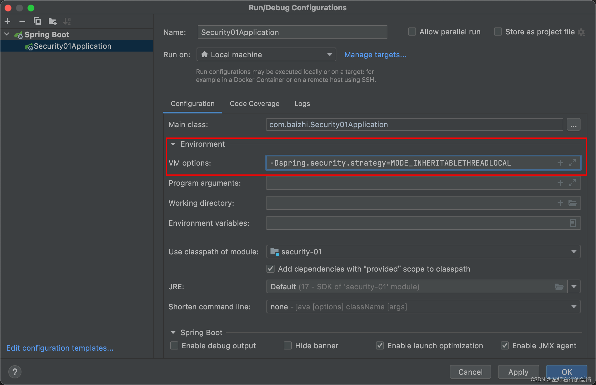

```
@RestController
public class HelloController {
@RequestMapping("/hello")
public String hello() {
new Thread(()!.{
Authentication authentication = SecurityContextHolder
 .getContext().getAuthentication();
User principal = (User) authentication.getPrincipal();
System.out.println("身份 :"+principal.getUsername());
System.out.println("凭证
:"+authentication.getCredentials());
System.out.println("权限
:"+authentication.getAuthorities());
 }).start();
return "hello security";
 }
}


```

##### 总结一下

通过上面的代码可以看到，`SecurityContextHolder`提供了一系列方法，用于获取（`getContext`）设置（`setContext`）和清除（`clearContext`）`SecurityContext`。  
 另外，`SecurityContextHolder`还提供了一些辅助方法：

1. `getInitializeCount`：用于获取`SecurityContextHolder`的初始化次数。
2. `setInitializeCount`：用于设置策略名称并重新初始化。
3. `setContextHolderStrategy`：用于设置自定义的`SecurityContextHolderStrategy`实例并重新初始化`SecurityContextHolder`。

使用`SecurityContextHolder`，可以方便地管理和访`SecurityContext`，以支持应用程序的身份验证和授权功能。

##### 页面中获取用户认证信息

* 引入依赖

```
  <dependency>
            <groupId>org.thymeleaf.extras</groupId>
            <artifactId>thymeleaf-extras-springsecurity5</artifactId>
            <version>3.0.4.RELEASE</version>
        </dependency>


```

* ⻚⾯加⼊命名空间

```
<html lang="en" xmlns:th="https:!"www.thymeleaf.org"
xmlns:sec="http:!"www.thymeleaf.org/extras/spring-security">


```

* ⻚⾯中使⽤

```
<!--获取认证用户名-->
<ul>
    <li sec:authentication="principal.username"></li>
    <li sec:authentication="principal.authorities"></li>
    <li sec:authentication="principal.accountNonExpired"></li> 
    <li sec:authentication="principal.accountNonLocked"></li>
    <li sec:authentication="principal.credentialsNonExpired"></li>
</ul>


```

结果如下：  
 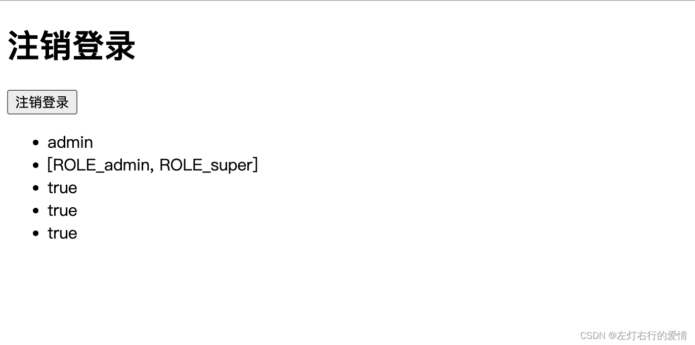

### 结尾

文章总体有点长，难免会有疏漏，如果感觉哪个地方看的不是很明白，欢迎留言，代码和源码过程都是一步步调的，确保按这个来是正确的，加油⛽️。
