> 原文：[CSDN](https://blog.csdn.net/qq_45852626/article/details/131176456)（历史文章导入，当前状态为草稿）

## 前言

内容是根据b站视频黑马作为一个引子，期间不断的翻阅书和查官网的英语文档一句句翻译过来的，相信能做到相对来说全一些，当时学完收获还是很大的，目前整理的时候又回头翻看，收获还是有的，希望也可以帮助到你，目前不断更新，有时间就来补充了，内容整理比较辛苦，码字不易，希望点个关注一起进步。

## 权限管理

涉及到用户参与到系统都需要进行权限管理，权限管理实现了**对用户访问系统的控制**，按照**安全规则**或者**安全策略**去控制用户**可以访问且只能访问自己被授权的资源**。  
 权限管理包括用户**身份认证**和**授权**两部分，简称认证授权。  
 对于需要访问控制的资源用户首先进行身份认证，认证通过后用户具有改资源的访问权限方可访问。

### 认证

身份认证就是判断一个用户是否为合法用户的处理过程。  
 最简单的方式：系统核对用户的用户名和口令是否与系统中一致。

### 授权

授权就是访问控制，控制不同身份可以访问到哪些资源。

### 安全管理框架

Java企业级开发中，安全管理框架非常少，目前比较常见的是：

* Shiro
* Spring Security
* 开发者自定义

## 整体架构

在架构设计中，**认证**和**授权**是分开的，两个是独立的存在，好处在于可以非常方便的整合一些外部的解决方案。  
 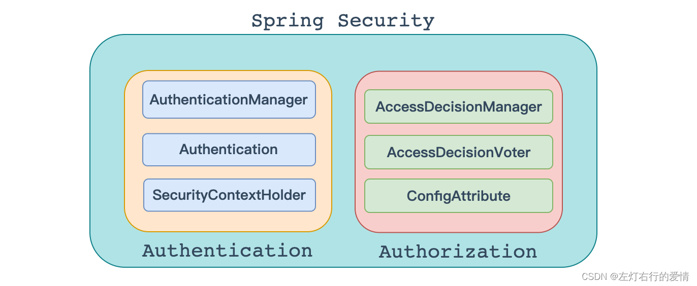  
 下面我们对于里面的细节做一些基本的了解。

### 认证

认证这块更到后面好好和大家聊聊

#### AuthenticationManager

#### Authentication

#### SecurityContextHolder

### 授权

#### AccessDecisionManager

#### AccessDecisionVoter

#### ConfigAttribute

## 环境搭建

### 技术栈

* spring boot
* spring security

### 创建项目

1.创建springboot单体项目  
 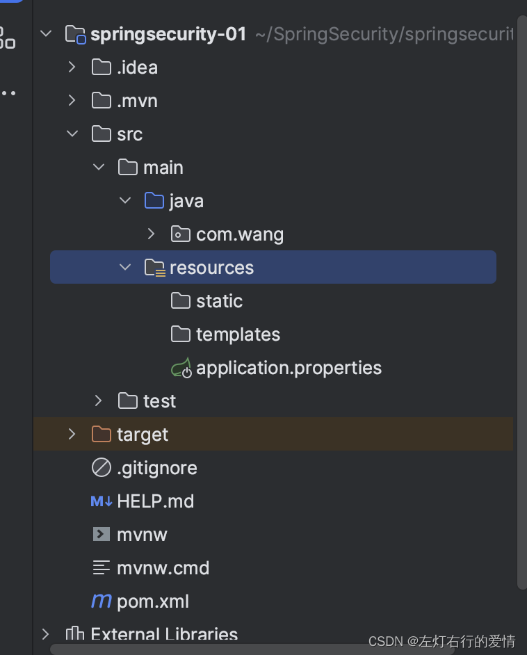  
 2. 创建controller  
 项目结构：  
 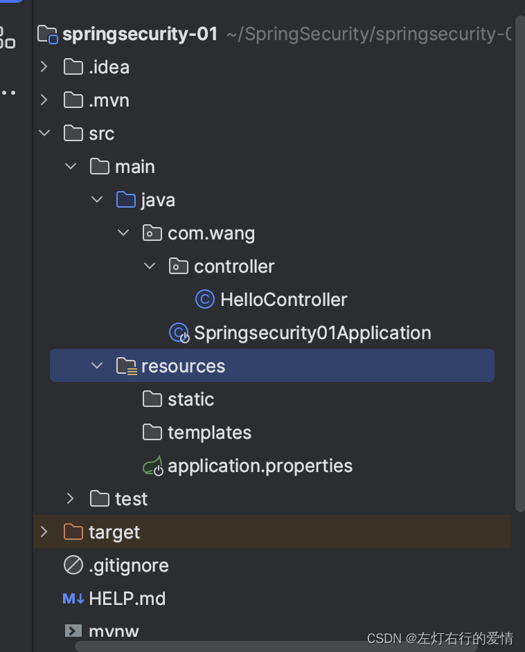  
 项目代码：

```
import org.springframework.web.bind.annotation.RequestMapping;
import org.springframework.web.bind.annotation.RestController;

@RestController
public class HelloController {

    @RequestMapping("/hello")
    public String hello(){
        System.out.println("hello security");
        return "hello spring security";
    }
}


```

3.启动项目测试  
 如果和我的配置是一样的，默认端口是8080，那么就行下面这个地址:`http://localhost:8080/hello`  
 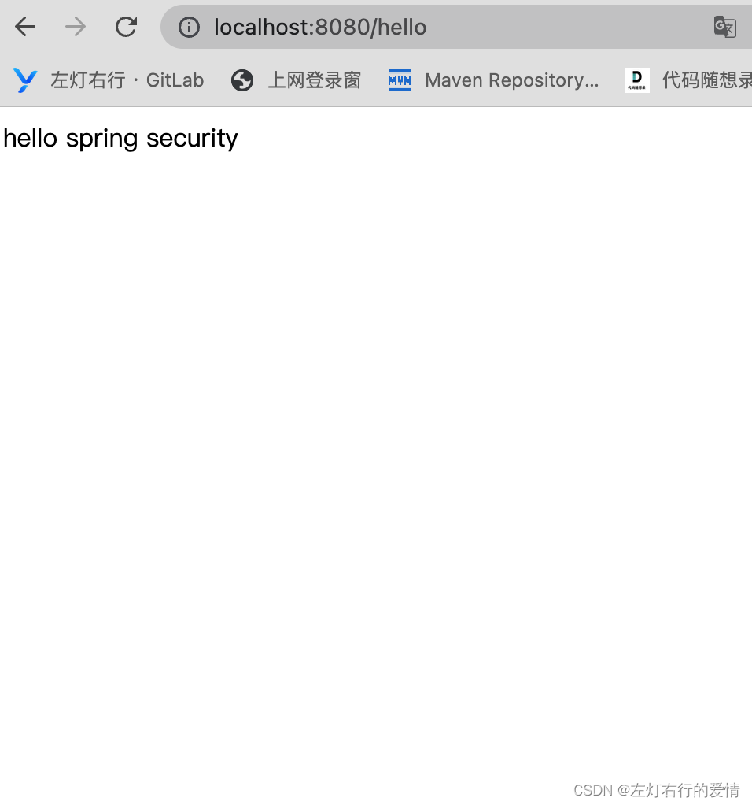

### 整合Spring Security

1. 引入spring security相关依赖

```
    <dependency>
            <groupId>org.springframework.boot</groupId>
            <artifactId>spring-boot-starter-security</artifactId>
        </dependency>


```

2.再次启动项目

* 启动后控制台生成一个密码
* 访问hello发现直接跳转到登陆页面  
   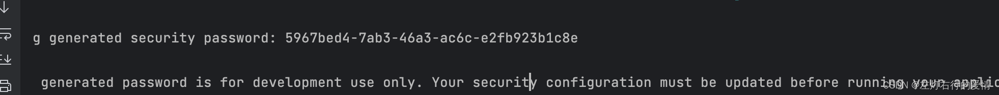  
   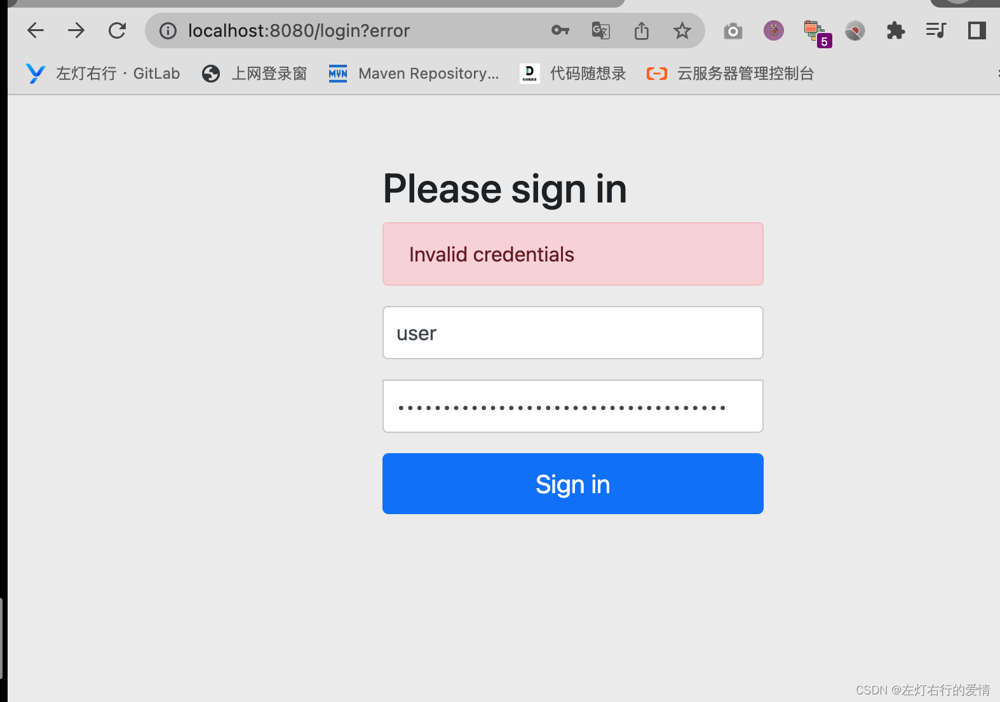  
   3.登陆系统
* 默认用户名：user
* 默认密码：控制台打印的uuid  
   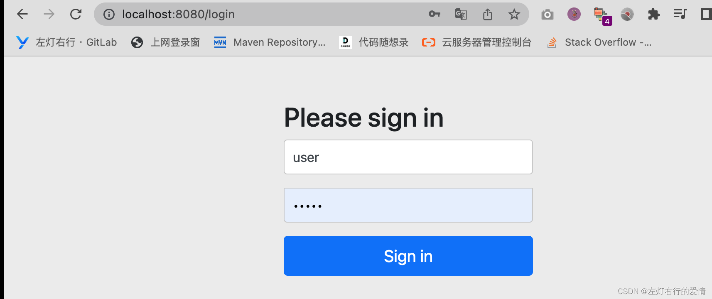

看到这相信你能体会到它的强大，只需引入一个依赖，所有的接口都会自动保护起来！  
 思考一下：

* 为什么引⼊ Spring Security 之后没有任何配置所有请求就要认证呢?
* 在项⽬中明明没有登录界⾯，登录界⾯怎么来的呢？
* 为什么使⽤user和控制台密码能登陆，登录时验证数据源存在哪⾥呢？

## 实现原理

虽然开发者只需要引⼊⼀个依赖，就可以让 Spring Security 对应⽤进⾏保护。Spring Security ⼜是如何做到的呢？  
 在 Spring Security 中认证、授权等功能都是基于过滤器完成的。

假设我们现在不用Spring Security，自己去开发一个权限管理，我们应该如何做权限管理？  
 需求：我们希望在访问一个资源的时候，先认证再访问，如果没有认证，则先要去做认证。  
 那么我们的设计思路应该如下图所示：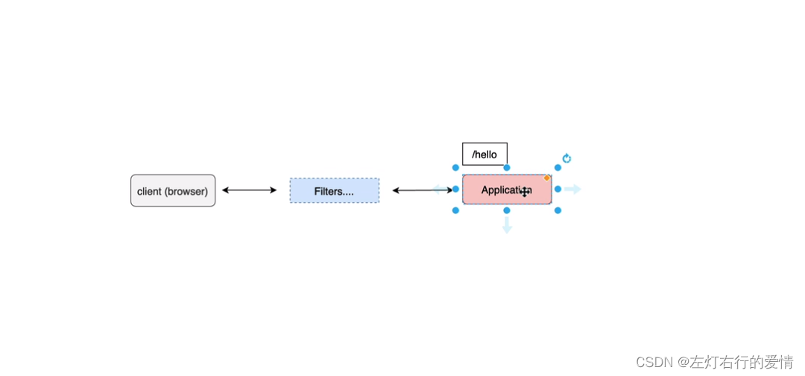提供一个官方的网址来参考：`https://docs.spring.io/spring-security/site/docs/5.5.x-SNAPSHOT/reference/html5/#servlet-architecture`

### 官方文档解读

#### A Review of Filters

```
Spring Security’s Servlet support is based on Servlet Filters, so it is helpful to look at the role of Filters generally first. 
The picture below shows the typical layering of the handlers for a single HTTP request.

翻译：
SpringSecurity的Servlet的支持是基于Servlet过滤器的，所以先看一下过滤器的作用对我们比较有帮助。
下图展示了过滤器处理单个HTTP请求到来时的典型分层。


```

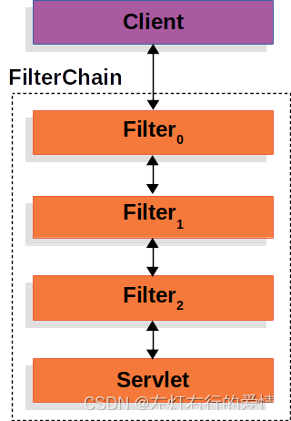

```
The client sends a request to the application, and the container creates a FilterChain which contains the Filters and Servlet that should process the HttpServletRequest based on the path of the request URI. 
In a Spring MVC application the Servlet is an instance of DispatcherServlet. 
At most one Servlet can handle a single HttpServletRequest and HttpServletResponse. 

翻译：
客户端向应用程序发送一个请求，容器创建一个过滤链，它包含过滤器和Servlet，它们根据请求的URL路径来处理HttpServletRequest。
在Spring MVC应用程序中，Servlet是DispatcherServlet的一个实例。
每个HttpServletRequest和HttpServletResponse只能被一个Servlet处理。


```

```
However, more than one Filter can be used to:
1. Prevent downstream Filters or the Servlet from being invoked. 
In this instance the Filter will typically write the HttpServletResponse.
2. Modify the HttpServletRequest or HttpServletResponse used by the downstream Filters and Servlet
The power of the Filter comes from the FilterChain that is passed into it.

翻译：
然而，可以使用多个过滤器来实现以下功能：
1. 阻止下游的过滤器或Servlet被调用.
在这种情况下，过滤器通常会编写HttpServletResponse。
2. 可以修改下游的过滤器和Servlet所使用的HttpServletRequest或HttpServletResponse。
过滤器的强大之处来自于过滤链所传递给它的。


```

#### DelegatingFilterProxy

```
Spring provides a Filter implementation named DelegatingFilterProxy that allows bridging between the Servlet container’s lifecycle and Spring’s ApplicationContext. 
The Servlet container allows registering Filters using its own standards, but it is not aware of Spring defined Beans. 
DelegatingFilterProxy can be registered via standard Servlet container mechanisms, but delegate all the work to a Spring Bean that implements Filter.

翻译：
Spring提供了一个名为DelegatingFilterProxy的过滤器实现，它被允许在Servlet容器的生命周期和Spring的ApplicationContext之间建立桥接。（Delegating：授权｜委托）
Servlet容器允许使用自己的标准注册过滤器，但它不知道Spring定义的Bean。
DelegatingFilterProxy可以通过标准的Servlet容器机制进行注册，但它会将所有的工作委托给一个实现了Filter接口的Spring Bean。


```

这是DelegatingFilterProxy如何与过滤器和FilterChain相结合的示意图，如下图：  
 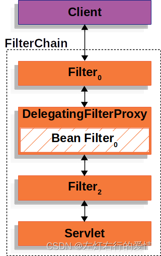

```
DelegatingFilterProxy looks up Bean Filter0 from the ApplicationContext and then invokes Bean Filter0.
The pseudo code of DelegatingFilterProxy can be seen below.

翻译：
DelegatingFilterProxy会从ApplicationContext中查找名为Filter0的Bean，
然后调用该Bean。下面是DelegatingFilterProxy的伪代码示例


```

```
public void doFilter(ServletRequest request, ServletResponse response, FilterChain chain) {
    // Lazily get Filter that was registered as a Spring Bean
    // For the example in DelegatingFilterProxy delegate is an instance of Bean Filter0
    Filter delegate = getFilterBean(someBeanName);
    // delegate work to the Spring Bean
    delegate.doFilter(request, response);
}


```

```
 Another benefit of DelegatingFilterProxy is that it allows delaying looking Filter bean instances. 
 This is important because the container needs to register the Filter instances before the container can startup. 
 However, Spring typically uses a ContextLoaderListener to load the Spring Beans which will not be done until after the Filter instances need to be registered.

翻译：
DelegatingFilterProxy的另一个好处是它允许延迟查找过滤器Bean实例。
这一点很重要，因为容器需要在启动之前注册过滤器实例。
然而，Spring通常使用ContextLoaderListener来加载Spring Beans，而这个操作在过滤器实例需要注册之前是不会执行的。


```

那么看完官方文档后，总结一下：

##### 为什么会有DelegatingFileterProxy的出现？

主要是为了解决Spring应用程序中的过滤器集成和管理的需求。  
 在传统的Servlet容器中，过滤器是通过容器的标准机制进行注册和管理的，而与Spring的ApplicationContext没有直接的集成。

由于Spring框架提供了丰富的依赖注入、生命周期管理和其他高级特性，开发人员希望能够在Spring应用程序中更好地利用这些特性来管理过滤器。他们希望能够像管理其他Spring Bean一样管理过滤器，而不仅仅局限于Servlet容器的机制。

因此，DelegatingFilterProxy就应运而生了。它作为一个代理过滤器，将Servlet容器和Spring的ApplicationContext进行桥接，实现了过滤器在Spring环境中的管理和配置。通过DelegatingFilterProxy，开发人员可以使用Spring的依赖注入、生命周期管理等功能，以及利用Spring Bean的灵活性和控制能力来编写和管理过滤器。

DelegatingFilterProxy的出现使得过滤器的集成和管理更加灵活、高效，并且能够充分利用Spring框架的优势。它为我们提供了一种统一、一致的方式来管理过滤器，并将过滤器的实现与Servlet容器的机制解耦，使得Spring应用程序的过滤器配置更加方便、可扩展和易于维护。

##### DelegatingFileterProxy如何将Servlet容器和Spring的ApplicationContext进行桥接？

1. **在Servlet容器中注册DelegatingFilterProxy**：首先，开发人员在web.xml或Servlet容器的其他配置文件中注册DelegatingFilterProxy作为一个过滤器。这是通过使用Servlet容器的标准机制进行注册，就像注册其他过滤器一样。
2. **DelegatingFilterProxy初始化**：在Servlet容器启动时，DelegatingFilterProxy将被实例化并初始化。它会获取应用程序的ApplicationContext，通常是通过ContextLoaderListener或其他Spring配置来加载。
3. **查找目标过滤器Bean**：DelegatingFilterProxy在初始化阶段会从ApplicationContext中查找指定的目标过滤器Bean。这个目标过滤器Bean是开发人员定义的实际过滤器实现，它实现了Spring的Filter接口。
4. **运行过滤器链**：当收到请求时，DelegatingFilterProxy会将请求和响应传递给目标过滤器Bean的doFilter方法。目标过滤器Bean可以执行自定义的过滤逻辑，并通过调用FilterChain的doFilter方法将请求传递给下一个过滤器或Servlet。  
    举个栗子🌰：  
    1.实现一个Filter接口的自定义过滤器类：

```
import javax.servlet.*;
import java.io.IOException;

public class MyFilter implements Filter {
    @Override
    public void init(FilterConfig filterConfig) throws ServletException {
        // 过滤器初始化逻辑
    }

    @Override
    public void doFilter(ServletRequest request, ServletResponse response, FilterChain chain)
            throws IOException, ServletException {
        // 过滤器逻辑处理
        // ...

        // 继续调用下一个过滤器或Servlet
        chain.doFilter(request, response);
    }

    @Override
    public void destroy() {
        // 过滤器销毁逻辑
    }
}


```

2.在Spring的配置文件（如applicationContext.xml）中配置DelegatingFilterProxy和自定义过滤器的Bean：

```
<bean id="myFilter" class="com.example.MyFilter" />

<bean id="delegatingFilterProxy" class="org.springframework.web.filter.DelegatingFilterProxy">
    <property name="targetBeanName" value="myFilter" />
</bean>


```

3.在web.xml中注册DelegatingFilterProxy：

```
<filter>
    <filter-name>delegatingFilterProxy</filter-name>
    <filter-class>org.springframework.web.filter.DelegatingFilterProxy</filter-class>
</filter>

<filter-mapping>
    <filter-name>delegatingFilterProxy</filter-name>
    <url-pattern>/*</url-pattern>
</filter-mapping>


```

通过以上配置，DelegatingFilterProxy将会在应用程序启动时被实例化，并根据targetBeanName属性查找并委托给MyFilter过滤器的处理逻辑。  
 这样，我们就实现了通过DelegatingFilterProxy将Servlet容器和Spring的ApplicationContext进行桥接，从而能够在Spring应用程序中管理和配置自定义过滤器。

##### DelegatingFilterProxy的好处都有什么？

1. **无缝集成Spring和Servlet容器**：DelegatingFilterProxy允许在Servlet容器中注册过滤器，同时将实际的过滤逻辑委托给Spring中的Bean。这样可以充分利用Spring的依赖注入、生命周期管理和其他特性，将过滤器与Spring应用程序无缝集成。
2. **延迟加载过滤器Bean**：DelegatingFilterProxy允许延迟查找过滤器Bean的实例。这对于需要在容器启动之前注册过滤器实例非常重要。通过DelegatingFilterProxy，可以将过滤器的实例化推迟到需要使用时，避免因为Bean的加载顺序问题而导致注册失败。
3. **更好的控制和灵活性**：DelegatingFilterProxy允许使用Spring的ApplicationContext来获取过滤器Bean实例。这意味着可以在Spring的IoC容器中配置和管理过滤器，以及利用Spring的各种特性，如AOP切面、事务管理等。这为过滤器的控制和定制提供了更多的灵活性和扩展性。
4. **代码重用和模块化**：通过DelegatingFilterProxy，可以将具体的过滤逻辑封装在Spring的Bean中，从而实现代码的重用和模块化。不同的过滤器可以共享同一个Spring Bean，并在配置中指定不同的过滤器名称。这样可以避免代码的冗余和重复编写，提高代码的可维护性和可扩展性。

#### FilterChainProxy

```
Spring Security’s Servlet support is contained within FilterChainProxy. 
FilterChainProxy is a special Filter provided by Spring Security that allows delegating to many Filter instances through SecurityFilterChain.
Since FilterChainProxy is a Bean, it is typically wrapped in a DelegatingFilterProxy.

翻译：
Spring Security的Servlet支持是由FilterChainProxy组件提供的。
FilterChainProxy是由Spring Security提供的特殊过滤器，通过SecurityFilterChain实现了将请求委托给多个过滤器实例的功能。
由于FilterChainProxy是一个Bean，通常会将其包装在一个DelegatingFilterProxy中。


```

下图展示了FilterChainProxy的信息：  
 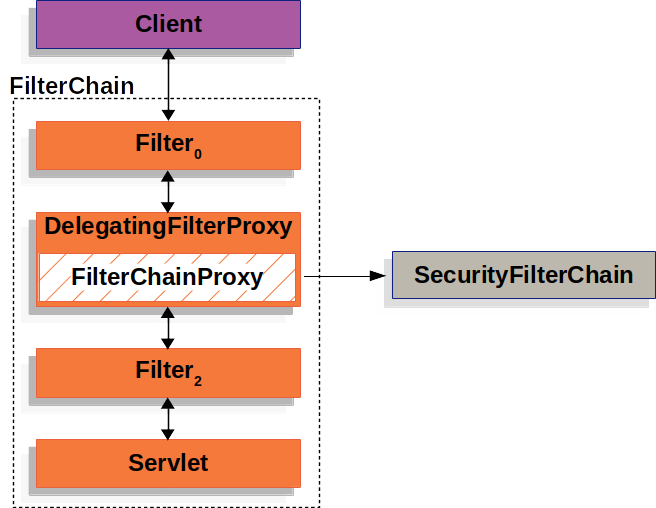

##### 为什么会有FilterChainProxy的出现

FilterChainProxy的出现主要是**为了实现灵活且可配置的安全过滤器链管理**。  
 在Web应用程序中，安全性是一个重要的方面，需要对请求进行身份验证、授权和其他安全操作。为了实现这些安全功能，需要使用多个过滤器来处理不同的安全任务。  
 然而，**每个过滤器通常只能处理特定的安全任务**，例如身份验证或授权。而在实际的应用程序中，可能需要**使用不同的过滤器来处理不同的URL路径、请求条件或安全需求。**此外，过滤器的**顺序和执行流程**也可能因应用程序的特定需求而有所不同。  
 为了解决这些灵活性和可配置性的问题，Spring Security引入了FilterChainProxy。  
 FilterChainProxy允许我们根据特定的URL路径、请求条件或安全需求，配置多个过滤器链并指定它们的顺序和执行流程。通过FilterChainProxy，可以动态地选择适当的过滤器链来处理不同的请求，并按照预定义的顺序依次执行过滤器。  
 FilterChainProxy的出现使得安全过滤器链的管理更加灵活、可配置和易于扩展。**它提供了一种集中管理和调度多个过滤器的机制**，将请求路由到适当的过滤器链中，并确保按照指定的顺序执行。同时，它还提供了**嵌套过滤器链的支持**，使得可以构建复杂的安全逻辑。

#### SecurityFilterChain

```
SecurityFilterChain is used by FilterChainProxy to determine which Spring Security Filters should be invoked for this request.

翻译：
FilterChainProxy使用SecurityFilterChain来确定在该请求中应该调用哪些Spring Security过滤器。


```

如下图所示：  
 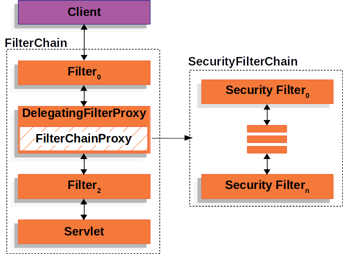

```
The Security Filters in SecurityFilterChain are typically Beans, but they are registered with FilterChainProxy instead of DelegatingFilterProxy. 
FilterChainProxy provides a number of advantages to registering directly with the Servlet container or DelegatingFilterProxy. 
First, it provides a starting point for all of Spring Security’s Servlet support. 
For that reason, if you are attempting to troubleshoot Spring Security’s Servlet support, adding a debug point in FilterChainProxy is a great place to start.

翻译：
SecurityFilterChain中的安全过滤器通常是Spring的Bean，但它们是通过FilterChainProxy进行注册，而不是通过DelegatingFilterProxy进行注册。

通过FilterChainProxy直接注册，相比于直接在Servlet容器或DelegatingFilterProxy中注册，提供了一些优势。

首先，它为Spring Security的所有Servlet支持提供了一个起点。
因此，如果您正在尝试排除Spring Security的Servlet支持问题，向FilterChainProxy添加一个调试断点是一个很好的起点。（to troubleshoot ：进行故障排除）

Second, since FilterChainProxy is central to Spring Security usage it can perform tasks that are not viewed as optional.
For example, it clears out the SecurityContext to avoid memory leaks. 
It also applies Spring Security’s HttpFirewall to protect applications against certain types of attacks.
翻译：
第二，由于FilterChainProxy在Spring Security的使用中扮演着核心角色，它可以执行一些被视为非可选的任务。
例如，它清除SecurityContext以避免内存泄漏。
它还应用Spring Security的HttpFirewall以保护应用程序免受某些类型的攻击。


In addition, it provides more flexibility in determining when a SecurityFilterChain should be invoked. 
In a Servlet container, Filters are invoked based upon the URL alone.
However, FilterChainProxy can determine invocation based upon anything in the HttpServletRequest by leveraging the RequestMatcher interface.

翻译：
此外，它在确定何时应调用SecurityFilterChain时提供了更大的灵活性。
在Servlet容器中，过滤器的调用是基于URL的。
然而，FilterChainProxy可以通过利用RequestMatcher接口，根据HttpServletRequest中的任何内容来确定调用方式。

In fact, FilterChainProxy can be used to determine which SecurityFilterChain should be used. 
This allows providing a totally separate configuration for different slices of your application.

翻译：
事实上，FilterChainProxy可以用来确定应该使用哪个SecurityFilterChain。
这样可以为应用程序的不同部分提供完全独立的配置。


```

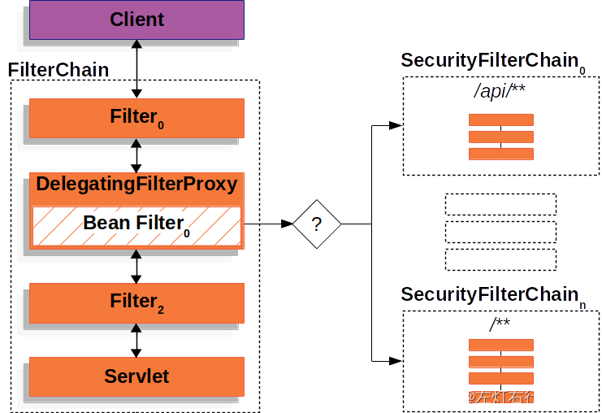

```
In the Multiple SecurityFilterChain Figure FilterChainProxy decides which SecurityFilterChain should be used. 
Only the first SecurityFilterChain that matches will be invoked. 
If a URL of /api/messages/ is requested, it will first match on SecurityFilterChain0's pattern of /api/**, so only SecurityFilterChain0 will be invoked even though it also matches on SecurityFilterChainn.
If a URL of /messages/ is requested, it will not match on SecurityFilterChain0's pattern of /api/**, so FilterChainProxy will continue trying each SecurityFilterChain. 
Assuming that no other, SecurityFilterChain instances match SecurityFilterChainn will be invoked.

翻译：
在多个SecurityFilterChain的图示中，FilterChainProxy决定使用哪个SecurityFilterChain。
只有第一个匹配的SecurityFilterChain会被调用。
如果请求的URL是/api/messages/，它将首先匹配到SecurityFilterChain0的模式/api/**，因此只有SecurityFilterChain0会被调用，即使它也匹配SecurityFilterChainn。
如果请求的URL是/messages/，它不会匹配到SecurityFilterChain0的模式/api/**，因此FilterChainProxy将继续尝试每个SecurityFilterChain。
假设没有其他的SecurityFilterChain实例与之匹配，那么SecurityFilterChainn将被调用。

Notice that SecurityFilterChain0 has only three security Filters instances configured.
However, SecurityFilterChainn has four security Filters configured. 
It is important to note that each SecurityFilterChain can be unique and configured in isolation. 
In fact, a SecurityFilterChain might have zero security Filters if the application wants Spring Security to ignore certain requests.


```

##### SecurityFilterChain和FilterChainProxy区别在哪

SecurityFilterChain和FilterChainProxy是Spring Security中用于处理安全过滤器链的两个关键组件。

* SecurityFilterChain是一个接口，用于定义一组安全过滤器链。  
   每个SecurityFilterChain都包含了一系列的过滤器，用于处理特定的请求或URL路径。它定义了一个方法boolean matches(HttpServletRequest request)，用于确定当前请求是否与该过滤器链匹配。当请求匹配到某个SecurityFilterChain时，其中的过滤器将被调用以完成安全处理。
* FilterChainProxy是Spring Security提供的特殊过滤器，用于管理和调度多个SecurityFilterChain。  
   它充当了整个安全过滤器链的入口点，并根据请求的特征选择合适的SecurityFilterChain来处理请求。FilterChainProxy是一个Servlet过滤器，通过实现javax.servlet.Filter接口来处理请求和响应，并根据配置的SecurityFilterChain来调用相应的安全过滤器链。

**因此，SecurityFilterChain是定义安全过滤器链的接口，而FilterChainProxy是实现了该接口的特殊过滤器，用于管理和调度多个SecurityFilterChain。**  
 FilterChainProxy充当了整个安全过滤器链的代理，根据请求特征选择合适的过滤器链进行处理。

### Security Filters

Spring Security 中给我们提供那些过滤器? 默认情况下那些过滤器会被加载呢？  
 看一下官方文档的描述：

```
 The Security Filters are inserted into the FilterChainProxy with the SecurityFilterChain API.
 The order of Filters matters.
 It is typically not necessary to know the ordering of Spring Security’s Filters. 
 However, there are times that it is beneficial to know the ordering
Below is a comprehensive list of Spring Security Filter ordering:

翻译：
安全过滤器通过SecurityFilterChain的API被插入到FilterChainProxy中。
过滤器的顺序很重要。
通常情况下，不需要知道Spring Security过滤器的顺序。
然而，有时候了解过滤器的顺序是有益的。
下面是Spring Security过滤器的全面排序列表：


```

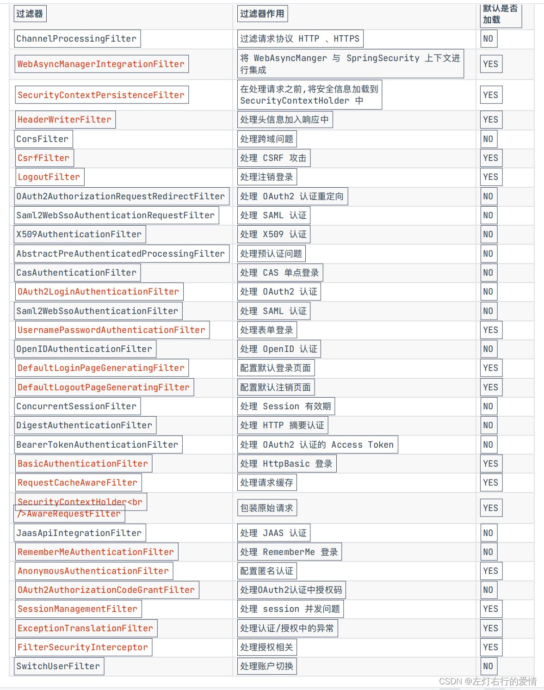

## 结尾

6月底前这个系列肯定更完，大家感兴趣可以种草🥹
