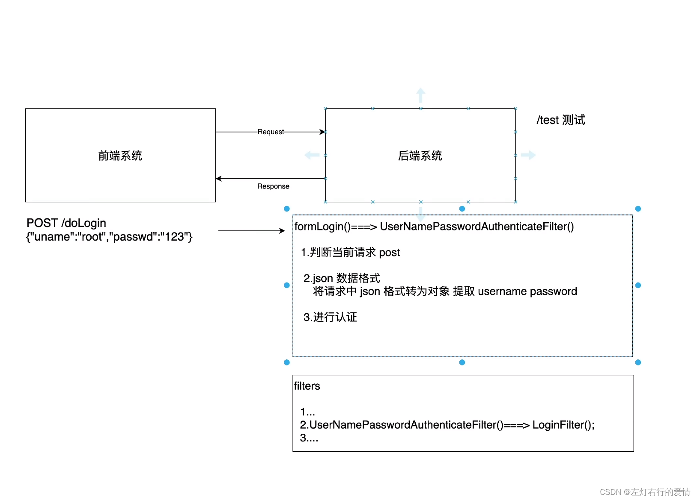

> 原文：[CSDN](https://blog.csdn.net/qq_45852626/article/details/131454099)（历史文章导入，当前状态为草稿）

## 前言

和上一篇一样，从上倒下复制粘贴，所有代码贴完再运行，代码没有问题，只要贴对，都可以顺利跑出来的。

## 难点分析

前端系统给后端传递的数据为json，就会导致后端系统不能再用`request.getParameter`获取用户数据。  
 所以我们要将请求中json格式转换为对象，提取用户数据，然后进行认证。  
 在web传统项目进行认证请求时，底层调用的是`FormLoginConfigurer`，里面用`UsernamePasswordAuthenticationFilter`过滤器中的`attempAuthentication`试图认证的方法进行处理。下面看一下关键代码：

```
	if (this.postOnly && !request.getMethod().equals("POST")) {
			throw new AuthenticationServiceException("Authentication method not supported: " + request.getMethod());
		}
		String username = obtainUsername(request);
		username = (username != null) ? username.trim() : "";
		String password = obtainPassword(request);
		password = (password != null) ? password : "";
		UsernamePasswordAuthenticationToken authRequest = UsernamePasswordAuthenticationToken.unauthenticated(username,
				password);


```

我们可以看到，在前后端分离项目中，上面获取用户名和密码的方式肯定是不可以的（基于request请求获取）。  
 所以我们就不能再用传统的`formLogin`中的`AuthenticationFilter`，我们 要把这个filter做一个重写。

重写的重点是如何获取参数的信息，而且要想有认证功能，最后还是要调用`return this.getAuthenticationManager().authenticate(authRequest);`这行代码。

实现的思路：  
 创建一个`UsernamePasswordAuthenticationFilter`的子类实现，让字类去替换`attempAuthentication`。

我们确定了`UsernamePasswordAuthenticationFilter`不适合作为我们要用的过滤器，所以我们自己创建一个名为`LoginFilter`的过滤器。  
 但是security里面是有一系列的过滤器的，我们要确保`LoginFilter`替换`UsernamePasswordAuthenticationFilter`后位置不变。  
 

## Controller层

`TestController`方法：

```
import org.springframework.web.bind.annotation.GetMapping;
import org.springframework.web.bind.annotation.RestController;

@RestController
public class test {

    @GetMapping("/test")
    public String test(){
        System.out.println("test.....");
        return "test OK!";
    }
}


```

## eneity层

### Role

```
public class Role {
    private Integer id;
    private String name;
    private String nameZh;


    public Integer getId() {
        return id;
    }

    public void setId(Integer id) {
        this.id = id;
    }

    public String getName() {
        return name;
    }

    public void setName(String name) {
        this.name = name;
    }

    public String getNameZh() {
        return nameZh;
    }

    public void setNameZh(String nameZh) {
        this.nameZh = nameZh;
    }
}


```

### User

```
import org.springframework.security.core.GrantedAuthority;
import org.springframework.security.core.authority.SimpleGrantedAuthority;
import org.springframework.security.core.userdetails.UserDetails;

import java.util.*;


public class User implements UserDetails {
        private Integer id;
        private String username;
        private String password;
        private Boolean enabled;
        private Boolean accountNonExpired;
        private Boolean accountNonLocked;
        private Boolean credentialsNonExpired;
        private List<Role> roles = new ArrayList();
        @Override
        public Collection<? extends GrantedAuthority> getAuthorities() {

           Set<GrantedAuthority> authorities = new HashSet();
            roles.forEach(role->{
                SimpleGrantedAuthority simpleGrantedAuthority = new SimpleGrantedAuthority(role.getName());
                authorities.add(simpleGrantedAuthority);
            });
            return authorities;
        }
        @Override
        public String getPassword() {
            return password;
        }
        @Override
        public String getUsername() {
            return username;
        }
        @Override
        public boolean isAccountNonExpired() {
            return accountNonExpired;
        }
        @Override
        public boolean isAccountNonLocked() {
            return accountNonLocked;
        }
        @Override
        public boolean isCredentialsNonExpired() {
            return credentialsNonExpired;
        }
        @Override
        public boolean isEnabled() {
            return enabled;
        }

    public void setRoles(List<Role> roles) {
        this.roles = roles;
    }

    public Integer getId() {
        return id;
    }

    public void setUsername(String username) {
        this.username = username;
    }

    public void setPassword(String password) {
        this.password = password;
    }

    public Boolean getEnabled() {
        return enabled;
    }

    public void setEnabled(Boolean enabled) {
        this.enabled = enabled;
    }

    public Boolean getAccountNonExpired() {
        return accountNonExpired;
    }

    public void setAccountNonExpired(Boolean accountNonExpired) {
        this.accountNonExpired = accountNonExpired;
    }

    public Boolean getAccountNonLocked() {
        return accountNonLocked;
    }

    public void setAccountNonLocked(Boolean accountNonLocked) {
        this.accountNonLocked = accountNonLocked;
    }

    public Boolean getCredentialsNonExpired() {
        return credentialsNonExpired;
    }

    public void setCredentialsNonExpired(Boolean credentialsNonExpired) {
        this.credentialsNonExpired = credentialsNonExpired;
    }

    public List<Role> getRoles() {
        return roles;
    }
}


```

## dao层

```
import com.wang.entity.Role;
import com.wang.entity.User;
import org.apache.ibatis.annotations.Mapper;

import java.util.List;

@Mapper
public interface UserDao {
    //提供根据用户名返回方法
    User loadUserByUsername(String username);

    //提供根据用户id查询用户角色信息方法
    List<Role> getRoleByUid(Integer id);
}


```

## service层

```
import com.wang.dao.UserDao;
import com.wang.entity.Role;
import com.wang.entity.User;
import org.springframework.beans.factory.annotation.Autowired;
import org.springframework.security.core.userdetails.UserDetails;
import org.springframework.security.core.userdetails.UserDetailsService;
import org.springframework.security.core.userdetails.UsernameNotFoundException;
import org.springframework.stereotype.Service;
import org.springframework.util.ObjectUtils;

import java.util.List;

@Service
public class MyUserDetailService implements UserDetailsService {

    private final UserDao userDao;
    @Autowired
    public MyUserDetailService (UserDao userDao){
        this.userDao = userDao;
    }

    @Override
    public UserDetails loadUserByUsername(String username) throws UsernameNotFoundException {
        //1. 查询用户
        User user = userDao.loadUserByUsername(username);
        if (ObjectUtils.isEmpty(user)) {
            throw new UsernameNotFoundException("用户名不存在");
        }
        //2. 查询权限信息
        List<Role> roles = userDao.getRoleByUid(user.getId());
        user.setRoles(roles);
        return user;
    }
}


```

## config层

### LoginFilter

```
import com.fasterxml.jackson.databind.ObjectMapper;
import org.springframework.http.MediaType;
import org.springframework.security.authentication.AuthenticationServiceException;
import org.springframework.security.authentication.UsernamePasswordAuthenticationToken;
import org.springframework.security.core.Authentication;
import org.springframework.security.core.AuthenticationException;
import org.springframework.security.web.authentication.UsernamePasswordAuthenticationFilter;

import javax.servlet.http.HttpServletRequest;
import javax.servlet.http.HttpServletResponse;
import java.io.IOException;
import java.util.Map;

public class LoginFilter extends UsernamePasswordAuthenticationFilter {

    public Authentication attemptAuthentication(HttpServletRequest request, HttpServletResponse response) throws AuthenticationException {
        //1. 判断是否是post方式请求。
        if (!request.getMethod().equals("POST")) {
            throw new AuthenticationServiceException("Authentication method not supported: " + request.getMethod());
        }
        //2. 判断是否是json格式请求类型。
        if(request.getContentType().equalsIgnoreCase(MediaType.APPLICATION_JSON_VALUE)){
            //3. 从json数据中获取用户输入用户名和密码进行认证{"uname":"xxx","password":"xxx"}
            try{
                Map<String,String> userInfo = new ObjectMapper().readValue(request.getInputStream(), Map.class);
                String username = userInfo.get(getUsernameParameter());
                String password =userInfo.get(getPasswordParameter());

                System.out.println("用户名："+username + "密码："+password);

                UsernamePasswordAuthenticationToken authRequest = new UsernamePasswordAuthenticationToken(username,password);

                setDetails(request,authRequest);
                return this.getAuthenticationManager().authenticate(authRequest);
            } catch (IOException e) {
              e.printStackTrace();
            }
        }
        return super.attemptAuthentication(request,response);
    }
}


```

### SecurityConfig

```
import com.fasterxml.jackson.databind.ObjectMapper;
import com.wang.service.MyUserDetailService;
import org.springframework.beans.factory.annotation.Autowired;
import org.springframework.context.annotation.Bean;
import org.springframework.context.annotation.Configuration;
import org.springframework.http.HttpMethod;
import org.springframework.http.HttpStatus;
import org.springframework.http.MediaType;
import org.springframework.security.authentication.AuthenticationManager;
import org.springframework.security.config.annotation.authentication.builders.AuthenticationManagerBuilder;
import org.springframework.security.config.annotation.web.builders.HttpSecurity;
import org.springframework.security.config.annotation.web.configuration.WebSecurityConfiguration;
import org.springframework.security.config.annotation.web.configuration.WebSecurityConfigurerAdapter;
import org.springframework.security.core.userdetails.User;
import org.springframework.security.core.userdetails.UserDetailsService;
import org.springframework.security.provisioning.InMemoryUserDetailsManager;
import org.springframework.security.web.authentication.UsernamePasswordAuthenticationFilter;
import org.springframework.security.web.util.matcher.AntPathRequestMatcher;
import org.springframework.security.web.util.matcher.OrRequestMatcher;

import javax.print.attribute.standard.Media;
import java.util.HashMap;
import java.util.Map;

@Configuration
public class SecurityConfig extends WebSecurityConfigurerAdapter {

    private final MyUserDetailService myUserDetailService;
    @Autowired
    public SecurityConfig(MyUserDetailService myUserDetailService){
        this.myUserDetailService = myUserDetailService;
    }
//    @Bean
//    public UserDetailsService userDetailsService() {
//        InMemoryUserDetailsManager inMemoryUserDetailsManager = new InMemoryUserDetailsManager();
//        inMemoryUserDetailsManager.createUser(User.withUsername("root").password("{noop}123").roles("admin").build());
//        return inMemoryUserDetailsManager;
//    }

    @Override
    protected void configure(AuthenticationManagerBuilder auth) throws Exception {
        auth.userDetailsService(myUserDetailService);
    }

    @Override
    @Bean
    public AuthenticationManager authenticationManagerBean() throws Exception {
        return super.authenticationManagerBean();
    }

    //自定义filter交给工厂管理
    @Bean
    public LoginFilter loginFilter() throws Exception {
        LoginFilter loginFilter = new LoginFilter();
        loginFilter.setFilterProcessesUrl("/doLogin"); //指定认证的url
        loginFilter.setUsernameParameter("uname"); //指定接受json 用户名key
        loginFilter.setPasswordParameter("passwd"); //指定接受json 密码key
        loginFilter.setAuthenticationManager(authenticationManagerBean());
        loginFilter.setAuthenticationSuccessHandler(
                ((request, response, authentication) -> {
                    Map<String, Object> result = new HashMap<>();
                    result.put("msg", "登陆成功");
                    result.put("用户信息", authentication.getPrincipal());
                    response.setContentType("application/json;charset=UTF-8");
                    response.setStatus(HttpStatus.OK.value());
                    String s = new ObjectMapper().writeValueAsString(result);
                    response.getWriter().println(s);
                })
        ); //认证成功处理
        loginFilter.setAuthenticationFailureHandler(
                ((request, response, exception) -> {
                    Map<String, Object> result = new HashMap<>();
                    result.put("msg", "登陆失败：" + exception.getMessage());
                    response.setContentType("application/json;charset=UTF-8");
                    response.setStatus(HttpStatus.INTERNAL_SERVER_ERROR.value());
                    String s = new ObjectMapper().writeValueAsString(result);
                    response.getWriter().println(s);
                })
        ); //认证失败处理
        return loginFilter;
    }

    @Override
    protected void configure(HttpSecurity http) throws Exception {
        http.authorizeHttpRequests()
                .anyRequest().authenticated() //所有请求必须认证
                .and()
                .formLogin()
                .and()
                .exceptionHandling()
                .authenticationEntryPoint(
                        ((request, response, authException) -> {
                            response.setContentType(MediaType.APPLICATION_JSON_UTF8_VALUE);
                            response.setStatus(HttpStatus.UNAUTHORIZED.value());
                            response.getWriter().println("请认证后再去处理！");
                        })
                )
                .and()
                .logout()
                .logoutRequestMatcher(
                        new OrRequestMatcher(
                                new AntPathRequestMatcher("/logout", HttpMethod.DELETE.name()),
                                new AntPathRequestMatcher("/logout", HttpMethod.GET.name())
                        )
                )
                .logoutSuccessHandler(
                        ((request, response, authentication) -> {
                            Map<String, Object> result = new HashMap<>();
                            result.put("msg", "注销成功");
                            result.put("用户信息", authentication.getPrincipal());
                            response.setContentType("application/json;charset=UTF-8");
                            response.setStatus(HttpStatus.OK.value());
                            String s = new ObjectMapper().writeValueAsString(result);
                            response.getWriter().println(s);
                        })
                )
                .and()
                .csrf().disable();
        // at:用来某个filter替换过滤器链中的某个filter。
        http.addFilterAt(loginFilter(), UsernamePasswordAuthenticationFilter.class);
    }
}


```

## resources

### mapper

```
<?xml version="1.0" encoding="UTF-8"?>
<!DOCTYPE mapper
        PUBLIC "-//mybatis.org//DTD Mapper 3.0//EN"
        "http://mybatis.org/dtd/mybatis-3-mapper.dtd">
<mapper namespace="com.wang.dao.UserDao">

    <!--        更具用户名查询用户方法-->
    <select id="loadUserByUsername" resultType="com.wang.entity.User">
        select id,
               username,
               password,
               enabled,
               accountNonExpired,
               accountNonLocked,
               credentialsNonExpired
        from user
        where username = #{username}
    </select>
    <!--        查询指定⾏数据-->
    <select id="getRoleByUid" resultType="com.wang.entity.Role">
        select r.id,
               r.name,
               r.name_zh nameZh
        from role r,
             user_role ur
        where r.id = ur.rid
          and ur.uid = #{uid}
    </select>
</mapper>


```

## properties

```
server.port= 9092
# 关闭thymeleaf 缓存
spring.thymeleaf.cache= false


# 配置数据源
spring.datasource.type= com.alibaba.druid.pool.DruidDataSource
spring.datasource.driver-class-name= com.mysql.cj.jdbc.Driver
spring.datasource.url= jdbc:mysql://localhost:3306/security?characterEncoding=UTF-8&useSSL=false&&serverTimezone=CST
spring.datasource.username= 你的账号
spring.datasource.password= 你的密码

# Mybatis配置
# 注意mapper目录必须用"/"
mybatis.mapper-locations= classpath:com/wang/mapper/*.xml
mybatis.type-aliases-package=com.example.eneity

# 日志处理
logging.level.com.example = debug


```

## pom.xml

```
    <dependencies>
        <dependency>
            <groupId>com.alibaba</groupId>
            <artifactId>druid</artifactId>
            <version>1.1.16</version>
        </dependency>
        <dependency>
            <groupId>mysql</groupId>
            <artifactId>mysql-connector-java</artifactId>
            <version>8.0.18</version>
        </dependency>
        <dependency>
            <groupId>org.mybatis.spring.boot</groupId>
            <artifactId>mybatis-spring-boot-starter</artifactId>
            <version>2.2.0</version>
        </dependency>
        <dependency>
            <groupId>org.springframework.boot</groupId>
            <artifactId>spring-boot-starter-security</artifactId>
        </dependency>
        <dependency>
            <groupId>org.springframework.boot</groupId>
            <artifactId>spring-boot-starter-thymeleaf</artifactId>
        </dependency>
        <dependency>
            <groupId>org.springframework.boot</groupId>
            <artifactId>spring-boot-starter-web</artifactId>
        </dependency>
        <dependency>
            <groupId>org.thymeleaf.extras</groupId>
            <artifactId>thymeleaf-extras-springsecurity5</artifactId>
        </dependency>

        <dependency>
            <groupId>org.springframework.boot</groupId>
            <artifactId>spring-boot-starter-test</artifactId>
            <scope>test</scope>
        </dependency>
        <dependency>
            <groupId>org.springframework.security</groupId>
            <artifactId>spring-security-test</artifactId>
            <scope>test</scope>
        </dependency>
    </dependencies>


```

## 结尾

所有代码都是测试过的，保证没有问题，如果存在错误，请仔细检查，欢迎留言讨论，结合编程不良人视频配套更佳。
