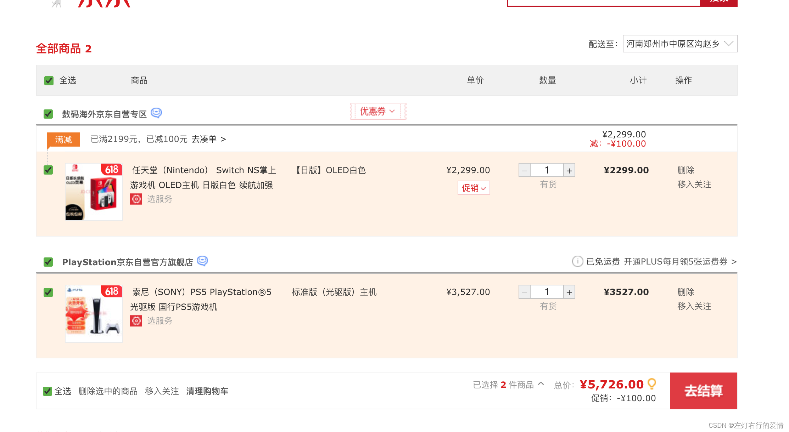

> 原文：[CSDN](https://blog.csdn.net/qq_45852626/article/details/130958636)（历史文章导入，当前状态为草稿）

## 分析购物车业务流程



### 第一个问题：购物车中的商品、促销信息是静态的还是动态获取的？

* 静态获取：用户在将商品加入购物车的时候，在购物车中存储加入购物车的商品所需要展示的各种信息，例如上面展示的商品的主图文描、促销等等。
* 动态获取：查看购车的时候，再去实时调用相应的系统获取最新的信息。、

回答：  
 购物车的数据只会存储必要的商品信息，其他的信息完全是动态获取的。  
 原因在于——加入购物车时如果是静态存储的，下一次查看购物车的时候，展示的信息可能不准确。  
 在下一次查看购物车时，商品信息可能会发生变化（比如：商品被下架了、商品的主图被调整了、或者主题被修改了、商品的促销信息也可能会发生变化。）  
 所以比较精准的做法是在展示购物车的时候，再去实时拉取一次商品的详细信息以及当前的最新促销信息。

### 第二个问题：购物车主要存储哪些数据呢？

为了保证购物车展示给用户信息的准确性，购物车只存了最基本的一些信息，绝大部分的信息都是在用户查看购物车那一刹那实时计算出来的。下面举个例子。

```
uid : 用户id
shopid : 商家id
Skuid : 商品id
promotionid : 促销id
addprice : 加购价格
buytime : 加购时间
buycount : 购买数量
modifytime :  修改时间
selected :  是否选中
skuSaleVo：销售属性总和


```

### 第三个问题：购物车用什么来存数据

回答：  
 这个需要根据业务场景去分析  
 业务场景：购物车是高读高写的业务场景，如果用mysql的话会对数据库造成很大的压力，所以这里我们去用redis来存储。

### 购物车存储的数据结构是什么样子的

分析：  
 每个购物车中的商品都是sku的信息，如上面问题中展示的那样。  
 购物车里面不止一条数据，因此是对象的数组，即：

```
[
{...},{...},{...}
]


```

Redis有5种不同的数据结构，选择哪一种会比较合适呢？

* 首先不同用户应该有独立的购物车，因此购物车应该以用户作为key来存储，value是用户的所有购物车信息。因此，基本的`k-v`结构就可以了。
* 对购物车进行CRUD时，基本都需要根据商品id进行判断，那么为了方便，购物车商品也应该是`k-v`结构，key是商品id，value是这个购物车商品的信息。  
   综上所述：购物车结构应该是一个双层Map，Map<String,Map<String,String>>。

### 埋坑，近期会更的。
